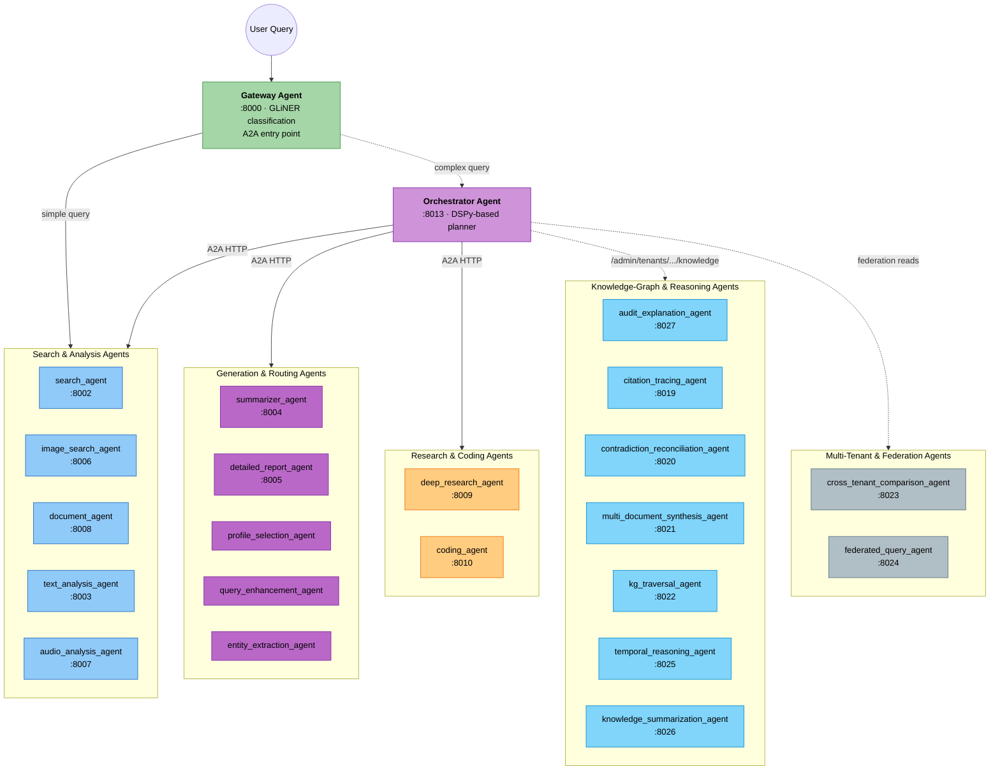

# Cogniverse - Self-Optimizing Content Intelligence Platform

**Experience-Guided Multi-Agent System for Multi-Modal Understanding**


Multi-agent AI platform for video, audio, image, and document understanding. Processes all content types using ColPali, VideoPrism, ColQwen, and LateOn embeddings with Vespa-backed retrieval. Agents coordinate via A2A protocol with DSPy-powered reasoning, streaming responses, and Phoenix observability. 13-package UV workspace with multi-tenant isolation.

## 🎯 What Makes Cogniverse Different

- **🧠 Self-Optimizing**: Learns from every interaction using GEPA (Genetic-Pareto reflective prompt evolution) - routing strategies improve continuously from real usage
- **🎭 Multi-Modal Intelligence**: Process any content type (video, audio, images, documents, text, dataframes) with unified understanding
- **🤖 Multi-Agent Orchestration**: DSPy 3.1 A2A protocol-based coordination of specialized agents working together
- **🔀 Cross-Modal Fusion**: Intelligent combination of insights across different modalities for richer understanding
- **⚡ Production Performance**: <500ms P95 latency at 500+ concurrent users with 7 Vespa ranking strategies
- **🎯 Multiple SOTA Models**: ColPali (frame-level), VideoPrism (global+temporal), ColQwen (multi-modal fusion)
- **🏢 Multi-Tenant Ready**: Complete schema-per-tenant isolation with independent Phoenix projects and memory
- **📊 Full Observability**: Comprehensive Phoenix telemetry with traces, experiments, and real-time dashboards
- **🧪 Evaluation Framework**: Provider-agnostic metrics with reference-free, visual LLM, and classical evaluators
- **🏗️ Professional Architecture**: 13-package layered structure (Foundation → Core → Implementation → Application)

## 🎬 Use Cases

**For Individual Developers:**
- Build intelligent content search applications across any modality
- Experiment with multiple state-of-the-art embedding models
- Learn multi-agent AI architectures with production-quality code
- Use locally with Ollama (no API costs)

**For Researchers:**
- Run experiments with different embedding strategies and evaluate results
- Optimize routing agents with synthetic data generation
- Track all experiments with comprehensive Phoenix telemetry
- Publish reproducible results with full observability

**For Teams & Organizations:**
- Deploy multi-tenant SaaS applications with complete data isolation
- Achieve production-scale performance (<500ms P95 at 500+ users)
- Monitor and optimize with comprehensive dashboards
- Scale from prototype to production with professional architecture

## 🚀 Quick Start

### Prerequisites
- Python 3.12+
- 16GB+ RAM
- CUDA-capable GPU (recommended for VideoPrism)
- Docker for Vespa and Phoenix
- uv package manager: `pip install uv`

### Installation

```bash
# Clone repository
git clone <repo>
cd cogniverse

# Install dependencies
uv sync

# Start infrastructure
cogniverse up  # Starts Vespa, Phoenix, Ollama via k3d

# Verify services
curl -s http://localhost:8080/ApplicationStatus  # Vespa
curl -s http://localhost:26006/health           # Phoenix
```

### Basic Operations

#### 1. Content Ingestion (All Modalities)
```bash
# Ingest videos with ColPali embeddings
uv run python scripts/run_ingestion.py \
    --tenant-id default \
    --video_dir data/testset/evaluation/sample_videos \
    --profile video_colpali_smol500_mv_frame

# Multi-modal multi-profile ingestion (video, audio, images, documents)
uv run python scripts/run_ingestion.py \
    --tenant-id default \
    --content-dir data/testset/evaluation/sample_videos \
    --profile video_colpali_smol500_mv_frame \
               video_videoprism_base_mv_chunk_30s \
               video_colqwen_omni_mv_chunk_30s
```

#### 2. Multi-Modal Search
```bash
# Multi-agent intelligent search across all content
uv run python tests/comprehensive_video_query_test_v2.py \
    --profiles video_colpali_smol500_mv_frame \
    --test-multiple-strategies

# Direct API query
curl -X POST http://localhost:28000/search/ \
  -H "Content-Type: application/json" \
  -d '{"query": "machine learning tutorial", "tenant_id": "default", "profile": "video_colpali_smol500_mv_frame", "top_k": 10}'
```

#### 3. Evaluation & Optimization
```bash
# Run Phoenix experiments
uv run python scripts/run_experiments_with_visualization.py \
    --dataset-name golden_eval_v1 \
    --profiles video_colpali_smol500_mv_frame \
    --test-multiple-strategies \
    --quality-evaluators

# Launch Phoenix dashboard
uv run streamlit run libs/dashboard/cogniverse_dashboard/app.py
# Open http://localhost:8501
```

## 📁 UV Workspace Structure

```text
cogniverse/
├── libs/                         # SDK Packages (UV workspace - 13 packages)
│   ├── sdk/                      # cogniverse_sdk (Foundation Layer)
│   │   └── cogniverse_sdk/
│   │       ├── interfaces/       # Backend interfaces
│   │       └── document.py       # Universal document model
│   ├── foundation/               # cogniverse_foundation (Foundation Layer)
│   │   └── cogniverse_foundation/
│   │       ├── config/           # Configuration base
│   │       └── telemetry/        # Telemetry interfaces
│   ├── core/                     # cogniverse_core (Core Layer)
│   │   └── cogniverse_core/
│   │       ├── agents/           # Agent base classes
│   │       ├── registries/       # Component registries
│   │       └── common/           # Shared utilities
│   ├── evaluation/               # cogniverse_evaluation (Core Layer)
│   │   └── cogniverse_evaluation/
│   │       ├── core/             # Experiment tracking
│   │       ├── metrics/          # Provider-agnostic metrics
│   │       └── data/             # Dataset & trace storage
│   ├── telemetry-phoenix/        # cogniverse_telemetry_phoenix (Core Layer - Plugin)
│   │   └── cogniverse_telemetry_phoenix/
│   │       ├── provider.py       # Phoenix telemetry provider
│   │       └── evaluation/       # Phoenix evaluation provider
│   ├── agents/                   # cogniverse_agents (Implementation Layer)
│   │   └── cogniverse_agents/
│   │       ├── routing/          # DSPy routing & optimization
│   │       ├── search/           # Multi-modal search & reranking
│   │       └── mixins/           # RLM/memory-aware mixins
│   ├── vespa/                    # cogniverse_vespa (Implementation Layer)
│   │   └── cogniverse_vespa/
│   │       ├── config/           # Backend config
│   │       ├── registry/         # Schema/backend registry
│   │       └── backend.py        # Vespa backend (flat module)
│   ├── synthetic/                # cogniverse_synthetic (Implementation Layer)
│   │   └── cogniverse_synthetic/
│   │       ├── generators/       # Synthetic data generators
│   │       └── service.py        # Synthetic data service
│   ├── finetuning/               # cogniverse_finetuning (Implementation Layer)
│   │   └── cogniverse_finetuning/
│   │       ├── training/         # LoRA/PEFT and DPO training
│   │       ├── dataset/          # Fine-tuning dataset prep
│   │       └── evaluation/       # Fine-tuned model evaluation
│   ├── runtime/                  # cogniverse_runtime (Application Layer)
│   │   └── cogniverse_runtime/
│   │       ├── main.py           # FastAPI app + entrypoint
│   │       ├── routers/          # API route modules
│   │       ├── ingestion/        # Video processing pipeline
│   │       └── ingestion_worker/ # Async ingestion worker
│   ├── dashboard/                # cogniverse_dashboard (Application Layer)
│   │   └── cogniverse_dashboard/
│   │       ├── tabs/             # Per-tab Streamlit views
│   │       └── app.py            # Streamlit entrypoint
│   ├── cli/                      # cogniverse_cli (Application Layer)
│   │   └── cogniverse_cli/
│   │       └── main.py           # `cogniverse` CLI entrypoint
│   └── messaging/                # cogniverse_messaging (Application Layer)
│       └── cogniverse_messaging/
│           ├── telegram_handler.py  # Telegram bot integration
│           └── gateway.py           # Messaging gateway
├── docs/                         # Comprehensive documentation
│   ├── architecture/             # System architecture
│   ├── modules/                  # Module documentation
│   ├── operations/               # Deployment & configuration
│   ├── development/              # Development guides
│   ├── diagrams/                 # Architecture diagrams
│   └── testing/                  # Testing guides
├── scripts/                      # Operational scripts
├── tests/                        # Test suite (by package)
├── configs/                      # Configuration & schemas
├── pyproject.toml                # Workspace root
└── uv.lock                       # Unified lockfile
```

**Package Dependencies (Layered Architecture):**
```text
Foundation Layer:
  cogniverse_sdk (zero internal dependencies)
    ↓
  cogniverse_foundation (depends on sdk)

Core Layer:
  cogniverse_core (depends on sdk, foundation, evaluation)
  cogniverse_evaluation (depends on sdk, foundation)
  cogniverse_telemetry_phoenix (plugin - depends on core, evaluation)

Implementation Layer:
  cogniverse_agents (depends on sdk, core, synthetic)
  cogniverse_vespa (depends on sdk, core)
  cogniverse_synthetic (depends on sdk, foundation)
  cogniverse_finetuning (depends on sdk, core, agents, synthetic, foundation)

Application Layer:
  cogniverse_runtime (depends on sdk, core; agents and vespa are optional extras)
  cogniverse_dashboard (depends on sdk, core, agents, evaluation, vespa, telemetry_phoenix)
  cogniverse_cli (no internal package dependencies)
  cogniverse_messaging (no internal package dependencies)
```

## 🏗️ Architecture

### Multi-Agent Orchestration



The Gateway Agent classifies each query with GLiNER zero-shot NER and either routes it directly to the appropriate specialized agent (fast path) or hands it to the Orchestrator Agent for complex, multi-step handling. Memory is provided via `MemoryAwareMixin` composed into individual agents, not a standalone memory agent. Dashed arrows above mark paths that are conditional (complex-query handoff) or reached through a REST layer rather than a direct A2A call.

### The 23 Agents

Ports and `enabled` status come from `configs/config.json` (`agents.*`); dashed groups above (Knowledge-Graph & Reasoning, Multi-Tenant & Federation) are mostly `enabled: false` by default and are reached via `/admin/tenants/{tenant_id}/knowledge/*` REST routes rather than the main orchestration path.

**Search & Analysis Agents**

| Agent | Port | Status | What it does |
|---|---|---|---|
| `search_agent` | 8002 | enabled | Multi-modal retrieval across video/image/text/audio/document via Vespa, with DSPy query rewriting and RRF ensemble fusion across profiles. |
| `image_search_agent` | 8006 | enabled | ColPali multi-vector image similarity search (semantic or BM25+ColPali hybrid) plus image-to-image lookup. |
| `document_agent` | 8008 | enabled | Dual-strategy document search: ColPali visual (page-as-image), ColBERT/BM25 text, or hybrid, with keyword-based auto strategy selection. |
| `text_analysis_agent` | 8003 | enabled | Runtime-configurable DSPy text analysis (sentiment/summary/entities) with per-tenant persisted config and a `/analyze` endpoint. |
| `audio_analysis_agent` | 8007 | enabled | Whisper transcription + Vespa audio search supporting transcript (BM25), acoustic (CLAP nearest-neighbor), and hybrid modes. |

**Generation & Routing Agents**

| Agent | Port | Status | What it does |
|---|---|---|---|
| `gateway_agent` | 8000 | enabled | LLM-free A2A entry point; classifies queries via GLiNER and routes simple ones directly, complex ones to the orchestrator. |
| `orchestrator_agent` | 8013 | enabled | Plans a multi-agent workflow with DSPy, then executes it by calling sub-agents over A2A HTTP, with checkpoint/resume and cross-modal fusion. |
| `summarizer_agent` | 8004 | enabled | Turns search results into structured summaries with a thinking phase and VLM visual analysis. |
| `detailed_report_agent` | 8005 | enabled | Generates comprehensive reports (executive summary, findings, technical + visual analysis, recommendations) with optional RLM synthesis. |
| `profile_selection_agent` | 8000\* | enabled | Uses DSPy reasoning to pick the optimal backend search profile for a query, with a heuristic fallback. |
| `query_enhancement_agent` | 8000\* | enabled | Expands and rewrites queries with synonyms, context, and RRF variants using DSPy. |
| `entity_extraction_agent` | 8000\* | enabled | Tiered NER: fast GLiNER + SpaCy path (no LLM) with a DSPy fallback. |

\* `gateway_agent`, `profile_selection_agent`, `query_enhancement_agent`, and `entity_extraction_agent` share the config port `8000` — they run as in-process helpers invoked by the `AgentDispatcher` rather than standalone A2A servers.

**Research & Coding Agents**

| Agent | Port | Status | What it does |
|---|---|---|---|
| `deep_research_agent` | 8009 | enabled | Decomposes a query, iteratively gathers evidence via parallel searches, and synthesizes a cited report. |
| `coding_agent` | 8010 | enabled | Iterative coding agent: searches code semantically, plans and generates code with DSPy, and runs it in an OpenShell sandbox, looping on failures. |

**Knowledge-Graph & Reasoning Agents**

| Agent | Port | Status | What it does |
|---|---|---|---|
| `audit_explanation_agent` | 8027 | enabled | Explains why an answer memory was produced — its derivation chain, per-source trust, and active contradictions. |
| `citation_tracing_agent` | 8019 | disabled | Walks a memory's provenance chain back to its primary sources. |
| `contradiction_reconciliation_agent` | 8020 | disabled | Resolves conflict sets by applying a knowledge schema's contradiction policy over member memories. |
| `multi_document_synthesis_agent` | 8021 | disabled | Synthesizes a coherent answer across N source documents while preserving the citation graph. |
| `kg_traversal_agent` | 8022 | disabled | Structurally walks `kg_node`/`entity_fact` and `kg_edge` memories from a seed entity into a node+edge graph view. |
| `temporal_reasoning_agent` | 8025 | disabled | Compares a subject's knowledge across explicit time windows using provenance timestamps. |
| `knowledge_summarization_agent` | 8026 | disabled | Distills a knowledge subgraph into a structured, citation-aware summary with optional admin-gated promotion to the org trunk. |

**Multi-Tenant & Federation Agents**

| Agent | Port | Status | What it does |
|---|---|---|---|
| `cross_tenant_comparison_agent` | 8023 | disabled | Compares per-tenant views of one subject across all tenants in an org via the federation read path. |
| `federated_query_agent` | 8024 | disabled | Answers a free-text query by aggregating federated reads across multiple tenants in the same org, with an optional RLM summariser. |

### Embedding Models

| Model | Type | Dimensions | Use Case |
|-------|------|------------|----------|
| **ColPali** | Frame-level | 320 (patch vector) | Visual document search |
| **VideoPrism Base** | Global video | 768 | Semantic video understanding |
| **VideoPrism LVT** | Temporal | 768/1024 | Action/motion search |
| **ColQwen3 Omni** (TomoroAI/tomoro-colqwen3-embed-4b) | Multi-modal | 320 (patch vector) | Text+visual fusion |

### Vespa Ranking Strategies

1. **bm25_only** - Text-only BM25
2. **float_float** - Dense embeddings only
3. **binary_binary** - Binary embeddings only
4. **float_binary** - Float query with binary document embeddings
5. **phased** - Two-phase ranking: binary first, float reranking
6. **hybrid_float_bm25** - BM25 + dense float embeddings (recommended)
7. **hybrid_binary_bm25** - BM25 + binary embeddings

## 🔧 Configuration

### Multi-Tenant Setup
```python
from cogniverse_foundation.config.unified_config import SystemConfig
from cogniverse_foundation.config.utils import create_default_config_manager
from cogniverse_core.schemas.filesystem_loader import FilesystemSchemaLoader
from cogniverse_agents.search_agent import SearchAgent, SearchAgentDeps, SearchInput
from pathlib import Path

# System-level infrastructure config — global, not per-tenant
config = SystemConfig(
    backend_url="http://localhost",
    backend_port=8080,
    telemetry_url="http://localhost:6006",
)

# Create agent — tenant-agnostic at construction; tenant_id arrives per-request
config_manager = create_default_config_manager()
schema_loader = FilesystemSchemaLoader(Path("configs/schemas"))
deps = SearchAgentDeps(backend_url=config.backend_url, backend_port=config.backend_port)
agent = SearchAgent(deps=deps, schema_loader=schema_loader, config_manager=config_manager)

# Search with per-request tenant_id and profile
# Agent automatically targets schema: video_colpali_smol500_mv_frame_acme_corp
result = await agent.process(
    SearchInput(
        query="machine learning tutorial",
        tenant_id="acme_corp",
        profiles=["video_colpali_smol500_mv_frame"],
        top_k=10,
    )
)
```

### DSPy Optimization
```python
from cogniverse_foundation.config.unified_config import RoutingConfigUnified

# Configure per-tenant routing and DSPy auto-optimization behavior
routing_config = RoutingConfigUnified(
    tenant_id="acme_corp",
    dspy_enabled=True,
    enable_auto_optimization=True,
    optimization_interval_seconds=3600,
    min_samples_for_optimization=100,
)
```

## 📊 Monitoring & Evaluation

### Phoenix Dashboard
Access comprehensive telemetry at http://localhost:8501:
- **Traces**: Request flow visualization
- **Experiments**: A/B testing results
- **Metrics**: Performance analytics
- **Memory**: Context tracking
- **Configuration**: Live config management

### Evaluation Metrics
- **Reference-Free**: Quality, Diversity, Distribution scores
- **Visual LLM**: Pluggable OpenAI-compatible vision judge (ConfigurableVisualJudge)
- **Classical**: MRR, NDCG, Precision@k, Recall@k
- **Phoenix Experiments**: Automatic tracking and comparison

## 🧪 Testing

```bash
# Run full test suite (30 min timeout for integration tests)
JAX_PLATFORM_NAME=cpu uv run pytest --timeout=1800

# Unit tests only (per package: tests/<package>/unit/)
JAX_PLATFORM_NAME=cpu uv run pytest tests/agents/unit/

# Integration tests (per package: tests/<package>/integration/)
JAX_PLATFORM_NAME=cpu uv run pytest tests/agents/integration/

# Specific component
JAX_PLATFORM_NAME=cpu uv run pytest tests/agents/ -v
```

## 📚 Documentation

### Architecture
- [Architecture Overview](docs/architecture/overview.md) - System design and multi-tenant architecture
- [SDK Architecture](docs/architecture/sdk-architecture.md) - UV workspace and 13-package layered architecture
- [Multi-Tenant Architecture](docs/architecture/multi-tenant.md) - Complete tenant isolation patterns
- [System Flows](docs/architecture/system-flows.md) - 20+ architectural diagrams

### Operations & Deployment
- [Setup & Installation](docs/operations/setup-installation.md) - UV workspace installation
- [Configuration Guide](docs/operations/configuration.md) - Multi-tenant configuration
- [Deployment Guide](docs/operations/deployment.md) - Docker, Modal, Kubernetes
- [Multi-Tenant Operations](docs/operations/multi-tenant-ops.md) - Tenant lifecycle management

### Development
- [Package Development](docs/development/package-dev.md) - SDK package workflows
- [Scripts & Operations](docs/development/scripts-operations.md) - Operational scripts
- [Testing Guide](docs/testing/pytest-best-practices.md) - SDK and multi-tenant testing

### Module Documentation
- [Agents](docs/modules/agents.md) - Agent implementations
- [Routing](docs/modules/routing.md) - Query routing and optimization
- [Ingestion](docs/modules/ingestion.md) - Video processing pipeline
- [Search & Reranking](docs/modules/search-reranking.md) - Multi-modal search
- [Telemetry](docs/modules/telemetry.md) - Phoenix integration
- [Evaluation](docs/modules/evaluation.md) - Experiment tracking
- [Backends](docs/modules/backends.md) - Vespa integration
- [Common](docs/modules/common.md) - Utilities and cache

### Diagrams
- [SDK Architecture Diagrams](docs/diagrams/sdk-architecture-diagrams.md)
- [Multi-Tenant Diagrams](docs/diagrams/multi-tenant-diagrams.md)

## 🚀 Production Deployment

### Unified Deployment
```bash
# Start all services via k3d/Helm
cogniverse up

# Check status
cogniverse status
```

### Modal (VLM Sidecar)
```bash
# Deploy the serverless VLM sidecar used by the video processing pipeline
modal deploy scripts/modal_vlm_service.py
```
See [docs/modal/deploy_modal_vlm.md](docs/modal/deploy_modal_vlm.md) for the full setup — Modal serves an image-description VLM sidecar for ingestion, not the whole application.

## 🔐 Security

- **Multi-tenant isolation**: Schema-per-tenant data separation
- **Rate limiting**: Per-workflow limits (e.g., deep-research synthesis)
- **Observability**: Operations traced via Phoenix telemetry

## 🎯 Performance Targets

| Metric | Target | Current |
|--------|--------|---------|
| **Query Latency P95** | < 500ms | 450ms |
| **Ingestion Speed** | 10 videos/min | 12 videos/min |
| **Concurrent Users** | 500 | 600 |
| **Cache Hit Rate** | > 40% | 45% |
| **Routing Accuracy** | > 90% | 92% |

## 🤝 Contributing

See the [Developer Guide](docs/DEVELOPER_GUIDE.md) for detailed contribution guidelines.

### Quick Reference

**Code Standards:**
- Use type hints for all function signatures
- Add docstrings to public functions (Google style)
- Follow PEP 8 with `ruff` for linting
- Use `uv run` for all Python commands

**Commit Standards:**
- Use imperative mood: `Add`, `Fix`, `Update`, `Refactor`, `Remove`
- Subject line: WHAT changed (under 72 chars)
- Body: WHY the change was needed (for non-trivial changes)

**Pre-Commit Checklist:**
- Run `uv run pytest` and ensure 100% pass rate
- Run `uv run ruff check` with no errors
- Update documentation for significant changes
- Never commit failing tests or skip markers

## 📝 License

[License information here]

## 🆘 Support

- GitHub Issues: [Report bugs](https://github.com/org/cogniverse/issues)
- Documentation: [Read the docs](docs/)
- Phoenix Dashboard: http://localhost:8501

---