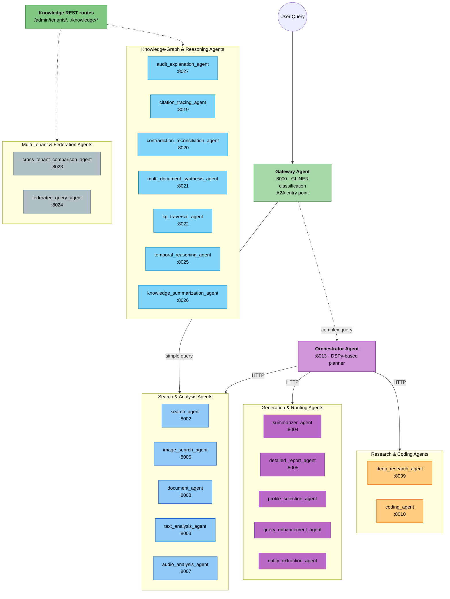

# Cogniverse

Multi-agent platform for search and analysis over video, audio, image, and document content. Content is embedded with ColQwen3 (ColPali-style), X-CLIP, LateOn, DenseOn, and CLAP models and retrieved from Vespa. Agents use DSPy for reasoning and coordinate over the A2A protocol, with streaming responses and Phoenix tracing. 13-package uv workspace with multi-tenant isolation.

## Features

- **Self-optimizing**: Argo CronWorkflows compile the entity-extraction, query-enhancement, and profile-selection DSPy modules, tune the gateway's routing thresholds, and build orchestrator workflow templates from Phoenix spans and tenant ground truth. When the search, summarizer, or detailed-report agent's quality drops, the quality monitor submits an Argo workflow that recompiles it, using GEPA reflective prompt evolution when it has only failing examples. Agents load the resulting artifacts
- **Multi-modal**: Ingestion and search profiles for video, images, audio, documents, code, and wiki pages
- **Multi-agent orchestration**: DSPy 3.4 agents coordinated over the A2A protocol
- **Cross-modal fusion**: The orchestrator combines results from agents working on different modalities
- **Embedding models**: ColQwen3 (`TomoroAI/tomoro-colqwen3-embed-4b`) for video frames, images, and visual documents; X-CLIP for video clips; LateOn, LateOn-Code, and DenseOn for text and code; CLAP for audio
- **Multi-tenant**: Schema-per-tenant Vespa isolation, per-tenant Phoenix projects, and per-tenant memory
- **Observability**: Phoenix traces and experiments, plus the Cogniverse web client (chat with every agent and operations views)
- **Evaluation**: Provider-agnostic reference-free, visual LLM, and classical retrieval metrics
- **Layered workspace**: 13 packages (Foundation → Core → Implementation → Application)

## Use Cases

**For Individual Developers:**
- Build content search across video, images, audio, and documents
- Compare embedding models and ranking strategies
- Study a multi-agent A2A/DSPy architecture
- Run the full stack locally, with no hosted-API costs

**For Researchers:**
- Run experiments with different embedding strategies and evaluate results
- Optimize routing agents with synthetic data generation
- Track experiments in Phoenix

**For Teams & Organizations:**
- Deploy multi-tenant applications with per-tenant schemas, telemetry projects, and memory
- Monitor and optimize from the Phoenix UI and the Cogniverse web client
- Deploy with Helm on k3d or on an existing Kubernetes cluster

## Quick Start

### Prerequisites
- Python 3.12
- uv 0.12.19: `curl -LsSf https://astral.sh/uv/0.12.19/install.sh | sh`
- Docker, kubectl, helm, and k3d (`cogniverse up` checks for them and offers to install missing ones)
- An AMD (ROCm) or NVIDIA (CUDA) GPU for the in-cluster visual embedding model; the CPU overlay deploys none
- PyTorch backend extra: `rocm`, `cuda`, or `cpu` on Linux x86_64; none on Apple Silicon (MPS)

The reference deployment is `values.k3s.yaml` + `values.rocm.yaml` + `values.modal-llm.yaml` (`COGNIVERSE_LLM_SERVING=modal`) on one AMD Ryzen AI Max+ 395 (Strix Halo, gfx1151) machine:
k3d runs Vespa, Phoenix, the runtime and the ColQwen3, Whisper and DenseOn vLLM services on ROCm, and the two chat LLMs (`google/gemma-4-e4b-it`, `Qwen/Qwen3-14B-AWQ`) run on Modal.
Without the Modal overlay, `values.rocm.yaml` serves both chat LLMs locally with vLLM; `values.cuda.yaml` and `values.cpu.yaml` cover NVIDIA and CPU-only hosts.

### Installation

```bash
# Clone repository
git clone https://github.com/amit-jain/cogniverse.git
cd cogniverse

# Install dependencies with the PyTorch extra for this host
scripts/install_with_gpu.sh
source .venv/bin/activate
# Linux + ROCm: stop `uv run` from re-syncing away the ROCm torch wheels
export UV_NO_SYNC=1

# Create a k3d cluster and deploy the Helm chart: Vespa, Phoenix, runtime,
# web client, Argo Workflows, and the LLM and inference pods for this host
cogniverse up

# Verify services
curl -s http://localhost:8080/ApplicationStatus  # Vespa
curl -s http://localhost:26006/health           # Phoenix
```

### Basic Operations

#### 1. Content Ingestion
```bash
# Download the sample videos into data/testset/evaluation/sample_videos
scripts/download_test_data.sh --test-only

# Host-side scripts read the Vespa location from the environment
export BACKEND_URL=http://localhost BACKEND_PORT=8080

# Register the tenant the examples below use
curl -X POST http://localhost:28000/admin/tenants \
  -H "Content-Type: application/json" \
  -d '{"tenant_id": "default", "created_by": "admin"}'

# Ingest videos into the frame-level visual profile
uv run python scripts/run_ingestion.py \
    --tenant-id default \
    --video_dir data/testset/evaluation/sample_videos \
    --profile video_colpali_smol500_mv_frame

# Several profiles in one run (--content-type selects video, image, audio, or document)
uv run python scripts/run_ingestion.py \
    --tenant-id default \
    --content-dir data/testset/evaluation/sample_videos \
    --profile video_colpali_smol500_mv_frame \
               video_xclip_sv_chunk_6s \
               video_colqwen_omni_mv_chunk_30s
```

#### 2. Multi-Modal Search
```bash
# Multi-agent query through the gateway agent
curl -X POST http://localhost:28000/agents/gateway_agent/process \
  -H "Content-Type: application/json" \
  -d '{"agent_name": "gateway_agent", "query": "machine learning tutorial", "context": {"tenant_id": "default"}}'

# Direct API query
curl -X POST http://localhost:28000/search/ \
  -H "Content-Type: application/json" \
  -d '{"query": "machine learning tutorial", "tenant_id": "default", "profile": "video_colpali_smol500_mv_frame", "top_k": 10}'
```

#### 3. Evaluation & Optimization
```bash
# Run Phoenix experiments
uv run python scripts/run_experiments_with_visualization.py \
    --tenant-id default \
    --dataset-name golden_eval_v1 \
    --profiles video_colpali_smol500_mv_frame \
    --all-strategies \
    --quality-evaluators

# Web client: deployed by `cogniverse up` at http://localhost:28400;
# see docs/modules/web-client.md to run it locally
```

## UV Workspace Structure

```text
cogniverse/
├── libs/                         # SDK Packages (UV workspace - 13 packages)
│   ├── sdk/                      # cogniverse_sdk (Foundation Layer)
│   │   └── cogniverse_sdk/
│   │       ├── interfaces/       # Backend interfaces
│   │       └── document.py       # Universal document model
│   ├── foundation/               # cogniverse_foundation (Foundation Layer)
│   │   └── cogniverse_foundation/
│   │       ├── config/           # Configuration base
│   │       └── telemetry/        # Telemetry interfaces
│   ├── core/                     # cogniverse_core (Core Layer)
│   │   └── cogniverse_core/
│   │       ├── agents/           # Agent base classes
│   │       ├── registries/       # Component registries
│   │       └── common/           # Shared utilities
│   ├── evaluation/               # cogniverse_evaluation (Core Layer)
│   │   └── cogniverse_evaluation/
│   │       ├── core/             # Experiment tracking
│   │       ├── metrics/          # Provider-agnostic metrics
│   │       └── data/             # Dataset & trace storage
│   ├── telemetry-phoenix/        # cogniverse_telemetry_phoenix (Core Layer - Plugin)
│   │   └── cogniverse_telemetry_phoenix/
│   │       ├── provider.py       # Phoenix telemetry provider
│   │       └── evaluation/       # Phoenix evaluation provider
│   ├── agents/                   # cogniverse_agents (Implementation Layer)
│   │   └── cogniverse_agents/
│   │       ├── routing/          # DSPy routing & optimization
│   │       ├── search/           # Multi-modal search & reranking
│   │       └── mixins/           # RLM-aware mixin
│   ├── vespa/                    # cogniverse_vespa (Implementation Layer)
│   │   └── cogniverse_vespa/
│   │       ├── config/           # Backend config
│   │       ├── registry/         # Schema/backend registry
│   │       └── backend.py        # Vespa backend (flat module)
│   ├── synthetic/                # cogniverse_synthetic (Implementation Layer)
│   │   └── cogniverse_synthetic/
│   │       ├── generators/       # Synthetic data generators
│   │       └── service.py        # Synthetic data service
│   ├── finetuning/               # cogniverse_finetuning (Implementation Layer)
│   │   └── cogniverse_finetuning/
│   │       ├── training/         # LoRA/PEFT and DPO training
│   │       ├── dataset/          # Fine-tuning dataset prep
│   │       └── evaluation/       # Fine-tuned model evaluation
│   ├── runtime/                  # cogniverse_runtime (Application Layer)
│   │   └── cogniverse_runtime/
│   │       ├── main.py           # FastAPI app + entrypoint
│   │       ├── routers/          # API route modules
│   │       ├── ingestion/        # Content ingestion pipeline
│   │       └── ingestion_worker/ # Async ingestion worker
│   ├── dashboard/                # cogniverse_dashboard (Application Layer)
│   │   └── cogniverse_dashboard/
│   │       ├── tabs/             # Per-tab Streamlit views
│   │       └── app.py            # Streamlit entrypoint
│   ├── cli/                      # cogniverse_cli (Application Layer)
│   │   └── cogniverse_cli/
│   │       └── main.py           # `cogniverse` CLI entrypoint
│   └── messaging/                # cogniverse_messaging (Application Layer)
│       └── cogniverse_messaging/
│           ├── telegram_handler.py  # Telegram bot integration
│           └── gateway.py           # Messaging gateway
├── clients/
│   └── web/                      # Web client (Node server + React UI)
├── docs/                         # Documentation
│   ├── architecture/             # System architecture
│   ├── modules/                  # Module documentation
│   ├── operations/               # Deployment & configuration
│   ├── development/              # Development guides
│   ├── diagrams/                 # Architecture diagrams
│   └── testing/                  # Testing guides
├── scripts/                      # Operational scripts
├── tests/                        # Test suite (by package)
├── configs/                      # Configuration & schemas
├── pyproject.toml                # Workspace root
└── uv.lock                       # Unified lockfile
```

**Package Dependencies (Layered Architecture):**
```text
Foundation Layer:
  cogniverse_sdk (zero internal dependencies)
    ↓
  cogniverse_foundation (depends on sdk)

Core Layer:
  cogniverse_core (depends on sdk, foundation)
  cogniverse_evaluation (depends on sdk, foundation)
  cogniverse_telemetry_phoenix (plugin - depends on core, evaluation)

Implementation Layer:
  cogniverse_agents (depends on sdk, foundation, core, synthetic, vespa)
  cogniverse_vespa (depends on sdk, foundation, core)
  cogniverse_synthetic (depends on sdk, foundation, core)
  cogniverse_finetuning (depends on sdk, core, agents, synthetic, foundation)

Application Layer:
  cogniverse_runtime (depends on sdk, foundation, core, synthetic, agents, telemetry_phoenix; vespa is an optional extra)
  cogniverse_dashboard (depends on sdk, core, agents, evaluation, vespa, telemetry_phoenix)
  cogniverse_cli (depends on foundation)
  cogniverse_messaging (no internal package dependencies)
```

## Architecture

### Multi-Agent Orchestration


```mermaid
flowchart TD
    User(("<span style='color:#000'>User Query</span>"))
    Gateway["<span style='color:#000'><b>Gateway Agent</b><br/>:8000 · GLiNER classification<br/>A2A entry point</span>"]
    Orchestrator["<span style='color:#000'><b>Orchestrator Agent</b><br/>:8013 · DSPy-based planner</span>"]
    Admin["<span style='color:#000'><b>Knowledge REST routes</b><br/>/admin/tenants/.../knowledge/*</span>"]

    User --> Gateway
    Gateway -->|"simple query"| SA
    Gateway -.->|"complex query"| Orchestrator
    Orchestrator -->|"HTTP"| SA
    Orchestrator -->|"HTTP"| GR
    Orchestrator -->|"HTTP"| RC
    Admin -.-> KG
    Admin -.-> MT

    subgraph SA["<span style='color:#000'>Search &amp; Analysis Agents</span>"]
        direction LR
        sa1["<span style='color:#000'>search_agent<br/>:8002</span>"]
        sa2["<span style='color:#000'>image_search_agent<br/>:8006</span>"]
        sa3["<span style='color:#000'>document_agent<br/>:8008</span>"]
        sa4["<span style='color:#000'>text_analysis_agent<br/>:8003</span>"]
        sa5["<span style='color:#000'>audio_analysis_agent<br/>:8007</span>"]
    end

    subgraph GR["<span style='color:#000'>Generation &amp; Routing Agents</span>"]
        direction LR
        gr1["<span style='color:#000'>summarizer_agent<br/>:8004</span>"]
        gr2["<span style='color:#000'>detailed_report_agent<br/>:8005</span>"]
        gr3["<span style='color:#000'>profile_selection_agent</span>"]
        gr4["<span style='color:#000'>query_enhancement_agent</span>"]
        gr5["<span style='color:#000'>entity_extraction_agent</span>"]
    end

    subgraph RC["<span style='color:#000'>Research &amp; Coding Agents</span>"]
        direction LR
        rc1["<span style='color:#000'>deep_research_agent<br/>:8009</span>"]
        rc2["<span style='color:#000'>coding_agent<br/>:8010</span>"]
    end

    subgraph KG["<span style='color:#000'>Knowledge-Graph &amp; Reasoning Agents</span>"]
        direction LR
        kg1["<span style='color:#000'>audit_explanation_agent<br/>:8027</span>"]
        kg2["<span style='color:#000'>citation_tracing_agent<br/>:8019</span>"]
        kg3["<span style='color:#000'>contradiction_reconciliation_agent<br/>:8020</span>"]
        kg4["<span style='color:#000'>multi_document_synthesis_agent<br/>:8021</span>"]
        kg5["<span style='color:#000'>kg_traversal_agent<br/>:8022</span>"]
        kg6["<span style='color:#000'>temporal_reasoning_agent<br/>:8025</span>"]
        kg7["<span style='color:#000'>knowledge_summarization_agent<br/>:8026</span>"]
    end

    subgraph MT["<span style='color:#000'>Multi-Tenant &amp; Federation Agents</span>"]
        direction LR
        mt1["<span style='color:#000'>cross_tenant_comparison_agent<br/>:8023</span>"]
        mt2["<span style='color:#000'>federated_query_agent<br/>:8024</span>"]
    end

    classDef gatewayStyle fill:#a5d6a7,stroke:#388e3c,color:#000
    classDef orchStyle fill:#ce93d8,stroke:#7b1fa2,color:#000
    classDef adminStyle fill:#81c784,stroke:#388e3c,color:#000
    classDef saStyle fill:#90caf9,stroke:#1565c0,color:#000
    classDef grStyle fill:#ba68c8,stroke:#7b1fa2,color:#000
    classDef rcStyle fill:#ffcc80,stroke:#ef6c00,color:#000
    classDef kgStyle fill:#81d4fa,stroke:#0288d1,color:#000
    classDef mtStyle fill:#b0bec5,stroke:#546e7a,color:#000

    class Gateway gatewayStyle
    class Orchestrator orchStyle
    class Admin adminStyle
    class sa1,sa2,sa3,sa4,sa5 saStyle
    class gr1,gr2,gr3,gr4,gr5 grStyle
    class rc1,rc2 rcStyle
    class kg1,kg2,kg3,kg4,kg5,kg6,kg7 kgStyle
    class mt1,mt2 mtStyle
```

The Gateway Agent classifies each query with GLiNER zero-shot NER and either routes it directly to the appropriate specialized agent (fast path) or hands it to the Orchestrator Agent for complex, multi-step handling. Memory is provided via `MemoryAwareMixin` composed into individual agents, not a standalone memory agent. Dashed arrows above mark the conditional complex-query handoff and the knowledge-graph and federation agents, which are reached through REST routes rather than the main orchestration path.

### The 23 Agents

Ports and `enabled` status come from `configs/config.json` (`agents.*`); dashed groups above (Knowledge-Graph & Reasoning, Multi-Tenant & Federation) are mostly `enabled: false` by default and are reached via `/admin/tenants/{tenant_id}/knowledge/*` REST routes rather than the main orchestration path.

**Search & Analysis Agents**

| Agent | Port | Status | What it does |
|---|---|---|---|
| `search_agent` | 8002 | enabled | Multi-modal retrieval across video/image/text/audio/document via Vespa, with DSPy query rewriting and RRF ensemble fusion across profiles. |
| `image_search_agent` | 8006 | enabled | ColPali multi-vector image similarity search (semantic or BM25+ColPali hybrid) plus image-to-image lookup. |
| `document_agent` | 8008 | enabled | Dual-strategy document search: ColPali visual (page-as-image), ColBERT/BM25 text, or hybrid, with keyword-based auto strategy selection. |
| `text_analysis_agent` | 8003 | enabled | Runtime-configurable DSPy text analysis (sentiment/summary/entities) with per-tenant persisted config. |
| `audio_analysis_agent` | 8007 | enabled | Vespa audio search in transcript (BM25), semantic (ColBERT, default), acoustic (CLAP nearest-neighbor), or hybrid (ColBERT + BM25) mode; Whisper transcription for audio-to-audio similarity. |

**Generation & Routing Agents**

| Agent | Port | Status | What it does |
|---|---|---|---|
| `gateway_agent` | 8000 | enabled | LLM-free A2A entry point; classifies queries via GLiNER and routes simple ones directly, complex ones to the orchestrator. |
| `orchestrator_agent` | 8013 | enabled | Plans a multi-agent workflow with DSPy, runs it through an iterative retrieval loop that calls sub-agents over HTTP, and fuses results across modalities. |
| `summarizer_agent` | 8004 | enabled | Turns search results into structured summaries with a thinking phase and VLM visual analysis. |
| `detailed_report_agent` | 8005 | enabled | Generates reports (executive summary, findings, technical + visual analysis, recommendations) with optional RLM synthesis. |
| `profile_selection_agent` | 8000\* | enabled | Picks a backend search profile for a query with DSPy, with a heuristic fallback. |
| `query_enhancement_agent` | 8000\* | enabled | Expands and rewrites queries with synonyms, context, and RRF variants using DSPy. |
| `entity_extraction_agent` | 8000\* | enabled | Extracts entities with DSPy, falling back to GLiNER + SpaCy when the LM call fails. |

\* `gateway_agent` and the agents marked \* carry the runtime's own port (`8000`) in `configs/config.json`. Every agent runs in-process in the runtime. Enabled agents are dispatched by `AgentDispatcher` behind `POST /agents/{agent_name}/process`; the knowledge-graph and federation agents are also served, enabled or not, by the `/admin/tenants/{tenant_id}/knowledge/*` routes.

**Research & Coding Agents**

| Agent | Port | Status | What it does |
|---|---|---|---|
| `deep_research_agent` | 8009 | enabled | Decomposes a query, iteratively gathers evidence via parallel searches, and synthesizes a cited report. |
| `coding_agent` | 8010 | enabled | Iterative coding agent: searches code semantically, plans and generates code with DSPy, and runs it in an OpenShell sandbox, looping on failures. |

**Knowledge-Graph & Reasoning Agents**

| Agent | Port | Status | What it does |
|---|---|---|---|
| `audit_explanation_agent` | 8027 | enabled | Explains an answer memory: walks its provenance chain, reports decayed trust per source, and flags contradictions among those sources. |
| `citation_tracing_agent` | 8019 | disabled | Walks a memory's provenance chain back to its primary sources. |
| `contradiction_reconciliation_agent` | 8020 | disabled | Resolves conflict sets by applying a knowledge schema's contradiction policy over member memories. |
| `multi_document_synthesis_agent` | 8021 | disabled | Synthesizes a coherent answer across N source documents while preserving the citation graph. |
| `kg_traversal_agent` | 8022 | disabled | Structurally walks `kg_node`/`entity_fact` and `kg_edge` memories from a seed entity into a node+edge graph view. |
| `temporal_reasoning_agent` | 8025 | disabled | Compares a subject's knowledge across explicit time windows using provenance timestamps. |
| `knowledge_summarization_agent` | 8026 | disabled | Distills a knowledge subgraph into a structured, citation-aware summary with optional admin-gated promotion to the org trunk. |

**Multi-Tenant & Federation Agents**

| Agent | Port | Status | What it does |
|---|---|---|---|
| `cross_tenant_comparison_agent` | 8023 | disabled | Compares one subject across a caller-supplied list of same-org tenants via federated reads; admin-only. |
| `federated_query_agent` | 8024 | disabled | Substring-matches a query against the federated memories of listed same-org tenants and merges the hits, with an optional RLM summary; admin-only. |

### Embedding Models

| Video profile | Model | Segments | Dimensions |
|---------------|-------|----------|------------|
| `video_colpali_smol500_mv_frame` | ColQwen3 (TomoroAI/tomoro-colqwen3-embed-4b) | Keyframes at 0.5 fps | 320 (patch vector) |
| `video_colqwen_omni_mv_chunk_30s` | ColQwen3 (TomoroAI/tomoro-colqwen3-embed-4b) | 30 s chunks | 320 (patch vector) |
| `video_xclip_sv_chunk_6s` | X-CLIP Large (microsoft/xclip-large-patch14) | 6 s chunks | 768 |

### Vespa Ranking Strategies

1. **bm25_only** - Text-only BM25
2. **float_float** - Dense embeddings only
3. **binary_binary** - Binary embeddings only
4. **float_binary** - Float query with binary document embeddings
5. **phased** - Two-phase ranking: binary first, float reranking
6. **default** - Used when a request names no strategy; ranks like `phased` in the video schemas
7. **hybrid_float_bm25** - BM25 + dense float embeddings
8. **hybrid_binary_bm25** - BM25 + binary embeddings

## Configuration

### Multi-Tenant Setup
```python
from cogniverse_foundation.config.unified_config import SystemConfig
from cogniverse_foundation.config.utils import create_default_config_manager
from cogniverse_core.schemas.filesystem_loader import FilesystemSchemaLoader
from cogniverse_agents.search_agent import SearchAgent, SearchAgentDeps, SearchInput
from pathlib import Path

# System-level infrastructure config — global, not per-tenant
config = SystemConfig(
    backend_url="http://localhost",
    backend_port=8080,
    telemetry_url="http://localhost:26006",
)

# Create agent — tenant-agnostic at construction; tenant_id arrives per-request
config_manager = create_default_config_manager()
schema_loader = FilesystemSchemaLoader(Path("configs/schemas"))
deps = SearchAgentDeps(backend_url=config.backend_url, backend_port=config.backend_port)
agent = SearchAgent(deps=deps, schema_loader=schema_loader, config_manager=config_manager)

# Search with per-request tenant_id and profile
# Agent automatically targets schema: video_colpali_smol500_mv_frame_acme_corp
result = await agent.process(
    SearchInput(
        query="machine learning tutorial",
        tenant_id="acme:corp",
        profiles=["video_colpali_smol500_mv_frame"],
        top_k=10,
    )
)
```

### DSPy Optimization
```python
from cogniverse_foundation.config.unified_config import RoutingConfigUnified

# Configure per-tenant routing and DSPy auto-optimization behavior
routing_config = RoutingConfigUnified(
    tenant_id="acme:corp",
    enable_auto_optimization=True,
    optimization_interval_seconds=3600,
    min_samples_for_optimization=100,
)
```

## Monitoring & Evaluation

### Web Client
The web client runs at http://localhost:28400 and the Phoenix UI at http://localhost:26006. It chats with every registered agent and has operations views, including:
- **Tenants**, **Backend profiles** and **Configuration** (with version history, export and import)
- **Ingestion** with live progress
- **Optimization runs**, **Approvals**, **Annotation queue** and **Workflow reviews**
- **Analytics**, **Evaluation**, **Embedding atlas**, **Routing evaluation**, **Profile metrics** and **RLM A/B**
- **Memory**: view, search, add, and delete agent memories

See [docs/modules/web-client.md](docs/modules/web-client.md).

### Evaluation Metrics
- **Reference-Free**: Query-result relevance, result diversity, temporal coverage
- **Visual LLM**: Pluggable OpenAI-compatible vision judge (ConfigurableVisualJudge)
- **Classical**: MRR, NDCG, Precision@k, Recall@k
- **Phoenix Experiments**: Automatic tracking and comparison

## Testing

```bash
# Run full test suite
JAX_PLATFORM_NAME=cpu uv run pytest

# Unit tests only (per package: tests/<package>/unit/)
JAX_PLATFORM_NAME=cpu uv run pytest tests/agents/unit/

# Integration tests (per package: tests/<package>/integration/)
JAX_PLATFORM_NAME=cpu uv run pytest tests/agents/integration/

# Specific component
JAX_PLATFORM_NAME=cpu uv run pytest tests/agents/ -v
```

## Documentation

Published at https://amit-jain.github.io/cogniverse/.

### Architecture
- [Architecture Overview](docs/architecture/overview.md) - System design and multi-tenant architecture
- [SDK Architecture](docs/architecture/sdk-architecture.md) - UV workspace and 13-package layered architecture
- [Multi-Tenant Architecture](docs/architecture/multi-tenant.md) - Tenant isolation patterns
- [System Flows](docs/architecture/system-flows.md) - 20+ architectural diagrams

### Operations & Deployment
- [Setup & Installation](docs/operations/setup-installation.md) - UV workspace installation
- [Configuration Guide](docs/operations/configuration.md) - Multi-tenant configuration
- [Deployment Guide](docs/operations/deployment.md) - Docker, Modal, Kubernetes
- [Multi-Tenant Operations](docs/operations/multi-tenant-ops.md) - Tenant lifecycle management

### Development
- [Package Development](docs/development/package-dev.md) - SDK package workflows
- [Scripts & Operations](docs/development/scripts-operations.md) - Operational scripts
- [Testing Guide](docs/testing/pytest-best-practices.md) - SDK and multi-tenant testing

### Module Documentation
- [Agents](docs/modules/agents.md) - Agent implementations
- [Routing](docs/modules/routing.md) - Query routing and optimization
- [Ingestion](docs/modules/ingestion.md) - Content ingestion pipeline
- [Search & Reranking](docs/modules/search-reranking.md) - Multi-modal search
- [Telemetry](docs/modules/telemetry.md) - Phoenix integration
- [Evaluation](docs/modules/evaluation.md) - Experiment tracking
- [Backends](docs/modules/backends.md) - Vespa integration
- [Common](docs/modules/common.md) - Utilities and cache

### Diagrams
- [SDK Architecture Diagrams](docs/diagrams/sdk-architecture-diagrams.md)
- [Multi-Tenant Diagrams](docs/diagrams/multi-tenant-diagrams.md)

## Deployment

### Unified Deployment
```bash
# Start all services via k3d/Helm
cogniverse up

# Check status
cogniverse status
```

### Modal (Serverless Inference)
```bash
# Deploy and warm Modal-hosted inference services
cogniverse inference modal deploy denseon colbert_pylate
cogniverse inference modal warm denseon colbert_pylate
```
See [docs/operations/deployment.md](docs/operations/deployment.md) (Unified Deployment, Strategy B) — Modal serves individual inference services called by the cluster, not the whole application.

## Security

- **Multi-tenant isolation**: Schema-per-tenant data separation
- **Rate limiting**: Per-workflow limits (e.g., deep-research synthesis)
- **Observability**: Operations traced via Phoenix telemetry

## Performance

Measured 2026-10-01 on the reference host (AMD Ryzen AI Max+ 395, gfx1151, 123 GiB RAM, ROCm, k3d, one replica of each service) with the 125 golden-set queries through `POST /search/`, one warm client. The corpus is small: 10 sample videos (11.7 min) giving 361 frame documents, 34 30-second chunks and 81 text documents. The default strategies score every document, so Vespa time grows with corpus size.

| Profile | Strategy | P50 | P95 | Query encoding (P50) | Vespa (P50) |
|---|---|---|---|---|---|
| `video_colpali_smol500_mv_frame` | `default` | 101 ms | 124 ms | 63 ms | 31 ms |
| `video_colpali_smol500_mv_frame` | `bm25_only` | 12 ms | 15 ms | n/a | 6 ms |
| `video_colqwen_omni_mv_chunk_30s` | `default` | 88 ms | 101 ms | 63 ms | 17 ms |
| `document_text_semantic` | `default` | 28 ms | 33 ms | 15 ms | 5 ms |

Throughput on the default video profile levels off at about 17 requests/s from 4 concurrent clients up, with no errors in 3,980 requests. The ColQwen3 query encoder (`--max-num-seqs 1`) is the limit; Vespa P50 stays under 45 ms. P95 doubles between 2 and 4 clients (159 ms to 343 ms).

Not yet measured: ingestion throughput, LLM token throughput, and orchestrated multi-agent latency.

## Contributing

See the [Developer Guide](docs/DEVELOPER_GUIDE.md) for detailed contribution guidelines.

### Quick Reference

**Code Standards:**
- Use type hints for all function signatures
- Add docstrings to public functions (Google style)
- Follow PEP 8 with `ruff` for linting
- Use `uv run` for all Python commands

**Commit Standards:**
- Use imperative mood: `Add`, `Fix`, `Update`, `Refactor`, `Remove`
- Subject line: WHAT changed (under 72 chars)
- Body: WHY the change was needed (for non-trivial changes)

**Pre-Commit Checklist:**
- Run `uv run pytest` and ensure 100% pass rate
- Run `uv run ruff check` with no errors
- Update documentation for significant changes
- Never commit failing tests or skip markers

## License

MIT. See [LICENSE](LICENSE).

## Support

- GitHub Issues: [Report bugs](https://github.com/amit-jain/cogniverse/issues)
- Documentation: [Read the docs](https://amit-jain.github.io/cogniverse/)
- Web client: http://localhost:28400 (Phoenix UI: http://localhost:26006)

---