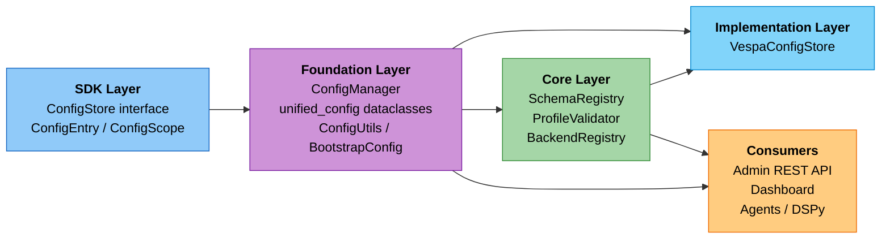

# Configuration Management System

**Spans**: SDK (interfaces), Foundation (`ConfigManager`, dataclasses, system configuration), Core (schema/profile registries), Implementation (Vespa backend)

Multi-tenant, versioned configuration system with pluggable storage backends for the Cogniverse layered architecture.

## Overview

The configuration system provides centralized management for all system configurations with:

- **Multi-tenant isolation**: Complete configuration separation per tenant
- **Versioning**: Full history tracking with rollback capability
- **Pluggable backends**: VespaConfigStore (default), or custom implementations via ConfigStore interface
- **Hot reload**: Configuration changes apply immediately without restart
- **Type-safe schemas**: Strongly typed configuration dataclasses
- **DSPy integration**: Dynamic optimizer and module configuration

## Architecture

See [System Architecture](architecture/overview.md) for the complete package structure.

The configuration system spans:

- **SDK Layer**: `ConfigStore` interface, `ConfigEntry`/`ConfigScope` type definitions
- **Foundation Layer**: `ConfigManager`, `unified_config` dataclasses, `ConfigUtils`/`get_config()`, `BootstrapConfig`, `ConfigAPIMixin`, semantic-router application helpers
- **Core Layer**: `SchemaRegistry` (per-tenant schema lifecycle, stored under `ConfigScope.SCHEMA`), `ProfileValidator`, `BackendRegistry` — all consume `ConfigManager`
- **Implementation Layer**: `VespaConfigStore` (default backend)



## Configuration Scopes

### System Configuration

Global, deployment-wide infrastructure settings shared across all agents (`SystemConfig` in `cogniverse_foundation.config.unified_config` — one instance for the whole deployment, not per-tenant):

- LLM model/engine and endpoint (`llm_model`, `llm_engine`, `base_url`, `llm_api_key`), plus opt-in `semantic_router` settings
- Backend connection settings (`search_backend`, `backend_url`, `backend_port`, `application_name`)
- Telemetry endpoints (`telemetry_url`, `telemetry_collector_endpoint`)
- Agent service URLs and registry (`agents` dict, `agent_registry_url`, `video_agent_url`, `summarizer_agent_url`, `ingestion_api_url`)
- Inference service URLs (`inference_service_urls`, `colpali_inference_url`)
- Iterative-retrieval budgets (`iter_retrieval_max_iter`, `iter_retrieval_token_budget`, `iter_retrieval_wall_clock_ms`)
- Cross-pod messaging, finetuning cache, and ingestion-upload endpoints (`redis_url`, `adapter_cache_dir`, `minio_endpoint`)

### Agent Configuration

Per-agent DSPy module and optimizer settings (`AgentConfig` in `cogniverse_foundation.config.agent_config`):

- DSPy module types (`predict`, `chain_of_thought`, `react`)
- Optimizer selection (`bootstrap_few_shot`, `labeled_few_shot`, `bootstrap_few_shot_with_random_search`, `copro`, `mipro_v2`, `gepa`, `simba`)
- Model-specific parameters
- Prompt templates and signatures (DSPy module `signature`)
- Resource allocations (`max_processing_time`)

### Routing Configuration

Routing strategy settings (`RoutingConfigUnified` in `cogniverse_foundation.config.unified_config`). Only `routing_mode="tiered"` is implemented end-to-end; other mode strings are accepted for forward-compat but produce no dispatch-time behavior change:

- Tier toggles and confidence thresholds: `enable_fast_path` / `enable_slow_path` / `enable_fallback`, `fast_path_confidence_threshold`, `slow_path_confidence_threshold`, `max_routing_time_ms`
- Fast-path GLiNER settings: model, threshold, device, labels
- Slow-path LLM settings: provider, endpoint, temperature, max tokens, chain-of-thought toggle
- DSPy auto-optimization: `dspy_enabled`, bootstrapped/labeled demo counts, `optimization_interval_seconds`, `min_samples_for_optimization`
- Caching: `enable_caching`, `cache_ttl_seconds`, `max_cache_size`
- Multi-tenant routing rules (per-tenant `RoutingConfigUnified` via `set_routing_config`)

### Telemetry Configuration

Observability settings (`TelemetryConfig` in `cogniverse_foundation.telemetry.config`):

- Project isolation per tenant (`tenant_project_template`, `tenant_service_template`, LRU-cached via `max_cached_tenants`/`tenant_cache_ttl_seconds`)
- Span export configuration (`otlp_enabled`, `otlp_endpoint`, `otlp_use_tls`, `batch_config`)
- Telemetry level (`disabled`/`basic`/`detailed`/`verbose` — gates which components emit spans via `should_instrument_component`)
- Provider selection for querying spans/annotations/datasets (`provider`: `"phoenix"`/`"langsmith"`/auto-detect, plus opaque `provider_config`)

**Environment variables** (read at startup boundary in `runtime/main.py`, applied as overrides onto `SystemConfig`):

| Variable | Purpose |
|----------|---------|
| `TELEMETRY_HTTP_ENDPOINT` | Phoenix HTTP endpoint |
| `TELEMETRY_OTLP_ENDPOINT` | OTLP collector gRPC endpoint |
| `OPENINFERENCE_DSPY` | `1` enables OpenInference DSPy instrumentation — LM call spans (full prompt/completion) exported to the `cogniverse-dspy-instrumentation` Phoenix project. Set by the chart on the runtime deployment. |
| `ITER_RETRIEVAL_MAX_ITER` / `ITER_RETRIEVAL_TOKEN_BUDGET` / `ITER_RETRIEVAL_WALL_CLOCK_MS` | Override `SystemConfig` iterative-retrieval budgets at runtime startup. The chart sets the wall clock from `runtime.iterRetrieval.wallClockMs`. |
| `BACKEND_URL` / `BACKEND_PORT` | Backend connection info consumed by `BootstrapConfig` to construct the `ConfigStore` itself (see "Bootstrap: Breaking the Chicken-and-Egg Problem" below), and re-applied onto `SystemConfig.backend_url`/`backend_port`. |
| `INFERENCE_SERVICE_URLS` | JSON object mapping inference-service logical names (e.g. `vllm_colpali`, `vllm_llm_student`, `vllm_asr`) to URLs. Populates `SystemConfig.inference_service_urls`. |
| `REDIS_URL` | Enables the Redis-backed `InboundQueueRegistry` for cross-pod inbound-messaging routing. Empty (default) uses the in-pod registry. Populates `SystemConfig.redis_url`. |
| `COGNIVERSE_ADAPTER_CACHE` | Local directory the finetuning adapter resolver downloads to. Populates `SystemConfig.adapter_cache_dir`; empty means `resolve_adapter_path` raises rather than falling back to `/tmp`. |
| `MINIO_ENDPOINT` | MinIO object-store endpoint for `POST /ingestion/upload`. Populates `SystemConfig.minio_endpoint`; empty means the upload route responds 503. |

### Messaging Gateway Configuration

Telegram bot settings (Helm values under `messaging.*`):

- `messaging.enabled` — enable/disable the messaging service (default: `false`)
- `messaging.mode` — `polling` (development) or `webhook` (production)
- `TELEGRAM_BOT_TOKEN` — bot token from BotFather (required, set as env var)
- `TELEGRAM_WEBHOOK_URL` — public HTTPS URL for webhook mode
- `RUNTIME_URL` — runtime API URL the gateway dispatches to

Invite tokens (stored in ConfigStore under `_system` tenant, `messaging_gateway` service):

```bash
# Generate an invite token for a tenant
curl -X POST http://localhost:8000/admin/messaging/invite \
  -H "Content-Type: application/json" \
  -d '{"tenant_id": "acme", "expires_in_hours": 24}'
```

### Wiki Knowledge Base Configuration

The wiki knowledge base uses a dedicated Vespa schema (`wiki_pages`) per tenant. No manual configuration is required: the runtime installs a per-tenant `WikiManager` factory at startup, and each tenant's `wiki_pages_{tenant_id}` schema is deployed **lazily on first access** for that tenant (not pre-deployed for every tenant at startup).

**Schema deployment** (lazy, on first per-tenant access):

```python
# On first request for a tenant, the factory calls:
#   wiki_backend.schema_registry.deploy_schema(
#       tenant_id=tenant_id, base_schema_name="wiki_pages"
#   )
# Schema name follows the pattern: wiki_pages_{tenant_id}
# e.g. wiki_pages_default, wiki_pages_acme_production
# (colons in tenant_id are sanitized to underscores — Vespa's /document/v1
# URL uses ':' as a path delimiter — via backend.get_tenant_schema_name())
```

The cluster-wide `wiki_pages` backend profile (type `"wiki"`, embedding model `google/embeddinggemma-300m`) is registered once under the system tenant at startup so `WikiManager.search` can resolve it through the shared profile registry.

**Schema file**: `configs/schemas/wiki_pages_schema.json`

The schema stores the following fields:

| Field | Type | Description |
|-------|------|-------------|
| `doc_id` | string | Unique document ID (deterministic for topics, timestamped for sessions) |
| `tenant_id` | string | Tenant the page belongs to |
| `page_type` | string | `"topic"`, `"session"`, or `"index"` |
| `title` | string | Page title (entity name for topics, query prefix for sessions) |
| `content` | string | Full page content (appended for topics, snapshot for sessions) |
| `slug` | string | URL-safe identifier derived from the title |
| `query` | string | Original user query (sessions only) |
| `entities` | string | JSON-serialized list of entity names |
| `sources` | string | JSON-serialized list of source references |
| `cross_references` | string | JSON-serialized list of related topic `doc_id`s |
| `agent_used` | string | Agent that produced the content (sessions only) |
| `update_count` | int | Number of times a topic page has been updated |
| `created_at` | string | ISO-8601 UTC timestamp of first creation |
| `updated_at` | string | ISO-8601 UTC timestamp of last update |
| `embedding` | tensor | 768-dim float tensor (shared `SemanticEmbedder` — `lightonai/DenseOn` when remote, `sentence-transformers/all-mpnet-base-v2` local fallback) |

**WikiManager constructor** (initialized by the runtime on startup):

```python
from cogniverse_agents.wiki.wiki_manager import WikiManager

wm = WikiManager(
    backend=vespa_backend,      # VespaSearchBackend instance
    tenant_id="your_org:production",        # Tenant identifier
    schema_name="wiki_pages_default",  # Vespa schema name for this tenant (no colons)
    llm_endpoint_config=llm_config.primary,  # Optional: needed for the RLM topic-page merge path
    config_manager=config_manager,           # Optional: routes the RLM merge call through the gateway
)
```

### Quality Monitor Configuration

Sidecar configuration (Helm values under `runtime.qualityMonitor.*`):

| Key | Default | Description |
|-----|---------|-------------|
| `enabled` | `true` | Enable/disable the quality monitor sidecar |
| `goldenIntervalSeconds` | `7200` | Seconds between golden set evaluations (2h) |
| `liveIntervalSeconds` | `14400` | Seconds between live traffic evaluations (4h) |
| `liveSampleCount` | `20` | Number of spans sampled per agent for live eval |
| `goldenDatasetPath` | `/app/data/quality-monitor/golden_dataset.json` | Path to golden evaluation dataset JSON, mounted from a ConfigMap |
| `llmModel` | `qwen3:4b` | Bare model id passed to `--llm-model` (must match `evaluators.llm_judge.model` in `config.json`) |

CLI equivalent:

```bash
uv run python -m cogniverse_runtime.quality_monitor_cli \
  --tenant-id default \
  --llm-model qwen3:4b \
  --golden-interval 7200 \
  --live-interval 14400 \
  --live-sample-count 20 \
  --argo-url http://argo-server:2746 \
  --argo-namespace cogniverse
```

### Backend Configuration

Backend-specific settings for video processing and storage:

- Backend type (currently `vespa`; the `ConfigStore`/backend registry pattern is pluggable for future backends, but only Vespa is implemented)
- Backend connection parameters (URL, port)
- Profile-based video processing configuration
- Pipeline settings (frame extraction, transcription)
- Embedding strategies and models
- Per-tenant backend overrides

Backend profiles are read/written under the config service `"backend"`
(`ConfigManager`'s backend/profile methods default `service="backend"`)
by three surfaces: the Python API below, the runtime Admin REST API
(`/admin/profiles`, see "Backend Configuration API" below), and the
dashboard's Backend Profile tab (`libs/dashboard/cogniverse_dashboard/tabs/backend_profile.py`).

### Schema Configuration

Per-tenant Vespa schema deployment bookkeeping, managed by `SchemaRegistry`
(`cogniverse_core.registries.schema_registry`) under `ConfigScope.SCHEMA`,
service `"schema_registry"`. Each deployed `(tenant_id, base_schema_name)`
pair is persisted as `config_key=f"schema_{base_schema_name}"` with the
full schema name, schema definition, and deployment timestamp. On startup,
`SchemaRegistry._load_schemas_from_storage()` rebuilds its in-memory
registry from these entries via `store.list_all_configs(scope=ConfigScope.SCHEMA, service="schema_registry")`.
Vespa itself is the source of truth; the registry is bookkeeping — see
[Schema Lifecycle: Source of Truth](./architecture/multi-tenant.md#schema-lifecycle-source-of-truth).

### ConfigScope Enum

Configuration scopes are defined by the `ConfigScope` enum:

```python
from cogniverse_sdk.interfaces.config_store import ConfigScope

class ConfigScope(Enum):
    SYSTEM = "system"        # Global infrastructure settings
    AGENT = "agent"          # Per-agent DSPy configuration
    ROUTING = "routing"      # Routing optimizer settings
    TELEMETRY = "telemetry"  # Observability settings
    SCHEMA = "schema"        # Per-tenant schema deployment bookkeeping (SchemaRegistry)
    BACKEND = "backend"      # Backend and profile configuration
```

**Usage Example**:
```python
from cogniverse_foundation.config.utils import create_default_config_manager
from cogniverse_sdk.interfaces.config_store import ConfigScope

manager = create_default_config_manager()

# Set backend configuration for tenant
from cogniverse_foundation.config.unified_config import BackendConfig

backend_config = BackendConfig(
    tenant_id="acme",
    backend_type="vespa",
    url="http://vespa-cluster",
    port=8080
)

manager.set_backend_config(backend_config, tenant_id="acme")

# Retrieve backend configuration
config = manager.get_backend_config(tenant_id="acme")
print(f"Backend: {config.url}:{config.port}")
```

## Storage Backends

The configuration system uses a pluggable backend architecture. Any storage backend implementing the `ConfigStore` interface can be used.

### Backend Implementation (Vespa Example)

The default implementation uses Vespa for unified configuration storage alongside application data:

```python
from cogniverse_foundation.config.manager import ConfigManager
from cogniverse_vespa.config.config_store import VespaConfigStore

# Initialize backend store
store = VespaConfigStore(
    vespa_app=None,        # Optional: pass existing Vespa app instance
    backend_url="http://localhost",
    backend_port=8080,
    schema_name="config_metadata",
    keep_versions=10,      # per config_id, retained after every set_config write
)

# Use with ConfigManager
manager = ConfigManager(store=store)

# Get system configuration (global — not per-tenant)
system_config = manager.get_system_config()
print(f"LLM: {system_config.llm_model}")
print(f"Backend: {system_config.backend_url}")
```

**Default Initialization:**
```python
from cogniverse_foundation.config.utils import create_default_config_manager

# Automatically uses default backend with settings from environment
# Reads BACKEND_URL and BACKEND_PORT from environment variables
manager = create_default_config_manager()
```

**Bootstrap: Breaking the Chicken-and-Egg Problem**

`create_default_config_manager()` needs backend connection info to build
the `ConfigStore` — but that connection info would normally live *in*
the `ConfigStore`. `BootstrapConfig` (`cogniverse_foundation.config.bootstrap`)
breaks the cycle by reading connection info from environment variables
and `config.json` directly, before any `ConfigStore` exists:

```python
from cogniverse_foundation.config.bootstrap import BootstrapConfig

# Requires BACKEND_URL env var; reads backend.type from configs/config.json
# (defaults to reading BACKEND_PORT, falling back to 8080)
bootstrap = BootstrapConfig.from_environment()
print(bootstrap.backend_type, bootstrap.backend_url, bootstrap.backend_port)
```

**Schema Deployment (Vespa):**

The `config_metadata` schema is automatically deployed as part of the metadata schemas:

```python
from cogniverse_vespa.vespa_schema_manager import VespaSchemaManager

schema_manager = VespaSchemaManager(
    backend_endpoint="http://localhost",
    backend_port=19071  # Config server port
)

# Deploys organization_metadata, tenant_metadata, config_metadata, adapter_registry
schema_manager.upload_metadata_schemas(app_name="cogniverse")
```

**Backend Features:**

- High availability and replication
- Unified storage with application data (no separate database)
- Real-time configuration sync
- Horizontal scaling
- Multi-tenant isolation via tenant_id field
- Version tracking for configuration history (bounded — see "Version Retention" below)

**Version Retention:**

Every `set_config` call writes a new versioned row. To keep
`config_metadata` bounded, `VespaConfigStore` prunes versions older
than the latest `keep_versions` (default `10`) per `config_id`
immediately after each write. Pruning is best-effort: a failure to
delete a stale row is logged and the live write still succeeds.

To drain pre-existing bloat (legacy rows that accumulated before
per-write pruning was added), run the one-off cleanup script:

```bash
# dry-run: report distinct config_ids and how many rows would drop
uv run python scripts/prune_config_metadata.py --dry-run

# actually delete
uv run python scripts/prune_config_metadata.py --keep 10
```

### Custom Backend Implementation

Create custom storage backends by implementing the ConfigStore interface:

```python
from cogniverse_sdk.interfaces.config_store import ConfigStore, ConfigEntry, ConfigScope
from typing import Dict, Any, Optional, List
from datetime import datetime

class RedisConfigStore(ConfigStore):
    """Redis-based configuration storage"""

    def __init__(self, redis_url: str):
        self.redis_client = redis.from_url(redis_url)
        self.initialize()

    def initialize(self) -> None:
        """Setup Redis indexes and structures"""
        # Create sorted sets for versioning
        # Setup pub/sub for hot reload
        pass

    def set_config(
        self,
        tenant_id: str,
        scope: ConfigScope,
        service: str,
        config_key: str,
        config_value: Dict[str, Any],
    ) -> ConfigEntry:
        """Store configuration with versioning"""
        # Generate version number
        # Store in Redis with TTL
        # Publish update event
        pass

    def get_config(
        self,
        tenant_id: str,
        scope: ConfigScope,
        service: str,
        config_key: str,
        version: Optional[int] = None,
    ) -> Optional[ConfigEntry]:
        """Retrieve configuration by version"""
        # Get from Redis cache
        # Deserialize JSON
        # Return ConfigEntry
        pass

    # Implement remaining abstract methods...
```

## Multi-Tenant Configuration

### Tenant Isolation

Each tenant has completely isolated configuration managed via per-tenant routing and agent configs. The global `SystemConfig` holds deployment-wide infrastructure (Vespa URL, Phoenix URL, LLM endpoint) — it is not per-tenant. Per-tenant configuration is accessed via `get_config()`:

```python
from cogniverse_foundation.config.utils import create_default_config_manager, get_config
from cogniverse_foundation.config.unified_config import RoutingConfigUnified

manager = create_default_config_manager()

# Configure per-tenant routing for Tenant A. "tiered" is the only
# routing_mode implemented end-to-end (fast + slow + fallback path with
# enable_* flags) — other string values are accepted by the schema for
# forward-compat but produce no behavior change at dispatch time.
routing_a = RoutingConfigUnified(
    tenant_id="tenant_a",
    routing_mode="tiered",
    fast_path_confidence_threshold=0.7,
)
manager.set_routing_config(routing_a, tenant_id="tenant_a")

# Configure per-tenant routing for Tenant B (tighter fast-path threshold)
routing_b = RoutingConfigUnified(
    tenant_id="tenant_b",
    routing_mode="tiered",
    fast_path_confidence_threshold=0.9,
)
manager.set_routing_config(routing_b, tenant_id="tenant_b")

# Retrieve per-tenant configuration via get_config()
config_a = get_config(tenant_id="tenant_a", config_manager=manager)
config_b = get_config(tenant_id="tenant_b", config_manager=manager)
assert config_a["routing_mode"] == config_b["routing_mode"] == "tiered"
```

### Tenant Lifecycle Management

Tenant creation is handled via the runtime admin API:

```bash
# Create a new tenant via admin API
curl -X POST http://localhost:8000/admin/tenants \
  -H "Content-Type: application/json" \
  -d '{"tenant_id": "acme:production", "created_by": "admin"}'
```

For schema cleanup, use VespaSchemaManager with SchemaRegistry. In a
running runtime the SchemaRegistry is a process-wide singleton on
`BackendRegistry._shared_schema_registry` — the first backend created
in the process builds it, and every subsequent backend configured for
the same backend url:port reuses it. A backend targeting a different
endpoint builds its own registry: the shared one deploys and registers
through the backend it was built with, so cross-endpoint reuse would
route schema operations to the wrong cluster. Direct construction
(below) is only needed for one-off scripts or tests.

See [Schema Lifecycle: Source of Truth](./architecture/multi-tenant.md#schema-lifecycle-source-of-truth)
for the full invariant: Vespa is authoritative, the registry is
bookkeeping, and the read path uses Document v1 visit for
read-after-write consistency.

```python
from cogniverse_vespa.vespa_schema_manager import VespaSchemaManager
from cogniverse_core.registries.schema_registry import SchemaRegistry
from cogniverse_foundation.config.utils import create_default_config_manager

# SchemaRegistry is required for tenant schema operations.
# In a running runtime, prefer ``BackendRegistry.get_*_backend(...)``
# which reuses the process-wide _shared_schema_registry for backends
# on the same url:port.
config_manager = create_default_config_manager()
schema_registry = SchemaRegistry(config_manager, backend, schema_loader)

schema_manager = VespaSchemaManager(
    backend_endpoint="http://localhost",
    backend_port=19071,
    schema_registry=schema_registry  # Required for delete_tenant_schemas and tenant_schema_exists
)

# Delete all schemas for a tenant. Refuses with BackendDeploymentError
# if a peer-tenant Vespa-only orphan exists that can't be reconstructed
# from the registry — operator must reconcile that orphan first.
deleted = schema_manager.delete_tenant_schemas(tenant_id="old_tenant")
print(f"Deleted schemas: {deleted}")

# Check if tenant schema exists
exists = schema_manager.tenant_schema_exists(
    tenant_id="acme",
    base_schema_name="video_frames"
)
```

For programmatic tenant configuration, use per-tenant config APIs (`set_routing_config`, `set_agent_config`, etc.) keyed by `tenant_id`. The global `SystemConfig` (infrastructure settings) is set once for the whole deployment via `set_system_config(system_config)` with no `tenant_id` argument:

```python
from cogniverse_foundation.config.unified_config import RoutingConfigUnified
from cogniverse_foundation.config.utils import get_config

# Copy routing config from one tenant to another
source = get_config(tenant_id="tenant_a", config_manager=manager)
routing_staging = RoutingConfigUnified(
    tenant_id="tenant_a_staging",
    routing_mode=source.get("routing_mode", "tiered"),
)
manager.set_routing_config(routing_staging, tenant_id="tenant_a_staging")
```

## DSPy Integration

### Dynamic Module Configuration

```python
from cogniverse_foundation.config.agent_config import (
    AgentConfig, ModuleConfig, DSPyModuleType, OptimizerConfig, OptimizerType
)
from cogniverse_foundation.config.utils import create_default_config_manager

manager = create_default_config_manager()

# Configure the video/visual Search Agent with ReAct and GEPA optimizer.
# "search_agent" is the registered agent name (configs/config.json ->
# agents.search_agent); its URL matches SystemConfig.video_agent_url.
video_agent_config = AgentConfig(
    agent_name="search_agent",
    agent_version="1.0.0",
    agent_description="Video/image search and analysis agent (ColPali/VideoPrism via Vespa)",
    agent_url="http://localhost:8002",
    capabilities=["search", "video_search", "retrieval"],
    skills=[],
    module_config=ModuleConfig(
        module_type=DSPyModuleType.REACT,  # Available: PREDICT, CHAIN_OF_THOUGHT, REACT
        signature="Question -> Answer",
        max_retries=3,
        temperature=0.7
    ),
    optimizer_config=OptimizerConfig(
        optimizer_type=OptimizerType.GEPA,  # Available: BOOTSTRAP_FEW_SHOT, LABELED_FEW_SHOT, BOOTSTRAP_FEW_SHOT_WITH_RANDOM_SEARCH, COPRO, MIPRO_V2, GEPA, SIMBA
        num_trials=20,
        max_bootstrapped_demos=4
    ),
    llm_model="gpt-4",
    llm_temperature=0.7
)

manager.set_agent_config(
    tenant_id="your_org:production",
    agent_name="search_agent",
    agent_config=video_agent_config
)
```

### Agent Runtime Configuration REST API

`ConfigAPIMixin` (`cogniverse_foundation.config.api_mixin`) adds
FastAPI endpoints to an agent for reading and hot-updating its own DSPy
module/optimizer/LLM configuration, persisting every change through
`ConfigManager.set_agent_config`:

```python
class MyAgent(DynamicDSPyMixin, ConfigAPIMixin):
    def __init__(self, tenant_id, config_manager):
        config = AgentConfig(...)
        self.initialize_dynamic_dspy(config)

        app = FastAPI()
        self.setup_config_endpoints(app, config_manager, tenant_id=tenant_id)
```

Endpoints added by `setup_config_endpoints`:

| Method | Path | Effect |
|--------|------|--------|
| `GET` | `/config` | Return the agent's current `AgentConfig` |
| `GET` | `/config/module` | Return current DSPy module info |
| `POST` | `/config/module` | Update module type/signature/params, persist via `set_agent_config` |
| `GET` | `/config/optimizer` | Return current optimizer info |
| `POST` | `/config/optimizer` | Update optimizer type/params, persist via `set_agent_config` |
| `POST` | `/config/llm` | Update LLM model/base_url/api_key/temperature/max_tokens, reconfigure the DSPy LM, persist |
| `GET` | `/config/modules/available` | List valid `DSPyModuleType` values |
| `GET` | `/config/optimizers/available` | List valid `OptimizerType` values |

### Centralized LLM Configuration

All DSPy-based agents and optimizers use a centralized LLM configuration system instead of reading environment variables or configuring `dspy.settings` globally.

**Config structure** (`config.json`):

```json
{
  "llm_config": {
    "primary": {
      "model": "openai/google/gemma-4-e4b-it",
      "api_base": "http://localhost:11434/v1",
      "api_key": "placeholder-no-auth-needed"
    },
    "teacher": {
      "model": "anthropic/claude-3-5-sonnet-20241022",
      "api_key": "sk-ant-..."
    },
    "overrides": {
      "orchestrator_agent": {
        "model": "openai/qwen3:8b",
        "api_base": "http://localhost:11434/v1",
        "api_key": "placeholder-no-auth-needed"
      }
    }
  }
}
```

**Key classes and factory**:

```python
from cogniverse_foundation.config.unified_config import LLMConfig, LLMEndpointConfig
from cogniverse_foundation.config.llm_factory import create_dspy_lm

# Load from config.json
llm_config = LLMConfig.from_dict(config.get("llm_config", {}))

# Resolve endpoint for a specific component (checks overrides, falls back to primary)
endpoint = llm_config.resolve("orchestrator_agent")  # Returns LLMEndpointConfig

# Create a scoped DSPy LM instance via the factory
lm = create_dspy_lm(endpoint)

# Use with scoped context (never global dspy.settings.configure)
import dspy
with dspy.context(lm=lm):
    result = module(query="machine learning videos")
```

- `LLMEndpointConfig`: Dataclass with `model` (required), `api_base`, `api_key`, `temperature` (default `0.1`), `max_tokens` (default `1000`), `adapter_path` (bookkeeping only — LM construction never reads it, vLLM serves adapters server-side by model name), `extra_body` (provider-specific request params, e.g., `{"think": False}` for qwen3), `extra_headers` (static HTTP headers forwarded to litellm as `extra_headers`, used for semantic-router authz), `seed` (vLLM sampling seed, forwarded into `extra_body`), `request_timeout` (default `120.0`), `num_retries` (default `1`). Provider is encoded in the model string using litellm's provider prefix (e.g., `"openai/google/gemma-4-e4b-it"` for vLLM/Ollama via OpenAI-compat wire, `"anthropic/claude-3-5-sonnet-20241022"` for Anthropic SaaS). The chart always emits `openai/` for in-cluster backends; `api_base` selects the actual destination.
- `LLMConfig`: Holds `primary`, `teacher`, and `overrides` dict. `resolve(component_name)` returns the override if present, else `primary`
- `create_dspy_lm(config: LLMEndpointConfig) -> dspy.LM`: Factory that creates a DSPy LM from endpoint config. All DSPy LM creation goes through this factory. When `api_base` is set and `api_key` is `None`, the factory fills the placeholder key `not-required` — the OpenAI client refuses to construct without one, while self-hosted OAI-compat servers (vLLM, Ollama) ignore its value. Endpoints that enforce auth need an explicit `api_key`.

**Chart helpers — prefixed vs. bare model id**

The chart resolves the primary model into two templates in `charts/cogniverse/templates/_helpers.tpl`:

- `cogniverse.primaryLLMModel` — `openai/<bare-model>` (or `<provider>/<id>` when overridden via `runtime.primaryLLM.model`). Written into `config.json` and consumed by `create_dspy_lm()` / litellm, where the prefix selects provider routing.
- `cogniverse.primaryLLMModelBare` — same id **without** the provider prefix. OpenAI-compatible `/v1/chat/completions` servers (vLLM, llama.cpp, Ollama) serve the bare name and reject the prefixed form with 404. Used by the `quality-monitor` sidecar and the `cogniverse-scheduled-distillation` cron (both call vLLM directly over HTTP rather than through DSPy).

Both resolve in the same order: `runtime.primaryLLM.model` if set, else engine-derived (`inference.vllm_llm_student.model` when `llm.engine: vllm`, else `llm.model`).

### Opt-in Semantic Router

`SystemConfig.semantic_router` (a `SemanticRouterConfig`) opt-in routes LLM
calls through a vLLM Semantic Router instead of the model backend directly.
Disabled by default (`enabled=False`), so the direct-to-backend path is
unchanged unless explicitly turned on:

```python
from cogniverse_foundation.config.unified_config import SemanticRouterConfig

router_config = SemanticRouterConfig(
    enabled=True,
    semantic_router_url="http://semantic-router:8801/v1",
    tenant_tiers={"acme": "premium"},
    default_tier="default",
)
```

When enabled, `cogniverse_foundation.config.semantic_router` rewrites the
endpoint's `api_base` to `semantic_router_url` and `model` to
`routed_model` (default `"openai/auto"` — the router resolves models by
its own catalog and rejects raw provider model ids), and attaches two
authz headers per request: the tenant identity (`user_id_header`, default
`x-authz-user-id`) and the tenant tier (`tier_header`, default
`x-authz-user-groups`, resolved from `tenant_tiers` with `default_tier`
fallback). `routed_lm_context_for(config_manager, tenant_id, agent_name)`
is the single entry point agents use to get a `dspy.context`-bound LM that
is automatically router-aware when enabled.

## Backend Configuration API

The ConfigManager provides methods for managing backend and profile configurations:

### Get/Set Backend Configuration

```python
from cogniverse_foundation.config.utils import create_default_config_manager

manager = create_default_config_manager()

# Get backend configuration for a tenant
backend_config = manager.get_backend_config(tenant_id="acme")
print(f"Backend URL: {backend_config.url}")
print(f"Backend Port: {backend_config.port}")

# Set backend configuration
from cogniverse_foundation.config.unified_config import BackendConfig

new_config = BackendConfig(
    tenant_id="acme",
    backend_type="vespa",
    url="http://vespa-cluster",
    port=8080
)
manager.set_backend_config(new_config, tenant_id="acme")
```

### Profile Management

```python
# List all profiles for a tenant
profiles = manager.list_backend_profiles(tenant_id="acme")
for name, profile in profiles.items():
    print(f"Profile: {name}, Schema: {profile.schema_name}")

# Get a specific profile
profile = manager.get_backend_profile(
    profile_name="video_colpali_smol500_mv_frame",
    tenant_id="acme"
)

# Add a new profile
from cogniverse_foundation.config.unified_config import BackendProfileConfig

new_profile = BackendProfileConfig(
    profile_name="custom_profile",
    schema_name="custom_schema_acme",
    embedding_model="colpali",
    model_specific={"dimensions": 128}
)
manager.add_backend_profile(new_profile, tenant_id="acme")

# Update an existing profile
manager.update_backend_profile(
    profile_name="custom_profile",
    overrides={"model_specific": {"dimensions": 256}},
    base_tenant_id="acme"
)

# Delete a profile
manager.delete_backend_profile(profile_name="custom_profile", tenant_id="acme")
```

### REST API and Dashboard

The same profile operations are exposed over HTTP by the runtime's Admin
API (`libs/runtime/cogniverse_runtime/routers/admin.py`, mounted under
`/admin`) — every route calls the `ConfigManager` methods above with
`service="backend"`:

| Method | Path | ConfigManager call |
|--------|------|---------------------|
| `POST` | `/admin/profiles` | `add_backend_profile` (+ optional schema deploy) |
| `GET` | `/admin/profiles?tenant_id=...` | `list_backend_profiles` |
| `GET` | `/admin/profiles/{profile_name}?tenant_id=...` | `get_backend_profile` |
| `PUT` | `/admin/profiles/{profile_name}` | `update_backend_profile` |
| `DELETE` | `/admin/profiles/{profile_name}` | `delete_backend_profile` |
| `POST` | `/admin/profiles/{profile_name}/deploy` | schema deployment via `SchemaRegistry` |

```bash
curl -X POST http://localhost:8000/admin/profiles \
  -H "Content-Type: application/json" \
  -d '{"profile_name": "custom_profile", "tenant_id": "acme", "schema_name": "custom_schema_acme", "embedding_model": "colpali", "embedding_type": "multi_vector"}'
```

The dashboard exposes the same operations through its Backend Profile tab
(`libs/dashboard/cogniverse_dashboard/tabs/backend_profile.py`), which
reads/writes profiles via the same `ConfigManager` instance.

## Configuration Versioning

### Version Tracking

Every configuration change creates a new version:

```python
from cogniverse_sdk.interfaces.config_store import ConfigScope

# Get configuration history (SystemConfig is stored under "_system" sentinel tenant)
history = manager.store.get_config_history(
    tenant_id="_system",
    scope=ConfigScope.SYSTEM,
    service="system",
    config_key="system_config",
    limit=10
)

for entry in history:
    print(f"Version {entry.version}:")
    print(f"  Updated: {entry.updated_at}")
    print(f"  Changes: {entry.config_value}")
```

### Rollback Capability

Rollback is achieved by retrieving a previous version from history and re-applying it:

```python
from cogniverse_sdk.interfaces.config_store import ConfigScope
from cogniverse_foundation.config.unified_config import SystemConfig

# Get current version (SystemConfig is global — no tenant_id argument)
current = manager.get_system_config()
print(f"Current LLM: {current.llm_model}")

# Get configuration history to find version to restore
history = manager.store.get_config_history(
    tenant_id="_system",
    scope=ConfigScope.SYSTEM,
    service="system",
    config_key="system_config",
    limit=10
)

# Find the target version (e.g., version 5)
target_entry = next((e for e in history if e.version == 5), None)
if target_entry:
    # Re-apply the historical configuration through set_system_config() —
    # NOT manager.store.set_config() directly. ConfigManager caches
    # get_system_config() on the instance and only busts that cache inside
    # set_system_config(); writing straight to the store would leave a
    # stale SystemConfig cached and "verify rollback" below would silently
    # print the pre-rollback value.
    manager.set_system_config(SystemConfig.from_dict(target_entry.config_value))
    print(f"Rolled back to version {target_entry.version}")

# Verify rollback
rolled_back = manager.get_system_config()
print(f"Rolled back LLM: {rolled_back.llm_model}")
```

## Export/Import

### Backup Configuration

```python
import json
from datetime import datetime

# Export all configurations
export_data = manager.store.export_configs(
    tenant_id="production",
    include_history=True  # Include version history
)

# Save with timestamp
timestamp = datetime.now().strftime("%Y%m%d_%H%M%S")
with open(f"config_backup_{timestamp}.json", "w") as f:
    json.dump(export_data, f, indent=2, default=str)

print(f"Exported {len(export_data['configs'])} configurations")
```

### Restore Configuration

```python
# Load backup
with open("config_backup_20250104_120000.json", "r") as f:
    backup_data = json.load(f)

# Import to new environment
imported_count = manager.store.import_configs(
    tenant_id="staging",
    configs=backup_data
)

print(f"Imported {imported_count} configurations")
```

## Monitoring and Health

### Configuration Health Checks

```python
# Check storage backend health
if manager.store.health_check():
    print("✓ Configuration storage healthy")
else:
    print("✗ Configuration storage unavailable")

# Get storage statistics
stats = manager.store.get_stats()
print(f"Total configurations: {stats['total_configs']}")
print(f"Total versions: {stats['total_versions']}")
print(f"Total tenants: {stats['total_tenants']}")
print(f"Configs by scope: {stats['configs_per_scope']}")
```

## Testing

### Unit Tests

```bash
# Run configuration unit tests (spread across each package's own test tree)
JAX_PLATFORM_NAME=cpu uv run pytest \
  tests/common/unit/test_agent_config.py \
  tests/common/unit/test_config_api_mixin.py \
  tests/foundation/unit/test_config_utils.py \
  tests/backends/unit/test_backend_config.py \
  -v

# Test the Vespa config store backend (YQL escaping, selection quoting)
JAX_PLATFORM_NAME=cpu uv run pytest \
  tests/backends/unit/test_config_store_yql_escape.py \
  tests/backends/unit/test_list_all_configs_selection_quoting.py \
  -v
```

### Integration Tests

```bash
# Test with real backends
cogniverse up  # Starts all services including Vespa

# Run integration tests
JAX_PLATFORM_NAME=cpu uv run pytest tests/common/integration/ -v
```

### Load Testing

Load testing can be implemented using standard Python tools:

```python
import asyncio
import time
from concurrent.futures import ThreadPoolExecutor

async def load_test_config(manager, tenant_id: str, iterations: int = 100):
    """Simple load test for configuration reads."""
    start = time.perf_counter()

    with ThreadPoolExecutor(max_workers=10) as executor:
        futures = [
            executor.submit(manager.get_system_config)
            for _ in range(iterations)
        ]
        results = [f.result() for f in futures]

    elapsed = time.perf_counter() - start
    print(f"Completed {iterations} reads in {elapsed:.2f}s")
    print(f"Read QPS: {iterations / elapsed:.1f}")
```

## Best Practices

### 1. Understand System vs Tenant Config
```python
# SystemConfig is GLOBAL — one config for the whole deployment.
# Call with no arguments.
system_config = manager.get_system_config()
print(f"Backend: {system_config.backend_url}:{system_config.backend_port}")

# Per-tenant config (routing, agent settings) uses tenant-scoped APIs.
from cogniverse_foundation.config.utils import get_config
tenant_config = get_config(tenant_id="production", config_manager=manager)
```

### 2. Version Critical Changes
```python
# Before major changes
backup = manager.store.export_configs(
    tenant_id="_system",
    include_history=True
)

# Make changes with audit trail (metadata is a field on SystemConfig)
system_config = manager.get_system_config()
system_config.metadata = {"changed_by": "admin", "reason": "Performance tuning"}
manager.set_system_config(system_config)
```

### 3. Use Type-Safe Configurations
```python
# Good: Type-safe dataclass (no tenant_id — SystemConfig is global)
from cogniverse_foundation.config.unified_config import SystemConfig
config = SystemConfig(
    llm_model="gpt-4",
    backend_url="http://backend",
    backend_port=8080
)

# Bad: Raw dictionaries
config = {"llm_model": "gpt-4"}  # No validation
```

### 4. Implement Configuration Templates
```python
from cogniverse_foundation.config.unified_config import SystemConfig

# SystemConfig templates for different deployment environments
TEMPLATES = {
    "development": SystemConfig(
        llm_model="gpt-3.5-turbo",
        backend_url="http://localhost",
        backend_port=8080
    ),
    "production": SystemConfig(
        llm_model="gpt-4",
        backend_url="http://backend-cluster",
        backend_port=8080
    )
}

# Apply a template to set global system config
def apply_template(manager, template_name: str, **overrides):
    """Apply a configuration template with optional overrides."""
    import dataclasses
    template = TEMPLATES[template_name]
    config_dict = dataclasses.asdict(template)
    config_dict.update(overrides)
    new_config = SystemConfig(**config_dict)
    manager.set_system_config(new_config)

# Usage
apply_template(manager, "production", llm_model="claude-3-opus")
```

## Troubleshooting

### Configuration Not Found

```python
from cogniverse_sdk.interfaces.config_store import ConfigScope
from cogniverse_foundation.config.unified_config import SystemConfig

# Check if configuration exists
configs = manager.store.list_configs(
    tenant_id="_system",
    scope=ConfigScope.SYSTEM
)
print(f"Available configs: {configs}")

# Initialize missing configuration if needed (SystemConfig is global — no tenant_id)
try:
    config = manager.get_system_config()
except Exception:
    manager.set_system_config(SystemConfig())
```

### Version Conflicts

Configuration versioning is tracked automatically via the `get_config_history` method:

```python
# Check version history before updates (SystemConfig stored under "_system" tenant)
history = manager.store.get_config_history(
    tenant_id="_system",
    scope=ConfigScope.SYSTEM,
    service="system",
    config_key="system_config",
    limit=5
)

# Log current version before update
if history:
    print(f"Current version: {history[0].version}")

# Make update (creates new version automatically)
manager.set_system_config(config)
```

### Storage Backend Issues

```python
from cogniverse_vespa.config.config_store import VespaConfigStore
from cogniverse_foundation.config.manager import ConfigManager

# Ensure backend is available before creating ConfigManager
try:
    store = VespaConfigStore(
        vespa_app=None,
        backend_url="http://localhost",
        backend_port=8080,
        schema_name="config_metadata"
    )
    manager = ConfigManager(store=store)
except ConnectionError as e:
    raise RuntimeError(
        f"Backend unavailable: {e}. "
        "Ensure the backend is running and metadata schemas are deployed."
    )
```

## Configuration Layer Details

### SDK Layer (cogniverse-sdk)

- Defines `ConfigStore`/`ConfigEntry`/`ConfigScope` interfaces and type contracts
- No implementation, just pure interfaces
- Used by all other layers for type safety

### Foundation Layer (cogniverse-foundation)

- Implements `ConfigManager` (consumes the SDK's `ConfigStore` interface — never implements storage itself)
- Defines all `unified_config` dataclasses (`SystemConfig`, `RoutingConfigUnified`, `BackendConfig`/`BackendProfileConfig`, `LLMConfig`/`LLMEndpointConfig`, `SemanticRouterConfig`, `TenantConfig`, and the synthetic-data-generation dataclasses below)
- `BootstrapConfig` — breaks the chicken-and-egg problem of needing backend connection info before a `ConfigStore` exists
- `ConfigUtils`/`get_config()` — dict-like read access merging system + tenant + JSON config
- `ConfigAPIMixin` — REST endpoints for hot-updating an agent's own config
- `cogniverse_foundation.config.semantic_router` — applies opt-in semantic-router routing to LLM endpoint configs
- Handles serialization/deserialization (`to_dict`/`from_dict` on every dataclass)

Additional `unified_config` dataclasses support synthetic data generation
for the optimization pipeline (see [Optimization Module](modules/optimization.md)):
`FieldMappingConfig` (semantic field-role mapping), `DSPyModuleConfig`
(query-generation module config), `AgentMappingRule` (modality → agent
routing), `ProfileScoringRule` (profile-selection scoring),
`OptimizerGenerationConfig` (per-optimizer generation settings),
`ApprovalConfig` (human-in-the-loop approval thresholds), and
`SyntheticGeneratorConfig` (the top-level per-tenant container for all of
the above).

### Core Layer (cogniverse-core)

- `SchemaRegistry` — per-tenant schema deployment bookkeeping, consumes `ConfigManager` under `ConfigScope.SCHEMA`
- `ProfileValidator` — validates `BackendProfileConfig` instances before they're persisted
- `BackendRegistry` — backend factory/cache that resolves `ConfigManager`-backed profiles into live `VespaSearchBackend` instances
- `tenant_utils` (`require_tenant_id`, `canonical_tenant_id`, `SYSTEM_TENANT_ID`) — the tenant-identity contract every scoped config method enforces

## Related Documentation

- [Architecture Overview](architecture/overview.md) - System design
- [Multi-Tenant Architecture](architecture/multi-tenant.md) - Tenant isolation
- [Agents Module](modules/agents.md) - Agent configuration
- [Optimization Module](modules/optimization.md) - DSPy optimizer configuration

