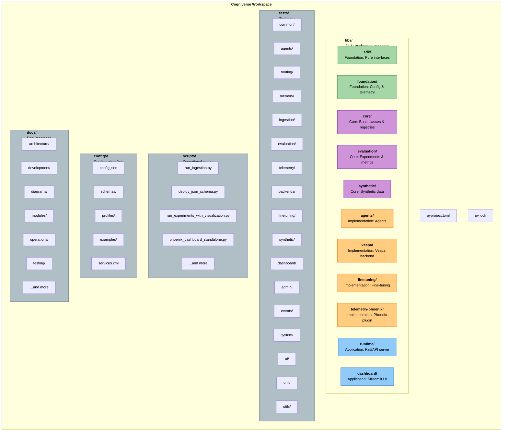
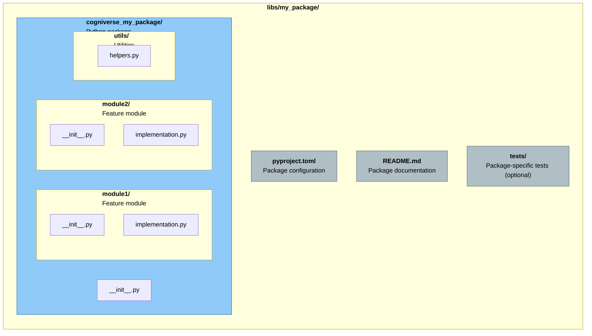
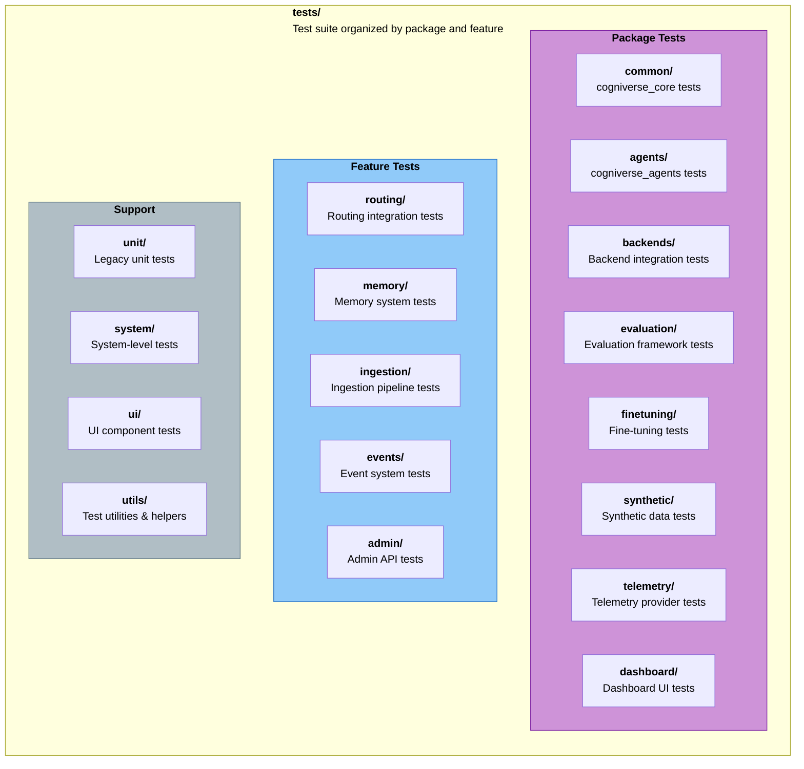

# Cogniverse Developer Guide
Complete guide for developers contributing to Cogniverse - a general-purpose multi-agent AI platform with self-optimization via DSPy optimizers. Content understanding is a primary use case, but the architecture supports any agent type.

---

## Table of Contents

1. [Getting Started](#getting-started)
2. [System Architecture](#system-architecture)
3. [Development Environment](#development-environment)
4. [Code Organization](#code-organization)
5. [Development Workflows](#development-workflows)
6. [Testing Strategy](#testing-strategy)
7. [Contributing Code](#contributing-code)
8. [Best Practices](#best-practices)
9. [Troubleshooting](#troubleshooting)

---

## Getting Started

### For New Developers

Welcome to Cogniverse! This guide will help you:

- Understand the system architecture
- Set up your development environment
- Navigate the codebase
- Write and test code
- Submit contributions

### Prerequisites

Before you begin, ensure you have:

- **Python 3.12+** installed
- **Git** for version control
- **Docker** for running services
- **uv** package manager: `pip install uv`
- **IDE** (VS Code, PyCharm recommended)
- **16GB+ RAM** (32GB recommended)

### Quick Start

```bash
# Clone repository
git clone <repository-url>
cd cogniverse

# Install dependencies
uv sync

# Start services
docker compose up -d

# Run tests to verify setup
uv run pytest tests/common/ -v

# Success! You're ready to develop
```

---

## System Architecture

### 11-Package Layered Architecture

Cogniverse uses a **UV workspace** with a layered architecture:

```mermaid
flowchart TB
    subgraph APP["<span style='color:#000'><b>APPLICATION LAYER</b></span>"]
        runtime["<span style='color:#000'><b>runtime</b><br/>FastAPI Server</span>"]
        dashboard["<span style='color:#000'><b>dashboard</b><br/>Streamlit UI</span>"]
    end

    subgraph IMPL["<span style='color:#000'><b>IMPLEMENTATION LAYER</b></span>"]
        agents["<span style='color:#000'><b>agents</b><br/>Routing & Search</span>"]
        vespa["<span style='color:#000'><b>vespa</b><br/>Backend Integration</span>"]
        finetuning["<span style='color:#000'><b>finetuning</b><br/>SFT & DPO</span>"]
        telemetry_phoenix["<span style='color:#000'><b>telemetry-phoenix</b><br/>Phoenix Provider</span>"]
    end

    subgraph CORE["<span style='color:#000'><b>CORE LAYER</b></span>"]
        core["<span style='color:#000'><b>core</b><br/>Base Classes & Registries</span>"]
        evaluation["<span style='color:#000'><b>evaluation</b><br/>Experiments & Metrics</span>"]
        synthetic["<span style='color:#000'><b>synthetic</b><br/>Training Data</span>"]
    end

    subgraph FOUND["<span style='color:#000'><b>FOUNDATION LAYER</b></span>"]
        sdk["<span style='color:#000'><b>sdk</b><br/>Interfaces & Types</span>"]
        foundation["<span style='color:#000'><b>foundation</b><br/>Config & Telemetry</span>"]
    end

    APP --> IMPL
    IMPL --> CORE
    CORE --> FOUND

    %% Styling - Foundation Layer (green)
    style sdk fill:#a5d6a7,stroke:#388e3c,color:#000
    style foundation fill:#a5d6a7,stroke:#388e3c,color:#000

    %% Styling - Core Layer (purple)
    style core fill:#ce93d8,stroke:#7b1fa2,color:#000
    style evaluation fill:#ce93d8,stroke:#7b1fa2,color:#000
    style synthetic fill:#ce93d8,stroke:#7b1fa2,color:#000

    %% Styling - Implementation Layer (orange)
    style agents fill:#ffcc80,stroke:#ef6c00,color:#000
    style vespa fill:#ffcc80,stroke:#ef6c00,color:#000
    style finetuning fill:#ffcc80,stroke:#ef6c00,color:#000
    style telemetry_phoenix fill:#ffcc80,stroke:#ef6c00,color:#000

    %% Styling - Application Layer (blue)
    style runtime fill:#90caf9,stroke:#1565c0,color:#000
    style dashboard fill:#90caf9,stroke:#1565c0,color:#000
```



### Key Principles

1. **Layered Dependencies**: Dependencies flow downward only (no cycles)
2. **SDK Foundation**: Zero internal dependencies, pure interfaces
3. **Separation of Concerns**: Each package has clear responsibilities
4. **Plugin Architecture**: Telemetry providers via entry points
5. **Multi-Tenancy**: Complete tenant isolation at every layer

### Package Responsibilities

| Package | Layer | Purpose | Key Modules |
|---------|-------|---------|-------------|
| **sdk** | Foundation | Backend interfaces, Document model | interfaces/, document.py |
| **foundation** | Foundation | Config base, telemetry interfaces | config/, telemetry/ |
| **core** | Core | Base classes, registries, memory | agents/, common/, registries/ |
| **evaluation** | Core | Experiments, metrics, datasets | core/, metrics/, evaluators/ |
| **synthetic** | Core | Synthetic data generation | service.py, generators/ |
| **agents** | Implementation | Routing, search, orchestration | routing/, search/, tools/ |
| **vespa** | Implementation | Vespa backend, schema management | config/, registry/, workflow/ |
| **finetuning** | Implementation | LLM fine-tuning (SFT, DPO) | training/, dataset/, registry/ |
| **telemetry-phoenix** | Implementation | Phoenix telemetry provider (plugin) | provider.py, evaluation/ |
| **runtime** | Application | FastAPI server, ingestion | routers/, ingestion/, admin/ |
| **dashboard** | Application | Streamlit UI, analytics | tabs/, utils/ |

---

## Development Environment

### Initial Setup

#### 1. Install UV Package Manager

```bash
# macOS/Linux
curl -LsSf https://astral.sh/uv/install.sh | sh

# Windows
powershell -c "irm https://astral.sh/uv/install.ps1 | iex"

# Verify installation
uv --version
```

#### 2. Clone and Setup Repository

```bash
# Clone
git clone <repository-url>
cd cogniverse

# Install workspace (all 11 packages + dependencies)
uv sync

# Activate virtual environment
source .venv/bin/activate  # macOS/Linux
.venv\Scripts\activate     # Windows
```

#### 3. Start Infrastructure Services

```bash
# Start Vespa, Phoenix, Ollama
docker compose up -d

# Verify services
curl http://localhost:8080/ApplicationStatus  # Vespa
curl http://localhost:6006/health             # Phoenix
curl http://localhost:11434/api/tags          # Ollama
```

#### 4. Verify Installation

```bash
# Run tests
uv run pytest tests/common/ -v

# Verify all packages installed
uv pip list | grep cogniverse

# Expected: 11 packages (sdk, foundation, core, evaluation, etc.)
```

### IDE Setup

#### VS Code Configuration

Create `.vscode/settings.json`:

```json
{
  "python.defaultInterpreterPath": "${workspaceFolder}/.venv/bin/python",
  "python.testing.pytestEnabled": true,
  "python.testing.pytestArgs": [
    "tests"
  ],
  "python.linting.enabled": true,
  "python.linting.ruffEnabled": true,
  "python.formatting.provider": "black",
  "editor.formatOnSave": true,
  "files.exclude": {
    "**/__pycache__": true,
    "**/*.pyc": true,
    ".venv": true
  }
}
```

Create `.vscode/launch.json`:

```json
{
  "version": "0.2.0",
  "configurations": [
    {
      "name": "Python: Debug Tests",
      "type": "python",
      "request": "launch",
      "module": "pytest",
      "args": ["tests/", "-v"],
      "console": "integratedTerminal"
    },
    {
      "name": "Python: FastAPI Server",
      "type": "python",
      "request": "launch",
      "module": "uvicorn",
      "args": [
        "cogniverse_runtime.main:app",
        "--reload"
      ],
      "env": {
        "JAX_PLATFORM_NAME": "cpu"
      }
    }
  ]
}
```

#### PyCharm Configuration

1. **Set Python Interpreter**: File → Settings → Project → Python Interpreter → Select `.venv/bin/python`
2. **Enable Pytest**: Settings → Tools → Python Integrated Tools → Testing → pytest
3. **Configure Ruff**: Settings → Tools → External Tools → Add Ruff
4. **Mark Directories**: Right-click `libs/*/cogniverse_*` → Mark Directory as → Sources Root

---

## Code Organization

### Workspace Structure



### Package Structure Pattern

Each package follows this structure:



### Naming Conventions

**Packages:**

- Installable name: `cogniverse-my-package` (hyphens)
- Import name: `cogniverse_my_package` (underscores)

**Modules:**

- Lowercase with underscores: `video_agent_refactored.py`
- Avoid abbreviations: `config.py` not `cfg.py`

**Classes:**

- PascalCase: `VideoSearchAgent`, `VespaSchemaManager`
- Descriptive names: `RoutingAgent` not `RA`

**Functions:**

- snake_case: `get_tenant_id()`, `deploy_schema()`
- Verb + noun: `create_agent()`, `load_config()`

**Constants:**

- UPPER_SNAKE_CASE: `MAX_BATCH_SIZE`, `DEFAULT_TIMEOUT`

---

## Development Workflows

### Working on a Single Package

```bash
# Navigate to package
cd libs/agents

# Install package in editable mode
uv pip install -e .

# Make changes
vim cogniverse_agents/routing_agent.py

# Run package tests
cd ../..
uv run pytest tests/agents/ -v

# Run linting
uv run ruff check libs/agents/

# Format code
uv run ruff format libs/agents/
```

### Working Across Multiple Packages

```bash
# Make changes in core
vim libs/core/cogniverse_core/agents/base.py

# Make changes in agents (uses core)
vim libs/agents/cogniverse_agents/routing_agent.py

# Changes in core immediately visible to agents (workspace)
uv run pytest tests/agents/ -v
```

### Adding a New Feature

**Example: Add a new ingestion processor**

1. **Create feature branch**:
```bash
git checkout -b feature/add-custom-processor
```

2. **Implement in appropriate package**:
```python
# libs/runtime/cogniverse_runtime/ingestion/processors/custom_processor.py
from pathlib import Path
from cogniverse_runtime.ingestion.processor_base import BaseProcessor

class CustomVideoProcessor(BaseProcessor):
    """Custom processor for specialized video handling"""

    PROCESSOR_NAME = "custom_video"

    def __init__(self, logger, **kwargs):
        super().__init__(logger, **kwargs)

    def process(self, video_path: Path, context: dict) -> dict:
        # Implement custom processing logic
        frames = self._extract_frames(video_path)
        embeddings = self._generate_embeddings(frames)
        return {"embeddings": embeddings, "metadata": context}
```

3. **Add tests**:
```python
# tests/ingestion/test_custom_processor.py
import logging
import pytest
from pathlib import Path
from cogniverse_runtime.ingestion.processors.custom_processor import CustomVideoProcessor

def test_custom_processor():
    logger = logging.getLogger(__name__)
    processor = CustomVideoProcessor(logger=logger)
    result = processor.process(Path("test.mp4"), {})
    assert "embeddings" in result
```

4. **Run tests**:
```bash
uv run pytest tests/ingestion/test_custom_processor.py -v
```

5. **Update documentation**:
```bash
vim docs/modules/runtime.md  # Add new processor
```

6. **Commit and push**:
```bash
git add .
git commit -m "Add custom video processor for specialized frame handling"
git push origin feature/add-custom-processor
```

### Adding a New Package Dependency

**To a specific package**:
```bash
cd libs/agents
uv add scikit-learn>=1.3.0  # Adds to agents/pyproject.toml
cd ../..
uv sync  # Update workspace
```

**To workspace root** (shared dependency):
```bash
# Navigate to workspace root (if not already there)
cd cogniverse  # Or your workspace root directory
uv add numpy>=1.24.0  # Adds to root pyproject.toml
uv sync
```

### Running Scripts

```bash
# Ingestion
uv run python scripts/run_ingestion.py \
  --video_dir data/videos \
  --backend vespa \
  --profile video_colpali_smol500_mv_frame

# Experiments
uv run python scripts/run_experiments_with_visualization.py \
  --dataset-path data/testset/evaluation/video_search_queries.csv \
  --dataset-name golden_eval_v1 \
  --profiles video_colpali_smol500_mv_frame

# Deploy schema
uv run python scripts/deploy_json_schema.py \
  configs/schemas/video_colpali_smol500_mv_frame_schema.json
```

---

## Testing Strategy

### Test Organization

Tests are organized by package/module:



### Running Tests

**Full test suite**:
```bash
uv run pytest -v
```

**Package-specific tests**:
```bash
# Core package
uv run pytest tests/common/ -v

# Agents package
uv run pytest tests/agents/ -v

# Integration tests
uv run pytest tests/routing/integration/ -v
```

**Single test**:
```bash
uv run pytest tests/agents/unit/test_routing_agent.py::TestRoutingAgentLegacy::test_routing_agent_initialization -v
```

**With coverage**:
```bash
uv run pytest tests/agents/ --cov=cogniverse_agents --cov-report=html
```

### Writing Tests

**Unit test example**:
```python
# tests/agents/unit/test_routing_agent.py
import pytest
from cogniverse_agents.routing_agent import RoutingAgent, RoutingDeps
from cogniverse_foundation.telemetry.config import TelemetryConfig

@pytest.fixture
def routing_deps():
    """Create RoutingDeps for testing"""
    telemetry_config = TelemetryConfig(enabled=False)
    return RoutingDeps(
        tenant_id="test_tenant",
        telemetry_config=telemetry_config,
    )

@pytest.mark.unit
class TestRoutingAgent:
    @pytest.mark.ci_fast
    def test_routing_agent_initialization(self, routing_deps):
        """Test RoutingAgent initialization with typed deps"""
        agent = RoutingAgent(deps=routing_deps)

        assert agent.deps is not None
        assert agent.deps.tenant_id == "test_tenant"
        assert hasattr(agent, "routing_module")
        assert hasattr(agent, "logger")
```

**Integration test example**:
```python
# tests/routing/integration/test_tiered_routing.py
import pytest
from cogniverse_agents.routing_agent import RoutingAgent, RoutingDeps
from cogniverse_vespa.vespa_search_client import VespaVideoSearchClient
from cogniverse_foundation.telemetry.config import TelemetryConfig

@pytest.mark.integration
@pytest.mark.asyncio
async def test_full_routing_pipeline(config_manager):
    """Test routing agent with real Vespa backend"""
    # Initialize agent
    telemetry_config = TelemetryConfig(enabled=False)
    deps = RoutingDeps(
        tenant_id="test",
        telemetry_config=telemetry_config,
        model_name="smollm3:3b",
        base_url="http://localhost:11434/v1"
    )
    agent = RoutingAgent(deps=deps)

    # Initialize Vespa (requires config_manager)
    vespa = VespaVideoSearchClient(
        vespa_url="http://localhost",
        vespa_port=8080,
        tenant_id="test",
        config_manager=config_manager
    )

    # Route query
    decision = await agent.route_query("machine learning tutorial")

    # Execute search (sync method, takes query_params dict or string)
    results = vespa.search({
        "query": "machine learning tutorial",
        "ranking": "bm25_only",
        "top_k": 10
    })

    assert len(results) >= 0
```

### Test Fixtures

**Workspace-level fixtures** (`tests/conftest.py`):
```python
import pytest

@pytest.fixture
def config_manager(backend_config_env):
    """
    Create ConfigManager with backend store for testing.

    Requires backend_config_env fixture to set environment variables.
    """
    from cogniverse_foundation.config.utils import create_default_config_manager

    return create_default_config_manager()

@pytest.fixture
def config_manager_memory():
    """
    Create ConfigManager with in-memory store for unit testing.

    Does not require any backend infrastructure (Vespa, etc.).
    """
    from cogniverse_foundation.config.manager import ConfigManager
    from tests.utils.memory_store import InMemoryConfigStore

    store = InMemoryConfigStore()
    store.initialize()
    return ConfigManager(store=store)

@pytest.fixture
def telemetry_manager_without_phoenix():
    """
    Standard telemetry manager fixture for tests that don't need real Phoenix.

    Sets up telemetry with mock endpoints.
    """
    from cogniverse_foundation.telemetry.config import BatchExportConfig, TelemetryConfig
    from cogniverse_foundation.telemetry.manager import TelemetryManager

    config = TelemetryConfig(
        otlp_endpoint="http://localhost:24317",
        provider_config={
            "http_endpoint": "http://localhost:26006",
            "grpc_endpoint": "http://localhost:24317",
        },
        batch_config=BatchExportConfig(use_sync_export=True),
    )

    manager = TelemetryManager(config=config)
    yield manager

    TelemetryManager.reset()
```

---

## Contributing Code

### Code Review Process

1. **Create feature branch**: `git checkout -b feature/my-feature`
2. **Implement feature**: Write code + tests
3. **Run tests**: `uv run pytest -v`
4. **Run linting**: `uv run ruff check . && uv run ruff format .`
5. **Commit changes**: `git commit -m "Add feature X"`
6. **Push branch**: `git push origin feature/my-feature`
7. **Create PR**: Use GitHub PR template
8. **Address feedback**: Make requested changes
9. **Merge**: Once approved, squash and merge

### Pull Request Template

```markdown
## Description
Brief description of changes

## Type of Change
- [ ] Bug fix
- [ ] New feature
- [ ] Breaking change
- [ ] Documentation update

## Testing
- [ ] Unit tests added/updated
- [ ] Integration tests added/updated
- [ ] All tests passing

## Documentation
- [ ] README updated
- [ ] Module docs updated
- [ ] API docs updated

## Checklist
- [ ] Code follows style guidelines
- [ ] Self-review completed
- [ ] Comments added for complex code
- [ ] No warnings from linters
```

### Commit Message Guidelines

**Format**:
```text
<subject line - WHAT changed>

<body - WHY this change was needed (for non-trivial changes)>
```

**Rules**:

- Start with a verb: `Add`, `Fix`, `Update`, `Refactor`, `Remove`
- Keep subject line under 72 characters
- Add body explaining WHY for non-trivial changes
- No meta-commentary (test counts, phase numbers, "all tests pass")

**Examples**:
```text
Add BM25 rerank search strategy

Enable hybrid search combining semantic and lexical matching
for improved recall on keyword-heavy queries.
```

```text
Fix tensor encoding issue in ColPali embeddings
```

```text
Refactor tenant context logic to middleware

Centralizes tenant isolation checks to reduce code duplication
across 12 endpoint handlers.
```

**Pre-Commit Checklist**:

- Run `uv run pytest` - 100% pass rate required
- Run `uv run ruff check` - no lint errors
- Fix implementation to satisfy tests, never weaken tests
- Update documentation for significant changes

---

## Best Practices

### Code Quality

1. **Type Hints**: Always use type hints
```python
def search(query: str, top_k: int) -> List[Document]:
    pass
```

2. **Docstrings**: Document all public functions
```python
def search(query: str, top_k: int) -> List[Document]:
    """
    Search for documents matching query.

    Args:
        query: Search query text
        top_k: Number of results to return

    Returns:
        List of matching documents
    """
    pass
```

3. **Error Handling**: Use specific exceptions
```python
try:
    result = backend.search(query, top_k)
except ConnectionError:
    logger.error("Backend connection failed")
    raise
except ValueError as e:
    logger.error(f"Invalid query: {e}")
    raise
```

4. **Logging**: Use structured logging
```python
import logging

logger = logging.getLogger(__name__)

logger.info("Processing query", extra={"query": query, "tenant_id": tenant_id})
logger.error("Search failed", extra={"error": str(e)}, exc_info=True)
```

### Performance

1. **Async/Await**: Use async for I/O operations
```python
async def search(self, query: str) -> List[Document]:
    results = await self.backend.search_async(query)
    return results
```

2. **Batch Processing**: Process in batches
```python
for batch in batched(documents, batch_size=100):
    await backend.ingest_documents(batch)
```

3. **Caching**: Cache expensive operations
```python
from functools import lru_cache

@lru_cache(maxsize=1000)
def get_embedding(text: str) -> np.ndarray:
    return model.encode(text)
```

### Security

1. **Tenant Isolation**: Always use tenant_id
```python
def search(self, query: str, tenant_id: str) -> List[Document]:
    schema = self.get_tenant_schema(tenant_id)
    return self.backend.search(query, schema=schema)
```

2. **Input Validation**: Validate all inputs
```python
def search(self, query: str, top_k: int) -> List[Document]:
    if not query or len(query) > 1000:
        raise ValueError("Query must be 1-1000 characters")
    if top_k < 1 or top_k > 100:
        raise ValueError("top_k must be 1-100")
    return self._search(query, top_k)
```

---

## Troubleshooting

### Common Issues

**Issue**: Import errors
```bash
# Solution: Reinstall workspace
uv sync
source .venv/bin/activate
```

**Issue**: Tests failing
```bash
# Check services are running
docker ps | grep -E "vespa|phoenix|ollama"

# Restart services
docker compose restart
```

**Issue**: Out of memory
```bash
# Reduce batch size
export EMBEDDING_BATCH_SIZE=8
export JAX_PLATFORM_NAME=cpu
```

### Debug Mode

Enable debug logging:
```bash
export COGNIVERSE_LOG_LEVEL=DEBUG
export PHOENIX_ENABLED=true

uv run pytest tests/agents/ -v -s  # -s shows print statements
```

---

## Next Steps

### Recommended Reading
- Read [Architecture Overview](architecture/overview.md)
- Read [SDK Architecture](architecture/sdk-architecture.md)
- Explore [Module Documentation](modules/sdk.md)

### For Contributors
- Read [Testing Guide](testing/TESTING_GUIDE.md)
- Review module documentation in [Module Documentation](modules/foundation.md)

### For Advanced Features
- Read [Multi-Tenant Architecture](architecture/multi-tenant.md)
- Read [System Flows](architecture/system-flows.md)
- Read [Performance Monitoring](operations/performance-monitoring.md)
- Read [Multi-Agent Interactions](architecture/multi-agent-interactions.md)

---

**Last Updated**: 2026-02-04
