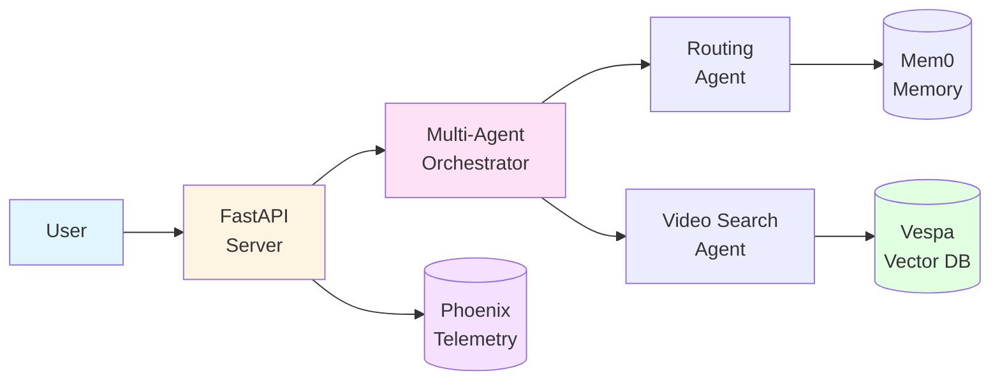

# Cogniverse User Guide

**Version:** 2.1.0 | **Last Updated:** 2025-01-13 | **Status:** Production Ready

Complete guide for using Cogniverse - the multi-agent system for multi-modal content analysis and search.

---

## Table of Contents

1. [Introduction](#introduction)
2. [Getting Started](#getting-started)
3. [Core Features](#core-features)
4. [Basic Operations](#basic-operations)
5. [Advanced Usage](#advanced-usage)
6. [API Reference](#api-reference)
7. [Configuration](#configuration)
8. [Troubleshooting](#troubleshooting)
9. [Best Practices](#best-practices)

---

## Introduction

### What is Cogniverse?

Cogniverse is a production-ready **multi-agent RAG (Retrieval-Augmented Generation) system** designed for intelligent video content analysis and search. It combines state-of-the-art embedding models, multi-agent orchestration, and complete multi-tenant isolation to provide:

- **Multi-Modal Search**: Search videos using text, images, or video queries
- **Intelligent Routing**: AI-powered query routing to the best search strategy
- **Automated Optimization**: Self-improving system using DSPy optimization
- **Complete Isolation**: Schema-per-tenant architecture for data security
- **Production Telemetry**: Comprehensive observability with Phoenix

### Key Capabilities

**For Content Managers:**
- Ingest and index video libraries with multiple embedding strategies
- Search across videos using natural language queries
- Get visual relevance scores and frame-level results
- Monitor performance with built-in dashboards

**For Data Scientists:**
- Run experiments with different embedding models and search strategies
- Evaluate search quality with reference-free and visual LLM metrics
- Optimize routing agents using synthetic data generation
- Track all experiments in Phoenix with full observability

**For Developers:**
- RESTful API for all operations
- Multi-tenant support with JWT authentication
- Configurable embedding profiles and search strategies
- Plugin architecture for custom components

### Architecture at a Glance



---

## Getting Started

### Prerequisites

Before using Cogniverse, ensure you have:

- **Python 3.12+** installed
- **16GB+ RAM** (32GB recommended for large video libraries)
- **Docker** for running Vespa, Phoenix, and Ollama
- **GPU** (optional but recommended for video processing)
- **uv package manager**: `pip install uv`

### Quick Start

Follow these steps to get Cogniverse running in 5 minutes:

#### 1. Installation

```bash
# Clone repository
git clone <repository-url>
cd cogniverse

# Install all dependencies
uv sync

# Start infrastructure services
docker compose up -d
```

#### 2. Verify Services

```bash
# Check Vespa (should return JSON status)
curl http://localhost:8080/ApplicationStatus

# Check Phoenix (should return "ok")
curl http://localhost:6006/health

# Check Ollama (should return list of models)
curl http://localhost:11434/api/tags
```

#### 3. Ingest Sample Videos

```bash
# Ingest videos with ColPali frame-level embeddings
JAX_PLATFORM_NAME=cpu uv run python scripts/run_ingestion.py \
  --video_dir data/testset/evaluation/sample_videos \
  --profile video_colpali_smol500_mv_frame \
  --tenant default
```

#### 4. Run Your First Query

```bash
# Test multi-agent search
JAX_PLATFORM_NAME=cpu uv run python tests/comprehensive_video_query_test_v2.py \
  --profiles video_colpali_smol500_mv_frame \
  --test-multiple-strategies
```

**Success!** You should see search results with ranked videos and relevance scores.

### Next Steps

- **View Results**: Open Phoenix dashboard at http://localhost:8501
- **Try API**: Use the REST API at http://localhost:8000/docs
- **Configure**: Customize profiles in `configs/config.json`
- **Learn More**: Continue reading this guide

---

## Core Features

### 1. Multi-Modal Video Search

Search videos using different modalities:

#### Text-to-Video Search
```python
from cogniverse_agents.search.video_search_agent import VideoSearchAgent
from cogniverse_core.config.unified_config import SystemConfig

# Initialize agent
config = SystemConfig(tenant_id="default")
agent = VideoSearchAgent(
    config,
    profile="video_colpali_smol500_mv_frame"
)

# Search with text
results = await agent.search(
    query="machine learning tutorial",
    top_k=10
)

for result in results:
    print(f"Video: {result['video_id']}")
    print(f"Score: {result['score']}")
    print(f"Frames: {result['frame_ids']}")
```

#### Image-to-Video Search
```python
# Search using an image
from PIL import Image

query_image = Image.open("query.jpg")
results = await agent.search(
    query_image=query_image,
    top_k=10
)
```

#### Video-to-Video Search
```python
# Find similar videos
results = await agent.search_similar(
    source_video_id="video_123",
    top_k=10
)
```

### 2. Intelligent Query Routing

Cogniverse automatically routes queries to the optimal search strategy:

```python
from cogniverse_agents.routing.routing_agent import RoutingAgent

# Initialize routing agent
routing_agent = RoutingAgent(tenant_id="default")

# Route query (automatic strategy selection)
decision = await routing_agent.route_query(
    query="cooking recipes with pasta"
)

print(f"Selected Strategy: {decision.strategy}")
print(f"Confidence: {decision.confidence}")
print(f"Detected Entities: {decision.entities}")
print(f"Query Modality: {decision.modality}")
```

**Routing Features:**
- **Entity Extraction**: Identifies people, places, concepts using GLiNER
- **Relationship Detection**: Finds relationships between entities
- **Query Enhancement**: Enriches queries with context
- **Modality Detection**: Classifies query type (factual, conceptual, visual, etc.)
- **Confidence Scoring**: Provides routing confidence for transparency

### 3. Multiple Embedding Models

Choose the best embedding model for your use case:

| Model | Type | Best For | Dimensions |
|-------|------|----------|------------|
| **ColPali SmolVLM** | Frame-level | Visual documents, text-rich videos | 768 |
| **VideoPrism Base** | Global video | Semantic video understanding | 768 |
| **VideoPrism LVT** | Temporal | Action/motion detection | 1152 |
| **ColQwen2 Omni** | Multi-modal | Text+visual fusion | 768 |

**Switching Models:**
```bash
# Use VideoPrism for global video understanding
uv run python scripts/run_ingestion.py \
  --video_dir data/videos \
  --profile video_videoprism_base_mv_chunk_30s \
  --tenant default
```

### 4. Hybrid Search Strategies

Combine multiple search methods for better results:

```python
# Available strategies:
strategies = [
    "bm25_only",           # Text-only BM25
    "float_float",         # Dense embeddings only
    "binary_binary",       # Binary embeddings (fast)
    "hybrid_float_bm25",   # BM25 + dense (recommended)
    "phased",              # Two-phase ranking
    "float_binary",        # Dense with binary fallback
    "bm25_float_rerank",   # BM25 then dense rerank
]

# Use hybrid search
results = await agent.search(
    query="tutorial",
    strategy="hybrid_float_bm25",
    top_k=20
)
```

### 5. Memory-Aware Search

Cogniverse remembers user context for personalized results:

```python
from cogniverse_core.common.mem0_memory_manager import Mem0MemoryManager

# Get memory manager for tenant
memory = Mem0MemoryManager.get_instance(
    tenant_id="default",
    user_id="user_123"
)

# Add user preference
memory.add(
    "User prefers beginner-level Python tutorials",
    user_id="user_123"
)

# Search considers memory automatically
results = await agent.search(
    query="Python tutorial",
    user_id="user_123"  # Includes user memory
)
```

### 6. Comprehensive Telemetry

Track everything with Phoenix:

```bash
# Launch Phoenix dashboard
uv run streamlit run scripts/phoenix_dashboard_standalone.py

# Open http://localhost:8501
```

**Dashboard Features:**
- **Traces**: Request flow visualization with span details
- **Experiments**: Compare A/B test results
- **Metrics**: Query latency, hit rates, routing accuracy
- **Memory**: View stored user context and preferences
- **Embeddings**: UMAP visualization of video embeddings

---

## Basic Operations

### Video Ingestion

#### Single Profile Ingestion

Ingest videos with one embedding model:

```bash
# Ingest with ColPali (frame-based)
JAX_PLATFORM_NAME=cpu uv run python scripts/run_ingestion.py \
  --video_dir data/videos \
  --profile video_colpali_smol500_mv_frame \
  --tenant default \
  --batch_size 10
```

#### Multi-Profile Ingestion

Ingest with multiple models for best coverage:

```bash
# Ingest with ColPali, VideoPrism, and ColQwen
JAX_PLATFORM_NAME=cpu uv run python scripts/run_ingestion.py \
  --video_dir data/videos \
  --profiles video_colpali_smol500_mv_frame \
             video_videoprism_base_mv_chunk_30s \
             video_colqwen_omni_mv_chunk_30s \
  --tenant default
```

**Ingestion Options:**
- `--video_dir`: Directory containing videos
- `--profile`: Single embedding profile
- `--profiles`: Multiple embedding profiles (space-separated)
- `--tenant`: Tenant ID for multi-tenancy
- `--batch_size`: Number of videos to process in parallel (default: 5)
- `--skip_existing`: Skip already ingested videos
- `--extract_keyframes`: Extract keyframes (default: true)
- `--transcribe_audio`: Transcribe audio with Whisper (default: true)

#### Check Ingestion Status

```python
from cogniverse_vespa.backends.vespa_search_client import VespaSearchClient

client = VespaSearchClient(
    host="localhost",
    port=8080,
    tenant_id="default"
)

# Count indexed videos
count = await client.count_documents(
    schema="video_colpali_smol500_mv_frame"
)
print(f"Total videos: {count}")
```

### Searching Videos

#### REST API Search

Use the REST API for production applications:

```bash
# Text search
curl -X POST http://localhost:8000/api/v1/search \
  -H "Content-Type: application/json" \
  -H "X-Tenant-ID: default" \
  -d '{
    "query": "machine learning tutorial",
    "top_k": 10,
    "strategy": "hybrid_float_bm25"
  }'
```

**Response:**
```json
{
  "results": [
    {
      "video_id": "video_123",
      "score": 0.95,
      "title": "Introduction to Machine Learning",
      "frames": [
        {"frame_id": "frame_45", "score": 0.98, "timestamp": "00:01:30"},
        {"frame_id": "frame_102", "score": 0.93, "timestamp": "00:03:25"}
      ],
      "transcript_snippet": "Machine learning is a subset of AI..."
    }
  ],
  "metadata": {
    "strategy_used": "hybrid_float_bm25",
    "query_time_ms": 145,
    "total_results": 25
  }
}
```

#### Python SDK Search

Use the Python SDK for scripting:

```python
from cogniverse_agents.search.video_search_agent import VideoSearchAgent
from cogniverse_core.config.unified_config import SystemConfig

# Initialize
config = SystemConfig(tenant_id="default")
agent = VideoSearchAgent(config, profile="video_colpali_smol500_mv_frame")

# Search
results = await agent.search(
    query="cooking pasta",
    top_k=10,
    strategy="hybrid_float_bm25"
)

# Process results
for result in results:
    print(f"Video: {result['title']}")
    print(f"Score: {result['score']:.2f}")
    print(f"Best Frame: {result['frames'][0]['timestamp']}")
```

#### Advanced Search Options

```python
# Search with filters
results = await agent.search(
    query="tutorial",
    top_k=10,
    filters={
        "duration_min": 300,  # At least 5 minutes
        "duration_max": 1800,  # At most 30 minutes
        "upload_date_after": "2024-01-01"
    }
)

# Search with reranking
results = await agent.search(
    query="Python tutorial",
    top_k=50,  # Get more candidates
    rerank=True,
    rerank_top_k=10  # Return top 10 after reranking
)

# Search specific frame range
results = await agent.search(
    query="introduction",
    top_k=10,
    frame_range=(0, 100)  # Search only first 100 frames
)
```

### Running Evaluations

#### Quick Evaluation

Evaluate search quality on a dataset:

```bash
# Run evaluation with Phoenix tracking
JAX_PLATFORM_NAME=cpu uv run python scripts/run_experiments_with_visualization.py \
  --dataset-name golden_eval_v1 \
  --profiles video_colpali_smol500_mv_frame \
  --test-multiple-strategies \
  --quality-evaluators
```

**This will:**
1. Load evaluation dataset with ground truth
2. Run queries through all search strategies
3. Compute quality metrics (MRR, NDCG, Precision@K)
4. Track results in Phoenix
5. Generate comparison charts

#### Custom Evaluation Dataset

Create your own evaluation dataset:

```python
# evaluation_dataset.json
{
  "queries": [
    {
      "query_id": "q1",
      "query_text": "machine learning basics",
      "relevant_videos": ["video_123", "video_456"],
      "relevance_scores": [1.0, 0.8]
    },
    {
      "query_id": "q2",
      "query_text": "Python tutorial for beginners",
      "relevant_videos": ["video_789"],
      "relevance_scores": [1.0]
    }
  ]
}
```

```bash
# Run evaluation on custom dataset
JAX_PLATFORM_NAME=cpu uv run python scripts/run_experiments_with_visualization.py \
  --dataset-path evaluation_dataset.json \
  --profiles video_colpali_smol500_mv_frame
```

#### Compare Embedding Models

Compare different embedding models:

```bash
# Run experiments with multiple profiles
JAX_PLATFORM_NAME=cpu uv run python scripts/run_experiments_with_visualization.py \
  --dataset-name golden_eval_v1 \
  --profiles video_colpali_smol500_mv_frame \
             video_videoprism_base_mv_chunk_30s \
             video_colqwen_omni_mv_chunk_30s \
  --test-multiple-strategies
```

**Results Table:**
```
Profile                              | MRR@10 | NDCG@10 | Precision@5
-------------------------------------|--------|---------|-------------
video_colpali_smol500_mv_frame       | 0.82   | 0.79    | 0.75
video_videoprism_base_mv_chunk_30s   | 0.78   | 0.74    | 0.70
video_colqwen_omni_mv_chunk_30s      | 0.85   | 0.82    | 0.78
```

---

## Advanced Usage

### Multi-Tenant Configuration

Set up multiple tenants with isolated data:

```python
from cogniverse_core.config.unified_config import SystemConfig

# Configure tenant A
config_a = SystemConfig(
    tenant_id="acme_corp",
    vespa_url="http://localhost:8080",
    phoenix_project_name="acme_corp_project"
)

# Configure tenant B
config_b = SystemConfig(
    tenant_id="startup_inc",
    vespa_url="http://localhost:8080",
    phoenix_project_name="startup_inc_project"
)

# Each tenant gets isolated:
# - Vespa schemas: video_frames_acme_corp, video_frames_startup_inc
# - Phoenix projects: acme_corp_project, startup_inc_project
# - Memory: separate Mem0 instances
```

**Tenant Lifecycle:**

```bash
# Create tenant and deploy schemas
uv run python scripts/admin/create_tenant.py \
  --tenant-id new_customer \
  --profiles video_colpali_smol500_mv_frame

# Ingest data for tenant
JAX_PLATFORM_NAME=cpu uv run python scripts/run_ingestion.py \
  --video_dir data/new_customer_videos \
  --profile video_colpali_smol500_mv_frame \
  --tenant new_customer

# Delete tenant (removes all data)
uv run python scripts/admin/delete_tenant.py \
  --tenant-id old_customer \
  --confirm
```

### Custom Embedding Profiles

Create custom profiles for specific use cases:

```json
// configs/config.json
{
  "backend": {
    "profiles": [
      {
        "profile_name": "video_custom_highres_frame",
        "schema_name": "video_custom_highres_frame",
        "embedding_model": "vidore/colsmol-500m",
        "pipeline_config": {
          "extract_keyframes": true,
          "keyframe_fps": 2.0,  // Higher frame rate
          "max_frames": 200,     // More frames
          "frame_resolution": [1920, 1080],  // High resolution
          "transcribe_audio": true,
          "whisper_model": "large-v3"  // Better transcription
        },
        "strategies": {
          "segmentation": {"class": "FrameSegmentationStrategy"},
          "embedding": {"class": "MultiVectorEmbeddingStrategy"}
        },
        "embedding_type": "float"
      }
    ]
  }
}
```

```bash
# Deploy custom profile schema
JAX_PLATFORM_NAME=cpu uv run python scripts/deploy_json_schema.py \
  --schema-path configs/schemas/video_custom_highres_frame.json \
  --tenant-id default

# Ingest with custom profile
JAX_PLATFORM_NAME=cpu uv run python scripts/run_ingestion.py \
  --video_dir data/videos \
  --profile video_custom_highres_frame \
  --tenant default
```

### DSPy Optimization

Optimize routing agent using DSPy:

```python
from cogniverse_agents.routing.optimization_orchestrator import OptimizationOrchestrator
from cogniverse_agents.routing.config import RoutingConfig

# Configure optimization
routing_config = RoutingConfig(
    tenant_id="default",
    optimizer_type="GEPA",  # Options: GEPA, MIPRO, Bootstrap, SIMBA
    experience_buffer_size=10000,
    learning_rate=0.001,
    update_interval=300,  # Update every 5 minutes
    synthetic_data_enabled=True
)

# Run optimization
orchestrator = OptimizationOrchestrator(config=routing_config)
results = orchestrator.run_optimization()

print(f"Baseline Accuracy: {results['baseline_accuracy']}")
print(f"Optimized Accuracy: {results['optimized_accuracy']}")
print(f"Improvement: {results['improvement']}%")
```

**Optimization Results:**
```
Baseline Routing Accuracy: 78.5%
Optimized Routing Accuracy: 92.3%
Improvement: +13.8%

Optimization Method: GEPA (Experience-Guided)
Training Examples: 5,000 synthetic + 2,000 real
Training Time: 45 minutes
```

### Batch Processing

Process large video libraries efficiently:

```python
from cogniverse_runtime.ingestion.pipeline import IngestionPipeline
from cogniverse_core.config.unified_config import SystemConfig

# Initialize pipeline
config = SystemConfig(tenant_id="default")
pipeline = IngestionPipeline(
    config,
    profile="video_colpali_smol500_mv_frame"
)

# Process videos in batches
video_dirs = [
    "data/batch1",
    "data/batch2",
    "data/batch3"
]

for video_dir in video_dirs:
    results = await pipeline.process_directory(
        video_dir,
        batch_size=20,  # Process 20 videos in parallel
        skip_existing=True
    )

    print(f"Processed: {results['success_count']}")
    print(f"Failed: {results['failure_count']}")
    print(f"Skipped: {results['skipped_count']}")
```

### API Authentication

Secure your API with JWT:

```python
# Generate API key for tenant
from cogniverse_runtime.admin.tenant_manager import TenantManager

manager = TenantManager()
api_key = manager.create_api_key(
    tenant_id="acme_corp",
    expires_in_days=90
)

print(f"API Key: {api_key}")
```

```bash
# Use API key in requests
curl -X POST http://localhost:8000/api/v1/search \
  -H "Content-Type: application/json" \
  -H "Authorization: Bearer <api_key>" \
  -d '{"query": "tutorial", "top_k": 10}'
```

---

## API Reference

### REST API Endpoints

#### Search Endpoint

```
POST /api/v1/search
```

**Request:**
```json
{
  "query": "string",
  "top_k": 10,
  "strategy": "hybrid_float_bm25",
  "profile": "video_colpali_smol500_mv_frame",
  "user_id": "user_123",
  "filters": {
    "duration_min": 300,
    "duration_max": 1800
  }
}
```

**Response:**
```json
{
  "results": [
    {
      "video_id": "string",
      "score": 0.95,
      "title": "string",
      "frames": [
        {"frame_id": "string", "score": 0.98, "timestamp": "00:01:30"}
      ]
    }
  ],
  "metadata": {
    "strategy_used": "string",
    "query_time_ms": 145
  }
}
```

#### Ingestion Endpoint

```
POST /api/v1/ingest
```

**Request (multipart/form-data):**
```
video: <file>
profile: video_colpali_smol500_mv_frame
metadata: {"title": "My Video", "tags": ["tutorial"]}
```

**Response:**
```json
{
  "video_id": "video_123",
  "status": "success",
  "frames_extracted": 150,
  "embedding_count": 150
}
```

#### Health Check

```
GET /api/v1/health
```

**Response:**
```json
{
  "status": "healthy",
  "services": {
    "vespa": "connected",
    "phoenix": "connected",
    "ollama": "connected"
  }
}
```

### Python SDK Reference

#### VideoSearchAgent

```python
from cogniverse_agents.search.video_search_agent import VideoSearchAgent

agent = VideoSearchAgent(config, profile="video_colpali_smol500_mv_frame")

# Search methods
await agent.search(query: str, top_k: int, strategy: str)
await agent.search_similar(video_id: str, top_k: int)
await agent.search_by_image(image: PIL.Image, top_k: int)

# Health check
health = agent.health_check()
```

#### RoutingAgent

```python
from cogniverse_agents.routing.routing_agent import RoutingAgent

agent = RoutingAgent(tenant_id="default")

# Route query
decision = await agent.route_query(query: str)

# Properties
decision.strategy        # Selected strategy
decision.confidence      # Routing confidence
decision.entities        # Extracted entities
decision.relationships   # Entity relationships
decision.modality        # Query modality
```

#### Mem0MemoryManager

```python
from cogniverse_core.common.mem0_memory_manager import Mem0MemoryManager

memory = Mem0MemoryManager.get_instance(
    tenant_id="default",
    user_id="user_123"
)

# Add memory
memory.add("User prefers Python tutorials", user_id="user_123")

# Search memory
relevant_memories = memory.search("tutorial preferences", user_id="user_123")

# Get all memories
all_memories = memory.get_all(user_id="user_123")
```

---

## Configuration

### System Configuration

Configure Cogniverse via `config.yml`:

```yaml
# config.yml
environment: production
log_level: INFO

vespa:
  host: localhost
  port: 8080
  config_port: 19071

phoenix:
  enabled: true
  collector_endpoint: localhost:4317

ollama:
  base_url: http://localhost:11434
  default_model: llama3.2

memory:
  provider: mem0
  backend: vespa
  collection: agent_memories

tenant:
  default_tenant_id: default
  allow_tenant_creation: true
```

### Profile Configuration

Configure embedding profiles in `configs/config.json`:

```json
{
  "backend": {
    "profiles": [
      {
        "profile_name": "video_colpali_smol500_mv_frame",
        "schema_name": "video_colpali_smol500_mv_frame",
        "embedding_model": "vidore/colsmol-500m",
        "pipeline_config": {
          "extract_keyframes": true,
          "keyframe_fps": 1.0,
          "max_frames": 100,
          "transcribe_audio": true
        },
        "strategies": {
          "segmentation": {"class": "FrameSegmentationStrategy"},
          "embedding": {"class": "MultiVectorEmbeddingStrategy"}
        },
        "embedding_type": "binary"
      }
    ]
  }
}
```

### Environment Variables

Configure via environment variables:

```bash
# Core Configuration
export COGNIVERSE_ENV=production
export COGNIVERSE_LOG_LEVEL=INFO
export DEFAULT_TENANT_ID=default

# Vespa Configuration
export VESPA_HOST=localhost
export VESPA_PORT=8080
export VESPA_CONFIG_PORT=19071

# Phoenix Configuration
export PHOENIX_ENABLED=true
export PHOENIX_COLLECTOR_ENDPOINT=localhost:4317
export PHOENIX_PROJECT_NAME=cogniverse

# Ollama Configuration
export OLLAMA_BASE_URL=http://localhost:11434

# JAX Configuration (for VideoPrism)
export JAX_PLATFORM_NAME=cpu

# Performance Tuning
export VESPA_POOL_SIZE=10
export EMBEDDING_BATCH_SIZE=32
```

---

## Troubleshooting

### Common Issues

#### Issue: "ModuleNotFoundError: No module named 'cogniverse_core'"

**Solution:**
```bash
cd /path/to/cogniverse
uv sync
source .venv/bin/activate  # or .venv\Scripts\activate on Windows
```

#### Issue: "Vespa connection refused"

**Solution:**
```bash
# Check if Vespa is running
docker ps | grep vespa

# Restart Vespa
docker restart vespa

# Check logs
docker logs vespa --tail 100
```

#### Issue: "Phoenix not recording spans"

**Solution:**
```bash
# Verify Phoenix endpoint
echo $PHOENIX_COLLECTOR_ENDPOINT

# Should be: localhost:4317 (gRPC)

# Test connectivity
curl http://localhost:6006/health
```

#### Issue: "Out of memory during ingestion"

**Solution:**
```bash
# Reduce batch size
JAX_PLATFORM_NAME=cpu uv run python scripts/run_ingestion.py \
  --video_dir data/videos \
  --profile video_colpali_smol500_mv_frame \
  --batch_size 2  # Reduce from default 5

# Or use binary embeddings (smaller memory footprint)
# Change embedding_type to "binary" in profile config
```

#### Issue: "Slow search performance"

**Solutions:**
1. Use binary embeddings instead of float
2. Enable caching in config.yml
3. Use BM25-only for text queries
4. Reduce top_k to get fewer results

```bash
# Use binary embeddings profile
JAX_PLATFORM_NAME=cpu uv run python scripts/run_ingestion.py \
  --video_dir data/videos \
  --profile video_colpali_binary_mv_frame \
  --tenant default
```

### Debug Mode

Enable debug logging:

```bash
export COGNIVERSE_LOG_LEVEL=DEBUG
export PHOENIX_ENABLED=true

uv run python scripts/run_ingestion.py \
  --video_dir data/videos \
  --profile video_colpali_smol500_mv_frame \
  --tenant default
```

### Getting Help

- **Documentation**: [docs/](../docs/)
- **GitHub Issues**: [Report bugs](https://github.com/org/cogniverse/issues)
- **Phoenix Dashboard**: http://localhost:8501 for system metrics
- **API Docs**: http://localhost:8000/docs for interactive API documentation

---

## Best Practices

### For Content Managers

1. **Use Multiple Profiles**: Ingest with ColPali (frames), VideoPrism (global), and ColQwen (chunks) for best coverage
2. **Enable Transcription**: Always transcribe audio for text search
3. **Monitor Quality**: Run evaluations weekly to track search quality
4. **Organize by Tenant**: Use separate tenants for different content libraries

### For Data Scientists

1. **Track Experiments**: Always run evaluations through Phoenix for reproducibility
2. **Use Synthetic Data**: Enable synthetic data generation for routing optimization
3. **Compare Strategies**: Test multiple search strategies on your dataset
4. **Monitor Drift**: Track query distribution changes in Phoenix

### For Developers

1. **Use SDK**: Prefer Python SDK over direct API calls for better error handling
2. **Handle Errors**: Always catch and handle exceptions
3. **Implement Caching**: Cache frequent queries at application level
4. **Test Multi-Tenant**: Test with multiple tenants to ensure isolation

### Performance Tips

1. **Binary Embeddings**: Use binary embeddings for 4x faster search with minimal accuracy loss
2. **Batch Ingestion**: Process videos in batches of 10-20 for optimal throughput
3. **Enable Caching**: Enable LRU cache for repeated queries
4. **Use BM25 First**: For pure text queries, use BM25-only strategy
5. **Prewarm Cache**: Warm up caches with common queries after ingestion

---

## Next Steps

### For Users
- **Advanced Features**: See [Advanced Configuration](operations/configuration.md)
- **Deployment**: See [Production Deployment](operations/deployment.md)
- **Monitoring**: See [Performance Monitoring](operations/performance-monitoring.md)

### For Developers
- **Developer Guide**: See [DEVELOPER_GUIDE.md](DEVELOPER_GUIDE.md)
- **Architecture**: See [architecture/overview.md](architecture/overview.md)
- **Module Docs**: See [modules/](modules/) for package-specific documentation

### For DevOps
- **Docker Deployment**: See [operations/docker-deployment.md](operations/docker-deployment.md)
- **Kubernetes Deployment**: See [operations/kubernetes-deployment.md](operations/kubernetes-deployment.md)
- **Multi-Tenant Operations**: See [operations/multi-tenant-ops.md](operations/multi-tenant-ops.md)

---

**Version**: 2.1.0
**Architecture**: UV Workspace (11 Packages - Layered Architecture)
**Last Updated**: 2025-01-13
**Status**: Production Ready
