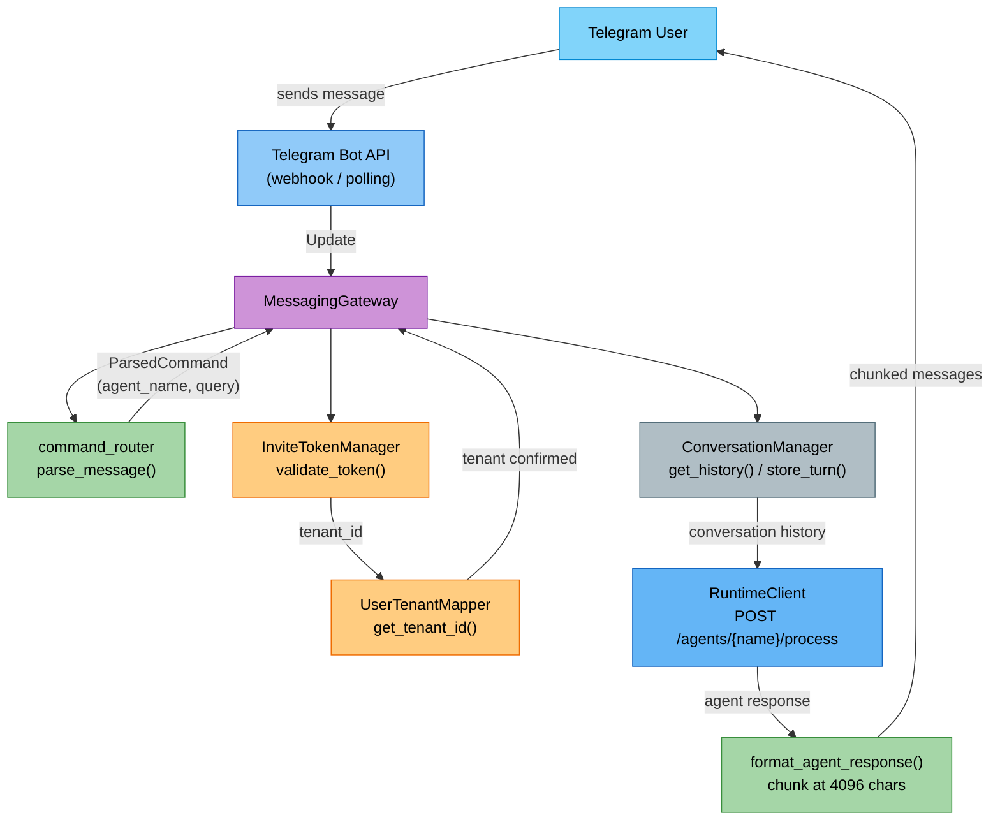
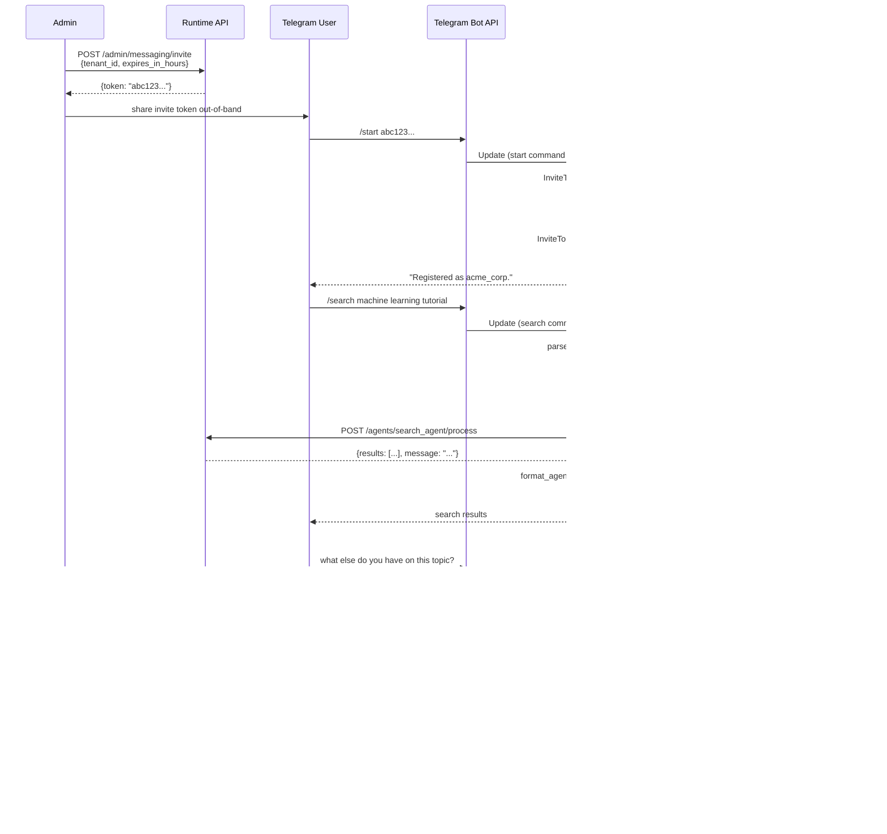
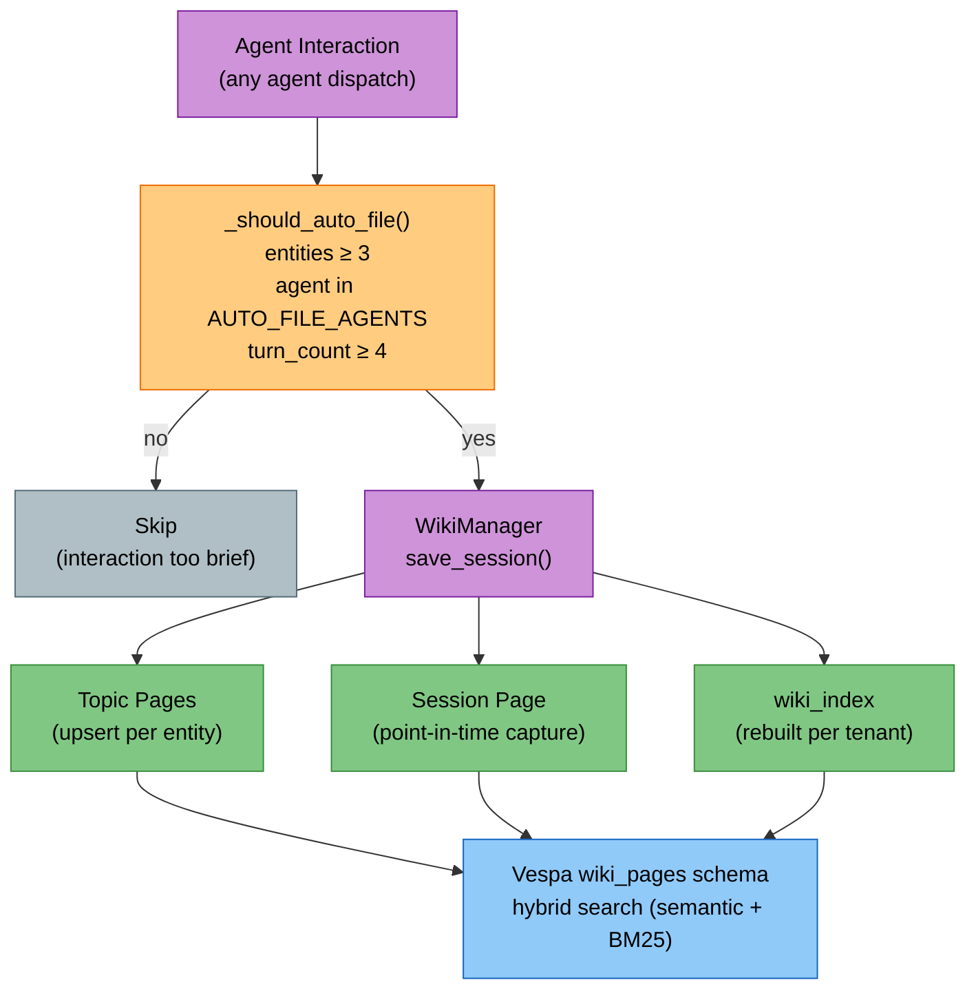

# Cogniverse User Guide
Complete guide for using Cogniverse - the general-purpose multi-agent AI platform for content intelligence and beyond.

---

## Table of Contents

1. [Introduction](#introduction)
2. [Getting Started](#getting-started)
3. [Core Features](#core-features)
4. [Basic Operations](#basic-operations)
5. [Advanced Usage](#advanced-usage)
6. [API Reference](#api-reference)
7. [Configuration](#configuration)
8. [Troubleshooting](#troubleshooting)
9. [Best Practices](#best-practices)

---

## Introduction

### Key Capabilities

**For Content Managers:**

- Ingest and index video libraries with multiple embedding strategies
- Search across videos using natural language queries
- Get visual relevance scores and frame-level results
- Monitor performance with built-in dashboards

**For Data Scientists:**

- Run experiments with different embedding models and search strategies
- Evaluate search quality with reference-free and visual LLM metrics
- Optimize routing agents using synthetic data generation
- Track all experiments in Phoenix with full observability

**For Developers:**

- RESTful API for all operations
- Multi-tenant support with tenant isolation
- Configurable embedding profiles and search strategies
- Plugin architecture for custom components

### Architecture at a Glance

See the full [Platform Overview](index.md#platform-overview) for the architecture diagram showing the complete system including agents, content store, memory, telemetry, optimization loop, and training pipeline.

---

## Getting Started

### Prerequisites

Before using Cogniverse, ensure you have:

- **Python 3.12+** installed
- **16GB+ RAM** (32GB recommended for large video libraries)
- **Docker** for running Vespa, Phoenix, and Ollama
- **GPU** (optional but recommended for video processing)
- **uv package manager**: `pip install uv`

### Quick Start

Follow these steps to get Cogniverse running in 5 minutes:

#### 1. Installation

```bash
# Clone repository
git clone <repository-url>
cd cogniverse

# Install all dependencies
uv sync

# Start infrastructure services
cogniverse up
```

#### 2. Verify Services

```bash
# Check Vespa (should return JSON status)
curl http://localhost:8080/ApplicationStatus

# Check Phoenix (should return "ok")
curl http://localhost:6006/health

# Check Ollama (should return list of models)
curl http://localhost:11434/api/tags
```

#### 3. Ingest Sample Videos

```bash
# Ingest videos with ColPali frame-level embeddings
JAX_PLATFORM_NAME=cpu uv run python scripts/run_ingestion.py \
  --video_dir data/testset/evaluation/sample_videos \
  --profile video_colpali_smol500_mv_frame \
  --tenant-id default
```

#### 4. Run Your First Query

```bash
# Test multi-agent search
JAX_PLATFORM_NAME=cpu uv run python tests/comprehensive_video_query_test_v2.py \
  --profiles video_colpali_smol500_mv_frame \
  --test-multiple-strategies
```

**Success!** You should see search results with ranked videos and relevance scores.

### Next Steps

- **View Results**: Open Phoenix dashboard at http://localhost:8501
- **Try API**: Use the REST API at http://localhost:8000/docs
- **Configure**: Customize profiles in `configs/config.json`
- **Coding Agent**: Run `cogniverse code` to start an interactive coding REPL with streaming — see [Coding Agent CLI](user/coding-agent-cli.md)
- **Learn More**: Continue reading this guide

---

## Core Features

### 1. Multi-Modal Video Search

Search videos using different modalities:

#### Text-to-Video Search
```python
from cogniverse_agents.video_agent_refactored import VideoSearchAgent
from cogniverse_foundation.config.utils import create_default_config_manager
from cogniverse_core.schemas.filesystem_loader import FilesystemSchemaLoader
from pathlib import Path

# Initialize agent with config manager and schema loader (both required)
config_manager = create_default_config_manager()
schema_loader = FilesystemSchemaLoader(Path("configs/schemas"))
agent = VideoSearchAgent(
    config_manager=config_manager,
    schema_loader=schema_loader
)

# Search with text (synchronous, not async)
# profile and tenant_id are per-request parameters on search()
results = agent.search(
    query="machine learning tutorial",
    profile="video_colpali_smol500_mv_frame",
    tenant_id="default",
    top_k=10
)

for result in results:
    print(f"Video: {result.document.metadata.get('video_id')}")
    print(f"Score: {result.score}")
    print(f"Frames: {result.document.metadata.get('frame_ids', [])}")
```

#### Multi-Profile Search
```python
# Search across different embedding profiles
from cogniverse_agents.video_agent_refactored import VideoSearchAgent
from cogniverse_foundation.config.utils import create_default_config_manager
from cogniverse_core.schemas.filesystem_loader import FilesystemSchemaLoader
from pathlib import Path

config_manager = create_default_config_manager()
schema_loader = FilesystemSchemaLoader(Path("configs/schemas"))

# Single agent instance handles all profiles (profile is per-request)
agent = VideoSearchAgent(
    config_manager=config_manager,
    schema_loader=schema_loader
)

# ColPali profile for semantic understanding
colpali_results = agent.search(
    query="cooking tutorial",
    profile="video_colpali_smol500_mv_frame",
    tenant_id="default",
    top_k=10
)

# VideoPrism profile for visual similarity
videoprism_results = agent.search(
    query="cooking tutorial",
    profile="video_videoprism_base_mv_chunk_30s",
    tenant_id="default",
    top_k=10
)
```

#### Date-Filtered Search
```python
# Search with date filters
results = agent.search(
    query="machine learning tutorial",
    profile="video_colpali_smol500_mv_frame",
    tenant_id="default",
    top_k=10,
    start_date="2024-01-01",
    end_date="2024-12-31"
)
```

### 2. Intelligent Query Routing

Cogniverse automatically routes queries to the optimal search strategy:

```python
from cogniverse_agents.routing_agent import RoutingAgent, RoutingDeps
from cogniverse_foundation.config.unified_config import LLMEndpointConfig
from cogniverse_foundation.telemetry import TelemetryConfig

# Initialize routing agent with deps
deps = RoutingDeps(
    telemetry_config=TelemetryConfig(),
    llm_config=LLMEndpointConfig(
        model="ollama/qwen3:4b",
        api_base="http://localhost:11434",
    ),
)
routing_agent = RoutingAgent(deps=deps)

# Route query (automatic strategy selection)
# Note: route_query is async, must be called within async function
decision = await routing_agent.route_query(
    query="cooking recipes with pasta"
)

print(f"Recommended Agent: {decision.recommended_agent}")
print(f"Confidence: {decision.confidence}")
print(f"Detected Entities: {decision.entities}")
print(f"Reasoning: {decision.reasoning}")
```

**Routing Features:**

- **Entity Extraction**: Identifies people, places, concepts using GLiNER
- **Relationship Detection**: Finds relationships between entities
- **Query Enhancement**: Enriches queries with context
- **Modality Detection**: Classifies query type (factual, conceptual, visual, etc.)
- **Confidence Scoring**: Provides routing confidence for transparency

### 3. Multiple Embedding Models

Choose the best embedding model for your use case:

| Model | Type | Best For | Dimensions |
|-------|------|----------|------------|
| **ColPali SmolVLM** | Frame-level | Visual documents, text-rich videos | 128 (patch) |
| **VideoPrism Base** | Global video | Semantic video understanding | 768 |
| **VideoPrism LVT Base** | Temporal | Action/motion detection | 768 |
| **VideoPrism LVT Large** | Temporal | Enhanced temporal understanding | 1024 |
| **ColQwen2 Omni** | Multi-modal | Text+visual fusion | 128 (patch) |

**Switching Models:**
```bash
# Use VideoPrism for global video understanding
uv run python scripts/run_ingestion.py \
  --video_dir data/videos \
  --profile video_videoprism_base_mv_chunk_30s \
  --tenant-id default
```

### 4. Hybrid Search Strategies

Combine multiple search methods for better results:

```python
# Available strategies:
strategies = [
    "bm25_only",           # Text-only BM25
    "float_float",         # Dense embeddings only
    "binary_binary",       # Binary embeddings (fast)
    "hybrid_float_bm25",   # BM25 + dense (recommended)
    "phased",              # Two-phase ranking
    "float_binary",        # Dense with binary fallback
    "bm25_float_rerank",   # BM25 then dense rerank
]

# Use hybrid search (synchronous call)
results = agent.search(
    query="tutorial",
    profile="video_colpali_smol500_mv_frame",
    tenant_id="default",
    top_k=20
)
```

### 5. Memory-Aware Search

Cogniverse remembers user context for personalized results:

```python
from cogniverse_core.memory.manager import Mem0MemoryManager
from cogniverse_foundation.config.utils import create_default_config_manager
from cogniverse_core.schemas.filesystem_loader import FilesystemSchemaLoader
from pathlib import Path

# Initialize required dependencies
config_manager = create_default_config_manager()
schema_loader = FilesystemSchemaLoader(Path("configs/schemas"))

# Get memory manager (singleton per tenant via __new__)
memory = Mem0MemoryManager(tenant_id="default")

# Initialize with required parameters
memory.initialize(
    backend_host="localhost",
    backend_port=8080,
    llm_model="ollama/gemma3:4b",
    embedding_model="ollama/nomic-embed-text",
    llm_base_url="http://localhost:11434",
    config_manager=config_manager,
    schema_loader=schema_loader,
)

# Add user preference
memory.add_memory(
    content="User prefers beginner-level Python tutorials",
    tenant_id="default",
    agent_name="search_agent",
    metadata={"user_id": "user_123"}
)

# Search memories
user_memories = memory.search_memory(
    query="Python tutorial preferences",
    tenant_id="default",
    agent_name="search_agent",
    top_k=5
)
```

### 6. Comprehensive Telemetry

Track everything with Phoenix:

```bash
# Launch Phoenix dashboard
uv run streamlit run scripts/phoenix_dashboard_standalone.py

# Open http://localhost:8501
```

**Dashboard Features:**

- **Traces**: Request flow visualization with span details
- **Experiments**: Compare A/B test results
- **Metrics**: Query latency, hit rates, routing accuracy
- **Memory**: View stored user context and preferences
- **Embeddings**: UMAP visualization of video embeddings

---

## Basic Operations

### Video Ingestion

#### Single Profile Ingestion

Ingest videos with one embedding model:

```bash
# Ingest with ColPali (frame-based)
JAX_PLATFORM_NAME=cpu uv run python scripts/run_ingestion.py \
  --video_dir data/videos \
  --profile video_colpali_smol500_mv_frame \
  --tenant-id default
```

#### Multi-Profile Ingestion

Ingest with multiple models for best coverage:

```bash
# Ingest with ColPali, VideoPrism, and ColQwen
JAX_PLATFORM_NAME=cpu uv run python scripts/run_ingestion.py \
  --video_dir data/videos \
  --profile video_colpali_smol500_mv_frame \
            video_videoprism_base_mv_chunk_30s \
            video_colqwen_omni_mv_chunk_30s \
  --tenant-id default
```

**Ingestion Options:**

- `--video_dir`: Directory containing videos
- `--profile`: Embedding profile(s) - can specify multiple space-separated values
- `--tenant-id`: Tenant ID for multi-tenancy (default: default_tenant)
- `--backend`: Backend to use (choices: byaldi, vespa; default: vespa)
- `--max-concurrent`: Maximum concurrent videos to process (default: 3)
- `--output_dir`: Output directory for processed data
- `--max-frames`: Maximum frames per video
- `--test-mode`: Use test mode with limited frames
- `--debug`: Enable debug mode

**Note:** Processing options like keyframe extraction, transcription, and frame sampling are configured per-profile in `configs/config.json`, not via CLI arguments.

#### Check Ingestion Status

```python
from cogniverse_vespa.vespa_search_client import VespaVideoSearchClient
from cogniverse_foundation.config.utils import create_default_config_manager

config_manager = create_default_config_manager()
client = VespaVideoSearchClient(
    backend_url="http://localhost",
    backend_port=8080,
    tenant_id="acme",
    config_manager=config_manager
)

# Count indexed videos (via Vespa query)
# Note: Use the search service for production queries
```

### Searching Videos

#### REST API Search

Use the REST API for production applications:

```bash
# Text search
curl -X POST http://localhost:8000/search/ \
  -H "Content-Type: application/json" \
  -d '{
    "query": "machine learning tutorial",
    "top_k": 10,
    "strategy": "hybrid",
    "tenant_id": "default"
  }'
```

**Response:**
```json
{
  "query": "machine learning tutorial",
  "profile": "video_colpali_smol500_mv_frame",
  "strategy": "hybrid",
  "results_count": 10,
  "results": [
    {
      "document_id": "doc_123",
      "score": 0.95,
      "metadata": {
        "source_id": "video_123",
        "frame_id": "frame_45"
      },
      "highlights": {}
    }
  ],
  "session_id": null
}
```

#### Python SDK Search

Use the Python SDK for scripting:

```python
from cogniverse_agents.video_agent_refactored import VideoSearchAgent
from cogniverse_foundation.config.utils import create_default_config_manager
from cogniverse_core.schemas.filesystem_loader import FilesystemSchemaLoader
from pathlib import Path

# Initialize with config manager and schema loader (both required)
config_manager = create_default_config_manager()
schema_loader = FilesystemSchemaLoader(Path("configs/schemas"))
agent = VideoSearchAgent(
    config_manager=config_manager,
    schema_loader=schema_loader
)

# Search (synchronous - no await needed)
# profile and tenant_id are per-request parameters
results = agent.search(
    query="cooking pasta",
    profile="video_colpali_smol500_mv_frame",
    tenant_id="default",
    top_k=10
)

# Process results (SearchResult objects have .document and .score)
for result in results:
    print(f"Video: {result.document.metadata.get('video_id')}")
    print(f"Score: {result.score:.2f}")
```

#### Advanced Search Options

```python
# Search with date filters
results = agent.search(
    query="tutorial",
    profile="video_colpali_smol500_mv_frame",
    tenant_id="default",
    top_k=10,
    start_date="2024-01-01",  # Filter by upload date
    end_date="2024-12-31"
)

# Search with more results
results = agent.search(
    query="Python tutorial",
    profile="video_colpali_smol500_mv_frame",
    tenant_id="default",
    top_k=50  # Get more candidates for client-side filtering
)
```

### Running Evaluations

#### Quick Evaluation

Evaluate search quality on a dataset:

```bash
# Run evaluation with Phoenix tracking
JAX_PLATFORM_NAME=cpu uv run python scripts/run_experiments_with_visualization.py \
  --dataset-name golden_eval_v1 \
  --profiles video_colpali_smol500_mv_frame \
  --all-strategies \
  --quality-evaluators
```

**This will:**

1. Load evaluation dataset with ground truth
2. Run queries through all search strategies
3. Compute quality metrics (MRR, NDCG, Precision@K)
4. Track results in Phoenix
5. Generate comparison charts

#### Custom Evaluation Dataset

Create your own evaluation dataset:

```python
# evaluation_dataset.json
{
  "queries": [
    {
      "query_id": "q1",
      "query_text": "machine learning basics",
      "relevant_videos": ["video_123", "video_456"],
      "relevance_scores": [1.0, 0.8]
    },
    {
      "query_id": "q2",
      "query_text": "Python tutorial for beginners",
      "relevant_videos": ["video_789"],
      "relevance_scores": [1.0]
    }
  ]
}
```

```bash
# Run evaluation on custom dataset
JAX_PLATFORM_NAME=cpu uv run python scripts/run_experiments_with_visualization.py \
  --csv-path evaluation_dataset.json \
  --profiles video_colpali_smol500_mv_frame
```

#### Compare Embedding Models

Compare different embedding models:

```bash
# Run experiments with multiple profiles
JAX_PLATFORM_NAME=cpu uv run python scripts/run_experiments_with_visualization.py \
  --dataset-name golden_eval_v1 \
  --profiles video_colpali_smol500_mv_frame \
             video_videoprism_base_mv_chunk_30s \
             video_colqwen_omni_mv_chunk_30s \
  --all-strategies
```

**Results Table:**
```text
Profile                              | MRR@10 | NDCG@10 | Precision@5
-------------------------------------|--------|---------|-------------
video_colpali_smol500_mv_frame       | 0.82   | 0.79    | 0.75
video_videoprism_base_mv_chunk_30s   | 0.78   | 0.74    | 0.70
video_colqwen_omni_mv_chunk_30s      | 0.85   | 0.82    | 0.78
```

---

## Advanced Usage

### Multi-Tenant Configuration

Set up multiple tenants with isolated data:

```python
from cogniverse_foundation.config.unified_config import SystemConfig

# Configure tenant A
config_a = SystemConfig(
    tenant_id="acme_corp",
    backend_url="http://localhost",
    backend_port=8080
)

# Configure tenant B
config_b = SystemConfig(
    tenant_id="startup_inc",
    backend_url="http://localhost",
    backend_port=8080
)

# Each tenant gets isolated:
# - Vespa schemas: video_frames_acme_corp, video_frames_startup_inc
# - Phoenix projects: acme_corp_project, startup_inc_project
# - Memory: separate Mem0 instances
```

**Tenant Lifecycle:**

```bash
# Ingest data for tenant (tenant is implicitly created on first use)
JAX_PLATFORM_NAME=cpu uv run python scripts/run_ingestion.py \
  --video_dir data/new_customer_videos \
  --profile video_colpali_smol500_mv_frame \
  --tenant-id new_customer

# Note: Explicit tenant creation/deletion APIs are available via
# the standalone tenant_manager service (not the main runtime)
```

### Custom Embedding Profiles

Create custom profiles for specific use cases:

```json
{
  "backend": {
    "profiles": {
      "video_custom_highres_frame": {
        "type": "video",
        "description": "Custom high-resolution frame-based profile",
        "schema_name": "video_custom_highres_frame",
        "embedding_model": "vidore/colsmol-500m",
        "pipeline_config": {
          "extract_keyframes": true,
          "keyframe_strategy": "fps",
          "keyframe_fps": 2.0,
          "transcribe_audio": true,
          "generate_descriptions": true,
          "generate_embeddings": true
        },
        "strategies": {
          "segmentation": {
            "class": "FrameSegmentationStrategy",
            "params": {
              "fps": 2.0,
              "threshold": 0.999,
              "max_frames": 200
            }
          },
          "embedding": {
            "class": "MultiVectorEmbeddingStrategy",
            "params": {}
          }
        },
        "embedding_type": "multi_vector"
      }
    }
  }
}
```

```bash
# Deploy custom profile schema
JAX_PLATFORM_NAME=cpu uv run python scripts/deploy_json_schema.py \
  configs/schemas/video_custom_highres_frame.json

# Ingest with custom profile
JAX_PLATFORM_NAME=cpu uv run python scripts/run_ingestion.py \
  --video_dir data/videos \
  --profile video_custom_highres_frame \
  --tenant-id default
```

### DSPy Optimization

Optimize routing agent using DSPy:

```python
from cogniverse_agents.routing.optimization_orchestrator import OptimizationOrchestrator

# Initialize orchestrator with configuration
orchestrator = OptimizationOrchestrator(
    tenant_id="default",
    span_eval_interval_minutes=15,
    annotation_interval_minutes=30,
    confidence_threshold=0.6,
    min_annotations_for_optimization=50
)

# Run one complete optimization cycle (for testing)
# Note: run_once is async, must be called within async function
results = await orchestrator.run_once()

print(f"Span Evaluation: {results['span_evaluation']}")
print(f"Annotation Requests: {results['annotation_requests']}")
print(f"Annotations Generated: {results.get('annotations_generated', 0)}")
print(f"Feedback Loop: {results['feedback_loop']}")

# Or start continuous optimization (for production)
# await orchestrator.start()  # Runs continuously (also async)
```

**Optimization Results:**
```text
Baseline Routing Accuracy: 78.5%
Optimized Routing Accuracy: 92.3%
Improvement: +13.8%

Optimization Method: GEPA (Experience-Guided)
Training Examples: 5,000 synthetic + 2,000 real
Training Time: 45 minutes
```

### Batch Processing

Process large video libraries efficiently using the CLI:

```bash
# Process videos in batches using the ingestion script
JAX_PLATFORM_NAME=cpu uv run python scripts/run_ingestion.py \
  --video_dir data/batch1 \
  --profile video_colpali_smol500_mv_frame \
  --tenant-id default

# Or via the API
curl -X POST http://localhost:8000/ingestion/start \
  -H "Content-Type: application/json" \
  -d '{
    "video_dir": "data/batch1",
    "profile": "video_colpali_smol500_mv_frame",
    "tenant_id": "default",
    "batch_size": 10
  }'

# Check status
curl http://localhost:8000/ingestion/status/{job_id}
```

### API Authentication

Authentication is handled via tenant isolation. Each request includes a `tenant_id`:

```bash
# Search with tenant ID
curl -X POST http://localhost:8000/search/ \
  -H "Content-Type: application/json" \
  -d '{
    "query": "tutorial",
    "top_k": 10,
    "tenant_id": "acme_corp"
  }'
```

**Note:** Tenant isolation provides logical separation of data. API key authentication is planned for future releases.

### Telegram Messaging Gateway

Users can interact with Cogniverse via Telegram after receiving an invite token:

**Admin: generate an invite token**
```bash
curl -X POST http://localhost:8000/admin/messaging/invite \
  -H "Content-Type: application/json" \
  -d '{"tenant_id": "acme_corp", "expires_in_hours": 24}'

# Returns: {"token": "abc123def456...", "tenant_id": "acme_corp"}
```

**User: register and use the bot**

1. Send `/start abc123def456...` to the bot to link your account
2. Use commands to interact with agents:

| Command | Agent | Example |
|---------|-------|---------|
| `/search <query>` | search_agent | `/search machine learning tutorial` |
| `/summarize <query>` | summarizer_agent | `/summarize the Python basics video` |
| `/report <query>` | detailed_report_agent | `/report Q4 content performance` |
| `/research <query>` | deep_research_agent | `/research best practices for async Python` |
| `/code <query>` | coding_agent | `/code write a FastAPI health endpoint` |
| `/wiki save` | — | Save current session to the wiki |
| `/wiki search <query>` | — | Search the wiki knowledge base |
| `/wiki topic <name>` | — | Look up a topic page by name |
| `/wiki index` | — | Show the full wiki index |
| `/wiki lint` | — | Check wiki for orphan, stale, or empty pages |
| Plain text | routing_agent | `what videos do you have on transformers?` |
| Photo/video | search_agent | Send a frame to search for similar content |
| `/help` | — | Show all available commands |

Conversation history is maintained via Mem0 across sessions. The gateway runs in polling mode for development (`GATEWAY_MODE=polling`) and webhook mode for production (`GATEWAY_MODE=webhook` with `TELEGRAM_WEBHOOK_URL` set).

#### Gateway Architecture


```mermaid
flowchart TD
    TG["<span style='color:#000'>Telegram User</span>"]
    BOT["<span style='color:#000'>Telegram Bot API<br/>(webhook / polling)</span>"]
    GW["<span style='color:#000'>MessagingGateway</span>"]
    CR["<span style='color:#000'>command_router<br/>parse_message()</span>"]
    AUTH["<span style='color:#000'>InviteTokenManager<br/>validate_token()</span>"]
    UM["<span style='color:#000'>UserTenantMapper<br/>get_tenant_id()</span>"]
    CM["<span style='color:#000'>ConversationManager<br/>get_history() / store_turn()</span>"]
    RC["<span style='color:#000'>RuntimeClient<br/>POST /agents/{name}/process</span>"]
    FMT["<span style='color:#000'>format_agent_response()<br/>chunk at 4096 chars</span>"]

    TG -->|"sends message"| BOT
    BOT -->|"Update"| GW
    GW --> CR
    CR -->|"ParsedCommand<br/>(agent_name, query)"| GW
    GW --> AUTH
    AUTH -->|"tenant_id"| UM
    UM -->|"tenant confirmed"| GW
    GW --> CM
    CM -->|"conversation history"| RC
    RC -->|"agent response"| FMT
    FMT -->|"chunked messages"| TG

    style TG fill:#81d4fa,stroke:#0288d1,color:#000
    style BOT fill:#90caf9,stroke:#1565c0,color:#000
    style GW fill:#ce93d8,stroke:#7b1fa2,color:#000
    style CR fill:#a5d6a7,stroke:#388e3c,color:#000
    style AUTH fill:#ffcc80,stroke:#ef6c00,color:#000
    style UM fill:#ffcc80,stroke:#ef6c00,color:#000
    style CM fill:#b0bec5,stroke:#546e7a,color:#000
    style RC fill:#64b5f6,stroke:#1565c0,color:#000
    style FMT fill:#a5d6a7,stroke:#388e3c,color:#000
```

#### End-to-End User Flow


```mermaid
sequenceDiagram
    participant ADM as Admin
    participant RT as Runtime API
    participant USR as Telegram User
    participant BOT as Telegram Bot API
    participant GW as MessagingGateway
    participant MEM as Mem0 Memory

    ADM->>RT: POST /admin/messaging/invite<br/>{tenant_id, expires_in_hours}
    RT-->>ADM: {token: "abc123..."}
    ADM->>USR: share invite token out-of-band

    USR->>BOT: /start abc123...
    BOT->>GW: Update (start command + token)
    GW->>GW: InviteTokenManager.validate_token()
    GW->>MEM: UserTenantMapper.register_user()
    GW->>GW: InviteTokenManager.mark_token_used()
    GW-->>USR: "Registered as acme_corp."

    USR->>BOT: /search machine learning tutorial
    BOT->>GW: Update (search command)
    GW->>GW: parse_message() → search_agent
    GW->>MEM: ConversationManager.get_history(chat_id)
    MEM-->>GW: prior turns
    GW->>RT: POST /agents/search_agent/process
    RT-->>GW: {results: [...], message: "..."}
    GW->>GW: format_agent_response() → chunk at 4096 chars
    GW-->>USR: search results
    GW->>MEM: ConversationManager.store_turn(user + assistant)

    USR->>BOT: what else do you have on this topic?
    BOT->>GW: Update (plain text)
    GW->>GW: parse_message() → routing_agent
    GW->>MEM: ConversationManager.get_history(chat_id)
    MEM-->>GW: prior turns (multi-turn context)
    GW->>RT: POST /agents/routing_agent/process<br/>(with conversation_history)
    RT-->>GW: {message: "..."}
    GW-->>USR: routed response
    GW->>MEM: ConversationManager.store_turn()
```

### Wiki Knowledge Base

Cogniverse automatically saves agent interactions as searchable wiki pages. Pages are stored in Vespa using hybrid search (semantic + BM25) and indexed per tenant.

#### Page Types

| Type | Description |
|------|-------------|
| **Topic page** | Named page that grows over time — new content is appended each time the topic is mentioned. Stable `doc_id` based on the entity name slug. |
| **Session page** | Point-in-time capture of a single agent interaction — one page per conversation. Cross-references the topic pages it touched. |

A separate `wiki_index` document is maintained per tenant listing all pages and summaries.

#### Auto-Filing

After every agent dispatch, the system checks whether the interaction is substantial enough to auto-file as a wiki session. An interaction is filed automatically when **any** of the following is true:

- 3 or more entities were extracted from the response
- The agent is `detailed_report_agent` or `deep_research_agent`
- The conversation has 4 or more turns

Auto-filing is fire-and-forget (non-blocking). Failures are logged but never surfaced to the user.

#### Auto-Filing Flow


```mermaid
flowchart TD
    AGENT["<span style='color:#000'>Agent Interaction<br/>(any agent dispatch)</span>"]
    CHECK["<span style='color:#000'>_should_auto_file()<br/>entities ≥ 3<br/>agent in AUTO_FILE_AGENTS<br/>turn_count ≥ 4</span>"]
    SKIP["<span style='color:#000'>Skip<br/>(interaction too brief)</span>"]
    WM["<span style='color:#000'>WikiManager<br/>save_session()</span>"]
    TOPIC["<span style='color:#000'>Topic Pages<br/>(upsert per entity)</span>"]
    SESSION["<span style='color:#000'>Session Page<br/>(point-in-time capture)</span>"]
    INDEX["<span style='color:#000'>wiki_index<br/>(rebuilt per tenant)</span>"]
    VESPA["<span style='color:#000'>Vespa wiki_pages schema<br/>hybrid search (semantic + BM25)</span>"]

    AGENT --> CHECK
    CHECK -->|"no"| SKIP
    CHECK -->|"yes"| WM
    WM --> TOPIC
    WM --> SESSION
    WM --> INDEX
    TOPIC --> VESPA
    SESSION --> VESPA
    INDEX --> VESPA

    style AGENT fill:#ce93d8,stroke:#7b1fa2,color:#000
    style CHECK fill:#ffcc80,stroke:#ef6c00,color:#000
    style SKIP fill:#b0bec5,stroke:#546e7a,color:#000
    style WM fill:#ce93d8,stroke:#7b1fa2,color:#000
    style TOPIC fill:#81c784,stroke:#388e3c,color:#000
    style SESSION fill:#81c784,stroke:#388e3c,color:#000
    style INDEX fill:#81c784,stroke:#388e3c,color:#000
    style VESPA fill:#90caf9,stroke:#1565c0,color:#000
```

#### Telegram /wiki Commands

Use these commands in Telegram to interact with the wiki directly:

| Command | Description |
|---------|-------------|
| `/wiki save` | Save the current session to the wiki |
| `/wiki search <query>` | Search the wiki knowledge base |
| `/wiki topic <name>` | Look up a topic page by name |
| `/wiki index` | Show the full wiki index |
| `/wiki lint` | Check wiki for orphan, stale, or empty pages |

#### REST API

| Endpoint | Method | Description |
|----------|--------|-------------|
| `/wiki/save` | POST | Persist an agent interaction as a wiki page |
| `/wiki/search` | POST | Full-text search over wiki pages |
| `/wiki/topic/{slug}` | GET | Retrieve a topic page by slug |
| `/wiki/index` | GET | Return the rendered wiki index |
| `/wiki/lint` | GET | Report orphan, stale, and empty pages |
| `/wiki/topic/{slug}` | DELETE | Delete a topic page by slug |

```bash
# Save a wiki page
curl -X POST http://localhost:8000/wiki/save \
  -H "Content-Type: application/json" \
  -d '{
    "query": "machine learning basics",
    "response": {"answer": "ML is..."},
    "entities": ["machine_learning"],
    "agent_name": "routing_agent",
    "tenant_id": "acme_corp"
  }'

# Search wiki pages
curl -X POST http://localhost:8000/wiki/search \
  -H "Content-Type: application/json" \
  -d '{"query": "machine learning", "tenant_id": "acme_corp", "top_k": 5}'

# Get a topic page
curl http://localhost:8000/wiki/topic/machine_learning

# Get the wiki index
curl http://localhost:8000/wiki/index

# Run lint checks
curl http://localhost:8000/wiki/lint

# Delete a topic page
curl -X DELETE http://localhost:8000/wiki/topic/machine_learning
```

---

### RLM (Recursive Language Model)

RLM enables agents to process context that exceeds normal token limits by recursively decomposing inputs using a Python REPL. Available on search, report, code, and research agents.

To activate, pass `rlm` in the request:
```bash
curl -X POST http://localhost:28000/agents/detailed_report_agent/process \
  -H 'Content-Type: application/json' \
  -d '{"agent_name": "detailed_report_agent", "query": "Analyze these results", "context": {"tenant_id": "default"}, "rlm": {"enabled": true, "max_iterations": 5}}'
```

RLM is opt-in and disabled by default. When enabled, telemetry metrics (depth, calls, tokens, latency) are included in the response for A/B testing.

---

## API Reference

### REST API Endpoints

#### Search Endpoint

```http
POST /search/
```

**Request:**
```json
{
  "query": "string",
  "top_k": 10,
  "strategy": "hybrid",
  "profile": "video_colpali_smol500_mv_frame",
  "tenant_id": "default",
  "filters": {}
}
```

**Response:**
```json
{
  "query": "string",
  "profile": "video_colpali_smol500_mv_frame",
  "strategy": "hybrid",
  "results_count": 10,
  "results": [
    {
      "document_id": "string",
      "score": 0.95,
      "metadata": {},
      "highlights": {}
    }
  ],
  "session_id": null
}
```

#### Ingestion Endpoint

```http
POST /ingestion/start
```

**Request:**
```json
{
  "video_dir": "/path/to/videos",
  "profile": "video_colpali_smol500_mv_frame",
  "backend": "vespa",
  "tenant_id": "default",
  "batch_size": 10
}
```

**Response:**
```json
{
  "job_id": "abc123",
  "status": "started",
  "message": "Ingestion job started successfully"
}
```

**Check Status:**
```http
GET /ingestion/status/{job_id}
```

**Status Response:**
```json
{
  "job_id": "abc123",
  "status": "processing",
  "videos_processed": 5,
  "videos_total": 10,
  "errors": []
}
```

#### Health Check

```http
GET /health
```

**Response:**
```json
{
  "status": "healthy",
  "service": "cogniverse-runtime",
  "backends": {
    "registered": 1,
    "backends": ["vespa"]
  },
  "agents": {
    "registered": 3,
    "agents": ["search", "routing", "summarizer"]
  }
}
```

### Python SDK Reference

#### VideoSearchAgent

```python
from cogniverse_agents.video_agent_refactored import VideoSearchAgent
from cogniverse_foundation.config.utils import create_default_config_manager
from cogniverse_core.schemas.filesystem_loader import FilesystemSchemaLoader
from pathlib import Path

config_manager = create_default_config_manager()
schema_loader = FilesystemSchemaLoader(Path("configs/schemas"))
agent = VideoSearchAgent(
    config_manager=config_manager,
    schema_loader=schema_loader
)

# Search method (profile and tenant_id are per-request parameters)
results = agent.search(
    query="machine learning",
    profile="video_colpali_smol500_mv_frame",
    tenant_id="default",
    top_k=10,
    start_date="2024-01-01",  # Optional
    end_date="2024-12-31"     # Optional
)
```

#### RoutingAgent

```python
from cogniverse_agents.routing_agent import RoutingAgent, RoutingDeps
from cogniverse_foundation.config.unified_config import LLMEndpointConfig
from cogniverse_foundation.telemetry import TelemetryConfig

# Create dependencies (telemetry_config is required)
deps = RoutingDeps(
    telemetry_config=TelemetryConfig(),
    llm_config=LLMEndpointConfig(
        model="ollama/qwen3:4b",
        api_base="http://localhost:11434",
    ),
)

agent = RoutingAgent(deps=deps)

# Route query (async method - must be called within async function)
decision = await agent.route_query(query="machine learning tutorial")

# Access routing decision properties
decision.recommended_agent # Recommended agent name
decision.confidence        # Routing confidence score
decision.entities          # Extracted entities
decision.relationships     # Entity relationships
decision.enhanced_query    # Enhanced query string
```

#### Mem0MemoryManager

```python
from cogniverse_core.memory.manager import Mem0MemoryManager
from cogniverse_foundation.config.utils import create_default_config_manager
from cogniverse_core.schemas.filesystem_loader import FilesystemSchemaLoader
from pathlib import Path

# Initialize required dependencies first
config_manager = create_default_config_manager()
schema_loader = FilesystemSchemaLoader(Path("configs/schemas"))

# Instantiate (per-tenant singleton pattern)
memory = Mem0MemoryManager(tenant_id="default")

# Initialize with all required parameters
memory.initialize(
    backend_host="localhost",
    backend_port=8080,
    llm_model="ollama/gemma3:4b",
    embedding_model="ollama/nomic-embed-text",
    llm_base_url="http://localhost:11434",
    config_manager=config_manager,
    schema_loader=schema_loader,
)

# Add memory (requires tenant_id and agent_name)
memory.add_memory(
    content="User prefers Python tutorials",
    tenant_id="default",
    agent_name="search_agent"
)

# Search memory
relevant_memories = memory.search_memory(
    query="tutorial preferences",
    tenant_id="default",
    agent_name="search_agent",
    top_k=5
)

# Get all memories
all_memories = memory.get_all_memories(tenant_id="default", agent_name="search_agent")
```

---

## Configuration

### System Configuration

Configuration is loaded from `configs/config.json`. The system auto-discovers this file from:
1. `COGNIVERSE_CONFIG` environment variable (if set)
2. `configs/config.json` (from current directory)
3. `../configs/config.json` (one level up)
4. `../../configs/config.json` (two levels up)

See [Profile Configuration](#profile-configuration) below for the actual config.json structure.

### Profile Configuration

Configure embedding profiles in `configs/config.json`:

```json
{
  "backend": {
    "profiles": {
      "video_colpali_smol500_mv_frame": {
        "type": "video",
        "description": "Frame-based ColPali profile",
        "schema_name": "video_colpali_smol500_mv_frame",
        "embedding_model": "vidore/colsmol-500m",
        "pipeline_config": {
          "extract_keyframes": true,
          "keyframe_strategy": "fps",
          "keyframe_fps": 1.0,
          "transcribe_audio": true,
          "generate_descriptions": true,
          "generate_embeddings": true
        },
        "strategies": {
          "segmentation": {
            "class": "FrameSegmentationStrategy",
            "params": {
              "fps": 1.0,
              "threshold": 0.999,
              "max_frames": 3000
            }
          },
          "embedding": {
            "class": "MultiVectorEmbeddingStrategy",
            "params": {}
          }
        },
        "embedding_type": "multi_vector"
      }
    }
  }
}
```

### Environment Variables

The following environment variables are honored by the system:

```bash
# Configuration File Discovery
export COGNIVERSE_CONFIG=/path/to/config.json  # Override config file path

# JAX Configuration (required for VideoPrism models)
export JAX_PLATFORM_NAME=cpu  # Required on Apple Silicon or systems without GPU

# HuggingFace (for model downloads)
export HF_TOKEN=your_token_here  # HuggingFace access token for gated models
```

**Note:** Most configuration is done via `configs/config.json`. Environment variables are minimal - primarily `JAX_PLATFORM_NAME` for VideoPrism compatibility and `COGNIVERSE_CONFIG` to override the config file location.

---

## Troubleshooting

### Common Issues

#### Issue: "ModuleNotFoundError: No module named 'cogniverse_core'"

**Solution:**
```bash
cd /path/to/cogniverse
uv sync
source .venv/bin/activate  # or .venv\Scripts\activate on Windows
```

#### Issue: "Vespa connection refused"

**Solution:**
```bash
# Check if Vespa is running
docker ps | grep vespa

# Restart Vespa
docker restart vespa

# Check logs
docker logs vespa --tail 100
```

#### Issue: "Phoenix not recording spans"

**Solution:**
```bash
# Verify Phoenix endpoint
echo $PHOENIX_COLLECTOR_ENDPOINT

# Should be: localhost:4317 (gRPC)

# Test connectivity
curl http://localhost:6006/health
```

#### Issue: "Out of memory during ingestion"

**Solution:**
```bash
# Reduce concurrent processing
JAX_PLATFORM_NAME=cpu uv run python scripts/run_ingestion.py \
  --video_dir data/videos \
  --profile video_colpali_smol500_mv_frame \
  --max-concurrent 1  # Reduce from default 3

# Or use binary embeddings via ranking strategies
# Binary embeddings are configured in schema_config and used via ranking strategies
```

#### Issue: "Slow search performance"

**Solutions:**

1. Use binary embeddings instead of float
2. Enable caching in config.json
3. Use BM25-only for text queries
4. Reduce top_k to get fewer results

```bash
# Binary embeddings are configured per-profile in schema_config.binary_dim
# Use standard profiles - they support both float and binary embeddings
JAX_PLATFORM_NAME=cpu uv run python scripts/run_ingestion.py \
  --video_dir data/videos \
  --profile video_colpali_smol500_mv_frame \
  --tenant-id default
```

### Debug Mode

Enable debug logging by configuring the logging level in your Python script or using standard Python logging configuration:

```bash
# Run ingestion with verbose output
JAX_PLATFORM_NAME=cpu uv run python scripts/run_ingestion.py \
  --video_dir data/videos \
  --profile video_colpali_smol500_mv_frame \
  --tenant-id default

# Check logs
tail -f outputs/logs/*.log
```

**Note:** Logging levels are configured programmatically or via `configs/config.json`, not via environment variables.

### Getting Help

- **Documentation**: [Home](index.md)
- **GitHub Issues**: [Report bugs](https://github.com/org/cogniverse/issues)
- **Phoenix Dashboard**: http://localhost:8501 for system metrics
- **API Docs**: http://localhost:8000/docs for interactive API documentation

---

## Best Practices

### For Content Managers

1. **Use Multiple Profiles**: Ingest with ColPali (frames), VideoPrism (global), and ColQwen (chunks) for best coverage
2. **Enable Transcription**: Always transcribe audio for text search
3. **Monitor Quality**: Run evaluations weekly to track search quality
4. **Organize by Tenant**: Use separate tenants for different content libraries

### For Data Scientists

1. **Track Experiments**: Always run evaluations through Phoenix for reproducibility
2. **Use Synthetic Data**: Enable synthetic data generation for routing optimization
3. **Compare Strategies**: Test multiple search strategies on your dataset
4. **Monitor Drift**: Track query distribution changes in Phoenix

### For Developers

1. **Use SDK**: Prefer Python SDK over direct API calls for better error handling
2. **Handle Errors**: Always catch and handle exceptions
3. **Implement Caching**: Cache frequent queries at application level
4. **Test Multi-Tenant**: Test with multiple tenants to ensure isolation

### Performance Tips

1. **Binary Embeddings**: Use binary embeddings for 4x faster search with minimal accuracy loss
2. **Batch Ingestion**: Process videos in batches of 10-20 for optimal throughput
3. **Enable Caching**: Enable LRU cache for repeated queries
4. **Use BM25 First**: For pure text queries, use BM25-only strategy
5. **Prewarm Cache**: Warm up caches with common queries after ingestion

---

## Next Steps

### For Users
- **Advanced Features**: See [Advanced Configuration](operations/configuration.md)
- **Deployment**: See [Production Deployment](operations/deployment.md)
- **Monitoring**: See [Performance Monitoring](operations/performance-monitoring.md)

### Developer Resources
- **Developer Guide**: See [DEVELOPER_GUIDE.md](DEVELOPER_GUIDE.md)
- **Architecture**: See [architecture/overview.md](architecture/overview.md)
- **Module Docs**: See [modules/sdk.md](modules/sdk.md) for package-specific documentation

### For DevOps
- **Deployment**: See [operations/deployment.md](operations/deployment.md) (use `cogniverse up`)
- **Kubernetes Deployment**: See [operations/kubernetes-deployment.md](operations/kubernetes-deployment.md)
- **Multi-Tenant Operations**: See [operations/multi-tenant-ops.md](operations/multi-tenant-ops.md)

