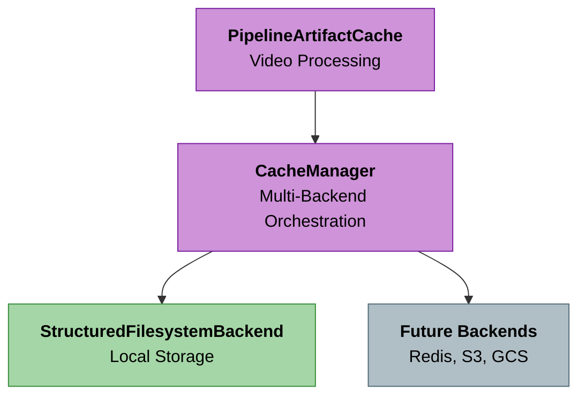

# Production Caching Strategy

Caching architecture for the Cogniverse multi-agent video search system with pluggable backends and multi-tenant support.

## Overview

The caching system provides a unified interface for caching across all components with:

- **Pluggable backends**: Extensible via `CacheBackend` ABC
- **Multi-tenant isolation**: Key prefixing with profile/schema_name
- **Priority-based tiers**: Multiple backends with configurable priority
- **Pipeline integration**: Specialized caching for video processing artifacts

## Architecture



## Cache Backend Interface

The actual interface from `cogniverse_core.common.cache.base`:

```python
from abc import ABC, abstractmethod
from typing import Any, Dict, List, Optional, Tuple

class CacheBackend(ABC):
    """Abstract base class for cache backends"""

    @abstractmethod
    async def get(self, key: str) -> Optional[Any]:
        """Retrieve value from cache"""
        pass

    @abstractmethod
    async def set(self, key: str, value: Any, ttl: Optional[int] = None) -> bool:
        """Store value in cache with optional TTL in seconds"""
        pass

    @abstractmethod
    async def delete(self, key: str) -> bool:
        """Delete key from cache"""
        pass

    @abstractmethod
    async def exists(self, key: str) -> bool:
        """Check if key exists in cache"""
        pass

    @abstractmethod
    async def clear(self, pattern: Optional[str] = None) -> int:
        """Clear cache entries matching pattern"""
        pass

    @abstractmethod
    async def get_stats(self) -> Dict[str, Any]:
        """Get cache statistics"""
        pass

    # Optional methods
    async def get_metadata(self, key: str) -> Optional[Dict[str, Any]]:
        """Get metadata for a key (optional)"""
        return None

    async def list_keys(
        self, pattern: Optional[str] = None, include_metadata: bool = False
    ) -> List[Tuple[str, Optional[Dict[str, Any]]]]:
        """List keys matching pattern (optional)"""
        return []

    async def cleanup_expired(self) -> int:
        """Clean up expired entries (optional)"""
        return 0
```

## Cache Manager

Manages multiple cache backends with priority-based tier promotion:

```python
from cogniverse_core.common.cache.base import CacheManager, CacheConfig

# Configuration
cache_config = CacheConfig(
    backends=[
        {
            "backend_type": "structured_filesystem",
            "priority": 0,
            "enabled": True,
            "base_path": "/var/cache/cogniverse",
            "enable_ttl": True,
            "cleanup_on_startup": True
        }
    ],
    default_ttl=604800,  # 7 days
    enable_compression=True,
    serialization_format="pickle"
)

# Initialize
manager = CacheManager(cache_config)

# Usage
await manager.set("my_key", data, ttl=3600)
value = await manager.get("my_key")
await manager.delete("my_key")
stats = await manager.get_stats()
```

**Key Features:**
- Priority-based backend selection (lower number = higher priority)
- Automatic tier promotion on cache hits
- Aggregated statistics across all backends

## Multi-Tenant Isolation

Tenant isolation is achieved through **key prefixing** using the schema name:

```python
from cogniverse_core.common.cache.pipeline_cache import PipelineArtifactCache

# Profile is set to tenant-specific schema name
cache = PipelineArtifactCache(
    cache_manager=manager,
    ttl=604800,
    profile="video_frames_acme"  # Tenant-specific schema name
)

# Keys are automatically prefixed:
# "video_frames_acme:video:my_video:keyframes"
```

**Key Structure:**
```text
{profile}:video:{video_name}:{artifact_type}[:parameters]

Examples:
video_frames_acme:video:intro_vid:keyframes:strategy=similarity:max_frames=3000:threshold=0.999
video_frames_acme:video:intro_vid:transcript:model=base:lang=auto
document_content_startup:video:demo:transcript:model=base:lang=auto
```

## Pipeline Artifact Cache

Specialized caching for video processing results:

```python
from cogniverse_core.common.cache.pipeline_cache import PipelineArtifactCache

cache = PipelineArtifactCache(
    cache_manager=manager,
    ttl=604800,  # 7 days
    profile=schema_name  # Tenant isolation
)

# Cache keyframes
await cache.set_keyframes(
    video_path="/path/to/video.mp4",
    keyframes_metadata=keyframes_data,
    keyframe_images=None,  # Optional
    strategy="similarity",
    threshold=0.999,
    max_frames=3000
)

# Retrieve cached keyframes (with default parameters)
cached = await cache.get_keyframes(
    video_path="/path/to/video.mp4",
    strategy="similarity",
    threshold=0.999,
    max_frames=3000
)

# Cache transcript
await cache.set_transcript(
    video_path="/path/to/video.mp4",
    transcript_data=transcript_data,
    model_size="base",
    language=None
)

# Check all cached artifacts for a video
artifacts = await cache.get_all_artifacts(
    video_path="/path/to/video.mp4",
    pipeline_config={"extract_keyframes": True, "transcribe_audio": True}
)

# Invalidate all cache entries for a video
await cache.invalidate_video(video_path="/path/to/video.mp4")
```

## Structured Filesystem Backend

The default backend implementation using local filesystem:

```python
from cogniverse_core.common.cache.backends.structured_filesystem import (
    StructuredFilesystemBackend,
    StructuredFilesystemConfig
)

config = StructuredFilesystemConfig(
    backend_type="structured_filesystem",
    base_path="/var/cache/cogniverse",  # Override default (~/.cache/cogniverse/pipeline)
    serialization_format="pickle",
    enabled=True,
    priority=0,
    enable_ttl=True,
    cleanup_on_startup=True
)

backend = StructuredFilesystemBackend(config)

# Metadata stored alongside cached files
# Supports pattern-based listing and cleanup
# TTL enforcement and cleanup on startup
```

## Usage in Ingestion Pipeline

```python
from cogniverse_runtime.ingestion.pipeline import VideoIngestionPipeline
from cogniverse_foundation.config.utils import create_default_config_manager

# Initialize config manager with cache configuration
config_manager = create_default_config_manager()

# Pipeline automatically initializes cache from config_manager
pipeline = VideoIngestionPipeline(
    tenant_id="my_tenant",
    config_manager=config_manager,
    schema_name="video_frames_acme"
)

# Cache configuration is read from config_manager's app_config:
# {
#     "pipeline_cache": {
#         "enabled": True,
#         "backends": [
#             {
#                 "backend_type": "structured_filesystem",
#                 "base_path": "/var/cache/cogniverse",
#                 "priority": 0,
#                 "enabled": True,
#                 "enable_ttl": True,
#                 "cleanup_on_startup": True
#             }
#         ],
#         "default_ttl": 604800,
#         "enable_compression": True,
#         "serialization_format": "pickle"
#     }
# }

# Cache is used automatically during processing
# - Keyframes cached after extraction
# - Transcriptions cached after audio processing
# - Embeddings cached after model inference
```

## Configuration

```yaml
pipeline_cache:
  enabled: true
  default_ttl: 604800  # 7 days
  enable_compression: true
  serialization_format: pickle

  backends:
    - backend_type: structured_filesystem
      priority: 0
      enabled: true
      base_path: /var/cache/cogniverse
      enable_ttl: true
      cleanup_on_startup: true
```

## Cache Statistics

```python
stats = await manager.get_stats()

# Returns:
{
    "manager": {
        "hits": 1234,
        "misses": 56,
        "sets": 789,
        "deletes": 12,
        "hit_rate": 0.956,
        "size_bytes": 52428800,
        "total_files": 456
    },
    "backends": {
        "StructuredFilesystemBackend": {
            "hits": 0,
            "misses": 0,
            "sets": 0,
            "deletes": 0,
            "evictions": 0,
            "size_bytes": 52428800,
            "total_files": 456,
            "metadata_files": 456
        }
    }
}
```

## Best Practices

1. **Use profile for tenant isolation**: Always set `profile` to tenant-specific schema name
2. **Set appropriate TTLs**: Match TTL to data freshness requirements
3. **Monitor hit rates**: Low hit rates may indicate cache sizing issues
4. **Enable TTL enforcement**: Set `enable_ttl: true` and `cleanup_on_startup: true` to prevent disk exhaustion
5. **Use compression**: Enable for large artifacts like embeddings

## Key Locations

- `libs/core/cogniverse_core/common/cache/base.py` - CacheBackend ABC, CacheManager
- `libs/core/cogniverse_core/common/cache/pipeline_cache.py` - PipelineArtifactCache
- `libs/core/cogniverse_core/common/cache/backends/` - Backend implementations
- `libs/runtime/cogniverse_runtime/ingestion/pipeline.py` - Pipeline integration
