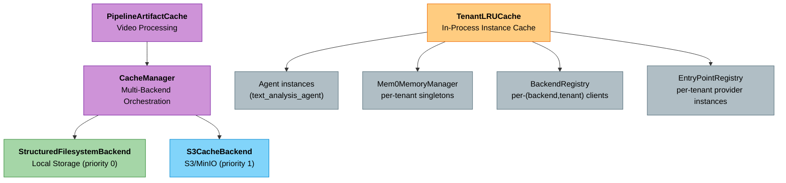

# Production Caching Strategy

Caching architecture for the Cogniverse multi-agent video search system. Two independent caching systems exist:

1. **Pipeline artifact cache** (`cogniverse_core.common.cache`) — durable, disk/S3-backed cache for video processing outputs (keyframes, transcripts, descriptions, segment frames), keyed by tenant/schema profile.
2. **Tenant instance cache** (`cogniverse_foundation.caching.TenantLRUCache`) — bounded in-memory LRU cache for per-tenant singleton objects (agent instances, memory managers, backend clients, registry instances), used to prevent unbounded per-tenant memory growth in long-running processes.

## Overview

The pipeline artifact cache provides a unified interface for caching across ingestion components with:

- **Pluggable backends**: Extensible via `CacheBackend` ABC
- **Multi-tenant isolation**: Key prefixing with profile/schema_name
- **Priority-based tiers**: Multiple backends with configurable priority
- **Pipeline integration**: Specialized caching for video processing artifacts

The tenant instance cache provides bounded, thread-safe, per-tenant object caching with:

- **Capacity-bounded LRU eviction**: Oldest-used tenant is evicted when a configurable capacity is exceeded
- **Atomic get-or-build**: `get_or_set` resolves or builds a per-tenant instance under a lock so concurrent callers share one instance
- **Eviction callbacks**: An optional `on_evict` hook releases native resources (Vespa clients, gRPC channels) when a tenant is evicted

## Architecture


```mermaid
flowchart TD
    PAC["<span style='color:#000'><b>PipelineArtifactCache</b><br/>Video Processing</span>"] --> CM["<span style='color:#000'><b>CacheManager</b><br/>Multi-Backend Orchestration</span>"]
    CM --> SFS["<span style='color:#000'><b>StructuredFilesystemBackend</b><br/>Local Storage (priority 0)</span>"]
    CM --> S3["<span style='color:#000'><b>S3CacheBackend</b><br/>S3/MinIO (priority 1)</span>"]

    TLC["<span style='color:#000'><b>TenantLRUCache</b><br/>In-Process Instance Cache</span>"] --> AGT["<span style='color:#000'>Agent instances<br/>(text_analysis_agent)</span>"]
    TLC --> MEM["<span style='color:#000'>Mem0MemoryManager<br/>per-tenant singletons</span>"]
    TLC --> BR["<span style='color:#000'>BackendRegistry<br/>per-(backend,tenant) clients</span>"]
    TLC --> EPR["<span style='color:#000'>EntryPointRegistry<br/>per-tenant provider instances</span>"]

    style PAC fill:#ce93d8,stroke:#7b1fa2,color:#000
    style CM fill:#ce93d8,stroke:#7b1fa2,color:#000
    style SFS fill:#a5d6a7,stroke:#388e3c,color:#000
    style S3 fill:#81d4fa,stroke:#0288d1,color:#000
    style TLC fill:#ffcc80,stroke:#ef6c00,color:#000
    style AGT fill:#b0bec5,stroke:#546e7a,color:#000
    style MEM fill:#b0bec5,stroke:#546e7a,color:#000
    style BR fill:#b0bec5,stroke:#546e7a,color:#000
    style EPR fill:#b0bec5,stroke:#546e7a,color:#000
```

## Cache Backend Interface

The actual interface from `cogniverse_core.common.cache.base`:

```python
from abc import ABC, abstractmethod
from typing import Any, Dict, List, Optional, Tuple

class CacheBackend(ABC):
    """Abstract base class for cache backends"""

    @abstractmethod
    async def get(self, key: str) -> Optional[Any]:
        """Retrieve value from cache"""
        pass

    @abstractmethod
    async def set(self, key: str, value: Any, ttl: Optional[int] = None) -> bool:
        """Store value in cache with optional TTL in seconds"""
        pass

    @abstractmethod
    async def delete(self, key: str) -> bool:
        """Delete key from cache"""
        pass

    @abstractmethod
    async def exists(self, key: str) -> bool:
        """Check if key exists in cache"""
        pass

    @abstractmethod
    async def clear(self, pattern: Optional[str] = None) -> int:
        """Clear cache entries matching pattern"""
        pass

    @abstractmethod
    async def get_stats(self) -> Dict[str, Any]:
        """Get cache statistics"""
        pass

    # Optional methods
    async def get_metadata(self, key: str) -> Optional[Dict[str, Any]]:
        """Get metadata for a key (optional)"""
        return None

    async def list_keys(
        self, pattern: Optional[str] = None, include_metadata: bool = False
    ) -> List[Tuple[str, Optional[Dict[str, Any]]]]:
        """List keys matching pattern (optional)"""
        return []

    async def cleanup_expired(self) -> int:
        """Clean up expired entries (optional)"""
        return 0
```

## Cache Manager

Manages multiple cache backends with priority-based tier promotion:

```python
from cogniverse_core.common.cache.base import CacheManager, CacheConfig

# Configuration
cache_config = CacheConfig(
    backends=[
        {
            "backend_type": "structured_filesystem",
            "priority": 0,
            "enabled": True,
            "base_path": "/var/cache/cogniverse",
            "enable_ttl": True,
            "cleanup_on_startup": True
        }
    ],
    default_ttl=604800,  # 7 days
    enable_compression=True,
    serialization_format="pickle"
)

# Initialize
manager = CacheManager(cache_config)

# Usage
await manager.set("my_key", data, ttl=3600)
value = await manager.get("my_key")
await manager.delete("my_key")
stats = await manager.get_stats()
```

**Key Features:**
- Priority-based backend selection (lower number = higher priority)
- Automatic tier promotion on cache hits
- Aggregated statistics across all backends

`CacheConfig.enable_stats` gates statistics collection: when `False`, `CacheManager`
stops incrementing its hit/miss/set/delete counters and `get_stats()` returns
`{"enabled": False}`. `CacheConfig.enable_compression` and `serialization_format` are
both propagated to each backend that does not override them (see
`_initialize_backends`) — a backend's own `CONFIG_CLASS` field (e.g.
`StructuredFilesystemConfig.enable_compression` / `.serialization_format`) is what it
actually reads at runtime, and wins over the manager-level value when the backend's
own config dict sets it explicitly. `enable_compression` controls whether `_serialize`
gzip-compresses the payload; `serialization_format` selects pickle/json/msgpack
encoding.

## Multi-Tenant Isolation

Tenant isolation is achieved through **key prefixing** using the schema name:

```python
from cogniverse_core.common.cache.pipeline_cache import PipelineArtifactCache

# Profile is set to tenant-specific schema name
cache = PipelineArtifactCache(
    cache_manager=manager,
    ttl=604800,
    profile="video_frames_acme"  # Tenant-specific schema name
)

# Keys are automatically prefixed with the profile and a SHA-256 digest
# of the canonicalized video path (see Key Structure below):
# "video_frames_acme:video:a3f2e9d8c7b6a5f4:keyframes:..."
```

**Key Structure:**

The video segment is **not** the human-readable video name — `_generate_video_key` canonicalizes the video path to a URI (`file://<absolute>` for bare paths) and SHA-256 hashes it, keeping the first 16 hex characters. Artifact parameters are appended sorted alphabetically by keyword (`sorted(kwargs.items())`), not in call order:

```text
{profile}:video:{sha256_digest_16hex}:{artifact_type}[:param=value ...]

Examples:
video_frames_acme:video:a3f2e9d8c7b6a5f4:keyframes:max_frames=3000:strategy=similarity:threshold=0.999
video_frames_acme:video:a3f2e9d8c7b6a5f4:transcript:lang=auto:model=base
document_content_startup:video:7c1b9e4f0a2d8863:transcript:lang=auto:model=base
```

## Pipeline Artifact Cache

Specialized caching for video processing results:

```python
from cogniverse_core.common.cache.pipeline_cache import PipelineArtifactCache

cache = PipelineArtifactCache(
    cache_manager=manager,
    ttl=604800,  # 7 days
    profile=schema_name  # Tenant isolation
)

# Cache keyframes
await cache.set_keyframes(
    video_path="/path/to/video.mp4",
    keyframes_metadata=keyframes_data,
    keyframe_images=None,  # Optional
    strategy="similarity",
    threshold=0.999,
    max_frames=3000
)

# Retrieve cached keyframes (with default parameters)
cached = await cache.get_keyframes(
    video_path="/path/to/video.mp4",
    strategy="similarity",
    threshold=0.999,
    max_frames=3000
)

# Cache transcript
await cache.set_transcript(
    video_path="/path/to/video.mp4",
    transcript_data=transcript_data,
    model_size="base",
    language=None
)

# Cache VLM frame descriptions
await cache.set_descriptions(
    video_path="/path/to/video.mp4",
    descriptions_data=descriptions_data,
    model_name="Qwen/Qwen2-VL-2B-Instruct",
    batch_size=500
)
descriptions = await cache.get_descriptions(
    video_path="/path/to/video.mp4",
    model_name="Qwen/Qwen2-VL-2B-Instruct",
    batch_size=500
)

# Cache temporal segment frames (e.g. for chunked/segment-based profiles)
await cache.set_segment_frames(
    video_path="/path/to/video.mp4",
    segment_id=0,
    start_time=0.0,
    end_time=6.0,
    frames=frame_list,
    timestamps=timestamp_list,
    sampling_fps=2.0,
    max_frames=12
)
segment = await cache.get_segment_frames(
    video_path="/path/to/video.mp4",
    segment_id=0,
    start_time=0.0,
    end_time=6.0
)

# Invalidate all cache entries for a video
await cache.invalidate_video(video_path="/path/to/video.mp4")
```

`PipelineArtifactCache` supports four artifact types end to end: keyframes, audio transcripts, frame descriptions, and temporal segment frames, each fetched with its own getter. Full per-method parameter documentation lives in `docs/modules/cache.md`.

## Structured Filesystem Backend

The default backend implementation using local filesystem:

```python
from cogniverse_core.common.cache.backends.structured_filesystem import (
    StructuredFilesystemBackend,
    StructuredFilesystemConfig
)

config = StructuredFilesystemConfig(
    backend_type="structured_filesystem",
    base_path="/var/cache/cogniverse",  # Override default (~/.cache/cogniverse/pipeline)
    serialization_format="pickle",
    enabled=True,
    priority=0,
    enable_ttl=True,
    cleanup_on_startup=True
)

backend = StructuredFilesystemBackend(config)

# Metadata stored alongside cached files
# Supports pattern-based listing and cleanup
# TTL enforcement and cleanup on startup
```

## S3 Cache Backend

The S3/MinIO backend stores artifacts remotely and is registered under the key `"s3"`:

```python
from cogniverse_core.common.cache.backends.s3 import S3CacheBackend, S3CacheBackendConfig

config = S3CacheBackendConfig(
    backend_type="s3",
    # endpoint/access_key/secret_key default to MINIO_* env vars when None
    endpoint=None,          # falls back to MINIO_ENDPOINT
    access_key=None,        # falls back to MINIO_ACCESS_KEY
    secret_key=None,        # falls back to MINIO_SECRET_KEY
    bucket="cogniverse-pipeline-cache",
    key_prefix="pipeline/",
    priority=1,
    enabled=True,
)

backend = S3CacheBackend(config)
# Uses asyncio.to_thread for async I/O; envelope metadata stored in S3
# object Metadata["cache-meta"] as JSON.
```

To use S3 as a second tier alongside the local filesystem:

```yaml
pipeline_cache:
  enabled: true
  default_ttl: 604800
  enable_compression: true
  serialization_format: pickle

  backends:
    - backend_type: structured_filesystem
      priority: 0
      enabled: true
      base_path: /var/cache/cogniverse
      enable_ttl: true
      cleanup_on_startup: true

    - backend_type: s3
      priority: 1
      enabled: true
      # endpoint, access_key, secret_key read from MINIO_* env vars
      bucket: cogniverse-pipeline-cache
      key_prefix: pipeline/
```

## Usage in Ingestion Pipeline

```python
from cogniverse_runtime.ingestion.pipeline import VideoIngestionPipeline
from cogniverse_foundation.config.utils import create_default_config_manager

# Initialize config manager with cache configuration
config_manager = create_default_config_manager()

# Pipeline automatically initializes cache from config_manager
pipeline = VideoIngestionPipeline(
    tenant_id="my_tenant",
    config_manager=config_manager,
    schema_name="video_frames_acme"
)

# Cache configuration is read from config_manager's app_config:
# {
#     "pipeline_cache": {
#         "enabled": True,
#         "backends": [
#             {
#                 "backend_type": "structured_filesystem",
#                 "base_path": "/var/cache/cogniverse",
#                 "priority": 0,
#                 "enabled": True,
#                 "enable_ttl": True,
#                 "cleanup_on_startup": True
#             }
#         ],
#         "default_ttl": 604800,
#         "enable_compression": True,
#         "serialization_format": "pickle"
#     }
# }

# Cache is used automatically during processing:
# - Keyframes cached after extraction
# - Transcriptions cached after audio processing
# - Frame descriptions cached after VLM inference
# - Segment frames cached for chunked/segment-based profiles
#
# Note: embeddings themselves are not cached by PipelineArtifactCache —
# embedding generation is not part of this cache's supported artifact set.
```

## Configuration

```yaml
pipeline_cache:
  enabled: true
  default_ttl: 604800  # 7 days
  enable_compression: true
  serialization_format: pickle

  backends:
    - backend_type: structured_filesystem
      priority: 0
      enabled: true
      base_path: /var/cache/cogniverse
      enable_ttl: true
      cleanup_on_startup: true
```

## Cache Statistics

```python
stats = await manager.get_stats()

# Returns:
{
    "manager": {
        "hits": 1234,
        "misses": 56,
        "sets": 789,
        "deletes": 12,
        "hit_rate": 0.956,
        "size_bytes": 52428800,
        "total_files": 456
    },
    "backends": {
        "StructuredFilesystemBackend": {
            "hits": 0,
            "misses": 0,
            "sets": 0,
            "deletes": 0,
            "evictions": 0,
            "size_bytes": 52428800,
            "total_files": 456,
            "metadata_files": 456
        }
    }
}
```

## Best Practices

1. **Use profile for tenant isolation**: Always set `profile` to tenant-specific schema name
2. **Set appropriate TTLs**: Match TTL to data freshness requirements
3. **Monitor hit rates**: Low hit rates may indicate cache sizing issues
4. **Enable TTL enforcement**: Set `enable_ttl: true` and `cleanup_on_startup: true` to prevent disk exhaustion
5. **Choose serialization and compression deliberately**: `serialization_format` (`pickle` for speed, `json` for human-readable debugging, `msgpack` for compact binary) and `enable_compression` (gzip) both default from the top-level `CacheConfig` but can be overridden per backend — set them directly on a backend's config dict when one tier needs different tradeoffs than the rest
6. **Bound tenant instance caches**: For `TenantLRUCache` usages, size `capacity` to the expected concurrent-tenant count; pass `on_evict` whenever the cached object holds a native resource (Vespa client, gRPC channel) that needs explicit cleanup

## Backend Registry

The `CacheBackendRegistry` dispatches on `backend_type` using each backend's `CONFIG_CLASS` class variable:

```python
from cogniverse_core.common.cache import CacheBackendRegistry

registry = CacheBackendRegistry()
# Registered backend types:
#   "structured_filesystem" → StructuredFilesystemBackend (CONFIG_CLASS = StructuredFilesystemConfig)
#   "s3"                    → S3CacheBackend              (CONFIG_CLASS = S3CacheBackendConfig)

backend = registry.create({"backend_type": "s3", "bucket": "my-bucket"})
```

Extra keys in the config dict are filtered to only the fields declared in `CONFIG_CLASS`, preventing `TypeError` on unexpected keys.

## Tenant Instance Cache

Separate from the pipeline artifact cache, `TenantLRUCache` (`cogniverse_foundation.caching`) is a generic, thread-safe, capacity-bounded LRU cache keyed by `tenant_id`. It has no TTL and no backends — it exists so long-running, multi-tenant processes don't accumulate one instance per tenant forever (Mem0 memory managers, compiled DSPy modules, Vespa backend clients all hold native resources).

```python
from cogniverse_foundation.caching import TenantLRUCache

cache: TenantLRUCache[MyPerTenantObject] = TenantLRUCache(
    capacity=16,
    on_evict=lambda tenant_id, instance: instance.close(),  # optional cleanup
)

# Atomic get-or-build: concurrent callers share one instance per tenant
instance = cache.get_or_set("tenant_acme", lambda: MyPerTenantObject(tenant_id="tenant_acme"))

# Direct access
cache.set("tenant_acme", instance)
cached = cache.get("tenant_acme")          # None if absent, moves entry to MRU
cache.pop("tenant_acme")                    # remove without triggering on_evict
list(cache.keys())                          # tenant ids, LRU order
list(cache.values())                        # snapshot of cached instances
cache.clear()                               # evicts everything, invoking on_evict per entry
```

`capacity` must be `>= 1` (raises `ValueError` otherwise). When `set`/`get_or_set` pushes the cache over capacity, the least-recently-used entry is evicted and `on_evict(key, value)` is invoked (exceptions from `on_evict` are logged and swallowed, not propagated).

**Live usages** (all class-level `TenantLRUCache` instances, one per tenant-scoped singleton):

| Class | Location | Caches |
|---|---|---|
| `TextAnalysisAgent._agent_instances` | `libs/agents/cogniverse_agents/text_analysis_agent.py` | Per-tenant agent instance (compiled DSPy module + LM config) |
| `Mem0MemoryManager._instances` | `libs/core/cogniverse_core/memory/manager.py` | Per-tenant memory manager singleton |
| `BackendRegistry._backend_instances` | `libs/core/cogniverse_core/registries/backend_registry.py` | Per-(backend_name, tenant) search/ingestion backend client |
| `EntryPointRegistry._instances` | `libs/foundation/cogniverse_foundation/registry/entry_point_registry.py` | Per-tenant instance for each entry-point-registry subclass (e.g. telemetry providers) |

## Key Locations

- `libs/core/cogniverse_core/common/cache/base.py` - `CacheBackend` ABC, `CacheManager`, `BackendConfig`
- `libs/core/cogniverse_core/common/cache/registry.py` - `CacheBackendRegistry` (CONFIG_CLASS dispatch)
- `libs/core/cogniverse_core/common/cache/pipeline_cache.py` - `PipelineArtifactCache`
- `libs/core/cogniverse_core/common/cache/backends/structured_filesystem.py` - `StructuredFilesystemBackend`
- `libs/core/cogniverse_core/common/cache/backends/s3.py` - `S3CacheBackend`
- `libs/runtime/cogniverse_runtime/ingestion/pipeline.py` - Pipeline integration
- `libs/foundation/cogniverse_foundation/caching/tenant_lru.py` - `TenantLRUCache`
