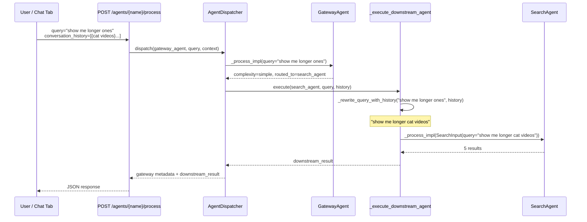

# Code Flow Examples

Real-world code execution flows through the Cogniverse multi-agent system.

## 1. Video Ingestion Flow

### Deploy Tenant Schema
```bash
# Deploy schemas for a new tenant via the runtime admin API.
# The runtime funnels through SchemaRegistry.deploy_schema so
# peer-tenant schemas are preserved through every redeploy.
RUNTIME_URL=http://localhost:8080
curl -sfX POST "$RUNTIME_URL/admin/tenants" \
  -H 'Content-Type: application/json' \
  -d '{"tenant_id": "customer_a"}'
curl -sfX POST "$RUNTIME_URL/admin/profiles/video_colpali_smol500_mv_frame/deploy" \
  -H 'Content-Type: application/json' \
  -d '{"tenant_id": "customer_a"}'
```

**Code Flow:**
```python
# 1. Schema Manager creates tenant-specific schema
from cogniverse_vespa.vespa_schema_manager import VespaSchemaManager

schema_manager = VespaSchemaManager(
    backend_endpoint="http://localhost",
    backend_port=8080
)
# Note: Schemas are defined as JSON in configs/schemas/. SchemaRegistry.deploy_schema(
# tenant_id, base_schema_name) is the primary path for deploying a tenant-scoped
# schema; it loads the JSON base definition and transforms it per tenant.
# VespaSchemaManager.get_tenant_schema_name() resolves the tenant schema name.
schema_name = "video_colpali_smol500_mv_frame_customer_a"

# 2. Deploy to Vespa
from vespa.package import ApplicationPackage, Field, Schema
from vespa.application import Vespa

# Initialize Vespa application client (application-specific setup)
vespa_app = Vespa(url="http://localhost:8080")  # Example initialization

app_package = ApplicationPackage(name=schema_name)
app_package.schema.add_fields(
    Field("embedding", "tensor<bfloat16>(patch{}, v[320])"),
    Field("binary_embedding", "tensor<int8>(patch{}, v[40])"),
    Field("text", "string", indexing=["index", "summary"])
)

# 3. Add ranking profiles
# Note: create_ranking_profile() is application-specific helper function
for strategy in ["hybrid_float_bm25", "float_float", "phased"]:
    app_package.schema.add_rank_profile(
        create_ranking_profile(strategy)  # Application-defined helper
    )

# Deploy the application package
vespa_app.deploy(app_package)
```

### Process Videos
```bash
# Ingest videos for tenant
uv run python scripts/run_ingestion.py \
    --video_dir /path/to/videos \
    --tenant-id customer_a \
    --profile video_colpali_smol500_mv_frame
```

**Code Flow:**
```python
# 1. Pipeline initialization
from cogniverse_runtime.ingestion.pipeline import VideoIngestionPipeline, PipelineConfig
from cogniverse_foundation.config.utils import create_default_config_manager

config_manager = create_default_config_manager()
pipeline_config = PipelineConfig.from_config(
    tenant_id="customer_a",
    config_manager=config_manager
)

pipeline = VideoIngestionPipeline(
    tenant_id="customer_a",
    config=pipeline_config,
    config_manager=config_manager
)

# 2. Process videos using the unified pipeline
# The pipeline handles all steps internally: frame extraction, embedding generation, storage
# video_paths is a list of Path objects to video files
for video_path in video_paths:
    # Process video through the complete pipeline (async)
    result = await pipeline.process_video_async(video_path)
```

## 2. Multi-Agent Search Flow

### User Query Request
```bash
curl -X POST http://localhost:8000/search/ \
  -H "Content-Type: application/json" \
  -d '{"query": "machine learning tutorial", "tenant_id": "customer_a"}'
```

**Code Flow:**
```python
# 1. Receive and parse request
from cogniverse_agents.search_agent import SearchAgent, SearchAgentDeps
from cogniverse_agents.orchestrator_agent import OrchestratorAgent, OrchestratorDeps, OrchestratorInput
from cogniverse_core.registries.agent_registry import AgentRegistry
from cogniverse_foundation.config.utils import create_default_config_manager
from cogniverse_core.schemas.filesystem_loader import FilesystemSchemaLoader
from cogniverse_core.common.tenant_utils import require_tenant_id
from pathlib import Path

config_manager = create_default_config_manager()
schema_loader = FilesystemSchemaLoader(Path("configs/schemas"))

# 2. Extract tenant from request body
# request is the parsed SearchRequest body (tenant_id is a required field)
tenant_id = require_tenant_id(request.tenant_id, source="SearchRequest")

# 3. Initialize orchestrator (tenant-agnostic at construction)
registry = AgentRegistry(tenant_id=tenant_id, config_manager=config_manager)
orchestrator = OrchestratorAgent(
    deps=OrchestratorDeps(), registry=registry, config_manager=config_manager
)

# 4. Route query with DSPy optimization (async)
routing_decision = await orchestrator._process_impl(
    OrchestratorInput(query="machine learning tutorial", tenant_id=tenant_id)
)
# Decision: Route to search agent for tutorial content

# 5. Search Agent executes search (synchronous)
search_agent = SearchAgent(
    deps=SearchAgentDeps(profile="video_colpali_smol500_mv_frame"),
    config_manager=config_manager,
    schema_loader=schema_loader
)
results = search_agent.search_by_text(
    query="machine learning tutorial",
    tenant_id=tenant_id,
    top_k=10
)

# 6. Backend automatically handles tenant-scoped schema
# Schema name is constructed from profile and tenant_id
# Search service routes to correct tenant schema internally
```

## 3. Multi-Turn Conversation Flow

### Query Rewrite with Conversation History

When a user sends a follow-up message like "show me longer ones" after searching for "cat videos", the system resolves the anaphoric reference using conversation history.

```bash
# Turn 2: follow-up with conversation history
curl -X POST http://localhost:8000/agents/gateway_agent/process \
  -H "Content-Type: application/json" \
  -d '{
    "agent_name": "gateway_agent",
    "query": "show me longer ones",
    "context": {"tenant_id": "flywheel_org:production"},
    "top_k": 5,
    "conversation_history": [
      {"role": "user", "content": "search for cat videos"},
      {"role": "agent", "content": "Found 5 cat video results"}
    ]
  }'
```

**Code Flow:**
```python
# 1. REST endpoint receives request with conversation_history
# libs/runtime/cogniverse_runtime/routers/agents.py
task = AgentTask(
    agent_name="gateway_agent",
    query="show me longer ones",
    conversation_history=[
        {"role": "user", "content": "search for cat videos"},
        {"role": "agent", "content": "Found 5 cat video results"},
    ],
)
# conversation_history is merged into dispatch context

# 2. AgentDispatcher._execute_gateway_task triages the query
# libs/runtime/cogniverse_runtime/agent_dispatcher.py
gateway_result = await gateway_agent._process_impl(
    GatewayInput(query="show me longer ones", tenant_id=tenant_id)
)
# gateway_result.complexity = "simple", gateway_result.routed_to = "search_agent"

# 3. Simple path: execute the routed-to agent directly
# _execute_downstream_agent dispatches based on capabilities
downstream_result = await self._execute_downstream_agent(
    agent_name=gateway_result.routed_to,
    query="show me longer ones",
    tenant_id=tenant_id,
    conversation_history=conversation_history,
)

# 4. Inside _execute_search_task, query rewrite happens
# _rewrite_query_with_history resolves anaphoric references
rewritten = await self._rewrite_query_with_history(
    query="show me longer ones",
    conversation_history=[...],
)
# rewritten = "show me longer cat videos"

# 5. Search executes with rewritten query
results = search_agent._process_impl(
    SearchInput(query="show me longer cat videos", tenant_id=tenant_id)
)

# 6. Response includes both gateway routing and search results
# {
#   "status": "success",
#   "agent": "gateway_agent",
#   "message": "Routed 'show me longer ones' to search_agent (simple)",
#   "gateway": {
#     "complexity": "simple",
#     "modality": "video",
#     "generation_type": "raw_results",
#     "routed_to": "search_agent",
#     "confidence": 0.83
#   },
#   "downstream_result": {
#     "status": "success",
#     "agent": "search_agent",
#     "original_query": "show me longer ones",
#     "rewritten_query": "show me longer cat videos",
#     "results_count": 5,
#     "results": [...]
#   }
# }
```



---

## 4. DSPy Routing Optimization Flow

### On-Demand Gateway Optimization

Optimization runs on-demand via the dashboard or Argo Workflow submission. The `optimization_cli` reads Phoenix spans and compiles updated DSPy modules per tenant.

**Location**: `libs/runtime/cogniverse_runtime/optimization_cli.py`

```bash
# Trigger optimization via the runtime API
# POST /admin/tenant/{tenant_id}/optimize
# Body: {"mode": "gateway-thresholds"}

# The runtime submits an Argo Workflow that runs:
uv run python -m cogniverse_runtime.optimization_cli \
  --mode gateway-thresholds \
  --tenant-id customer_a

# Check run status:
# GET /admin/tenant/{tenant_id}/optimize/runs/{workflow_name}
```

### Gateway Threshold Optimization

```python
# optimization_cli._compute_gateway_thresholds() computes
# optimal GLiNER confidence thresholds from Phoenix spans
from cogniverse_runtime.optimization_cli import _compute_gateway_thresholds

# spans_df: DataFrame from Phoenix with GLiNER routing spans
result = _compute_gateway_thresholds(spans_df)
# Returns: {
#   "status": "ready",
#   "spans_found": 340,
#   "thresholds": {
#     "fast_path_confidence_threshold": 0.45,
#     "gliner_threshold": 0.32,
#     "analysis": {"total_spans": 340, "simple_count": 210, ...}
#   }
# }
thresholds = result["thresholds"]

# GATEWAY_DEFAULT_THRESHOLD = 0.4 (module constant; starting point for calibration)
```

### DSPy Module Optimization (SIMBA/Profile modes)

```python
# The "simba" and "profile" optimization_cli modes each build a DSPy
# trainset from Phoenix spans (query_enhancement / profile_selection),
# then compile it with a BootstrapFewShot teleprompter scaled by
# trainset size (optimization_cli._create_teleprompter):
#   < 50 examples  → BootstrapFewShot(max_bootstrapped_demos=4, max_labeled_demos=8, max_rounds=1)
#   >= 50 examples → BootstrapFewShot(max_bootstrapped_demos=8, max_labeled_demos=16, max_rounds=2)
#
# cogniverse_foundation.config.agent_config.OptimizerType also declares
# mipro_v2 and gepa members, and DSPyOptimizerRegistry wires mipro_v2 to
# dspy.MIPROv2 for callers that request it explicitly — but the "simba"
# and "profile" CLI modes always compile through the scaled
# BootstrapFewShot path above, regardless of trainset size.

from cogniverse_runtime.optimization_cli import (
    run_simba_optimization,
    run_profile_optimization,
)

# Compile QueryEnhancementAgent's DSPy module from query_enhancement spans
simba_result = await run_simba_optimization(tenant_id="customer_a", lookback_hours=24.0)

# Compile ProfileSelectionAgent's DSPy module from profile_selection spans
profile_result = await run_profile_optimization(tenant_id="customer_a", lookback_hours=24.0)
```

## 5. Memory-Augmented Search Flow

### Search with Context
```python
# 1. Initialize search agent with memory
from cogniverse_core.memory.manager import Mem0MemoryManager
from cogniverse_agents.memory_aware_mixin import MemoryAwareMixin
from cogniverse_agents.search_agent import SearchAgent, SearchAgentDeps
from cogniverse_foundation.config.utils import create_default_config_manager
from cogniverse_core.schemas.filesystem_loader import FilesystemSchemaLoader
from pathlib import Path

# Initialize agent
config_manager = create_default_config_manager()
schema_loader = FilesystemSchemaLoader(Path("configs/schemas"))
tenant_id = "customer_a"
agent = SearchAgent(
    deps=SearchAgentDeps(profile="video_colpali_smol500_mv_frame"),
    config_manager=config_manager,
    schema_loader=schema_loader
)

# Initialize memory manager separately (memory is typically initialized via MemoryAwareMixin)
memory_manager = Mem0MemoryManager(tenant_id=tenant_id)

# 2. Retrieve user context
user_memories = memory_manager.search_memory(
    query="machine learning",
    tenant_id="customer_a",
    agent_name="SearchAgent",
    top_k=5
)

# 3. Use context to enhance query (application-level logic)
# Query enhancement is done by the application based on retrieved memories
context_items = [m.get("content", "") for m in user_memories]
augmented_query = f"machine learning tutorial {' '.join(context_items)}"
# Result: "machine learning tutorial python sklearn beginner"

# 4. Store interaction in memory
memory_manager.add_memory(
    content="User searched for ML tutorial, showed interest in sklearn",
    tenant_id="customer_a",
    agent_name="SearchAgent",
    metadata={
        "query": "machine learning tutorial",
        "selected_result": "sklearn_basics.mp4"
    }
)
```

## 6. Experiment Flow

### Run A/B Test
```python
# 1. Initialize evaluation provider
from cogniverse_telemetry_phoenix.evaluation.evaluation_provider import PhoenixEvaluationProvider

provider = PhoenixEvaluationProvider()
provider.initialize({
    "tenant_id": "customer_a",
    "http_endpoint": "http://localhost:6006",
    "grpc_endpoint": "http://localhost:4317",
    "project_name": "evaluation"
})

# 2. Create experiment
# create_experiment returns a dict-like experiment object
experiment = provider.create_experiment(
    name="ml_queries_v1",
    description="Compare search strategies",
    metadata={
        "strategies": ["hybrid_float_bm25", "float_float"],
        "tenant_id": "customer_a"
    }
)

# 3. Run evaluations for each strategy
# queries is a list of query strings to evaluate
for query in queries:
    for strategy in ["hybrid_float_bm25", "float_float"]:
        # Execute search (application-defined function)
        results = search(query, strategy)

        # Evaluate quality (application-defined function)
        score = evaluate_quality(results)

        # Log evaluation result
        provider.log_evaluation(
            experiment_id=experiment["id"],
            evaluation_name="search_quality",
            score=score,
            label="pass" if score > 0.7 else "fail",
            explanation=f"Search quality for {strategy}",
            metadata={"strategy": strategy, "query": query}
        )

# 4. Compare experiment results through Phoenix UI at http://localhost:6006
# Or retrieve programmatically through provider.telemetry
```

## 7. Error Recovery Flow

### Graceful Degradation
```python
import logging
from cogniverse_agents.search_agent import SearchAgent, SearchAgentDeps
from cogniverse_core.schemas.filesystem_loader import FilesystemSchemaLoader
from pathlib import Path

logger = logging.getLogger(__name__)

# 1. Primary search fails
# search_agent, tenant_id, config_manager, schema_loader are defined in calling context
try:
    results = search_agent.search_by_text(
        query="tutorial",
        tenant_id=tenant_id,
        top_k=10
    )
except Exception as e:
    logger.error(f"Search failed: {e}")

    # 2. Try alternate agent with different profile
    try:
        fallback_agent = SearchAgent(
            deps=SearchAgentDeps(profile="video_videoprism_base_mv_chunk_30s"),
            config_manager=config_manager,
            schema_loader=schema_loader
        )
        results = fallback_agent.search_by_text(query="tutorial", tenant_id=tenant_id, top_k=10)
    except Exception as fallback_error:
        # 3. Return cached results if available (requires cache manager setup)
        # Note: In production, cache_mgr would be initialized at application startup
        # This example shows the basic pattern for cache retrieval
        logger.error(f"Fallback failed: {fallback_error}")

        # If cache manager is available (initialized separately)
        # from cogniverse_core.common.cache import CacheManager
        # cache_key = f"search_results_{hash(query)}"
        # cached = await cache_mgr.get(cache_key)  # get() is async
        # if cached:
        #     return cached

        # 4. Return error with helpful message
        logger.error("No fallback options available")
        raise RuntimeError(
            "Search temporarily unavailable. Please try again later."
        )
```

## 8. Performance Monitoring

### Request Tracing
```python
# Complete request trace using OpenTelemetry
from opentelemetry import trace
from cogniverse_foundation.telemetry.registry import TelemetryRegistry

# Get telemetry provider for this tenant
# tenant_id is defined in calling context
registry = TelemetryRegistry()
telemetry = registry.get(
    name="phoenix",
    tenant_id=tenant_id,
    config={
        "project_name": "search",
        "http_endpoint": "http://localhost:6006",
        "grpc_endpoint": "http://localhost:4317"
    }
)

tracer = trace.get_tracer(__name__)

# Create trace with nested spans
# orchestrator, agent, query, rerank are defined in calling context
with tracer.start_as_current_span("search_request") as trace_span:
    trace_span.set_attribute("tenant_id", tenant_id)

    # Routing: 10ms
    with tracer.start_as_current_span("routing"):
        decision = await orchestrator._process_impl(OrchestratorInput(query=query, tenant_id=tenant_id))

    # Search: 200ms
    with tracer.start_as_current_span("search"):
        results = agent.search_by_text(query, tenant_id=tenant_id, top_k=10)

    # Reranking: 50ms (rerank is application-defined function)
    with tracer.start_as_current_span("rerank"):
        results = rerank(results)

    # Total: 260ms
    trace_span.set_attribute("latency_ms", 260)
    trace_span.set_attribute("cache_hit", True)
```

---

**Package Architecture Note**: Code examples use Cogniverse's layered architecture:

- **Foundation Layer**: cogniverse-sdk, cogniverse-foundation (config, telemetry)
- **Core Layer**: cogniverse-core (base agents, memory), cogniverse-evaluation (experiments), cogniverse-telemetry-phoenix (Phoenix integration)
- **Implementation Layer**: cogniverse-agents (routing, search), cogniverse-vespa (backends), cogniverse-synthetic (data generation)
- **Application Layer**: cogniverse-runtime (ingestion, API), cogniverse-dashboard (UI), cogniverse-cli (deployment/management CLI), cogniverse-finetuning (LoRA/DPO fine-tuning), cogniverse-messaging (Telegram/Slack gateway)

All code examples follow the correct import paths for the layered structure located in `libs/`.
