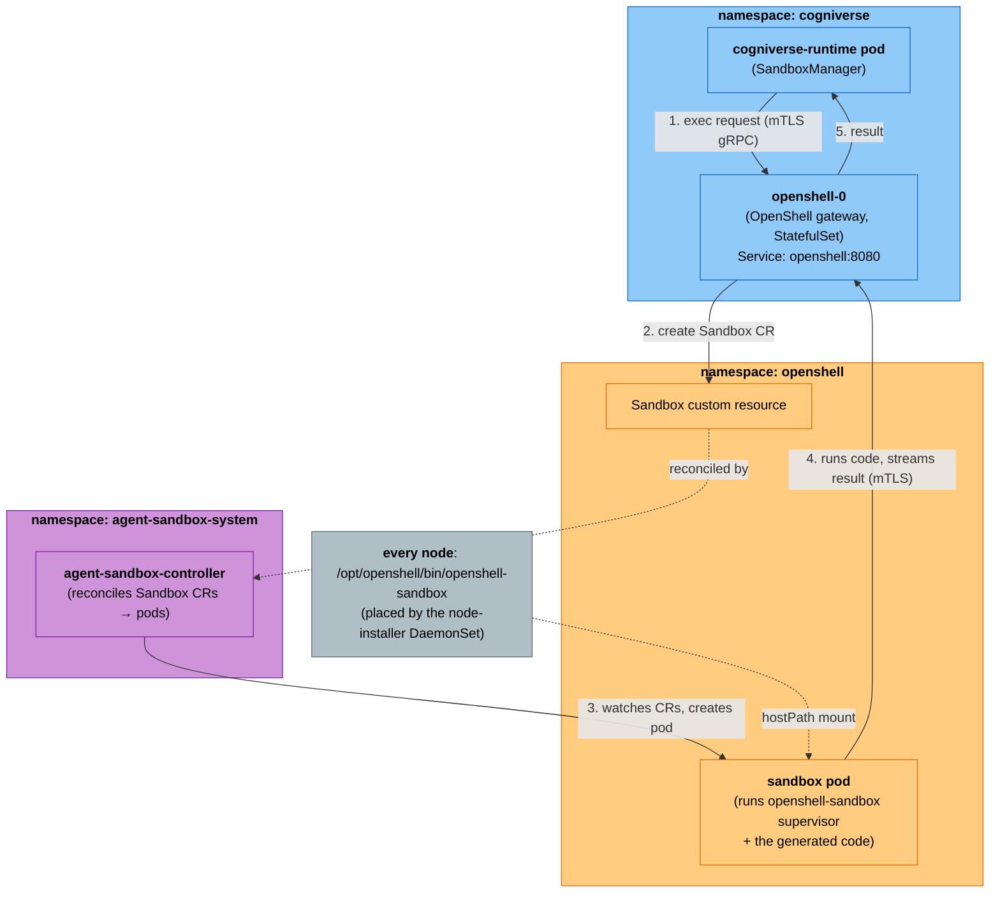
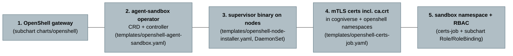

# Coding-Agent Sandbox

How the coding agent runs LLM-generated code **safely**, and how that sandbox is
deployed. This document is written to be readable without prior Kubernetes or
OpenShell knowledge — every term is explained in the [Glossary](#glossary) at
the end, and terms are linked on first use.

---

## Why a sandbox exists

The coding agent asks an LLM to write code, then **executes** that code to check
it works. Running arbitrary LLM-generated code directly inside the runtime pod
would be dangerous — a bad or malicious snippet could read secrets, delete data,
or call the network. So the runtime **never runs generated code itself**. It
hands the code to an isolated, throwaway **sandbox** — a short-lived, locked-down
container that runs the code and returns stdout/stderr/exit code, then is
destroyed.

If no sandbox is available, the coding agent **refuses to run** and returns an
error. That refusal is deliberate, not a bug.

The sandbox system used is **[OpenShell](#glossary)** (NVIDIA), which builds on
the upstream Kubernetes **[agent-sandbox](#glossary)** project.

---

## The three modes

There are three ways to provide the sandbox, chosen with `cogniverse up --sandbox <mode>`
or the Helm value `runtime.sandbox.*`:

| Mode | What runs the sandboxes | When to use |
|---|---|---|
| **`in-cluster`** (default) | The chart deploys the OpenShell gateway **and** the agent-sandbox operator inside *this* cluster; sandboxes run as pods here. | Production and most setups. Portable — works identically on k3d, EKS, GKE, on-prem. No host dependency. |
| **`external`** | The runtime connects to an OpenShell gateway you run **somewhere else** (a managed/hosted endpoint). Nothing sandbox-related is deployed here. | When a central/managed sandbox service already exists. Set `runtime.sandbox.external.endpoint`. |
| **`off`** | No sandbox. The coding agent is disabled and returns an error on any coding request. | When you don't need the coding agent. |

> There is also a legacy **host mode** (gateway runs as a process on the
> developer's laptop, reached via `host.docker.internal`). It is a local-dev-only
> shortcut and is **not** the recommended path — the pod-to-host network bridge is
> fragile across environments. `in-cluster` supersedes it.

---

## In-cluster architecture

This is the default. Everything runs inside the Kubernetes cluster; the runtime
reaches the gateway by its in-cluster DNS name and nothing depends on the host.



**Step by step, on one coding request:**

1. The **[SandboxManager](#glossary)** inside the runtime opens an **[mTLS](#glossary)**
   gRPC connection to the **OpenShell gateway** at `openshell.<namespace>.svc.cluster.local:8080`
   (an in-cluster **[Service DNS](#glossary)** name — always resolvable, no host tricks).
2. The gateway creates a **[Sandbox custom resource](#glossary)** (a small
   "please make me a sandbox" record) in the `openshell` [namespace](#glossary).
   The gateway itself has **no permission to create pods** — it only writes
   this record.
3. The **[agent-sandbox controller](#glossary)** (an [operator](#glossary)
   running in `agent-sandbox-system`) is watching for Sandbox records. It sees the
   new one and **[reconciles](#glossary)** it into an actual **sandbox pod**.
4. The sandbox pod runs the **`openshell-sandbox` supervisor** binary, which
   receives the generated code from the gateway (over mTLS), executes it, and
   streams back stdout / stderr / exit code.
5. The gateway relays the result to the runtime, which returns it to the caller.
   The sandbox pod is then torn down.

### The pieces the chart must provide

For the flow above to work, five things must exist. Each was a deployment gap
that is now handled by the chart when `runtime.sandbox.inCluster.enabled=true`:



1. **OpenShell gateway** — deployed by the vendored `charts/openshell` subchart
   (a [StatefulSet](#glossary) + Service). This is the front door the runtime talks to.
2. **agent-sandbox operator** — the [CRD](#glossary) (which teaches Kubernetes
   what a "Sandbox" is) plus the controller that turns Sandbox records into pods.
   Vendored verbatim from upstream into `templates/openshell-agent-sandbox.yaml`.
   Without it, the gateway writes Sandbox records that nothing acts on.
3. **The `openshell-sandbox` supervisor binary on every node** — sandbox pods run
   this binary from a **[hostPath](#glossary)** (`/opt/openshell/bin`). It ships
   only inside OpenShell's own node image, so a **[DaemonSet](#glossary)**
   (`openshell-node-installer.yaml`) copies it onto each node once.
4. **mTLS certificates** — the gateway, runtime, and sandboxes authenticate each
   other with client/server certs. A pre-install **[Job](#glossary)** generates
   a CA and issues certs, storing them as Kubernetes [Secrets](#glossary).
   Crucially the client secret includes **`ca.crt`** and is placed in **both**
   the `cogniverse` (for the runtime) and `openshell` (for the sandbox pods)
   namespaces.
5. **The `openshell` sandbox namespace and its [RBAC](#glossary)** — sandbox pods
   live in a dedicated namespace, and the gateway needs permission (a `Role` +
   `RoleBinding` *in that namespace*) to create Sandbox records and read events
   there.

---

## Configuration

Deploy with the CLI:

```bash
# Default — self-hosted in-cluster sandbox
cogniverse up

# Explicitly
cogniverse up --sandbox in-cluster

# Point at a managed/external gateway instead
cogniverse up --sandbox external --sandbox-endpoint openshell.example.com:8080

# Disable the coding agent
cogniverse up --sandbox off
```

Or via Helm values (`runtime.sandbox`):

```yaml
runtime:
  sandbox:
    enabled: true
    inCluster:
      enabled: true          # self-host the gateway + operator (default path)
    external:
      enabled: false         # OR point at a managed gateway
      endpoint: ""           # e.g. "openshell.example.com:8080"
openshell:
  fullnameOverride: openshell           # Service named "openshell" (matches runtime endpoint)
  clusterImage: ghcr.io/nvidia/openshell/cluster:0.0.13   # carries the supervisor binary
```

The runtime resolves the gateway endpoint from `OPENSHELL_GATEWAY_ENDPOINT`
(set by the chart) and builds its mTLS config from the certs mounted at
`~/.config/openshell/gateways/cogniverse/mtls/`.

---

## Troubleshooting

Symptoms map to the pieces above:

| Symptom (runtime / gateway logs) | Likely cause |
|---|---|
| `CodingAgent requires a SandboxManager with an available OpenShell gateway` | Sandbox disabled, or the runtime couldn't reach the gateway at startup. |
| Runtime: `Name or service not known` for the gateway | Gateway Service name ≠ the endpoint the runtime uses. The subchart `fullnameOverride: openshell` keeps them aligned. |
| Gateway: `TLS handshake failed: received corrupt message` | TLS mismatch — one side plaintext, the other mTLS. In-cluster is mTLS end-to-end; the runtime must present client certs. |
| Sandbox pod `RunContainerError: openshell-sandbox: no such file` | The supervisor binary isn't on the node — the node-installer DaemonSet didn't run or the `clusterImage` is wrong. |
| Sandbox pod: `failed to read CA cert from /etc/openshell-tls/client/ca.crt` | The `openshell-client-tls` secret in the `openshell` namespace is missing `ca.crt`. |
| Gateway: `sandboxes.agents.x-k8s.io is forbidden` (403) | The gateway's `Role`/`RoleBinding` isn't in the `openshell` namespace, or the agent-sandbox CRD isn't installed. |
| Sandbox pod stuck `ContainerCreating: secret "openshell-client-tls" not found` | The client cert secret wasn't created in the `openshell` namespace. |

---

## Glossary

Plain-language definitions of the terms used above.

- **OpenShell** — NVIDIA's system for running untrusted code in isolated
  sandboxes. Provides the *gateway* (the API the runtime calls) and the sandbox
  runtime.
- **agent-sandbox** — the upstream Kubernetes project
  (`sigs.k8s.io/agent-sandbox`) that OpenShell builds on. Ships the `Sandbox`
  CRD and its controller. Controller image: `registry.k8s.io/agent-sandbox/agent-sandbox-controller`.
- **SandboxManager** — the runtime-side client (`libs/runtime/.../sandbox_manager.py`)
  that connects to the gateway and asks it to run code.
- **Gateway** — the OpenShell server the runtime talks to. It accepts exec
  requests and creates Sandbox records; it does **not** create pods itself.
- **CRD (Custom Resource Definition)** — a way to teach Kubernetes a new object
  type. Installing the Sandbox CRD lets the cluster understand `kind: Sandbox`
  the same way it understands `kind: Pod`.
- **Custom resource (CR)** — an instance of a CRD. A `Sandbox` CR is a small
  record meaning "please create a sandbox with these settings."
- **Operator / Controller** — a program that watches for custom resources and
  makes reality match them. The agent-sandbox *controller* watches `Sandbox` CRs
  and creates the corresponding pods. Turning a record into real infrastructure
  is called **reconciling**.
- **Reconcile** — the controller's core loop: compare desired state (the CR) with
  actual state (pods) and create/update/delete to close the gap.
- **mTLS (mutual TLS)** — encrypted connections where **both** sides present a
  certificate to prove who they are. Here the runtime, gateway, and sandboxes all
  authenticate each other, using certs signed by one shared CA (`ca.crt`).
- **Service DNS** — Kubernetes gives every Service a stable name like
  `openshell.<namespace>.svc.cluster.local`. Any pod can reach the Service by that
  name — no IPs, no host tricks. This is why in-cluster mode is portable.
- **DaemonSet** — a workload that runs one copy on **every node**. Used here to
  copy the supervisor binary onto each node's disk.
- **hostPath** — a volume that mounts a directory from the node's own filesystem
  into a pod. The sandbox pod mounts `/opt/openshell/bin` from the node to find
  the supervisor binary the DaemonSet placed there.
- **RBAC (Role-Based Access Control)** — Kubernetes permissions. A `Role` lists
  allowed actions in a namespace; a `RoleBinding` grants that Role to an account.
  A `ClusterRole`/`ClusterRoleBinding` is the cluster-wide equivalent.
- **Namespace** — a folder-like partition of a cluster. Here: `cogniverse`
  (the app), `openshell` (where sandbox pods run), `agent-sandbox-system` (the
  operator).
- **StatefulSet / Job / Secret** — standard Kubernetes objects: a StatefulSet
  runs the long-lived gateway; a Job runs the one-off cert generation; Secrets
  store the certificates.
