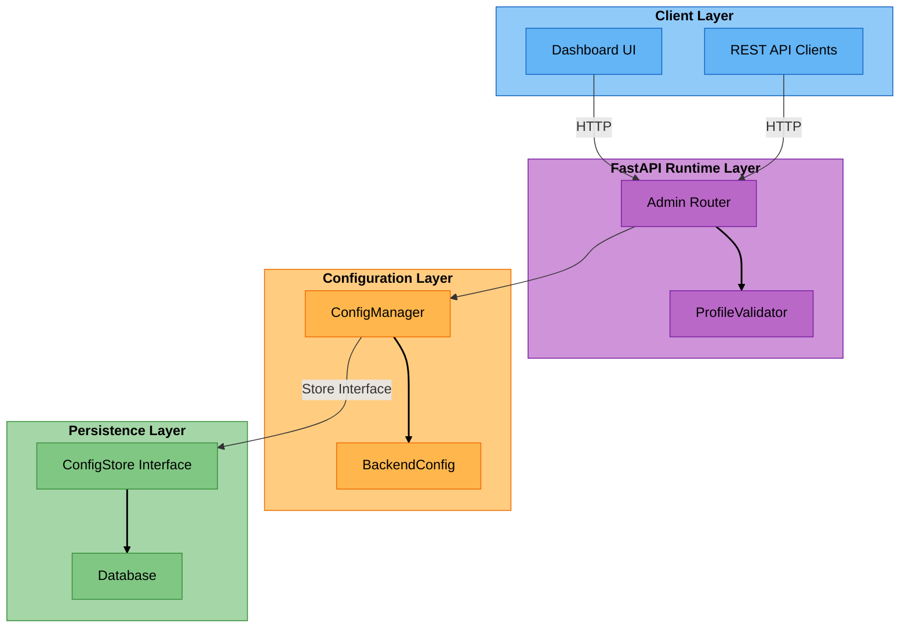
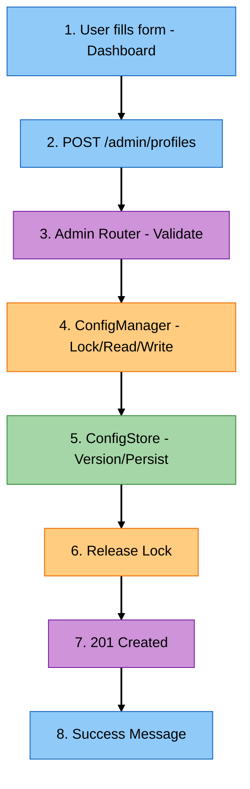
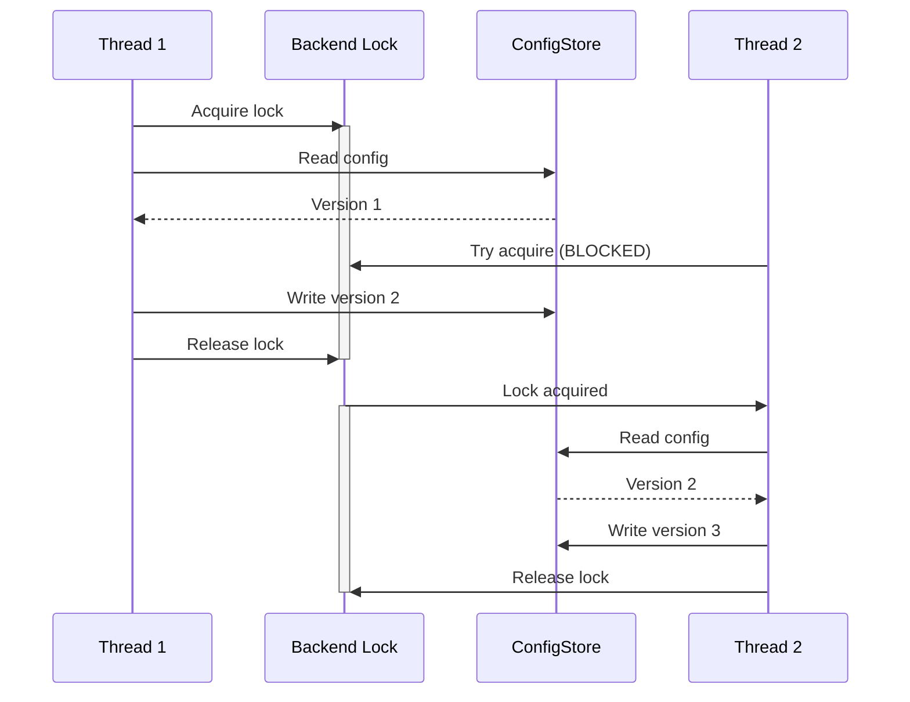
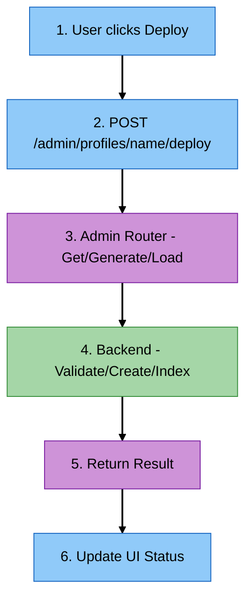

# Dynamic Backend Profiles - Architecture

Architecture overview of the dynamic profile registration system for backend configurations.

## Overview

The dynamic profile system replaces static `config.json` files with a database-backed, multi-tenant configuration management system. This enables:

- **Runtime profile creation** without code deployment
- **Multi-tenant isolation** for SaaS deployments
- **Concurrent access** with proper locking
- **Version control** for configuration changes
- **Schema deployment automation** via API

## Architecture Diagram



## Component Details

### 1. FastAPI Runtime Layer

**Location:** `libs/runtime/cogniverse_runtime/routers/admin.py`

**Responsibilities:**

- HTTP endpoint handling
- Request validation via Pydantic models
- Profile validation via ProfileValidator
- Schema deployment coordination
- Error handling and HTTP responses

**Key Endpoints:**

- `POST /admin/profiles` - Create profile
- `GET /admin/profiles` - List profiles for tenant
- `GET /admin/profiles/{profile_name}` - Get profile details
- `PUT /admin/profiles/{profile_name}` - Update mutable fields
- `DELETE /admin/profiles/{profile_name}` - Delete profile
- `POST /admin/profiles/{profile_name}/deploy` - Deploy schema

**Dependencies:**

- ConfigManager (injected via FastAPI Depends)
- ProfileValidator (injected via FastAPI Depends)
- SchemaLoader (for deployment)

### 2. Configuration Layer

**Location:** `libs/foundation/cogniverse_foundation/config/manager.py`

**ConfigManager:**

Centralized configuration manager with:

- Multi-tenant support
- Thread-safe operations
- Profile CRUD operations
- Deep merge for tenant overrides

**Thread Safety:**
```python
class ConfigManager:
    def __init__(self, store: ConfigStore, cache_size: int = 100):
        self.store = store
        self._backend_lock = threading.Lock()  # Protects read-modify-write

    def add_backend_profile(self, profile, tenant_id, service):
        with self._backend_lock:  # Atomic operation
            backend_config = self.get_backend_config(...)
            backend_config.add_profile(profile)
            self.set_backend_config(backend_config, ...)
```

**Why Locking?**

Without locks, concurrent operations have a race condition:

```python
# Thread 1: Reads config (profiles: A, B)
# Thread 2: Reads config (profiles: A, B)
# Thread 1: Adds profile C → Writes (profiles: A, B, C)
# Thread 2: Adds profile D → Writes (profiles: A, B, D)
# Result: Profile C is LOST!
```

The `_backend_lock` ensures:

1. Thread 1 acquires lock
2. Thread 1 reads, modifies, writes
3. Thread 1 releases lock
4. Thread 2 acquires lock (sees profiles A, B, C)
5. Thread 2 reads, modifies, writes (profiles: A, B, C, D)
6. Both profiles persist correctly

**BackendConfig:**

Pydantic model representing tenant's backend configuration:

```python
class BackendConfig:
    tenant_id: str
    profiles: Dict[str, BackendProfileConfig]  # profile_name → config

    def add_profile(self, profile: BackendProfileConfig):
        """Add or replace profile"""
        self.profiles[profile.profile_name] = profile

    def merge_profile(self, profile_name: str, overrides: Dict[str, Any]) -> BackendProfileConfig:
        """Deep merge overrides into existing profile"""
        base_profile = self.profiles.get(profile_name)
        if not base_profile:
            raise ValueError(f"Base profile '{profile_name}' not found")
        merged = base_profile.to_dict()
        self._deep_merge(merged, overrides)
        return BackendProfileConfig.from_dict(profile_name, merged)
```

### 3. Persistence Layer

- **Interface:** `libs/sdk/cogniverse_sdk/interfaces/config_store.py`
- **Example Implementation:** `libs/vespa/cogniverse_vespa/config/config_store.py`

**ConfigStore Interface:**

Backend-agnostic configuration storage with:

- Multi-tenant isolation
- Version tracking
- Concurrent access support
- Transaction management

**Example: VespaConfigStore:**

```python
class VespaConfigStore(ConfigStore):
    """Vespa-based configuration store with multi-tenant support."""

    def __init__(
        self,
        vespa_app: Optional[Vespa] = None,
        vespa_url: str = "http://localhost",
        vespa_port: int = 8080,
        schema_name: str = "config_metadata",
    ):
        if vespa_app is not None:
            self.vespa_app = vespa_app
        else:
            self.vespa_app = Vespa(url=f"{vespa_url}:{vespa_port}")
        self.schema_name = schema_name

    def _get_latest_version(self, tenant_id, scope, service, config_key) -> int:
        """Get latest version number for a config"""
        config_id = f"{tenant_id}:{scope.value}:{service}:{config_key}"
        yql = (
            f"select version from {self.schema_name} "
            f'where config_id contains "{config_id}" '
            f"order by version desc limit 1"
        )
        response = self.vespa_app.query(yql=yql)
        if response.hits and len(response.hits) > 0:
            return response.hits[0]["fields"]["version"]
        return 0

    def set_config(self, tenant_id, scope, service, config_key, config_value):
        """Set config as Vespa document with versioning"""
        # Get next version
        current_version = self._get_latest_version(tenant_id, scope, service, config_key)
        new_version = current_version + 1

        # Create document ID with version
        config_id = f"{tenant_id}:{scope.value}:{service}:{config_key}"
        doc_id = f"{self.schema_name}::{config_id}::{new_version}"

        # Feed document to Vespa
        self.vespa_app.feed_data_point(
            schema=self.schema_name,
            data_id=doc_id,
            fields={
                "config_id": config_id,
                "tenant_id": tenant_id,
                "scope": scope.value,
                "service": service,
                "config_key": config_key,
                "config_value": json.dumps(config_value),
                "version": new_version,
                "created_at": datetime.now().isoformat(),
                "updated_at": datetime.now().isoformat(),
            }
        )
        return ConfigEntry(...)  # Returns ConfigEntry with new version
```

**Backend Benefits:**

- Unified storage with search backend
- No separate database to manage
- Same multi-tenant isolation as content
- Distributed and scalable

### 4. Validation Layer

**Location:** `libs/core/cogniverse_core/validation/profile_validator.py`

**ProfileValidator:**

Validates profile configurations against business rules:

```python
class ProfileValidator:
    def __init__(
        self,
        config_manager: "ConfigManager",
        schema_templates_dir: Optional[Path] = None,
    ):
        """
        Initialize ProfileValidator.

        Args:
            config_manager: ConfigManager instance for checking existing profiles
            schema_templates_dir: Directory containing schema template JSON files
                                 (defaults to configs/schemas/)
        """
        self.config_manager = config_manager
        self.schema_templates_dir = schema_templates_dir or Path("configs/schemas")

    def validate_profile(
        self, profile: BackendProfileConfig, tenant_id: str, is_update: bool = False
    ) -> List[str]:
        """Validate complete profile"""
        errors = []
        errors.extend(self._validate_profile_name(profile.profile_name))
        errors.extend(self._validate_schema_template(profile.schema_name))
        errors.extend(self._validate_embedding_model(profile.embedding_model))
        errors.extend(self._validate_embedding_type(profile.embedding_type))
        return errors

    def validate_update_fields(self, update_fields: dict) -> List[str]:
        """Validate that only mutable fields are being updated"""
        immutable_fields = {"schema_name", "embedding_model", "schema_config", "type"}
        errors = []
        for field in immutable_fields:
            if field in update_fields:
                errors.append(
                    f"Field '{field}' cannot be updated. "
                    "Create a new profile instead for schema changes."
                )
        return errors
```

**Validation Rules:**

- Profile name: alphanumeric + underscore, unique within tenant
- Schema name: must exist in schema directory
- Embedding model: format `org/model` or `model-name`
- Embedding type: enum (`frame_based`, `video_chunks`, `direct_video_segment`, `single_vector`)
- Strategies: valid JSON array
- Pipeline config: valid JSON object

### 5. Dashboard UI Layer

**Location:** `scripts/backend_profile_tab.py`

**Streamlit-based UI for profile management:**

```python
def render_backend_profile_tab():
    """Main entry point for backend profile management UI"""
    st.subheader("Backend Profile Management")

    # Initialize ConfigManager
    if "config_manager" not in st.session_state:
        st.session_state.config_manager = create_default_config_manager()

    manager = st.session_state.config_manager
    tenant_id = st.session_state.get("current_tenant", "default")

    # Profile list
    profiles_dict = manager.list_backend_profiles(tenant_id, service="backend")
    profile_names = sorted(profiles_dict.keys()) if profiles_dict else []

    # Create new profile section
    with st.expander("➕ Create New Profile", expanded=len(profile_names) == 0):
        render_create_profile_form(manager, tenant_id)

    # Existing profiles
    if profile_names:
        selected_profile = st.selectbox("Select Profile to Manage", options=profile_names)
        if selected_profile:
            render_profile_manager(manager, tenant_id, selected_profile)
```

**API Integration:**

Dashboard uses httpx to call FastAPI endpoints:

```python
def deploy_schema_via_api(profile_name: str, tenant_id: str, force: bool = False) -> Dict[str, Any]:
    """Deploy schema via admin API"""
    api_url = get_runtime_api_url()
    endpoint = f"{api_url}/admin/profiles/{profile_name}/deploy"

    try:
        with httpx.Client(timeout=30.0) as client:
            response = client.post(endpoint, json={"tenant_id": tenant_id, "force": force})
            if response.status_code == 200:
                data = response.json()
                return {
                    "success": True,
                    "tenant_schema_name": data.get("tenant_schema_name", ""),
                    "deployment_status": data.get("deployment_status", ""),
                    "error": None
                }
            else:
                error_detail = response.json().get("detail", response.text) if response.text else "Unknown error"
                return {
                    "success": False,
                    "tenant_schema_name": None,
                    "error": f"HTTP {response.status_code}: {error_detail}"
                }
    except httpx.TimeoutException:
        return {"success": False, "tenant_schema_name": None, "error": "Request timed out"}
    except Exception as e:
        return {"success": False, "tenant_schema_name": None, "error": str(e)}
```

## Data Flow

### Profile Creation Flow



### Concurrent Updates Flow



### Schema Deployment Flow



## Multi-Tenant Isolation

### Tenant Scoping

Every operation is scoped by `tenant_id`:

```python
# Get profiles for tenant A
profiles_a = config_manager.list_backend_profiles(tenant_id="tenant_a")

# Get profiles for tenant B
profiles_b = config_manager.list_backend_profiles(tenant_id="tenant_b")

# No overlap - complete isolation
```

### Backend-Level Isolation

All backend queries include `tenant_id` for isolation:

```python
# Example: Vespa query with tenant filter
config = config_store.get_config(
    tenant_id="tenant_a",
    scope=ConfigScope.BACKEND,
    service="backend",
    config_key="backend_config"
)
# Only returns data for tenant_a
```

### Schema Name Isolation

Deployed schemas include tenant suffix:

```text
tenant_a → profile: video_colpali → base schema: video_colpali_smol500_mv_frame → deployed: video_colpali_smol500_mv_frame_tenant_a
tenant_b → profile: video_colpali → base schema: video_colpali_smol500_mv_frame → deployed: video_colpali_smol500_mv_frame_tenant_b
```

Tenant schema naming follows pattern: `{base_schema_name}_{tenant_id}`

No naming conflicts in Vespa.

## Version Control

### Version Incrementing

Each `set_config()` creates a new version:

```text
Version 1: Initial profile creation
Version 2: Update pipeline_config
Version 3: Update strategies
Version 4: Update description
```

### Version History

Query historical versions via ConfigStore:

```python
history = config_store.get_config_history(
    tenant_id="acme",
    scope=ConfigScope.BACKEND,
    service="backend",
    config_key="backend_config",
    limit=10
)
```

### Optimistic Concurrency

Admin router returns version in update response:

```json
{
  "version": 3,
  "updated_fields": ["pipeline_config"]
}
```

Clients can detect conflicts by comparing versions.

## Deployment Architecture

### Schema Templates

Schema templates stored on disk:

```text
configs/schemas/
├── video_colpali_smol500_mv_frame_schema.json
├── video_colqwen_omni_mv_chunk_30s_schema.json
├── video_videoprism_base_mv_chunk_30s_schema.json
├── video_videoprism_large_mv_chunk_30s_schema.json
├── video_videoprism_lvt_base_sv_chunk_6s_schema.json
├── video_videoprism_lvt_large_sv_chunk_6s_schema.json
├── ranking_strategies.json
└── ... (other schemas)
```

### Template Loading

**Location:** `libs/core/cogniverse_core/schemas/filesystem_loader.py`

```python
class FilesystemSchemaLoader(SchemaLoader):
    """
    Load Vespa schemas from filesystem directory.

    Inherits from SchemaLoader abstract interface defined in
    libs/sdk/cogniverse_sdk/interfaces/schema_loader.py
    """

    def __init__(self, base_path: Path):
        """Initialize with directory containing schema JSON files"""
        self.base_path = Path(base_path)

    def load_schema(self, schema_name: str) -> Dict[str, Any]:
        """Load schema template from disk"""
        schema_file = self.base_path / f"{schema_name}_schema.json"
        with open(schema_file, "r", encoding="utf-8") as f:
            return json.load(f)
```

### Tenant Schema Generation

Schema generation is handled by the backend's schema registry. The process:

1. Load base schema template via `FilesystemSchemaLoader`
2. Generate tenant-specific name: `{base_schema_name}_{tenant_id}`
3. Apply any tenant-specific configurations
4. Deploy to backend

Example flow (handled by schema registry and backend):

```python
# Load base schema template
base_schema = schema_loader.load_schema(profile.schema_name)

# Generate tenant-specific name (in VespaSchemaManager.get_tenant_schema_name())
tenant_schema_name = f"{base_schema_name}_{tenant_id.replace(':', '_')}"

# Deploy with tenant-specific naming (backend.deploy_schemas takes a list)
backend.deploy_schemas([{"name": tenant_schema_name, "definition": base_schema}])
```

## Testing Strategy

### Unit Tests

**Locations:**
- `tests/admin/test_profile_api.py` - Admin API endpoint tests
- `tests/common/unit/test_profile_validator.py` - ProfileValidator rules

Test individual components:

- ConfigManager methods
- ProfileValidator rules
- BackendConfig operations

### Integration Tests

**Multi-Tenant Tests** (`test_profile_multi_tenant.py`):

- Tenant isolation
- Cross-tenant access prevention
- Same profile name across tenants

**Concurrent Tests** (`test_profile_concurrent.py`):

- Concurrent profile creation
- Concurrent updates (version tracking)
- Concurrent reads during writes
- Concurrent deletes

**UI Tests** (`tests/dashboard/test_profile_ui_integration.py`):

- Dashboard API helper functions
- Deploy/delete/status workflows
- Error handling

### Test Fixtures

```python
@pytest.fixture
def test_client(temp_schema_dir, tmp_path):
    """Create test client with isolated backend"""
    from cogniverse_foundation.config.utils import create_default_config_manager
    from cogniverse_core.schemas.filesystem_loader import FilesystemSchemaLoader
    from cogniverse_runtime.routers import admin
    from cogniverse_core.registries.backend_registry import BackendRegistry
    from cogniverse_core.registries.schema_registry import SchemaRegistry

    # Reset registries
    BackendRegistry._instance = None
    SchemaRegistry._instance = None

    # Create ConfigManager with default store
    config_manager = create_default_config_manager()

    # Set up system config
    from cogniverse_foundation.config.unified_config import SystemConfig
    system_config = SystemConfig(tenant_id="test_tenant")
    config_manager.set_system_config(system_config)

    # Set up test environment
    schema_loader = FilesystemSchemaLoader(temp_schema_dir)
    admin.set_config_manager(config_manager)
    admin.set_schema_loader(schema_loader)
    admin.set_profile_validator_schema_dir(temp_schema_dir)

    try:
        from cogniverse_runtime.main import app
        client = TestClient(app)
        yield client
    finally:
        # Cleanup
        admin.reset_dependencies()
        BackendRegistry._instance = None
        SchemaRegistry._instance = None
```

## Performance Characteristics

### Read Performance

- **Cached reads**: O(1) lookup in ConfigManager cache
- **Uncached reads**: Backend-dependent (e.g., Vespa index lookup)
- **List operations**: O(n) where n = number of profiles per tenant

### Write Performance

- **Single write**: Backend-dependent (e.g., ~5-10ms for Vespa)
- **Concurrent writes**: Serialized via threading lock, no deadlocks
- **Transaction overhead**: Minimal with proper backend configuration

### Concurrency Limits

- **Read throughput**: Unlimited concurrent readers (backend-dependent)
- **Write throughput**: Limited by threading lock (one writer at a time)
- **Typical load**: 10-100 writes/sec per tenant

### Scaling Considerations

For high concurrency (>1000 writes/sec):

- Use distributed backend (e.g., Vespa cluster)
- Implement write batching
- Consider caching layer

## Security Considerations

### Tenant Isolation

- Strict `tenant_id` validation
- No cross-tenant access possible
- Database queries always filtered by tenant

### Input Validation

- All inputs validated via Pydantic models
- Profile names sanitized (alphanumeric + underscore)
- JSON fields validated for syntax

### Query Safety

- Parameterized queries via ConfigStore interface
- No dynamic query construction
- Backend-specific security defaults

### Future Enhancements

- API key authentication
- Role-based access control (RBAC)
- Audit logging for all operations
- Encryption at rest

## Related Documentation

- [Profile Management Dashboard](../user/profile-management.md) - User guide
- [Profile API Reference](../user/profile-api-reference.md) - API docs
- [Configuration System](../CONFIGURATION_SYSTEM.md) - Overall config architecture
