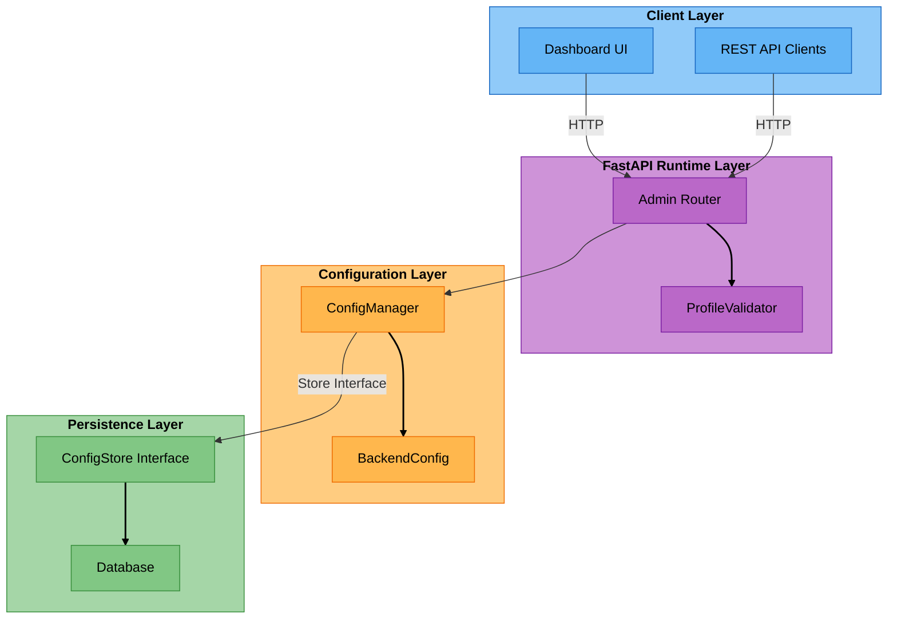
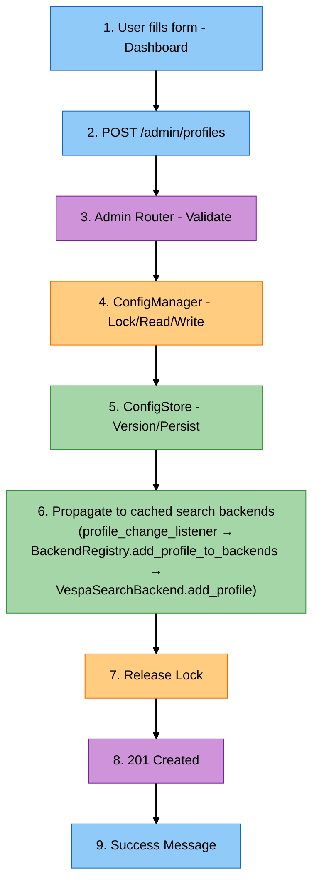
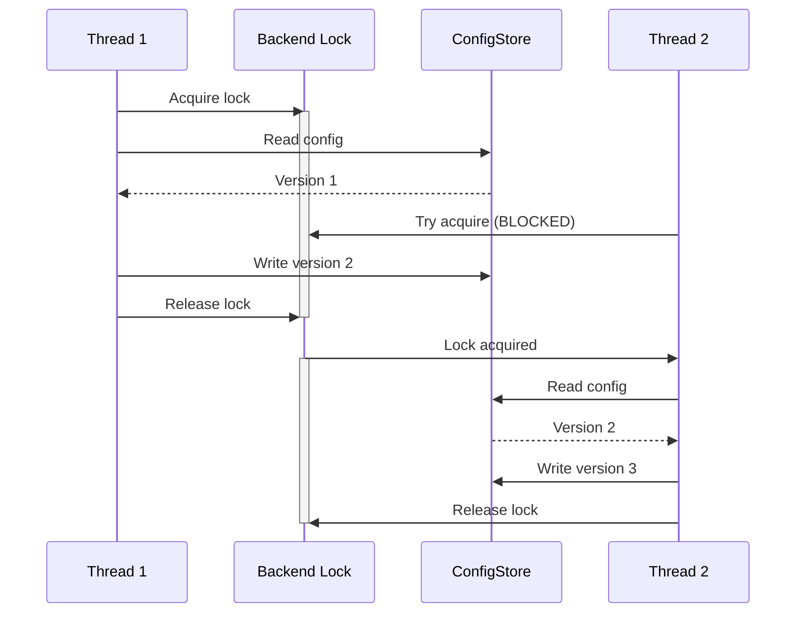
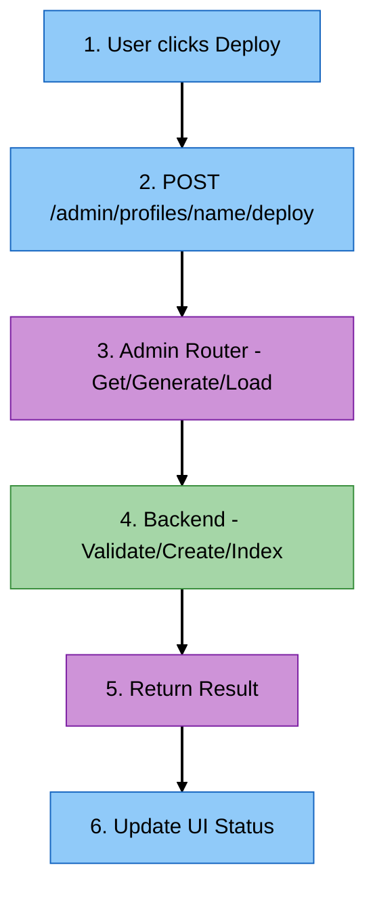

# Dynamic Backend Profiles - Architecture

Architecture overview of the dynamic profile registration system for backend configurations.

## Overview

The dynamic profile system replaces static `config.json` files with a database-backed, multi-tenant configuration management system. This enables:

- **Runtime profile creation** without code deployment
- **Multi-tenant isolation** for SaaS deployments
- **Concurrent access** with proper locking
- **Version control** for configuration changes
- **Schema deployment automation** via API

## Architecture Diagram


```mermaid
flowchart TB
    subgraph Client["<span style='color:#000'><b>Client Layer</b></span>"]
        Dashboard["<span style='color:#000'>Dashboard UI</span>"]
        APIClients["<span style='color:#000'>REST API Clients</span>"]
    end

    subgraph Runtime["<span style='color:#000'><b>FastAPI Runtime Layer</b></span>"]
        AdminRouter["<span style='color:#000'>Admin Router</span>"]
        Validator["<span style='color:#000'>ProfileValidator</span>"]
    end

    subgraph Config["<span style='color:#000'><b>Configuration Layer</b></span>"]
        ConfigMgr["<span style='color:#000'>ConfigManager</span>"]
        BackendCfg["<span style='color:#000'>BackendConfig</span>"]
    end

    subgraph Persistence["<span style='color:#000'><b>Persistence Layer</b></span>"]
        Store["<span style='color:#000'>ConfigStore Interface</span>"]
        DB["<span style='color:#000'>Database</span>"]
    end

    Dashboard -->|HTTP| AdminRouter
    APIClients -->|HTTP| AdminRouter
    AdminRouter --> Validator
    AdminRouter --> ConfigMgr
    ConfigMgr --> BackendCfg
    ConfigMgr -->|Store Interface| Store
    Store --> DB

    style Client fill:#90caf9,stroke:#1565c0,color:#000
    style Runtime fill:#ce93d8,stroke:#7b1fa2,color:#000
    style Config fill:#ffcc80,stroke:#ef6c00,color:#000
    style Persistence fill:#a5d6a7,stroke:#388e3c,color:#000

    style Dashboard fill:#64b5f6,stroke:#1565c0,color:#000
    style APIClients fill:#64b5f6,stroke:#1565c0,color:#000
    style AdminRouter fill:#ba68c8,stroke:#7b1fa2,color:#000
    style Validator fill:#ba68c8,stroke:#7b1fa2,color:#000
    style ConfigMgr fill:#ffb74d,stroke:#ef6c00,color:#000
    style BackendCfg fill:#ffb74d,stroke:#ef6c00,color:#000
    style Store fill:#81c784,stroke:#388e3c,color:#000
    style DB fill:#81c784,stroke:#388e3c,color:#000

    linkStyle 2,4,6 stroke:#000,stroke-width:2px
```

## Component Details

### 1. FastAPI Runtime Layer

**Location:** `libs/runtime/cogniverse_runtime/routers/admin.py`

**Responsibilities:**

- HTTP endpoint handling
- Request validation via Pydantic models
- Profile validation via ProfileValidator
- Schema deployment coordination
- Error handling and HTTP responses

**Key Endpoints:**

- `POST /admin/profiles` - Create profile
- `GET /admin/profiles` - List profiles for tenant
- `GET /admin/profiles/{profile_name}` - Get profile details
- `PUT /admin/profiles/{profile_name}` - Update mutable fields
- `DELETE /admin/profiles/{profile_name}` - Delete profile
- `POST /admin/profiles/{profile_name}/deploy` - Deploy schema

**Dependencies:**

- ConfigManager (injected via FastAPI Depends)
- ProfileValidator (injected via FastAPI Depends)
- SchemaLoader (for deployment)

### 2. Configuration Layer

**Location:** `libs/foundation/cogniverse_foundation/config/manager.py`

**ConfigManager:**

Centralized configuration manager with:

- Multi-tenant support
- Thread-safe operations
- Profile CRUD operations
- Deep merge for tenant overrides

**Thread Safety:**
```python
class ConfigManager:
    def __init__(
        self,
        store: ConfigStore,
        profile_change_listener: Optional[ProfileChangeListener] = None,
        scoped_config_cache_ttl_s: float = 5.0,
    ):
        if store is None:
            raise ValueError("store is required")
        self.store = store
        self._backend_lock = threading.Lock()  # Protects read-modify-write
        self._profile_change_listener = profile_change_listener

    def add_backend_profile(self, profile, tenant_id=None, service="backend"):
        tenant_id = require_tenant_id(tenant_id, source="ConfigManager.add_backend_profile")
        with self._backend_lock:  # Atomic operation
            backend_config = self.get_backend_config(tenant_id=tenant_id, service=service)
            backend_config.add_profile(profile)
            self.set_backend_config(backend_config, tenant_id=tenant_id, service=service)
        # Notified outside the lock so listener work can't deadlock on _backend_lock
        self._notify_profile_change("added", profile.profile_name, profile.to_dict())
```

**Why Locking?**

Without locks, concurrent operations have a race condition:

```python
# Thread 1: Reads config (profiles: A, B)
# Thread 2: Reads config (profiles: A, B)
# Thread 1: Adds profile C → Writes (profiles: A, B, C)
# Thread 2: Adds profile D → Writes (profiles: A, B, D)
# Result: Profile C is LOST!
```

The `_backend_lock` ensures:

1. Thread 1 acquires lock
2. Thread 1 reads, modifies, writes
3. Thread 1 releases lock
4. Thread 2 acquires lock (sees profiles A, B, C)
5. Thread 2 reads, modifies, writes (profiles: A, B, C, D)
6. Both profiles persist correctly

**BackendConfig:**

Dataclass representing tenant's backend configuration:

```python
@dataclass
class BackendConfig:
    tenant_id: Optional[str] = None
    backend_type: str = "vespa"
    url: str = "http://localhost"
    port: int = 8080
    profiles: Dict[str, BackendProfileConfig] = field(default_factory=dict)
    metadata: Dict[str, Any] = field(default_factory=dict)

    def __post_init__(self) -> None:
        # tenant_id is required; raises via require_tenant_id if omitted
        require_tenant_id(self.tenant_id, source="BackendConfig")

    def add_profile(self, profile: BackendProfileConfig):
        """Add or replace profile"""
        self.profiles[profile.profile_name] = profile

    def merge_profile(self, profile_name: str, overrides: Dict[str, Any]) -> BackendProfileConfig:
        """Deep merge overrides into existing profile"""
        base_profile = self.profiles.get(profile_name)
        if not base_profile:
            raise ValueError(f"Base profile '{profile_name}' not found")
        merged = base_profile.to_dict()
        self._deep_merge(merged, overrides)
        return BackendProfileConfig.from_dict(profile_name, merged)
```

### 3. Persistence Layer

- **Interface:** `libs/sdk/cogniverse_sdk/interfaces/config_store.py`
- **Example Implementation:** `libs/vespa/cogniverse_vespa/config/config_store.py`

**ConfigStore Interface:**

Backend-agnostic configuration storage with:

- Multi-tenant isolation
- Version tracking
- Concurrent access support
- Bounded version history (old versions pruned on write)

**Example: VespaConfigStore:**

```python
class VespaConfigStore(ConfigStore):
    """Vespa-based configuration store with multi-tenant support."""

    def __init__(
        self,
        vespa_app: Optional[Vespa] = None,
        backend_url: str = "http://localhost",
        backend_port: int = 8080,
        schema_name: str = "config_metadata",
        keep_versions: int = 10,
    ):
        if vespa_app is not None:
            self.vespa_app = vespa_app
        else:
            # Persistent session: config reads/writes are frequent and the
            # store lives for the process — see _vespa_factory.py in the
            # Backends Module doc for why this isn't plain make_vespa_app.
            self.vespa_app = make_persistent_vespa_ops(url=backend_url, port=backend_port)
        self.schema_name = schema_name
        self.keep_versions = max(1, keep_versions)

    def _get_latest_version(self, tenant_id, scope, service, config_key) -> int:
        """Get latest version number for a config"""
        config_id = f"{tenant_id}:{scope.value}:{service}:{config_key}"
        # yql_quote() escapes embedded quotes/backslashes before interpolation
        yql = (
            f"select version from {self.schema_name} "
            f"where config_id contains {yql_quote(config_id)} "
            f"order by version desc limit 1"
        )
        response = self.vespa_app.query(yql=yql)
        if response.hits and len(response.hits) > 0:
            return response.hits[0]["fields"]["version"]
        return 0

    def set_config(self, tenant_id, scope, service, config_key, config_value) -> ConfigEntry:
        """Set config as Vespa document with versioning"""
        current_version = self._get_latest_version(tenant_id, scope, service, config_key)
        new_version = current_version + 1
        now = datetime.now()

        entry = ConfigEntry(
            tenant_id=tenant_id, scope=scope, service=service, config_key=config_key,
            config_value=config_value, version=new_version, created_at=now, updated_at=now,
        )

        config_id = f"{tenant_id}:{scope.value}:{service}:{config_key}"
        doc_id = f"{self.schema_name}::{config_id}::{new_version}"

        self.vespa_app.feed_data_point(
            schema=self.schema_name,
            data_id=doc_id,
            fields={
                "config_id": config_id,
                "tenant_id": tenant_id,
                "scope": scope.value,
                "service": service,
                "config_key": config_key,
                "config_value": json.dumps(config_value),
                "version": new_version,
                "created_at": entry.created_at.isoformat(),
                "updated_at": entry.updated_at.isoformat(),
            }
        )
        # Prune older versions beyond keep_versions so config_metadata
        # doesn't grow unbounded across repeated updates
        self._prune_old_versions(config_id, keep=self.keep_versions)
        return entry
```

**Backend Benefits:**

- Unified storage with search backend
- No separate database to manage
- Same multi-tenant isolation as content
- Distributed and scalable

### 4. Validation Layer

**Location:** `libs/core/cogniverse_core/validation/profile_validator.py`

**ProfileValidator:**

Validates profile configurations against business rules:

```python
class ProfileValidator:
    def __init__(
        self,
        config_manager: "ConfigManager",
        schema_templates_dir: Optional[Path] = None,
    ):
        """
        Initialize ProfileValidator.

        Args:
            config_manager: ConfigManager instance for checking existing profiles
            schema_templates_dir: Directory containing schema template JSON files
                                 (defaults to configs/schemas/)
        """
        self.config_manager = config_manager
        self.schema_templates_dir = schema_templates_dir or Path("configs/schemas")

    def validate_profile(
        self, profile: BackendProfileConfig, tenant_id: str, is_update: bool = False
    ) -> List[str]:
        """Validate complete profile"""
        errors = []
        if not is_update:
            errors.extend(self._validate_uniqueness(profile, tenant_id))
        errors.extend(self._validate_profile_name(profile.profile_name))
        errors.extend(self._validate_profile_type(profile.type))
        errors.extend(self._validate_schema_template(profile.schema_name))
        errors.extend(self._validate_embedding_model(profile.embedding_model))
        errors.extend(self._validate_embedding_type(profile.embedding_type))
        errors.extend(self._validate_strategies(profile.strategies))
        errors.extend(self._validate_embedding_dimensions(profile))
        return errors

    def validate_update_fields(self, update_fields: dict) -> List[str]:
        """Validate that only mutable fields are being updated"""
        immutable_fields = {
            "schema_name", "embedding_model", "schema_config", "type", "model_loader",
        }
        errors = []
        for field in immutable_fields:
            if field in update_fields:
                errors.append(
                    f"Field '{field}' cannot be updated. "
                    "Create a new profile instead for schema changes."
                )
        # Values of mutable fields are validated too, so an update can't write
        # a malformed strategies block that create-time validation would reject
        if "strategies" in update_fields:
            errors.extend(self._validate_strategies(update_fields["strategies"]))
        return errors
```

**Validation Rules:**

- Profile name: alphanumeric, underscore, and hyphen; max 100 chars; unique within tenant (create only)
- Profile type: enum (`video`, `image`, `audio`, `document`, `code`)
- Schema name: must exist in schema directory (`configs/schemas/{schema_name}_schema.json`) with `name` and `document.fields`
- Embedding model: format `org/model` or `model-name` (warns, does not reject, on unusual format)
- Embedding type: enum (`multi_vector`, `single_vector`)
- Embedding dimensions: `schema_config.embedding_dim`, if present, must be an integer in 1-100000
- Strategies: each entry must be a dict with a `class` field naming an importable class
- Immutable on update: `schema_name`, `embedding_model`, `schema_config`, `type`, `model_loader`

### 5. Dashboard UI Layer

**Location:** `libs/dashboard/cogniverse_dashboard/tabs/backend_profile.py`

**Streamlit-based UI for profile management:**

```python
def render_backend_profile_tab():
    """Main entry point for backend profile management UI"""
    st.subheader("Backend Profile Management")

    if "current_tenant" not in st.session_state:
        st.error("No tenant selected. Set an Active Tenant in the sidebar first.")
        return

    # Initialize ConfigManager
    if "config_manager" not in st.session_state:
        st.session_state.config_manager = create_default_config_manager()

    manager = st.session_state.config_manager
    tenant_id = st.session_state["current_tenant"]

    # Profile list — read directly off ConfigManager
    profiles_dict = manager.list_backend_profiles(tenant_id, service="video_processing")
    profile_names = sorted(profiles_dict.keys()) if profiles_dict else []

    # Create new profile section
    with st.expander("➕ Create New Profile", expanded=len(profile_names) == 0):
        render_create_profile_form(manager, tenant_id)

    # Existing profiles
    if profile_names:
        selected_profile = st.selectbox("Select Profile to Manage", options=profile_names)
        if selected_profile:
            render_profile_manager(manager, tenant_id, selected_profile)
```

Profile **creation** itself goes through the admin HTTP API (`POST /admin/profiles`) rather than a direct `ConfigManager.add_backend_profile()` call, so the same code path that serves REST clients also serves the dashboard's create form. Note the service-scope difference: the admin router reads/writes profiles under `service="backend"`, while this tab's own list/get calls (above) read under `service="video_processing"` — the two service scopes are stored as separate `ConfigStore` entries, so a profile is only visible through whichever service key it was written under.

**API Integration:**

Dashboard uses httpx to call FastAPI endpoints:

```python
def deploy_schema_via_api(profile_name: str, tenant_id: str, force: bool = False) -> Dict[str, Any]:
    """Deploy schema via admin API"""
    api_url = get_runtime_api_url()
    endpoint = f"{api_url}/admin/profiles/{profile_name}/deploy"

    try:
        with httpx.Client(timeout=30.0) as client:
            response = client.post(endpoint, json={"tenant_id": tenant_id, "force": force})
            if response.status_code == 200:
                data = response.json()
                deployment_status = data.get("deployment_status", "")
                success = deployment_status not in ("failed",)
                return {
                    "success": success,
                    "tenant_schema_name": data.get("tenant_schema_name", ""),
                    "deployment_status": deployment_status,
                    "error": data.get("error_message") if not success else None,
                }
            else:
                error_detail = response.json().get("detail", response.text) if response.text else "Unknown error"
                return {
                    "success": False,
                    "tenant_schema_name": None,
                    "error": f"HTTP {response.status_code}: {error_detail}"
                }
    except httpx.TimeoutException:
        return {"success": False, "tenant_schema_name": None, "error": "Request timed out (>30s)"}
    except Exception as e:
        return {"success": False, "tenant_schema_name": None, "error": f"Failed to connect to API: {e}"}
```

## Data Flow

### Profile Creation Flow


```mermaid
flowchart TB
    User["<span style='color:#000'>1. User fills form - Dashboard</span>"]
    API["<span style='color:#000'>2. POST /admin/profiles</span>"]
    Router["<span style='color:#000'>3. Admin Router - Validate</span>"]
    ConfigMgr["<span style='color:#000'>4. ConfigManager - Lock/Read/Write</span>"]
    Store["<span style='color:#000'>5. ConfigStore - Version/Persist</span>"]
    Propagate["<span style='color:#000'>6. Propagate to cached search backends<br/>(profile_change_listener →<br/>BackendRegistry.add_profile_to_backends →<br/>VespaSearchBackend.add_profile)</span>"]
    Release["<span style='color:#000'>7. Release Lock</span>"]
    Response["<span style='color:#000'>8. 201 Created</span>"]
    Success["<span style='color:#000'>9. Success Message</span>"]

    User --> API
    API --> Router
    Router --> ConfigMgr
    ConfigMgr --> Store
    Store --> Propagate
    Propagate --> Release
    Release --> Response
    Response --> Success

    style User fill:#90caf9,stroke:#1565c0,color:#000
    style API fill:#90caf9,stroke:#1565c0,color:#000
    style Router fill:#ce93d8,stroke:#7b1fa2,color:#000
    style ConfigMgr fill:#ffcc80,stroke:#ef6c00,color:#000
    style Store fill:#a5d6a7,stroke:#388e3c,color:#000
    style Propagate fill:#a5d6a7,stroke:#388e3c,color:#000
    style Release fill:#ffcc80,stroke:#ef6c00,color:#000
    style Response fill:#ce93d8,stroke:#7b1fa2,color:#000
    style Success fill:#90caf9,stroke:#1565c0,color:#000

    linkStyle 0,1,2,3,4,5,6,7 stroke:#000,stroke-width:2px
```

### Concurrent Updates Flow


```mermaid
sequenceDiagram
    participant T1 as Thread 1
    participant Lock as Backend Lock
    participant Store as ConfigStore
    participant T2 as Thread 2

    T1->>Lock: Acquire lock
    activate Lock
    T1->>Store: Read config
    Store-->>T1: Version 1
    T2->>Lock: Try acquire (BLOCKED)
    T1->>Store: Write version 2
    T1->>Lock: Release lock
    deactivate Lock

    Lock->>T2: Lock acquired
    activate Lock
    T2->>Store: Read config
    Store-->>T2: Version 2
    T2->>Store: Write version 3
    T2->>Lock: Release lock
    deactivate Lock
```

### Schema Deployment Flow


```mermaid
flowchart TB
    Deploy["<span style='color:#000'>1. User clicks Deploy</span>"]
    API["<span style='color:#000'>2. POST /admin/profiles/name/deploy</span>"]
    Router["<span style='color:#000'>3. Admin Router - Get/Generate/Load</span>"]
    Backend["<span style='color:#000'>4. Backend - Validate/Create/Index</span>"]
    Result["<span style='color:#000'>5. Return Result</span>"]
    UI["<span style='color:#000'>6. Update UI Status</span>"]

    Deploy --> API
    API --> Router
    Router --> Backend
    Backend --> Result
    Result --> UI

    style Deploy fill:#90caf9,stroke:#1565c0,color:#000
    style API fill:#90caf9,stroke:#1565c0,color:#000
    style Router fill:#ce93d8,stroke:#7b1fa2,color:#000
    style Backend fill:#a5d6a7,stroke:#388e3c,color:#000
    style Result fill:#ce93d8,stroke:#7b1fa2,color:#000
    style UI fill:#90caf9,stroke:#1565c0,color:#000

    linkStyle 0,1,2,3,4 stroke:#000,stroke-width:2px
```

## Multi-Tenant Isolation

### Tenant Scoping

Every operation is scoped by `tenant_id`:

```python
# Get profiles for tenant A
profiles_a = config_manager.list_backend_profiles(tenant_id="tenant_a")

# Get profiles for tenant B
profiles_b = config_manager.list_backend_profiles(tenant_id="tenant_b")

# No overlap - complete isolation
```

### Backend-Level Isolation

All backend queries include `tenant_id` for isolation:

```python
# Example: Vespa query with tenant filter
config = config_store.get_config(
    tenant_id="tenant_a",
    scope=ConfigScope.BACKEND,
    service="backend",
    config_key="backend_config"
)
# Only returns data for tenant_a
```

### Schema Name Isolation

Deployed schemas include a tenant suffix. `VespaSchemaManager.get_tenant_schema_name()` first canonicalizes the tenant id to its `org:tenant` storage form (a simple id like `acme` becomes `acme:acme`) and then replaces `:` with `_`, so a simple-form tenant id is doubled in the suffix:

```text
tenant_a  → canonical tenant_a:tenant_a → profile: video_colpali → base schema: video_colpali_smol500_mv_frame → deployed: video_colpali_smol500_mv_frame_tenant_a_tenant_a
acme:prod → canonical acme:prod        → profile: video_colpali → base schema: video_colpali_smol500_mv_frame → deployed: video_colpali_smol500_mv_frame_acme_prod
```

Tenant schema naming follows pattern: `{base_schema_name}_{canonical_tenant_id.replace(':', '_')}`

No naming conflicts in Vespa.

## Version Control

### Version Incrementing

Each `set_config()` creates a new version:

```text
Version 1: Initial profile creation
Version 2: Update pipeline_config
Version 3: Update strategies
Version 4: Update description
```

### Version History

Query historical versions via ConfigStore:

```python
history = config_store.get_config_history(
    tenant_id="acme",
    scope=ConfigScope.BACKEND,
    service="backend",
    config_key="backend_config",
    limit=10
)
```

### Optimistic Concurrency

Admin router returns version in update response:

```json
{
  "version": 3,
  "updated_fields": ["pipeline_config"]
}
```

Clients can detect conflicts by comparing versions.

## Deployment Architecture

### Schema Templates

Schema templates stored on disk:

```text
configs/schemas/
├── video_colpali_smol500_mv_frame_schema.json
├── video_colqwen_omni_mv_chunk_30s_schema.json
├── video_videoprism_base_mv_chunk_30s_schema.json
├── video_videoprism_large_mv_chunk_30s_schema.json
├── video_videoprism_lvt_base_sv_chunk_6s_schema.json
├── video_videoprism_lvt_large_sv_chunk_6s_schema.json
├── ranking_strategies.json
└── ... (other schemas)
```

### Template Loading

**Location:** `libs/core/cogniverse_core/schemas/filesystem_loader.py`

```python
class FilesystemSchemaLoader(SchemaLoader):
    """
    Load Vespa schemas from filesystem directory.

    Inherits from SchemaLoader abstract interface defined in
    libs/sdk/cogniverse_sdk/interfaces/schema_loader.py
    """

    def __init__(self, base_path: Path):
        """Initialize with directory containing schema JSON files"""
        self.base_path = Path(base_path)

    def load_schema(self, schema_name: str) -> Dict[str, Any]:
        """Load schema template from disk"""
        schema_file = self.base_path / f"{schema_name}_schema.json"
        with open(schema_file, "r", encoding="utf-8") as f:
            return json.load(f)
```

### Tenant Schema Generation

Schema generation is handled by the backend's schema registry. The process:

1. Load base schema template via `FilesystemSchemaLoader`
2. Canonicalize `tenant_id` and generate tenant-specific name: `{base_schema_name}_{canonical_tenant_id.replace(':', '_')}`
3. Apply any tenant-specific configurations
4. Deploy to backend

Example flow (handled by schema registry and backend):

```python
# Load base schema template
base_schema = schema_loader.load_schema(profile.schema_name)

# Generate tenant-specific name (in VespaSchemaManager.get_tenant_schema_name())
canonical = canonical_tenant_id(tenant_id)  # "acme" -> "acme:acme"
tenant_schema_name = f"{base_schema_name}_{canonical.replace(':', '_')}"

# Deploy with tenant-specific naming (backend.deploy_schemas takes a list)
backend.deploy_schemas([{"name": tenant_schema_name, "definition": base_schema}])
```

## Testing Strategy

### Unit Tests

**Locations:**
- `tests/backends/unit/test_backend_config.py` - ConfigManager backend methods, `BackendConfig`/`BackendProfileConfig` dataclass operations
- `tests/common/unit/test_profile_validator.py` - ProfileValidator rules (name, type, schema template, embedding model/type/dimensions, strategies, uniqueness, update-field immutability)

Test individual components:

- ConfigManager methods
- ProfileValidator rules
- BackendConfig operations

### Integration Tests

**Multi-Tenant Tests** (`tests/admin/test_profile_multi_tenant.py`):

- Tenant isolation when creating a profile with the same name in two tenants
- Cross-tenant access prevention on get/update/delete
- Empty `tenant_id` rejected
- Isolation persists across create/update/delete operations

**Concurrent Tests** (`tests/admin/test_profile_concurrent.py`):

- Concurrent profile creation
- Concurrent updates (version tracking)
- Concurrent same-profile-name creation across different tenants
- Concurrent reads while an update is in flight
- Concurrent list operations
- Concurrent delete operations

**UI Tests** (`tests/dashboard/unit/test_profile_ui.py`):

- Dashboard API helper functions (deploy/delete/status)
- End-to-end workflow via dashboard functions against a running API
- Timeout, connection-error, and HTTP-error handling

### Test Fixtures

`tests/admin/test_profile_api.py` builds a minimal FastAPI app around the admin router with a real, isolated Vespa instance (no mocks at the storage boundary):

```python
@pytest.fixture
def test_client(self, vespa_instance, temp_schema_dir: Path):
    """Create test client for profile API with isolated Vespa instance."""
    from fastapi import FastAPI
    from cogniverse_core.registries.backend_registry import BackendRegistry
    from cogniverse_core.registries.schema_registry import SchemaRegistry
    from cogniverse_core.schemas.filesystem_loader import FilesystemSchemaLoader
    from cogniverse_foundation.config.manager import ConfigManager
    from cogniverse_foundation.config.unified_config import SystemConfig
    from cogniverse_runtime.routers import admin
    from cogniverse_vespa.config.config_store import VespaConfigStore

    BackendRegistry._instance = None
    BackendRegistry._backend_instances.clear()
    BackendRegistry._shared_schema_registry = None
    SchemaRegistry._instance = None

    # Config store pointing at the isolated Vespa instance (metadata schemas
    # already deployed by the vespa_instance fixture)
    store = VespaConfigStore(
        backend_url="http://localhost", backend_port=vespa_instance["http_port"],
    )
    config_manager = ConfigManager(store=store)
    config_manager.set_system_config(SystemConfig(backend_url="http://nonexistent", backend_port=9999))

    schema_loader = FilesystemSchemaLoader(temp_schema_dir)

    # Minimal app with just the admin router (no lifespan needed for CRUD tests)
    test_app = FastAPI()
    test_app.include_router(admin.router, prefix="/admin")
    admin.set_config_manager(config_manager)
    admin.set_schema_loader(schema_loader)
    admin.set_profile_validator_schema_dir(temp_schema_dir)

    try:
        client = TestClient(test_app)
        yield client
    finally:
        admin.reset_dependencies()
        BackendRegistry._instance = None
        BackendRegistry._backend_instances.clear()
        BackendRegistry._shared_schema_registry = None
        SchemaRegistry._instance = None
```

## Performance Characteristics

### Read Performance

- **Cached reads**: O(1) lookup in ConfigManager cache
- **Uncached reads**: Backend-dependent (e.g., Vespa index lookup)
- **List operations**: O(n) where n = number of profiles per tenant

### Write Performance

- **Single write**: Backend-dependent; a Vespa write is a `_get_latest_version` query followed by `feed_data_point` plus a `_prune_old_versions` cleanup query (three round-trips), not benchmarked in this codebase
- **Concurrent writes**: Serialized via `ConfigManager._backend_lock` (a single process-local `threading.Lock`), no deadlocks
- **Version pruning overhead**: Each `set_config` call also prunes versions beyond `keep_versions` (default 10) for that config_id

### Concurrency Limits

- **Read throughput**: Unlimited concurrent readers (backend-dependent)
- **Write throughput**: Limited by `_backend_lock` (one writer at a time, per process — the lock does not coordinate across separate runtime pods)

### Scaling Considerations

For high write concurrency:

- Use a distributed backend (e.g., Vespa cluster)
- Implement write batching
- Consider caching layer

## Security Considerations

### Tenant Isolation

- Strict `tenant_id` validation
- No cross-tenant access possible
- Database queries always filtered by tenant

### Input Validation

- All request bodies validated via Pydantic models
- Profile names restricted to alphanumeric, underscore, and hyphen (max 100 chars)
- JSON fields validated for syntax

### Query Safety

- `VespaConfigStore` builds YQL query strings dynamically (there is no parameterized-query API in the `ConfigStore` interface); every interpolated value is escaped with `yql_quote()` from `cogniverse_vespa._yql` before being embedded in the `contains` clause
- Backend-specific security defaults

### Future Enhancements

- API key authentication
- Role-based access control (RBAC)
- Audit logging for all operations
- Encryption at rest

## Related Documentation

- [Profile Management Dashboard](../user/profile-management.md) - User guide
- [Profile API Reference](../user/profile-api-reference.md) - API docs
- [Configuration System](../CONFIGURATION_SYSTEM.md) - Overall config architecture
