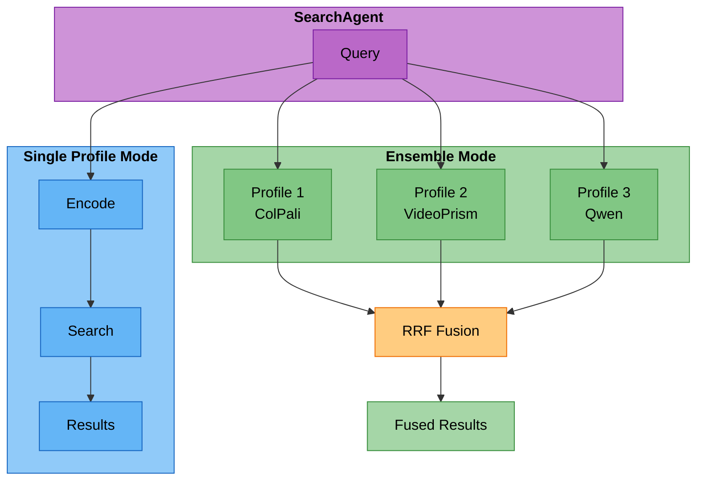

# Ensemble Composition with Reciprocal Rank Fusion

## Overview

Ensemble composition allows the system to query multiple backend profiles (embedding models) in parallel and intelligently fuse their results using Reciprocal Rank Fusion (RRF). This approach leverages the complementary strengths of different embedding models to improve search quality, particularly on complex queries.

## Architecture

### Components



## Reciprocal Rank Fusion (RRF)

### Algorithm

RRF is a simple yet effective rank aggregation method that combines rankings from multiple sources without requiring score calibration.

**Formula**:
```text
score(doc) = Σ_profiles (1 / (k + rank_in_profile))
```

Where:

- `doc`: Document/result being scored
- `k`: Constant (default: 60) - controls the weight of top-ranked documents
- `rank_in_profile`: Rank of document in a specific profile's results (0-indexed)

### Example

Given 3 profiles ranking a document differently (0-indexed):

- Profile 1 (ColPali): rank = 1 (2nd position)
- Profile 2 (VideoPrism): rank = 4 (5th position)
- Profile 3 (Qwen): rank = 0 (1st position)

RRF score = 1/(60+1) + 1/(60+4) + 1/(60+0)
         = 1/61 + 1/64 + 1/60
         = 0.0164 + 0.0156 + 0.0167
         = 0.0487

### Properties

1. **Score Normalization**: Scores are bounded (0, 1/k), making them comparable across profiles
2. **Rank-Based**: Uses only rank information, not raw scores (handles score distribution differences)
3. **Top-Heavy**: Higher-ranked documents get disproportionately more weight
4. **Unsupervised**: No training required, works out-of-the-box

### Parameter k

The constant `k` controls the influence of ranking position:

- **Lower k** (e.g., 30): More weight to top-ranked documents, aggressive fusion
- **Higher k** (e.g., 100): More equal treatment across ranks, conservative fusion
- **Default k=60**: Balanced - empirically proven effective across IR tasks

## Implementation

### SearchAgent Ensemble Methods

#### 1. Ensemble Search Method
```python
async def _search_ensemble(
    self,
    query: str,
    profiles: List[str],
    modality: str = "video",
    top_k: int = 10,
    rrf_k: int = 60,
    **kwargs
) -> List[Dict[str, Any]]:
    """
    Execute parallel search across multiple profiles and fuse with RRF.

    Args:
        query: Text search query
        profiles: List of profile names to query
        modality: Content modality to search
        top_k: Number of final results to return
        rrf_k: RRF constant for fusion
        **kwargs: Additional search parameters

    Returns:
        Fused results from all profiles
    """
```

#### 2. Parallel Execution
The ensemble search implementation uses `asyncio.gather` to execute searches across all profiles concurrently:

```python
# Inside _search_ensemble method:
# Encode queries in parallel
encoding_tasks = [encode_for_profile(p) for p in profiles]
profile_embeddings = await asyncio.gather(*encoding_tasks)

# Execute searches in parallel using shared thread pool
with concurrent.futures.ThreadPoolExecutor(max_workers=len(valid_embeddings)) as executor:
    search_tasks = [
        search_profile(profile, embeddings, executor)
        for profile, embeddings in valid_embeddings.items()
    ]
    profile_results_list = await asyncio.gather(*search_tasks)
```

#### 3. RRF Fusion
```python
def _fuse_results_rrf(
    self,
    profile_results: Dict[str, List[Dict[str, Any]]],
    k: int = 60,
    top_k: int = 10
) -> List[Dict[str, Any]]:
    """
    Fuse results from multiple profiles using Reciprocal Rank Fusion (RRF).

    Formula: score(doc) = Σ_profiles (1 / (k + rank_in_profile))

    Args:
        profile_results: Dict mapping profile names to their result lists
        k: RRF constant (default 60, typical range: 20-100)
        top_k: Number of final results to return

    Returns:
        Fused and re-ranked results
    """
    # Accumulate RRF scores by document ID
    doc_scores = {}  # doc_id -> {score, result_data}

    # Calculate RRF scores
    for profile_name, results in profile_results.items():
        for rank, result in enumerate(results):
            doc_id = result["id"]
            rrf_score = 1.0 / (k + rank)

            if doc_id not in doc_scores:
                doc_scores[doc_id] = {
                    "score": 0.0,
                    "result": result,
                    "profile_ranks": {},
                    "profile_scores": {},
                }

            doc_scores[doc_id]["score"] += rrf_score
            doc_scores[doc_id]["profile_ranks"][profile_name] = rank
            doc_scores[doc_id]["profile_scores"][profile_name] = result.get("score", 0.0)

    # Sort by RRF score
    fused_results = []
    for doc_id, doc_data in doc_scores.items():
        result = doc_data["result"].copy()
        result["rrf_score"] = doc_data["score"]
        result["profile_ranks"] = doc_data["profile_ranks"]
        result["profile_scores"] = doc_data["profile_scores"]
        result["num_profiles"] = len(doc_data["profile_ranks"])
        fused_results.append(result)

    # Sort by RRF score (descending)
    fused_results.sort(key=lambda x: x["rrf_score"], reverse=True)

    return fused_results[:top_k]
```

## When to Use Ensemble

### Use Cases

**Ensemble is beneficial for**:

1. **Complex queries**: Multiple semantic aspects (e.g., "show me video of robots playing soccer in tournaments")
2. **Ambiguous queries**: Queries that could match multiple interpretations
3. **Multi-modal content**: Content with both visual and textual components
4. **Recall-critical tasks**: When missing relevant documents is costly

**Single profile is sufficient for**:

1. **Simple keyword queries**: Direct term matches (e.g., "cat videos")
2. **Latency-critical applications**: When <100ms difference matters
3. **High-confidence queries**: When one profile clearly dominates

### Automatic Selection

ProfileSelectionAgent can help select the best profile for a query:

```python
class ProfileSelectionSignature(dspy.Signature):
    """Select optimal backend profile based on query analysis"""

    query: str = dspy.InputField(desc="User query to analyze")
    available_profiles: str = dspy.InputField(
        desc="Comma-separated list of available profiles"
    )

    selected_profile: str = dspy.OutputField(desc="Best matching profile name")
    confidence: str = dspy.OutputField(desc="Confidence score 0.0-1.0")
    reasoning: str = dspy.OutputField(desc="Explanation for profile selection")
    query_intent: str = dspy.OutputField(
        desc="Detected intent: text_search, video_search, image_search, etc."
    )
    modality: str = dspy.OutputField(desc="Target modality: video, image, text, audio")
    complexity: str = dspy.OutputField(desc="Query complexity: simple, medium, complex")
```

Note: ProfileSelectionAgent currently selects a single profile. For ensemble search, you can explicitly provide multiple profiles via the `profiles` parameter in SearchInput.

## Performance Characteristics

### Latency

| Configuration | Typical Latency | Notes |
|--------------|----------------|--------|
| Single profile | 400-600ms | Baseline |
| Ensemble (2 profiles) | 500-700ms | +100-150ms overhead |
| Ensemble (3 profiles) | 550-750ms | +150-200ms overhead |
| RRF fusion | 5-10ms | Negligible |

**Key insight**: Parallel execution keeps ensemble latency close to single-profile latency (not 2x or 3x).

### Quality Improvements

Ensemble search typically provides significant quality improvements for complex queries. Expected improvements based on information retrieval research:

| Metric | Single Best Profile | Ensemble (3 profiles) | Expected Improvement |
|--------|-------------------|---------------------|-------------|
| NDCG@10 | Baseline | Higher | +10-20% typical |
| MRR | Baseline | Higher | +8-15% typical |
| Recall@20 | Baseline | Higher | +15-25% typical |

**Note**: Actual improvements vary by query complexity, profile diversity, and content characteristics. Complex queries with multiple semantic aspects tend to benefit most.

**Complex queries** = queries with >3 entities, >2 relationships, or multi-aspect semantics

### Resource Usage

- **Network**: 2-3x connections (parallel requests to Vespa)
- **Memory**: O(n_profiles × n_results) ~ 5-10KB for typical case
- **CPU**: Minimal (RRF is O(n) and runs in <10ms)

## Configuration

### Profile Configuration

Profiles are defined in `config.json`:

```json
{
  "backend": {
    "type": "vespa",
    "profiles": {
      "video_colpali_smol500_mv_frame": {
        "type": "video",
        "description": "Frame-based ColPali for patch-level visual search with multi-vector embeddings",
        "embedding_model": "vidore/colsmol-500m",
        "embedding_type": "frame_based",
        "schema_config": {
          "embedding_dim": 128
        }
      },
      "video_videoprism_base_mv_chunk_30s": {
        "type": "video",
        "description": "VideoPrism base model for 30-second chunk embeddings with 768-dim global representations",
        "embedding_model": "videoprism_public_v1_base_hf",
        "embedding_type": "direct_video_segment",
        "schema_config": {
          "embedding_dim": 768
        }
      },
      "video_colqwen_omni_mv_chunk_30s": {
        "type": "video",
        "description": "ColQwen-Omni for 30-second video chunk embeddings with multimodal understanding",
        "embedding_model": "vidore/colqwen-omni-v0.1",
        "embedding_type": "video_chunks",
        "schema_config": {
          "embedding_dim": 128
        }
      }
    }
  }
}
```

### Ensemble Configuration

Ensemble search is configured via SearchInput parameters:

```python
from cogniverse_agents.search_agent import SearchInput

# Configure ensemble search
search_input = SearchInput(
    query="robots playing soccer",
    modality="video",
    profiles=["video_colpali_smol500_mv_frame", "video_videoprism_base_mv_chunk_30s"],
    top_k=10,
    rrf_k=60,  # RRF constant for fusion
)
```

## Best Practices

### 1. Profile Diversity

**Choose profiles with complementary strengths**:

- ✅ Good: ColPali (visual) + VideoPrism (temporal) + Qwen (cross-modal)
- ❌ Poor: ColPali + ColPali-Large + ColPali-XL (redundant)

### 2. Limit Ensemble Size

**Use 2-3 profiles maximum**:

- More profiles = diminishing returns
- Complexity increases: O(n_profiles × top_k) for RRF fusion
- Network overhead grows linearly

### 3. Profile Ordering

**Order profiles by expected relevance** (for early stopping):
```python
# ProfileSelectionAgent should rank profiles
selected_profiles = ["colpali", "videoprism", "qwen"]  # Best first
```

### 4. Conditional Ensemble

**Don't always use ensemble**:
```python
if query_complexity > threshold or confidence < threshold:
    use_ensemble = True
else:
    use_single_profile = True
```

### 5. Monitoring

**Track ensemble effectiveness**:
```python
metrics = {
    "ensemble_usage_rate": 0.35,  # 35% of queries use ensemble
    "quality_improvement": 0.15,  # +15% NDCG
    "latency_overhead": 150,      # +150ms average
    "profile_agreement": 0.42,    # 42% result overlap
}
```

## Troubleshooting

### Low Quality Improvement

**Symptom**: Ensemble doesn't improve over single best profile

**Possible causes**:

1. Profiles too similar (high overlap)
2. Query too simple (single aspect)
3. RRF k value suboptimal

**Solutions**:

- Choose more diverse profiles
- Use single profile for simple queries
- Tune k parameter (try 30, 60, 100)

### High Latency

**Symptom**: Ensemble takes >1s

**Possible causes**:

1. Sequential execution (bug)
2. Slow profiles in ensemble
3. Network issues

**Solutions**:

- Verify parallel execution (check logs)
- Remove slow profiles from ensemble
- Increase connection pool size

### No Result Overlap

**Symptom**: RRF produces sparse results (few documents ranked by multiple profiles)

**Possible causes**:

1. Profiles searching different indices
2. Profiles optimized for different modalities
3. Query mismatch

**Solutions**:

- Ensure all profiles search same content
- Check profile compatibility
- Log profile results for debugging

## Multi-Query Fusion

Multi-query fusion is a complementary technique to ensemble search. While **ensemble** varies the **profile** (embedding model) with a fixed query, **multi-query fusion** varies the **query** (via `ComposableQueryAnalysisModule` LLM-generated variants) against a single profile.

### Comparison

| | Ensemble (Multi-Profile) | Multi-Query Fusion |
|---|---|---|
| **What varies** | Profile (embedding model) | Query (rewritten variants) |
| **Entry path** | `_process_impl()` → `_search_ensemble()` | `search_with_routing_decision()` → `_search_multi_query_fusion()` |
| **Input** | `SearchInput.profiles` | `RoutingOutput.query_variants` |
| **Fusion** | RRF across profiles | RRF across query variants |
| **Config** | `SearchInput.profiles` list | `RoutingConfig.query_fusion_config` |

### How It Works

1. `RoutingAgent` calls `ComposableQueryAnalysisModule.forward(query)` which extracts entities, infers relationships, enhances the query, and generates query variants in a single composable step
2. Each variant is encoded and searched in parallel against the same profile
3. Results are fused with `_fuse_results_rrf()` (same algorithm as ensemble)

### Configuration

```json
{
  "query_fusion_config": {
    "include_original": true,
    "rrf_k": 60
  }
}
```

Additional routing config fields control the composable module's path selection:
- `entity_confidence_threshold` (default: 0.6) — GLiNER confidence threshold for Path A vs Path B
- `min_entities_for_fast_path` (default: 1) — minimum entities required for Path A

### Mutual Exclusivity

Ensemble and multi-query fusion use **structurally disjoint entry paths** — `SearchInput` has no `query_variants` field, and `RoutingDecision` does not trigger ensemble. They cannot overlap in a single request.

---

## Future Enhancements

### 1. Learned Fusion

Replace RRF with learned fusion model:
```python
class LearnedFusion(dspy.Module):
    def __init__(self):
        self.fusion = dspy.ChainOfThought(FusionSignature)

    def forward(self, profile_results, query_features):
        # LLM-based intelligent fusion
        return self.fusion(results=profile_results, features=query_features)
```

### 2. Adaptive k

Learn optimal k per query type:
```python
k = adaptive_k_predictor(query, query_complexity, profile_set)
```

### 3. Profile Pruning

Dynamically select subset of profiles during fusion:
```python
# If profile contributes <5% unique results, remove it
active_profiles = prune_low_contribution_profiles(profile_results)
```

### 4. Cross-Modal Reranking

Rerank fused results using cross-modal similarity:
```python
reranked = cross_modal_reranker(
    fused_results,
    query_text=query,
    query_embedding=query_emb,
    multimodal_features=extracted_features
)
```

## References

1. **RRF Original Paper**: Cormack, G. V., Clarke, C. L., & Buettcher, S. (2009). "Reciprocal rank fusion outperforms condorcet and individual rank learning methods." SIGIR.

2. **Multi-Vector Search**: Khattab, O., & Zaharia, M. (2020). "ColBERT: Efficient and Effective Passage Search via Contextualized Late Interaction over BERT." SIGIR.

3. **Ensemble Learning in IR**: Fox, E. A., & Shaw, J. A. (1994). "Combination of multiple searches." TREC.

## See Also

- [Multi-Agent Interactions](./multi-agent-interactions.md) - Overall architecture
- [Dynamic Profiles](./dynamic-profiles.md) - Profile management
- [Profile Management](../user/profile-management.md) - User documentation
