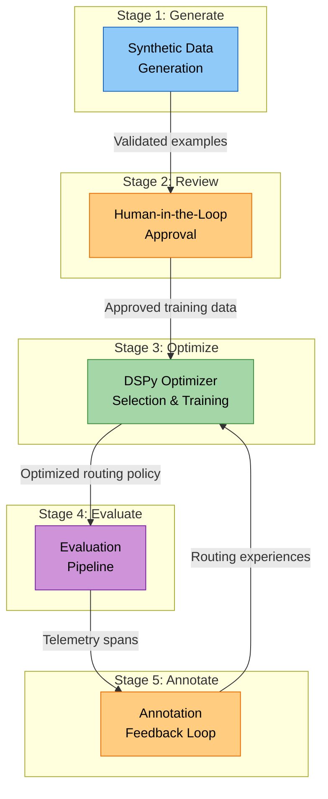
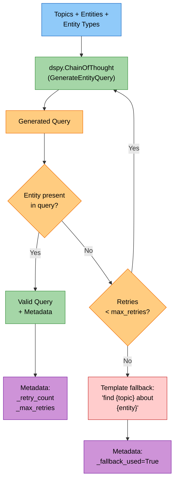
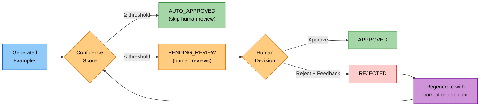
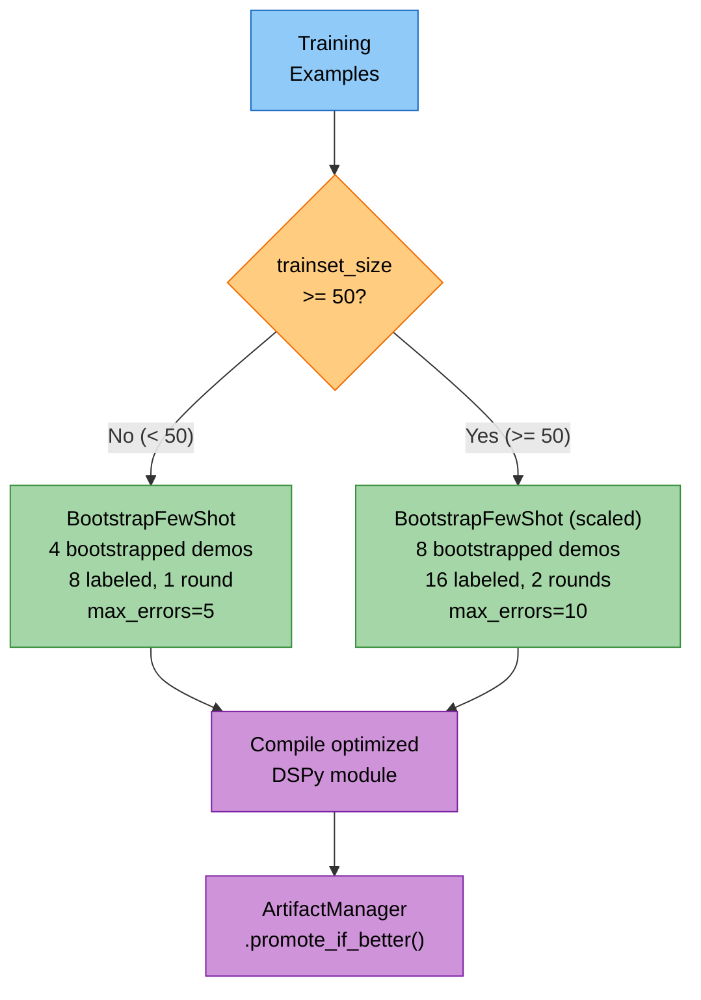
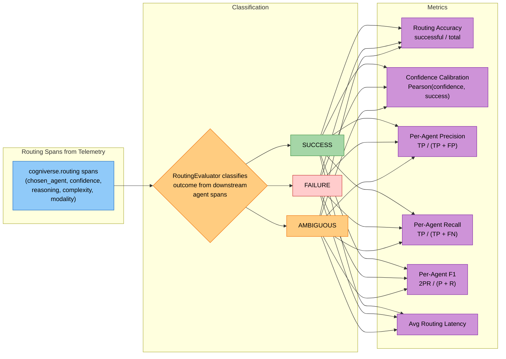
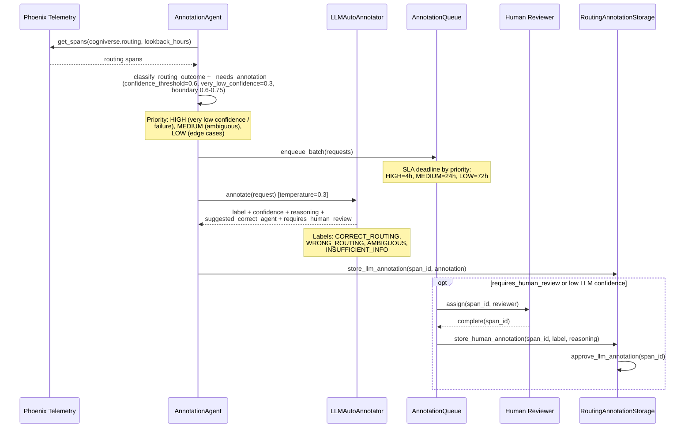
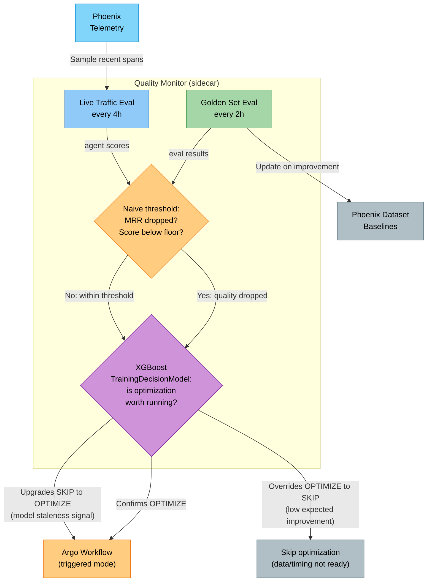
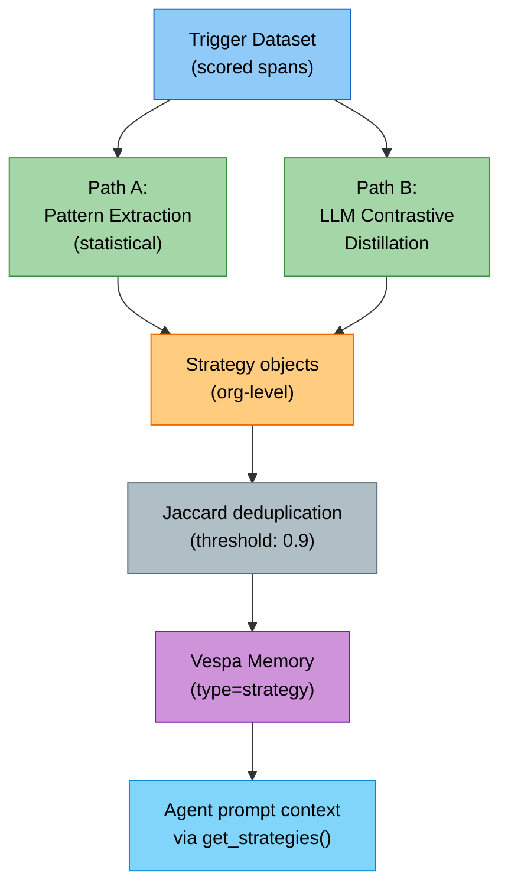

# The Evaluation & Optimization Loop

## Per-tenant signature variants

Some tenants have unusual data shapes — a legal-knowledge tenant whose
queries always carry `jurisdiction`, an audio tenant that needs an extra
`channel_count` field — and benefit from a variant of an agent's DSPy
signature that exposes those fields. This change ships **Option B** from the
plan: a small named-variant registry per agent. Tenants pick a variant
via config; the artefact manager keys per `(tenant, agent, variant)`.

```python
from cogniverse_agents.optimizer.signature_variants import (
    DEFAULT_VARIANT_ID,
    SignatureVariantRegistry,
    variant_qualified_agent_key,
)

registry = SignatureVariantRegistry()
registry.register(
    "search_agent",
    "with_jurisdiction",
    description="adds jurisdiction + effective_date input fields",
)

# Resolve at request time:
variant_id = registry.selected_for_tenant(tenant_config, "search_agent")
# → "default" or "with_jurisdiction"

# Key the artefact manager dataset:
agent_key = variant_qualified_agent_key("search_agent", variant_id)
# default → "search_agent" (back-compat with existing datasets)
# non-default → "search_agent::variant=with_jurisdiction"
```

Tenant selection lives under
`TenantConfig.metadata["signature_variants"][agent_type] = "<variant_id>"`.
Unknown variant ids fall back to `default` with a warning so operators
catch typos without breaking serving.

| Property | Behaviour |
|---|---|
| Re-register identical variant | Idempotent. |
| Re-register different definition (no `replace=True`) | `ValueError`. |
| Variant id contains `:` or `/` | Sanitised in dataset key (replaced with `_`). |
| Tenant requests an unknown variant | Falls back to `default`, logs a warning. |

The dataset-key shape (`agent::variant=<id>`) is intentionally a
suffix on the bare agent type so existing artefacts (saved before this change)
map naturally onto the default variant — no migration needed.

## Per-tenant canary promotion

`ArtifactManager` exposes a small state machine for safer promotions:

| Slot | Meaning |
|---|---|
| `active` | Version currently serving 90%+ traffic |
| `canary` | Optional version serving the remaining `traffic_pct` |
| `retired` | History of versions that were active or canary in the past |

```python
# Promote v3 to canary at 10% traffic
await artifact_mgr.promote_to_canary("search_agent", version=3, traffic_pct=10)

# QualityMonitor (or any operator) compares spans + metrics over a window,
# then either:
await artifact_mgr.promote_canary_to_active("search_agent")   # graduate
# or:
await artifact_mgr.retire_canary("search_agent", reason="judge_score_drop")

# Per-request routing (use the request id / trace id as the seed):
result = await artifact_mgr.load_for_request(
    "search_agent", request_seed=request_id
)
# result["served_from"] = "active" | "canary" | "default"
# result["version"]     = int | None
```

**Stable routing** — `request_seed` is hashed to a `[0, 100)` bucket so
the same request always hits the same arm; a canary at 10% traffic
serves a deterministic 10% of seeds.

State is persisted as a single `save_blob` JSON document, so all four
operations (`promote_to_canary`, `promote_canary_to_active`,
`retire_canary`, `get_artefact_state`) are atomic at the dataset layer.

The active dataset (un-versioned) is what existing agents read at
`__init__`; promote_canary_to_active copies the versioned snapshot into
the active dataset name, so no agent code changes are required.

## Snapshot + rollback

`promote_if_better` snapshots the soon-to-be-overwritten active artefacts
into a versioned dataset before applying the new ones. The snapshot's
version number is recorded in the `ExperimentMetrics.extra_metrics` under
`pre_promote_snapshot`, so operators can find the rollback target by
reading the experiment ledger.

```python
# Operator decides v3 was a regression — roll back to v2.
out = await artifact_mgr.rollback_to_version(
    "search_agent", prompts_version=2
)
# out["restored"] = {"prompts_version": 2}
# out["backup_versions"] = {"prompts_version": <newer snapshot of the v3 we just left>}
```

The rollback itself takes a fresh snapshot of the current state before
applying the restore, so the rollback is itself reversible. Snapshots
live as `dspy-prompts-{tenant}-{agent}-vN` (and `dspy-demos-…-vN`)
datasets; `list_versions` enumerates them.

Hot reload note: the generic agents are rebuilt per request (the dispatcher
runs `_load_artifact` after telemetry/tenant injection), so a new artefact
lands without restart on the next request. The gateway agent is the
exception — it is cached per tenant in a bounded `TenantLRUCache`
(`GATEWAY_AGENT_CACHE_CAPACITY`, 64 tenants; least-recently-dispatched
tenants rebuild on their next request), and cache hits re-run
`_load_artifact` once the reload interval elapses (`GATEWAY_ARTIFACT_TTL_S`,
5 minutes), so a recalibration starts serving on a warm pod within that
interval. Deleting a tenant evicts its cached gateway agent immediately
(`evict_tenant_from_registered_caches`, see
[Foundation Module](../modules/foundation.md#tenant-scoped-caching)) rather
than waiting for LRU pressure. A rollback therefore only needs to flip the
active dataset content.

## Regression-reject gate

`ArtifactManager.promote_if_better` is the canonical write path for
optimizer outputs. It compares the candidate against the active baseline
and promotes only when
`candidate_score >= baseline_score + min_improvement - tolerance`
(`min_improvement` defaults to 0; `--mode triggered` wires the tenant's
`optimization_improvement_threshold` into it, and passes
`serve_versioned=True` so a win lands through the canary state machine).
Failed promotions still land in the experiment ledger with `promoted=False`
and a `rejection_reason`, so the loop is observable end-to-end:

```python
record = await artifact_mgr.promote_if_better(
    agent_type="search_agent",
    candidate_prompts=compiled.prompts,
    candidate_demos=compiled.demos,
    baseline_score=0.62,
    candidate_score=0.58,
    tolerance=0.005,
    optimizer="BootstrapFewShot",
    train_examples=64,
)
if record.promoted:
    logger.info("artefacts updated")
else:
    logger.warning("rejected: %s", record.extra_metrics["rejection_reason"])
```

Operators should use `tolerance` to absorb evaluation noise (typical
golden-set noise is 0.5–1.0 pt). Set `tolerance=0` for strict-better
promotions on stable eval sets.

The rejected runs are queryable via `load_experiments(agent_type)` so the
QualityMonitor → Argo recompile loop has full history to reason over.

## Architectural decision — the optimizer is a batch CLI, not a daemon

The optimizer (`optimization_cli`, compiling with `BootstrapFewShot` — scaled by
trainset size — for query analysis / summary / detailed report / entity
extraction / query enhancement) is **deliberately a stateless batch tool**. It
is invoked from Argo CronWorkflows and from `QualityMonitor` trigger events; it
is not a long-lived service. (`MIPROv2` is wired in `DSPyOptimizerRegistry` for
any agent whose `OptimizerConfig.optimizer_type` selects it, but no batch CLI
mode currently defaults to it — see "Optimizer Selection" below.)

**Why this is correct (do not change without strong reason):**

- **Idempotency.** A failed run leaves no half-written state. Retrying a CronWorkflow re-runs the whole compile cleanly.
- **Observability.** Each Argo run has its own telemetry, logs, and lifecycle.
  Argo's UI is the source of truth for "what optimization runs have happened
  for this tenant." A daemon would have to reproduce all of that.
- **Resource shape.** Compiles are bursty (heavy LLM use for ~minutes, then
  idle for hours/days). Bursty workloads belong in batch schedulers, not in
  always-on pods.
- **Debuggability.** Each compile is a single, isolated process — no shared
  state across runs, no race conditions between concurrent recompiles for
  different tenants.
- **Existing trigger paths already work.** `QualityMonitor` runs continuously
  in the runtime sidecar, detects degradation, and submits Argo workflows.
  This is the right shape: detect in the long-lived service, recompile in a
  batch job.

**Therefore:**

- Do not replace `optimization_cli` with a daemon.
- Do not add long-lived background recompile loops to the runtime pod.
- New optimization triggers belong in `QualityMonitor` (live signal) or in a
  CronWorkflow (schedule). Both submit Argo workflows that invoke the CLI.
- Hot reload of compiled artefacts belongs in the **runtime**, not in the
  optimizer — the dispatcher reloads artefacts per request (TTL-gated for
  the cached gateway agent; see the Hot reload note above); the optimizer's
  job ends when it has written the artefact.

If you find yourself wanting a daemon, the actual gap is more likely
*observability* (Phoenix tile, dashboard view) or *trigger latency* (poll
interval, threshold tuning) — fix those, not the execution model.

### `optimization_cli` modes

Every `--mode` value `python -m cogniverse_runtime.optimization_cli` accepts:

| Mode | What it does |
|---|---|
| `cleanup` | Daily cleanup workflow: memory + logs + temp files + config vacuum |
| `monthly-reports` | Generates the monthly usage + performance report |
| `triggered` | Compiles DSPy modules for `--agents` from a scored `--trigger-dataset`; runs `StrategyLearner` afterward |
| `simba` | Compiles `QueryEnhancementAgent`'s module from a scored trigger dataset (name is historical — still uses `BootstrapFewShot`) |
| `workflow` | Compiles orchestration workflow strategies via `WorkflowIntelligence` |
| `gateway-thresholds` | Recalibrates `fast_path_confidence_threshold` / `gliner_threshold` from `cogniverse.gateway` spans |
| `online-routing-eval` | Scores recent `cogniverse.routing` spans (routing outcome + confidence calibration) without compiling anything |
| `online-eval` | Per-agent-type online span scoring: every domain-span agent (routing, query_enhancement, entity_extraction, profile_selection) scored by its evaluator-registry structural evaluators, persisted as `online_eval.*` annotations |
| `profile` | Compiles the search-profile-selection module from spans |
| `entity-extraction` | Compiles `EntityExtractionModule` from `cogniverse.entity_extraction` spans |
| `rollback` | Restores a previously-snapshotted `--prompts-version`/`--demos-version` via `ArtifactManager.rollback_to_version` |
| `egress-netpol` | Generates Kubernetes NetworkPolicy CRDs from agent policy YAMLs' declared egress |
| `ab-compare` | Runs `RLMABRunner` over a Phoenix queries dataset, comparing two arms per query and emitting an `rlm.ab_compare` span per row |
| `synthetic` | Runs synthetic data generation via `cogniverse_synthetic` |

---

## Problem Statement

Static prompts and fixed routing logic degrade over time. Query distributions shift, new content types appear, and user expectations evolve. A system that was 90% accurate at launch will silently drift to 70% without a mechanism for continuous learning.

The solution is a **closed-loop system** where every routing decision feeds back into optimization — through synthetic data generation, human review, automated evaluation, and annotation-driven retraining.

---

## The Complete Feedback Loop



Each stage feeds the next, creating a virtuous cycle: generate data → human validates → optimizer learns → evaluation measures → annotations refine → optimizer improves further.

---

## Stage 1: Synthetic Data Generation

### Validated DSPy Modules

Synthetic training data is generated using a `ValidatedEntityQueryGenerator` — a DSPy module with `ChainOfThought` reasoning and built-in retry validation.



**Key design decisions:**
- **Deterministic fallback, not an exception** — `ValidatedEntityQueryGenerator.forward` retries up to `max_retries` (default: 3) attempts; if none produce a query containing an entity word, it emits a template query (`"find {topic} about {entity}"`) built directly from the input topics/entities, tags the result `_fallback_used=True`, and returns it rather than raising. Downstream confidence scoring still penalizes it via the retry-count signal (see below)
- **Validation is case-insensitive** — at least one entity must appear in the generated query text
- **Retry count is metadata** — stored on the prediction for downstream confidence scoring

### Confidence Scoring

Each generated example receives a confidence score from 4 independent signals:

| Signal | Weight | Logic |
|---|---|---|
| **Retry Count** | Dominant | −0.15 per retry attempt (penalty stacks) |
| **Entity Presence** | Multiplicative | ×1.05 boost if entity found; ×0.7 penalty if expected but missing |
| **Query Length** | Multiplicative | ×0.8 if < 10 chars (too short); ×0.9 if > 200 chars (too long) |
| **Reasoning Quality** | Minor boost | ×1.02 if reasoning text > 20 characters |

**Resulting confidence bands:**
- **0.9–1.0**: High confidence (first attempt, entities present, good length)
- **0.75–0.9**: Medium confidence (1–2 retries)
- **< 0.75**: Low confidence (3+ retries, missing entities)

The final score is clamped to [0.0, 1.0].

---

## Stage 2: Human-in-the-Loop Approval

### Confidence-Based Auto-Approval

Generated data is sorted into batches with automatic triage:



**Approval statuses:**
- `AUTO_APPROVED` — high confidence, no human needed
- `PENDING_REVIEW` — below threshold, awaiting human
- `APPROVED` — human explicitly approved
- `REJECTED` — human rejected with feedback
- `REGENERATED` — rejected, then regenerated with corrections

### Rejection → Feedback → Regeneration Cycle

When a human rejects an example, the `FeedbackHandler`:

1. Extracts the original generation parameters (topics, entities)
2. Applies corrections from the reviewer (e.g., corrected entities, refined topics)
3. Regenerates using the DSPy module with corrections applied
4. Creates a new review item with ID `{original_id}_regen_{attempt}`
5. Sets initial confidence to 0.8 and stores generation metadata:
   - `regeneration: True`
   - `original_query` for comparison
   - `human_feedback` text
   - `corrections_applied` dictionary

Maximum 2 regeneration attempts per item. If all fail, the item is dropped (returns `None`) rather than producing low-quality data.

---

## Stage 3: DSPy Optimization

### Optimizer Selection

`optimization_cli.py`'s `_create_teleprompter()` — used by the `simba`, `profile`, and
`entity-extraction` CLI modes — always compiles with `dspy.teleprompt.BootstrapFewShot`,
scaled by training-set size:



The `search`/`summary`/`report` agents under `--mode triggered` do not go through
`_create_teleprompter()`: `_optimize_agent` builds `BootstrapFewShot` directly from
`DSPyAgentPromptOptimizer.optimization_settings`, a fixed configuration
(`max_bootstrapped_demos=8`, `max_labeled_demos=16`, `max_rounds=3`, `max_errors=10`) — not
scaled by training-set size.

Separately, `DSPyOptimizerRegistry` (`cogniverse_core.common.dspy_module_registry`) lets an
individual agent's `OptimizerConfig.optimizer_type` select a different DSPy optimizer class
(consumed by `DynamicDSPyMixin.create_optimizer`):

| `OptimizerType` | Mapped DSPy class | Status |
|---|---|---|
| `BOOTSTRAP_FEW_SHOT` | `dspy.BootstrapFewShot` | Wired; also the batch CLI default |
| `LABELED_FEW_SHOT` | `dspy.LabeledFewShot` | Wired |
| `BOOTSTRAP_FEW_SHOT_WITH_RANDOM_SEARCH` | `dspy.BootstrapFewShotWithRandomSearch` | Wired |
| `COPRO` | `dspy.COPRO` | Wired |
| `MIPRO_V2` | `dspy.MIPROv2` | Wired |
| `GEPA` | — | Enum value exists, no class registered — `get_optimizer_class` raises `ValueError` |
| `SIMBA` | — | Enum value exists, no class registered — `get_optimizer_class` raises `ValueError` |

`--mode simba` in `optimization_cli.py` is a *data-source* mode name (it compiles the
`QueryEnhancementAgent`'s module from a scored trigger dataset) — it still compiles with
the same `BootstrapFewShot`-based `_create_teleprompter()`, not a `dspy.SIMBA` optimizer.
`GEPA`/`SIMBA` are reserved `OptimizerType` values for future work; selecting either through
this registry today fails fast with a `ValueError` rather than silently falling back. (GEPA is
nonetheless invoked directly — bypassing this registry — by `--mode triggered`'s reflective
recompile for all-failure agents; see the reflective-recompile note under Stage 3.)

### Teacher/Student Pattern

Two independent mechanisms feed a teacher LM into `BootstrapFewShot`:

- **Batch CLI, via `LLMConfig.teacher`.** `simba`, `profile`, and `entity-extraction` pass
  `teacher_settings={"lm": create_dspy_lm(llm_config.resolve_teacher())}` into
  `_create_teleprompter()`; `--mode triggered` resolves the same `llm_config.resolve_teacher()`
  once per run and threads it through `_optimize_agent(teacher_endpoint=...)` →
  `DSPyAgentPromptOptimizer.initialize_language_model(teacher_endpoint_config=...)`, which
  populates `optimization_settings["teacher_settings"]` for `_optimize_agent`'s own
  `BootstrapFewShot` call. `resolve_teacher()` returns an isolated copy of the centralized
  `teacher` endpoint, so every scheduled Argo compile bootstraps demonstrations from that
  endpoint.
- **Per-agent config, via `OptimizerConfig.teacher_settings`.** Default `{}`, forwarded
  verbatim into the DSPy optimizer constructor by `DynamicDSPyMixin.create_optimizer`
  (`**config.teacher_settings`). An operator sets it per agent — e.g.
  `{"teacher_settings": {"lm": <teacher LM>}}` via the agent config-update API
  (`api_mixin.py`) — for optimizer selections made through that path (e.g. an agent
  configured to run `MIPRO_V2` directly via `OptimizerConfig.optimizer_type`). Independent of
  `LLMConfig.teacher`/`resolve_teacher()` and of the batch CLI.

Either way, `BootstrapFewShot` bootstraps demonstrations from the teacher model while the
compiled module still runs on the agent's regular (smaller/faster) LM in production.

### Optimization Trigger Conditions

Trigger thresholds live in `AutomationRulesConfig` (`cogniverse_agents.routing.config`),
consumed by the annotation cycles in `quality_monitor_cli`, and
`QualityMonitor.QualityThresholds` (`cogniverse_evaluation.quality_monitor`), consumed by
the quality-monitor sidecar — not by a live in-process RL loop:

| Config | Field | Default | Meaning |
|---|---|---|---|
| `OptimizationTriggersConfig` | `min_annotations_for_optimization` | 50 | Minimum annotations before an optimization run is worth submitting |
| `OptimizationTriggersConfig` | `optimization_improvement_threshold` | 0.05 | Minimum score improvement required to accept a candidate |
| `OptimizationTriggersConfig` | `min_days_between_optimizations` | 1 | Cooldown between optimization runs |
| `OptimizationTriggersConfig` | `enable_reflective_recompile` | True | Recompile an all-failure agent (empty positives trainset) with `dspy.GEPA` reflective prompt evolution instead of skipping; on for the three servable agents |
| `OptimizationTriggersConfig` | `min_reflective_failures` | 10 | Minimum rows in the post-split GEPA trainset (not the raw failing-row count) before a reflective recompile runs |
| `OptimizationTriggersConfig` | `reflective_max_metric_calls` | 60 | GEPA metric-call budget cap for a reflective recompile |
| `FeedbackConfig` | `min_annotations_for_update` | 10 | Minimum new annotations in a polling cycle before triggering an optimizer update |
| `QualityThresholds` | `golden_mrr_drop_pct` | 0.10 | Golden-set MRR drop that flags `OPTIMIZE` |
| `QualityThresholds` | `live_score_floor` | 0.5 | Live-traffic LLM-judge score floor that flags `OPTIMIZE` |
| `QualityThresholds` | `min_samples_for_verdict` | 10 | Minimum live samples before a verdict is issued for an agent |

Each batch optimization run (see the diagram above) builds a `dspy.Example` trainset from
approved synthetic data and/or scored spans and compiles with the selected teleprompter.
`--mode triggered` holds out a ~25% tail of the labeled positives and turns the
human-flagged failures into known-bad probes, scores the compiled candidate against the
currently-active baseline on that probe set (token-F1 to labels for `summary`/`report`,
reward for not reproducing a failing output; a label-free enum-validity check for `search`,
whose signature has no free-text label), and publishes **only a candidate that wins by at least the
tenant's `optimization_improvement_threshold`** — via
`ArtifactManager.promote_if_better(serve_versioned=True)`, which routes the win through
the canary state machine (`save_prompts_versioned` → canary → active) so the dispatcher's
per-request overlay serves it on the next dispatch. A losing candidate never touches live
traffic; it is recorded in the experiments ledger with `promoted=False` and a
`rejection_reason`. Every version is snapshotted, so `--mode rollback` restores a prior
one, and operators can still stage a manual canary via `promote_to_canary`.

**Reflective recompile for all-failure agents.** An agent whose scored rows are all failures has an
empty positives trainset, so `BootstrapFewShot` (which imitates good exemplars) has nothing to compile.
With `enable_reflective_recompile` (**on by default** for `search`/`summary`/`report`), the failing rows
are first split into a GEPA trainset and a held-out negatives slice (the same ~25% tail split used
elsewhere); only if that trainset has at least `min_reflective_failures` rows does `--mode triggered`
recompile the agent with `dspy.GEPA` (the threshold checks the post-split trainset, not the raw
failing-row count). GEPA's reflection LM then reads the failing rollouts plus a 5-argument feedback
metric that rewards a candidate for
**not** reproducing the recorded failing output (returning `ScoreWithFeedback(score, feedback)`), and it
proposes improved instructions within a `reflective_max_metric_calls` budget. The GEPA candidate goes
through the **same** `promote_if_better(serve_versioned=True)` gate scored on the held-out failures — it
must still beat `baseline + optimization_improvement_threshold` to serve, otherwise it is rejected and
the base prompt is left byte-unchanged. An all-failure agent that cannot be improved keeps its base
prompt rather than getting a worse one.

---

## Stage 4: Evaluation

### Reference-Free Evaluators

For live traffic where ground truth isn't available, reference-free evaluators assess result quality:

- **Relevance** — does the result address the query intent?
- **Diversity** — are results covering different aspects/modalities?
- **Temporal Coverage** — for time-sensitive queries, are results well-distributed in time?
- **LLM-Based Assessment** — an LLM evaluates overall response quality

### Golden Dataset Comparison

When a curated golden dataset is available, standard IR metrics measure retrieval quality against known-good results.

### Routing-Specific Metrics



| Metric | What It Measures |
|---|---|
| **Routing Accuracy** | Fraction of routing decisions that led to successful outcomes |
| **Confidence Calibration** | Pearson correlation between stated confidence and actual success rate |
| **Per-Agent Precision** | Per agent: TP / (TP + FP) — how often routing to this agent succeeds |
| **Per-Agent Recall** | Per agent: TP / (TP + FN) — currently degenerate: `RoutingEvaluator._calculate_per_agent_metrics` has no ground truth for "which agent should have been chosen," so `FN` is always 0 and recall is 1.0 whenever `TP > 0` |
| **Per-Agent F1** | Harmonic mean of precision and recall per agent — inherits the recall limitation above |
| **Avg Routing Latency** | Mean time for routing decision (ms) |

### IR Metrics Suite

Standard information retrieval metrics evaluated at multiple K values (1, 5, 10):

| Metric | Formula | Interpretation |
|---|---|---|
| **MRR** | `1 / (position + 1)` of first relevant result | How quickly the first good result appears |
| **NDCG@K** | `DCG / IDCG` with log₂ discount | Ranking quality considering position |
| **Precision@K** | `relevant_in_K / K` | Fraction of top-K results that are relevant |
| **Recall@K** | `relevant_in_K / total_relevant` | Fraction of all relevant results captured in top-K |
| **F1@K** | `2 × (P × R) / (P + R)` | Balanced precision-recall at K |
| **MAP** | Average precision across multiple queries | Overall retrieval effectiveness |

---

## Stage 5: Annotation Feedback Loop

The annotation pipeline turns low-confidence or failed agent decisions — for **every
agent type** (search, summary, report, gateway, routing, query_enhancement,
entity_extraction, profile_selection) — into human- and LLM-reviewed labels, persisted
as per-agent Phoenix span annotations (`{agent_type}_annotation`; routing keeps the
historical `routing_annotation`). It is implemented as cooperating classes in
`cogniverse_agents.routing` — `AnnotationAgent`, `LLMAutoAnnotator`, `AnnotationQueue`,
and `AnnotationStorage` — plus two scheduled cycles in
`cogniverse_runtime.quality_monitor_cli`:

- `run_annotation_cycle` (`--annotation-cycle`, the `annotation-cycle` CronWorkflow, and
  a loop inside the quality-monitor sidecar): identifies spans needing review per agent
  type, drops already-annotated spans, caps at
  `optimization_triggers.max_annotations_per_cycle`, and POSTs the worklist to the
  runtime's `POST /agents/annotations/queue/enqueue`. The "already-annotated" check
  (`AnnotationStorage.query_annotated_spans`) needs the tenant project's spans
  regardless of agent type, so `run_annotation_cycle` fetches that window once via
  `AnnotationStorage.fetch_project_spans` and passes the shared frame into every
  per-agent-type `query_annotated_spans(spans_df=...)` call instead of re-pulling the
  whole project per agent type; `run_annotation_feedback_cycle` does the same for its
  per-agent human-reviewed-annotation counts.
- Reviewers work the queue over REST (`assign` / `complete`) or the dashboard;
  completion persists the label durably **before** the in-memory state flips, so a
  telemetry outage leaves the item open for retry instead of losing the label.

This stays consistent with the "batch CLI, not a daemon" principle above; the pending
worklist is in-memory and re-derivable, the labels are durable.

### End-to-End Flow



### Phoenix Telemetry Span Polling

`AnnotationAgent.identify_spans_needing_annotation(agent_type=...)` queries Phoenix for
the agent type's spans (the evaluator registry supplies the span name) over
`failure_lookback_hours` (default 24h), reads the canonical `input.value`/`output.value`
slots (legacy `attributes.routing` as fallback), caps output at `max_annotations_per_run`
(default 50), and prioritizes by confidence and outcome. `IntervalConfig` declares the
cadences and the chart mirrors them (identity-tested in
`tests/charts/test_annotation_cronworkflows.py`): `annotation_interval_minutes`=30 → the
`annotation-cycle` CronWorkflow (and the sidecar's annotation loop),
`feedback_interval_minutes`=15 → the `annotation-feedback` CronWorkflow, and
`span_eval_interval_minutes` is the intended cadence for `--mode online-eval` runs.
`FeedbackConfig.poll_interval_minutes` additionally self-gates the feedback cycle via
config-store state, so scheduling it densely is safe.

### LLM Auto-Annotation

`LLMAutoAnnotator` pre-screens routing spans via LiteLLM before human review:
- Examines: query content, routing decision, execution outcome
- Produces: `label`, `confidence`, `reasoning`, `suggested_correct_agent`, `requires_human_review`
- Uses low temperature (0.3) for consistency
- When uncertain, flags `requires_human_review: true`

### Annotation Storage

`AnnotationStorage` (per-agent-type; `RoutingAnnotationStorage` is a back-compat alias)
persists labels into Phoenix's annotation store under `{agent_type}_annotation` and joins
them back to spans in `query_annotated_spans`, reading span fields from the canonical
`input.value`/`output.value` slots. `FeedbackConfig.quality_map` maps labels to the
quality scores the feedback cycle writes into trigger datasets:

| Annotation Label | Quality score (`FeedbackConfig.quality_map`) |
|---|---|
| `correct` (generic) | 0.9 |
| `wrong` (generic) | 0.3 |
| `correct_routing` (legacy routing) | 0.9 |
| `wrong_routing` (legacy routing) | 0.3 |
| `ambiguous` | 0.6 |
| `insufficient_info` | 0.5 |

### Synthetic Reward Signal (bootstrap training data only)

`RoutingGenerator` (`cogniverse_synthetic.generators.routing`) produces `RoutingExperienceSchema`
records for **synthetic bootstrap training data**, not for live traffic: `routing_confidence`
and `search_quality` are drawn from `random.uniform(0.65, 0.95)` / `random.uniform(0.6, 0.9)`,
`agent_success = routing_confidence > 0.7`, and `user_satisfaction = search_quality *
random.uniform(0.9, 1.1)` when successful. The schema also declares a `reward: Optional[float]`
field, but no formula in the codebase currently computes it — it is populated only if a caller
sets it explicitly.

### Automatic Retraining Trigger

`run_annotation_feedback_cycle` (`quality_monitor_cli --annotation-feedback`, scheduled
by the `annotation-feedback` CronWorkflow; every tenant-scoped optimization cron takes
its tenant from `runtime.qualityMonitor.tenantId`, except the daily gateway pipeline
which deliberately runs against the `__system__` tenant) consumes these thresholds: per agent type it
counts human-reviewed annotations over `annotation_lookback_hours` and

- at `min_annotations_for_optimization` (default 50) submits the agent's compile
  workflow — search/summary/report get a `quality_map`-scored trigger dataset plus
  `--mode triggered`; query_enhancement→`simba`, entity_extraction→`entity-extraction`,
  profile_selection→`profile`;
- at `min_annotations_for_update` (default 10) gateway/routing get the cheaper
  `gateway-thresholds` recalibration (one submit covers both);
- `min_days_between_optimizations` is a per-agent cooldown and
  `poll_interval_minutes` a self-gate, both persisted in the config store
  (`optimization_loop` state), so the stateless cron is idempotent-safe.

This is the annotation-volume twin of the `QualityMonitor` quality-drop trigger (see
below); both submit Argo workflows through the same
`submit_argo_optimization_workflow` helper.

**One canonical tenant everywhere.** The runtime canonicalizes tenant ids
(`default` → `default:default`) before emitting spans and keying artifacts, so
every loop component normalizes the same way or it reads a parallel world real
traffic never touches: `AnnotationStorage` canonicalizes in its constructor,
both CLI entrypoints (`quality_monitor_cli`, `optimization_cli`) canonicalize
`--tenant-id`, and the cycle functions canonicalize at entry (loop state, Argo
parameters, trigger datasets). Workflow *labels* sanitize the `:` to `_` —
Kubernetes label values reject colons — while parameters keep the exact
canonical value.

### Spawned-Workflow Pod Wiring

The workflows both triggers spawn run `optimization_cli` in their own pod, which
needs the same runtime wiring as its submitter: the deployed image, the backend
endpoints, the `config.json` mount, and (dev clusters) the devMode source mounts.
`OptimizationWorkflowPodSpec` (`cogniverse_evaluation.quality_monitor`) carries
that wiring into the manifest; without it the spawned pod runs a bare fallback
(`cogniverse-runtime:latest`, no env, no config) that can start but never reach
Vespa or Phoenix.

The chart sets the contract on every submitting pod (the annotation-feedback
CronWorkflow and the quality-monitor sidecar), and
`quality_monitor_cli._workflow_pod_spec_from_env` reads it once at the
entrypoint:

| Env var | Value (chart-rendered) | Manifest effect |
|---|---|---|
| `OPTIMIZATION_WORKFLOW_IMAGE` | the submitter's own image | spawned container image |
| `OPTIMIZATION_CONFIG_MAP` | `{release}-config` | `config.json` mount |
| `OPTIMIZATION_DEV_HOSTPATH` | `devMode.hostPath` (devMode only) | `src-libs`/`src-scripts` hostPath mounts |
| `BACKEND_URL`, `BACKEND_PORT`, `TELEMETRY_HTTP_ENDPOINT`, `TELEMETRY_OTLP_ENDPOINT` | already on both submitting pods | forwarded verbatim to the spawned pod |

The spec flows explicitly: CLI entrypoint → `run_annotation_feedback_cycle(pod_spec=…)`
/ `QualityMonitor(workflow_pod_spec=…)` → `submit_argo_optimization_workflow(pod_spec=…)`.

---

## What Gets Stored in Telemetry

`GatewayAgent._emit_routing_span` writes the query to `input.value` and the decision as a
JSON object in `output.value` on every `cogniverse.routing` span, via `record_span_io`
(`libs/agents/cogniverse_agents/gateway_agent.py`). Consumers read the decision back with
`read_span_io(row)["output"]` (a dict):

| Attribute / `output.value` key | Type | Purpose |
|---|---|---|
| `input.value` | string | Original user query (truncated to 200 chars) |
| `output.value.chosen_agent` | string | Which agent was selected |
| `output.value.recommended_agent` | string | DSPy-recommended agent (same as chosen_agent for GatewayAgent) |
| `output.value.confidence` | float | Routing confidence score |
| `output.value.reasoning` | string | Routing decision rationale (truncated to 200 chars) |
| `output.value.complexity` | string | Query complexity classification |
| `output.value.modality` | string | Content modality (video, text, etc.) |
| `output.value.generation_type` | string | Generation type (search, qa, synthesis, etc.) |
| `output.value.fast_path_confidence_threshold` | float | Active gateway threshold this decision ran under (serving-state proof for the calibration loop) |
| `output.value.gliner_threshold` | float | Active GLiNER gate this decision ran under |

`RoutingEvaluator` and `AnnotationAgent` additionally read `processing_time` and `context`
from the same `output.value` dict defensively (`.get(..., default)`) for forward
compatibility, but no current writer populates them — outcome (`SUCCESS`/`FAILURE`/`AMBIGUOUS`)
is *derived* by `RoutingEvaluator._classify_routing_outcome` from downstream agent spans, not
stored in `output.value` at write time.

`RoutingAnnotationStorage` writes these onto the same span (`libs/agents/cogniverse_agents/routing/annotation_storage.py`):

| Span Attribute | Type | Purpose |
|---|---|---|
| `annotation.label` | enum | `correct_routing` / `wrong_routing` / `ambiguous` / `insufficient_info` |
| `annotation.confidence` | float | Annotator's confidence (1.0 for human annotations) |
| `annotation.reasoning` | string | Why this label was chosen |
| `annotation.annotator` | string | `"llm"`, or the human annotator id |
| `annotation.timestamp` | string (ISO) | When the annotation was written |
| `annotation.human_reviewed` | bool | Whether a human (not just the LLM) produced this annotation |
| `annotation.requires_review` | bool | Whether the LLM flagged this for human verification |
| `annotation.suggested_agent` | string | If `wrong_routing`: which agent should have been used |
| `annotation.approved_by` | string | Set by `approve_llm_annotation` when a human approves an LLM label |
| `annotation.approval_timestamp` | string (ISO) | When the LLM label was approved |

---

## Continuous Quality Monitoring

The Quality Monitor (`cogniverse_evaluation.quality_monitor.QualityMonitor`) runs as a sidecar in the runtime pod. It applies two independent evaluation strategies on a schedule and triggers Argo optimization workflows when quality falls below threshold.

### Dual Evaluation Strategy



- **Golden set evaluation**: runs curated queries against the runtime API, scores with IR metrics (MRR, NDCG@K, Precision@5). When MRR improves, the baseline is updated in Phoenix. Verdict flips to `OPTIMIZE` when MRR drops ≥ `golden_mrr_drop_pct` (10%) from the stored baseline.
- **Live traffic evaluation**: samples recent spans from Phoenix (default: 20 per agent, `min_samples_for_verdict`=10 required before a verdict is issued), uses an LLM judge to assess quality. Verdict flips to `OPTIMIZE` when a per-agent score falls below `live_score_floor` (0.5) or degrades more than `golden_mrr_drop_pct` (10%) from that agent's baseline.
- **XGBoost `TrainingDecisionModel`** then runs on every verdict (not only `OPTIMIZE` ones) and can move it either direction: override a naive `OPTIMIZE` down to `SKIP` when expected improvement is too low, or upgrade a naive `SKIP` up to `OPTIMIZE` when data volume/staleness signals warrant it.

The monitor also **grows the golden set** by promoting high-scoring live queries (score ≥ 0.8) into the curated evaluation dataset.

CLI: `python -m cogniverse_runtime.quality_monitor_cli`
Helm: `runtime.qualityMonitor.enabled: true`

---

## Strategy Distillation

When `--mode triggered` optimization runs, it invokes the `StrategyLearner` after compiling DSPy modules. The learner distills reusable workflow strategies from the scored trigger dataset and stores them in Vespa memory for runtime retrieval.

### Two Distillation Paths



- **Pattern extraction** groups spans by agent, identifies keyword categories (temporal, object, action, comparison), and produces org-level strategies without LLM calls.
- **LLM contrastive distillation** pairs high-scoring and low-scoring traces per agent, feeds them to a DSPy `Predict` module to identify what made the difference. Requires `llm_config`.

Strategies are scoped at two levels:
- **Org-level**: shared across all users of the same org (org prefix from `tenant_id`, e.g., `"acme"` from `"acme:alice"`)
- **User-level**: per-`tenant_id` strategies for personalized behavior

Agents retrieve strategies at inference time via `MemoryAwareMixin.get_strategies(query)` in `cogniverse_agents.memory_aware_mixin`, which calls `StrategyLearner.get_strategies_for_agent()` and returns a formatted Markdown string for prompt injection.

---

## Key Techniques Summary

| Technique | Category | Role in System |
|---|---|---|
| **DSPy ChainOfThought** | Prompt engineering | Entity-query generation with retry + deterministic template fallback |
| **Confidence Scoring (4 signals)** | Data quality | Retry count + entity presence + length + reasoning quality |
| **HITL Approval** | Data curation | Confidence-based auto-approval with rejection/regeneration cycle |
| **BootstrapFewShot** | Few-shot learning | Batch CLI's default optimizer for all agent types; `simba`/`profile`/`entity-extraction` scale by trainset size (<50 vs >=50 examples), `triggered` uses fixed settings |
| **DSPyOptimizerRegistry** | Optimizer selection | Per-agent `OptimizerConfig.optimizer_type`: BootstrapFewShot, LabeledFewShot, BootstrapFewShotWithRandomSearch, COPRO, MIPROv2 wired; GEPA/SIMBA reserved (unmapped) |
| **Regression-Reject Gate** | Promotion safety | `ArtifactManager.promote_if_better` only writes artefacts when candidate ≥ baseline + min_improvement − tolerance; `--mode triggered` gates every compile through it with the tenant's `optimization_improvement_threshold` |
| **Canary Promotion** | Rollout safety | Stable per-request-seed routing between active/canary versions at a configurable traffic % |
| **Reference-Free Evaluation** | Quality assessment | Relevance, diversity, temporal coverage without ground truth |
| **IR Metrics Suite** | Retrieval evaluation | MRR, NDCG@K, Precision@K, Recall@K, MAP |
| **Confidence Calibration** | Model quality | Pearson correlation between confidence and actual success |
| **Phoenix Telemetry** | Observability | Span-level routing instrumentation with annotation support |
| **LLM Auto-Annotation** | Semi-automated labeling | Pre-screen routing decisions before human review |
| **Quality Monitor** | Continuous evaluation | Dual-strategy sidecar: golden set (2h) + live LLM judge (4h); triggers Argo on degradation |
| **XGBoost Training Decision Model** | Optimization gating | Meta-model confirms, downgrades, or upgrades naive threshold verdicts based on data volume, model staleness, and expected improvement |
| **Strategy Distillation** | Knowledge transfer | Pattern + LLM contrastive distillation from traces into Vespa-stored strategies |
| **Two-Level Strategy Scoping** | Personalization | Org-level shared strategies + user-level personalized strategies via Mem0 |
