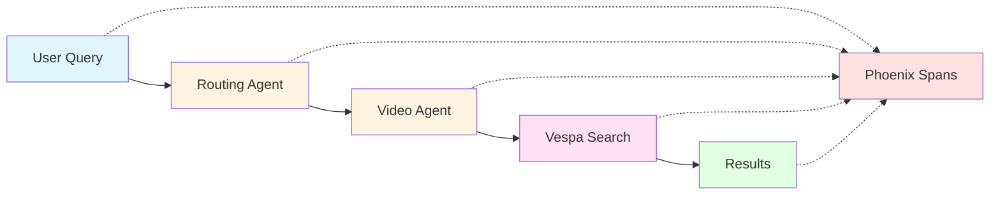

# Cogniverse Study Guide: System Integration Module

**Last Updated:** 2025-10-07
**Module Path:** `tests/system/`, `tests/agents/e2e/`
**Purpose:** End-to-end integration testing and system validation

---

## Module Overview

### Purpose
The System Integration module validates:
- **End-to-End Workflows**: Complete user query to result flows
- **Component Integration**: Multi-agent communication and coordination
- **Backend Integration**: Vespa, Phoenix, Mem0 connectivity
- **Real System Testing**: Production-like environment validation

### Test Categories
```
tests/system/
├── test_real_system_integration.py  # Vespa + Agent integration
└── test_comprehensive_agentic_system_test.py  # Full system E2E

tests/agents/e2e/
└── test_real_multi_agent_integration.py  # Multi-agent workflows
```

---

## Integration Test Patterns

### 1. Full System Integration

```python
class TestRealEndToEndIntegration:
    """End-to-end system validation"""

    def test_comprehensive_agentic_system_test(self):
        # 1. Setup: Initialize all components
        vespa_client = VespaSearchBackend(url, port, schema)
        routing_agent = RoutingAgent(config)
        video_agent = VideoSearchAgent(config)

        # 2. Query Processing
        user_query = "Show me cooking videos"

        # 3. Routing Decision
        routing_result = routing_agent.route_query(user_query)
        assert routing_result["modality"] == "video"

        # 4. Agent Execution
        search_result = video_agent.search(
            query=user_query,
            strategy=routing_result["strategy"]
        )

        # 5. Validation
        assert len(search_result["results"]) > 0
        assert search_result["status"] == "success"

        # 6. Telemetry Verification
        spans = get_phoenix_spans(user_query)
        assert len(spans) > 0
```

### 2. Multi-Agent Orchestration

```python
class TestMultiAgentOrchestration:
    """Multi-agent workflow validation"""

    def test_orchestrated_workflow(self):
        # 1. Orchestrator plans workflow
        orchestrator = MultiAgentOrchestrator()
        plan = orchestrator.plan_workflow(user_query)

        assert len(plan["tasks"]) > 0

        # 2. Execute task graph
        results = orchestrator.execute_plan(plan)

        # 3. Validate dependencies
        assert results["routing"]["completed"]
        assert results["search"]["completed"]
        assert results["summary"]["completed"]

        # 4. Check result fusion
        final_result = orchestrator.fuse_results(results)
        assert "video_results" in final_result
        assert "summary" in final_result
```

### 3. Backend Integration

```python
class TestVespaIntegration:
    """Vespa backend connectivity"""

    def test_vespa_connection_and_schema(self):
        # 1. Health check
        assert vespa_client.health_check()

        # 2. Schema validation
        schema_info = vespa_client.get_schema_info()
        assert schema_info["name"] == expected_schema

        # 3. Query execution
        results = vespa_client.query(yql="select * from video_frame limit 10")
        assert results.hits is not None

    def test_embedding_search(self):
        # 1. Generate query embedding
        embedding = embed_query("cooking tutorial")

        # 2. Execute vector search
        results = vespa_client.nearest_neighbor_search(
            embedding=embedding,
            limit=10
        )

        # 3. Validate results
        assert len(results) > 0
        for result in results:
            assert "video_id" in result
            assert "relevance" in result
```

### 4. Telemetry Integration

```python
class TestPhoenixIntegration:
    """Phoenix telemetry validation"""

    def test_span_recording(self):
        # 1. Execute operation with span
        with tracer.start_as_current_span("test_operation"):
            result = perform_operation()

        # 2. Verify span recorded
        spans = phoenix_client.get_spans(
            project_name="default",
            time_range="1h"
        )

        test_spans = [s for s in spans if s["name"] == "test_operation"]
        assert len(test_spans) > 0

        # 3. Validate span attributes
        span = test_spans[0]
        assert "duration_ms" in span
        assert span["status"] == "ok"
```

---

## Common Integration Scenarios

### Scenario 1: Video Search Workflow



**Test**:
```python
def test_video_search_integration():
    query = "pasta cooking tutorial"

    # Route
    route = routing_agent.route(query)
    assert route["modality"] == "video"

    # Search
    results = video_agent.search(query, strategy=route["strategy"])
    assert len(results) > 0

    # Verify
    assert all("video_id" in r for r in results)
    assert results[0]["relevance"] > 0.5
```

### Scenario 2: Multi-Modal Fusion

```
Query → Routing → [Video Agent, Text Agent] → Fusion → Result
```

**Test**:
```python
def test_multimodal_fusion():
    query = "How does photosynthesis work?"

    # Execute both modalities
    video_results = video_agent.search(query)
    text_results = text_agent.search(query)

    # Fuse results
    fused = orchestrator.fuse_results({
        "video": video_results,
        "text": text_results
    })

    # Validate fusion
    assert "video" in fused
    assert "text" in fused
    assert fused["confidence"] > 0.6
```

### Scenario 3: Memory-Enhanced Routing

```
Query → Memory Lookup → Context → Routing (Enhanced) → Agent
```

**Test**:
```python
def test_memory_enhanced_routing():
    # 1. Add memory
    memory_manager.add_memory(
        content="User prefers video tutorials",
        user_id="user123",
        agent_id="routing_agent"
    )

    # 2. Route with memory
    route = routing_agent.route(
        query="Show me how to cook",
        user_id="user123"
    )

    # 3. Verify memory influence
    assert route["modality"] == "video"
    assert route["memory_used"] is True
```

---

## Production Testing

### Load Testing

```python
import asyncio
from concurrent.futures import ThreadPoolExecutor

def test_concurrent_queries():
    queries = generate_test_queries(100)

    with ThreadPoolExecutor(max_workers=10) as executor:
        futures = [executor.submit(process_query, q) for q in queries]
        results = [f.result() for f in futures]

    # Validate
    success_rate = sum(1 for r in results if r["status"] == "success") / len(results)
    assert success_rate > 0.95

    # Check latencies
    latencies = [r["latency_ms"] for r in results]
    p95_latency = sorted(latencies)[int(len(latencies) * 0.95)]
    assert p95_latency < 1000  # < 1 second
```

### Failure Recovery

```python
def test_agent_failure_recovery():
    # 1. Simulate agent failure
    video_agent.simulate_failure()

    # 2. Execute query
    result = orchestrator.process_query("test query")

    # 3. Verify fallback
    assert result["status"] == "degraded"
    assert result["fallback_used"] is True
    assert "error" not in result
```

---

## Best Practices

1. **Isolation**: Each test should be independent
2. **Cleanup**: Always cleanup test data after tests
3. **Timeouts**: Set reasonable timeouts for integration tests
4. **Retries**: Implement retry logic for flaky tests
5. **Logging**: Enable detailed logging for debugging
6. **Metrics**: Collect performance metrics during tests

---

**Next**: [17_INSTRUMENTATION.md](./17_INSTRUMENTATION.md)
