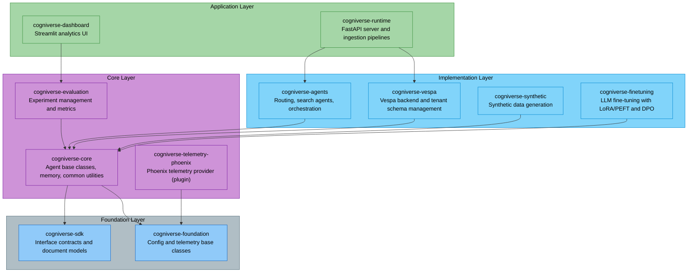
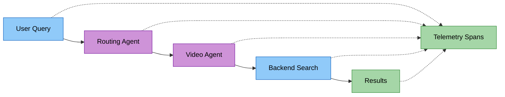
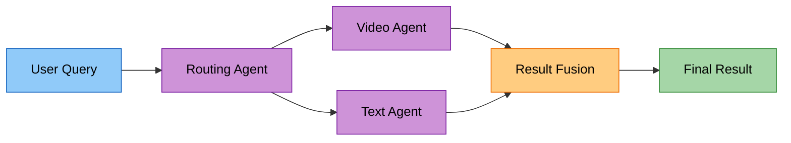
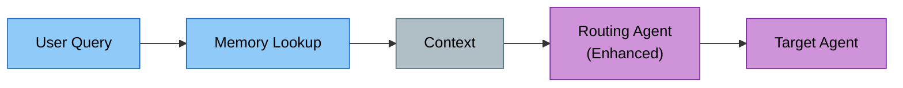

# Cogniverse Study Guide: System Integration Module

**Module Path:** `tests/system/`, `tests/agents/e2e/`

---

## Module Overview

### Purpose
The System Integration module validates Cogniverse's layered architecture:

- **End-to-End Workflows**: Complete user query to result flows across all layers

- **Component Integration**: Multi-agent communication and coordination

- **Backend Integration**: Vespa, Phoenix, Mem0 connectivity

- **Package Isolation**: Each package's integration with dependencies

- **Real System Testing**: Production-like environment validation

### Package Architecture Integration Testing



### Test Categories

**System Integration Tests:**
- `tests/system/test_real_system_integration.py` - Vespa + Agent integration and full E2E

**Agent End-to-End Tests:**
- `tests/agents/e2e/test_real_multi_agent_integration.py` - Multi-agent workflows

---

## Integration Test Patterns

### 1. Full System Integration

```python
class TestRealVespaIntegration:
    """End-to-end system validation"""

    async def test_comprehensive_agentic_system_test(self, vespa_test_manager):
        # 1. Setup: Initialize all components across packages
        from cogniverse_foundation.config.utils import create_default_config_manager
        from cogniverse_agents.routing_agent import RoutingAgent, RoutingDeps
        from cogniverse_agents.search_agent import SearchAgent, SearchAgentDeps
        from cogniverse_foundation.telemetry.config import TelemetryConfig

        config_manager = create_default_config_manager()

        # cogniverse-vespa package
        from cogniverse_vespa.vespa_search_client import VespaVideoSearchClient
        vespa_client = VespaVideoSearchClient(
            vespa_url="http://localhost",
            vespa_port=8080,
            tenant_id="test",
            config_manager=config_manager
        )

        # cogniverse-agents package - RoutingAgent requires RoutingDeps with all required fields
        routing_deps = RoutingDeps(
            tenant_id="test",
            telemetry_config=TelemetryConfig(),
            model_name="smollm3:3b",
            base_url="http://localhost:11434/v1"
        )
        routing_agent = RoutingAgent(deps=routing_deps)

        # SearchAgent requires SearchAgentDeps with backend connection details
        search_deps = SearchAgentDeps(
            tenant_id="test",
            backend_url="http://localhost",
            backend_port=8080,
            profile="video_colpali_smol500_mv_frame"
        )
        search_agent = SearchAgent(deps=search_deps)

        # 2. Query Processing
        user_query = "Show me cooking videos"

        # 3. Routing Decision
        routing_result = await routing_agent.route_query(user_query)
        assert routing_result.recommended_agent == "search_agent"
        assert routing_result.confidence > 0.7

        # 4. Agent Execution (SearchAgent uses search_by_text method)
        # Returns List[Dict[str, Any]] with search results
        search_results = search_agent.search_by_text(
            query=user_query,
            modality="video",
            top_k=10
        )

        # 5. Validation
        assert len(search_results) > 0
        # Results are list of dicts with id, score, plus metadata (video_id, etc.) at top level
        assert "id" in search_results[0]
        assert "score" in search_results[0]
        assert "video_id" in search_results[0]
```

### 2. Multi-Agent Orchestration

```python
# Example: Get composing agent (Google ADK LlmAgent with tools)
from cogniverse_agents.composing_agents_main import get_composing_agent
composing_agent = get_composing_agent()

# Example: Use MultiAgentOrchestrator for complex workflows
from cogniverse_agents.multi_agent_orchestrator import MultiAgentOrchestrator
from cogniverse_foundation.telemetry.config import TelemetryConfig

user_query = "Find videos about cooking and summarize them"

# MultiAgentOrchestrator requires both tenant_id and telemetry_config
orchestrator = MultiAgentOrchestrator(
    tenant_id="test",
    telemetry_config=TelemetryConfig()
)

# Execute complex workflow
result = await orchestrator.process_complex_query(
    query=user_query,
    context=None,
    user_id="test_user",
    preferences=None
)

# Validate execution
assert result["status"] == "completed"
assert "result" in result
assert result["execution_summary"]["completed_tasks"] > 0
```

### 3. Backend Integration

```python
# Example: Test Vespa connection via VespaVideoSearchClient
from cogniverse_vespa.vespa_search_client import VespaVideoSearchClient
from cogniverse_foundation.config.utils import create_default_config_manager

config_manager = create_default_config_manager()
vespa_client = VespaVideoSearchClient(
    vespa_url="http://localhost",
    vespa_port=8080,
    tenant_id="test",
    config_manager=config_manager
)

# Health check
assert vespa_client.health_check()

# Execute search query (query_params can be dict or string)
results = vespa_client.search(
    query_params={"query": "cooking tutorial", "ranking": "bm25_only", "top_k": 10}
)

# Validate results (list of dicts with relevance and video metadata at top level)
assert len(results) > 0
for result in results:
    assert "relevance" in result
    assert "video_id" in result
```

### 4. Telemetry Integration

```python
# Example: Phoenix telemetry validation
from cogniverse_foundation.telemetry.manager import get_telemetry_manager

telemetry_manager = get_telemetry_manager()

# Execute operation with span
with telemetry_manager.span("test_operation", tenant_id="test") as span:
    result = perform_operation()
    # Span is automatically recorded to Phoenix

# Telemetry data can be queried via Phoenix AsyncClient
# See Phoenix documentation for span query APIs
```

---

## Common Integration Scenarios

### Scenario 1: Video Search Workflow



**Example**:
```python
# Example: Video search integration
query = "pasta cooking tutorial"

# Route
route = await routing_agent.route_query(query)
assert route.recommended_agent == "search_agent"
assert route.confidence > 0.7

# Search (using SearchAgent - returns List[Dict[str, Any]])
results = search_agent.search_by_text(query, modality="video", top_k=10)
assert len(results) > 0

# Verify (results have id, score, plus metadata like video_id at top level)
assert all("id" in r for r in results)
assert all("score" in r for r in results)
assert results[0]["score"] > 0.0
```

### Scenario 2: Multi-Modal Fusion



**Example**:
```python
# Execute multimodal search using orchestrator
from cogniverse_agents.multi_agent_orchestrator import MultiAgentOrchestrator
from cogniverse_foundation.telemetry.config import TelemetryConfig

query = "How does photosynthesis work?"

orchestrator = MultiAgentOrchestrator(
    tenant_id="test",
    telemetry_config=TelemetryConfig()
)

result = await orchestrator.process_complex_query(
    query=query,
    context=None,
    user_id="test_user"
)

# Validate fusion occurred
assert result["status"] == "completed"
assert "result" in result
# Result contains fused outputs from multiple agents
```

### Scenario 3: Memory-Enhanced Routing



**Example**:
```python
# Example: Memory-enhanced routing
from cogniverse_core.memory.manager import Mem0MemoryManager

# 1. Add memory
memory_manager = Mem0MemoryManager(tenant_id="user123")
memory_manager.add_memory(
    content="User prefers video tutorials",
    tenant_id="user123",
    agent_name="routing_agent"
)

# 2. Route with memory (memory automatically loaded by MemoryAwareMixin)
route = await routing_agent.route_query(
    query="Show me how to cook",
    tenant_id="user123"
)

# 3. Verify routing decision
assert route.recommended_agent == "search_agent"
assert route.confidence > 0.7
```

---

## Production Testing

### Load Testing

```python
# Example: Concurrent query processing
import asyncio
import time

queries = generate_test_queries(100)

# Execute queries concurrently
async def process_single_query(query):
    start = time.time()
    result = await routing_agent.route_query(query)
    latency = (time.time() - start) * 1000
    return {"status": "success", "latency_ms": latency, "result": result}

tasks = [process_single_query(q) for q in queries]
results = await asyncio.gather(*tasks)

# Validate
success_rate = sum(1 for r in results if r["status"] == "success") / len(results)
assert success_rate > 0.95

# Check latencies
latencies = [r["latency_ms"] for r in results]
p95_latency = sorted(latencies)[int(len(latencies) * 0.95)]
assert p95_latency < 1000  # < 1 second
```

### Failure Recovery

```python
# Example: Orchestrator handles failures gracefully
from cogniverse_agents.multi_agent_orchestrator import MultiAgentOrchestrator
from cogniverse_foundation.telemetry.config import TelemetryConfig

orchestrator = MultiAgentOrchestrator(
    tenant_id="test",
    telemetry_config=TelemetryConfig()
)

# Execute query that may fail
result = await orchestrator.process_complex_query(
    query="test query",
    context=None
)

# Verify orchestrator handles failures gracefully
# Orchestrator has built-in error recovery and fallback
assert result["status"] in ["completed", "partial"]
# Even with failures, orchestrator provides best-effort results
```

---

## Best Practices

1. **Isolation**: Each test should be independent
2. **Cleanup**: Always cleanup test data after tests
3. **Timeouts**: Set reasonable timeouts for integration tests
4. **Retries**: Implement retry logic for flaky tests
5. **Logging**: Enable detailed logging for debugging
6. **Metrics**: Collect performance metrics during tests

---

## Package-Level Integration Tests

### Testing Foundation Layer
```python
# Example: Verify SDK interfaces are properly implemented
from cogniverse_sdk.interfaces.backend import Backend
from cogniverse_vespa.backend import VespaBackend

# Verify Vespa implements SDK interface
assert issubclass(VespaBackend, Backend)

# Example: Verify foundation config is usable by core
from cogniverse_foundation.config.utils import create_default_config_manager
from cogniverse_core.agents.base import AgentDeps, AgentInput, AgentOutput
from cogniverse_foundation.telemetry.config import TelemetryConfig

config_manager = create_default_config_manager()

# AgentDeps only requires tenant_id (base class for all agent dependencies)
# This is the base class - concrete agents use extended Deps classes
deps = AgentDeps(tenant_id="test")

# For actual agents, use concrete Deps classes that extend AgentDeps:
# RoutingDeps(AgentDeps) adds: telemetry_config, model_name, base_url, etc.
# SearchAgentDeps(AgentDeps) adds: backend_url, backend_port, profile, etc.
```

### Testing Core Layer
```python
# Example: Verify core works with evaluation package
from cogniverse_agents.routing_agent import RoutingAgent, RoutingDeps
from cogniverse_evaluation.core.experiment_tracker import ExperimentTracker
from cogniverse_foundation.telemetry.config import TelemetryConfig

routing_deps = RoutingDeps(
    tenant_id="test",
    telemetry_config=TelemetryConfig(),
    model_name="smollm3:3b",
    base_url="http://localhost:11434/v1"
)
agent = RoutingAgent(deps=routing_deps)

# Create experiment tracker for evaluation
# Note: ExperimentTracker has optional tenant_id (defaults to "default")
tracker = ExperimentTracker(
    experiment_project_name="test_exp",
    tenant_id="test"
)

# Execute routing query (tracked via telemetry) - route_query is async
result = await agent.route_query("test query")
assert result.recommended_agent is not None

# Example: Verify Phoenix telemetry plugin integration
from cogniverse_foundation.telemetry.registry import TelemetryRegistry
from cogniverse_telemetry_phoenix.provider import PhoenixProvider

# Verify plugin registration via entry points
registry = TelemetryRegistry()
provider = registry.get_telemetry_provider(name="phoenix", tenant_id="test")
assert isinstance(provider, PhoenixProvider)
```

### Testing Implementation Layer
```python
# Example: Verify agents work with Vespa backend
from cogniverse_agents.search_agent import SearchAgent, SearchAgentDeps
from cogniverse_vespa.vespa_schema_manager import VespaSchemaManager
from cogniverse_foundation.config.utils import create_default_config_manager

# Setup tenant schemas
config_manager = create_default_config_manager()
schema_mgr = VespaSchemaManager(backend_endpoint="http://localhost", backend_port=8080)
tenant_schema = schema_mgr.get_tenant_schema_name("test", "video_colpali_smol500_mv_frame")

# Initialize agent with Vespa backend
search_deps = SearchAgentDeps(
    tenant_id="test",
    backend_url="http://localhost",
    backend_port=8080,
    profile="video_colpali_smol500_mv_frame"
)
agent = SearchAgent(deps=search_deps)

results = agent.search_by_text("test query", modality="video")
assert len(results) >= 0

# Example: Verify agents work with synthetic data
from cogniverse_agents.routing_agent import RoutingAgent, RoutingDeps
from cogniverse_synthetic.generators.routing import RoutingGenerator
from cogniverse_foundation.telemetry.config import TelemetryConfig
from cogniverse_foundation.config.unified_config import OptimizerGenerationConfig

# RoutingGenerator requires OptimizerGenerationConfig as REQUIRED parameter
# Configuration is REQUIRED - no fallbacks or defaults
# Create minimal config for testing (production would load from config.yml)
optimizer_config = OptimizerGenerationConfig(
    optimizer_type="routing",
    dspy_modules={},  # Empty for basic generation
    profile_scoring_rules=[],
    agent_mappings=[],
    num_examples_target=10
)
# Pass optimizer_config to constructor - raises ValueError if None
generator = RoutingGenerator(optimizer_config=optimizer_config)

sampled_content = [
    {"video_id": "v1", "title": "Cooking tutorial", "description": "Learn to cook"},
    {"video_id": "v2", "title": "Science lecture", "description": "Physics explained"}
]
synthetic_data = await generator.generate(sampled_content=sampled_content, target_count=10)

# Test routing agent with synthetic queries
routing_deps = RoutingDeps(
    tenant_id="test",
    telemetry_config=TelemetryConfig(),
    model_name="smollm3:3b",
    base_url="http://localhost:11434/v1"
)
routing_agent = RoutingAgent(deps=routing_deps)
for example in synthetic_data:
    result = await routing_agent.route_query(example.query)
    assert result is not None
    assert result.recommended_agent is not None
```

### Testing Application Layer
```python
# Example: Verify runtime integrates all layers
from cogniverse_runtime.main import app
from fastapi.testclient import TestClient

client = TestClient(app)

# Test end-to-end search request
response = client.post(
    "/search/",
    json={"query": "cooking videos", "tenant_id": "test", "top_k": 10}
)

assert response.status_code == 200
assert "results" in response.json()

# Example: Verify dashboard utilities work with Phoenix data
from cogniverse_dashboard.utils.phoenix_data_manager import PhoenixDataManager
from cogniverse_evaluation.core.experiment_tracker import ExperimentTracker

# Create experiment tracker (tenant_id is optional, defaults to "default")
tracker = ExperimentTracker(
    experiment_project_name="dash_test",
    tenant_id="test"
)

# Verify Phoenix data manager can manage data directory
phoenix_manager = PhoenixDataManager(data_dir="./data/phoenix")
# Dashboard integration happens via Streamlit app, not direct API
```

---

**Next**: For detailed instrumentation and telemetry patterns, see [Phoenix Telemetry Integration](../modules/telemetry.md)
