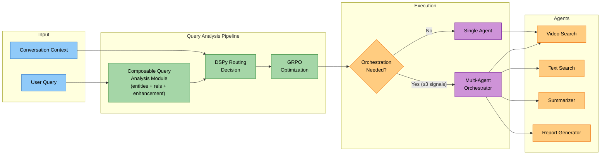
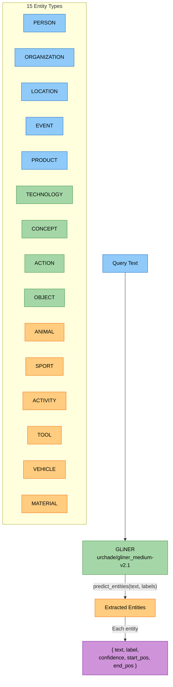
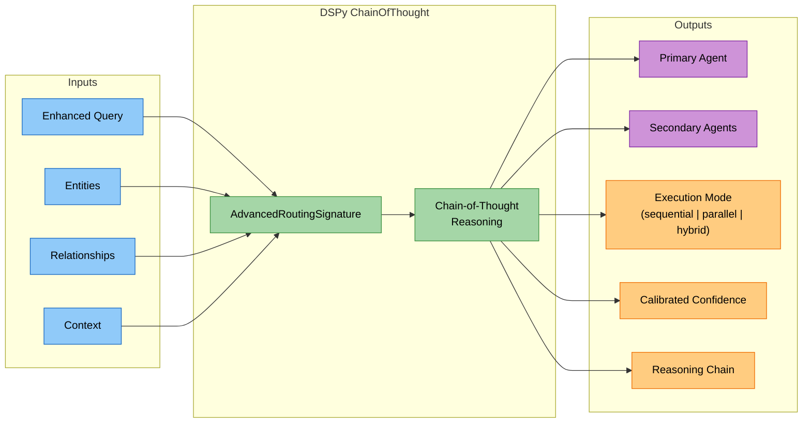
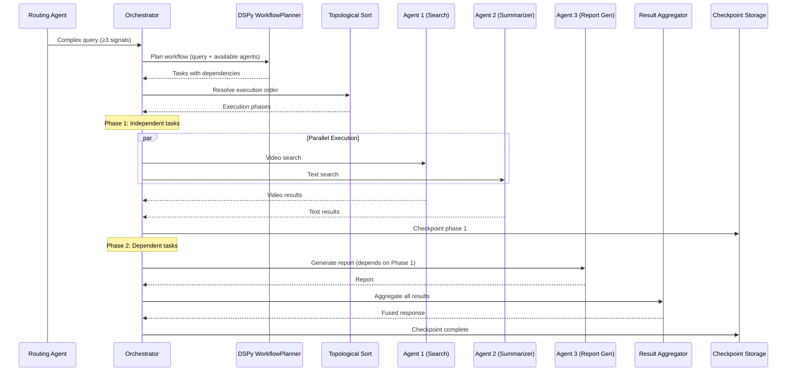
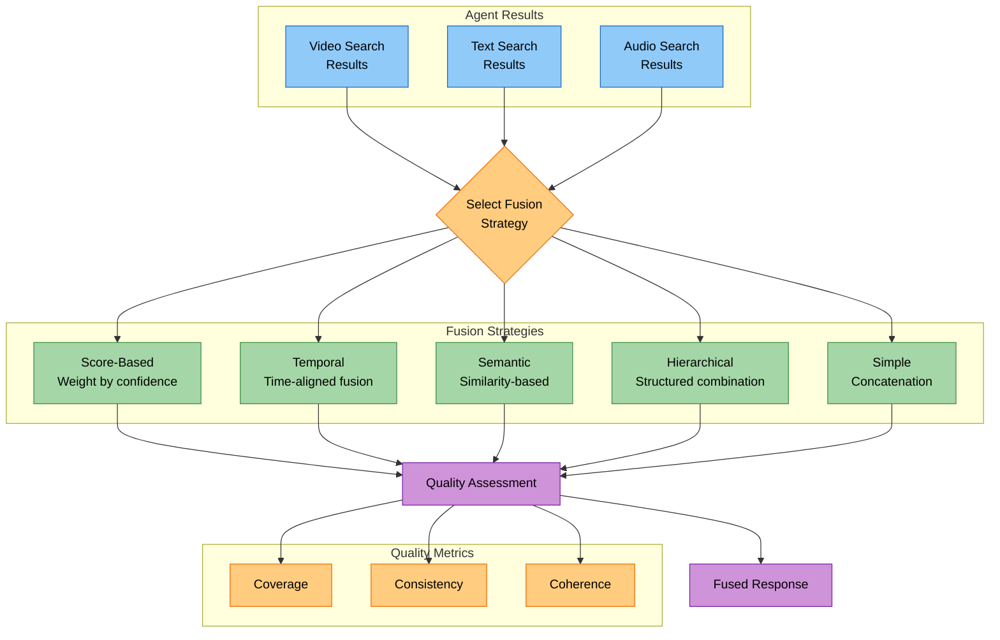

# Intelligent Query Routing for Multi-Modal Search

## Problem Statement

Naive keyword-based routing fails for multi-modal search systems. When a user asks _"Find videos of a golden retriever playing fetch at a park, then summarize the training techniques shown"_, a keyword router might match "videos" and send it to a video search agent — but it misses that this is actually a **two-phase request** requiring search _and_ summarization, involving entities (golden retriever, park), relationships (retriever → plays → fetch), and temporal sequencing ("find... then summarize").

The core challenges:

- **Intent ambiguity** — queries contain multiple implicit intents (search + analyze + summarize)
- **Entity blindness** — keyword matchers don't understand _what_ is being asked about
- **Relationship ignorance** — the connections between entities carry routing signal
- **Static confidence** — fixed thresholds can't adapt to shifting query distributions
- **Single-agent assumption** — complex queries need coordinated multi-agent execution

---

## Architecture Overview



---

## Query Analysis Pipeline

The routing pipeline processes each query through four phases, progressively enriching the query representation before making a routing decision.

### Phase 1: Entity Extraction via GLiNER

Zero-shot Named Entity Recognition using [GLiNER](https://github.com/urchade/GLiNER) — a generalist model that extracts entities without task-specific fine-tuning.



**Why GLiNER over spaCy NER?** GLiNER handles domain-specific entities (TECHNOLOGY, ACTIVITY, TOOL) without training data. Traditional NER models are limited to PERSON/ORG/GPE and miss the entity types most relevant to multi-modal content queries.

### Phase 2: Composable Query Analysis (Entity Extraction + Relationship Inference + Query Enhancement)

The `ComposableQueryAnalysisModule` (a `dspy.Module`) combines entity extraction, relationship inference, and LLM-powered query reformulation into a single composable step with two paths:

- **Path A (GLiNER fast path):** GLiNER extracts high-confidence entities (confidence >= `entity_confidence_threshold`, default 0.6) → heuristic relationship inference via proximity and type-pattern matching, enriched by SpaCy dependency parsing → LLM reformulates the query and generates search variants via `QueryReformulationSignature`
- **Path B (LLM unified path):** When GLiNER entities are absent, low-confidence, or the GLiNER model is unavailable, a single LLM call via `UnifiedExtractionReformulationSignature` performs entity extraction, relationship extraction, query reformulation, and variant generation together

Both paths produce identical output: `entities`, `relationships`, `enhanced_query`, `query_variants` (list of `{name, query}` dicts for multi-query fusion), `confidence`, `path_used`, and `domain_classification`.

The `QueryEnhancementPipeline` wraps the composable module and adds SIMBA (Similarity-Based Memory Augmentation) as a fast-path shortcut: if SIMBA finds successful enhancement patterns from similar past queries, it applies those patterns directly. Otherwise, it falls back to the composable module.

### Phase 3: DSPy Routing Decision

The enhanced query, entities, and relationships feed into a DSPy `ChainOfThought` module that produces a structured routing decision with confidence calibration.



The routing decision includes:
- **Search modality**: video_only, text_only, both, multimodal
- **Generation type**: raw_results, summary, detailed_report
- **Execution mode**: sequential, parallel, or hybrid
- **Confidence**: calibrated via learned thresholds (see AdaptiveThresholdSignature)

### Phase 4: GRPO Optimization

Group Relative Policy Optimization continuously improves routing decisions from outcome signals. The optimizer tracks routing experiences and periodically retrains.

**Reward computation:**

```python
# Base reward from weighted components
reward = (search_quality × 0.4) + (agent_success × 0.3)

# Add user satisfaction if available (otherwise normalize base)
if user_satisfaction is not None:
    reward += user_satisfaction × 0.3
else:
    reward = reward / (0.4 + 0.3)  # Normalize when satisfaction unavailable

# Apply processing time penalty (sigmoid curve)
time_penalty = 0.1 × (1.0 − 1.0 / (1.0 + processing_time / 10.0))
reward = max(0.0, reward − time_penalty)

# Final reward clamped to [0, 1]
reward = min(1.0, max(0.0, reward))
```

The optimizer adaptively selects its strategy based on available training data volume (see [Evaluation & Optimization Loop](./evaluation-optimization-loop.md) for details).

---

## DSPy Signatures & Modules

The routing system is built on 7 DSPy 3.0 signatures, each defining a typed contract between inputs and outputs. DSPy signatures are automatically optimizable — the framework learns prompts/demonstrations that maximize a metric.

| Signature | Purpose | Key Outputs |
|---|---|---|
| `BasicQueryAnalysis` | Fast-path intent + complexity classification | primary_intent, complexity_level, recommended_agent |
| `QueryReformulation` | Path A: Reformulate query using pre-extracted GLiNER entities and relationships | enhanced_query, query_variants, reasoning, confidence |
| `UnifiedExtractionReformulation` | Path B: Single LLM call for entity extraction + relationship inference + query reformulation + variant generation | entities, relationships, enhanced_query, query_variants, domain_classification, confidence |
| `AdvancedRouting` | Full routing with entity/relationship context | routing_decision, agent_workflow, overall_confidence |
| `MetaRouting` | Strategy selection: fast_path vs slow_path vs hybrid | recommended_strategy, threshold_adjustments |
| `AdaptiveThreshold` | Learn confidence thresholds from performance data | fast_path_threshold, slow_path_threshold, escalation_threshold |
| `MultiAgentOrchestration` | Workflow planning for complex multi-agent queries | execution_plan, agent_assignments, coordination_strategy |

**Design pattern:** Each signature uses `dspy.InputField` and `dspy.OutputField` with descriptive `desc` parameters. The descriptions serve as soft constraints — DSPy's optimizer uses them to generate better prompts. Pydantic `BaseModel` subclasses (`EntityInfo`, `RelationshipTuple`, `RoutingDecision`) enforce structured output typing.

A factory function selects the appropriate signature tier:
- `"basic"` → `BasicQueryAnalysisSignature` (fast path, simple queries)
- `"advanced"` → `AdvancedRoutingSignature` (full pipeline)
- `"meta"` → `MetaRoutingSignature` (routing the router)

---

## Multi-Agent Orchestration

When a query is too complex for a single agent, the orchestrator coordinates multiple agents through a dependency-aware execution plan.

### Orchestration Signal Detection

Seven signals are evaluated. If **≥ 3 signals** fire, orchestration is triggered:

| # | Signal | Detection Logic |
|---|---|---|
| 1 | Multiple action verbs | ≥ 2 of: find, search, analyze, summarize, compare, generate, create, extract, identify |
| 2 | Complex conjunctions | Presence of: and, then, also, plus, followed by, as well as |
| 3 | Query length | > 15 words |
| 4 | Entity density | > 5 extracted entities |
| 5 | Relationship complexity | > 3 extracted relationships |
| 6 | Sequential indicators | Presence of: first, then, after, finally, next, before, subsequently |
| 7 | Low routing confidence | Routing confidence < 0.6 |

### Workflow Planning & Execution



**Key architectural decisions:**

1. **Topological sort** — Tasks are sorted by dependency graph. Tasks with no dependencies execute in parallel; dependent tasks wait for their prerequisites.

2. **Phase-by-phase execution** — The topological sort produces execution phases. Within each phase, tasks run concurrently up to `max_parallel_tasks` (default: 3).

3. **Durable execution via checkpointing** — Each completed phase checkpoints its results. If a workflow fails mid-execution, it can resume from the last successful phase rather than restarting from scratch. Checkpoints store task status, results, and timestamps.

4. **A2A protocol** — Agents communicate via the Agent-to-Agent protocol, enabling heterogeneous agent types (search, generation, analysis) to exchange structured messages.

---

## Cross-Modal Fusion

When multiple agents return results across different modalities (video, text, audio), a fusion step combines them into a coherent response.



### Fusion Strategies

| Strategy | When Used | How It Works |
|---|---|---|
| **Score-Based** | Default for mixed-modality queries | Weights each result by its confidence score; higher-confidence results dominate |
| **Temporal** | Time-sensitive queries ("last week", "recent") | Aligns results along a timeline; temporal proximity to query timeframe increases weight |
| **Semantic** | Conceptual queries ("explain how X works") | Groups results by semantic similarity; de-duplicates overlapping content |
| **Hierarchical** | Structured queries ("compare A vs B") | Builds a structured response with sections per modality |
| **Simple** | Fallback / single-modality | Basic concatenation of results |

Strategy selection is automatic based on query characteristics detected during the analysis pipeline.

### Cross-Modal Optimization

A learned `FusionBenefitModel` predicts whether multi-modal fusion will improve results for a given query. The model considers:

- **Primary/secondary modality confidences** — how certain the system is about each modality
- **Modality agreement** — whether modalities suggest the same thing
- **Query ambiguity score** — ambiguous queries benefit more from fusion
- **Historical fusion success rate** — per-modality-pair success rates tracked with exponential moving average (α = 0.1)

If predicted benefit ≥ 0.5, fusion is recommended. The model trains on recorded fusion outcomes and can discover patterns from Phoenix telemetry spans.

---

## Context-Aware Routing

The `ContextualAnalyzer` maintains session state across queries to provide routing hints.

### Conversation History Tracking
- Maintains a sliding window of the last 50 queries (configurable `max_history_size`)
- Each entry records: query text, detected modalities, timestamp, result count, user feedback
- Context window of 30 minutes determines "recent" context

### Modality Preference Learning
- Tracks modality frequency across the session
- Requires minimum 3 occurrences before establishing a preference
- Produces per-modality confidence: `count / total_queries`

### Topic Tracking with Temporal Decay
- Extracts topic keywords from each query (words > 3 characters)
- Maintains a 7-day sliding window per topic
- Older mentions are pruned, so topic relevance naturally decays over time
- Related topics surface as routing hints for the current query

### Temporal Pattern Recognition
- Tracks hourly query distribution across the session
- Identifies usage patterns that can inform result freshness preferences

---

## Key Techniques Summary

| Technique | Category | Role in System |
|---|---|---|
| **GLiNER** | Zero-shot NER | Entity extraction across 15 custom types without training data |
| **DSPy 3.0 Signatures** | Prompt optimization | 7 typed signatures that are automatically optimizable |
| **ChainOfThought** | Reasoning | Step-by-step reasoning for routing decisions |
| **GRPO** | Reinforcement learning | Continuous routing improvement from outcome signals |
| **Topological Sort** | Graph algorithms | Dependency-aware task scheduling for multi-agent workflows |
| **A2A Protocol** | Agent communication | Structured inter-agent messaging |
| **Durable Execution** | Reliability | Phase-level checkpointing for workflow resumability |
| **Cross-Modal Fusion** | Information fusion | 5 strategies for combining multi-modal search results |
| **FusionBenefitModel** | Learned optimization | Predicts when fusion improves results |
| **Exponential Moving Average** | Online learning | Tracks fusion success rates with smooth updates |
| **Adaptive Thresholds** | Self-tuning | Confidence thresholds that learn from performance data |
| **Context-Aware Routing** | Session intelligence | Modality preference learning + topic tracking with temporal decay |
