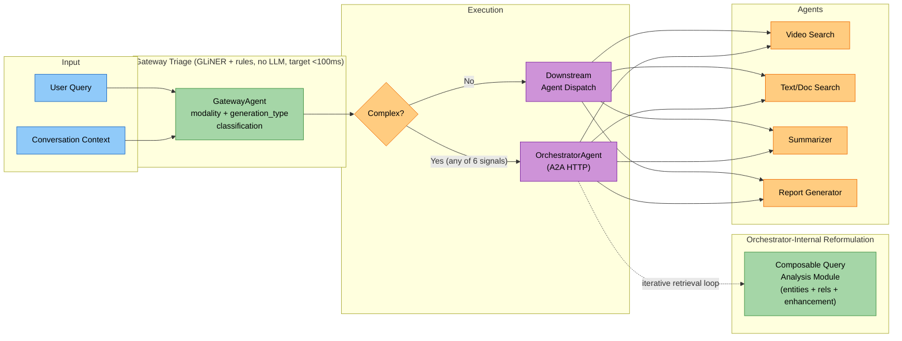
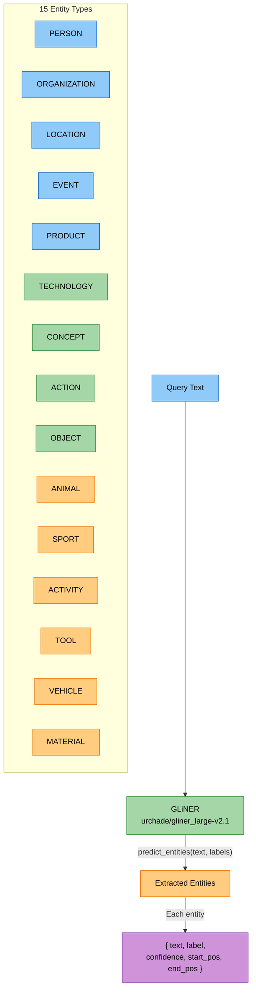
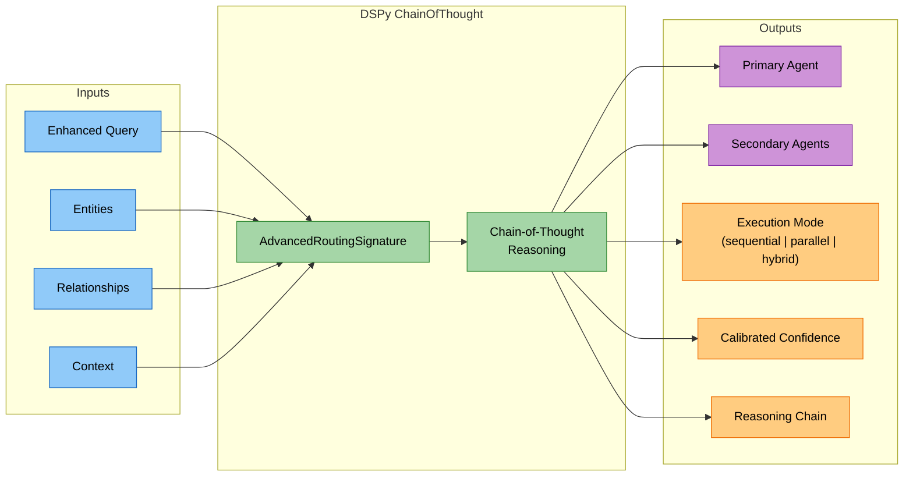
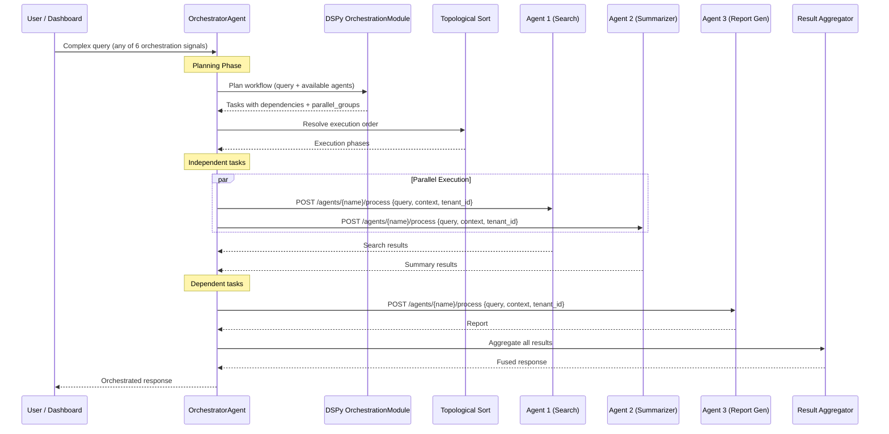
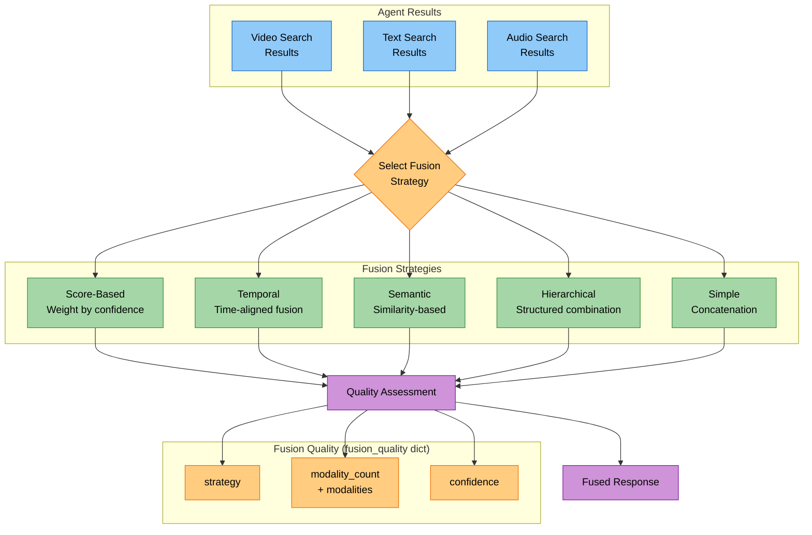

# Intelligent Query Routing for Multi-Modal Search

## Problem Statement

Naive keyword-based routing fails for multi-modal search systems. When a user asks _"Find videos of a golden retriever playing fetch at a park, then summarize the training techniques shown"_, a keyword router might match "videos" and send it to a video search agent — but it misses that this is actually a **two-phase request** requiring search _and_ summarization, involving entities (golden retriever, park), relationships (retriever → plays → fetch), and temporal sequencing ("find... then summarize").

The core challenges:

- **Intent ambiguity** — queries contain multiple implicit intents (search + analyze + summarize)
- **Entity blindness** — keyword matchers don't understand _what_ is being asked about
- **Relationship ignorance** — the connections between entities carry routing signal
- **Static confidence** — fixed thresholds can't adapt to shifting query distributions
- **Single-agent assumption** — complex queries need coordinated multi-agent execution

---

## Architecture Overview

The initial simple/complex decision is made by `GatewayAgent` using GLiNER entity classification plus deterministic keyword rules — **not** a DSPy `ChainOfThought` call. The `ComposableQueryAnalysisModule` (entity + relationship extraction + LLM reformulation) is a separate library component consumed later, inside `OrchestratorAgent`'s iterative retrieval loop, when a query has already been routed to orchestration.

```mermaid
graph LR
    subgraph Input
        Q["<span style='color:#000'>User Query</span>"]
        CTX["<span style='color:#000'>Conversation Context</span>"]
    end

    subgraph "Gateway Triage (GLiNER + rules, no LLM, target &lt;100ms)"
        GW["<span style='color:#000'>GatewayAgent<br/>modality + generation_type<br/>classification</span>"]
    end

    subgraph "Execution"
        OD{"<span style='color:#000'>Complex?</span>"}
        DDA["<span style='color:#000'>Downstream<br/>Agent Dispatch</span>"]
        MAO["<span style='color:#000'>OrchestratorAgent<br/>(A2A HTTP)</span>"]
    end

    subgraph "Orchestrator-Internal Reformulation"
        CQA["<span style='color:#000'>Composable Query<br/>Analysis Module<br/>(entities + rels + enhancement)</span>"]
    end

    subgraph "Agents"
        VS["<span style='color:#000'>Video Search</span>"]
        TS["<span style='color:#000'>Text/Doc Search</span>"]
        SUM["<span style='color:#000'>Summarizer</span>"]
        RPT["<span style='color:#000'>Report Generator</span>"]
    end

    Q --> GW
    CTX --> GW
    GW --> OD
    OD -- "No" --> DDA --> VS & TS & SUM & RPT
    OD -- "Yes (any of 6 signals)" --> MAO
    MAO -.->|"iterative retrieval loop"| CQA
    MAO --> VS & TS & SUM & RPT

    style Q fill:#90caf9,stroke:#1565c0,color:#000
    style CTX fill:#90caf9,stroke:#1565c0,color:#000
    style GW fill:#a5d6a7,stroke:#388e3c,color:#000
    style CQA fill:#a5d6a7,stroke:#388e3c,color:#000
    style OD fill:#ffcc80,stroke:#ef6c00,color:#000
    style DDA fill:#ce93d8,stroke:#7b1fa2,color:#000
    style MAO fill:#ce93d8,stroke:#7b1fa2,color:#000
    style VS fill:#ffcc80,stroke:#ef6c00,color:#000
    style TS fill:#ffcc80,stroke:#ef6c00,color:#000
    style SUM fill:#ffcc80,stroke:#ef6c00,color:#000
    style RPT fill:#ffcc80,stroke:#ef6c00,color:#000
```

---

## Query Analysis Pipeline

GLiNER is used twice in this system, for two different purposes with two different label sets — this section covers the general-purpose 15-type extractor; see [Complexity Classification](#complexity-classification) for `GatewayAgent`'s separate, purpose-tuned 7-label triage classifier.

### Entity Extraction via GLiNER

Zero-shot Named Entity Recognition using [GLiNER](https://github.com/urchade/GLiNER) — a generalist model that extracts entities without task-specific fine-tuning. This is `GLiNERRelationshipExtractor` (`libs/agents/cogniverse_agents/routing/relationship_extraction_tools.py`), the extractor Path A of `ComposableQueryAnalysisModule` uses.

```mermaid
flowchart TD
    Q["<span style='color:#000'>Query Text</span>"] --> GLiNER["<span style='color:#000'>GLiNER<br/>urchade/gliner_large-v2.1</span>"]
    GLiNER --> |"predict_entities(text, labels)"| E["<span style='color:#000'>Extracted Entities</span>"]

    subgraph "15 Entity Types"
        direction LR
        L1["<span style='color:#000'>PERSON</span>"]
        L2["<span style='color:#000'>ORGANIZATION</span>"]
        L3["<span style='color:#000'>LOCATION</span>"]
        L4["<span style='color:#000'>EVENT</span>"]
        L5["<span style='color:#000'>PRODUCT</span>"]
        L6["<span style='color:#000'>TECHNOLOGY</span>"]
        L7["<span style='color:#000'>CONCEPT</span>"]
        L8["<span style='color:#000'>ACTION</span>"]
        L9["<span style='color:#000'>OBJECT</span>"]
        L10["<span style='color:#000'>ANIMAL</span>"]
        L11["<span style='color:#000'>SPORT</span>"]
        L12["<span style='color:#000'>ACTIVITY</span>"]
        L13["<span style='color:#000'>TOOL</span>"]
        L14["<span style='color:#000'>VEHICLE</span>"]
        L15["<span style='color:#000'>MATERIAL</span>"]
    end

    E --> |"Each entity"| OUT["<span style='color:#000'>{ text, label,<br/>confidence, start_pos, end_pos }</span>"]

    style Q fill:#90caf9,stroke:#1565c0,color:#000
    style GLiNER fill:#a5d6a7,stroke:#388e3c,color:#000
    style E fill:#ffcc80,stroke:#ef6c00,color:#000
    style OUT fill:#ce93d8,stroke:#7b1fa2,color:#000
    style L1 fill:#90caf9,stroke:#1565c0,color:#000
    style L2 fill:#90caf9,stroke:#1565c0,color:#000
    style L3 fill:#90caf9,stroke:#1565c0,color:#000
    style L4 fill:#90caf9,stroke:#1565c0,color:#000
    style L5 fill:#90caf9,stroke:#1565c0,color:#000
    style L6 fill:#a5d6a7,stroke:#388e3c,color:#000
    style L7 fill:#a5d6a7,stroke:#388e3c,color:#000
    style L8 fill:#a5d6a7,stroke:#388e3c,color:#000
    style L9 fill:#a5d6a7,stroke:#388e3c,color:#000
    style L10 fill:#ffcc80,stroke:#ef6c00,color:#000
    style L11 fill:#ffcc80,stroke:#ef6c00,color:#000
    style L12 fill:#ffcc80,stroke:#ef6c00,color:#000
    style L13 fill:#ffcc80,stroke:#ef6c00,color:#000
    style L14 fill:#ffcc80,stroke:#ef6c00,color:#000
    style L15 fill:#ffcc80,stroke:#ef6c00,color:#000
```

**Why GLiNER over spaCy NER?** GLiNER handles domain-specific entities (TECHNOLOGY, ACTIVITY, TOOL) without training data. Traditional NER models are limited to PERSON/ORG/GPE and miss the entity types most relevant to multi-modal content queries.

### Composable Query Analysis (Entity Extraction + Relationship Inference + Query Enhancement)

The `ComposableQueryAnalysisModule` (a `dspy.Module`) combines entity extraction, relationship inference, and LLM-powered query reformulation into a single composable step with two paths:

- **Path A (GLiNER fast path):** GLiNER extracts high-confidence entities (confidence >= `entity_confidence_threshold`, default 0.6) → heuristic relationship inference via proximity and type-pattern matching, enriched by SpaCy dependency parsing → LLM reformulates the query and generates search variants via `QueryReformulationSignature`
- **Path B (LLM unified path):** When GLiNER entities are absent, low-confidence, or the GLiNER model is unavailable, a single LLM call via `UnifiedExtractionReformulationSignature` performs entity extraction, relationship extraction, query reformulation, and variant generation together

Both paths produce identical output: `entities`, `relationships`, `enhanced_query`, `query_variants` (list of `{name, query}` dicts for multi-query fusion), `confidence`, `path_used`, and `domain_classification`.

`OrchestratorAgent` lazily builds and caches one `ComposableQueryAnalysisModule` instance per agent (`_get_query_analysis_module`) and calls it from `_reformulate_query`, which runs inside the iterative retrieval loop for queries that have already been routed to orchestration — it is not part of the initial gateway routing decision. The `QueryEnhancementAgent` (A2A agent at `cogniverse_agents/query_enhancement_agent.py`) is a separate preprocessing agent with its own `QueryEnhancementModule` (a `dspy.ChainOfThought`); it does not wrap `ComposableQueryAnalysisModule`. `OrchestratorAgent`'s DSPy planner can include `query_enhancement_agent` (and `entity_extraction_agent`, `profile_selection_agent`) as preprocessing steps ahead of an execution agent in a workflow (see [Agent Registry](#agent-registry)).

A separate Argo batch job (`run_simba_optimization`, named after SIMBA — Stochastic Introspective Mini-Batch Ascent — but actually compiling via `BootstrapFewShot`) periodically re-optimizes `QueryEnhancementAgent`'s own `QueryEnhancementModule` from recorded `cogniverse.query_enhancement` spans; it does not touch `ComposableQueryAnalysisModule`. See [Routing Optimization (Offline)](#routing-optimization-offline) for the full set of offline jobs.

### DSPy Routing Decision

`DSPyAdvancedRoutingModule` (`libs/agents/cogniverse_agents/routing/dspy_relationship_router.py`) wraps a `ComposableQueryAnalysisModule` plus a `dspy.ChainOfThought(AdvancedRoutingSignature)` to turn an enhanced query, entities, and relationships into a structured routing decision with confidence calibration. This module — along with `MetaRoutingSignature` and `AdaptiveThresholdSignature` — is part of the routing library and is exercised by its unit tests and by the offline DSPy-optimizer compilation flow described below; it is **not** currently called from `GatewayAgent`, `AgentDispatcher`, or `OrchestratorAgent`'s live request path, which instead use the GLiNER + deterministic-rule gateway described above. It is documented here as the routing library's most capable signature and the target of future/optimizer-driven routing work.

```mermaid
flowchart LR
    subgraph Inputs
        EQ["<span style='color:#000'>Enhanced Query</span>"]
        ENT["<span style='color:#000'>Entities</span>"]
        REL["<span style='color:#000'>Relationships</span>"]
        CTX["<span style='color:#000'>Context</span>"]
    end

    subgraph "DSPy ChainOfThought"
        SIG["<span style='color:#000'>AdvancedRoutingSignature</span>"]
        COT["<span style='color:#000'>Chain-of-Thought<br/>Reasoning</span>"]
    end

    subgraph Outputs
        AGT["<span style='color:#000'>Primary Agent</span>"]
        SEC["<span style='color:#000'>Secondary Agents</span>"]
        MODE["<span style='color:#000'>Execution Mode<br/>(sequential | parallel | hybrid)</span>"]
        CONF["<span style='color:#000'>Calibrated Confidence</span>"]
        RSN["<span style='color:#000'>Reasoning Chain</span>"]
    end

    EQ & ENT & REL & CTX --> SIG --> COT --> AGT & SEC & MODE & CONF & RSN

    style EQ fill:#90caf9,stroke:#1565c0,color:#000
    style ENT fill:#90caf9,stroke:#1565c0,color:#000
    style REL fill:#90caf9,stroke:#1565c0,color:#000
    style CTX fill:#90caf9,stroke:#1565c0,color:#000
    style SIG fill:#a5d6a7,stroke:#388e3c,color:#000
    style COT fill:#a5d6a7,stroke:#388e3c,color:#000
    style AGT fill:#ce93d8,stroke:#7b1fa2,color:#000
    style SEC fill:#ce93d8,stroke:#7b1fa2,color:#000
    style MODE fill:#ffcc80,stroke:#ef6c00,color:#000
    style CONF fill:#ffcc80,stroke:#ef6c00,color:#000
    style RSN fill:#ffcc80,stroke:#ef6c00,color:#000
```

The routing decision includes:
- **Search modality**: video_only, text_only, both, multimodal
- **Generation type**: raw_results, summary, detailed_report
- **Execution mode**: sequential, parallel, or hybrid
- **Confidence**: calibrated via learned thresholds (see AdaptiveThresholdSignature)

### Routing Optimization (Offline)

Routing and orchestration quality is improved offline, not inline with the per-query flow above. The batch jobs in `libs/runtime/cogniverse_runtime/optimization_cli.py` each read one span type and compile or recompute one target:

| Job | Reads Spans | Compiles / Computes |
|---|---|---|
| `run_simba_optimization` | `cogniverse.query_enhancement` | `QueryEnhancementAgent`'s own `QueryEnhancementModule` via `dspy.teleprompt.BootstrapFewShot` (despite the function's name, it does not call `dspy.SIMBA`) |
| `run_profile_optimization` | `cogniverse.profile_selection` | `ProfileSelectionAgent`'s DSPy module via `BootstrapFewShot` |
| `run_entity_extraction_optimization` | `cogniverse.entity_extraction` | `EntityExtractionAgent`'s DSPy module via `BootstrapFewShot` |
| `run_gateway_thresholds_optimization` | `cogniverse.gateway` | `GatewayAgent.fast_path_confidence_threshold`, recalibrated deterministically from classification accuracy (`_compute_gateway_thresholds`) — not a DSPy signature compile |
| `run_workflow_optimization` | `cogniverse.orchestration` | Workflow templates + agent performance profiles, via `OrchestrationEvaluator` extracting `WorkflowExecution` records and feeding `WorkflowIntelligence` — deterministic template mining, not DSPy prompt compilation |

None of these jobs compile `ComposableQueryAnalysisModule`, `dspy_relationship_router.py`'s modules, or `AdaptiveThresholdSignature`. `BootstrapFewShot` is the only DSPy teleprompter actually instantiated anywhere in the codebase — `dspy.SIMBA`, `dspy.GEPA`, and `dspy.MIPROv2` appear only in docstrings and dashboard UI copy (e.g. the optimization tab's "Auto DSPy Optimizer Selection: GEPA/Bootstrap/SIMBA/MIPRO" description), not as instantiated optimizers. GRPO (Group Relative Policy Optimization) is likewise referenced in the dashboard's optimization tab as a candidate future technique, not an implemented optimizer.

See [Evaluation & Optimization Loop](./evaluation-optimization-loop.md) for the golden-set-driven prompt optimization pipeline that separately re-optimizes search/summarizer/report-generation agents via quality-monitor triggers.

---

## DSPy Signatures & Modules

The routing library (`libs/agents/cogniverse_agents/routing/dspy_routing_signatures.py`) defines 7 DSPy 3.0 signatures, each a typed contract between inputs and outputs. DSPy signatures are automatically optimizable — the framework learns prompts/demonstrations that maximize a metric. `QueryReformulation` and `UnifiedExtractionReformulation` back the two paths of the live `ComposableQueryAnalysisModule` used by `OrchestratorAgent`'s reformulation loop; `BasicQueryAnalysis`, `AdvancedRouting`, `MetaRouting`, `AdaptiveThreshold`, and `MultiAgentOrchestration` back `DSPyBasicRoutingModule` / `DSPyAdvancedRoutingModule`, which are exercised by the routing library's own unit tests but are not currently invoked from the live gateway/dispatch/orchestration request path (see [DSPy Routing Decision](#dspy-routing-decision)).

| Signature | Purpose | Key Outputs |
|---|---|---|
| `BasicQueryAnalysis` | Fast-path intent + complexity classification | primary_intent, complexity_level, recommended_agent |
| `QueryReformulation` | Path A: Reformulate query using pre-extracted GLiNER entities and relationships | enhanced_query, query_variants, reasoning, confidence |
| `UnifiedExtractionReformulation` | Path B: Single LLM call for entity extraction + relationship inference + query reformulation + variant generation | entities, relationships, enhanced_query, query_variants, domain_classification, confidence |
| `AdvancedRouting` | Full routing with entity/relationship context | routing_decision, agent_workflow, overall_confidence |
| `MetaRouting` | Strategy selection: fast_path vs slow_path vs hybrid | recommended_strategy, threshold_adjustments |
| `AdaptiveThreshold` | Learn confidence thresholds from performance data | fast_path_threshold, slow_path_threshold, escalation_threshold |
| `MultiAgentOrchestration` | Workflow planning for complex multi-agent queries | execution_plan, agent_assignments, coordination_strategy |

**Design pattern:** Each signature uses `dspy.InputField` and `dspy.OutputField` with descriptive `desc` parameters. The descriptions serve as soft constraints — DSPy's optimizer uses them to generate better prompts. Pydantic `BaseModel` subclasses (`EntityInfo`, `RelationshipTuple`, `RoutingDecision`) enforce structured output typing.

A factory function selects the appropriate signature tier:
- `"basic"` → `BasicQueryAnalysisSignature` (fast path, simple queries)
- `"advanced"` → `AdvancedRoutingSignature` (full pipeline)
- `"meta"` → `MetaRoutingSignature` (routing the router)

---

## Multi-Agent Orchestration

Query complexity is determined at the entry point by `GatewayAgent`, which classifies queries as "simple" or "complex" using GLiNER entity classification (no LLM call, <100ms). `GatewayAgent` runs its own GLiNER call against a small, experimentally tuned 7-label set — `video_content`, `text_information`, `audio_content`, `image_content`, `document_content`, `summary_request`, `detailed_report_request` (`MODALITY_LABELS` + `GENERATION_LABELS` in `gateway_agent.py`) — chosen because it produces measurably higher GLiNER confidence scores than the general-purpose 15-type label set used elsewhere in the routing pipeline (average top score 0.56 vs. 0.41). A deterministic keyword fallback (`MODALITY_KEYWORDS`) covers queries GLiNER misses.

### Dispatch Execution Paths

`AgentDispatcher.dispatch()` routes queries through `_execute_gateway_task` for any agent with `gateway`, `routing`, or `intelligent_routing` capabilities:

#### Simple Path (Single Agent)

When `GatewayAgent` classifies a query as `complexity="simple"`:

1. `GatewayAgent._process_impl()` returns a `GatewayOutput` with the target agent name, modality, and generation type
2. `_execute_downstream_agent` looks up the target agent in the registry and dispatches based on its capabilities:
   - `search`/`video_search`/`retrieval` → `_execute_search_task` (with `conversation_history` for query rewrite)
   - `image_search`/`visual_analysis` → `_execute_image_search_task`
   - `audio_analysis`/`transcription` → `_execute_audio_search_task`
   - `document_analysis`/`pdf_processing` → `_execute_document_search_task`
   - `detailed_report` → `_execute_detailed_report_task`
   - `summarization`/`text_generation` → `_execute_summarization_task`
   - `text_analysis`/`sentiment`/`classification` → `_execute_text_analysis_task`
   - `coding` → `_execute_coding_task` (not reachable via `SIMPLE_ROUTE_MAP` today since GatewayAgent has no "code" modality, but handled if a target agent is registered with this capability)
3. The response includes gateway metadata (`complexity`, `modality`, `routed_to`, `confidence`) and the `downstream_result` from the executed agent

#### Complex Path (Multi-Agent Orchestration)

When `GatewayAgent` classifies a query as `complexity="complex"`:

1. `GatewayAgent._process_impl()` returns `complexity="complex"` (triggered by any one of the six signals below, via `_is_complex`)
2. `_execute_orchestration_task` instantiates `OrchestratorAgent` with the `AgentRegistry` and `ConfigManager`
3. `OrchestratorAgent._process_impl()` plans a workflow using DSPy, executes agents via A2A HTTP, and aggregates results
4. A `cogniverse.orchestration` telemetry span is emitted with attributes consumed by the dashboard's Orchestration tab

### Complexity Classification

`GatewayAgent._is_complex()` classifies a query as complex when **any** (not a count threshold — a single match is enough) of these conditions hold:

| # | Signal | Detection Logic |
|---|---|---|
| 1 | No modality signal | Classification confidence below `fast_path_confidence_threshold` (default: 0.4) — neither GLiNER nor the keyword fallback could classify the query |
| 2 | Multiple modalities | GatewayAgent classified the query as modality `"both"` |
| 3 | Detailed report requested | `generation_type == "detailed_report"` (always needs search → analyze → write) |
| 4 | Analysis/synthesis verb | Query contains a word from `_COMPLEXITY_KEYWORDS` (e.g. `analyze`, `compare`, `summarize`, `evaluate`, `correlate`, `combine`, `merge`) |
| 5 | Multi-step marker | Query contains a phrase from `_MULTI_STEP_MARKERS` (e.g. `then`, `after that`, `followed by`, `first`, `finally`, `next`) |
| 6 | Compound query | Query has 3+ commas or 2+ occurrences of `" and "` |

### Workflow Planning & Execution

```mermaid
sequenceDiagram
    participant U as User / Dashboard
    participant O as OrchestratorAgent
    participant WP as DSPy OrchestrationModule
    participant TS as Topological Sort
    participant A1 as Agent 1 (Search)
    participant A2 as Agent 2 (Summarizer)
    participant A3 as Agent 3 (Report Gen)
    participant AGG as Result Aggregator

    U->>O: Complex query (any of 6 orchestration signals)

    Note over O: Planning Phase
    O->>WP: Plan workflow (query + available agents)
    WP-->>O: Tasks with dependencies + parallel_groups

    O->>TS: Resolve execution order
    TS-->>O: Execution phases

    Note over O: Independent tasks
    par Parallel Execution
        O->>A1: POST /agents/{name}/process {query, context, tenant_id}
        O->>A2: POST /agents/{name}/process {query, context, tenant_id}
    end
    A1-->>O: Search results
    A2-->>O: Summary results

    Note over O: Dependent tasks
    O->>A3: POST /agents/{name}/process {query, context, tenant_id}
    A3-->>O: Report

    O->>AGG: Aggregate all results
    AGG-->>O: Fused response
    O-->>U: Orchestrated response
```

**Key architectural decisions:**

1. **Topological sort** — Tasks are sorted by dependency graph. Tasks with no dependencies execute in parallel; dependent tasks wait for their prerequisites.

2. **Phase-by-phase execution** — The topological sort produces execution phases. Within each phase, tasks run concurrently up to the orchestration semaphore limit (`_ORCH_CONCURRENCY`, default: 4).

3. **Durable execution via checkpointing** — Each completed phase checkpoints its results. If a workflow fails mid-execution, it can resume from the last successful phase rather than restarting from scratch. Checkpoints store task status, results, and timestamps.

4. **Direct HTTP execution** — `OrchestratorAgent` calls agents via `httpx.AsyncClient` to `POST /agents/{name}/process`, enabling heterogeneous agent types (search, generation, analysis) to exchange structured messages.

---

## Agent Registry

`libs/agents/cogniverse_agents/` implements 23 agents, declared in `configs/config.json` under `agents.*` (url, capabilities, modalities, `enabled`). Ports below are the `configs/config.json` URLs actually used at runtime; several in-process helper agents share port 8000 because they run in-runtime rather than as independently deployed services.

### Search & Analysis Agents

| Agent | Port | Enabled | Role |
|---|---|---|---|
| `search_agent` | 8002 | yes | Multi-modal retrieval across video/image/text/audio/document via Vespa; DSPy query-rewrite on the plain-text path, RRF ensemble fusion across profiles or query variants |
| `image_search_agent` | 8006 | yes | ColPali multi-vector image similarity search (semantic and hybrid BM25+ColPali modes) plus image-to-image lookup |
| `text_analysis_agent` | 8003 | yes | Runtime-configurable DSPy text analysis (sentiment/summary/entities) with per-tenant persisted config and a `/analyze` endpoint |
| `audio_analysis_agent` | 8007 | yes | Whisper transcription + Vespa audio search: transcript (BM25), acoustic (CLAP nearest-neighbor), or hybrid |
| `document_agent` | 8008 | yes | Dual-strategy document search — ColPali visual (page-as-image), ColBERT/BM25 text, or hybrid — with keyword-based auto strategy selection |

### Generation & Routing Agents

| Agent | Port | Enabled | Role |
|---|---|---|---|
| `gateway_agent` | 8000 | yes | LLM-free entry point; GLiNER + deterministic rules classify simple vs. complex and route directly or hand off to the orchestrator (see [Multi-Agent Orchestration](#multi-agent-orchestration)) |
| `orchestrator_agent` | 8013 | yes | DSPy-planned multi-agent workflow execution over A2A HTTP, with checkpoint/resume, a sufficiency gate, iterative retrieval, and cross-modal fusion |
| `summarizer_agent` | 8004 | yes | Turns search results into structured summaries (brief/comprehensive/bullet_points) with a thinking phase and VLM visual analysis |
| `detailed_report_agent` | 8005 | yes | Generates comprehensive reports (executive summary, findings, technical + visual analysis, recommendations) with optional RLM synthesis |
| `profile_selection_agent` | 8000 | yes | DSPy-driven selection of the optimal backend search profile from the available candidates, with a heuristic fallback |
| `query_enhancement_agent` | 8000 | yes | Expands/rewrites queries with synonyms, context, and RRF variants via its own `QueryEnhancementModule` (`dspy.ChainOfThought`); folds in upstream entity/relationship context |
| `entity_extraction_agent` | 8000 | yes | Tiered NER: fast GLiNER+SpaCy path (no LLM), DSPy `ChainOfThought` fallback |

`orchestrator_agent`'s DSPy planner can include `entity_extraction_agent`, `query_enhancement_agent`, and `profile_selection_agent` as preprocessing steps ahead of an execution agent within a complex-path workflow.

### Research & Coding Agents

| Agent | Port | Enabled | Role |
|---|---|---|---|
| `deep_research_agent` | 8009 | yes | Multi-step decompose → parallel search → evaluate → (iterate) → synthesize loop producing a cited report; falls back to empty evidence for a failed sub-question rather than aborting |
| `coding_agent` | 8010 | yes | Iterative search → plan → generate → execute → evaluate loop; runs generated code in an OpenShell sandbox and hard-fails rather than run unsandboxed |

### Knowledge-Graph & Reasoning Agents

| Agent | Port | Enabled | Role |
|---|---|---|---|
| `citation_tracing_agent` | 8019 | no | Walks a memory's provenance chain to its primary sources (read-only, no LLM) |
| `contradiction_reconciliation_agent` | 8020 | no | Resolves conflict sets via a knowledge schema's contradiction policy (`latest_wins` / `trust_ranked` / `preserve_both`) |
| `multi_document_synthesis_agent` | 8021 | no | Synthesizes an answer across N documents while preserving the citation graph; DSPy `ChainOfThought` or RLM depending on context size |
| `kg_traversal_agent` | 8022 | no | BFS-walks `kg_node`/`kg_edge` memories from a seed entity into a node+edge graph view |
| `temporal_reasoning_agent` | 8025 | no | Compares a subject's knowledge across explicit time windows using provenance timestamps |
| `knowledge_summarization_agent` | 8026 | no | Distills a knowledge subgraph into a citation-aware summary, with admin-gated promotion to the org trunk |
| `audit_explanation_agent` | 8027 | **yes** | Explains why an answer memory was produced: derivation chain, per-source trust, active contradictions |

### Multi-Tenant & Federation Agents

| Agent | Port | Enabled | Role |
|---|---|---|---|
| `cross_tenant_comparison_agent` | 8023 | no | Compares per-tenant views of one subject across all tenants in an org via the federation read path (role- and org-scoped ACL checks) |
| `federated_query_agent` | 8024 | no | Answers a free-text query by aggregating federated reads across tenants in the same org, with an optional RLM summarizer |

The 14 agents in Search & Analysis, Generation & Routing, and Research & Coding are reachable through the request-routing system described above — via `GatewayAgent`'s `SIMPLE_ROUTE_MAP`, direct `AgentDispatcher.dispatch()` calls, or as steps in an `OrchestratorAgent`-planned workflow. The remaining 9 (Knowledge-Graph & Reasoning, Multi-Tenant & Federation) sit outside that dispatch path entirely: they're invoked directly via dedicated REST routes under `/admin/tenants/{tenant_id}/knowledge/*` (`libs/runtime/cogniverse_runtime/routers/knowledge.py`), and all but `audit_explanation_agent` are `enabled: false` in `configs/config.json`.

---

## Cross-Modal Fusion

When multiple agents return results across different modalities (video, text, audio), a fusion step combines them into a coherent response.

```mermaid
flowchart TD
    subgraph "Agent Results"
        VR["<span style='color:#000'>Video Search<br/>Results</span>"]
        TR["<span style='color:#000'>Text Search<br/>Results</span>"]
        AR["<span style='color:#000'>Audio Search<br/>Results</span>"]
    end

    SS{"<span style='color:#000'>Select Fusion<br/>Strategy</span>"}

    subgraph "Fusion Strategies"
        S1["<span style='color:#000'>Score-Based<br/>Weight by confidence</span>"]
        S2["<span style='color:#000'>Temporal<br/>Time-aligned fusion</span>"]
        S3["<span style='color:#000'>Semantic<br/>Similarity-based</span>"]
        S4["<span style='color:#000'>Hierarchical<br/>Structured combination</span>"]
        S5["<span style='color:#000'>Simple<br/>Concatenation</span>"]
    end

    subgraph "Fusion Quality (fusion_quality dict)"
        M1["<span style='color:#000'>strategy</span>"]
        M2["<span style='color:#000'>modality_count<br/>+ modalities</span>"]
        M3["<span style='color:#000'>confidence</span>"]
    end

    VR & TR & AR --> SS
    SS --> S1 & S2 & S3 & S4 & S5
    S1 & S2 & S3 & S4 & S5 --> QA["<span style='color:#000'>Quality Assessment</span>"]
    QA --> M1 & M2 & M3
    QA --> OUT["<span style='color:#000'>Fused Response</span>"]

    style VR fill:#90caf9,stroke:#1565c0,color:#000
    style TR fill:#90caf9,stroke:#1565c0,color:#000
    style AR fill:#90caf9,stroke:#1565c0,color:#000
    style SS fill:#ffcc80,stroke:#ef6c00,color:#000
    style S1 fill:#a5d6a7,stroke:#388e3c,color:#000
    style S2 fill:#a5d6a7,stroke:#388e3c,color:#000
    style S3 fill:#a5d6a7,stroke:#388e3c,color:#000
    style S4 fill:#a5d6a7,stroke:#388e3c,color:#000
    style S5 fill:#a5d6a7,stroke:#388e3c,color:#000
    style QA fill:#ce93d8,stroke:#7b1fa2,color:#000
    style M1 fill:#ffcc80,stroke:#ef6c00,color:#000
    style M2 fill:#ffcc80,stroke:#ef6c00,color:#000
    style M3 fill:#ffcc80,stroke:#ef6c00,color:#000
    style OUT fill:#ce93d8,stroke:#7b1fa2,color:#000
```

### Fusion Strategies

`_select_fusion_strategy(query, agent_modalities)` (`orchestrator_agent.py`) picks a `FusionStrategy` by keyword match, but the fusion dispatch only special-cases two of them today — everything else, including `TEMPORAL`, falls through to simple concatenation:

| Strategy | When Selected | How It's Actually Fused |
|---|---|---|
| **Score-Based** | 2+ modalities present, no comparison/temporal keywords matched | `_fuse_by_score` — weights each result by `confidence / total_confidence`; higher-confidence results are listed first and dominate the aggregated confidence |
| **Hierarchical** | Query contains a comparison keyword (`compare`, `contrast`, `difference`, `versus`, `vs`) | `_fuse_hierarchically` — builds a structured, per-modality sectioned response |
| **Temporal** | Query contains a timeline keyword (`timeline`, `sequence`, `chronological`, `when`, `duration`) AND 2+ modalities | Selected by `_select_fusion_strategy`, but the fusion dispatch has no `TEMPORAL` branch — it falls through to `_fuse_simple` (plain concatenation), not a time-aligned merge |
| **Semantic** | Never returned by `_select_fusion_strategy` today | Dead enum value (`FusionStrategy.SEMANTIC`); no selection path or dedicated fusion method exists |
| **Simple** | Single modality, or any strategy without a dedicated branch above | `_fuse_simple` — concatenates results |

### Cross-Modal Optimization

`FusionBenefitModel` (`libs/agents/cogniverse_agents/routing/xgboost_meta_models.py`) is an XGBoost regressor that can be trained to predict the benefit of multi-modal fusion from five features: primary/secondary modality confidence, modality agreement, query ambiguity score, and historical fusion success rate (each has a static fallback default when missing — no exponential-moving-average tracking code exists for the success-rate feature). It persists via `ArtifactManager.save_blob`/`load_blob` and has a `_fallback_benefit` heuristic for use before training. As of this writing it is not called from `_select_fusion_strategy` or anywhere else in the live orchestration path — it is exercised only by its own unit and storage-migration-roundtrip tests, and there is no `>= 0.5` (or any other) threshold gate wired into request-time fusion. It is documented here as an available-but-not-yet-integrated building block for learned fusion-strategy selection.

---

## Context-Aware Routing

Follow-up queries carry anaphoric references ("that", "those", "longer ones") that only resolve against the prior turn. `AgentDispatcher` passes the caller-supplied `conversation_history` through to `_rewrite_query_with_history`, which uses `ConversationalQueryRewriteModule` (a `dspy.Module` in `cogniverse_agents/search_agent.py`) to rewrite the query into a self-contained form before it reaches search or the gateway's entity classification.

- The rewriter receives the raw query plus the full `conversation_history` list supplied on the request (no separate session store or sliding window is maintained server-side)
- When the rewritten query differs from the input, both `original_query` and `rewritten_query` are included in the response so callers can see what changed
- If no `conversation_history` is supplied, the query is passed through unchanged

---

## LLM-Level Semantic Routing

Everything above routes a *query* to an *agent*. A separate, lower layer routes each *LLM call* an agent makes to a *model*: an opt-in [semantic router](https://github.com/vllm-project/semantic-router) sits in front of the configured LLM backend (`libs/foundation/cogniverse_foundation/config/semantic_router.py`, deployed via `charts/cogniverse/templates/semantic-router.yaml`).

When `SemanticRouterConfig.enabled` is set, `apply_semantic_routing` rewrites an agent's `LLMEndpointConfig` to target the router instead of the model backend directly, attaching two headers per request: the tenant id and a per-tenant tier (`tenant_tiers[tenant_id]`, falling back to `default_tier`). The router uses the tier to gate which models the tenant may use, then classifies the request content itself (domain/complexity) to pick the concrete model and reasoning mode — cogniverse only tells it *who* is asking, not *what kind* of request it is. This is wired into `agent_dispatcher.py` and the DynamicDSPyMixin used by agents; when routing is disabled, the direct-to-backend path is unchanged.

---

## Key Techniques Summary

| Technique | Category | Role in System |
|---|---|---|
| **GLiNER** | Zero-shot NER | Entity extraction across 15 custom types without training data |
| **DSPy 3.0 Signatures** | Prompt optimization | 7 typed signatures that are automatically optimizable |
| **ChainOfThought** | Reasoning | Step-by-step reasoning for routing decisions |
| **DSPy Optimizer (BootstrapFewShot)** | Offline prompt optimization | Recompiles per-agent DSPy modules (query enhancement, profile selection, entity extraction) from traced span outcomes via Argo batch jobs; the only teleprompter actually instantiated in the codebase today |
| **Topological Sort** | Graph algorithms | Dependency-aware task scheduling for multi-agent workflows |
| **A2A Protocol** | Agent communication | Structured inter-agent messaging |
| **Durable Execution** | Reliability | Phase-level checkpointing for workflow resumability |
| **Cross-Modal Fusion** | Information fusion | 5 selectable strategies; 2 (Score-Based, Hierarchical) have dedicated fusion logic today, the rest fall back to concatenation |
| **FusionBenefitModel** | Learned optimization | Trainable XGBoost regressor for predicting fusion benefit; not yet wired into live fusion-strategy selection |
| **Adaptive Thresholds** | Self-tuning | `GatewayAgent.fast_path_confidence_threshold` is recalibrated offline from real classification accuracy (`run_gateway_thresholds_optimization`); the DSPy `AdaptiveThresholdSignature` is a separate, not-yet-wired library signature |
| **Conversational Query Rewrite** | Session intelligence | DSPy-based anaphora resolution using per-request conversation history |
