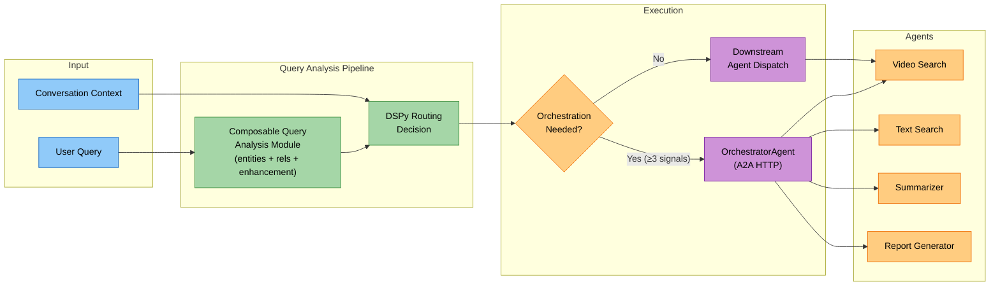
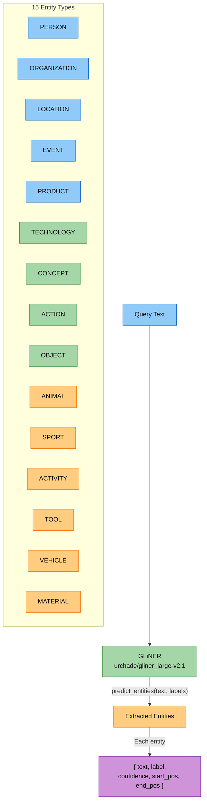
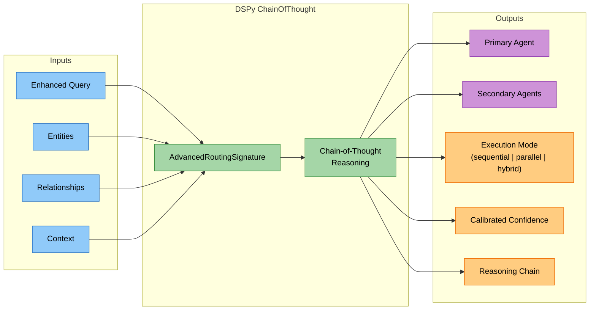
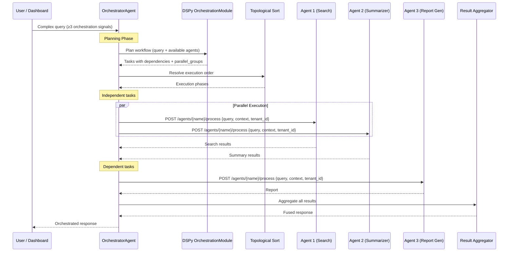
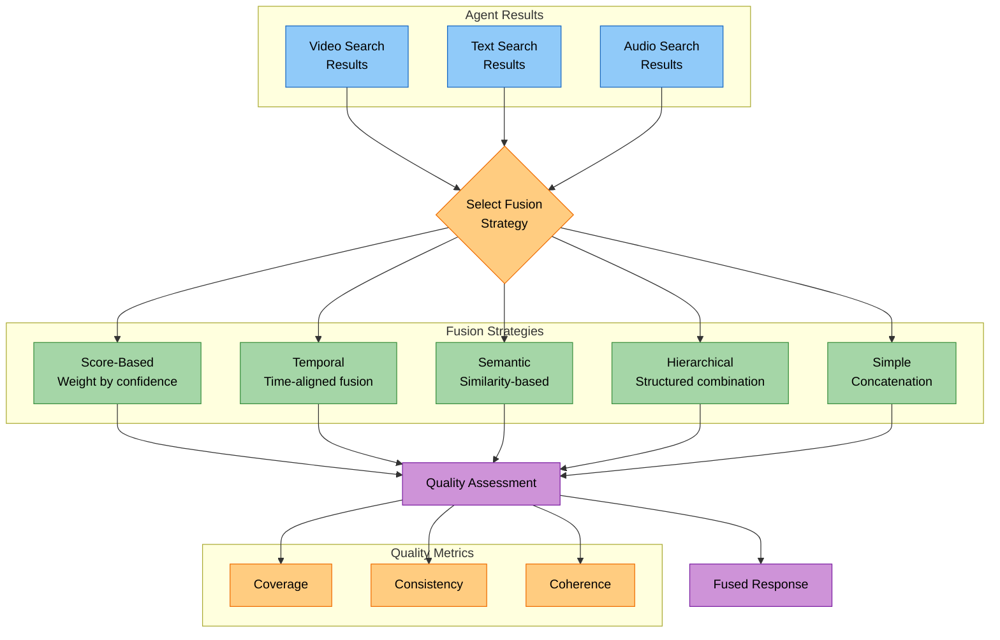

# Intelligent Query Routing for Multi-Modal Search

## Problem Statement

Naive keyword-based routing fails for multi-modal search systems. When a user asks _"Find videos of a golden retriever playing fetch at a park, then summarize the training techniques shown"_, a keyword router might match "videos" and send it to a video search agent — but it misses that this is actually a **two-phase request** requiring search _and_ summarization, involving entities (golden retriever, park), relationships (retriever → plays → fetch), and temporal sequencing ("find... then summarize").

The core challenges:

- **Intent ambiguity** — queries contain multiple implicit intents (search + analyze + summarize)
- **Entity blindness** — keyword matchers don't understand _what_ is being asked about
- **Relationship ignorance** — the connections between entities carry routing signal
- **Static confidence** — fixed thresholds can't adapt to shifting query distributions
- **Single-agent assumption** — complex queries need coordinated multi-agent execution

---

## Architecture Overview

```mermaid
graph LR
    subgraph Input
        Q["<span style='color:#000'>User Query</span>"]
        CTX["<span style='color:#000'>Conversation Context</span>"]
    end

    subgraph "Query Analysis Pipeline"
        CQA["<span style='color:#000'>Composable Query<br/>Analysis Module<br/>(entities + rels + enhancement)</span>"]
        DSPy["<span style='color:#000'>DSPy Routing<br/>Decision</span>"]
    end

    subgraph "Execution"
        OD{"<span style='color:#000'>Orchestration<br/>Needed?</span>"}
        DDA["<span style='color:#000'>Downstream<br/>Agent Dispatch</span>"]
        MAO["<span style='color:#000'>OrchestratorAgent<br/>(A2A HTTP)</span>"]
    end

    subgraph "Agents"
        VS["<span style='color:#000'>Video Search</span>"]
        TS["<span style='color:#000'>Text Search</span>"]
        SUM["<span style='color:#000'>Summarizer</span>"]
        RPT["<span style='color:#000'>Report Generator</span>"]
    end

    Q --> CQA
    CTX --> DSPy
    CQA --> DSPy --> OD
    OD -- "No" --> DDA --> VS
    OD -- "Yes (≥3 signals)" --> MAO
    MAO --> VS & TS & SUM & RPT

    style Q fill:#90caf9,stroke:#1565c0,color:#000
    style CTX fill:#90caf9,stroke:#1565c0,color:#000
    style CQA fill:#a5d6a7,stroke:#388e3c,color:#000
    style DSPy fill:#a5d6a7,stroke:#388e3c,color:#000
    style OD fill:#ffcc80,stroke:#ef6c00,color:#000
    style DDA fill:#ce93d8,stroke:#7b1fa2,color:#000
    style MAO fill:#ce93d8,stroke:#7b1fa2,color:#000
    style VS fill:#ffcc80,stroke:#ef6c00,color:#000
    style TS fill:#ffcc80,stroke:#ef6c00,color:#000
    style SUM fill:#ffcc80,stroke:#ef6c00,color:#000
    style RPT fill:#ffcc80,stroke:#ef6c00,color:#000
```

---

## Query Analysis Pipeline

The routing pipeline processes each query through four phases, progressively enriching the query representation before making a routing decision.

### Entity Extraction via GLiNER

Zero-shot Named Entity Recognition using [GLiNER](https://github.com/urchade/GLiNER) — a generalist model that extracts entities without task-specific fine-tuning.

```mermaid
flowchart TD
    Q["<span style='color:#000'>Query Text</span>"] --> GLiNER["<span style='color:#000'>GLiNER<br/>urchade/gliner_large-v2.1</span>"]
    GLiNER --> |"predict_entities(text, labels)"| E["<span style='color:#000'>Extracted Entities</span>"]

    subgraph "15 Entity Types"
        direction LR
        L1["<span style='color:#000'>PERSON</span>"]
        L2["<span style='color:#000'>ORGANIZATION</span>"]
        L3["<span style='color:#000'>LOCATION</span>"]
        L4["<span style='color:#000'>EVENT</span>"]
        L5["<span style='color:#000'>PRODUCT</span>"]
        L6["<span style='color:#000'>TECHNOLOGY</span>"]
        L7["<span style='color:#000'>CONCEPT</span>"]
        L8["<span style='color:#000'>ACTION</span>"]
        L9["<span style='color:#000'>OBJECT</span>"]
        L10["<span style='color:#000'>ANIMAL</span>"]
        L11["<span style='color:#000'>SPORT</span>"]
        L12["<span style='color:#000'>ACTIVITY</span>"]
        L13["<span style='color:#000'>TOOL</span>"]
        L14["<span style='color:#000'>VEHICLE</span>"]
        L15["<span style='color:#000'>MATERIAL</span>"]
    end

    E --> |"Each entity"| OUT["<span style='color:#000'>{ text, label,<br/>confidence, start_pos, end_pos }</span>"]

    style Q fill:#90caf9,stroke:#1565c0,color:#000
    style GLiNER fill:#a5d6a7,stroke:#388e3c,color:#000
    style E fill:#ffcc80,stroke:#ef6c00,color:#000
    style OUT fill:#ce93d8,stroke:#7b1fa2,color:#000
    style L1 fill:#90caf9,stroke:#1565c0,color:#000
    style L2 fill:#90caf9,stroke:#1565c0,color:#000
    style L3 fill:#90caf9,stroke:#1565c0,color:#000
    style L4 fill:#90caf9,stroke:#1565c0,color:#000
    style L5 fill:#90caf9,stroke:#1565c0,color:#000
    style L6 fill:#a5d6a7,stroke:#388e3c,color:#000
    style L7 fill:#a5d6a7,stroke:#388e3c,color:#000
    style L8 fill:#a5d6a7,stroke:#388e3c,color:#000
    style L9 fill:#a5d6a7,stroke:#388e3c,color:#000
    style L10 fill:#ffcc80,stroke:#ef6c00,color:#000
    style L11 fill:#ffcc80,stroke:#ef6c00,color:#000
    style L12 fill:#ffcc80,stroke:#ef6c00,color:#000
    style L13 fill:#ffcc80,stroke:#ef6c00,color:#000
    style L14 fill:#ffcc80,stroke:#ef6c00,color:#000
    style L15 fill:#ffcc80,stroke:#ef6c00,color:#000
```

**Why GLiNER over spaCy NER?** GLiNER handles domain-specific entities (TECHNOLOGY, ACTIVITY, TOOL) without training data. Traditional NER models are limited to PERSON/ORG/GPE and miss the entity types most relevant to multi-modal content queries.

### Composable Query Analysis (Entity Extraction + Relationship Inference + Query Enhancement)

The `ComposableQueryAnalysisModule` (a `dspy.Module`) combines entity extraction, relationship inference, and LLM-powered query reformulation into a single composable step with two paths:

- **Path A (GLiNER fast path):** GLiNER extracts high-confidence entities (confidence >= `entity_confidence_threshold`, default 0.6) → heuristic relationship inference via proximity and type-pattern matching, enriched by SpaCy dependency parsing → LLM reformulates the query and generates search variants via `QueryReformulationSignature`
- **Path B (LLM unified path):** When GLiNER entities are absent, low-confidence, or the GLiNER model is unavailable, a single LLM call via `UnifiedExtractionReformulationSignature` performs entity extraction, relationship extraction, query reformulation, and variant generation together

Both paths produce identical output: `entities`, `relationships`, `enhanced_query`, `query_variants` (list of `{name, query}` dicts for multi-query fusion), `confidence`, `path_used`, and `domain_classification`.

The `QueryEnhancementAgent` (A2A agent at `cogniverse_agents/query_enhancement_agent.py`) wraps the composable module and handles query enhancement as part of the orchestration pipeline. For batch optimization, SIMBA (Similarity-Based Memory Augmentation) runs as an Argo batch job — it is not an inline fast-path shortcut. The composable module is always used for real-time enhancement.

### DSPy Routing Decision

The enhanced query, entities, and relationships feed into a DSPy `ChainOfThought` module that produces a structured routing decision with confidence calibration.

```mermaid
flowchart LR
    subgraph Inputs
        EQ["<span style='color:#000'>Enhanced Query</span>"]
        ENT["<span style='color:#000'>Entities</span>"]
        REL["<span style='color:#000'>Relationships</span>"]
        CTX["<span style='color:#000'>Context</span>"]
    end

    subgraph "DSPy ChainOfThought"
        SIG["<span style='color:#000'>AdvancedRoutingSignature</span>"]
        COT["<span style='color:#000'>Chain-of-Thought<br/>Reasoning</span>"]
    end

    subgraph Outputs
        AGT["<span style='color:#000'>Primary Agent</span>"]
        SEC["<span style='color:#000'>Secondary Agents</span>"]
        MODE["<span style='color:#000'>Execution Mode<br/>(sequential | parallel | hybrid)</span>"]
        CONF["<span style='color:#000'>Calibrated Confidence</span>"]
        RSN["<span style='color:#000'>Reasoning Chain</span>"]
    end

    EQ & ENT & REL & CTX --> SIG --> COT --> AGT & SEC & MODE & CONF & RSN

    style EQ fill:#90caf9,stroke:#1565c0,color:#000
    style ENT fill:#90caf9,stroke:#1565c0,color:#000
    style REL fill:#90caf9,stroke:#1565c0,color:#000
    style CTX fill:#90caf9,stroke:#1565c0,color:#000
    style SIG fill:#a5d6a7,stroke:#388e3c,color:#000
    style COT fill:#a5d6a7,stroke:#388e3c,color:#000
    style AGT fill:#ce93d8,stroke:#7b1fa2,color:#000
    style SEC fill:#ce93d8,stroke:#7b1fa2,color:#000
    style MODE fill:#ffcc80,stroke:#ef6c00,color:#000
    style CONF fill:#ffcc80,stroke:#ef6c00,color:#000
    style RSN fill:#ffcc80,stroke:#ef6c00,color:#000
```

The routing decision includes:
- **Search modality**: video_only, text_only, both, multimodal
- **Generation type**: raw_results, summary, detailed_report
- **Execution mode**: sequential, parallel, or hybrid
- **Confidence**: calibrated via learned thresholds (see AdaptiveThresholdSignature)

### Routing Optimization (Offline)

Routing and orchestration quality is improved offline, not inline with the per-query flow above. `ComposableQueryAnalysisModule` and the other DSPy signatures in this pipeline are compiled with DSPy prompt optimizers — SIMBA, MIPROv2, BootstrapFewShot, and GEPA (`libs/agents/cogniverse_agents/routing/dspy_relationship_router.py`) — run as Argo batch jobs against traces collected from live traffic. `OrchestrationEvaluator` extracts workflow execution outcomes from telemetry spans and feeds them to `WorkflowIntelligence` for continuous learning about which agent sequences work well for which query shapes. GRPO (Group Relative Policy Optimization) is referenced in the dashboard's optimization tab as a candidate future technique alongside GEPA, but is not currently an implemented optimizer.

The optimizer adaptively selects its strategy based on available training data volume (see [Evaluation & Optimization Loop](./evaluation-optimization-loop.md) for details).

---

## DSPy Signatures & Modules

The routing system is built on 7 DSPy 3.0 signatures, each defining a typed contract between inputs and outputs. DSPy signatures are automatically optimizable — the framework learns prompts/demonstrations that maximize a metric.

| Signature | Purpose | Key Outputs |
|---|---|---|
| `BasicQueryAnalysis` | Fast-path intent + complexity classification | primary_intent, complexity_level, recommended_agent |
| `QueryReformulation` | Path A: Reformulate query using pre-extracted GLiNER entities and relationships | enhanced_query, query_variants, reasoning, confidence |
| `UnifiedExtractionReformulation` | Path B: Single LLM call for entity extraction + relationship inference + query reformulation + variant generation | entities, relationships, enhanced_query, query_variants, domain_classification, confidence |
| `AdvancedRouting` | Full routing with entity/relationship context | routing_decision, agent_workflow, overall_confidence |
| `MetaRouting` | Strategy selection: fast_path vs slow_path vs hybrid | recommended_strategy, threshold_adjustments |
| `AdaptiveThreshold` | Learn confidence thresholds from performance data | fast_path_threshold, slow_path_threshold, escalation_threshold |
| `MultiAgentOrchestration` | Workflow planning for complex multi-agent queries | execution_plan, agent_assignments, coordination_strategy |

**Design pattern:** Each signature uses `dspy.InputField` and `dspy.OutputField` with descriptive `desc` parameters. The descriptions serve as soft constraints — DSPy's optimizer uses them to generate better prompts. Pydantic `BaseModel` subclasses (`EntityInfo`, `RelationshipTuple`, `RoutingDecision`) enforce structured output typing.

A factory function selects the appropriate signature tier:
- `"basic"` → `BasicQueryAnalysisSignature` (fast path, simple queries)
- `"advanced"` → `AdvancedRoutingSignature` (full pipeline)
- `"meta"` → `MetaRoutingSignature` (routing the router)

---

## Multi-Agent Orchestration

Query complexity is determined at the entry point by `GatewayAgent`, which classifies queries as "simple" or "complex" using GLiNER entity classification (no LLM call, <100ms).

### Dispatch Execution Paths

`AgentDispatcher.dispatch()` routes queries through `_execute_gateway_task` for any agent with `gateway` or `routing` capabilities:

#### Simple Path (Single Agent)

When `GatewayAgent` classifies a query as `complexity="simple"`:

1. `GatewayAgent._process_impl()` returns a `GatewayOutput` with the target agent name, modality, and generation type
2. `_execute_downstream_agent` looks up the target agent in the registry and dispatches based on its capabilities:
   - `search`/`video_search`/`retrieval` → `_execute_search_task` (with `conversation_history` for query rewrite)
   - `image_search`/`visual_analysis` → `_execute_image_search_task`
   - `audio_analysis`/`transcription` → `_execute_audio_search_task`
   - `document_analysis`/`pdf_processing` → `_execute_document_search_task`
   - `detailed_report` → `_execute_detailed_report_task`
   - `summarization`/`text_generation` → `_execute_summarization_task`
   - `text_analysis`/`sentiment`/`classification` → `_execute_text_analysis_task`
3. The response includes gateway metadata (`complexity`, `modality`, `routed_to`, `confidence`) and the `downstream_result` from the executed agent

#### Complex Path (Multi-Agent Orchestration)

When `GatewayAgent` classifies a query as `complexity="complex"`:

1. `GatewayAgent._process_impl()` returns `complexity="complex"` (triggered by: no entities detected, low confidence, or multiple modalities)
2. `_execute_orchestration_task` instantiates `OrchestratorAgent` with the `AgentRegistry` and `ConfigManager`
3. `OrchestratorAgent._process_impl()` plans a workflow using DSPy, executes agents via A2A HTTP, and aggregates results
4. A `cogniverse.orchestration` telemetry span is emitted with attributes consumed by the dashboard's Orchestration tab

### Complexity Classification

GatewayAgent classifies queries as complex when any of these conditions hold:

| # | Signal | Detection Logic |
|---|---|---|
| 1 | No entities detected | GLiNER returns zero entities for the query |
| 2 | Low confidence | Classification confidence below `fast_path_confidence_threshold` (default: 0.4) |
| 3 | Multiple modalities | Entities span more than one modality (e.g., video + audio) |

### Workflow Planning & Execution

```mermaid
sequenceDiagram
    participant U as User / Dashboard
    participant O as OrchestratorAgent
    participant WP as DSPy OrchestrationModule
    participant TS as Topological Sort
    participant A1 as Agent 1 (Search)
    participant A2 as Agent 2 (Summarizer)
    participant A3 as Agent 3 (Report Gen)
    participant AGG as Result Aggregator

    U->>O: Complex query (≥3 orchestration signals)

    Note over O: Planning Phase
    O->>WP: Plan workflow (query + available agents)
    WP-->>O: Tasks with dependencies + parallel_groups

    O->>TS: Resolve execution order
    TS-->>O: Execution phases

    Note over O: Independent tasks
    par Parallel Execution
        O->>A1: POST /agents/{name}/process {query, context, tenant_id}
        O->>A2: POST /agents/{name}/process {query, context, tenant_id}
    end
    A1-->>O: Search results
    A2-->>O: Summary results

    Note over O: Dependent tasks
    O->>A3: POST /agents/{name}/process {query, context, tenant_id}
    A3-->>O: Report

    O->>AGG: Aggregate all results
    AGG-->>O: Fused response
    O-->>U: Orchestrated response
```

**Key architectural decisions:**

1. **Topological sort** — Tasks are sorted by dependency graph. Tasks with no dependencies execute in parallel; dependent tasks wait for their prerequisites.

2. **Phase-by-phase execution** — The topological sort produces execution phases. Within each phase, tasks run concurrently up to the orchestration semaphore limit (`_ORCH_CONCURRENCY`, default: 4).

3. **Durable execution via checkpointing** — Each completed phase checkpoints its results. If a workflow fails mid-execution, it can resume from the last successful phase rather than restarting from scratch. Checkpoints store task status, results, and timestamps.

4. **Direct HTTP execution** — `OrchestratorAgent` calls agents via `httpx.AsyncClient` to `POST /agents/{name}/process`, enabling heterogeneous agent types (search, generation, analysis) to exchange structured messages.

---

## Cross-Modal Fusion

When multiple agents return results across different modalities (video, text, audio), a fusion step combines them into a coherent response.

```mermaid
flowchart TD
    subgraph "Agent Results"
        VR["<span style='color:#000'>Video Search<br/>Results</span>"]
        TR["<span style='color:#000'>Text Search<br/>Results</span>"]
        AR["<span style='color:#000'>Audio Search<br/>Results</span>"]
    end

    SS{"<span style='color:#000'>Select Fusion<br/>Strategy</span>"}

    subgraph "Fusion Strategies"
        S1["<span style='color:#000'>Score-Based<br/>Weight by confidence</span>"]
        S2["<span style='color:#000'>Temporal<br/>Time-aligned fusion</span>"]
        S3["<span style='color:#000'>Semantic<br/>Similarity-based</span>"]
        S4["<span style='color:#000'>Hierarchical<br/>Structured combination</span>"]
        S5["<span style='color:#000'>Simple<br/>Concatenation</span>"]
    end

    subgraph "Quality Metrics"
        M1["<span style='color:#000'>Coverage</span>"]
        M2["<span style='color:#000'>Consistency</span>"]
        M3["<span style='color:#000'>Coherence</span>"]
    end

    VR & TR & AR --> SS
    SS --> S1 & S2 & S3 & S4 & S5
    S1 & S2 & S3 & S4 & S5 --> QA["<span style='color:#000'>Quality Assessment</span>"]
    QA --> M1 & M2 & M3
    QA --> OUT["<span style='color:#000'>Fused Response</span>"]

    style VR fill:#90caf9,stroke:#1565c0,color:#000
    style TR fill:#90caf9,stroke:#1565c0,color:#000
    style AR fill:#90caf9,stroke:#1565c0,color:#000
    style SS fill:#ffcc80,stroke:#ef6c00,color:#000
    style S1 fill:#a5d6a7,stroke:#388e3c,color:#000
    style S2 fill:#a5d6a7,stroke:#388e3c,color:#000
    style S3 fill:#a5d6a7,stroke:#388e3c,color:#000
    style S4 fill:#a5d6a7,stroke:#388e3c,color:#000
    style S5 fill:#a5d6a7,stroke:#388e3c,color:#000
    style QA fill:#ce93d8,stroke:#7b1fa2,color:#000
    style M1 fill:#ffcc80,stroke:#ef6c00,color:#000
    style M2 fill:#ffcc80,stroke:#ef6c00,color:#000
    style M3 fill:#ffcc80,stroke:#ef6c00,color:#000
    style OUT fill:#ce93d8,stroke:#7b1fa2,color:#000
```

### Fusion Strategies

| Strategy | When Used | How It Works |
|---|---|---|
| **Score-Based** | Default for mixed-modality queries | Weights each result by its confidence score; higher-confidence results dominate |
| **Temporal** | Time-sensitive queries ("last week", "recent") | Aligns results along a timeline; temporal proximity to query timeframe increases weight |
| **Semantic** | Conceptual queries ("explain how X works") | Groups results by semantic similarity; de-duplicates overlapping content |
| **Hierarchical** | Structured queries ("compare A vs B") | Builds a structured response with sections per modality |
| **Simple** | Fallback / single-modality | Basic concatenation of results |

Strategy selection is automatic based on query characteristics detected during the analysis pipeline.

### Cross-Modal Optimization

A learned `FusionBenefitModel` predicts whether multi-modal fusion will improve results for a given query. The model considers:

- **Primary/secondary modality confidences** — how certain the system is about each modality
- **Modality agreement** — whether modalities suggest the same thing
- **Query ambiguity score** — ambiguous queries benefit more from fusion
- **Historical fusion success rate** — per-modality-pair success rates tracked with exponential moving average (α = 0.1)

If predicted benefit ≥ 0.5, fusion is recommended. The model trains on recorded fusion outcomes and can discover patterns from Phoenix telemetry spans.

---

## Context-Aware Routing

Follow-up queries carry anaphoric references ("that", "those", "longer ones") that only resolve against the prior turn. `AgentDispatcher` passes the caller-supplied `conversation_history` through to `_rewrite_query_with_history`, which uses `ConversationalQueryRewriteModule` (a `dspy.Module` in `cogniverse_agents/search_agent.py`) to rewrite the query into a self-contained form before it reaches search or the gateway's entity classification.

- The rewriter receives the raw query plus the full `conversation_history` list supplied on the request (no separate session store or sliding window is maintained server-side)
- When the rewritten query differs from the input, both `original_query` and `rewritten_query` are included in the response so callers can see what changed
- If no `conversation_history` is supplied, the query is passed through unchanged

---

## LLM-Level Semantic Routing

Everything above routes a *query* to an *agent*. A separate, lower layer routes each *LLM call* an agent makes to a *model*: an opt-in [semantic router](https://github.com/vllm-project/semantic-router) sits in front of the configured LLM backend (`libs/foundation/cogniverse_foundation/config/semantic_router.py`, deployed via `charts/cogniverse/templates/semantic-router.yaml`).

When `SemanticRouterConfig.enabled` is set, `apply_semantic_routing` rewrites an agent's `LLMEndpointConfig` to target the router instead of the model backend directly, attaching two headers per request: the tenant id and a per-tenant tier (`tenant_tiers[tenant_id]`, falling back to `default_tier`). The router uses the tier to gate which models the tenant may use, then classifies the request content itself (domain/complexity) to pick the concrete model and reasoning mode — cogniverse only tells it *who* is asking, not *what kind* of request it is. This is wired into `agent_dispatcher.py` and the DynamicDSPyMixin used by agents; when routing is disabled, the direct-to-backend path is unchanged.

---

## Key Techniques Summary

| Technique | Category | Role in System |
|---|---|---|
| **GLiNER** | Zero-shot NER | Entity extraction across 15 custom types without training data |
| **DSPy 3.0 Signatures** | Prompt optimization | 7 typed signatures that are automatically optimizable |
| **ChainOfThought** | Reasoning | Step-by-step reasoning for routing decisions |
| **DSPy Optimizers (SIMBA/GEPA/MIPROv2)** | Offline prompt optimization | Compile routing/enhancement signatures from traced outcomes via Argo batch jobs |
| **Topological Sort** | Graph algorithms | Dependency-aware task scheduling for multi-agent workflows |
| **A2A Protocol** | Agent communication | Structured inter-agent messaging |
| **Durable Execution** | Reliability | Phase-level checkpointing for workflow resumability |
| **Cross-Modal Fusion** | Information fusion | 5 strategies for combining multi-modal search results |
| **FusionBenefitModel** | Learned optimization | Predicts when fusion improves results |
| **Exponential Moving Average** | Online learning | Tracks fusion success rates with smooth updates |
| **Adaptive Thresholds** | Self-tuning | Confidence thresholds that learn from performance data |
| **Conversational Query Rewrite** | Session intelligence | DSPy-based anaphora resolution using per-request conversation history |
