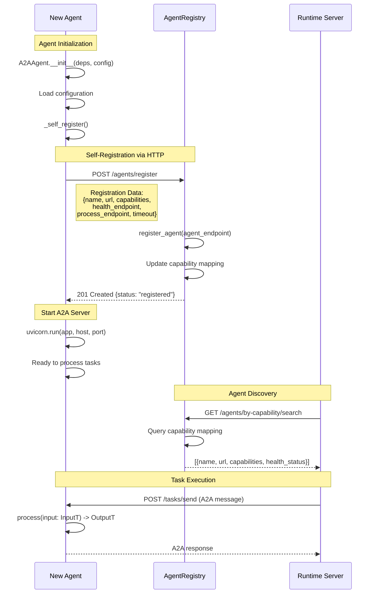
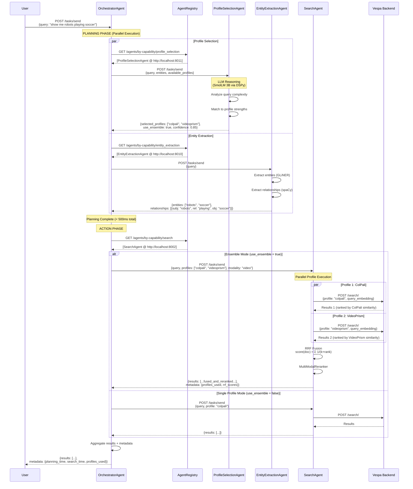
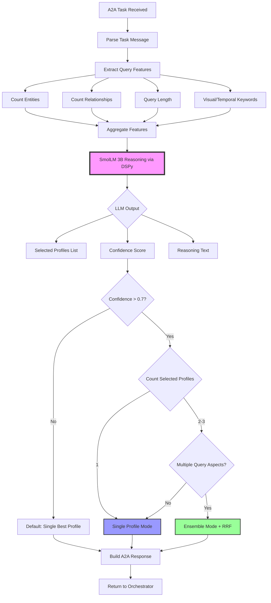
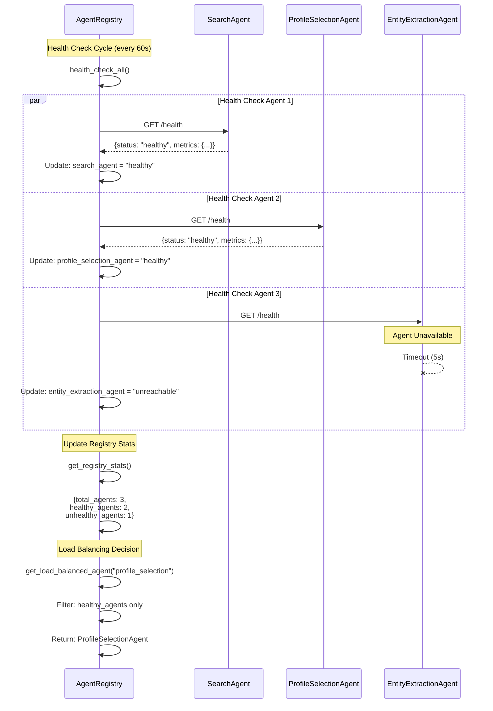
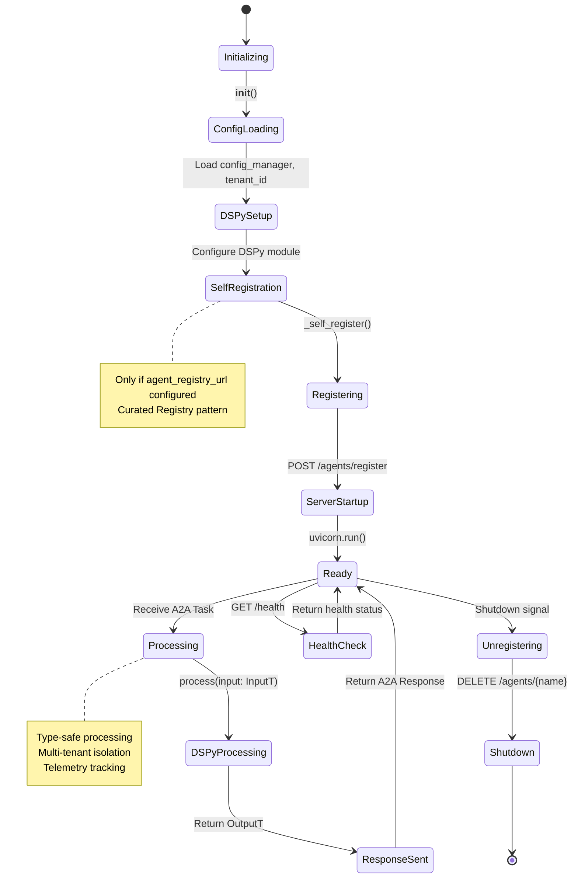
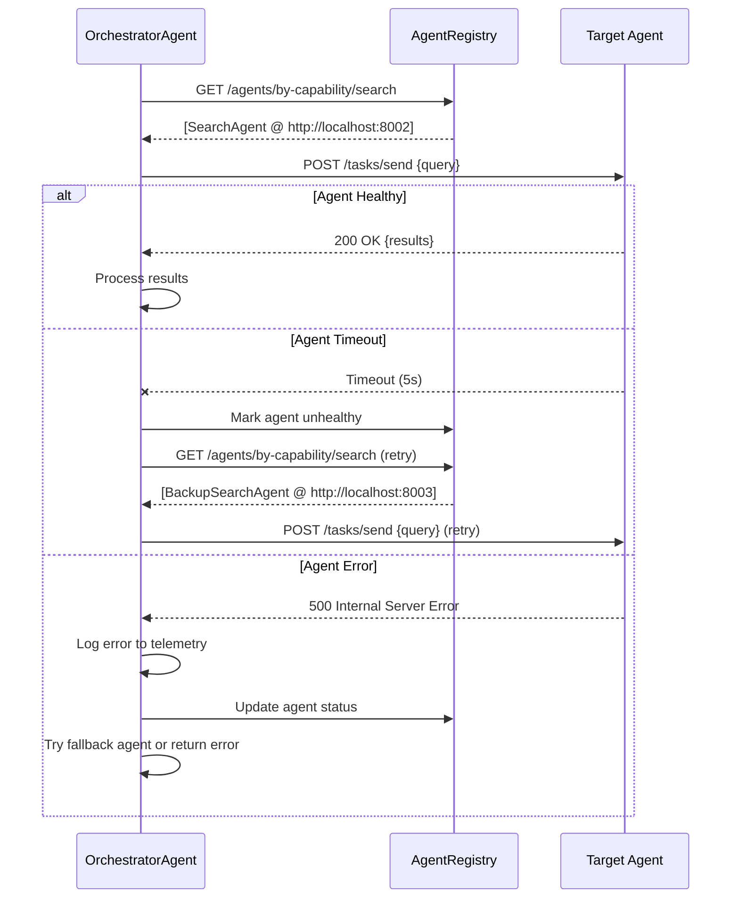

# Multi-Agent Interactions and Communication Flows

## Overview

This document describes how agents communicate with each other in the Cogniverse multi-agent system using Google's A2A (Agent-to-Agent) protocol. It provides comprehensive sequence diagrams showing the complete flow of messages between agents, the orchestrator, and the agent registry.

## A2A Protocol Basics

### Message Format

All agents communicate using standardized A2A Task messages:

```json
{
  "id": "task_uuid",
  "messages": [
    {
      "role": "user",
      "parts": [
        {
          "type": "text",
          "text": "User query or instruction"
        },
        {
          "type": "data",
          "data": {
            "key": "value",
            "additional_context": {}
          }
        }
      ]
    }
  ]
}
```

### Standard Endpoints

Every A2A agent exposes three standard endpoints:

1. **`POST /tasks/send`** - Main task processing endpoint
2. **`GET /agent.json`** - Agent card with capabilities
3. **`GET /health`** - Health check endpoint

### Agent Lifecycle

```
Initialize → Self-Register → Start Server → Process Tasks → Shutdown
```

##1. Agent Registry and Discovery Flow

### Agent Self-Registration

When an agent starts up, it automatically registers itself with the AgentRegistry using the Curated Registry pattern.



### Key Points

- **Autonomous Registration**: Agents register themselves without external intervention
- **Capability-Based Discovery**: Runtime discovers agents by capabilities (e.g., "search", "profile_selection")
- **Health Monitoring**: Registry periodically checks agent health
- **Dynamic Updates**: Agents can re-register to update capabilities

---

## 2. Complete Query Flow with Orchestrator

This diagram shows the full end-to-end flow from user query to final results, including parallel planning and ensemble search execution.



### Timeline Analysis

**Planning Phase (Parallel)**:
- Profile Selection: ~100-150ms (LLM inference)
- Entity Extraction: ~50-100ms (GLiNER + spaCy)
- **Total**: ~150-200ms (limited by slowest agent)

**Action Phase (Sequential or Parallel)**:
- Single Profile Search: ~400-600ms
- Ensemble Search (2-3 profiles): ~500-700ms (parallel execution)
- RRF Fusion: ~5-10ms
- **Total**: ~500-700ms

**End-to-End Latency**: ~650-900ms

---

## 3. ProfileSelectionAgent Decision Flow

This flowchart shows how the ProfileSelectionAgent makes intelligent decisions about which profiles to use and whether to enable ensemble mode.



### Decision Criteria

**Ensemble Mode Triggers**:
- Query has >3 entities
- Query has >2 relationships
- Query contains both visual AND temporal keywords
- LLM confidence > 0.7 for multiple profiles
- Complex multi-aspect queries

**Single Profile Selection**:
- Simple queries (<2 entities)
- Single dominant modality
- Low query complexity
- High confidence for one specific profile

---

## 4. Ensemble Search with RRF Fusion

This diagram shows the detailed execution flow for ensemble search with Reciprocal Rank Fusion.

```mermaid
flowchart TB
    Start[User Query] --> Encode{For Each Selected Profile}

    Encode -->|Profile 1| Enc1[Encode with ColPali]
    Encode -->|Profile 2| Enc2[Encode with VideoPrism]
    Encode -->|Profile 3| Enc3[Encode with Qwen]

    Enc1 --> Search1[Vespa Search<br/>Profile: colpali]
    Enc2 --> Search2[Vespa Search<br/>Profile: videoprism]
    Enc3 --> Search3[Vespa Search<br/>Profile: qwen]

    Search1 --> Results1[Results 1<br/>Ranked by ColPali]
    Search2 --> Results2[Results 2<br/>Ranked by VideoPrism]
    Search3 --> Results3[Results 3<br/>Ranked by Qwen]

    Results1 --> RRF[RRF Fusion Algorithm]
    Results2 --> RRF
    Results3 --> RRF

    RRF --> Calc[For each document:<br/>score = Σ 1/(k + rank_in_profile)]
    Calc --> Sort[Sort by RRF Score<br/>(Descending)]
    Sort --> TopN[Select Top N Results]

    TopN --> Rerank[MultiModalReranker]
    Rerank --> Metadata[Add Fusion Metadata]
    Metadata --> Final[Return Fused Results]

    style RRF fill:#ffb,stroke:#333,stroke-width:3px
    style Encode fill:#bbf,stroke:#333,stroke-width:2px
    style Rerank fill:#bfb,stroke:#333,stroke-width:2px
```

### RRF Algorithm Details

**Formula**:
```
score(document) = Σ_profiles (1 / (k + rank_in_profile))
```

**Parameters**:
- `k = 60` (default) - Controls weight of top-ranked documents
- Profiles: 2-3 profiles maximum for optimal performance
- Rank: 1-indexed position in each profile's result list

**Example Calculation**:

Document appears in 3 profiles at ranks [2, 5, 1]:

```
RRF score = 1/(60+2) + 1/(60+5) + 1/(60+1)
         = 1/62 + 1/65 + 1/61
         = 0.0161 + 0.0154 + 0.0164
         = 0.0479
```

**Complexity**: O(n_profiles × n_results) ~ 5-10ms for typical case

---

## 5. Agent Registry Health Monitoring

The AgentRegistry continuously monitors agent health and updates status.



### Health Status States

- **healthy**: Agent responded with 200 OK
- **unhealthy**: Agent responded with non-200 status
- **unreachable**: Agent timed out or connection failed

### Load Balancing Strategy

1. **Filter**: Only healthy agents
2. **Round-Robin**: Simple rotation for multiple healthy agents
3. **Fallback**: If no healthy agents, use any registered agent
4. **Retry**: Automatic retry with backoff for failed requests

---

## 6. Complete Agent Lifecycle

This diagram shows the complete lifecycle of an agent from initialization to shutdown.



---

## 7. Error Handling and Retry Logic



---

## 8. Multi-Tenant Isolation

All agents support multi-tenant isolation using tenant_id for data and telemetry separation.

```mermaid
flowchart TD
    Request[A2A Task with tenant_id] --> Extract[Extract tenant_id from task]

    Extract --> Validate{tenant_id valid?}
    Validate -->|No| Error[Return 400 Bad Request]
    Validate -->|Yes| TenantContext[Create tenant context]

    TenantContext --> Phoenix[Phoenix Telemetry<br/>Project: cogniverse-{tenant}]
    TenantContext --> Config[Load tenant configuration]
    TenantContext --> Memory[Memory isolation]

    Phoenix --> Process[Process with DSPy]
    Config --> Process
    Memory --> Process

    Process --> Results[Return results]
    Results --> Trace[Export telemetry trace<br/>to tenant-specific project]

    style Validate fill:#fbb,stroke:#333,stroke-width:2px
    style TenantContext fill:#bbf,stroke:#333,stroke-width:2px
    style Trace fill:#bfb,stroke:#333,stroke-width:2px
```

---

## Performance Characteristics

### Latency Breakdown (Typical Query)

| Phase | Component | Latency | Parallelizable |
|-------|-----------|---------|----------------|
| Planning | Profile Selection | 100-150ms | ✅ Yes |
| Planning | Entity Extraction | 50-100ms | ✅ Yes |
| **Planning Total** | **Both agents** | **150-200ms** | **Parallel** |
| Action | Single Profile Search | 400-600ms | ❌ No |
| Action | Ensemble Search (2-3) | 500-700ms | ✅ Yes (profiles) |
| Action | RRF Fusion | 5-10ms | ❌ No |
| **Action Total** | **Search + Fusion** | **500-710ms** | **Profiles parallel** |
| **End-to-End** | **Complete flow** | **650-910ms** | **Planning + Action** |

### Network Calls

**Minimum** (Single profile, simple query):
- 1× Registry lookup (profile selection agent)
- 1× Registry lookup (search agent)
- 1× Profile selection task
- 1× Search task
- **Total**: 4 HTTP calls

**Maximum** (Ensemble with 3 profiles, complex query):
- 3× Registry lookups (planning agents + search agent)
- 2× Planning tasks (profile selection + entity extraction)
- 1× Search task → 3× Vespa queries (parallel)
- **Total**: 9 HTTP calls (6 parallel)

---

## See Also

- [Agents Module Documentation](../modules/agents.md) - Implementation details for all agents
- [Ensemble Composition](./ensemble-composition.md) - Deep dive into RRF algorithm
- [A2A Protocol Specification](https://github.com/google/a2a) - Google's A2A protocol spec
- [Multi-Tenant Architecture](./multi-tenant.md) - Tenant isolation design
