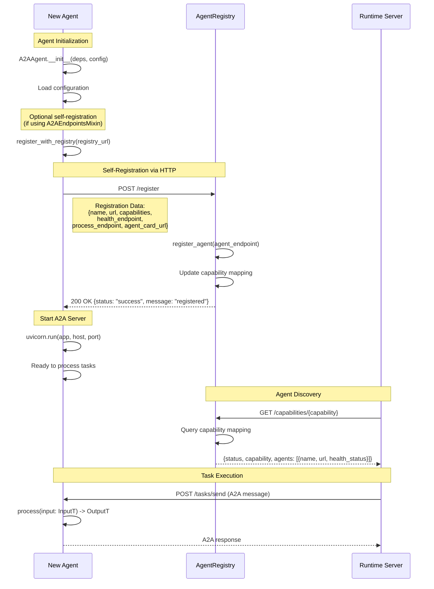
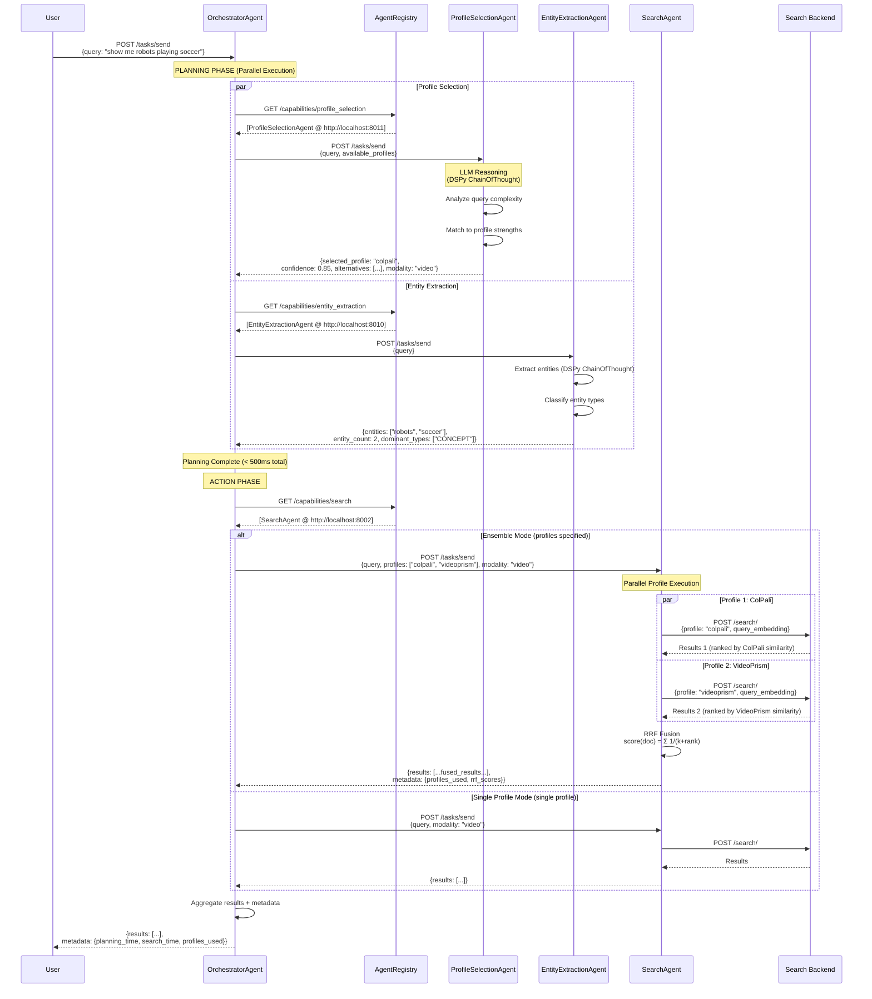
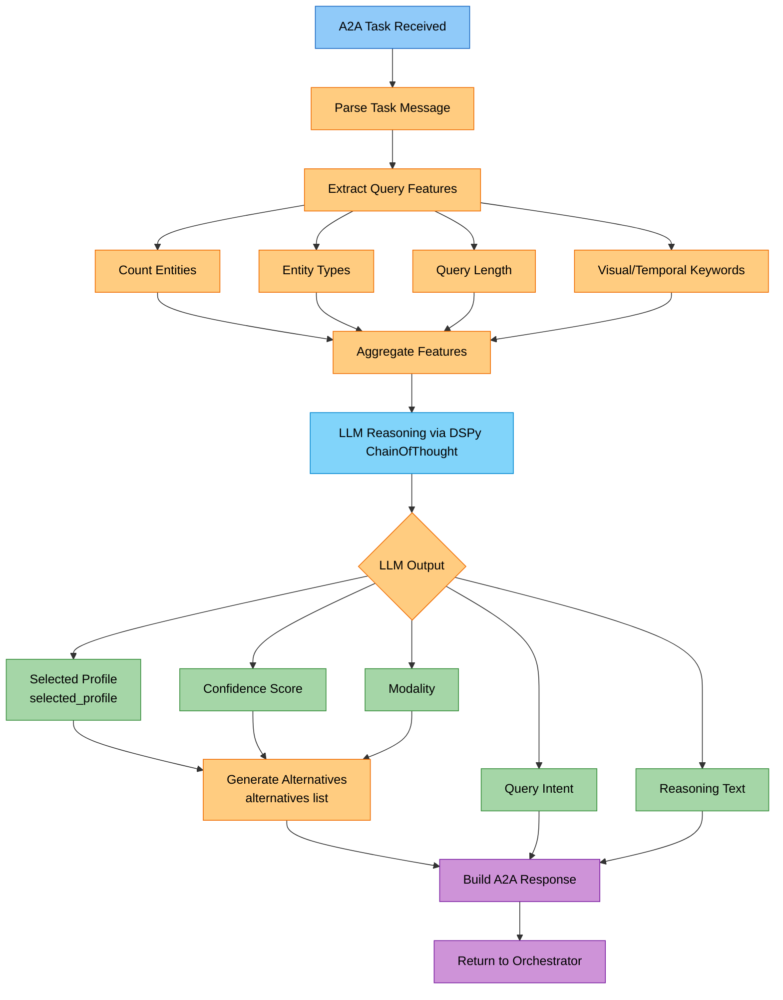
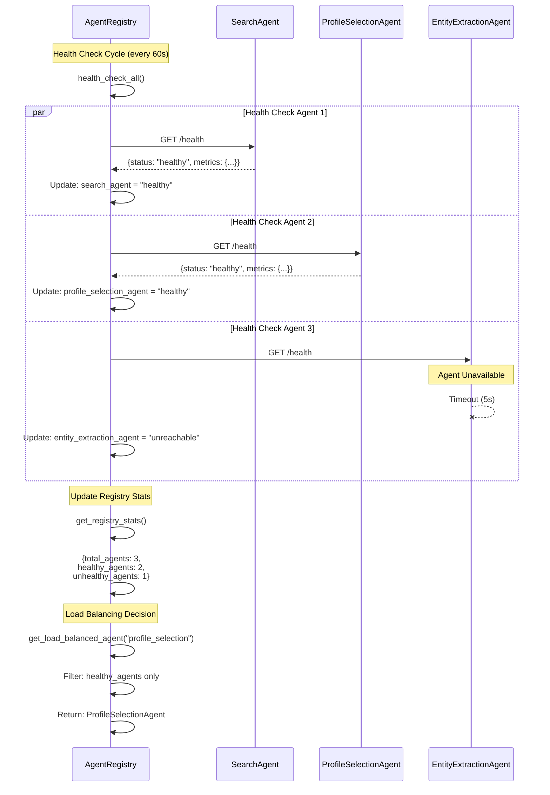
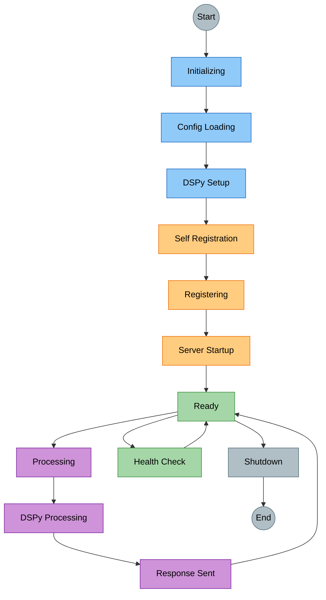
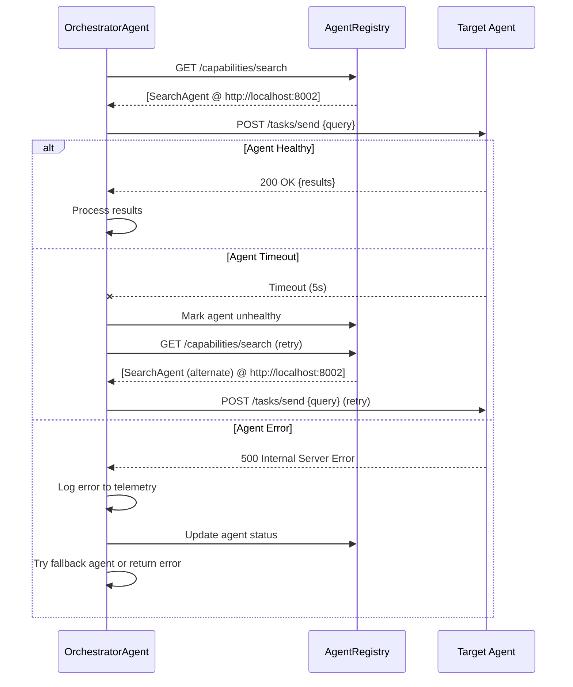
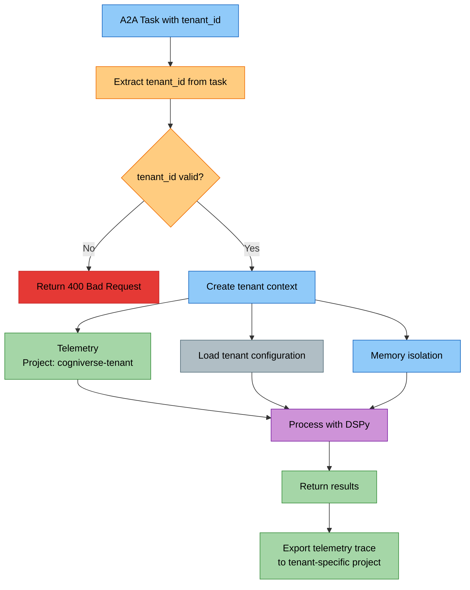

# Multi-Agent Interactions and Communication Flows

## Overview

This document describes how agents communicate with each other in the Cogniverse multi-agent system using Google's A2A (Agent-to-Agent) protocol. It provides comprehensive sequence diagrams showing the complete flow of messages between agents, the orchestrator, and the agent registry.

## A2A Protocol Basics

### Message Format

All agents communicate using standardized A2A Task messages:

```json
{
  "id": "task_uuid",
  "messages": [
    {
      "role": "user",
      "parts": [
        {
          "type": "text",
          "text": "User query or instruction"
        },
        {
          "type": "data",
          "data": {
            "key": "value",
            "additional_context": {}
          }
        }
      ]
    }
  ]
}
```

### Standard Endpoints

Every A2A agent exposes three standard endpoints:

1. **`POST /tasks/send`** - Main task processing endpoint
2. **`GET /.well-known/agent-card.json`** - Agent card with capabilities (Google A2A standard)
3. **`GET /health`** - Health check endpoint

Additional endpoints:
- **`GET /agent.json`** - Legacy agent card endpoint (alias for well-known URI)

### Agent Lifecycle

```text
Initialize → Self-Register → Start Server → Process Tasks → Shutdown
```

## 1. Agent Registry and Discovery Flow

### Agent Self-Registration

Agents can register themselves with the AgentRegistry using the Curated Registry pattern. The `A2AEndpointsMixin` provides a `register_with_registry(registry_url)` method that agents can use to self-register via HTTP POST to the registry's `/register` endpoint.



### Key Points

- **Self-Registration**: Agents using `A2AEndpointsMixin` can register themselves by calling `register_with_registry(registry_url)` which sends a POST request to the registry's `/register` endpoint
- **Capability-Based Discovery**: Runtime discovers agents by querying the registry endpoint `/capabilities/{capability}` (e.g., `/capabilities/search`, `/capabilities/profile_selection`)
- **Health Monitoring**: Registry periodically checks agent health via their `/health` endpoints
- **Dynamic Updates**: Agents can re-register to update capabilities by sending updated registration data

---

## 2. Complete Query Flow with Orchestrator

This diagram shows the full end-to-end flow from user query to final results, including parallel planning and ensemble search execution.



### Timeline Analysis

**Planning Phase (Parallel)**:

- Profile Selection: ~100-150ms (DSPy LLM inference)
- Entity Extraction: ~50-100ms (DSPy LLM inference)
- **Total**: ~150-200ms (limited by slowest agent)

**Action Phase (Sequential or Parallel)**:

- Single Profile Search: ~400-600ms
- Ensemble Search (2-3 profiles): ~500-700ms (parallel execution)
- RRF Fusion: ~5-10ms
- **Total**: ~500-700ms

**End-to-End Latency**: ~650-900ms

---

## 3. ProfileSelectionAgent Decision Flow

This flowchart shows how the ProfileSelectionAgent makes intelligent decisions about which profile to select based on query characteristics.



### Decision Criteria

**Profile Selection Factors**:

- Query complexity (simple/medium/complex)
- Query intent (text_search, video_search, image_search, etc.)
- Target modality (video, image, text, audio)
- Entity count and types
- LLM confidence score (0.0-1.0)

**Profile Selection Output**:

- Single selected_profile (best match)
- Confidence score
- Alternative profiles (ranked by relevance)
- Query analysis (intent, modality, complexity)

---

## 4. Ensemble Search with RRF Fusion

This diagram shows the detailed execution flow for ensemble search with Reciprocal Rank Fusion.

```mermaid
flowchart TB
    Start[<span style='color:#000'>User Query</span>] --> Encode{<span style='color:#000'>For Each Selected Profile</span>}

    Encode -->|Profile 1| Enc1[<span style='color:#000'>Encode with ColPali</span>]
    Encode -->|Profile 2| Enc2[<span style='color:#000'>Encode with VideoPrism</span>]
    Encode -->|Profile 3| Enc3[<span style='color:#000'>Encode with Qwen</span>]

    Enc1 --> Search1[<span style='color:#000'>Backend Search<br/>Profile: colpali</span>]
    Enc2 --> Search2[<span style='color:#000'>Backend Search<br/>Profile: videoprism</span>]
    Enc3 --> Search3[<span style='color:#000'>Backend Search<br/>Profile: qwen</span>]

    Search1 --> Results1[<span style='color:#000'>Results 1<br/>Ranked by ColPali</span>]
    Search2 --> Results2[<span style='color:#000'>Results 2<br/>Ranked by VideoPrism</span>]
    Search3 --> Results3[<span style='color:#000'>Results 3<br/>Ranked by Qwen</span>]

    Results1 --> RRF[<span style='color:#000'>RRF Fusion Algorithm</span>]
    Results2 --> RRF
    Results3 --> RRF

    RRF --> Calc[<span style='color:#000'>For each document:<br/>score = Σ 1/(k + rank_in_profile)</span>]
    Calc --> Sort[<span style='color:#000'>Sort by RRF Score<br/>Descending</span>]
    Sort --> TopN[<span style='color:#000'>Select Top N Results</span>]

    TopN --> Metadata[<span style='color:#000'>Add Fusion Metadata</span>]
    Metadata --> Final[<span style='color:#000'>Return Fused Results</span>]

    style Start fill:#90caf9,stroke:#1565c0,color:#000
    style Encode fill:#ffcc80,stroke:#ef6c00,color:#000
    style Enc1 fill:#81d4fa,stroke:#0288d1,color:#000
    style Enc2 fill:#81d4fa,stroke:#0288d1,color:#000
    style Enc3 fill:#81d4fa,stroke:#0288d1,color:#000
    style Search1 fill:#a5d6a7,stroke:#388e3c,color:#000
    style Search2 fill:#a5d6a7,stroke:#388e3c,color:#000
    style Search3 fill:#a5d6a7,stroke:#388e3c,color:#000
    style Results1 fill:#a5d6a7,stroke:#388e3c,color:#000
    style Results2 fill:#a5d6a7,stroke:#388e3c,color:#000
    style Results3 fill:#a5d6a7,stroke:#388e3c,color:#000
    style RRF fill:#ffcc80,stroke:#ef6c00,color:#000
    style Calc fill:#ffcc80,stroke:#ef6c00,color:#000
    style Sort fill:#ffcc80,stroke:#ef6c00,color:#000
    style TopN fill:#ffcc80,stroke:#ef6c00,color:#000
    style Metadata fill:#b0bec5,stroke:#546e7a,color:#000
    style Final fill:#a5d6a7,stroke:#388e3c,color:#000
```

### RRF Algorithm Details

**Formula**:
```text
score(document) = Σ_profiles (1 / (k + rank_in_profile))
```

**Parameters**:

- `k = 60` (default) - Controls weight of top-ranked documents
- Profiles: 2-3 profiles maximum for optimal performance
- Rank: 0-indexed position in each profile's result list

**Example Calculation**:

Document appears in 3 profiles at ranks [2, 5, 1]:

```text
RRF score = 1/(60+2) + 1/(60+5) + 1/(60+1)
         = 1/62 + 1/65 + 1/61
         = 0.0161 + 0.0154 + 0.0164
         = 0.0479
```

**Complexity**: O(n_profiles × n_results) ~ 5-10ms for typical case

---

## 5. Agent Registry Health Monitoring

The AgentRegistry continuously monitors agent health and updates status.



### Health Status States

- **healthy**: Agent responded with 200 OK
- **unhealthy**: Agent responded with non-200 status
- **unreachable**: Agent timed out or connection failed

### Load Balancing Strategy

1. **Filter**: Only healthy agents
2. **Round-Robin**: Simple rotation for multiple healthy agents
3. **Fallback**: If no healthy agents, use any registered agent
4. **Retry**: Automatic retry with backoff for failed requests

---

## 6. Complete Agent Lifecycle

This diagram shows the complete lifecycle of an agent from initialization to shutdown.



**State Notes:**

- **SelfRegistration**: Only if agent_registry_url configured (Curated Registry pattern)
- **Processing**: Type-safe processing, multi-tenant isolation, telemetry tracking

---

## 7. Error Handling and Retry Logic



---

## 8. Multi-Tenant Isolation

All agents support multi-tenant isolation using tenant_id for data and telemetry separation.



---

## Performance Characteristics

### Latency Breakdown (Typical Query)

| Phase | Component | Latency | Parallelizable |
|-------|-----------|---------|----------------|
| Planning | Profile Selection | 100-150ms | ✅ Yes |
| Planning | Entity Extraction | 50-100ms | ✅ Yes |
| **Planning Total** | **Both agents** | **150-200ms** | **Parallel** |
| Action | Single Profile Search | 400-600ms | ❌ No |
| Action | Ensemble Search (2-3) | 500-700ms | ✅ Yes (profiles) |
| Action | RRF Fusion | 5-10ms | ❌ No |
| **Action Total** | **Search + Fusion** | **500-710ms** | **Profiles parallel** |
| **End-to-End** | **Complete flow** | **650-910ms** | **Planning + Action** |

### Network Calls

**Minimum** (Single profile, simple query):

- 1× Registry lookup (profile selection agent)
- 1× Registry lookup (search agent)
- 1× Profile selection task
- 1× Search task
- **Total**: 4 HTTP calls

**Maximum** (Ensemble with 3 profiles, complex query):

- 3× Registry lookups (planning agents + search agent)
- 2× Planning tasks (profile selection + entity extraction)
- 1× Search task → 3× backend queries (parallel)
- **Total**: 9 HTTP calls (6 parallel)

---

## See Also

- [Agents Module Documentation](../modules/agents.md) - Implementation details for all agents
- [Ensemble Composition](./ensemble-composition.md) - Deep dive into RRF algorithm
- [A2A Protocol Specification](https://github.com/google/a2a) - Google's A2A protocol spec
- [Multi-Tenant Architecture](./multi-tenant.md) - Tenant isolation design
