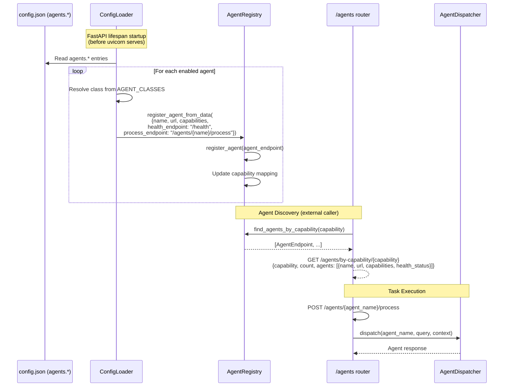
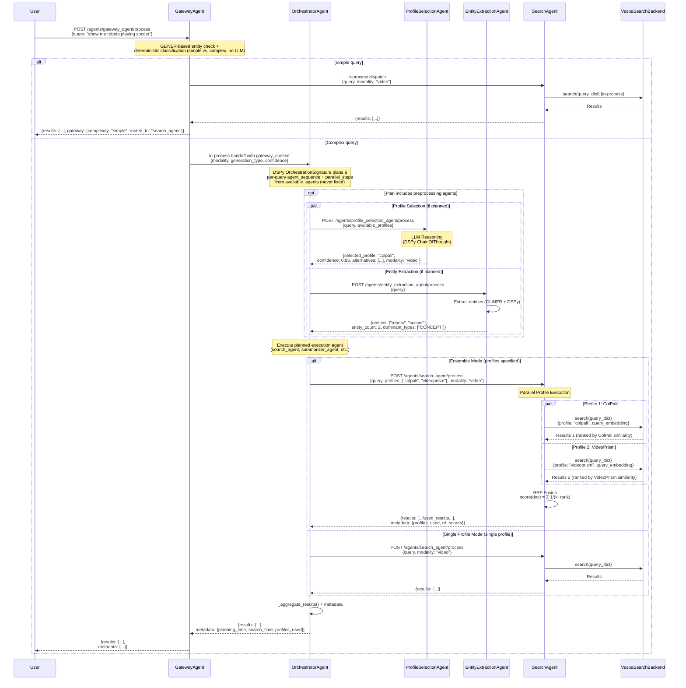
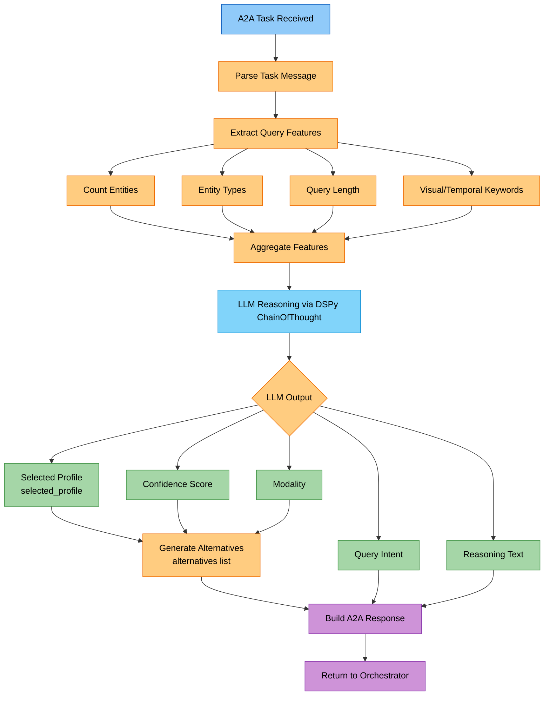
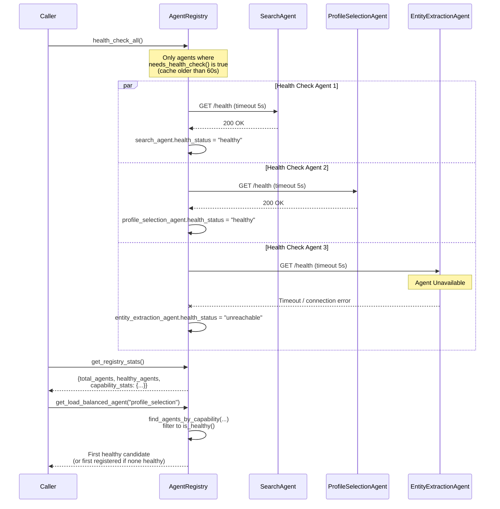
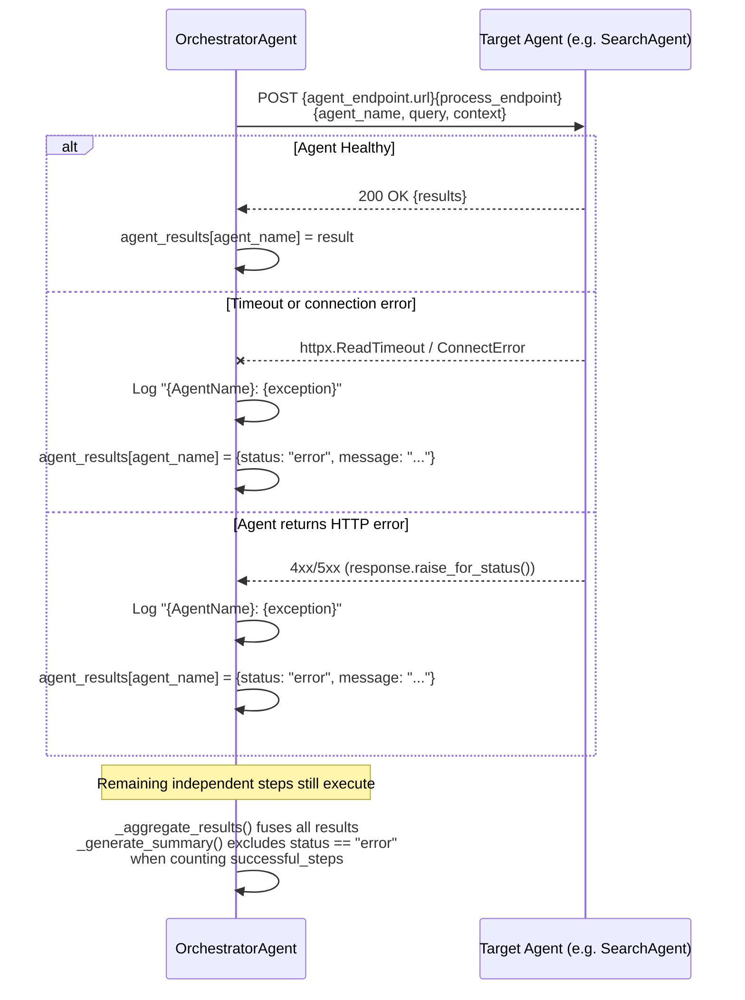

# Multi-Agent Interactions and Communication Flows

## Overview

This document describes how agents communicate with each other in the Cogniverse multi-agent system using Google's A2A (Agent-to-Agent) protocol. It provides comprehensive sequence diagrams showing the complete flow of messages between agents, the orchestrator, and the agent registry.

## Agent Inventory

Cogniverse has 23 agents, declared under `agents.*` in `configs/config.json` and implemented in `libs/agents/cogniverse_agents/`. Ports below are the `url` each agent is registered with in `config.json` (the port actually used when the unified runtime dispatches to it); a few agents also define a different default port in their own `__init__`, used only when that agent's module is launched as a standalone process — those are noted.

### Search & Analysis Agents

| Agent | Port | Enabled | Description |
|---|---|---|---|
| `search_agent` | 8002 | yes | Multi-modal retrieval agent (video/image/text/audio/document) against Vespa, with DSPy query rewriting, multi-query and multi-profile RRF ensemble fusion, and optional RLM synthesis over large result sets |
| `image_search_agent` | 8006 (code default 8005 standalone) | yes | ColPali multi-vector image similarity search against Vespa, with semantic and hybrid (BM25+ColPali) modes plus image-to-image lookup |
| `document_agent` | 8008 (code default 8007 standalone) | yes | Dual-strategy document search: ColPali visual (page-as-image), ColBERT/BM25 text, or hybrid, with keyword-based auto strategy selection |
| `text_analysis_agent` | 8003 (code `DEFAULT_PORT` 8005 standalone) | yes | Runtime-configurable DSPy text analysis agent (sentiment/summary/entities) with per-tenant persisted config and a FastAPI `/analyze` endpoint |
| `audio_analysis_agent` | 8007 (code default 8006 standalone) | yes | Whisper transcription plus Vespa audio search agent supporting transcript (BM25), acoustic (CLAP nearest-neighbor), and hybrid modes |

### Generation & Routing Agents

| Agent | Port | Enabled | Description |
|---|---|---|---|
| `gateway_agent` | 8000 (code default 8014 standalone) | yes | LLM-free A2A entry point that classifies queries via GLiNER plus deterministic modality keywords and routes simple queries directly, complex ones to the orchestrator |
| `orchestrator_agent` | 8013 | yes | Autonomous coordinator that plans a multi-agent workflow with DSPy (`_create_plan`), then executes it (`_execute_plan`) by calling sub-agents over A2A HTTP |
| `summarizer_agent` | 8004 (code default 8003 standalone) | yes | A2A summarizer that turns search results into structured summaries with a thinking phase and VLM visual analysis |
| `detailed_report_agent` | 8005 (code default 8004 standalone) | yes | Generates comprehensive detailed reports (executive summary, findings, technical + visual analysis, recommendations) with optional RLM synthesis |
| `profile_selection_agent` | 8000 (code default 8011 standalone) | yes | Uses DSPy LLM reasoning to pick the optimal backend search profile for a query, with a heuristic fallback |
| `query_enhancement_agent` | 8000 (code default 8012 standalone) | yes | Expands and rewrites queries with synonyms, context, and RRF variants using DSPy |
| `entity_extraction_agent` | 8000 (code default 8010 standalone) | yes | Tiered A2A NER agent: fast GLiNER + SpaCy path (no LLM) with a DSPy ChainOfThought fallback |

### Research & Coding Agents

| Agent | Port | Enabled | Description |
|---|---|---|---|
| `deep_research_agent` | 8009 | yes | Multi-step research agent that decomposes a query, iteratively gathers evidence via parallel searches, and synthesizes a cited report |
| `coding_agent` | 8010 | yes | Iterative coding agent that searches code semantically, plans and generates code with DSPy, and runs it in an OpenShell sandbox, looping on failures |

### Knowledge-Graph & Reasoning Agents

| Agent | Port | Enabled | Description |
|---|---|---|---|
| `citation_tracing_agent` | 8019 | no | Read-only agent that walks a memory's provenance chain (`ProvenanceWalker`) back to its primary sources |
| `contradiction_reconciliation_agent` | 8020 | no | Resolves conflict sets by applying a knowledge schema's contradiction policy (latest_wins / trust_ranked / preserve_both) over member memories |
| `multi_document_synthesis_agent` | 8021 | no | Synthesizes a coherent answer across N source documents while preserving the citation graph |
| `kg_traversal_agent` | 8022 | no | Structurally walks `kg_node`/`entity_fact` and `kg_edge` memories from a seed entity into a node+edge graph view |
| `temporal_reasoning_agent` | 8025 | no | Compares a subject's knowledge across explicit time windows using `provenance.written_at` |
| `knowledge_summarization_agent` | 8026 | no | Distills a knowledge subgraph into a structured, citation-aware summary with optional admin-gated promotion to the org trunk |
| `audit_explanation_agent` | 8027 | **yes** | Explains why a given answer memory was produced — its derivation chain, per-source trust, and active contradictions; the only knowledge-tier agent enabled by default |

### Multi-Tenant & Federation Agents

| Agent | Port | Enabled | Description |
|---|---|---|---|
| `cross_tenant_comparison_agent` | 8023 | no | Read-only agent that compares per-tenant views of one subject across all tenants in an org via the federation read path |
| `federated_query_agent` | 8024 | no | Read-only agent that answers a free-text query by aggregating federated reads across multiple tenants in the same org, with an optional RLM summarizer |

The knowledge-graph, reasoning, and multi-tenant/federation agents (ports 8019-8027) are disabled by default in `config.json` and are reached through the `/admin/tenants/{tenant_id}/knowledge/*` REST routes (`libs/runtime/cogniverse_runtime/routers/knowledge.py`) rather than through the A2A flows described below, which focus on the enabled search/generation/routing/research agents.

## A2A Protocol Basics

### Message Format

All agents communicate using standardized A2A Task messages:

```json
{
  "id": "task_uuid",
  "messages": [
    {
      "role": "user",
      "parts": [
        {
          "type": "text",
          "text": "User query or instruction"
        },
        {
          "type": "data",
          "data": {
            "key": "value",
            "additional_context": {}
          }
        }
      ]
    }
  ]
}
```

### Standard Endpoints

There are two ways agents are reached, and each exposes a different endpoint surface.

**Standalone agent process**: only 4 of the 23 agents define their own FastAPI app (`app = FastAPI(...)`) and can run as an independent process — `search_agent.py`, `summarizer_agent.py`, `detailed_report_agent.py`, and `text_analysis_agent.py`. The other 19 have no standalone app in this codebase and are only reachable through the unified runtime.

- `search_agent.py`, `summarizer_agent.py`, `detailed_report_agent.py` each expose: `GET /health`, `GET /agent.json`, `POST /process`
- `text_analysis_agent.py` exposes: `GET /health`, `GET /agent.json`, `POST /analyze` (not `/process`) — it mixes in `A2AEndpointsMixin` but does not call `setup_a2a_endpoints()`

**Unified runtime** (the common deployment: all 23 agents run in-process inside `libs/runtime/cogniverse_runtime/main.py`, reached through the shared `AgentDispatcher` via the `/agents` router):

1. **`POST /agents/{agent_name}/process`** - Main task processing endpoint
2. **`GET /agents/{agent_name}/card`** - Agent card with capabilities
3. **`GET /health`** - Runtime-level health check

`A2AEndpointsMixin` (`libs/core/cogniverse_core/agents/a2a_mixin.py`) additionally defines `GET /.well-known/agent-card.json` (the Google A2A standard well-known URI) as a reusable helper. It is currently mixed into `TextAnalysisAgent` only, and its `setup_a2a_endpoints()` method is not invoked by any running app, so this endpoint is not mounted in the current codebase.

### Agent Lifecycle

```text
Initialize → Register (config-driven, or self-register when standalone) → Start Server → Process Tasks → Shutdown
```

## 1. Agent Registry and Discovery Flow

### Agent Registration

In the unified runtime, agents are registered **in-process at startup**, not via an HTTP self-registration call. `ConfigLoader.load_agents()` (`libs/runtime/cogniverse_runtime/config_loader.py`) runs during the FastAPI lifespan startup, before uvicorn starts serving: for every enabled entry under `agents.*` in `config.json` it resolves the agent class from `AGENT_CLASSES`, then calls `AgentRegistry.register_agent_from_data()` directly with `{name, url, capabilities, health_endpoint: "/health", process_endpoint: f"/agents/{agent_name}/process", timeout}`.

`A2AEndpointsMixin.register_with_registry(registry_url)` also exists as a reusable helper that POSTs the same shape of registration data to `{registry_url}/register` over HTTP, for agents deployed as independent standalone processes outside the unified runtime. It is defined but not currently called by any agent in this codebase.


```mermaid
sequenceDiagram
    participant Config as config.json (agents.*)
    participant Loader as ConfigLoader
    participant Registry as AgentRegistry
    participant Router as /agents router
    participant Dispatcher as AgentDispatcher

    Note over Loader: FastAPI lifespan startup<br/>(before uvicorn serves)
    Loader->>Config: Read agents.* entries
    loop For each enabled agent
        Loader->>Loader: Resolve class from AGENT_CLASSES
        Loader->>Registry: register_agent_from_data(<br/>{name, url, capabilities,<br/>health_endpoint: "/health",<br/>process_endpoint: "/agents/{name}/process"})
        Registry->>Registry: register_agent(agent_endpoint)
        Registry->>Registry: Update capability mapping
    end

    Note over Router,Registry: Agent Discovery (external caller)
    Router->>Registry: find_agents_by_capability(capability)
    Registry-->>Router: [AgentEndpoint, ...]
    Router-->>Router: GET /agents/by-capability/{capability}<br/>{capability, count, agents: [{name, url, capabilities, health_status}]}

    Note over Router,Dispatcher: Task Execution
    Router->>Router: POST /agents/{agent_name}/process
    Router->>Dispatcher: dispatch(agent_name, query, context)
    Dispatcher-->>Router: Agent response
```

### Key Points

- **Config-Driven Registration**: `ConfigLoader.load_agents()` registers every enabled agent from `config.json` directly into the in-process `AgentRegistry` at runtime startup; there is no HTTP round trip for this path
- **Self-Registration Helper**: `A2AEndpointsMixin.register_with_registry(registry_url)` POSTs to `{registry_url}/register` for standalone deployments; defined in `libs/core/cogniverse_core/agents/a2a_mixin.py` but not invoked anywhere in the current codebase
- **Capability-Based Discovery**: Callers discover agents by querying `GET /agents/by-capability/{capability}` (e.g., `/agents/by-capability/search`, `/agents/by-capability/profile_selection`), which returns every registered agent with that capability regardless of health status
- **Health Status Field**: Each `AgentEndpoint` carries a cached `health_status` (default `"unknown"` until checked); see [Agent Registry Health Monitoring](#5-agent-registry-health-monitoring) for how and when it is actually updated

---

## 2. Complete Query Flow with Orchestrator

This diagram shows the full end-to-end flow from user query to final results, including parallel planning and ensemble search execution. In the unified runtime, the Gateway's direct dispatch (simple path) and Gateway→Orchestrator handoff (complex path) are **in-process** Python calls inside the shared `AgentDispatcher` — not network hops. Once the Orchestrator plans a workflow, its calls to Profile Selection, Entity Extraction, and Search **are** real HTTP calls (`httpx`) to each agent's `process_endpoint`, which in the unified runtime loops back to `POST /agents/{agent_name}/process` on the same running server.


```mermaid
sequenceDiagram
    participant User
    participant Gateway as GatewayAgent
    participant Orch as OrchestratorAgent
    participant Prof as ProfileSelectionAgent
    participant Entity as EntityExtractionAgent
    participant Search as SearchAgent
    participant Backend as VespaSearchBackend

    User->>Gateway: POST /agents/gateway_agent/process<br/>{query: "show me robots playing soccer"}

    Note over Gateway: GLiNER-based entity check +<br/>deterministic classification (simple vs. complex, no LLM)

    alt Simple query
        Gateway->>Search: in-process dispatch<br/>{query, modality: "video"}
        Search->>Backend: search(query_dict) [in-process]
        Backend-->>Search: Results
        Search-->>Gateway: {results: [...]}
        Gateway-->>User: {results: [...], gateway: {complexity: "simple", routed_to: "search_agent"}}
    else Complex query
        Gateway->>Orch: in-process handoff with gateway_context<br/>{modality, generation_type, confidence}

        Note over Orch: DSPy OrchestrationSignature plans a<br/>per-query agent_sequence + parallel_steps<br/>from available_agents (never fixed)

        opt Plan includes preprocessing agents
            par Profile Selection (if planned)
                Orch->>Prof: POST /agents/profile_selection_agent/process<br/>{query, available_profiles}
                Note over Prof: LLM Reasoning<br/>(DSPy ChainOfThought)
                Prof-->>Orch: {selected_profile: "colpali",<br/>confidence: 0.85, alternatives: [...], modality: "video"}
            and Entity Extraction (if planned)
                Orch->>Entity: POST /agents/entity_extraction_agent/process<br/>{query}
                Entity->>Entity: Extract entities (GLiNER + DSPy)
                Entity-->>Orch: {entities: ["robots", "soccer"],<br/>entity_count: 2, dominant_types: ["CONCEPT"]}
            end
        end

        Note over Orch: Execute planned execution agent<br/>(search_agent, summarizer_agent, etc.)

        alt Ensemble Mode (profiles specified)
            Orch->>Search: POST /agents/search_agent/process<br/>{query, profiles: ["colpali", "videoprism"], modality: "video"}

            Note over Search: Parallel Profile Execution
            par Profile 1: ColPali
                Search->>Backend: search(query_dict)<br/>{profile: "colpali", query_embedding}
                Backend-->>Search: Results 1 (ranked by ColPali similarity)
            and Profile 2: VideoPrism
                Search->>Backend: search(query_dict)<br/>{profile: "videoprism", query_embedding}
                Backend-->>Search: Results 2 (ranked by VideoPrism similarity)
            end

            Search->>Search: RRF Fusion<br/>score(doc) = Σ 1/(k+rank)
            Search-->>Orch: {results: [...fused_results...],<br/>metadata: {profiles_used, rrf_scores}}
        else Single Profile Mode (single profile)
            Orch->>Search: POST /agents/search_agent/process<br/>{query, modality: "video"}
            Search->>Backend: search(query_dict)
            Backend-->>Search: Results
            Search-->>Orch: {results: [...]}
        end

        Orch->>Orch: _aggregate_results() + metadata
        Orch-->>Gateway: {results: [...],<br/>metadata: {planning_time, search_time, profiles_used}}
        Gateway-->>User: {results: [...],<br/>metadata: {...}}
    end
```

### Timeline Analysis

**Gateway Classification**: ~20-50ms (in-process GLiNER entity check + deterministic rules, no LLM call, target <100ms)

**Planning Phase (when the query is routed to the orchestrator)**:

- The DSPy `OrchestrationSignature` plans the agent sequence per query; preprocessing agents it selects (profile selection, entity extraction, query enhancement) run in the parallel groups it specifies
- Profile Selection: ~100-150ms (DSPy LLM inference), when planned
- Entity Extraction: ~50-100ms (DSPy LLM inference), when planned
- **Total**: ~150-200ms when both preprocessing agents are planned in parallel; 0ms when the plan skips preprocessing entirely

**Action Phase (Sequential or Parallel)**:

- Single Profile Search: ~400-600ms
- Ensemble Search (2-3 profiles): ~500-700ms (parallel execution)
- RRF Fusion: ~5-10ms
- **Total**: ~500-700ms

**End-to-End Latency**: ~450-900ms depending on gateway classification and whether the orchestrator plans preprocessing agents

---

## 3. ProfileSelectionAgent Decision Flow

This flowchart shows how the ProfileSelectionAgent makes intelligent decisions about which profile to select based on query characteristics.


```mermaid
flowchart TD
    Start[<span style='color:#000'>A2A Task Received</span>] --> Parse[<span style='color:#000'>Parse Task Message</span>]
    Parse --> Extract[<span style='color:#000'>Extract Query Features</span>]

    Extract --> Entities[<span style='color:#000'>Count Entities</span>]
    Extract --> EntityTypes[<span style='color:#000'>Entity Types</span>]
    Extract --> Length[<span style='color:#000'>Query Length</span>]
    Extract --> Keywords[<span style='color:#000'>Visual/Temporal Keywords</span>]

    Entities --> Features[<span style='color:#000'>Aggregate Features</span>]
    EntityTypes --> Features
    Length --> Features
    Keywords --> Features

    Features --> LLM[<span style='color:#000'>LLM Reasoning via DSPy ChainOfThought</span>]

    LLM --> Reasoning{<span style='color:#000'>LLM Output</span>}
    Reasoning --> Profile[<span style='color:#000'>Selected Profile<br/>selected_profile</span>]
    Reasoning --> Confidence[<span style='color:#000'>Confidence Score</span>]
    Reasoning --> Explanation[<span style='color:#000'>Reasoning Text</span>]
    Reasoning --> Intent[<span style='color:#000'>Query Intent</span>]
    Reasoning --> Modality[<span style='color:#000'>Modality</span>]

    Profile --> Alternatives[<span style='color:#000'>Generate Alternatives<br/>alternatives list</span>]
    Confidence --> Alternatives
    Modality --> Alternatives

    Alternatives --> Response[<span style='color:#000'>Build A2A Response</span>]
    Intent --> Response
    Explanation --> Response

    Response --> Return[<span style='color:#000'>Return to Orchestrator</span>]

    style Start fill:#90caf9,stroke:#1565c0,color:#000
    style Parse fill:#ffcc80,stroke:#ef6c00,color:#000
    style Extract fill:#ffcc80,stroke:#ef6c00,color:#000
    style Entities fill:#ffcc80,stroke:#ef6c00,color:#000
    style EntityTypes fill:#ffcc80,stroke:#ef6c00,color:#000
    style Length fill:#ffcc80,stroke:#ef6c00,color:#000
    style Keywords fill:#ffcc80,stroke:#ef6c00,color:#000
    style Features fill:#ffcc80,stroke:#ef6c00,color:#000
    style LLM fill:#81d4fa,stroke:#0288d1,color:#000
    style Reasoning fill:#ffcc80,stroke:#ef6c00,color:#000
    style Profile fill:#a5d6a7,stroke:#388e3c,color:#000
    style Confidence fill:#a5d6a7,stroke:#388e3c,color:#000
    style Explanation fill:#a5d6a7,stroke:#388e3c,color:#000
    style Intent fill:#a5d6a7,stroke:#388e3c,color:#000
    style Modality fill:#a5d6a7,stroke:#388e3c,color:#000
    style Alternatives fill:#ffcc80,stroke:#ef6c00,color:#000
    style Response fill:#ce93d8,stroke:#7b1fa2,color:#000
    style Return fill:#ce93d8,stroke:#7b1fa2,color:#000
```

### Decision Criteria

**Profile Selection Factors**:

- Query complexity (simple/medium/complex)
- Query intent (text_search, video_search, image_search, etc.)
- Target modality (video, image, text, audio)
- Entity count and types
- LLM confidence score (0.0-1.0)

**Profile Selection Output**:

- Single selected_profile (best match)
- Confidence score
- Alternative profiles (ranked by relevance)
- Query analysis (intent, modality, complexity)

---

## 4. Ensemble Search with RRF Fusion

This diagram shows the detailed execution flow for ensemble search with Reciprocal Rank Fusion.

```mermaid
flowchart TB
    Start[<span style='color:#000'>User Query</span>] --> Encode{<span style='color:#000'>For Each Selected Profile</span>}

    Encode -->|Profile 1| Enc1[<span style='color:#000'>Encode with ColPali</span>]
    Encode -->|Profile 2| Enc2[<span style='color:#000'>Encode with VideoPrism</span>]
    Encode -->|Profile 3| Enc3[<span style='color:#000'>Encode with Qwen</span>]

    Enc1 --> Search1[<span style='color:#000'>Backend Search<br/>Profile: colpali</span>]
    Enc2 --> Search2[<span style='color:#000'>Backend Search<br/>Profile: videoprism</span>]
    Enc3 --> Search3[<span style='color:#000'>Backend Search<br/>Profile: qwen</span>]

    Search1 --> Results1[<span style='color:#000'>Results 1<br/>Ranked by ColPali</span>]
    Search2 --> Results2[<span style='color:#000'>Results 2<br/>Ranked by VideoPrism</span>]
    Search3 --> Results3[<span style='color:#000'>Results 3<br/>Ranked by Qwen</span>]

    Results1 --> RRF[<span style='color:#000'>RRF Fusion Algorithm</span>]
    Results2 --> RRF
    Results3 --> RRF

    RRF --> Calc[<span style='color:#000'>For each document:<br/>score = Σ 1/(k + rank_in_profile)</span>]
    Calc --> Sort[<span style='color:#000'>Sort by RRF Score<br/>Descending</span>]
    Sort --> TopN[<span style='color:#000'>Select Top N Results</span>]

    TopN --> Metadata[<span style='color:#000'>Add Fusion Metadata</span>]
    Metadata --> Final[<span style='color:#000'>Return Fused Results</span>]

    style Start fill:#90caf9,stroke:#1565c0,color:#000
    style Encode fill:#ffcc80,stroke:#ef6c00,color:#000
    style Enc1 fill:#81d4fa,stroke:#0288d1,color:#000
    style Enc2 fill:#81d4fa,stroke:#0288d1,color:#000
    style Enc3 fill:#81d4fa,stroke:#0288d1,color:#000
    style Search1 fill:#a5d6a7,stroke:#388e3c,color:#000
    style Search2 fill:#a5d6a7,stroke:#388e3c,color:#000
    style Search3 fill:#a5d6a7,stroke:#388e3c,color:#000
    style Results1 fill:#a5d6a7,stroke:#388e3c,color:#000
    style Results2 fill:#a5d6a7,stroke:#388e3c,color:#000
    style Results3 fill:#a5d6a7,stroke:#388e3c,color:#000
    style RRF fill:#ffcc80,stroke:#ef6c00,color:#000
    style Calc fill:#ffcc80,stroke:#ef6c00,color:#000
    style Sort fill:#ffcc80,stroke:#ef6c00,color:#000
    style TopN fill:#ffcc80,stroke:#ef6c00,color:#000
    style Metadata fill:#b0bec5,stroke:#546e7a,color:#000
    style Final fill:#a5d6a7,stroke:#388e3c,color:#000
```

### RRF Algorithm Details

**Formula**:
```text
score(document) = Σ_profiles (1 / (k + rank_in_profile))
```

**Parameters**:

- `k = 60` (default) - Controls weight of top-ranked documents
- Profiles: 2-3 profiles maximum for optimal performance
- Rank: 0-indexed position in each profile's result list

**Example Calculation**:

Document appears in 3 profiles at ranks [2, 5, 1]:

```text
RRF score = 1/(60+2) + 1/(60+5) + 1/(60+1)
         = 1/62 + 1/65 + 1/61
         = 0.0161 + 0.0154 + 0.0164
         = 0.0479
```

**Complexity**: O(n_profiles × n_results) ~ 5-10ms for typical case

---

## 5. Agent Registry Health Monitoring

`AgentRegistry` (`libs/core/cogniverse_core/registries/agent_registry.py`) supports on-demand, cached health checks. Each `AgentEndpoint` caches its `health_status` and only re-checks once `health_check_interval` (default 60s) has elapsed, via `needs_health_check()`. `health_check_all()` fans out `health_check_agent()` calls concurrently for every stale agent — but `health_check_all()` is not called from any scheduled loop in the current codebase, so health status only updates when something explicitly invokes it (there is no background poller wired into `main.py`). `find_agents_by_capability()` (used by the `/agents/by-capability/{capability}` route) returns every matching agent regardless of health status; only `get_load_balanced_agent()` filters by health.


```mermaid
sequenceDiagram
    participant Caller
    participant Registry as AgentRegistry
    participant Agent1 as SearchAgent
    participant Agent2 as ProfileSelectionAgent
    participant Agent3 as EntityExtractionAgent

    Caller->>Registry: health_check_all()
    Note over Registry: Only agents where<br/>needs_health_check() is true<br/>(cache older than 60s)

    par Health Check Agent 1
        Registry->>Agent1: GET /health (timeout 5s)
        Agent1-->>Registry: 200 OK
        Registry->>Registry: search_agent.health_status = "healthy"
    and Health Check Agent 2
        Registry->>Agent2: GET /health (timeout 5s)
        Agent2-->>Registry: 200 OK
        Registry->>Registry: profile_selection_agent.health_status = "healthy"
    and Health Check Agent 3
        Registry->>Agent3: GET /health (timeout 5s)
        Note over Agent3: Agent Unavailable
        Agent3--xRegistry: Timeout / connection error
        Registry->>Registry: entity_extraction_agent.health_status = "unreachable"
    end

    Caller->>Registry: get_registry_stats()
    Registry-->>Caller: {total_agents, healthy_agents,<br/>capability_stats: {...}}

    Caller->>Registry: get_load_balanced_agent("profile_selection")
    Registry->>Registry: find_agents_by_capability(...)<br/>filter to is_healthy()
    Registry-->>Caller: First healthy candidate<br/>(or first registered if none healthy)
```

### Health Status States

- **unknown**: Default state before any health check has run
- **healthy**: Agent responded with 200 OK
- **unhealthy**: Agent responded with non-200 status
- **unreachable**: Agent timed out or connection failed

### Load Balancing Strategy (`get_load_balanced_agent`)

1. **Filter**: Candidates for the capability, restricted to `is_healthy()`
2. **Selection**: Returns the first healthy candidate — the code comment notes round-robin as a possible future enhancement, but the current implementation always picks `healthy_candidates[0]`
3. **Fallback**: If no candidate is healthy, returns the first registered candidate for that capability (or `None` if there are none)

---

## 6. Complete Agent Lifecycle

This diagram shows the lifecycle of an agent running as its own standalone FastAPI process (e.g. launching `search_agent.py`, `summarizer_agent.py`, or `text_analysis_agent.py` directly). In the unified runtime, `AgentDispatcher` instead builds most agent instances per request (or per-tenant, cached) inside an already-running server — there is no separate init/register/serve lifecycle per agent; only the runtime process itself goes through startup once (`ConfigLoader.load_agents()` at FastAPI lifespan startup) and serves for as long as it runs.

```mermaid
flowchart TB
    Start((<span style='color:#000'>Start</span>)) --> Initializing[<span style='color:#000'>Initializing</span>]

    Initializing --> ConfigLoading[<span style='color:#000'>Config Loading</span>]
    ConfigLoading --> DSPySetup[<span style='color:#000'>DSPy Setup</span>]
    DSPySetup --> ServerStartup[<span style='color:#000'>Server Startup<br/>uvicorn.run(app)</span>]
    ServerStartup --> Ready[<span style='color:#000'>Ready</span>]

    Ready --> Processing[<span style='color:#000'>Processing<br/>POST /process</span>]
    Processing --> DSPyProcessing[<span style='color:#000'>DSPy Processing</span>]
    DSPyProcessing --> ResponseSent[<span style='color:#000'>Response Sent</span>]
    ResponseSent --> Ready

    Ready --> HealthCheck[<span style='color:#000'>Health Check<br/>GET /health</span>]
    HealthCheck --> Ready

    Ready --> Shutdown[<span style='color:#000'>Shutdown</span>]
    Shutdown --> End((<span style='color:#000'>End</span>))

    style Start fill:#b0bec5,stroke:#546e7a,color:#000
    style Initializing fill:#90caf9,stroke:#1565c0,color:#000
    style ConfigLoading fill:#90caf9,stroke:#1565c0,color:#000
    style DSPySetup fill:#90caf9,stroke:#1565c0,color:#000
    style ServerStartup fill:#ffcc80,stroke:#ef6c00,color:#000
    style Ready fill:#a5d6a7,stroke:#388e3c,color:#000
    style Processing fill:#ce93d8,stroke:#7b1fa2,color:#000
    style DSPyProcessing fill:#ce93d8,stroke:#7b1fa2,color:#000
    style ResponseSent fill:#ce93d8,stroke:#7b1fa2,color:#000
    style HealthCheck fill:#a5d6a7,stroke:#388e3c,color:#000
    style Shutdown fill:#b0bec5,stroke:#546e7a,color:#000
    style End fill:#b0bec5,stroke:#546e7a,color:#000
```

**State Notes:**

- **Server Startup**: `A2AEndpointsMixin.register_with_registry(registry_url)` is available for a standalone agent to self-register with a remote registry at this point, but no agent in the current codebase calls it — see [Agent Registration](#1-agent-registry-and-discovery-flow)
- **Processing**: Type-safe processing, multi-tenant isolation, telemetry tracking

---

## 7. Error Handling

`OrchestratorAgent._execute_plan()` (`libs/agents/cogniverse_agents/orchestrator_agent.py`) calls each planned step's agent via `httpx` inside a try/except. There is no automatic retry, no marking the agent unhealthy in the registry, and no failover to an alternate instance — a failed step is caught, logged with its exception type and message, and recorded as an error result for that step. The plan continues executing the remaining (independent) steps; `_aggregate_results()` still fuses whatever `agent_results` it has (error entries included), while `_generate_summary()` separately counts `successful_steps` by excluding entries whose result has `status == "error"`.


```mermaid
sequenceDiagram
    participant Orch as OrchestratorAgent
    participant Agent as Target Agent (e.g. SearchAgent)

    Orch->>Agent: POST {agent_endpoint.url}{process_endpoint}<br/>{agent_name, query, context}

    alt Agent Healthy
        Agent-->>Orch: 200 OK {results}
        Orch->>Orch: agent_results[agent_name] = result
    else Timeout or connection error
        Agent--xOrch: httpx.ReadTimeout / ConnectError
        Orch->>Orch: Log "{AgentName}: {exception}"
        Orch->>Orch: agent_results[agent_name] = {status: "error", message: "..."}
    else Agent returns HTTP error
        Agent-->>Orch: 4xx/5xx (response.raise_for_status())
        Orch->>Orch: Log "{AgentName}: {exception}"
        Orch->>Orch: agent_results[agent_name] = {status: "error", message: "..."}
    end

    Note over Orch: Remaining independent steps still execute
    Orch->>Orch: _aggregate_results() fuses all results<br/>_generate_summary() excludes status == "error"<br/>when counting successful_steps
```

---

## 8. Multi-Tenant Isolation

All agents support multi-tenant isolation using tenant_id for data and telemetry separation.

```mermaid
flowchart TD
    Request[<span style='color:#000'>A2A Task with tenant_id</span>] --> Extract[<span style='color:#000'>Extract tenant_id from task</span>]

    Extract --> Validate{<span style='color:#000'>tenant_id valid?</span>}
    Validate -->|No| Error[<span style='color:#000'>Return 400 Bad Request</span>]
    Validate -->|Yes| TenantContext[<span style='color:#000'>Create tenant context</span>]

    TenantContext --> Telemetry[<span style='color:#000'>Telemetry<br/>Project: cogniverse-{tenant_id}</span>]
    TenantContext --> Config[<span style='color:#000'>Load tenant configuration</span>]
    TenantContext --> Memory[<span style='color:#000'>Memory isolation</span>]

    Telemetry --> Process[<span style='color:#000'>Process with DSPy</span>]
    Config --> Process
    Memory --> Process

    Process --> Results[<span style='color:#000'>Return results</span>]
    Results --> Trace[<span style='color:#000'>Export telemetry trace<br/>to tenant-specific project</span>]

    style Request fill:#90caf9,stroke:#1565c0,color:#000
    style Extract fill:#ffcc80,stroke:#ef6c00,color:#000
    style Validate fill:#ffcc80,stroke:#ef6c00,color:#000
    style Error fill:#e53935,stroke:#c62828,color:#000
    style TenantContext fill:#90caf9,stroke:#1565c0,color:#000
    style Telemetry fill:#a5d6a7,stroke:#388e3c,color:#000
    style Config fill:#b0bec5,stroke:#546e7a,color:#000
    style Memory fill:#90caf9,stroke:#1565c0,color:#000
    style Process fill:#ce93d8,stroke:#7b1fa2,color:#000
    style Results fill:#a5d6a7,stroke:#388e3c,color:#000
    style Trace fill:#a5d6a7,stroke:#388e3c,color:#000
```

---

## Performance Characteristics

### Latency Breakdown (Typical Query)

| Phase | Component | Latency | Parallelizable |
|-------|-----------|---------|----------------|
| Planning | Profile Selection | 100-150ms | ✅ Yes |
| Planning | Entity Extraction | 50-100ms | ✅ Yes |
| **Planning Total** | **Both agents** | **150-200ms** | **Parallel** |
| Action | Single Profile Search | 400-600ms | ❌ No |
| Action | Ensemble Search (2-3) | 500-700ms | ✅ Yes (profiles) |
| Action | RRF Fusion | 5-10ms | ❌ No |
| **Action Total** | **Search + Fusion** | **500-710ms** | **Profiles parallel** |
| **End-to-End** | **Complete flow** | **650-910ms** | **Planning + Action** |

### Network Calls

`AgentRegistry` is shared in-process between `AgentDispatcher` and `OrchestratorAgent` (passed as a Python object, not queried over HTTP), so registry lookups (`find_agents_by_capability`, `get_agent`) never count as network calls in the unified runtime. Only the Orchestrator's calls out to specialized agents (`httpx.post` to each `agent_endpoint.url + process_endpoint`) are real HTTP.

**Simple query** (Gateway routes directly via `SIMPLE_ROUTE_MAP`):

- **Total**: 0 HTTP calls — Gateway → execution agent is an in-process dispatch within the same runtime process

**Complex query, single profile** (Orchestrator plans one preprocessing agent + one execution agent):

- 1× Profile selection task (`POST /agents/profile_selection_agent/process`)
- 1× Search task (`POST /agents/search_agent/process`)
- **Total**: 2 HTTP calls

**Complex query, ensemble with 3 profiles** (Orchestrator plans both preprocessing agents in parallel + one execution agent):

- 2× Planning tasks (profile selection + entity extraction, in parallel)
- 1× Search task (search agent internally fans out to 3 backend profile queries in-process, not separate HTTP calls)
- **Total**: 3 HTTP calls (2 parallel)

---

## See Also

- [Agents Module Documentation](../modules/agents.md) - Implementation details for all agents
- [Ensemble Composition](./ensemble-composition.md) - Deep dive into RRF algorithm
- [A2A Protocol Specification](https://github.com/google/a2a) - Google's A2A protocol spec
- [Multi-Tenant Architecture](./multi-tenant.md) - Tenant isolation design
