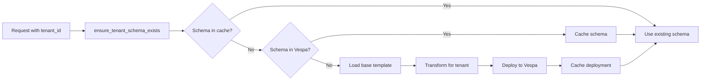
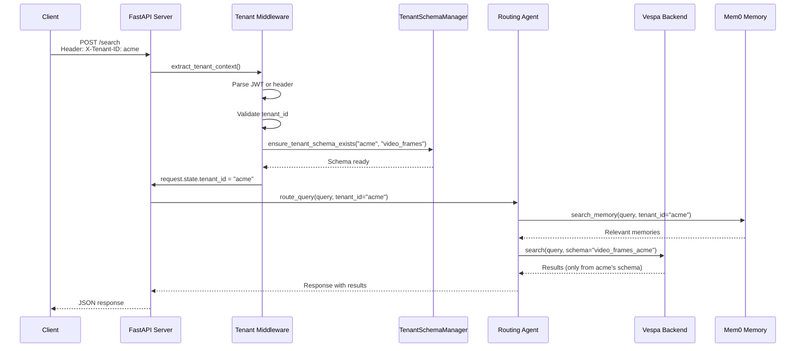
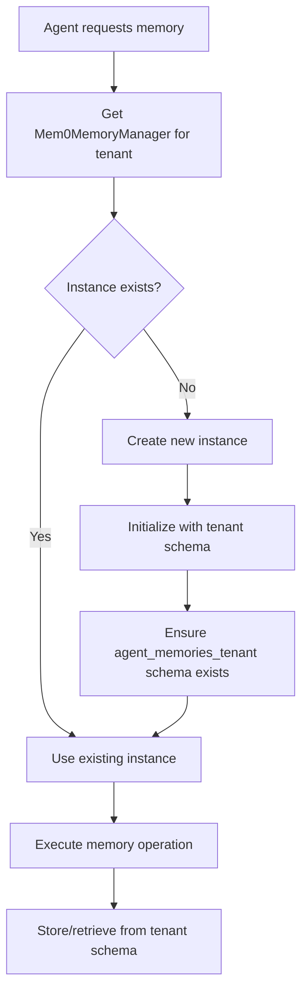
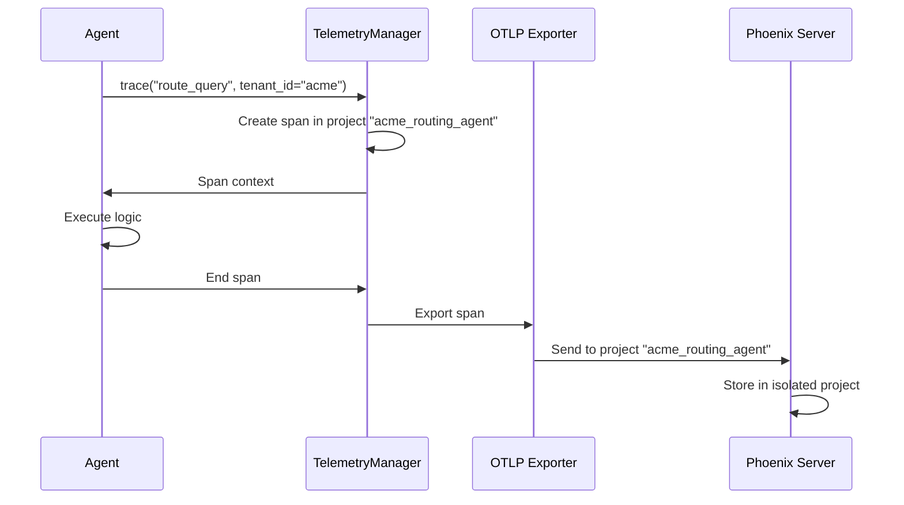
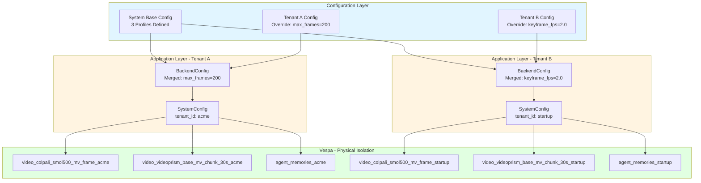
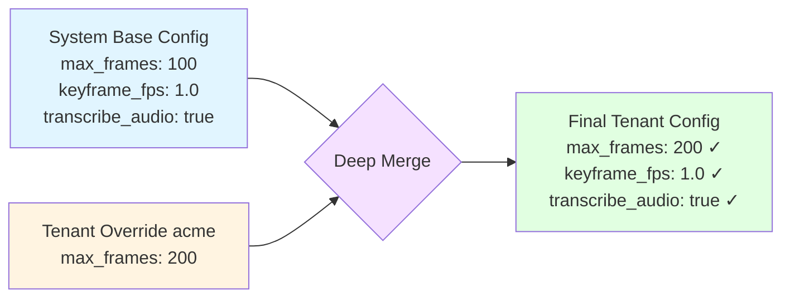

# Cogniverse Multi-Tenant Architecture

**Last Updated:** 2025-10-15
**Purpose:** Comprehensive guide to Cogniverse's multi-tenant architecture with schema-per-tenant isolation
**Audience:** DevOps, SRE, and developers implementing or operating multi-tenant features

---

## Table of Contents

1. [Overview](#overview)
2. [Architecture Principles](#architecture-principles)
3. [Schema-Per-Tenant Pattern](#schema-per-tenant-pattern)
4. [TenantSchemaManager](#tenantschemamanager)
5. [Tenant Context Flow](#tenant-context-flow)
6. [Memory Isolation](#memory-isolation)
7. [Telemetry Isolation](#telemetry-isolation)
8. [Backend Configuration](#backend-configuration)
9. [Security and Isolation Guarantees](#security-and-isolation-guarantees)
10. [Tenant ID Formats](#tenant-id-formats)
11. [Operational Procedures](#operational-procedures)
12. [Testing Multi-Tenant Systems](#testing-multi-tenant-systems)
13. [Common Patterns](#common-patterns)
14. [Troubleshooting](#troubleshooting)

---

## Overview

Cogniverse uses **physical tenant isolation** via dedicated Vespa schemas per tenant. This architecture provides:

- **Complete Data Isolation**: Each tenant has dedicated Vespa schemas - no cross-tenant data access possible
- **No Query Filtering**: Entire schema is tenant-scoped - no tenant_id filters needed in queries
- **Independent Scaling**: Scale Vespa resources per tenant independently
- **Simplified Security**: Physical separation eliminates most multi-tenant security concerns
- **Per-Tenant Memory**: Mem0 memory manager instances are per-tenant singletons
- **Isolated Telemetry**: Phoenix projects are per-tenant for trace isolation

### Key Components

```
┌─────────────────────────────────────────────────────────────┐
│                    Tenant Context Layer                      │
│  - tenant_id extraction from JWT/headers                     │
│  - tenant_id validation and parsing                          │
│  - request.state.tenant_id injection                         │
└─────────────────────────────────────────────────────────────┘
                            ↓
┌─────────────────────────────────────────────────────────────┐
│              TenantSchemaManager (Singleton)                 │
│  - Schema name routing: base_schema + tenant_id              │
│  - Lazy schema creation from templates                       │
│  - Schema lifecycle management                               │
│  - Deployed schema caching                                   │
└─────────────────────────────────────────────────────────────┘
                            ↓
┌─────────────────────────────────────────────────────────────┐
│                    Vespa Schemas                             │
│  Tenant "acme":                                              │
│    - video_colpali_smol500_mv_frame_acme                     │
│    - agent_memories_acme                                     │
│  Tenant "startup":                                           │
│    - video_colpali_smol500_mv_frame_startup                  │
│    - agent_memories_startup                                  │
└─────────────────────────────────────────────────────────────┘
                            ↓
┌─────────────────────────────────────────────────────────────┐
│              Per-Tenant Resource Isolation                   │
│  - Mem0MemoryManager._instances[tenant_id]                   │
│  - Phoenix projects: {tenant_id}_routing_agent               │
│  - Optimization models: data/optimization/{tenant_id}/       │
└─────────────────────────────────────────────────────────────┘
```

---

## Architecture Principles

### 1. Physical Isolation Over Logical Filtering

**Principle**: Use dedicated schemas instead of tenant_id filtering in queries.

**Benefits**:
- **No Filtering Bugs**: Impossible to forget tenant_id filter
- **Performance**: No query overhead for tenant filtering
- **Security**: Physical separation eliminates cross-tenant data leaks
- **Simplicity**: Queries don't need tenant awareness

**Example**:

```python
# ❌ Logical filtering (NOT used in Cogniverse)
vespa_client.query(
    query="cooking videos",
    filter=f"tenant_id = '{tenant_id}'"  # Easy to forget!
)

# ✅ Physical isolation (Cogniverse approach)
vespa_client.query(
    query="cooking videos",
    schema=f"video_frames_{tenant_id}"  # Schema IS the tenant
)
```

### 2. Tenant ID Required Everywhere

**Principle**: No default tenant - tenant_id is required for all operations.

**Implementation**:
- All agent constructors require `tenant_id` parameter
- All API endpoints extract `tenant_id` from request
- All storage operations use tenant-specific paths
- All memory operations use tenant-specific managers

**Example**:

```python
# All agents require tenant_id
routing_agent = RoutingAgent(tenant_id="acme")  # Required!

# All storage uses tenant paths
storage_path = get_tenant_storage_path("data/optimization", "acme")
# Returns: Path("data/optimization/acme")

# All memory uses tenant managers
memory_mgr = Mem0MemoryManager(tenant_id="acme")
```

### 3. Lazy Schema Creation

**Principle**: Schemas are created on-demand when first accessed.

**Benefits**:
- **No Upfront Setup**: New tenants can start using the system immediately
- **Resource Efficiency**: Only create schemas for active tenants
- **Simplified Onboarding**: No manual schema deployment required

**Implementation**:
```python
# First request for tenant automatically creates schemas
schema_manager.ensure_tenant_schema_exists("new_tenant", "video_frames")
# Creates video_frames_new_tenant schema if not exists
```

### 4. Immutable Tenant Context

**Principle**: Tenant context set at request entry and never changes.

**Benefits**:
- **No Context Switching**: Same tenant throughout request lifecycle
- **Thread Safety**: Each request has isolated tenant context
- **Simplified Debugging**: Tenant always known from request.state

**Implementation**:
```python
# Middleware sets tenant_id once per request
request.state.tenant_id = "acme"

# All subsequent code reads from request.state
def handler(request: Request):
    tenant_id = request.state.tenant_id  # Always available
```

---

## Schema-Per-Tenant Pattern

### Overview

Each tenant gets dedicated Vespa schemas for all data types. Schemas are named by appending tenant suffix to base schema name.

### Schema Naming Convention

**Pattern**: `{base_schema_name}_{tenant_id}`

**Examples**:

| Base Schema | Tenant ID | Tenant Schema |
|------------|-----------|---------------|
| `video_colpali_smol500_mv_frame` | `acme` | `video_colpali_smol500_mv_frame_acme` |
| `video_videoprism_base_mv_chunk_30s` | `startup` | `video_videoprism_base_mv_chunk_30s_startup` |
| `agent_memories` | `acme:production` | `agent_memories_acme_production` |

**Schema Name Rules**:
- Only alphanumeric characters and underscores allowed
- Colon (`:`) in tenant_id converted to underscore (`_`)
- No hyphens allowed (Vespa limitation)
- Maximum length: 64 characters (Vespa limitation)

### Base Schema Templates

Base schemas are stored in `configs/schemas/` as JSON templates:

```
configs/schemas/
├── video_colpali_smol500_mv_frame_schema.json
├── video_videoprism_base_mv_chunk_30s_schema.json
├── agent_memories_schema.json
└── ...
```

### Schema Transformation

When deploying a tenant schema:

1. **Load** base schema JSON template
2. **Transform** schema:
   - Update schema name: `video_frames` → `video_frames_acme`
   - Update document name: `video_frames` → `video_frames_acme`
3. **Parse** JSON to Vespa `Schema` object
4. **Deploy** via VespaSchemaManager
5. **Cache** deployment in memory

**Example Transformation**:

```json
// Base schema template
{
  "name": "video_colpali_smol500_mv_frame",
  "document": {
    "name": "video_colpali_smol500_mv_frame",
    "fields": [...]
  }
}

// Transformed for tenant "acme"
{
  "name": "video_colpali_smol500_mv_frame_acme",
  "document": {
    "name": "video_colpali_smol500_mv_frame_acme",
    "fields": [...]  // Fields unchanged
  }
}
```

### Schema Lifecycle



---

## TenantSchemaManager

### Overview

`TenantSchemaManager` is the central component for managing tenant-specific Vespa schemas.

**Location**: `libs/vespa/cogniverse_vespa/tenant_schema_manager.py`

**Key Features**:
- **Singleton Pattern**: One instance per Vespa endpoint
- **Thread-Safe**: Concurrent tenant schema operations
- **Lazy Creation**: Schemas created on-demand
- **Caching**: Deployed schemas cached in memory
- **Validation**: Schema and tenant ID validation

### API Reference

#### Schema Name Generation

```python
schema_manager = TenantSchemaManager(
    vespa_url="http://localhost",
    vespa_port=8080
)

# Get tenant-specific schema name
schema_name = schema_manager.get_tenant_schema_name(
    tenant_id="acme",
    base_schema_name="video_colpali_smol500_mv_frame"
)
# Returns: "video_colpali_smol500_mv_frame_acme"
```

#### Ensuring Schema Exists

```python
# Idempotent - safe to call multiple times
schema_manager.ensure_tenant_schema_exists(
    tenant_id="acme",
    base_schema_name="video_colpali_smol500_mv_frame"
)
# Creates schema if not exists, returns True if exists or deployed
```

**Behavior**:
1. Check cache first
2. Check Vespa if not cached
3. Deploy if not in Vespa
4. Cache successful deployment

#### Deploying Schema

```python
# Explicitly deploy tenant schema
schema_manager.deploy_tenant_schema(
    tenant_id="startup",
    base_schema_name="video_colpali_smol500_mv_frame"
)
# Creates: video_colpali_smol500_mv_frame_startup
```

**Deployment Steps**:
1. Validate tenant_id and base_schema_name
2. Load base schema JSON from `configs/schemas/`
3. Transform schema for tenant (rename)
4. Parse JSON to Vespa Schema object
5. Deploy via VespaSchemaManager
6. Cache deployment

#### Listing Tenant Schemas

```python
# List all schemas for a tenant
schemas = schema_manager.list_tenant_schemas("acme")
# Returns: ['video_colpali_smol500_mv_frame_acme', 'agent_memories_acme']
```

#### Deleting Tenant Schemas

```python
# Delete all schemas for a tenant (WARNING: removes all data!)
deleted = schema_manager.delete_tenant_schemas("acme")
# Returns: List of deleted schema names
```

**Note**: Actual Vespa schema deletion requires manual redeployment without the schema.

#### Listing Available Base Schemas

```python
# List all available base schema templates
base_schemas = schema_manager.list_available_base_schemas()
# Returns: ['video_colpali_smol500_mv_frame', 'agent_memories', ...]
```

#### Cache Management

```python
# Get cache statistics (for monitoring)
stats = schema_manager.get_cache_stats()
# Returns:
# {
#   "tenants_cached": 2,
#   "total_schemas_cached": 4,
#   "tenants": {
#     "acme": ["video_frames", "agent_memories"],
#     "startup": ["video_frames", "agent_memories"]
#   }
# }

# Clear cache (for testing)
schema_manager.clear_cache()
```

#### Validation

```python
# Validate tenant schema exists and is healthy
is_valid = schema_manager.validate_tenant_schema(
    tenant_id="acme",
    base_schema_name="video_frames"
)
# Returns: True if schema exists in Vespa
```

### Integration with Application Code

**Backend Initialization**:

```python
from cogniverse_vespa.tenant_schema_manager import TenantSchemaManager
from cogniverse_vespa.vespa_search_client import VespaSearchClient

# Initialize schema manager
schema_manager = TenantSchemaManager(
    vespa_url="http://vespa.prod.internal",
    vespa_port=8080
)

# Ensure schemas exist for tenant
schema_manager.ensure_tenant_schema_exists("acme", "video_frames")
schema_manager.ensure_tenant_schema_exists("acme", "agent_memories")

# Create search client with tenant schema
search_client = VespaSearchClient(
    host="vespa.prod.internal",
    port=8080,
    schema=schema_manager.get_tenant_schema_name("acme", "video_frames")
)
```

**Agent Initialization**:

```python
from cogniverse_agents.routing_agent import RoutingAgent
from cogniverse_vespa.tenant_schema_manager import TenantSchemaManager

# Ensure tenant schemas exist
schema_manager = TenantSchemaManager()
schema_manager.ensure_tenant_schema_exists("acme", "agent_memories")

# Initialize agent with tenant_id
routing_agent = RoutingAgent(tenant_id="acme")
# Agent automatically uses acme-specific resources
```

---

## Tenant Context Flow

### Request Lifecycle



### Tenant ID Extraction

Tenant ID is extracted from HTTP requests using one of these methods:

1. **Header-Based** (Development/Internal):
   ```http
   GET /search?query=cooking
   X-Tenant-ID: acme
   ```

2. **JWT-Based** (Production):
   ```http
   GET /search?query=cooking
   Authorization: Bearer eyJhbGciOi...
   # JWT contains: { "tenant_id": "acme", ... }
   ```

3. **Subdomain-Based** (Multi-domain):
   ```http
   GET https://acme.cogniverse.app/search?query=cooking
   # Extract "acme" from subdomain
   ```

### Middleware Implementation

**Location**: `libs/runtime/cogniverse_runtime/middleware/` (future location)

**Example Middleware**:

```python
from fastapi import Request
from cogniverse_vespa.tenant_schema_manager import TenantSchemaManager

async def inject_tenant_context(request: Request, call_next):
    """Extract and validate tenant_id, ensure schemas exist"""

    # Extract tenant_id from header or JWT
    tenant_id = request.headers.get("X-Tenant-ID")
    if not tenant_id:
        # Parse JWT
        jwt_token = request.headers.get("Authorization", "").replace("Bearer ", "")
        payload = decode_jwt(jwt_token)
        tenant_id = payload.get("tenant_id")

    if not tenant_id:
        return JSONResponse(
            status_code=400,
            content={"error": "tenant_id required"}
        )

    # Validate tenant_id format
    validate_tenant_id(tenant_id)

    # Ensure tenant schemas exist
    schema_manager = TenantSchemaManager()
    schema_manager.ensure_tenant_schema_exists(tenant_id, "video_frames")
    schema_manager.ensure_tenant_schema_exists(tenant_id, "agent_memories")

    # Inject into request state
    request.state.tenant_id = tenant_id

    # Continue request processing
    response = await call_next(request)
    return response
```

### Accessing Tenant Context

Throughout the request lifecycle, tenant_id is available from `request.state`:

```python
from fastapi import Request

@app.post("/search")
async def search(request: Request, query: str):
    # Access tenant_id from request state
    tenant_id = request.state.tenant_id

    # Initialize agent with tenant context
    routing_agent = RoutingAgent(tenant_id=tenant_id)

    # Execute search (automatically uses tenant-specific resources)
    results = await routing_agent.route_query(query)

    return results
```

---

## Memory Isolation

### Per-Tenant Memory Managers

Mem0MemoryManager uses **per-tenant singleton pattern**:

```python
# libs/core/cogniverse_core/common/mem0_memory_manager.py

class Mem0MemoryManager:
    """Per-tenant memory manager using Mem0 with Vespa backend"""

    _instances: Dict[str, "Mem0MemoryManager"] = {}  # tenant_id -> instance
    _instances_lock = threading.Lock()

    def __new__(cls, tenant_id: str):
        """Per-tenant singleton - different instance per tenant"""
        with cls._instances_lock:
            if tenant_id not in cls._instances:
                instance = super().__new__(cls)
                cls._instances[tenant_id] = instance
        return cls._instances[tenant_id]
```

**Key Points**:
- Each tenant gets **separate Mem0MemoryManager instance**
- Instances are **cached per tenant_id**
- Memory operations are **automatically tenant-scoped**
- No cross-tenant memory access possible

### Memory Storage Isolation

Memory is stored in tenant-specific Vespa schemas:

```python
# Initialize memory manager for tenant
memory_mgr = Mem0MemoryManager(tenant_id="acme")

memory_mgr.initialize(
    vespa_host="localhost",
    vespa_port=8080,
    base_schema_name="agent_memories"  # Creates agent_memories_acme
)

# Add memory (stored in agent_memories_acme schema)
memory_id = memory_mgr.add_memory(
    content="User prefers cooking videos",
    tenant_id="acme",
    agent_name="routing_agent"
)

# Search memory (only searches agent_memories_acme)
memories = memory_mgr.search_memory(
    query="user preferences",
    tenant_id="acme",
    agent_name="routing_agent"
)
```

**Schema Structure**:

| Tenant | Base Schema | Tenant Schema | Purpose |
|--------|-------------|---------------|---------|
| acme | agent_memories | agent_memories_acme | Memory for acme tenant |
| startup | agent_memories | agent_memories_startup | Memory for startup tenant |

### Memory Lifecycle



---

## Telemetry Isolation

### Per-Tenant Phoenix Projects

Phoenix telemetry uses per-tenant projects for trace isolation:

```python
from cogniverse_core.telemetry.manager import TelemetryManager

# Initialize telemetry for tenant
telemetry = TelemetryManager.get_instance(
    tenant_id="acme",
    project_name="routing_agent"
)
# Creates Phoenix project: "acme_routing_agent"

# Record spans (automatically scoped to tenant project)
with telemetry.trace("route_query") as span:
    span.set_attribute("tenant_id", "acme")
    span.set_attribute("query", "cooking videos")
    # Execute routing logic
```

### Phoenix Project Naming

**Pattern**: `{tenant_id}_{component}`

**Examples**:

| Tenant | Component | Phoenix Project |
|--------|-----------|-----------------|
| acme | routing_agent | acme_routing_agent |
| startup | video_search | startup_video_search |
| acme:production | ingestion | acme_production_ingestion |

### Telemetry Export Flow



### Viewing Tenant Traces

Each tenant's traces are isolated in Phoenix:

```bash
# Phoenix dashboard automatically filters by project
# Visit: http://localhost:6006/projects/acme_routing_agent
```

**Isolation Benefits**:
- Tenants cannot see each other's traces
- Performance metrics per tenant
- Debugging scoped to tenant
- Cost attribution per tenant

---

## Backend Configuration

### Overview

Tenant-specific backend configuration enables per-tenant customization of video processing profiles, embedding models, and search strategies through a hierarchical configuration system.

**Key Features**:
- **Profile-Based Configuration**: Tenant-specific overrides for video processing profiles
- **Auto-Discovery**: Automatic config.json loading from standard locations
- **Deep Merge**: System base config + tenant-specific overrides
- **Backend Isolation**: Each tenant can use different Vespa clusters or profiles

### Backend Configuration Structure

The backend configuration is defined through `BackendConfig` and `BackendProfileConfig` dataclasses:

```python
from cogniverse_core.config.unified_config import BackendConfig, BackendProfileConfig

# Backend profile configuration
@dataclass
class BackendProfileConfig:
    profile_name: str                    # e.g., "video_colpali_smol500_mv_frame"
    schema_name: str                     # Base schema name
    embedding_model: str                 # Model identifier
    pipeline_config: Dict[str, Any]      # Frame extraction, transcription settings
    strategies: Dict[str, Any]           # Segmentation, embedding strategies
    embedding_type: str                  # "binary" or "float"
    # ... additional fields

# Backend configuration
@dataclass
class BackendConfig:
    tenant_id: str = "default"
    backend_type: str = "vespa"
    profiles: Dict[str, BackendProfileConfig]  # Profile name → config
    vespa_url: Optional[str] = None
    vespa_port: int = 8080
    # ... additional fields
```

#### Multi-Tenant Backend Architecture



**Key Principles**:
1. **Physical Isolation**: Each tenant's data in separate schemas
2. **Config Independence**: Tenant A's overrides don't affect Tenant B
3. **Profile Flexibility**: Same base profiles, different settings per tenant
4. **Automatic Scoping**: Schema names automatically include tenant suffix

### Configuration File Structure

**Location**: Auto-discovered from:
1. `COGNIVERSE_CONFIG` environment variable
2. `configs/config.json` (workspace root)
3. `../configs/config.json` (one level up)
4. `../../configs/config.json` (two levels up)

**Example**: `configs/config.json`

```json
{
  "backend": {
    "type": "vespa",
    "url": "http://localhost",
    "port": 8080,
    "profiles": {
      "video_colpali_smol500_mv_frame": {
        "type": "video",
        "schema_name": "video_colpali_smol500_mv_frame",
        "embedding_model": "vidore/colsmol-500m",
        "pipeline_config": {
          "extract_keyframes": true,
          "transcribe_audio": true,
          "keyframe_fps": 1.0,
          "max_frames": 100
        },
        "strategies": {
          "segmentation": {
            "class": "FrameSegmentationStrategy"
          },
          "embedding": {
            "class": "MultiVectorEmbeddingStrategy",
            "use_binary": true
          }
        },
        "embedding_type": "binary"
      }
    }
  }
}
```

### Tenant Configuration Overlay

Tenants can override system-level backend configuration:

**System Config**: `configs/config.json`
```json
{
  "backend": {
    "profiles": {
      "video_colpali_smol500_mv_frame": {
        "pipeline_config": {
          "max_frames": 100,
          "keyframe_fps": 1.0
        }
      }
    }
  }
}
```

**Tenant Override**: Via `ConfigManager`
```python
from cogniverse_core.config.manager import get_config_manager

manager = get_config_manager()

# Tenant "acme" wants more frames
tenant_override = {
    "backend": {
        "profiles": {
            "video_colpali_smol500_mv_frame": {
                "pipeline_config": {
                    "max_frames": 200  # Override: 100 → 200
                }
            }
        }
    }
}

manager.set_config(
    tenant_id="acme",
    scope=ConfigScope.BACKEND,
    config=tenant_override
)
```

**Result**: Deep merge creates tenant-specific config
```python
# Tenant "acme" gets:
{
    "max_frames": 200,      # Overridden
    "keyframe_fps": 1.0     # Inherited from system
}
```

#### Deep Merge Visualization



**Deep Merge Rules**:
1. Tenant override values replace system values
2. System values without tenant override are inherited
3. Nested dictionaries are merged recursively
4. Arrays are replaced, not merged (tenant override wins completely)

### Using Backend Configuration

**Initialization**:
```python
from cogniverse_core.config.unified_config import SystemConfig

# SystemConfig automatically loads and merges backend config
config = SystemConfig(tenant_id="acme")

# Access backend configuration
backend_config = config.backend_config
assert backend_config.tenant_id == "acme"

# Access profile configuration
profile = backend_config.profiles["video_colpali_smol500_mv_frame"]
assert profile.pipeline_config["max_frames"] == 200  # Tenant override applied
```

**Per-Tenant Backend Isolation**:
```python
# Different tenants can use different backend configurations
config_acme = SystemConfig(tenant_id="acme")
config_startup = SystemConfig(tenant_id="startup")

# Each gets their own backend config with tenant-specific overrides
assert config_acme.backend_config.tenant_id == "acme"
assert config_startup.backend_config.tenant_id == "startup"
```

### Benefits for Multi-Tenancy

1. **Tenant Customization**: Each tenant can optimize video processing for their use case
2. **Resource Allocation**: Different tenants can use different max_frames, fps settings
3. **Cost Control**: Premium tenants get higher quality processing (more frames, higher fps)
4. **Backend Flexibility**: Tenants can potentially use different Vespa clusters
5. **Configuration Isolation**: Tenant configs don't interfere with each other

---

## Security and Isolation Guarantees

### Physical Isolation

**Guarantee**: Each tenant's data is stored in dedicated Vespa schemas - no shared storage.

**Implementation**:
- Schema names include tenant suffix
- Queries target specific tenant schema
- No cross-schema joins or queries

**Verification**:
```python
# Query only accesses tenant-specific schema
vespa_client.query(
    query="cooking videos",
    schema="video_frames_acme"  # Only acme's data
)
# Physically impossible to access startup's video_frames_startup
```

### No Query Filtering Required

**Guarantee**: Queries don't need tenant_id filters - schema scoping is sufficient.

**Benefit**: Eliminates entire class of security bugs:
- Forgotten tenant filters
- SQL injection on tenant_id
- Logic errors in filtering

**Example**:
```python
# ✅ No filtering needed (schema scoping)
results = vespa_client.query(
    query="cooking videos",
    schema=f"video_frames_{tenant_id}"
)

# ❌ Filtering approach (NOT used - vulnerable to bugs)
results = vespa_client.query(
    query="cooking videos",
    filter=f"tenant_id = '{tenant_id}'"  # Vulnerable if forgotten!
)
```

### Per-Tenant Resources

**Guarantee**: All tenant resources are isolated:

| Resource | Isolation Method | Example |
|----------|------------------|---------|
| Vespa Schemas | Schema-per-tenant | `video_frames_acme` |
| Memory | Per-tenant Mem0MemoryManager | `Mem0MemoryManager(tenant_id="acme")` |
| Telemetry | Per-tenant Phoenix project | `acme_routing_agent` |
| Optimization Models | Tenant-specific directories | `data/optimization/acme/` |

### Tenant ID Validation

**Guarantee**: All tenant IDs are validated to prevent injection attacks.

**Validation Rules**:
```python
def validate_tenant_id(tenant_id: str):
    """
    Validate tenant_id format.

    Rules:
    - Non-empty string
    - Only alphanumeric, underscore, colon
    - If colon present: exactly one, org:tenant format
    - No hyphens (Vespa schema name limitation)
    """
    if not tenant_id:
        raise ValueError("tenant_id cannot be empty")

    # Allow alphanumeric, underscore, colon
    allowed = tenant_id.replace("_", "").replace(":", "")
    if not allowed.isalnum():
        raise ValueError("Invalid tenant_id: only alphanumeric, underscore, colon")

    # Validate org:tenant format if colon present
    if ":" in tenant_id:
        parts = tenant_id.split(":")
        if len(parts) != 2 or not all(parts):
            raise ValueError("Invalid org:tenant format")
```

### Immutable Context

**Guarantee**: Tenant context set at request entry and never changes.

**Implementation**:
- Middleware extracts tenant_id once per request
- Stored in `request.state.tenant_id` (immutable FastAPI state)
- All downstream code reads from request state
- No tenant switching mid-request

**Thread Safety**:
- Each request has isolated state
- Concurrent requests don't interfere
- Per-tenant singletons are thread-safe

---

## Tenant ID Formats

### Simple Format

**Pattern**: `{tenant_name}`

**Example**: `acme`

**Schema Naming**: `video_frames_acme`

**Storage Path**: `data/optimization/acme/`

**Use Case**: Single-level tenant hierarchy, simple deployments

### Org:Tenant Format

**Pattern**: `{org_id}:{tenant_name}`

**Example**: `acme:production`

**Schema Naming**: `video_frames_acme_production` (colon replaced with underscore)

**Storage Path**: `data/optimization/acme/production/`

**Use Case**: Multi-level tenant hierarchy, enterprise deployments

### Parsing Tenant IDs

```python
from cogniverse_core.common.tenant_utils import parse_tenant_id

# Simple format
org_id, tenant_name = parse_tenant_id("acme")
# Returns: ("acme", "acme")

# Org:tenant format
org_id, tenant_name = parse_tenant_id("acme:production")
# Returns: ("acme", "production")
```

### Storage Path Generation

```python
from cogniverse_core.common.tenant_utils import get_tenant_storage_path

# Simple format
path = get_tenant_storage_path("data/optimization", "acme")
# Returns: Path("data/optimization/acme")

# Org:tenant format
path = get_tenant_storage_path("data/optimization", "acme:production")
# Returns: Path("data/optimization/acme/production")
```

---

## Operational Procedures

### Onboarding New Tenant

**Steps**:

1. **Register Tenant** (metadata):
   ```python
   # Store tenant metadata in tenant_metadata schema
   tenant_metadata = {
       "tenant_full_id": "acme",
       "org_id": "acme",
       "tenant_name": "acme",
       "created_at": int(time.time()),
       "created_by": "admin@acme.com",
       "status": "active",
       "schemas_deployed": []
   }
   ```

2. **First Request Triggers Schema Creation**:
   - Tenant makes first API request
   - Middleware extracts tenant_id
   - `ensure_tenant_schema_exists()` creates schemas lazily
   - Schemas deployed from templates

3. **Verify Schema Deployment**:
   ```python
   schema_manager = TenantSchemaManager()
   schemas = schema_manager.list_tenant_schemas("acme")
   print(f"Deployed schemas: {schemas}")
   # ['video_frames_acme', 'agent_memories_acme']
   ```

4. **Ingest Initial Data** (optional):
   ```bash
   uv run python scripts/run_ingestion.py \
       --tenant_id acme \
       --video_dir data/acme/videos \
       --backend vespa \
       --profile video_colpali_smol500_mv_frame
   ```

5. **Verify Tenant Access**:
   ```bash
   curl -H "X-Tenant-ID: acme" \
        http://localhost:8000/search?query=test
   ```

### Monitoring Tenant Health

**Metrics to Track**:

1. **Schema Health**:
   ```python
   # Check all schemas exist
   is_valid = schema_manager.validate_tenant_schema("acme", "video_frames")
   ```

2. **Memory Health**:
   ```python
   memory_mgr = Mem0MemoryManager(tenant_id="acme")
   health = memory_mgr.health_check()
   stats = memory_mgr.get_memory_stats("acme", "routing_agent")
   # {"total_memories": 42, "enabled": True}
   ```

3. **Telemetry Health**:
   ```python
   telemetry = TelemetryManager.get_instance("acme", "routing_agent")
   metrics = telemetry.get_metrics()
   # Check trace export success rate
   ```

4. **Schema Cache Stats**:
   ```python
   cache_stats = schema_manager.get_cache_stats()
   # {
   #   "tenants_cached": 5,
   #   "total_schemas_cached": 12,
   #   "tenants": {...}
   # }
   ```

### Tenant Data Migration

**Scenario**: Migrate tenant data between environments (dev → staging → prod).

**Steps**:

1. **Export Tenant Data** (Vespa):
   ```bash
   # Use Vespa visit API to export all documents
   vespa visit --schema video_frames_acme > acme_export.jsonl
   ```

2. **Deploy Schemas in Target Environment**:
   ```python
   schema_manager = TenantSchemaManager(
       vespa_url="http://prod-vespa.internal",
       vespa_port=8080
   )
   schema_manager.deploy_tenant_schema("acme", "video_frames")
   schema_manager.deploy_tenant_schema("acme", "agent_memories")
   ```

3. **Import Data** (Vespa):
   ```bash
   # Feed documents to target environment
   vespa feed acme_export.jsonl --schema video_frames_acme
   ```

4. **Verify Migration**:
   ```python
   # Check document count matches
   count_source = vespa_source.count("video_frames_acme")
   count_target = vespa_target.count("video_frames_acme")
   assert count_source == count_target
   ```

### Tenant Offboarding

**WARNING**: This is a destructive operation - all tenant data is permanently deleted.

**Steps**:

1. **Backup Tenant Data** (if needed):
   ```bash
   vespa visit --schema video_frames_acme > acme_backup.jsonl
   vespa visit --schema agent_memories_acme > acme_memories_backup.jsonl
   ```

2. **Delete Tenant Schemas**:
   ```python
   schema_manager = TenantSchemaManager()
   deleted = schema_manager.delete_tenant_schemas("acme")
   # Returns: ['video_frames_acme', 'agent_memories_acme']
   ```

3. **Clear Memory Instances**:
   ```python
   # Clear per-tenant memory manager (if needed)
   if "acme" in Mem0MemoryManager._instances:
       del Mem0MemoryManager._instances["acme"]
   ```

4. **Clear Telemetry Projects**:
   ```bash
   # Phoenix projects persist - manual cleanup if needed
   # Or configure Phoenix project retention policies
   ```

5. **Clear Optimization Models**:
   ```bash
   rm -rf data/optimization/acme/
   ```

6. **Update Tenant Metadata**:
   ```python
   # Mark tenant as deleted in tenant_metadata schema
   update_tenant_status("acme", "deleted")
   ```

---

## Testing Multi-Tenant Systems

### Unit Tests

**Test Tenant Isolation**:

```python
import pytest
from cogniverse_agents.routing_agent import RoutingAgent

def test_tenant_isolation():
    """Verify tenants don't interfere with each other"""

    # Create agents for two tenants
    agent_acme = RoutingAgent(tenant_id="acme")
    agent_startup = RoutingAgent(tenant_id="startup")

    # Each should use different resources
    assert agent_acme.tenant_id == "acme"
    assert agent_startup.tenant_id == "startup"

    # Memory managers should be different instances
    memory_acme = Mem0MemoryManager(tenant_id="acme")
    memory_startup = Mem0MemoryManager(tenant_id="startup")
    assert memory_acme is not memory_startup
```

**Test Schema Name Generation**:

```python
def test_schema_name_generation():
    """Verify tenant schema naming"""

    schema_manager = TenantSchemaManager()

    # Simple format
    schema = schema_manager.get_tenant_schema_name("acme", "video_frames")
    assert schema == "video_frames_acme"

    # Org:tenant format
    schema = schema_manager.get_tenant_schema_name("acme:production", "video_frames")
    assert schema == "video_frames_acme_production"
```

### Integration Tests

**Test Schema Deployment**:

```python
@pytest.mark.integration
def test_tenant_schema_deployment():
    """Verify schema deployment for new tenant"""

    schema_manager = TenantSchemaManager()

    # Deploy schema
    schema_manager.deploy_tenant_schema("test_tenant", "video_frames")

    # Verify schema exists
    schemas = schema_manager.list_tenant_schemas("test_tenant")
    assert "video_frames_test_tenant" in schemas

    # Cleanup
    schema_manager.delete_tenant_schemas("test_tenant")
```

**Test End-to-End Tenant Flow**:

```python
@pytest.mark.integration
async def test_end_to_end_tenant_flow():
    """Test complete tenant request flow"""

    tenant_id = "test_tenant_e2e"

    # 1. Ensure schemas exist
    schema_manager = TenantSchemaManager()
    schema_manager.ensure_tenant_schema_exists(tenant_id, "video_frames")

    # 2. Initialize agent
    agent = RoutingAgent(tenant_id=tenant_id)

    # 3. Execute query
    result = await agent.route_query("cooking videos")

    # 4. Verify result uses tenant schema
    assert result["tenant_id"] == tenant_id
    assert result["schema"] == f"video_frames_{tenant_id}"

    # Cleanup
    schema_manager.delete_tenant_schemas(tenant_id)
```

### Test Fixtures

```python
# tests/conftest.py

@pytest.fixture
def test_tenant_id():
    """Provide unique tenant ID for tests"""
    return f"test_tenant_{uuid.uuid4().hex[:8]}"

@pytest.fixture
def schema_manager():
    """Provide TenantSchemaManager instance"""
    return TenantSchemaManager(
        vespa_url="localhost",
        vespa_port=8080
    )

@pytest.fixture
def cleanup_tenant_schemas(schema_manager):
    """Cleanup tenant schemas after test"""
    created_tenants = []

    yield created_tenants

    # Cleanup
    for tenant_id in created_tenants:
        schema_manager.delete_tenant_schemas(tenant_id)
```

---

## Common Patterns

### Pattern 1: Tenant-Aware Agent Initialization

```python
from cogniverse_agents.routing_agent import RoutingAgent
from cogniverse_vespa.tenant_schema_manager import TenantSchemaManager

def create_routing_agent(tenant_id: str) -> RoutingAgent:
    """Create routing agent with tenant context"""

    # Ensure tenant schemas exist
    schema_manager = TenantSchemaManager()
    schema_manager.ensure_tenant_schema_exists(tenant_id, "video_frames")
    schema_manager.ensure_tenant_schema_exists(tenant_id, "agent_memories")

    # Create agent
    agent = RoutingAgent(tenant_id=tenant_id)

    return agent
```

### Pattern 2: Tenant-Scoped API Endpoint

```python
from fastapi import Request, Depends

def get_tenant_id(request: Request) -> str:
    """Extract tenant_id from request"""
    if not hasattr(request.state, "tenant_id"):
        raise HTTPException(
            status_code=400,
            detail="tenant_id not found in request context"
        )
    return request.state.tenant_id

@app.post("/search")
async def search(
    query: str,
    tenant_id: str = Depends(get_tenant_id)
):
    """Search endpoint with automatic tenant scoping"""

    # Initialize tenant-aware agent
    agent = RoutingAgent(tenant_id=tenant_id)

    # Execute query (automatically uses tenant resources)
    results = await agent.route_query(query)

    return results
```

### Pattern 3: Tenant-Aware Memory Operations

```python
from cogniverse_core.common.mem0_memory_manager import Mem0MemoryManager

def add_user_preference(
    tenant_id: str,
    agent_name: str,
    preference: str
):
    """Store user preference in tenant memory"""

    # Get tenant-specific memory manager
    memory_mgr = Mem0MemoryManager(tenant_id=tenant_id)

    # Ensure memory schema exists
    schema_manager = TenantSchemaManager()
    schema_manager.ensure_tenant_schema_exists(tenant_id, "agent_memories")

    # Add memory (automatically scoped to tenant)
    memory_id = memory_mgr.add_memory(
        content=preference,
        tenant_id=tenant_id,
        agent_name=agent_name
    )

    return memory_id
```

### Pattern 4: Tenant-Aware Telemetry

```python
from cogniverse_core.telemetry.manager import TelemetryManager

async def process_query_with_telemetry(
    query: str,
    tenant_id: str
):
    """Process query with tenant-scoped telemetry"""

    # Get tenant-specific telemetry
    telemetry = TelemetryManager.get_instance(
        tenant_id=tenant_id,
        project_name="query_processor"
    )

    # Trace execution
    with telemetry.trace("process_query") as span:
        span.set_attribute("tenant_id", tenant_id)
        span.set_attribute("query", query)

        # Execute query processing
        result = await execute_processing(query, tenant_id)

        span.set_attribute("result_count", len(result))

    return result
```

---

## Troubleshooting

### Issue: Schema Not Found

**Symptoms**: `SchemaNotFoundException: Base schema 'X' not found`

**Cause**: Base schema template doesn't exist in `configs/schemas/`

**Solution**:
```bash
# List available base schemas
python -c "
from cogniverse_vespa.tenant_schema_manager import TenantSchemaManager
mgr = TenantSchemaManager()
print(mgr.list_available_base_schemas())
"

# Ensure base schema file exists
ls -la configs/schemas/video_frames_schema.json
```

### Issue: Tenant Schema Already Exists

**Symptoms**: Deployment fails with "schema already exists" error

**Cause**: Schema was previously deployed but not tracked in cache

**Solution**:
```python
# Refresh cache
schema_manager.clear_cache()

# Re-check existence
schema_manager.ensure_tenant_schema_exists(tenant_id, "video_frames")
```

### Issue: Cross-Tenant Data Leak

**Symptoms**: Tenant A sees tenant B's data

**Diagnosis**:
```python
# Verify schema routing
schema_manager = TenantSchemaManager()
schema_a = schema_manager.get_tenant_schema_name("tenant_a", "video_frames")
schema_b = schema_manager.get_tenant_schema_name("tenant_b", "video_frames")
print(f"Tenant A schema: {schema_a}")  # Should be video_frames_tenant_a
print(f"Tenant B schema: {schema_b}")  # Should be video_frames_tenant_b

# Verify query uses correct schema
# Check Vespa query logs to ensure schema={schema_a} in query
```

**Solution**: Ensure tenant_id is correctly extracted and passed through entire request flow.

### Issue: Memory Isolation Failure

**Symptoms**: Agent for tenant A has access to tenant B's memories

**Diagnosis**:
```python
# Check memory manager instances
memory_a = Mem0MemoryManager(tenant_id="tenant_a")
memory_b = Mem0MemoryManager(tenant_id="tenant_b")
print(f"Same instance? {memory_a is memory_b}")  # Should be False

# Check tenant_id in memory manager
print(f"Memory A tenant: {memory_a.tenant_id}")  # Should be tenant_a
print(f"Memory B tenant: {memory_b.tenant_id}")  # Should be tenant_b
```

**Solution**: Ensure agents pass correct tenant_id to Mem0MemoryManager constructor.

### Issue: Telemetry Not Scoped

**Symptoms**: Tenant traces mixed in single Phoenix project

**Diagnosis**:
```python
# Check telemetry manager project name
telemetry = TelemetryManager.get_instance("tenant_a", "routing_agent")
print(f"Project: {telemetry.project_name}")  # Should be tenant_a_routing_agent
```

**Solution**: Ensure TelemetryManager includes tenant_id in project name.

---

## Best Practices

### 1. Always Validate Tenant IDs

```python
from cogniverse_core.common.tenant_utils import validate_tenant_id

# Validate at entry point
def handle_request(tenant_id: str):
    validate_tenant_id(tenant_id)  # Raises ValueError if invalid
    # ... continue processing
```

### 2. Use ensure_tenant_schema_exists() Liberally

```python
# Safe to call multiple times (idempotent)
schema_manager.ensure_tenant_schema_exists(tenant_id, "video_frames")
schema_manager.ensure_tenant_schema_exists(tenant_id, "agent_memories")
```

### 3. Pass Tenant Context Explicitly

```python
# ✅ Good: Explicit tenant_id
agent = RoutingAgent(tenant_id=tenant_id)

# ❌ Bad: Implicit or global tenant context
agent = RoutingAgent()  # Where does tenant_id come from?
```

### 4. Test Tenant Isolation

```python
# Always test that tenants can't access each other's data
def test_tenant_isolation():
    agent_a = RoutingAgent(tenant_id="tenant_a")
    agent_b = RoutingAgent(tenant_id="tenant_b")

    # Verify separate resources
    assert agent_a.memory_manager is not agent_b.memory_manager
```

### 5. Monitor Schema Cache

```python
# Periodically check cache stats in production
stats = schema_manager.get_cache_stats()
if stats["tenants_cached"] > 1000:
    logger.warning(f"Large cache: {stats['tenants_cached']} tenants")
```

---

## Summary

Cogniverse's multi-tenant architecture provides **physical isolation** via dedicated Vespa schemas per tenant:

**Key Components**:
- **TenantSchemaManager**: Schema lifecycle and routing
- **Mem0MemoryManager**: Per-tenant memory isolation
- **TelemetryManager**: Per-tenant trace isolation
- **Tenant Utilities**: Validation and parsing

**Isolation Guarantees**:
- ✅ Physical data isolation (separate Vespa schemas)
- ✅ No query filtering required (schema scoping)
- ✅ Per-tenant resources (memory, telemetry, models)
- ✅ Thread-safe tenant context
- ✅ Validated tenant IDs

**Operational Benefits**:
- ✅ Lazy schema creation (no upfront setup)
- ✅ Independent tenant scaling
- ✅ Simplified security model
- ✅ Clear cost attribution
- ✅ Easy tenant onboarding/offboarding

For implementation details, see:
- [SDK Architecture](./sdk-architecture.md) - Package structure
- [System Flows](./system-flows.md) - Multi-tenant request flows
- [Operations Guide](../operations/multi-tenant-ops.md) - Operational procedures
