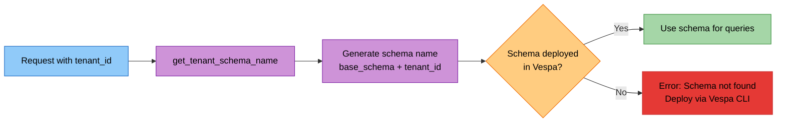
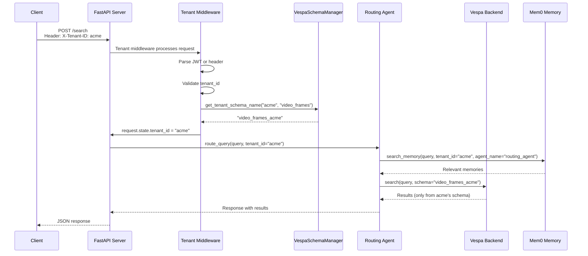
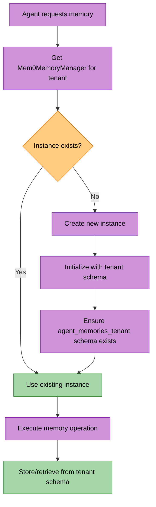
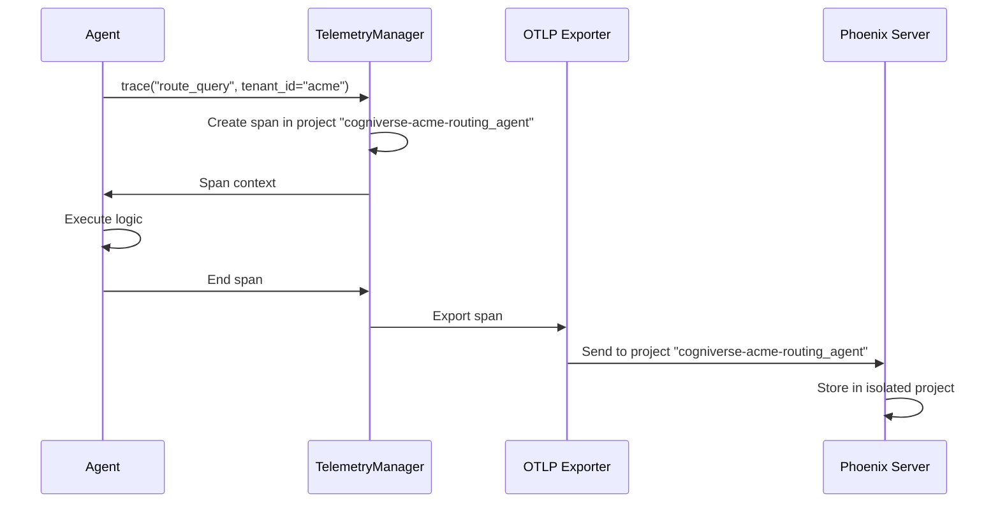
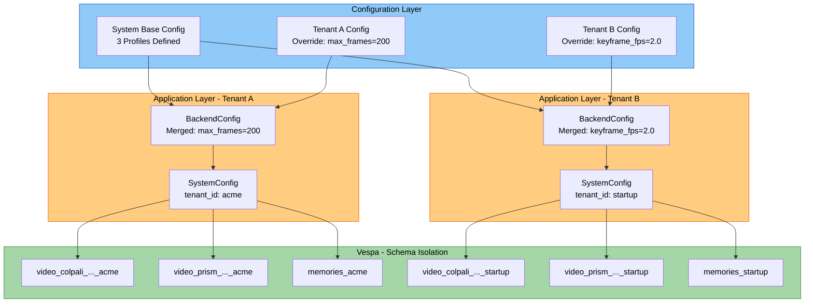
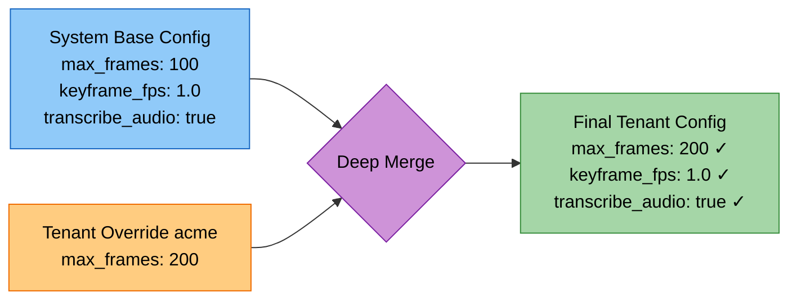

# Cogniverse Multi-Tenant Architecture

---

## Table of Contents

1. [Overview](#overview)
2. [Architecture Principles](#architecture-principles)
3. [Schema-Per-Tenant Pattern](#schema-per-tenant-pattern)
4. [Schema Manager](#schema-manager)
5. [Tenant Context Flow](#tenant-context-flow)
6. [Memory Isolation](#memory-isolation)
7. [Telemetry Isolation](#telemetry-isolation)
8. [Backend Configuration](#backend-configuration)
9. [Security and Isolation Guarantees](#security-and-isolation-guarantees)
10. [Tenant ID Formats](#tenant-id-formats)
11. [Operational Procedures](#operational-procedures)
12. [Testing Multi-Tenant Systems](#testing-multi-tenant-systems)
13. [Common Patterns](#common-patterns)
14. [Troubleshooting](#troubleshooting)

---

## Overview

Cogniverse uses **schema-based tenant isolation** via dedicated backend schemas per tenant (e.g., Vespa). This architecture provides:

- **Complete Data Isolation**: Each tenant has dedicated backend schemas - no cross-tenant data access possible
- **No Query Filtering**: Entire schema is tenant-scoped - no tenant_id filters needed in queries
- **Independent Scaling**: Scale backend resources per tenant independently
- **Simplified Security**: Schema separation eliminates most multi-tenant security concerns
- **Per-Tenant Memory**: Mem0 memory manager instances are per-tenant singletons
- **Isolated Telemetry**: Phoenix projects are per-tenant for trace isolation

---

## Architecture Principles

### 1. Schema Isolation Over Logical Filtering

**Principle**: Use dedicated schemas instead of tenant_id filtering in queries.

**Benefits**:

- **No Filtering Bugs**: Impossible to forget tenant_id filter
- **Performance**: No query overhead for tenant filtering
- **Security**: Schema separation eliminates cross-tenant data leaks
- **Simplicity**: Queries don't need tenant awareness

**Example**:

```python
# ❌ Logical filtering (NOT used in Cogniverse)
vespa_client.query(
    query="cooking videos",
    filter=f"tenant_id = '{tenant_id}'"  # Easy to forget!
)

# ✅ Schema isolation (Cogniverse approach)
vespa_client.query(
    query="cooking videos",
    schema=f"video_frames_{tenant_id}"  # Schema IS the tenant
)
```

### 2. Tenant ID Per-Request

**Principle**: No default tenant - tenant_id is required for all operations, but arrives **per-request**, not at agent construction.

**Implementation**:

- Agents are **tenant-agnostic at startup** — constructed once, serve all tenants
- All A2A task requests include `tenant_id` in the payload
- All storage operations use tenant-specific paths
- All memory operations use tenant-specific managers (per-tenant singletons)
- `BootstrapConfig.from_environment()` reads only infrastructure env vars (BACKEND_URL, BACKEND_PORT) at startup

**Example**:

```python
from cogniverse_agents.routing_agent import RoutingAgent, RoutingDeps
from cogniverse_foundation.telemetry import TelemetryConfig

# Agent constructed WITHOUT tenant_id — serves all tenants
deps = RoutingDeps(
    tenant_id="default",  # RoutingAgent still needs it for routing state
    telemetry_config=TelemetryConfig(),
    model_name="smollm3:3b",
    base_url="http://localhost:11434/v1"
)
routing_agent = RoutingAgent(deps=deps)

# tenant_id flows per-request via A2A tasks:
# POST /tasks/send { "tenant_id": "acme", "query": "..." }

# Storage uses tenant paths
storage_path = get_tenant_storage_path("data/optimization", "acme")
# Returns: Path("data/optimization/acme")

# Memory uses per-tenant singleton managers
memory_mgr = Mem0MemoryManager(tenant_id="acme")
```

### 3. Pre-Deployed Tenant Schemas

**Principle**: Tenant schemas must be deployed before use via Vespa CLI or application package.

**Benefits**:

- **Explicit Control**: Schemas are deployed explicitly during tenant onboarding
- **Validation**: Schema deployment failures are caught during setup, not at query time
- **Resource Planning**: Storage and indexing resources allocated upfront

**Implementation**:
```python
# Get tenant-specific schema name for a pre-deployed schema
schema_name = schema_manager.get_tenant_schema_name("acme", "video_frames")
# Returns: video_frames_acme

# Schema naming convention: {base_schema}_{tenant_id}
# Schemas must be pre-deployed via Vespa CLI: vespa deploy
# Tenant isolation is achieved through schema naming
# VespaSchemaManager provides utilities but does NOT auto-create schemas
```

### 4. Immutable Tenant Context

**Principle**: Tenant context set at request entry and never changes.

**Benefits**:

- **No Context Switching**: Same tenant throughout request lifecycle
- **Thread Safety**: Each request has isolated tenant context
- **Simplified Debugging**: Tenant always known from request.state

**Implementation**:
```python
# Middleware sets tenant_id once per request
request.state.tenant_id = "acme"

# All subsequent code reads from request.state
def handler(request: Request):
    tenant_id = request.state.tenant_id  # Always available
```

---

## Schema-Per-Tenant Pattern

### Overview

Each tenant gets dedicated backend schemas (e.g., Vespa) for all data types. Schemas are named by appending tenant suffix to base schema name.

### Schema Naming Convention

**Pattern**: `{base_schema_name}_{tenant_id}`

**Examples**:

| Base Schema | Tenant ID | Tenant Schema |
|------------|-----------|---------------|
| `video_colpali_smol500_mv_frame` | `acme` | `video_colpali_smol500_mv_frame_acme` |
| `video_videoprism_base_mv_chunk_30s` | `startup` | `video_videoprism_base_mv_chunk_30s_startup` |
| `agent_memories` | `acme:production` | `agent_memories_acme_production` |

**Schema Name Rules**:

- Only alphanumeric characters, underscores, hyphens, and colons allowed
- Colon (`:`) in tenant_id converted to underscore (`_`) for schema names
- Maximum length: 64 characters (Vespa limitation)

### Schema Storage

Schemas are stored in `configs/schemas/` as JSON definitions:

```text
configs/schemas/
├── adapter_registry_schema.json
├── agent_memories_schema.json
├── config_metadata_schema.json
├── organization_metadata_schema.json
├── ranking_strategies.json
├── tenant_metadata_schema.json
├── video_colpali_smol500_mv_frame_schema.json
├── video_colqwen_omni_mv_chunk_30s_schema.json
├── video_videoprism_base_mv_chunk_30s_schema.json
├── video_videoprism_large_mv_chunk_30s_schema.json
├── video_videoprism_lvt_base_sv_chunk_6s_schema.json
├── video_videoprism_lvt_large_sv_chunk_6s_schema.json
└── workflow_intelligence_schema.json
```

### Schema Deployment

Tenant-specific schemas must be deployed via Vespa CLI or application package:

1. **Load** schema definition from `configs/schemas/` (JSON format)
2. **Deploy** via Vespa CLI: `vespa deploy`
3. **Naming Convention**: Tenant suffix is added to schema name during deployment
   - Base: `video_colpali_smol500_mv_frame`
   - Tenant: `video_colpali_smol500_mv_frame_acme`
4. **Verification**: Use `get_tenant_schema_name()` to generate expected schema name

**Schema Naming**:

```python
# VespaSchemaManager provides naming convention utility
schema_name = schema_manager.get_tenant_schema_name("acme", "video_colpali_smol500_mv_frame")
# Returns: "video_colpali_smol500_mv_frame_acme"

# Schemas must be deployed separately via Vespa CLI
# VespaSchemaManager does NOT auto-create or transform schemas
```

### Schema Naming Flow



---

## Schema Manager

### Overview

The Schema Manager handles tenant-specific backend schema lifecycle. The Vespa implementation is `VespaSchemaManager`.

**Vespa Implementation**: `VespaSchemaManager` in `libs/vespa/cogniverse_vespa/vespa_schema_manager.py`

**Key Features**:

- **Singleton Pattern**: One instance per backend endpoint (optional, not enforced)
- **Thread-Safe**: Concurrent tenant schema operations
- **Schema Naming**: Utilities for generating tenant-specific schema names
- **Validation**: Schema and tenant ID validation
- **Schema Parsing**: Read and parse Vespa .sd schema files

### API Reference

> **Note**: VespaSchemaManager provides low-level schema parsing and deployment utilities.
> Tenant-specific schema naming conventions are handled at the application layer.

#### Schema Parsing

```python
schema_manager = VespaSchemaManager(
    backend_endpoint="http://localhost",
    backend_port=8080
)

# Read and parse a Vespa .sd schema file (if using .sd format)
# Note: Current schemas in configs/schemas/ are JSON format
sd_content = schema_manager.read_sd_file("path/to/schema.sd")
schema = schema_manager.parse_sd_schema(sd_content)
```

#### Tenant Schema Naming Convention

Tenant-specific schemas follow the naming pattern: `{base_schema}_{tenant_id}`

```python
# Tenant schema naming via VespaSchemaManager
schema_manager = VespaSchemaManager(
    backend_endpoint="http://localhost",
    backend_port=8080
)
schema_name = schema_manager.get_tenant_schema_name("acme", "video_colpali_smol500_mv_frame")
# Returns: "video_colpali_smol500_mv_frame_acme"
```

#### Schema Deployment

VespaSchemaManager provides schema parsing; deployment is done via pyvespa:

```python
from vespa.package import ApplicationPackage
from cogniverse_vespa.vespa_schema_manager import VespaSchemaManager

# 1. Parse the base schema
schema_manager = VespaSchemaManager(
    backend_endpoint="http://localhost",
    backend_port=8080
)
schema = schema_manager.parse_sd_schema(sd_content)

# 2. Create application package with tenant-specific name
tenant_schema_name = f"video_colpali_smol500_mv_frame_{tenant_id}"
app_package = ApplicationPackage(name=tenant_schema_name)

# 3. Deploy via Vespa client
vespa_connection.deploy(app_package)
```

**Deployment Steps**:

1. Load base schema from `configs/schemas/`
2. Parse via VespaSchemaManager.parse_sd_schema()
3. Create tenant-prefixed ApplicationPackage
4. Deploy via pyvespa

#### Listing Schemas

Schemas are discovered from the `configs/schemas/` directory:

```python
from pathlib import Path

# List available base schema JSON files
def list_available_base_schemas() -> list[str]:
    schema_dir = Path("configs/schemas")
    return [f.stem for f in schema_dir.glob("*_schema.json")]

# Returns: ['video_colpali_smol500_mv_frame', 'agent_memories', 'video_videoprism_base_mv_chunk_30s', ...]
```

#### Schema Name Generation

```python
# Generate tenant-specific schema name
schema_name = schema_manager.get_tenant_schema_name("acme", "video_frames")
# Returns: "video_frames_acme"

# Check if tenant schema exists (requires schema_registry)
if schema_manager.tenant_schema_exists("acme", "video_frames"):
    print("Schema exists")
```

#### Schema Deletion

```python
# Delete all schemas for a tenant
# IMPORTANT: Requires schema_registry to be configured during VespaSchemaManager initialization
# Example: schema_manager = VespaSchemaManager(..., schema_registry=schema_registry)
# Without schema_registry, this method will raise ValueError
deleted = schema_manager.delete_tenant_schemas("acme")
# Returns: ['video_frames_acme', 'agent_memories_acme']
# Raises ValueError: "schema_registry required for tenant schema operations" if not configured
```

#### Schema Validation

```python
# Check if tenant schema exists
# IMPORTANT: Requires schema_registry to be configured during VespaSchemaManager initialization
# Example: schema_manager = VespaSchemaManager(..., schema_registry=schema_registry)
# Without schema_registry, this method will raise ValueError
exists = schema_manager.tenant_schema_exists(
    tenant_id="acme",
    base_schema_name="video_frames"
)
# Returns: True if schema exists in registry
# Raises ValueError: "schema_registry required for tenant schema operations" if not configured
```

### Integration with Application Code

**Backend Initialization**:

```python
from cogniverse_vespa.vespa_schema_manager import VespaSchemaManager
from cogniverse_vespa.vespa_search_client import VespaVideoSearchClient

# Initialize schema manager
# Optional: Pass schema_registry for tenant schema operations (delete, exists checks)
schema_manager = VespaSchemaManager(
    backend_endpoint="http://vespa.prod.internal",
    backend_port=8080
    # schema_registry=schema_registry  # Optional: needed for delete_tenant_schemas(), tenant_schema_exists()
)

# Get tenant-specific schema names
video_schema = schema_manager.get_tenant_schema_name("acme", "video_frames")
memory_schema = schema_manager.get_tenant_schema_name("acme", "agent_memories")

# Create search client with tenant schema
# IMPORTANT: config_manager is REQUIRED (raises ValueError if None)
# VespaVideoSearchClient enforces dependency injection - no defaults
from cogniverse_foundation.config.utils import create_default_config_manager

config_manager = create_default_config_manager()  # Create config manager first
search_client = VespaVideoSearchClient(
    backend_url="http://vespa.prod.internal",
    backend_port=8080,
    tenant_id="acme",
    config_manager=config_manager  # REQUIRED parameter
)
```

**Agent Initialization**:

```python
from cogniverse_agents.routing_agent import RoutingAgent, RoutingDeps
from cogniverse_vespa.vespa_schema_manager import VespaSchemaManager
from cogniverse_foundation.telemetry import TelemetryConfig

# Get tenant schema name
schema_manager = VespaSchemaManager(
    backend_endpoint="http://localhost",
    backend_port=8080
)
memory_schema = schema_manager.get_tenant_schema_name("acme", "agent_memories")

# Initialize agent with deps
deps = RoutingDeps(
    tenant_id="acme",
    telemetry_config=TelemetryConfig(),
    model_name="smollm3:3b",
    base_url="http://localhost:11434/v1"
)
routing_agent = RoutingAgent(deps=deps)
# Agent automatically uses tenant-specific resources:
# - Memory: agent_memories_acme (via Mem0MemoryManager singleton)
# - Telemetry: cogniverse-acme project
# - Optimization: data/optimization/acme/
```

---

## Tenant Context Flow

### Request Lifecycle



### Tenant ID Extraction

Tenant ID is extracted from HTTP requests using one of these methods:

1. **Header-Based** (Development/Internal):
   ```http
   GET /search?query=cooking
   X-Tenant-ID: acme
   ```

2. **JWT-Based** (Production):
   ```http
   GET /search?query=cooking
   Authorization: Bearer eyJhbGciOi...
   # JWT contains: { "tenant_id": "acme", ... }
   ```

3. **Subdomain-Based** (Multi-domain):
   ```http
   GET https://acme.cogniverse.app/search?query=cooking
   # Extract "acme" from subdomain
   ```

### Tenant Context Extraction

**Package**: cogniverse-runtime (Application Layer)
**Location**: `libs/runtime/cogniverse_runtime/admin/tenant_manager.py`

The tenant management API provides CRUD operations for organizations and tenants. Tenant context is typically extracted from HTTP headers or JWT tokens at the API router level via middleware.

**Example Tenant Context Extraction Middleware**:

```python
from fastapi import Request
from fastapi.responses import JSONResponse
from cogniverse_vespa.vespa_schema_manager import VespaSchemaManager
from cogniverse_core.common.tenant_utils import validate_tenant_id

async def inject_tenant_context(request: Request, call_next):
    """
    Middleware to extract and validate tenant_id, ensure schemas exist.

    Note: This is an example pattern. Actual implementation may vary.
    """

    # Extract tenant_id from header or JWT
    tenant_id = request.headers.get("X-Tenant-ID")
    if not tenant_id:
        # Parse JWT
        jwt_token = request.headers.get("Authorization", "").replace("Bearer ", "")
        # payload = decode_jwt(jwt_token)  # JWT decoding implementation-specific
        # tenant_id = payload.get("tenant_id")
        pass

    if not tenant_id:
        return JSONResponse(
            status_code=400,
            content={"error": "tenant_id required"}
        )

    # Validate tenant_id format
    validate_tenant_id(tenant_id)

    # Get tenant-specific schema names
    schema_manager = VespaSchemaManager(
        backend_endpoint="http://localhost",
        backend_port=8080
    )
    video_schema = schema_manager.get_tenant_schema_name(tenant_id, "video_frames")
    memory_schema = schema_manager.get_tenant_schema_name(tenant_id, "agent_memories")

    # Inject into request state
    request.state.tenant_id = tenant_id

    # Continue request processing
    response = await call_next(request)
    return response
```

### Accessing Tenant Context

Throughout the request lifecycle, tenant_id is available from `request.state`:

```python
from fastapi import Request
from cogniverse_agents.routing_agent import RoutingAgent, RoutingDeps
from cogniverse_foundation.telemetry import TelemetryConfig

@app.post("/search")
async def search(request: Request, query: str):
    # Access tenant_id from request state
    tenant_id = request.state.tenant_id

    # Initialize agent with tenant context
    deps = RoutingDeps(
        tenant_id=tenant_id,
        telemetry_config=TelemetryConfig(),
        model_name="smollm3:3b",
        base_url="http://localhost:11434/v1"
    )
    routing_agent = RoutingAgent(deps=deps)

    # Execute search (automatically uses tenant-specific resources)
    results = await routing_agent.route_query(query)

    return results
```

---

## Memory Isolation

### Per-Tenant Memory Managers

Mem0MemoryManager uses **per-tenant singleton pattern**:

**Package**: cogniverse-core (Core Layer)
**Location**: `libs/core/cogniverse_core/memory/manager.py`

```python

class Mem0MemoryManager:
    """Per-tenant memory manager using Mem0 with Vespa backend"""

    _instances: Dict[str, "Mem0MemoryManager"] = {}  # tenant_id -> instance
    _instances_lock = threading.Lock()

    def __new__(cls, tenant_id: str):
        """Per-tenant singleton - different instance per tenant"""
        with cls._instances_lock:
            if tenant_id not in cls._instances:
                instance = super().__new__(cls)
                cls._instances[tenant_id] = instance
        return cls._instances[tenant_id]
```

**Key Points**:

- Each tenant gets **separate Mem0MemoryManager instance**
- Instances are **cached per tenant_id**
- Memory operations are **automatically tenant-scoped**
- No cross-tenant memory access possible

### Memory Storage Isolation

Memory is stored in tenant-specific Vespa schemas:

```python
# Initialize memory manager for tenant (per-tenant singleton)
# Each call with same tenant_id returns the same instance
memory_mgr = Mem0MemoryManager(tenant_id="acme")

# Initialize with backend configuration (only needed once per tenant)
# All parameters are required — no vendor-specific defaults
memory_mgr.initialize(
    backend_host=system_config["backend_url"],
    backend_port=system_config["backend_port"],
    llm_model=memory_config["llm_model"],
    embedding_model=memory_config["embedding_model"],
    llm_base_url=memory_config["llm_base_url"],
    base_schema_name="agent_memories",  # Base schema (becomes agent_memories_acme)
    config_manager=config_manager,
    schema_loader=schema_loader,
)

# Add memory (stored in agent_memories_acme schema)
memory_id = memory_mgr.add_memory(
    content="User prefers cooking videos",
    tenant_id="acme",
    agent_name="routing_agent"
)

# Search memory (only searches agent_memories_acme)
memories = memory_mgr.search_memory(
    query="user preferences",
    tenant_id="acme",
    agent_name="routing_agent"
)
```

**Schema Structure**:

| Tenant | Base Schema | Tenant Schema | Purpose |
|--------|-------------|---------------|---------|
| acme | agent_memories | agent_memories_acme | Memory for acme tenant |
| startup | agent_memories | agent_memories_startup | Memory for startup tenant |

### Memory Lifecycle



---

## Telemetry Isolation

### Per-Tenant Phoenix Projects

Phoenix telemetry uses per-tenant projects for trace isolation:

**Package**: cogniverse-telemetry-phoenix (Implementation Layer Plugin)
**Base Package**: cogniverse-foundation (Foundation Layer)

```python
from cogniverse_foundation.telemetry import TelemetryConfig, TelemetryManager

# Initialize telemetry manager (requires TelemetryConfig)
telemetry = TelemetryManager(config=TelemetryConfig())

# Record spans with tenant context
with telemetry.span("route_query", tenant_id="acme") as span:
    span.set_attribute("tenant_id", "acme")
    span.set_attribute("query", "cooking videos")
    # Execute routing logic
```

### Phoenix Project Naming

**Pattern**: `cogniverse-{tenant_id}-{service}` (with service) or `cogniverse-{tenant_id}` (without)

**Examples**:

| Tenant | Component | Phoenix Project |
|--------|-----------|-----------------|
| acme | routing_agent | cogniverse-acme-routing_agent |
| startup | video_search | cogniverse-startup-video_search |
| acme:production | ingestion | cogniverse-acme:production-ingestion |

### Telemetry Export Flow



### Viewing Tenant Traces

Each tenant's traces are isolated in Phoenix:

```bash
# Phoenix dashboard automatically filters by project
# Visit: http://localhost:6006/projects/cogniverse-acme-routing_agent
```

**Isolation Benefits**:

- Tenants cannot see each other's traces
- Performance metrics per tenant
- Debugging scoped to tenant
- Cost attribution per tenant

---

## Backend Configuration

### Overview

Tenant-specific backend configuration enables per-tenant customization of video processing profiles, embedding models, and search strategies through a hierarchical configuration system.

**Key Features**:

- **Profile-Based Configuration**: Tenant-specific overrides for video processing profiles
- **Auto-Discovery**: Automatic config.json loading from standard locations
- **Deep Merge**: System base config + tenant-specific overrides
- **Backend Isolation**: Each tenant can use different Vespa clusters or profiles

### Backend Configuration Structure

The backend configuration is defined through `BackendConfig` and `BackendProfileConfig` dataclasses:

**Package**: cogniverse-foundation (Foundation Layer)
**Location**: `libs/foundation/cogniverse_foundation/config/`

```python
from cogniverse_foundation.config.unified_config import BackendConfig, BackendProfileConfig

# Backend profile configuration
@dataclass
class BackendProfileConfig:
    profile_name: str                                # e.g., "video_colpali_smol500_mv_frame"
    type: str = "video"                              # Profile type
    description: str = ""                            # Human-readable description
    schema_name: str = ""                            # Base schema name
    embedding_model: str = ""                        # Model identifier
    pipeline_config: Dict[str, Any] = field(...)     # Frame extraction, transcription settings
    strategies: Dict[str, Any] = field(...)          # Segmentation, embedding strategies
    embedding_type: str = ""                         # "binary" or "float"
    schema_config: Dict[str, Any] = field(...)       # Schema-specific configuration
    model_specific: Dict[str, Any] = field(...)      # Model-specific parameters
    process_type: Optional[str] = None               # Processing type override

# Backend configuration
@dataclass
class BackendConfig:
    tenant_id: str = "default"
    backend_type: str = "vespa"
    url: str = "http://localhost"
    port: int = 8080
    profiles: Dict[str, BackendProfileConfig] = field(default_factory=dict)
    metadata: Dict[str, Any] = field(default_factory=dict)
```

#### Multi-Tenant Backend Architecture



**Key Principles**:

1. **Schema Isolation**: Each tenant's data in separate schemas
2. **Config Independence**: Tenant A's overrides don't affect Tenant B
3. **Profile Flexibility**: Same base profiles, different settings per tenant
4. **Automatic Scoping**: Schema names automatically include tenant suffix

### Configuration File Structure

**Location**: Auto-discovered from:

1. `COGNIVERSE_CONFIG` environment variable
2. `configs/config.json` (workspace root)
3. `../configs/config.json` (one level up)
4. `../../configs/config.json` (two levels up)

**Example**: `configs/config.json`

```json
{
  "backend": {
    "type": "vespa",
    "url": "http://localhost",
    "port": 8080,
    "profiles": {
      "video_colpali_smol500_mv_frame": {
        "type": "video",
        "schema_name": "video_colpali_smol500_mv_frame",
        "embedding_model": "vidore/colsmol-500m",
        "pipeline_config": {
          "extract_keyframes": true,
          "transcribe_audio": true,
          "keyframe_fps": 1.0,
          "max_frames": 100
        },
        "strategies": {
          "segmentation": {
            "class": "FrameSegmentationStrategy"
          },
          "embedding": {
            "class": "MultiVectorEmbeddingStrategy",
            "use_binary": true
          }
        },
        "embedding_type": "binary"
      }
    }
  }
}
```

### Tenant Configuration Overlay

Tenants can override system-level backend configuration:

**System Config**: `configs/config.json`
```json
{
  "backend": {
    "profiles": {
      "video_colpali_smol500_mv_frame": {
        "pipeline_config": {
          "max_frames": 100,
          "keyframe_fps": 1.0
        }
      }
    }
  }
}
```

**Tenant Override**: Via `ConfigManager`
```python
from cogniverse_foundation.config.utils import create_default_config_manager
from cogniverse_foundation.config.unified_config import BackendConfig

manager = create_default_config_manager()

# Tenant "acme" wants more frames
tenant_override = {
    "backend": {
        "profiles": {
            "video_colpali_smol500_mv_frame": {
                "pipeline_config": {
                    "max_frames": 200  # Override: 100 → 200
                }
            }
        }
    }
}

backend_config = BackendConfig(
    tenant_id="acme",
    backend_type="vespa",
    url="http://localhost",
    port=8080,
    metadata={"overrides": tenant_override}
)
manager.set_backend_config(
    backend_config=backend_config,
    tenant_id="acme"
)
```

**Result**: Deep merge creates tenant-specific config
```python
# Tenant "acme" gets:
{
    "max_frames": 200,      # Overridden
    "keyframe_fps": 1.0     # Inherited from system
}
```

#### Deep Merge Visualization



**Deep Merge Rules**:

1. Tenant override values replace system values
2. System values without tenant override are inherited
3. Nested dictionaries are merged recursively
4. Arrays are replaced, not merged (tenant override wins completely)

### Using Backend Configuration

**Initialization**:
```python
from cogniverse_foundation.config.unified_config import SystemConfig, BackendConfig

# SystemConfig has individual backend fields (not a nested backend_config attribute)
config = SystemConfig(tenant_id="acme")

# Access backend fields directly
assert config.tenant_id == "acme"
assert config.backend_url == "http://localhost"
assert config.backend_port == 8080

# To get a BackendConfig object, use ConfigManager
from cogniverse_foundation.config.utils import create_default_config_manager
manager = create_default_config_manager()
backend_config = manager.get_backend_config(tenant_id="acme")
assert backend_config.tenant_id == "acme"

# Access profile configuration via ConfigManager
profile = manager.get_backend_profile(
    profile_name="video_colpali_smol500_mv_frame",
    tenant_id="acme"
)
```

**Per-Tenant Backend Isolation**:
```python
from cogniverse_foundation.config.utils import create_default_config_manager

manager = create_default_config_manager()

# Different tenants get their own backend configs with tenant-specific overrides
config_acme = manager.get_backend_config(tenant_id="acme")
config_startup = manager.get_backend_config(tenant_id="startup")

assert config_acme.tenant_id == "acme"
assert config_startup.tenant_id == "startup"
```

### Benefits for Multi-Tenancy

1. **Tenant Customization**: Each tenant can optimize video processing for their use case
2. **Resource Allocation**: Different tenants can use different max_frames, fps settings
3. **Cost Control**: Premium tenants get higher quality processing (more frames, higher fps)
4. **Backend Flexibility**: Tenants can potentially use different Vespa clusters
5. **Configuration Isolation**: Tenant configs don't interfere with each other

---

## Security and Isolation Guarantees

### Schema Isolation

**Guarantee**: Each tenant's data is stored in dedicated Vespa schemas - no shared storage.

**Implementation**:

- Schema names include tenant suffix
- Queries target specific tenant schema
- No cross-schema joins or queries

**Verification**:
```python
# Query only accesses tenant-specific schema
vespa_client.query(
    query="cooking videos",
    schema="video_frames_acme"  # Only acme's data
)
# Impossible to access startup's video_frames_startup (schema-scoped)
```

### No Query Filtering Required

**Guarantee**: Queries don't need tenant_id filters - schema scoping is sufficient.

**Benefit**: Eliminates entire class of security bugs:

- Forgotten tenant filters
- SQL injection on tenant_id
- Logic errors in filtering

**Example**:
```python
# ✅ No filtering needed (schema scoping)
results = vespa_client.query(
    query="cooking videos",
    schema=f"video_frames_{tenant_id}"
)

# ❌ Filtering approach (NOT used - vulnerable to bugs)
results = vespa_client.query(
    query="cooking videos",
    filter=f"tenant_id = '{tenant_id}'"  # Vulnerable if forgotten!
)
```

### Per-Tenant Resources

**Guarantee**: All tenant resources are isolated:

| Resource | Isolation Method | Example |
|----------|------------------|---------|
| Vespa Schemas | Schema-per-tenant | `video_frames_acme` |
| Memory | Per-tenant Mem0MemoryManager | `Mem0MemoryManager(tenant_id="acme")` |
| Telemetry | Per-tenant Phoenix project | `cogniverse-acme-routing_agent` |
| Optimization Models | Tenant-specific directories | `data/optimization/acme/` |

### Tenant ID Validation

**Guarantee**: All tenant IDs are validated to prevent injection attacks.

**Validation Rules**:
```python
def validate_tenant_id(tenant_id: str):
    """
    Validate tenant_id format.

    Rules:
    - Non-empty string
    - Only alphanumeric, underscore, hyphen, colon
    - If colon present: exactly one, org:tenant format
    """
    if not tenant_id:
        raise ValueError("tenant_id cannot be empty")

    # Allow alphanumeric, underscore, hyphen, colon
    allowed = tenant_id.replace("_", "").replace("-", "").replace(":", "")
    if not allowed.isalnum():
        raise ValueError("Invalid tenant_id: only alphanumeric, underscore, hyphen, colon")

    # Validate org:tenant format if colon present
    if ":" in tenant_id:
        parts = tenant_id.split(":")
        if len(parts) != 2 or not all(parts):
            raise ValueError("Invalid org:tenant format")
```

### Immutable Context

**Guarantee**: Tenant context set at request entry and never changes.

**Implementation**:

- Middleware extracts tenant_id once per request
- Stored in `request.state.tenant_id` (immutable FastAPI state)
- All downstream code reads from request state
- No tenant switching mid-request

**Thread Safety**:

- Each request has isolated state
- Concurrent requests don't interfere
- Per-tenant singletons are thread-safe

---

## Tenant ID Formats

### Simple Format

**Pattern**: `{tenant_name}`

**Example**: `acme`

**Schema Naming**: `video_frames_acme`

**Storage Path**: `data/optimization/acme/`

**Use Case**: Single-level tenant hierarchy, simple deployments

### Org:Tenant Format

**Pattern**: `{org_id}:{tenant_name}`

**Example**: `acme:production`

**Schema Naming**: `video_frames_acme_production` (colon replaced with underscore)

**Storage Path**: `data/optimization/acme/production/`

**Use Case**: Multi-level tenant hierarchy, enterprise deployments

### Parsing Tenant IDs

```python
from cogniverse_core.common.tenant_utils import parse_tenant_id

# Simple format
org_id, tenant_name = parse_tenant_id("acme")
# Returns: ("acme", "acme")

# Org:tenant format
org_id, tenant_name = parse_tenant_id("acme:production")
# Returns: ("acme", "production")
```

### Storage Path Generation

```python
from cogniverse_core.common.tenant_utils import get_tenant_storage_path

# Simple format
path = get_tenant_storage_path("data/optimization", "acme")
# Returns: Path("data/optimization/acme")

# Org:tenant format
path = get_tenant_storage_path("data/optimization", "acme:production")
# Returns: Path("data/optimization/acme/production")
```

---

## Operational Procedures

### Onboarding New Tenant

**Steps**:

1. **Register Tenant** (metadata):
   ```python
   # Store tenant metadata in tenant_metadata schema
   tenant_metadata = {
       "tenant_full_id": "acme",
       "org_id": "acme",
       "tenant_name": "acme",
       "created_at": int(time.time()),
       "created_by": "admin@acme.com",
       "status": "active",
       "schemas_deployed": []
   }
   ```

2. **Deploy Tenant Schemas**:

   - Deploy schemas using Vespa CLI: `vespa deploy`
   - Schemas follow naming convention: `{base_schema}_{tenant_id}`
   - Use `get_tenant_schema_name()` to generate the expected schema name
   - Schema deployment is manual, NOT automatic

3. **Verify Schema Deployment**:
   ```python
   schema_manager = VespaSchemaManager(
       backend_endpoint="http://localhost",
       backend_port=8080
   )
   # Get expected schema names
   video_schema = schema_manager.get_tenant_schema_name("acme", "video_frames")
   memory_schema = schema_manager.get_tenant_schema_name("acme", "agent_memories")
   print(f"Expected schemas: {video_schema}, {memory_schema}")
   # video_frames_acme, agent_memories_acme
   ```

4. **Ingest Initial Data** (optional):
   ```bash
   uv run python scripts/run_ingestion.py \
       --tenant_id acme \
       --video_dir data/acme/videos \
       --backend vespa \
       --profile video_colpali_smol500_mv_frame
   ```

5. **Verify Tenant Access**:
   ```bash
   curl -H "X-Tenant-ID: acme" \
        http://localhost:8000/search?query=test
   ```

### Monitoring Tenant Health

**Metrics to Track**:

1. **Schema Health**:
   ```python
   # Check tenant schema name is properly formed
   tenant_schema = schema_manager.get_tenant_schema_name("acme", "video_frames")
   # Returns: "video_frames_acme"
   ```

2. **Memory Health**:
   ```python
   memory_mgr = Mem0MemoryManager(tenant_id="acme")
   health = memory_mgr.health_check()
   stats = memory_mgr.get_memory_stats("acme", "routing_agent")
   # {"total_memories": 42, "enabled": True}
   ```

3. **Telemetry Health**:
   ```python
   telemetry = TelemetryManager(config=TelemetryConfig())
   # Use spans with tenant_id for tenant-scoped tracing
   with telemetry.span("health_check", tenant_id="acme") as span:
       span.set_attribute("agent", "routing_agent")
   ```

4. **Tenant Schema Lookup**:
   ```python
   # Get tenant schema name for operations
   tenant_schema = schema_manager.get_tenant_schema_name("acme", "video_frames")
   # Returns: "video_frames_acme"
   ```

### Tenant Data Migration

**Scenario**: Migrate tenant data between environments (dev → staging → prod).

**Steps**:

1. **Export Tenant Data** (Vespa):
   ```bash
   # Use Vespa visit API to export all documents
   vespa visit --schema video_frames_acme > acme_export.jsonl
   ```

2. **Generate Expected Schema Names and Deploy**:
   ```python
   schema_manager = VespaSchemaManager(
       backend_endpoint="http://prod-vespa.internal",
       backend_port=8080
   )
   # Generate expected schema names following convention: {base_schema}_{tenant_id}
   video_schema = schema_manager.get_tenant_schema_name("acme", "video_frames")
   memory_schema = schema_manager.get_tenant_schema_name("acme", "agent_memories")
   # Returns: "video_frames_acme", "agent_memories_acme"

   # Deploy schemas manually via Vespa CLI: vespa deploy
   # VespaSchemaManager does NOT deploy schemas automatically
   ```

3. **Import Data** (Vespa):
   ```bash
   # Feed documents to target environment
   vespa feed acme_export.jsonl --schema video_frames_acme
   ```

4. **Verify Migration**:
   ```python
   # Check document count matches
   count_source = vespa_source.count("video_frames_acme")
   count_target = vespa_target.count("video_frames_acme")
   assert count_source == count_target
   ```

### Tenant Offboarding

**WARNING**: This is a destructive operation - all tenant data is permanently deleted.

**Steps**:

1. **Backup Tenant Data** (if needed):
   ```bash
   vespa visit --schema video_frames_acme > acme_backup.jsonl
   vespa visit --schema agent_memories_acme > acme_memories_backup.jsonl
   ```

2. **Delete Tenant Schemas**:
   ```python
   # Note: Requires schema_registry to be configured
   schema_manager = VespaSchemaManager(
       backend_endpoint="http://localhost",
       backend_port=8080,
       schema_registry=schema_registry  # Required for delete operations
   )
   deleted = schema_manager.delete_tenant_schemas("acme")
   # Returns: ['video_frames_acme', 'agent_memories_acme']
   # Raises ValueError if schema_registry not configured
   ```

3. **Clear Memory Instances**:
   ```python
   # Clear per-tenant memory manager (if needed)
   if "acme" in Mem0MemoryManager._instances:
       del Mem0MemoryManager._instances["acme"]
   ```

4. **Clear Telemetry Projects**:
   ```bash
   # Phoenix projects persist - manual cleanup if needed
   # Or configure Phoenix project retention policies
   ```

5. **Clear Optimization Models**:
   ```bash
   rm -rf data/optimization/acme/
   ```

6. **Update Tenant Metadata**:
   ```python
   # Mark tenant as deleted in tenant_metadata schema
   update_tenant_status("acme", "deleted")
   ```

---

## Testing Multi-Tenant Systems

### Unit Tests

**Test Tenant Isolation**:

```python
import pytest
from cogniverse_agents.routing_agent import RoutingAgent, RoutingDeps
from cogniverse_foundation.telemetry import TelemetryConfig

def test_tenant_isolation():
    """Verify tenants don't interfere with each other"""

    # ONE agent serves all tenants (tenant-agnostic at construction)
    deps = RoutingDeps(
        telemetry_config=TelemetryConfig(),
        model_name="smollm3:3b",
        base_url="http://localhost:11434/v1"
    )
    agent = RoutingAgent(deps=deps)

    # Tenant isolation happens at request time:
    # - Each A2A task carries tenant_id in payload
    # - Memory namespaced by (tenant_id, agent_name) via MemoryAwareMixin
    # - Search schemas isolated by tenant_id suffix
    memory_acme = Mem0MemoryManager(tenant_id="acme")
    memory_startup = Mem0MemoryManager(tenant_id="startup")
    assert memory_acme is not memory_startup
```

**Test Schema Name Generation**:

```python
def test_schema_name_generation():
    """Verify tenant schema naming"""

    schema_manager = VespaSchemaManager(
        backend_endpoint="http://localhost",
        backend_port=8080
    )

    # Simple format
    schema = schema_manager.get_tenant_schema_name("acme", "video_frames")
    assert schema == "video_frames_acme"

    # Org:tenant format
    schema = schema_manager.get_tenant_schema_name("acme:production", "video_frames")
    assert schema == "video_frames_acme_production"
```

### Integration Tests

**Test Schema Naming**:

```python
@pytest.mark.integration
def test_tenant_schema_naming():
    """Verify tenant schema naming convention"""

    schema_manager = VespaSchemaManager(
        backend_endpoint="http://localhost",
        backend_port=8080
    )

    # Get tenant schema name
    schema_name = schema_manager.get_tenant_schema_name("test_tenant", "video_frames")
    assert schema_name == "video_frames_test_tenant"

    # Cleanup (if schema_registry configured)
    # schema_manager.delete_tenant_schemas("test_tenant")
```

**Test End-to-End Tenant Flow**:

```python
@pytest.mark.integration
async def test_end_to_end_tenant_flow():
    """Test complete tenant request flow"""

    tenant_id = "test_tenant_e2e"

    # 1. Get tenant schema name
    schema_manager = VespaSchemaManager(
        backend_endpoint="http://localhost",
        backend_port=8080
    )
    video_schema = schema_manager.get_tenant_schema_name(tenant_id, "video_frames")

    # 2. Initialize agent
    deps = RoutingDeps(
        tenant_id=tenant_id,
        telemetry_config=TelemetryConfig(),
        model_name="smollm3:3b",
        base_url="http://localhost:11434/v1"
    )
    agent = RoutingAgent(deps=deps)

    # 3. Execute query
    result = await agent.route_query("cooking videos")

    # 4. Verify result (RoutingOutput Pydantic model)
    assert result.recommended_agent is not None
    assert result.confidence > 0.0
```

### Test Fixtures

```python
# tests/conftest.py

@pytest.fixture
def test_tenant_id():
    """Provide unique tenant ID for tests"""
    return f"test_tenant_{uuid.uuid4().hex[:8]}"

@pytest.fixture
def schema_manager():
    """Provide VespaSchemaManager instance"""
    return VespaSchemaManager(
        backend_endpoint="http://localhost",
        backend_port=8080
    )

@pytest.fixture
def cleanup_tenant_schemas(schema_manager):
    """Cleanup tenant schemas after test"""
    created_tenants = []

    yield created_tenants

    # Cleanup
    for tenant_id in created_tenants:
        schema_manager.delete_tenant_schemas(tenant_id)
```

---

## Common Patterns

### Pattern 1: Tenant-Aware Agent Initialization

```python
from cogniverse_agents.routing_agent import RoutingAgent, RoutingDeps
from cogniverse_vespa.vespa_schema_manager import VespaSchemaManager
from cogniverse_foundation.telemetry import TelemetryConfig
from cogniverse_foundation.config.utils import create_default_config_manager

def create_routing_agent(tenant_id: str) -> RoutingAgent:
    """Create routing agent with tenant context"""

    # Create config manager (required for dependency injection)
    config_manager = create_default_config_manager()

    # Get tenant schema names (schemas should be pre-deployed)
    schema_manager = VespaSchemaManager(
        backend_endpoint="http://localhost",
        backend_port=8080
    )
    video_schema = schema_manager.get_tenant_schema_name(tenant_id, "video_frames")
    memory_schema = schema_manager.get_tenant_schema_name(tenant_id, "agent_memories")

    # Create agent with deps (tenant_id is required in AgentDeps)
    # RoutingDeps provides defaults for model_name, base_url, etc. (see class definition)
    deps = RoutingDeps(
        tenant_id=tenant_id,
        telemetry_config=TelemetryConfig(),
        model_name="smollm3:3b",  # Default: "smollm3:3b"
        base_url="http://localhost:11434/v1"  # Default: "http://localhost:11434/v1"
    )
    agent = RoutingAgent(deps=deps)

    return agent
```

### Pattern 2: Tenant-Scoped API Endpoint

```python
from fastapi import Request, Depends

def get_tenant_id(request: Request) -> str:
    """Extract tenant_id from request"""
    if not hasattr(request.state, "tenant_id"):
        raise HTTPException(
            status_code=400,
            detail="tenant_id not found in request context"
        )
    return request.state.tenant_id

@app.post("/search")
async def search(
    query: str,
    tenant_id: str = Depends(get_tenant_id)
):
    """Search endpoint with automatic tenant scoping"""

    # Initialize tenant-aware agent
    deps = RoutingDeps(
        tenant_id=tenant_id,
        telemetry_config=TelemetryConfig(),
        model_name="smollm3:3b",
        base_url="http://localhost:11434/v1"
    )
    agent = RoutingAgent(deps=deps)

    # Execute query (automatically uses tenant resources)
    results = await agent.route_query(query)

    return results
```

### Pattern 3: Tenant-Aware Memory Operations

```python
from cogniverse_core.memory.manager import Mem0MemoryManager

def add_user_preference(
    tenant_id: str,
    agent_name: str,
    preference: str
):
    """Store user preference in tenant memory"""

    # Get tenant-specific memory manager
    memory_mgr = Mem0MemoryManager(tenant_id=tenant_id)

    # Memory schema name follows convention: agent_memories_{tenant_id}
    # Schema should be pre-deployed
    # IMPORTANT: Must call initialize() before adding memories
    from cogniverse_foundation.config.utils import create_default_config_manager

    config_manager = create_default_config_manager()
    memory_mgr.initialize(
        backend_host=system_config["backend_url"],
        backend_port=system_config["backend_port"],
        llm_model=memory_config["llm_model"],       # Required
        embedding_model=memory_config["embedding_model"],  # Required
        llm_base_url=memory_config["llm_base_url"],  # Required
        config_manager=config_manager,               # Required for schema deployment
        schema_loader=schema_loader,                 # Required for schema templates
        base_schema_name="agent_memories",
        auto_create_schema=True,
    )

    # Add memory (automatically scoped to tenant)
    memory_id = memory_mgr.add_memory(
        content=preference,
        tenant_id=tenant_id,
        agent_name=agent_name
    )

    return memory_id
```

### Pattern 4: Tenant-Aware Telemetry

```python
from cogniverse_foundation.telemetry import TelemetryConfig, TelemetryManager

async def process_query_with_telemetry(
    query: str,
    tenant_id: str
):
    """Process query with tenant-scoped telemetry"""

    # Get telemetry manager (requires TelemetryConfig)
    telemetry = TelemetryManager(config=TelemetryConfig())

    # Trace execution with tenant context
    with telemetry.span("process_query", tenant_id=tenant_id) as span:
        span.set_attribute("tenant_id", tenant_id)
        span.set_attribute("query", query)

        # Execute query processing
        result = await execute_processing(query, tenant_id)

        span.set_attribute("result_count", len(result))

    return result
```

---

## Troubleshooting

### Issue: Schema Not Found

**Symptoms**: `SchemaNotFoundException: Base schema 'X' not found`

**Cause**: Base schema template doesn't exist in `configs/schemas/`

**Solution**:
```bash
# List available base schema files
ls -la configs/schemas/

# Ensure base schema file exists
ls -la configs/schemas/video_frames_schema.json
```

### Issue: Tenant Schema Already Exists

**Symptoms**: Deployment fails with "schema already exists" error

**Cause**: Schema was previously deployed for this tenant

**Solution**:
```python
# Get expected schema name
schema_manager = VespaSchemaManager(
    backend_endpoint="http://localhost",
    backend_port=8080
)
schema_name = schema_manager.get_tenant_schema_name(tenant_id, "video_frames")
print(f"Expected schema: {schema_name}")

# Check Vespa directly for existing schemas via Vespa CLI:
# vespa status --cluster content
```

### Issue: Cross-Tenant Data Leak

**Symptoms**: Tenant A sees tenant B's data

**Diagnosis**:
```python
# Verify schema routing
schema_manager = VespaSchemaManager(
    backend_endpoint="http://localhost",
    backend_port=8080
)
schema_a = schema_manager.get_tenant_schema_name("tenant_a", "video_frames")
schema_b = schema_manager.get_tenant_schema_name("tenant_b", "video_frames")
print(f"Tenant A schema: {schema_a}")  # Should be video_frames_tenant_a
print(f"Tenant B schema: {schema_b}")  # Should be video_frames_tenant_b

# Verify query uses correct schema
# Check Vespa query logs to ensure schema={schema_a} in query
```

**Solution**: Ensure tenant_id is correctly extracted and passed through entire request flow.

### Issue: Memory Isolation Failure

**Symptoms**: Agent for tenant A has access to tenant B's memories

**Diagnosis**:
```python
# Check memory manager instances
memory_a = Mem0MemoryManager(tenant_id="tenant_a")
memory_b = Mem0MemoryManager(tenant_id="tenant_b")
print(f"Same instance? {memory_a is memory_b}")  # Should be False

# Check tenant_id in memory manager
print(f"Memory A tenant: {memory_a.tenant_id}")  # Should be tenant_a
print(f"Memory B tenant: {memory_b.tenant_id}")  # Should be tenant_b
```

**Solution**: Ensure agents pass correct tenant_id to Mem0MemoryManager constructor.

### Issue: Telemetry Not Scoped

**Symptoms**: Tenant traces mixed in single Phoenix project

**Diagnosis**:
```python
# Check telemetry manager is working
telemetry = TelemetryManager(config=TelemetryConfig())
with telemetry.span("test_span", tenant_id="tenant_a") as span:
    span.set_attribute("test", "value")
```

**Solution**: Ensure telemetry spans include tenant_id for proper isolation.

---

## Best Practices

### 1. Always Validate Tenant IDs

```python
from cogniverse_core.common.tenant_utils import validate_tenant_id

# Validate at entry point
def handle_request(tenant_id: str):
    validate_tenant_id(tenant_id)  # Raises ValueError if invalid
    # ... continue processing
```

### 2. Use Consistent Schema Naming

```python
# Get tenant-specific schema names consistently
schema_manager = VespaSchemaManager(
    backend_endpoint="http://localhost",
    backend_port=8080
)
video_schema = schema_manager.get_tenant_schema_name(tenant_id, "video_frames")
memory_schema = schema_manager.get_tenant_schema_name(tenant_id, "agent_memories")
```

### 3. Pass Tenant Context Explicitly

```python
from cogniverse_agents.routing_agent import RoutingAgent, RoutingDeps
from cogniverse_foundation.telemetry import TelemetryConfig

# ✅ Good: Explicit deps with tenant_id
deps = RoutingDeps(
    tenant_id=tenant_id,
    telemetry_config=TelemetryConfig(),
    model_name="smollm3:3b",
    base_url="http://localhost:11434/v1"
)
agent = RoutingAgent(deps=deps)

# ❌ Bad: Missing deps
agent = RoutingAgent()  # TypeError: missing required argument 'deps'
```

### 4. Test Tenant Isolation

```python
# Always test that tenants can't access each other's data
def test_tenant_isolation():
    deps_a = RoutingDeps(
        tenant_id="tenant_a",
        telemetry_config=TelemetryConfig(),
        model_name="smollm3:3b",
        base_url="http://localhost:11434/v1"
    )
    deps_b = RoutingDeps(
        tenant_id="tenant_b",
        telemetry_config=TelemetryConfig(),
        model_name="smollm3:3b",
        base_url="http://localhost:11434/v1"
    )
    agent_a = RoutingAgent(deps=deps_a)
    agent_b = RoutingAgent(deps=deps_b)

    # Verify separate memory manager instances per tenant
    memory_a = Mem0MemoryManager(tenant_id="tenant_a")
    memory_b = Mem0MemoryManager(tenant_id="tenant_b")
    assert memory_a is not memory_b
```

### 5. Monitor Tenant Schemas

```python
# Get tenant schema name for monitoring
tenant_schema = schema_manager.get_tenant_schema_name("acme", "video_frames")
logger.info(f"Tenant schema: {tenant_schema}")
```

---

## Summary

Cogniverse's multi-tenant architecture provides **schema-based isolation** via dedicated backend schemas per tenant:

**Key Multi-Tenant Components**:

- **Schema Manager** (e.g., VespaSchemaManager): Schema lifecycle and routing
- **Mem0MemoryManager** (cogniverse-core): Per-tenant memory isolation
- **TelemetryProvider** (cogniverse-foundation): Per-tenant trace isolation base
- **PhoenixProvider** (cogniverse-telemetry-phoenix): Phoenix-specific implementation
- **Tenant Utilities** (cogniverse-core): Validation and parsing

**Isolation Guarantees**:

- ✅ Schema-based data isolation (separate backend schemas)
- ✅ No query filtering required (schema scoping)
- ✅ Per-tenant resources (memory, telemetry, models)
- ✅ Thread-safe tenant context
- ✅ Validated tenant IDs

**Operational Benefits**:

- ✅ Explicit schema deployment (controlled setup)
- ✅ Independent tenant scaling
- ✅ Simplified security model
- ✅ Clear cost attribution
- ✅ Structured tenant onboarding/offboarding

For implementation details, see:

- [SDK Architecture](./sdk-architecture.md) - Package layered structure
- [System Flows](./system-flows.md) - Multi-tenant request flows
- [Architecture Overview](./overview.md) - Complete system architecture
