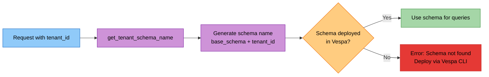
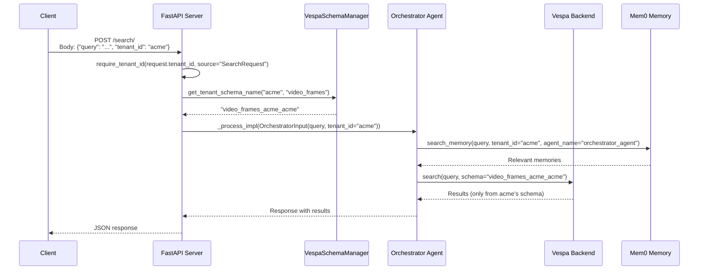
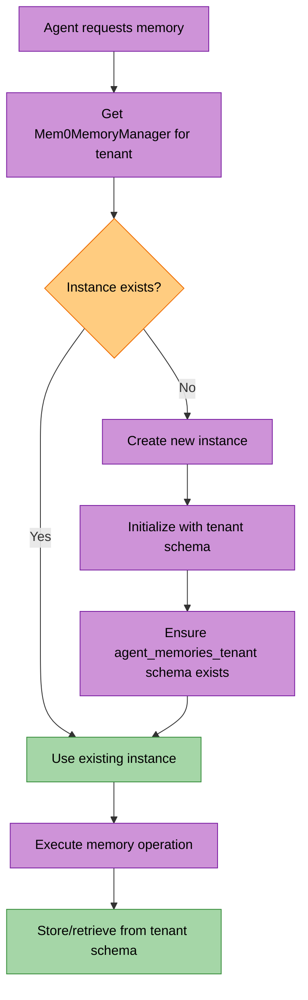
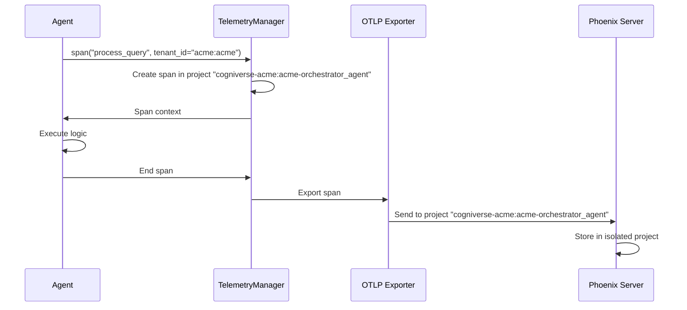
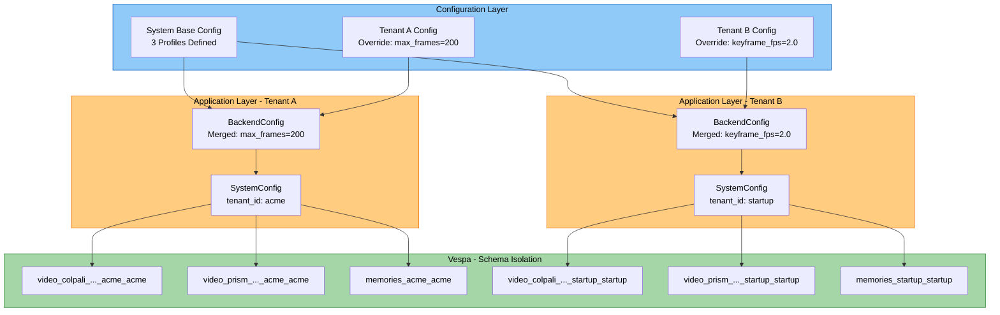
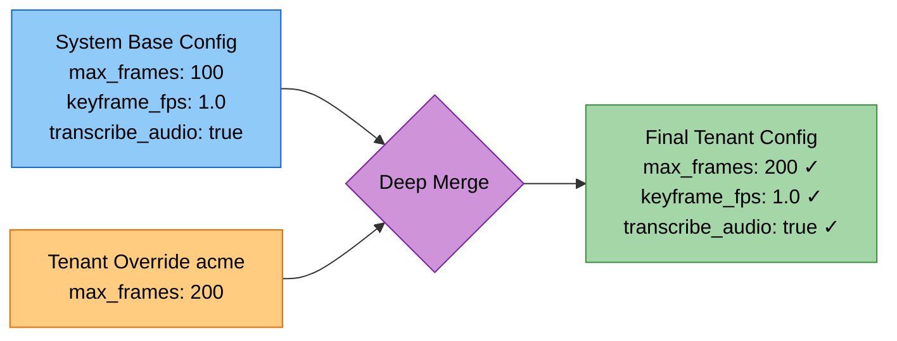
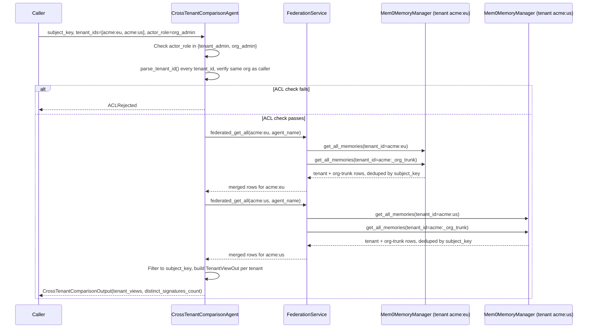

# Cogniverse Multi-Tenant Architecture

---

## Table of Contents

1. [Overview](#overview)
2. [Architecture Principles](#architecture-principles)
3. [Schema Lifecycle: Source of Truth](#schema-lifecycle-source-of-truth)
4. [Schema-Per-Tenant Pattern](#schema-per-tenant-pattern)
5. [Schema Manager](#schema-manager)
6. [Tenant Context Flow](#tenant-context-flow)
7. [Memory Isolation](#memory-isolation)
8. [Telemetry Isolation](#telemetry-isolation)
9. [Backend Configuration](#backend-configuration)
10. [Cross-Tenant Federation Agents](#cross-tenant-federation-agents)
11. [Security and Isolation Guarantees](#security-and-isolation-guarantees)
12. [Tenant ID Formats](#tenant-id-formats)
13. [Operational Procedures](#operational-procedures)
14. [Testing Multi-Tenant Systems](#testing-multi-tenant-systems)
15. [Common Patterns](#common-patterns)
16. [Troubleshooting](#troubleshooting)
17. [Best Practices](#best-practices)
18. [Summary](#summary)

---

## Overview

Cogniverse uses **schema-based tenant isolation** via dedicated backend schemas per tenant (e.g., Vespa). This architecture provides:

- **Complete Data Isolation**: Each tenant has dedicated backend schemas - no cross-tenant data access possible
- **No Query Filtering**: Entire schema is tenant-scoped - no tenant_id filters needed in queries
- **Independent Scaling**: Scale backend resources per tenant independently
- **Simplified Security**: Schema separation eliminates most multi-tenant security concerns
- **Per-Tenant Memory**: Mem0 memory manager instances are per-tenant singletons
- **Isolated Telemetry**: Phoenix projects are per-tenant for trace isolation

---

## Architecture Principles

### 1. Schema Isolation Over Logical Filtering

**Principle**: Use dedicated schemas instead of tenant_id filtering in queries.

**Benefits**:

- **No Filtering Bugs**: Impossible to forget tenant_id filter
- **Performance**: No query overhead for tenant filtering
- **Security**: Schema separation eliminates cross-tenant data leaks
- **Simplicity**: Queries don't need tenant awareness

**Example**:

```python
# ❌ Logical filtering (NOT used in Cogniverse)
vespa_client.query(
    query="cooking videos",
    filter=f"tenant_id = '{tenant_id}'"  # Easy to forget!
)

# ✅ Schema isolation (Cogniverse approach)
vespa_client.query(
    query="cooking videos",
    schema=f"video_frames_{tenant_id}"  # Schema IS the tenant
)
```

### 2. Tenant ID Per-Request

**Principle**: No default tenant - tenant_id is required for all operations, but arrives **per-request**, not at agent construction.

**Implementation**:

- Agents are **tenant-agnostic at startup** — constructed once, serve all tenants
- All A2A task requests include `tenant_id` in the payload
- All storage operations use tenant-specific paths
- All memory operations use tenant-specific managers (per-tenant singletons)
- `BootstrapConfig.from_environment()` reads only infrastructure env vars (BACKEND_URL, BACKEND_PORT) at startup

**Example**:

```python
from cogniverse_agents.orchestrator_agent import OrchestratorAgent, OrchestratorDeps, OrchestratorInput
from cogniverse_core.registries.agent_registry import AgentRegistry
from cogniverse_core.common.tenant_utils import SYSTEM_TENANT_ID

# Agent constructed WITHOUT a customer tenant_id — serves all tenants.
# AgentRegistry itself still takes a tenant_id constructor argument (it's
# used only for the process-wide agent-endpoint bookkeeping table), so the
# runtime builds it once at startup with the reserved SYSTEM_TENANT_ID —
# see libs/runtime/cogniverse_runtime/main.py.
orchestrator = OrchestratorAgent(
    deps=OrchestratorDeps(),
    registry=AgentRegistry(tenant_id=SYSTEM_TENANT_ID, config_manager=config_manager),
    config_manager=config_manager,
)

# tenant_id flows per-request via A2A tasks:
# POST /tasks/send { "tenant_id": "acme", "query": "..." }

# Storage uses tenant paths
storage_path = get_tenant_storage_path("data/optimization", "acme")
# Returns: Path("data/optimization/acme")

# Memory uses per-tenant singleton managers
memory_mgr = Mem0MemoryManager(tenant_id="acme")
```

**Canonicalization**: `require_tenant_id()` (called at every request boundary)
and `get_tenant_schema_name()` both canonicalize a bare tenant_id to
`org:tenant` form via `canonical_tenant_id()` before using it. A simple
tenant_id like `"acme"` canonicalizes to `"acme:acme"` — so schema names,
`BackendConfig.tenant_id` (as read back through `ConfigManager.get_backend_config`),
and Phoenix project names for a simple-format tenant carry the **doubled**
suffix (e.g. `video_frames_acme_acme`, `cogniverse-acme:acme`), not the bare
single-suffix form (`video_frames_acme`). `get_tenant_storage_path()` is the one exception: it
re-parses the id with `parse_tenant_id()` (not the canonicalized form) and
collapses the `org == tenant` case back to one directory level, so storage
paths for simple-format tenants stay `data/optimization/acme/` rather than
`data/optimization/acme/acme/`. Every schema-name and project-name example
below reflects the canonicalized form; storage-path examples reflect the
non-canonicalized form.

### 3. Pre-Deployed Tenant Schemas

**Principle**: Tenant schemas must be deployed before use via Vespa CLI or application package.

**Benefits**:

- **Explicit Control**: Schemas are deployed explicitly during tenant onboarding
- **Validation**: Schema deployment failures are caught during setup, not at query time
- **Resource Planning**: Storage and indexing resources allocated upfront

**Implementation**:
```python
# Get tenant-specific schema name for a pre-deployed schema
schema_name = schema_manager.get_tenant_schema_name("acme", "video_frames")
# Returns: video_frames_acme_acme ("acme" canonicalizes to "acme:acme" first)

# Schema naming convention: {base_schema}_{canonical_tenant_id with ':' -> '_'}
# Schemas must be pre-deployed via Vespa CLI: vespa deploy
# Tenant isolation is achieved through schema naming
# VespaSchemaManager provides utilities but does NOT auto-create schemas
```

### 4. Immutable Tenant Context

**Principle**: Tenant context set at request entry and never changes.

**Benefits**:

- **No Context Switching**: Same tenant throughout request lifecycle
- **Thread Safety**: Each request has isolated tenant context
- **Simplified Debugging**: Tenant always known from the validated local variable

**Implementation**:
```python
# Each route validates tenant_id once, at the top of the handler, and
# threads it explicitly through every downstream call — there is no
# shared/mutable request state.
from cogniverse_core.common.tenant_utils import require_tenant_id

@router.post("/")
async def search(request: SearchRequest, ...):
    tenant_id = require_tenant_id(request.tenant_id, source="SearchRequest")
```

---

## Schema Lifecycle: Source of Truth

Two stores hold schema state and they are NOT equivalent peers — Vespa is
authoritative and the SchemaRegistry is bookkeeping. This invariant is
load-bearing for every schema-manager read path, the deploy/delete
ordering, and the failure-recovery semantics. Code that violates it
silently produces orphan schemas, peer-tenant data loss, or split-brain
states between processes.

### The two stores

| Store | What it holds | Authority |
|-------|---------------|-----------|
| **Vespa application package** | The actual deployed schemas (the source of all queries and feeds). | **Authoritative.** A schema exists iff it is in the running application generation. |
| **SchemaRegistry** (config_metadata) | Per-tenant rows recording what was deployed and the JSON definitions used to build the package. | **Bookkeeping.** A cache + audit trail. Tombstoned (`deleted=True`) entries persist for history. |

If the two disagree, **Vespa wins.** Recovery code reconciles the
registry to match the running package, never the other way round.

### Read-after-write consistency

Reading the registry from a peer process must see writes the local
process just made — schemas registered by ingestion must be visible
to the next deploy in the runtime. To get this guarantee:

- Writes go through Vespa's Document v1 API (`set_config` →
  `feed_data_point`). Document v1 returns success only after the
  document store has accepted the write.
- Reads go through Vespa's Document v1 **visit** API
  (`list_all_configs` → `/document/v1/.../docid/?selection=...`).
  The visit API is consistent with the document store.
- The YQL `/search/` endpoint is **eventually** consistent — a feed
  followed by an immediate search routinely misses the just-written
  document. Reads on the schema-registry path MUST NOT use search.

`VespaSchemaManager.list_deployed_document_types` queries the **config
server** (the same endpoint `prepareandactivate` writes to) for the
same reason: a deploy followed by an immediate listing must observe
the new generation.

### Process-wide singleton (endpoint-scoped)

`BackendRegistry._shared_schema_registry` is a class-level singleton
bound to one backend endpoint. The first backend created in a process
builds the registry; every subsequent backend on the same url:port
reuses it via `BackendFactory.create_backend_with_dependencies`. A
backend configured for a different endpoint builds its own registry —
the shared one deploys and registers through the backend it was built
with, so cross-endpoint reuse silently routes deploys and registrations
to the other cluster (`deploy_schema` reports success while the
backend's own endpoint never sees the schema).
Without the same-endpoint sharing, an ingestion backend's writes wouldn't
be visible to a search backend's reads in the same process — the rollback
safeguard in `backend.deploy_schemas` would refuse every cross-component
deploy.

Tested by `tests/backends/integration/test_tenant_schema_lifecycle.py::TestSharedSchemaRegistry::test_two_ingestion_backends_share_registry`
and `tests/backends/unit/test_backend_registry_tenant.py::TestSharedSchemaRegistryEndpointScoping`.

### Asymmetric rollback

Create and delete handle their respective failure modes differently
because Vespa is authoritative:

| Path | Step 1 | Step 2 | If step 2 fails |
|------|--------|--------|-----------------|
| **Create** (`SchemaRegistry.deploy_schema`) | `backend.deploy_schemas` (Vespa) | `register_schema` (registry) | **Roll back Vespa.** Re-deploy the previous package so the registry write failure doesn't leave Vespa with a schema the registry doesn't know about. |
| **Delete** (`schema_manager.delete_tenant_schemas`) | Redeploy without target schemas (Vespa) | `unregister_schema` for each (registry) | **Log and continue.** Vespa already has the authoritative state (schema is gone); a registry tombstone failure is a bookkeeping inconsistency that the next read reconciles, not a rollback trigger. |

Tested by `TestDeleteFailureSemantics::test_vespa_failure_leaves_registry_untouched`
and `test_registry_tombstone_failure_does_not_block_vespa_removal`.

### Peer-tenant orphan protection

`delete_tenant_schemas` and `delete_schema` build the redeploy survivor
list by enumerating Vespa's actual deployed schemas (not by walking the
registry). Each survivor is reconstructed from the registry by full
name; if any survivor cannot be reconstructed, the delete refuses with
`BackendDeploymentError` rather than silently dropping it. This catches
the case where tenant B's schema is in Vespa but absent from the
registry (interrupted earlier cleanup) and tenant A's delete would
otherwise wipe it.

Tested by `TestSchemaRegistryDeletion::test_delete_tenant_does_not_drop_peer_tenant_orphan`.

### What you can rely on

- After `deploy_schema` returns, the schema is in Vespa and the registry
  has the entry. If the schema does not become query-visible within the
  convergence budget, `deploy_schemas` fails instead of reporting success
  for a schema Vespa never activated.
- After `delete_tenant_schemas` returns, the schemas are gone from Vespa; registry entries are tombstoned (best-effort).
- After a crash mid-deploy, Vespa is the truth; on next startup the e2e
  fixture's `_reconcile_vespa_orphans` (test only) or
  `cogniverse admin reconcile-orphans` / `POST /admin/reconcile-orphans`
  (production) reconciles the registry to match. See
  [`operations/multi-tenant-ops.md`](../operations/multi-tenant-ops.md#orphan-reconciliation)
  for the operator workflow.
- A peer process's `register_schema` becomes visible to your next
  `_get_all_schemas` call without a sleep.

### What you cannot rely on

- That two registries (in two processes that don't share
  `_shared_schema_registry`) hold the same in-memory cache. They do
  share the **persistent** cache via the config_metadata schema; the
  `_load_schemas_from_storage` refresh pulls peer writes on every
  `_get_all_schemas` call.
- That a `_DEPLOY_LOCK`-protected `prepareandactivate` is exclusive
  cluster-wide. The lock is process-local; concurrent deploys from
  different pods or processes still race the config server's session
  pipeline. The retry-on-409 loop narrows the window but does not
  eliminate it.

---

## Schema-Per-Tenant Pattern

### Overview

Each tenant gets dedicated backend schemas (e.g., Vespa) for all data types. Schemas are named by appending tenant suffix to base schema name.

### Schema Naming Convention

**Pattern**: `{base_schema_name}_{canonical_tenant_id with ':' -> '_'}`

`get_tenant_schema_name()` canonicalizes the tenant_id first (via
`canonical_tenant_id()`), so a bare `"acme"` becomes `"acme:acme"` before the
colon-to-underscore substitution — the tenant suffix on a simple-format
tenant is doubled, not single.

**Examples**:

| Base Schema | Tenant ID | Tenant Schema |
|------------|-----------|---------------|
| `video_colpali_smol500_mv_frame` | `acme` | `video_colpali_smol500_mv_frame_acme_acme` |
| `video_videoprism_base_mv_chunk_30s` | `startup` | `video_videoprism_base_mv_chunk_30s_startup_startup` |
| `agent_memories` | `acme:production` | `agent_memories_acme_production` |

**Schema Name Rules** (`validate_tenant_id()` in `tenant_utils.py`):

- Only alphanumeric characters, underscores, and colons allowed — **no
  hyphens**: the tenant_id becomes part of the Vespa schema name
  (`[a-zA-Z0-9_]` only), and sanitizing `-` to `_` would collide distinct
  tenants (`acme-corp` vs `acme_corp` would map to the same schema)
- Colon (`:`) in tenant_id converted to underscore (`_`) for schema names
- Identifiers starting with `__` are reserved for runtime-internal
  identities (`SYSTEM_TENANT_ID = "__system__"`) and are rejected for
  user-registered tenants

### Schema Storage

Schemas are stored in `configs/schemas/` as JSON definitions:

```text
configs/schemas/
├── adapter_registry_schema.json
├── agent_memories_schema.json
├── audio_content_schema.json
├── code_lateon_mv_schema.json
├── config_metadata_schema.json
├── document_text_schema.json
├── document_visual_schema.json
├── image_colpali_mv_schema.json
├── knowledge_graph_schema.json
├── lateon_mv_schema.json
├── organization_metadata_schema.json
├── provenance_schema.json
├── ranking_strategies.json
├── tenant_metadata_schema.json
├── video_colpali_smol500_mv_frame_schema.json
├── video_colqwen_omni_mv_chunk_30s_schema.json
├── video_videoprism_base_mv_chunk_30s_schema.json
├── video_videoprism_large_mv_chunk_30s_schema.json
├── video_videoprism_lvt_base_sv_chunk_6s_schema.json
├── video_videoprism_lvt_large_sv_chunk_6s_schema.json
└── wiki_pages_schema.json
```

### Schema Deployment

Tenant-specific schemas must be deployed via Vespa CLI or application package:

1. **Load** schema definition from `configs/schemas/` (JSON format)
2. **Deploy** via Vespa CLI: `vespa deploy`
3. **Naming Convention**: Tenant suffix is added to schema name during deployment
   - Base: `video_colpali_smol500_mv_frame`
   - Tenant: `video_colpali_smol500_mv_frame_acme_acme`
4. **Verification**: Use `get_tenant_schema_name()` to generate expected schema name

**Schema Naming**:

```python
# VespaSchemaManager provides naming convention utility
schema_name = schema_manager.get_tenant_schema_name("acme", "video_colpali_smol500_mv_frame")
# Returns: "video_colpali_smol500_mv_frame_acme_acme"

# Schemas must be deployed separately via Vespa CLI
# VespaSchemaManager does NOT auto-create or transform schemas
```

### Schema Naming Flow


```mermaid
flowchart LR
    A[<span style='color:#000'>Request with tenant_id</span>] --> B[<span style='color:#000'>get_tenant_schema_name</span>]
    B --> C[<span style='color:#000'>Generate schema name<br/>base_schema + tenant_id</span>]
    C --> D{<span style='color:#000'>Schema deployed<br/>in Vespa?</span>}
    D -->|Yes| E[<span style='color:#000'>Use schema for queries</span>]
    D -->|No| F[<span style='color:#000'>Error: Schema not found<br/>Deploy via Vespa CLI</span>]

    style A fill:#90caf9,stroke:#1565c0,color:#000
    style B fill:#ce93d8,stroke:#7b1fa2,color:#000
    style C fill:#ce93d8,stroke:#7b1fa2,color:#000
    style D fill:#ffcc80,stroke:#ef6c00,color:#000
    style E fill:#a5d6a7,stroke:#388e3c,color:#000
    style F fill:#e53935,stroke:#c62828,color:#fff
```

---

## Schema Manager

### Overview

The Schema Manager handles tenant-specific backend schema lifecycle. The Vespa implementation is `VespaSchemaManager`.

**Vespa Implementation**: `VespaSchemaManager` in `libs/vespa/cogniverse_vespa/vespa_schema_manager.py`

**Key Features**:

- **Singleton Pattern**: One instance per backend endpoint (optional, not enforced)
- **Thread-Safe**: Concurrent tenant schema operations
- **Schema Naming**: Utilities for generating tenant-specific schema names
- **Validation**: Schema and tenant ID validation
- **JSON Schema Loading**: Load schema definitions from `configs/schemas/` JSON files

### API Reference

> **Note**: Schemas are defined as JSON in `configs/schemas/`.
> `SchemaRegistry.deploy_schema()` is the primary deployment entry point;
> `VespaSchemaManager` provides tenant naming and JSON schema uploads.

#### Loading a JSON Schema

```python
from cogniverse_vespa.json_schema_parser import JsonSchemaParser

# Schemas in configs/schemas/ are JSON; parse to a pyvespa Schema object
parser = JsonSchemaParser()
schema = parser.load_schema_from_json_file(
    "configs/schemas/video_colpali_smol500_mv_frame_schema.json"
)
```

#### Tenant Schema Naming Convention

Tenant-specific schemas follow the naming pattern: `{base_schema}_{canonical_tenant_id with ':' -> '_'}`

```python
# Tenant schema naming via VespaSchemaManager
schema_manager = VespaSchemaManager(
    backend_endpoint="http://localhost",
    backend_port=8080
)
schema_name = schema_manager.get_tenant_schema_name("acme", "video_colpali_smol500_mv_frame")
# Returns: "video_colpali_smol500_mv_frame_acme_acme"
```

#### Schema Deployment

`SchemaRegistry.deploy_schema()` is the primary entry point. It loads the base
JSON schema, transforms it to a tenant-specific schema, collects all existing
schemas (cross-tenant), and deploys the complete set via the backend:

```python
from cogniverse_core.registries.schema_registry import SchemaRegistry

registry = SchemaRegistry(...)  # constructed with backend + schema_loader
tenant_schema_name = registry.deploy_schema(
    tenant_id="acme",
    base_schema_name="video_colpali_smol500_mv_frame",
)
# Returns: "video_colpali_smol500_mv_frame_acme_acme" (deploy_schema canonicalizes too)
```

**Deployment Steps** (handled internally by `deploy_schema()`):

1. Validate inputs and check whether the schema is already deployed
2. Load the base JSON schema definition from `configs/schemas/`
3. Transform it to a tenant-specific schema
4. Collect all existing schemas (cross-tenant) and deploy the complete set
5. Register the newly deployed schema

#### Listing Schemas

Schemas are discovered from the `configs/schemas/` directory:

```python
from pathlib import Path

# List available base schema JSON files
def list_available_base_schemas() -> list[str]:
    schema_dir = Path("configs/schemas")
    return [f.stem for f in schema_dir.glob("*_schema.json")]

# Returns: ['video_colpali_smol500_mv_frame', 'agent_memories', 'video_videoprism_base_mv_chunk_30s', ...]
```

#### Schema Name Generation

```python
# Generate tenant-specific schema name
schema_name = schema_manager.get_tenant_schema_name("acme", "video_frames")
# Returns: "video_frames_acme_acme"

# Check if tenant schema exists (requires schema_registry)
if schema_manager.tenant_schema_exists("acme", "video_frames"):
    print("Schema exists")
```

#### Schema Deletion

```python
# Delete all schemas for one tenant and redeploy.
# IMPORTANT: Requires schema_registry to be configured during VespaSchemaManager initialization.
# Raises BackendDeploymentError if a peer-tenant unreconstructable orphan
# is present (the redeploy would silently drop the peer's schema).
deleted = schema_manager.delete_tenant_schemas("acme")
# Returns: ['video_frames_acme_acme', 'agent_memories_acme_acme']

# Atomic multi-tenant delete (operator recovery path).
# Single-tenant delete refuses when peer orphans exist; this variant
# accepts every target tenant in one call so all orphans land in the
# deletion set and one Vespa redeploy clears them.
deleted = schema_manager.delete_tenant_schemas_bulk(
    ["acme:dev", "globex:test"]
)
# Returns the union of all dropped full-schema names.
# This is the path the runtime's POST /admin/reconcile-orphans endpoint
# uses internally — see operations/multi-tenant-ops.md#orphan-reconciliation.
```

#### Schema Validation

```python
# Check if tenant schema exists
# IMPORTANT: Requires schema_registry to be configured during VespaSchemaManager initialization
# Example: schema_manager = VespaSchemaManager(..., schema_registry=schema_registry)
# Without schema_registry, this method will raise ValueError
exists = schema_manager.tenant_schema_exists(
    tenant_id="acme",
    base_schema_name="video_frames"
)
# Returns: True if schema exists in registry
# Raises ValueError: "schema_registry required for tenant schema operations" if not configured
```

### Integration with Application Code

**Backend Initialization**:

```python
from pathlib import Path
from cogniverse_vespa.vespa_schema_manager import VespaSchemaManager
from cogniverse_vespa.search_backend import VespaSearchBackend
from cogniverse_core.schemas.filesystem_loader import FilesystemSchemaLoader

# Initialize schema manager
# Optional: Pass schema_registry for tenant schema operations (delete, exists checks)
schema_manager = VespaSchemaManager(
    backend_endpoint="http://vespa.prod.internal",
    backend_port=8080
    # schema_registry=schema_registry  # Optional: needed for delete_tenant_schemas(), tenant_schema_exists()
)

# Get tenant-specific schema names
video_schema = schema_manager.get_tenant_schema_name("acme", "video_frames")
memory_schema = schema_manager.get_tenant_schema_name("acme", "agent_memories")

# Create the search backend
# IMPORTANT: config_manager and schema_loader are REQUIRED (dependency injection,
# no defaults). tenant_id is NOT a construction argument — it is supplied per query
# in the query_dict passed to search().
from cogniverse_foundation.config.utils import create_default_config_manager

config_manager = create_default_config_manager()  # Create config manager first
schema_loader = FilesystemSchemaLoader(Path("configs/schemas"))
search_backend = VespaSearchBackend(
    config={
        "url": "http://vespa.prod.internal",
        "port": 8080,
        "profiles": {},
        "default_profiles": {},
    },
    config_manager=config_manager,
    schema_loader=schema_loader,
)

# Run a tenant-scoped search. tenant_id is REQUIRED in the query_dict; strategy
# is a rank-profile name string (e.g. "bm25_only", "hybrid_float_bm25").
results = search_backend.search(
    {
        "query": "quarterly results",
        "type": "video",
        "strategy": "hybrid_float_bm25",
        "top_k": 10,
        "tenant_id": "acme:prod",
    }
)
# results: List[SearchResult] — each has .score and .document
# (source video id at result.document.metadata["source_id"])
```

**Agent Initialization**:

```python
from cogniverse_agents.orchestrator_agent import OrchestratorAgent, OrchestratorDeps, OrchestratorInput
from cogniverse_core.registries.agent_registry import AgentRegistry
from cogniverse_core.common.tenant_utils import SYSTEM_TENANT_ID
from cogniverse_vespa.vespa_schema_manager import VespaSchemaManager
from cogniverse_foundation.config.unified_config import LLMEndpointConfig
from cogniverse_foundation.telemetry import TelemetryConfig

# Get tenant schema name
schema_manager = VespaSchemaManager(
    backend_endpoint="http://localhost",
    backend_port=8080
)
memory_schema = schema_manager.get_tenant_schema_name("acme", "agent_memories")

# Initialize agent with deps — tenant-agnostic at construction.
# OrchestratorDeps has no required fields of its own (AgentDeps allows
# extra fields), so passing telemetry_config/llm_config here is optional.
deps = OrchestratorDeps(
    telemetry_config=TelemetryConfig(),
    llm_config=LLMEndpointConfig(
        model="openai/google/gemma-4-e4b-it",
        api_base="http://localhost:11434/v1",
    ),
)
orchestrator = OrchestratorAgent(
    deps=deps,
    registry=AgentRegistry(tenant_id=SYSTEM_TENANT_ID, config_manager=config_manager),
    config_manager=config_manager,
)
# Agent automatically uses tenant-specific resources per-request:
# - Memory: agent_memories_acme_acme (via Mem0MemoryManager singleton)
# - Telemetry: cogniverse-acme:acme project
# - Optimization: data/optimization/acme/
```

---

## Tenant Context Flow

### Request Lifecycle


```mermaid
sequenceDiagram
    participant Client
    participant API as FastAPI Server
    participant SchemaManager as VespaSchemaManager
    participant Agent as Orchestrator Agent
    participant Vespa as Vespa Backend
    participant Memory as Mem0 Memory

    Client->>API: POST /search/<br/>Body: {"query": "...", "tenant_id": "acme"}
    API->>API: require_tenant_id(request.tenant_id, source="SearchRequest")
    API->>SchemaManager: get_tenant_schema_name("acme", "video_frames")
    SchemaManager-->>API: "video_frames_acme_acme"

    API->>Agent: _process_impl(OrchestratorInput(query, tenant_id="acme"))
    Agent->>Memory: search_memory(query, tenant_id="acme", agent_name="orchestrator_agent")
    Memory-->>Agent: Relevant memories
    Agent->>Vespa: search(query, schema="video_frames_acme_acme")
    Vespa-->>Agent: Results (only from acme's schema)
    Agent-->>API: Response with results
    API-->>Client: JSON response
```

### Tenant ID Extraction

There is no tenant-detecting middleware. The client supplies `tenant_id` explicitly on every request, and the router validates it with `require_tenant_id()`:

1. **Request Body** (most endpoints):
   ```http
   POST /search/
   Content-Type: application/json

   {"query": "cooking videos", "tenant_id": "acme"}
   ```

2. **Query Parameter** (read-only listing endpoints):
   ```http
   GET /search/profiles?tenant_id=acme
   ```

3. **Form Field** (multipart upload):
   ```http
   POST /ingestion/upload
   Content-Type: multipart/form-data

   tenant_id=acme
   ```

4. **A2A Task Metadata** (agent-to-agent):
   ```json
   {"tenant_id": "acme", "query": "..."}
   ```

### Tenant Context Extraction

**Package**: cogniverse-core (Core Layer)
**Location**: `libs/core/cogniverse_core/common/tenant_utils.py`

Each router calls `require_tenant_id()` directly at the top of the handler to validate the value the client supplied in the request. A missing, empty, or non-string `tenant_id` raises `ValueError`, which the route catches and re-raises as `HTTPException(400)`. There is no separate extraction middleware and no header/JWT parsing.

Tenant *management* (CRUD for organizations and tenants) is a separate concern handled by `libs/runtime/cogniverse_runtime/admin/tenant_manager.py`, not part of per-request tenant resolution.

**Example** (from `libs/runtime/cogniverse_runtime/routers/search.py`):

```python
from fastapi import HTTPException
from cogniverse_core.common.tenant_utils import assert_tenant_exists, require_tenant_id

@router.post("/", response_model=None)
async def search(request: SearchRequest, ...):
    try:
        tenant_id = require_tenant_id(request.tenant_id, source="SearchRequest")
    except ValueError as exc:
        raise HTTPException(status_code=400, detail=str(exc))

    await assert_tenant_exists(tenant_id)
    ...
```

### Accessing Tenant Context

`tenant_id` is produced by `require_tenant_id()` at the top of the handler and threaded explicitly through every downstream call — there is no shared request state to read it back from:

```python
from cogniverse_agents.orchestrator_agent import OrchestratorAgent, OrchestratorDeps, OrchestratorInput
from cogniverse_core.registries.agent_registry import AgentRegistry
from cogniverse_core.common.tenant_utils import SYSTEM_TENANT_ID, require_tenant_id
from cogniverse_foundation.config.unified_config import LLMEndpointConfig
from cogniverse_foundation.telemetry import TelemetryConfig

# Agent is constructed once, at module/startup scope — tenant-agnostic.
# AgentRegistry takes a tenant_id constructor argument, but that argument
# scopes only its own endpoint-bookkeeping config lookup, not the requests
# the orchestrator will later serve — so the one shared instance is built
# with the reserved SYSTEM_TENANT_ID, never a customer tenant_id.
deps = OrchestratorDeps(
    telemetry_config=TelemetryConfig(),
    llm_config=LLMEndpointConfig(
        model="openai/google/gemma-4-e4b-it",
        api_base="http://localhost:11434/v1",
    ),
)
orchestrator = OrchestratorAgent(
    deps=deps,
    registry=AgentRegistry(tenant_id=SYSTEM_TENANT_ID, config_manager=config_manager),
    config_manager=config_manager,
)

@router.post("/")
async def search(request: SearchRequest, ...):
    tenant_id = require_tenant_id(request.tenant_id, source="SearchRequest")

    # tenant_id flows per-request into OrchestratorAgent
    results = await orchestrator._process_impl(
        OrchestratorInput(query=request.query, tenant_id=tenant_id)
    )

    return results
```

---

## Memory Isolation

### Per-Tenant Memory Managers

Mem0MemoryManager uses **per-tenant singleton pattern**:

**Package**: cogniverse-core (Core Layer)
**Location**: `libs/core/cogniverse_core/memory/manager.py`

```python

class Mem0MemoryManager:
    """
    Memory manager using Mem0 with Vespa vector store backend.

    Each tenant gets dedicated Vespa schema: agent_memories_{tenant_id}
    """

    # Per-tenant LRU cache, bounded so a multi-tenant server with churn (or
    # a test suite creating a fresh tenant per test) can't grow the working
    # set past capacity without evicting the oldest tenant.
    _instances: TenantLRUCache["Mem0MemoryManager"] = TenantLRUCache(
        capacity=_tenant_cache_capacity(),
        on_evict=_on_tenant_evicted,
    )

    def __new__(cls, tenant_id: str):
        """Per-tenant singleton pattern (LRU-bounded)."""

        def _build() -> "Mem0MemoryManager":
            instance = super(Mem0MemoryManager, cls).__new__(cls)
            instance._initialized = False
            return instance

        return cls._instances.get_or_set(tenant_id, _build)
```

`_instances` is a `TenantLRUCache` (`libs/foundation/cogniverse_foundation/caching/tenant_lru.py`),
not a plain dict — it supports `__contains__` and `__len__`, but eviction
goes through `.pop(key)`, not `del cache[key]`.

**Key Points**:

- Each tenant gets **separate Mem0MemoryManager instance**
- Instances are **cached per tenant_id**
- Memory operations are **automatically tenant-scoped**
- No cross-tenant memory access possible

### Memory Storage Isolation

Memory is stored in tenant-specific Vespa schemas:

```python
# Initialize memory manager for tenant (per-tenant singleton)
# Each call with same tenant_id returns the same instance
memory_mgr = Mem0MemoryManager(tenant_id="acme")

# Initialize with backend configuration (only needed once per tenant)
# All parameters are required — no vendor-specific defaults
from cogniverse_core.memory.schema import build_default_registry

memory_mgr.initialize(
    backend_host=system_config["backend_url"],
    backend_port=system_config["backend_port"],
    llm_model=memory_config["llm_model"],
    embedding_model="lightonai/DenseOn",
    llm_base_url=memory_config["llm_base_url"],
    embedder_base_url=memory_config["embedder_base_url"],  # DenseOn /v1
    base_schema_name="agent_memories",  # Base schema (becomes agent_memories_acme_acme)
    config_manager=config_manager,
    schema_loader=schema_loader,
    knowledge_registry=build_default_registry(),  # Enables provenance + trust + reconciliation
)

# Add memory (stored in agent_memories_acme_acme schema)
memory_id = memory_mgr.add_memory(
    content="User prefers cooking videos",
    tenant_id="acme",
    agent_name="orchestrator_agent"
)

# Search memory (only searches agent_memories_acme_acme)
memories = memory_mgr.search_memory(
    query="user preferences",
    tenant_id="acme",
    agent_name="orchestrator_agent"
)
```

**Schema Structure**:

| Tenant | Base Schema | Tenant Schema | Purpose |
|--------|-------------|---------------|---------|
| acme | agent_memories | agent_memories_acme_acme | Memory for acme tenant |
| startup | agent_memories | agent_memories_startup_startup | Memory for startup tenant |

### Memory Lifecycle


```mermaid
flowchart TD
    A[<span style='color:#000'>Agent requests memory</span>] --> B[<span style='color:#000'>Get Mem0MemoryManager for tenant</span>]
    B --> C{<span style='color:#000'>Instance exists?</span>}
    C -->|Yes| D[<span style='color:#000'>Use existing instance</span>]
    C -->|No| E[<span style='color:#000'>Create new instance</span>]
    E --> F[<span style='color:#000'>Initialize with tenant schema</span>]
    F --> G[<span style='color:#000'>Ensure agent_memories_tenant schema exists</span>]
    G --> D
    D --> H[<span style='color:#000'>Execute memory operation</span>]
    H --> I[<span style='color:#000'>Store/retrieve from tenant schema</span>]

    style A fill:#ce93d8,stroke:#7b1fa2,color:#000
    style B fill:#ce93d8,stroke:#7b1fa2,color:#000
    style C fill:#ffcc80,stroke:#ef6c00,color:#000
    style D fill:#a5d6a7,stroke:#388e3c,color:#000
    style E fill:#ce93d8,stroke:#7b1fa2,color:#000
    style F fill:#ce93d8,stroke:#7b1fa2,color:#000
    style G fill:#ce93d8,stroke:#7b1fa2,color:#000
    style H fill:#ce93d8,stroke:#7b1fa2,color:#000
    style I fill:#a5d6a7,stroke:#388e3c,color:#000
```

---

## Telemetry Isolation

### Per-Tenant Phoenix Projects

Phoenix telemetry uses per-tenant projects for trace isolation:

**Package**: cogniverse-telemetry-phoenix (Implementation Layer Plugin)
**Base Package**: cogniverse-foundation (Foundation Layer)

```python
from cogniverse_foundation.telemetry import TelemetryConfig, TelemetryManager
from cogniverse_core.common.tenant_utils import require_tenant_id

# Initialize telemetry manager (requires TelemetryConfig)
telemetry = TelemetryManager(config=TelemetryConfig())

# span() does NOT canonicalize tenant_id itself — it is a pure template
# substitution (see get_project_name()). The caller must have already
# resolved tenant_id through require_tenant_id() at the request boundary
# so every span for the same tenant lands in the same project.
tenant_id = require_tenant_id("acme", source="example")  # -> "acme:acme"
with telemetry.span("process_query", tenant_id=tenant_id) as span:
    span.set_attribute("tenant_id", tenant_id)
    span.set_attribute("query", "cooking videos")
    # Execute orchestration logic
```

### Phoenix Project Naming

**Pattern**: `cogniverse-{tenant_id}-{service}` (with service) or `cogniverse-{tenant_id}` (without),
where `tenant_id` is whatever the caller passed — in production that is
always the canonicalized value returned by `require_tenant_id()`.

**Examples** (tenant_id already canonicalized, as it is at every real call site):

| Tenant (as supplied by client) | Component | Phoenix Project |
|--------|-----------|-----------------|
| acme | orchestrator_agent | cogniverse-acme:acme-orchestrator_agent |
| startup | video_search | cogniverse-startup:startup-video_search |
| acme:production | ingestion | cogniverse-acme:production-ingestion |

### Telemetry Export Flow


```mermaid
sequenceDiagram
    participant Agent
    participant TelemetryMgr as TelemetryManager
    participant OTLP as OTLP Exporter
    participant Phoenix as Phoenix Server

    Agent->>TelemetryMgr: span("process_query", tenant_id="acme:acme")
    TelemetryMgr->>TelemetryMgr: Create span in project "cogniverse-acme:acme-orchestrator_agent"
    TelemetryMgr->>Agent: Span context
    Agent->>Agent: Execute logic
    Agent->>TelemetryMgr: End span
    TelemetryMgr->>OTLP: Export span
    OTLP->>Phoenix: Send to project "cogniverse-acme:acme-orchestrator_agent"
    Phoenix->>Phoenix: Store in isolated project
```

### Viewing Tenant Traces

Each tenant's traces are isolated in Phoenix:

```bash
# Phoenix dashboard automatically filters by project
# Visit: http://localhost:6006/projects/cogniverse-acme:acme-orchestrator_agent
```

**Isolation Benefits**:

- Tenants cannot see each other's traces
- Performance metrics per tenant
- Debugging scoped to tenant
- Cost attribution per tenant

---

## Backend Configuration

### Overview

Tenant-specific backend configuration enables per-tenant customization of video processing profiles, embedding models, and search strategies through a hierarchical configuration system.

**Key Features**:

- **Profile-Based Configuration**: Tenant-specific overrides for video processing profiles
- **Auto-Discovery**: Automatic config.json loading from standard locations
- **Deep Merge**: System base config + tenant-specific overrides
- **Backend Isolation**: Each tenant can use different Vespa clusters or profiles

### Backend Configuration Structure

The backend configuration is defined through `BackendConfig` and `BackendProfileConfig` dataclasses:

**Package**: cogniverse-foundation (Foundation Layer)
**Location**: `libs/foundation/cogniverse_foundation/config/`

```python
from cogniverse_foundation.config.unified_config import BackendConfig, BackendProfileConfig

# Backend profile configuration
@dataclass
class BackendProfileConfig:
    profile_name: str                                # e.g., "video_colpali_smol500_mv_frame"
    type: str = "video"                              # Profile type
    description: str = ""                            # Human-readable description
    schema_name: str = ""                            # Base schema name
    embedding_model: str = ""                        # Model identifier
    pipeline_config: Dict[str, Any] = field(...)     # Frame extraction, transcription settings
    strategies: Dict[str, Any] = field(...)          # Segmentation, embedding strategies
    embedding_type: str = ""                         # "binary" or "float"
    schema_config: Dict[str, Any] = field(...)       # Schema-specific configuration
    model_specific: Dict[str, Any] = field(...)      # Model-specific parameters
    process_type: Optional[str] = None               # Processing type override
    model_loader: str = ""                           # Model loader identifier
    extra_config: Dict[str, Any] = field(...)        # Any key not covered above

# Backend configuration
@dataclass
class BackendConfig:
    # Optional[str] = None is a dataclass-ordering placeholder only;
    # __post_init__ calls require_tenant_id(self.tenant_id) and raises
    # ValueError if it's omitted — tenant_id is effectively required.
    tenant_id: Optional[str] = None
    backend_type: str = "vespa"
    url: str = "http://localhost"
    port: int = 8080
    profiles: Dict[str, BackendProfileConfig] = field(default_factory=dict)
    metadata: Dict[str, Any] = field(default_factory=dict)
```

#### Multi-Tenant Backend Architecture


```mermaid
flowchart TB
    subgraph Config[<span style='color:#000'>Configuration Layer</span>]
        SystemConfig[<span style='color:#000'>System Base Config<br/>3 Profiles Defined</span>]
        TenantAConfig[<span style='color:#000'>Tenant A Config<br/>Override: max_frames=200</span>]
        TenantBConfig[<span style='color:#000'>Tenant B Config<br/>Override: keyframe_fps=2.0</span>]
    end

    subgraph Application[<span style='color:#000'>Application Layer - Tenant A</span>]
        AppA[<span style='color:#000'>SystemConfig<br/>tenant_id: acme</span>]
        BackendA[<span style='color:#000'>BackendConfig<br/>Merged: max_frames=200</span>]
    end

    subgraph Application2[<span style='color:#000'>Application Layer - Tenant B</span>]
        AppB[<span style='color:#000'>SystemConfig<br/>tenant_id: startup</span>]
        BackendB[<span style='color:#000'>BackendConfig<br/>Merged: keyframe_fps=2.0</span>]
    end

    subgraph VespaSchemas[<span style='color:#000'>Vespa - Schema Isolation</span>]
        SchemaA1[<span style='color:#000'>video_colpali_..._acme_acme</span>]
        SchemaA2[<span style='color:#000'>video_prism_..._acme_acme</span>]
        SchemaA3[<span style='color:#000'>memories_acme_acme</span>]

        SchemaB1[<span style='color:#000'>video_colpali_..._startup_startup</span>]
        SchemaB2[<span style='color:#000'>video_prism_..._startup_startup</span>]
        SchemaB3[<span style='color:#000'>memories_startup_startup</span>]
    end

    SystemConfig --> BackendA
    TenantAConfig --> BackendA
    BackendA --> AppA

    SystemConfig --> BackendB
    TenantBConfig --> BackendB
    BackendB --> AppB

    AppA --> SchemaA1
    AppA --> SchemaA2
    AppA --> SchemaA3

    AppB --> SchemaB1
    AppB --> SchemaB2
    AppB --> SchemaB3

    style Config fill:#90caf9,stroke:#1565c0,color:#000
    style Application fill:#ffcc80,stroke:#ef6c00,color:#000
    style Application2 fill:#ffcc80,stroke:#ef6c00,color:#000
    style VespaSchemas fill:#a5d6a7,stroke:#388e3c,color:#000
```

**Key Principles**:

1. **Schema Isolation**: Each tenant's data in separate schemas
2. **Config Independence**: Tenant A's overrides don't affect Tenant B
3. **Profile Flexibility**: Same base profiles, different settings per tenant
4. **Automatic Scoping**: Schema names automatically include tenant suffix

### Configuration File Structure

**Location**: Auto-discovered from:

1. `COGNIVERSE_CONFIG` environment variable
2. `configs/config.json` (workspace root)
3. `../configs/config.json` (one level up)
4. `../../configs/config.json` (two levels up)

**Example**: `configs/config.json`

```json
{
  "backend": {
    "type": "vespa",
    "url": "http://localhost",
    "port": 8080,
    "profiles": {
      "video_colpali_smol500_mv_frame": {
        "type": "video",
        "schema_name": "video_colpali_smol500_mv_frame",
        "embedding_model": "TomoroAI/tomoro-colqwen3-embed-4b",
        "pipeline_config": {
          "extract_keyframes": true,
          "transcribe_audio": true,
          "keyframe_fps": 1.0
        },
        "strategies": {
          "segmentation": {
            "class": "FrameSegmentationStrategy",
            "params": {
              "fps": 1.0,
              "max_frames": 100
            }
          },
          "embedding": {
            "class": "MultiVectorEmbeddingStrategy",
            "use_binary": true
          }
        },
        "embedding_type": "binary"
      }
    }
  }
}
```

`max_frames` lives under `strategies.segmentation.params` (read by
`FrameSegmentationStrategy`), not under `pipeline_config` — overriding a
`pipeline_config.max_frames` key is a silent no-op.

### Tenant Configuration Overlay

Tenants can override system-level backend configuration:

**System Config**: `configs/config.json`
```json
{
  "backend": {
    "profiles": {
      "video_colpali_smol500_mv_frame": {
        "pipeline_config": {
          "keyframe_fps": 1.0
        },
        "strategies": {
          "segmentation": {
            "class": "FrameSegmentationStrategy",
            "params": {"max_frames": 100}
          }
        }
      }
    }
  }
}
```

**Tenant Override**: Via `ConfigManager.update_backend_profile()` — the profile-level
deep-merge entry point. `BackendConfig.metadata` is a free-form dict with no
special-cased "overrides" key; the merge instead happens through
`BackendConfig.merge_profile()` (via `_deep_merge`), which `update_backend_profile`
calls internally.

```python
from cogniverse_foundation.config.utils import create_default_config_manager
from cogniverse_core.common.tenant_utils import SYSTEM_TENANT_ID

manager = create_default_config_manager()

# Tenant "acme" wants more frames than the cluster-wide system profile.
# base_tenant_id is where the base profile is read from (SYSTEM_TENANT_ID
# for the cluster-wide default); target_tenant_id is where the merged
# result is saved.
merged_profile = manager.update_backend_profile(
    profile_name="video_colpali_smol500_mv_frame",
    overrides={"strategies": {"segmentation": {"params": {"max_frames": 200}}}},  # 100 → 200
    base_tenant_id=SYSTEM_TENANT_ID,
    target_tenant_id="acme",
)
```

**Result**: Deep merge creates tenant-specific config
```python
print(merged_profile.strategies)
# {'segmentation': {'class': 'FrameSegmentationStrategy', 'params': {'max_frames': 200}}}
#   max_frames overridden (100 -> 200); 'class' inherited unchanged from system

print(merged_profile.pipeline_config)
# {'keyframe_fps': 1.0}  # inherited from system, untouched by the override
```

#### Deep Merge Visualization


```mermaid
flowchart LR
    SystemConfig[<span style='color:#000'>System Base Config<br/>max_frames: 100<br/>keyframe_fps: 1.0<br/>transcribe_audio: true</span>] --> Merge{<span style='color:#000'>Deep Merge</span>}

    TenantOverride[<span style='color:#000'>Tenant Override acme<br/>max_frames: 200</span>] --> Merge

    Merge --> FinalConfig[<span style='color:#000'>Final Tenant Config<br/>max_frames: 200 ✓<br/>keyframe_fps: 1.0 ✓<br/>transcribe_audio: true ✓</span>]

    style SystemConfig fill:#90caf9,stroke:#1565c0,color:#000
    style TenantOverride fill:#ffcc80,stroke:#ef6c00,color:#000
    style FinalConfig fill:#a5d6a7,stroke:#388e3c,color:#000
    style Merge fill:#ce93d8,stroke:#7b1fa2,color:#000
```

**Deep Merge Rules**:

1. Tenant override values replace system values
2. System values without tenant override are inherited
3. Nested dictionaries are merged recursively
4. Arrays are replaced, not merged (tenant override wins completely)

### Using Backend Configuration

**Initialization**:
```python
from cogniverse_foundation.config.utils import create_default_config_manager

# SystemConfig is global (one per deployment). Per-tenant config is retrieved
# via get_config(tenant_id, config_manager) which returns a ConfigUtils object.
from cogniverse_foundation.config.utils import get_config
manager = create_default_config_manager()
config = get_config(tenant_id="acme", config_manager=manager)

# To get a BackendConfig object, use ConfigManager directly.
# get_backend_config() canonicalizes tenant_id before returning, so a
# simple-format input comes back doubled.
backend_config = manager.get_backend_config(tenant_id="acme")
assert backend_config.tenant_id == "acme:acme"

# Access profile configuration via ConfigManager
profile = manager.get_backend_profile(
    profile_name="video_colpali_smol500_mv_frame",
    tenant_id="acme"
)
```

**Per-Tenant Backend Isolation**:
```python
from cogniverse_foundation.config.utils import create_default_config_manager

manager = create_default_config_manager()

# Different tenants get their own backend configs with tenant-specific overrides
config_acme = manager.get_backend_config(tenant_id="acme")
config_startup = manager.get_backend_config(tenant_id="startup")

assert config_acme.tenant_id == "acme:acme"
assert config_startup.tenant_id == "startup:startup"
```

### Benefits for Multi-Tenancy

1. **Tenant Customization**: Each tenant can optimize video processing for their use case
2. **Resource Allocation**: Different tenants can use different max_frames, fps settings
3. **Cost Control**: Premium tenants get higher quality processing (more frames, higher fps)
4. **Backend Flexibility**: Tenants can potentially use different Vespa clusters
5. **Configuration Isolation**: Tenant configs don't interfere with each other

---

## Cross-Tenant Federation Agents

Schema-per-tenant isolation is the default, but two agents are a deliberate,
ACL-gated exception: they read **across** multiple tenants within the same
org. Both are disabled by default (`enabled: false` in `configs/config.json`)
and are read-only in V1 — neither writes to memory.

**Package**: cogniverse-agents
**Location**: `libs/agents/cogniverse_agents/cross_tenant_comparison_agent.py`,
`libs/agents/cogniverse_agents/federated_query_agent.py`

| Agent | Port | Capability | What it does |
|-------|------|------------|---------------|
| `CrossTenantComparisonAgent` | 8023 | `cross_tenant_comparison` | Given a `subject_key` and a list of `tenant_ids`, calls `FederationService.federated_get_all` per tenant (which merges each tenant's own memories with its org-trunk memories) and builds a `TenantViewOut` per tenant, so callers can see how different tenants in the same org describe the same subject. Counts distinct content signatures across all views — `distinct_signatures_count == 1` means every tenant agrees. |
| `FederatedQueryAgent` | 8024 | `federated_query` | Answers a single free-text query by aggregating federated reads (tenant + org-trunk) across multiple `tenant_ids`, merging hits into one result list. Differs from `CrossTenantComparisonAgent`: that agent *compares* tenant views of one subject; this agent *answers* a query. Supports an optional RLM (`RLMOptions`) to summarize the merged context when it's large. |

**ACL contract** (identical for both agents, enforced before any read happens):

- `actor_role` must be `tenant_admin` or `org_admin` — any other role raises `ACLRejected`.
- Every tenant in `tenant_ids` must belong to the caller's org, checked via
  `parse_tenant_id()` — a caller cannot request tenants outside their own org
  even with an elevated role.


```mermaid
sequenceDiagram
    participant Caller
    participant XT as CrossTenantComparisonAgent
    participant FS as FederationService
    participant MemA as Mem0MemoryManager (tenant acme:eu)
    participant MemB as Mem0MemoryManager (tenant acme:us)

    Caller->>XT: subject_key, tenant_ids=[acme:eu, acme:us], actor_role=org_admin
    XT->>XT: Check actor_role in {tenant_admin, org_admin}
    XT->>XT: parse_tenant_id() every tenant_id, verify same org as caller
    alt ACL check fails
        XT-->>Caller: ACLRejected
    else ACL check passes
        XT->>FS: federated_get_all(acme:eu, agent_name)
        FS->>MemA: get_all_memories(tenant_id=acme:eu)
        FS->>MemA: get_all_memories(tenant_id=acme:_org_trunk)
        MemA-->>FS: tenant + org-trunk rows, deduped by subject_key
        FS-->>XT: merged rows for acme:eu
        XT->>FS: federated_get_all(acme:us, agent_name)
        FS->>MemB: get_all_memories(tenant_id=acme:us)
        FS->>MemB: get_all_memories(tenant_id=acme:_org_trunk)
        MemB-->>FS: tenant + org-trunk rows, deduped by subject_key
        FS-->>XT: merged rows for acme:us
        XT->>XT: Filter to subject_key, build TenantViewOut per tenant
        XT-->>Caller: CrossTenantComparisonOutput(tenant_views, distinct_signatures_count)
    end
```

---

## Security and Isolation Guarantees

### Schema Isolation

**Guarantee**: Each tenant's data is stored in dedicated Vespa schemas - no shared storage.

**Implementation**:

- Schema names include tenant suffix
- Queries target specific tenant schema
- No cross-schema joins or queries

**Verification**:
```python
# Query only accesses tenant-specific schema
vespa_client.query(
    query="cooking videos",
    schema="video_frames_acme_acme"  # Only acme's data
)
# Impossible to access startup's video_frames_startup_startup (schema-scoped)
```

### No Query Filtering Required

**Guarantee**: Queries don't need tenant_id filters - schema scoping is sufficient.

**Benefit**: Eliminates entire class of security bugs:

- Forgotten tenant filters
- SQL injection on tenant_id
- Logic errors in filtering

**Example**:
```python
# ✅ No filtering needed (schema scoping)
results = vespa_client.query(
    query="cooking videos",
    schema=f"video_frames_{tenant_id}"
)

# ❌ Filtering approach (NOT used - vulnerable to bugs)
results = vespa_client.query(
    query="cooking videos",
    filter=f"tenant_id = '{tenant_id}'"  # Vulnerable if forgotten!
)
```

### Per-Tenant Resources

**Guarantee**: All tenant resources are isolated:

| Resource | Isolation Method | Example |
|----------|------------------|---------|
| Vespa Schemas | Schema-per-tenant | `video_frames_acme_acme` |
| Memory | Per-tenant Mem0MemoryManager | `Mem0MemoryManager(tenant_id="acme")` |
| Telemetry | Per-tenant Phoenix project | `cogniverse-acme:acme-orchestrator_agent` |
| Optimization Models | Tenant-specific directories | `data/optimization/acme/` |

### Tenant ID Validation

**Guarantee**: All tenant IDs are validated to prevent injection attacks.

**Validation Rules** (real implementation, `libs/core/cogniverse_core/common/tenant_utils.py`):

```python
def validate_tenant_id(tenant_id: str) -> None:
    """
    Validate tenant ID format.

    Raises:
        ValueError: If tenant_id is invalid
    """
    if not tenant_id:
        raise ValueError("tenant_id cannot be empty")

    if not isinstance(tenant_id, str):
        raise ValueError(f"tenant_id must be string, got {type(tenant_id)}")

    # Identifiers starting with "__" are reserved for runtime-internal
    # identities (e.g. SYSTEM_TENANT_ID). Users may not register them.
    if tenant_id.startswith("__"):
        raise ValueError(
            f"Invalid tenant_id '{tenant_id}': identifiers starting with '__' "
            f"are reserved for runtime-internal use"
        )

    # Allow alphanumeric, underscores, and colons. No hyphens: the tenant id
    # becomes part of the Vespa schema name ([a-zA-Z0-9_] only) and sanitizing
    # "-"→"_" would collide distinct tenants (acme-corp vs acme_corp → same
    # schema). The ':' separates the org:tenant canonical form.
    allowed_chars = tenant_id.replace("_", "").replace(":", "")
    if not allowed_chars.isalnum():
        raise ValueError(
            f"Invalid tenant_id '{tenant_id}': only alphanumeric, underscore, and colon allowed"
        )

    # If colon present, validate org:tenant format
    if ":" in tenant_id:
        parts = tenant_id.split(":")
        if len(parts) != 2:
            raise ValueError(
                f"Invalid tenant_id format '{tenant_id}': expected 'org:tenant' with single colon"
            )
        org_id, tenant_name = parts
        if not org_id or not tenant_name:
            raise ValueError(
                f"Invalid tenant_id '{tenant_id}': both org and tenant parts must be non-empty"
            )
```

Note: `validate_tenant_id()` rejects hyphens outright — unlike `require_tenant_id()`,
it does not canonicalize; it only checks format.

### Immutable Context

**Guarantee**: Tenant context set at request entry and never changes.

**Implementation**:

- Each router validates `tenant_id` once, at the top of the handler, via `require_tenant_id()`
- The validated value is a local variable, threaded explicitly through every downstream call
- No shared/mutable request state to read from
- No tenant switching mid-request

**Thread Safety**:

- Each request has isolated local state
- Concurrent requests don't interfere
- Per-tenant singletons are thread-safe

---

## Tenant ID Formats

### Simple Format

**Pattern**: `{tenant_name}`

**Example**: `acme`

**Schema Naming**: `video_frames_acme_acme` (canonicalized to `acme:acme` before suffixing — see [Canonicalization](#architecture-principles))

**Storage Path**: `data/optimization/acme/`

**Use Case**: Single-level tenant hierarchy, simple deployments

**Reserved identifiers**: `SYSTEM_TENANT_ID = "__system__"` is a cluster-internal
identity used for non-tenant-specific state (startup registries, telemetry
probes); `validate_tenant_id()` rejects any user tenant_id starting with
`__`. `TEST_TENANT_ID = "test:unit"` is a fixed sentinel test fixtures
register once per session instead of literal tenant strings.

### Org:Tenant Format

**Pattern**: `{org_id}:{tenant_name}`

**Example**: `acme:production`

**Schema Naming**: `video_frames_acme_production` (colon replaced with underscore)

**Storage Path**: `data/optimization/acme/production/`

**Use Case**: Multi-level tenant hierarchy, enterprise deployments

### Parsing Tenant IDs

```python
from cogniverse_core.common.tenant_utils import parse_tenant_id

# Simple format
org_id, tenant_name = parse_tenant_id("acme")
# Returns: ("acme", "acme")

# Org:tenant format
org_id, tenant_name = parse_tenant_id("acme:production")
# Returns: ("acme", "production")
```

### Storage Path Generation

```python
from cogniverse_core.common.tenant_utils import get_tenant_storage_path

# Simple format
path = get_tenant_storage_path("data/optimization", "acme")
# Returns: Path("data/optimization/acme")

# Org:tenant format
path = get_tenant_storage_path("data/optimization", "acme:production")
# Returns: Path("data/optimization/acme/production")
```

---

## Operational Procedures

### Onboarding New Tenant

**Steps**:

1. **Register Tenant** — `POST /admin/tenants` (`create_tenant()` in
   `libs/runtime/cogniverse_runtime/admin/tenant_manager.py`, mounted at
   `/admin` by the unified runtime). This is the real onboarding entry
   point: it auto-creates the organization if it doesn't exist, deploys the
   requested `base_schemas` (default: `["video_colpali_smol500_mv_frame"]`)
   via `schema_registry.deploy_schema()`, and writes the `tenant_metadata`
   row — schema deployment happens automatically as part of this call, it is
   not a separate manual step:
   ```bash
   curl -X POST http://localhost:8000/admin/tenants \
        -H "Content-Type: application/json" \
        -d '{"tenant_id": "acme", "created_by": "admin@acme.com", "base_schemas": ["video_colpali_smol500_mv_frame", "agent_memories"]}'
   ```
   Returns a `Tenant` record: `tenant_full_id` (canonicalized to `"acme:acme"`
   for a simple-format input), `org_id`, `tenant_name`, `created_at` (Unix ms),
   `created_by`, `status="active"`, `schemas_deployed`.

2. **Deploy Additional Schemas Later** (optional, lower-level primitive):

   - `POST /admin/profiles/{profile_name}/deploy` or the Vespa CLI (`vespa deploy`)
     for schemas not passed in `base_schemas` at creation time
   - Schemas follow naming convention: `{base_schema}_{canonical_tenant_id with ':' -> '_'}`
   - Use `get_tenant_schema_name()` to generate the expected schema name

3. **Verify Schema Deployment**:
   ```python
   schema_manager = VespaSchemaManager(
       backend_endpoint="http://localhost",
       backend_port=8080
   )
   # Get expected schema names
   video_schema = schema_manager.get_tenant_schema_name("acme", "video_frames")
   memory_schema = schema_manager.get_tenant_schema_name("acme", "agent_memories")
   print(f"Expected schemas: {video_schema}, {memory_schema}")
   # video_frames_acme_acme, agent_memories_acme_acme
   ```

4. **Ingest Initial Data** (optional):
   ```bash
   uv run python scripts/run_ingestion.py \
       --tenant-id acme \
       --video_dir data/acme/videos \
       --backend vespa \
       --profile video_colpali_smol500_mv_frame
   ```

5. **Verify Tenant Access**:
   ```bash
   curl -X POST http://localhost:8000/search/ \
        -H "Content-Type: application/json" \
        -d '{"query": "test", "tenant_id": "acme"}'
   ```

### Monitoring Tenant Health

**Metrics to Track**:

1. **Schema Health**:
   ```python
   # Check tenant schema name is properly formed
   tenant_schema = schema_manager.get_tenant_schema_name("acme", "video_frames")
   # Returns: "video_frames_acme_acme"
   ```

2. **Memory Health**:
   ```python
   memory_mgr = Mem0MemoryManager(tenant_id="acme")
   health = memory_mgr.health_check()
   stats = memory_mgr.get_memory_stats("acme", "orchestrator_agent")
   # {"total_memories": 42, "enabled": True}
   ```

3. **Telemetry Health**:
   ```python
   telemetry = TelemetryManager(config=TelemetryConfig())
   # Use spans with tenant_id for tenant-scoped tracing
   with telemetry.span("health_check", tenant_id="acme") as span:
       span.set_attribute("agent", "orchestrator_agent")
   ```

4. **Tenant Schema Lookup**:
   ```python
   # Get tenant schema name for operations
   tenant_schema = schema_manager.get_tenant_schema_name("acme", "video_frames")
   # Returns: "video_frames_acme_acme"
   ```

### Tenant Data Migration

**Scenario**: Migrate tenant data between environments (dev → staging → prod).

**Steps**:

1. **Export Tenant Data** (Vespa):
   ```bash
   # Use Vespa visit API to export all documents
   vespa visit --schema video_frames_acme_acme > acme_export.jsonl
   ```

2. **Generate Expected Schema Names and Deploy**:
   ```python
   schema_manager = VespaSchemaManager(
       backend_endpoint="http://prod-vespa.internal",
       backend_port=8080
   )
   # Generate expected schema names following convention: {base_schema}_{canonical_tenant_id with ':' -> '_'}
   video_schema = schema_manager.get_tenant_schema_name("acme", "video_frames")
   memory_schema = schema_manager.get_tenant_schema_name("acme", "agent_memories")
   # Returns: "video_frames_acme_acme", "agent_memories_acme_acme"

   # Deploy schemas manually via Vespa CLI: vespa deploy
   # VespaSchemaManager does NOT deploy schemas automatically
   ```

3. **Import Data** (Vespa):
   ```bash
   # Feed documents to target environment
   vespa feed acme_export.jsonl --schema video_frames_acme_acme
   ```

4. **Verify Migration**:
   ```python
   # Check document count matches
   count_source = vespa_source.count("video_frames_acme_acme")
   count_target = vespa_target.count("video_frames_acme_acme")
   assert count_source == count_target
   ```

### Tenant Offboarding

**WARNING**: This is a destructive operation - all tenant data is permanently deleted.

**Steps**:

1. **Backup Tenant Data** (if needed):
   ```bash
   vespa visit --schema video_frames_acme_acme > acme_backup.jsonl
   vespa visit --schema agent_memories_acme_acme > acme_memories_backup.jsonl
   ```

2. **Delete Tenant** — `DELETE /admin/tenants/{tenant_full_id}` (`delete_tenant()` /
   `delete_tenant_internal()` in `tenant_manager.py`) is the real entry point:
   it discovers the tenant's schemas from the registry plus any
   canonical-suffix-matched Vespa orphans, redeploys without them (immediate
   Vespa removal), and tombstones the `tenant_metadata` row.
   ```bash
   curl -X DELETE http://localhost:8000/admin/tenants/acme:acme
   ```
   It also calls `invalidate_tenant_exists()` so the `assert_tenant_exists()`
   positive-result cache (30s TTL) doesn't let a search/ingestion request
   through against schemas that are mid-teardown.

   The lower-level primitive it calls internally is also usable directly for
   scripted/manual cleanup:
   ```python
   # Note: Requires schema_registry to be configured
   schema_manager = VespaSchemaManager(
       backend_endpoint="http://localhost",
       backend_port=8080,
       schema_registry=schema_registry  # Required for delete operations
   )
   deleted = schema_manager.delete_tenant_schemas("acme")
   # Returns: ['video_frames_acme_acme', 'agent_memories_acme_acme']
   # Schemas are removed from Vespa immediately via redeployment
   # Raises ValueError if schema_registry not configured
   ```

3. **Clear Memory Instances**:
   ```python
   # Clear per-tenant memory manager (if needed). _instances is a
   # TenantLRUCache, not a plain dict — eviction goes through .pop().
   if "acme" in Mem0MemoryManager._instances:
       Mem0MemoryManager._instances.pop("acme")
   ```

4. **Clear Telemetry Projects**:
   ```bash
   # Phoenix projects persist - manual cleanup if needed
   # Or configure Phoenix project retention policies
   ```

5. **Clear Optimization Models**:
   ```bash
   rm -rf data/optimization/acme/
   ```

Note: unlike a soft-delete, `delete_tenant_internal()` in step 2 already
calls `backend.delete_metadata_document(schema="tenant_metadata", doc_id=...)`
— the `tenant_metadata` row is removed outright, there is no separate
"mark as deleted" status-update step or function.

---

## Testing Multi-Tenant Systems

### Unit Tests

**Test Tenant Isolation**:

```python
import pytest
from cogniverse_agents.orchestrator_agent import OrchestratorAgent, OrchestratorDeps, OrchestratorInput
from cogniverse_core.registries.agent_registry import AgentRegistry
from cogniverse_core.common.tenant_utils import SYSTEM_TENANT_ID
from cogniverse_foundation.telemetry import TelemetryConfig

def test_tenant_isolation(config_manager):
    """Verify tenants don't interfere with each other"""

    # ONE agent serves all tenants (tenant-agnostic at construction)
    from cogniverse_foundation.config.unified_config import LLMEndpointConfig
    deps = OrchestratorDeps(
        telemetry_config=TelemetryConfig(),
        llm_config=LLMEndpointConfig(
            model="openai/google/gemma-4-e4b-it",
            api_base="http://localhost:11434/v1",
        ),
    )
    orchestrator = OrchestratorAgent(
        deps=deps,
        registry=AgentRegistry(tenant_id=SYSTEM_TENANT_ID, config_manager=config_manager),
        config_manager=config_manager,
    )

    # Tenant isolation happens at request time:
    # - Each A2A task carries tenant_id in payload
    # - Memory namespaced by (tenant_id, agent_name) via MemoryAwareMixin
    # - Search schemas isolated by tenant_id suffix
    memory_acme = Mem0MemoryManager(tenant_id="acme")
    memory_startup = Mem0MemoryManager(tenant_id="startup")
    assert memory_acme is not memory_startup
```

**Test Schema Name Generation**:

```python
def test_schema_name_generation():
    """Verify tenant schema naming"""

    schema_manager = VespaSchemaManager(
        backend_endpoint="http://localhost",
        backend_port=8080
    )

    # Simple format
    schema = schema_manager.get_tenant_schema_name("acme", "video_frames")
    assert schema == "video_frames_acme_acme"

    # Org:tenant format
    schema = schema_manager.get_tenant_schema_name("acme:production", "video_frames")
    assert schema == "video_frames_acme_production"
```

### Integration Tests

**Test Schema Naming**:

```python
@pytest.mark.integration
def test_tenant_schema_naming():
    """Verify tenant schema naming convention"""

    schema_manager = VespaSchemaManager(
        backend_endpoint="http://localhost",
        backend_port=8080
    )

    # Get tenant schema name ("test_tenant" canonicalizes to "test_tenant:test_tenant")
    schema_name = schema_manager.get_tenant_schema_name("test_tenant", "video_frames")
    assert schema_name == "video_frames_test_tenant_test_tenant"

    # Cleanup (if schema_registry configured)
    # schema_manager.delete_tenant_schemas("test_tenant")
```

**Test End-to-End Tenant Flow**:

```python
@pytest.mark.integration
async def test_end_to_end_tenant_flow(config_manager):
    """Test complete tenant request flow"""

    tenant_id = "test_tenant_e2e"

    # 1. Get tenant schema name (canonicalizes to "test_tenant_e2e:test_tenant_e2e")
    schema_manager = VespaSchemaManager(
        backend_endpoint="http://localhost",
        backend_port=8080
    )
    video_schema = schema_manager.get_tenant_schema_name(tenant_id, "video_frames")

    # 2. Initialize orchestrator — tenant-agnostic at construction.
    # AgentRegistry uses the reserved SYSTEM_TENANT_ID; it is a shared,
    # process-wide agent-endpoint lookup, not scoped to this test's tenant.
    from cogniverse_agents.orchestrator_agent import OrchestratorAgent, OrchestratorDeps, OrchestratorInput
    from cogniverse_core.registries.agent_registry import AgentRegistry
    from cogniverse_core.common.tenant_utils import SYSTEM_TENANT_ID
    orchestrator = OrchestratorAgent(
        deps=OrchestratorDeps(),
        registry=AgentRegistry(tenant_id=SYSTEM_TENANT_ID, config_manager=config_manager),
        config_manager=config_manager,
    )

    # 3. Execute query — tenant_id flows per-request
    result = await orchestrator._process_impl(
        OrchestratorInput(query="cooking videos", tenant_id=tenant_id)
    )

    # 4. Verify result (OrchestratorOutput Pydantic model)
    assert result.query == "cooking videos"
    assert result.workflow_id
    assert result.execution_summary
```

### Test Fixtures

```python
# tests/conftest.py

@pytest.fixture
def test_tenant_id():
    """Provide unique tenant ID for tests"""
    return f"test_tenant_{uuid.uuid4().hex[:8]}"

@pytest.fixture
def schema_manager():
    """Provide VespaSchemaManager instance"""
    return VespaSchemaManager(
        backend_endpoint="http://localhost",
        backend_port=8080
    )

@pytest.fixture
def cleanup_tenant_schemas(schema_manager):
    """Cleanup tenant schemas after test"""
    created_tenants = []

    yield created_tenants

    # Cleanup
    for tenant_id in created_tenants:
        schema_manager.delete_tenant_schemas(tenant_id)
```

---

## Common Patterns

### Pattern 1: Tenant-Aware Agent Initialization

```python
from cogniverse_agents.orchestrator_agent import OrchestratorAgent, OrchestratorDeps, OrchestratorInput
from cogniverse_core.registries.agent_registry import AgentRegistry
from cogniverse_core.common.tenant_utils import SYSTEM_TENANT_ID
from cogniverse_vespa.vespa_schema_manager import VespaSchemaManager
from cogniverse_foundation.telemetry import TelemetryConfig
from cogniverse_foundation.config.utils import create_default_config_manager

def create_orchestrator() -> OrchestratorAgent:
    """Create orchestrator agent — tenant-agnostic at construction.
    tenant_id flows per-request via _process_impl(OrchestratorInput(..., tenant_id=...)).
    """
    config_manager = create_default_config_manager()
    registry = AgentRegistry(tenant_id=SYSTEM_TENANT_ID, config_manager=config_manager)
    return OrchestratorAgent(deps=OrchestratorDeps(), registry=registry, config_manager=config_manager)
```

### Pattern 2: Tenant-Scoped API Endpoint

```python
from fastapi import HTTPException
from cogniverse_core.common.tenant_utils import SYSTEM_TENANT_ID, require_tenant_id
from cogniverse_foundation.config.unified_config import LLMEndpointConfig

# Agent is tenant-agnostic — initialized once at module/startup scope,
# not per-request. tenant_id flows per-request via _process_impl().
deps = OrchestratorDeps(
    telemetry_config=TelemetryConfig(),
    llm_config=LLMEndpointConfig(
        model="openai/google/gemma-4-e4b-it",
        api_base="http://localhost:11434/v1",
    ),
)
orchestrator = OrchestratorAgent(
    deps=deps,
    registry=AgentRegistry(tenant_id=SYSTEM_TENANT_ID, config_manager=config_manager),
    config_manager=config_manager,
)

@router.post("/")
async def search(request: SearchRequest, ...):
    """Search endpoint with explicit tenant scoping"""
    try:
        tenant_id = require_tenant_id(request.tenant_id, source="SearchRequest")
    except ValueError as exc:
        raise HTTPException(status_code=400, detail=str(exc))

    # Execute query — tenant_id scopes resources at request time
    results = await orchestrator._process_impl(
        OrchestratorInput(query=request.query, tenant_id=tenant_id)
    )

    return results
```

### Pattern 3: Tenant-Aware Memory Operations

```python
from cogniverse_core.memory.manager import Mem0MemoryManager

def add_user_preference(
    tenant_id: str,
    agent_name: str,
    preference: str
):
    """Store user preference in tenant memory"""

    # Get tenant-specific memory manager
    memory_mgr = Mem0MemoryManager(tenant_id=tenant_id)

    # Memory schema name follows convention: agent_memories_{canonical_tenant_id with ':' -> '_'}
    # Schema should be pre-deployed
    # IMPORTANT: Must call initialize() before adding memories
    from cogniverse_foundation.config.utils import create_default_config_manager

    config_manager = create_default_config_manager()
    memory_mgr.initialize(
        backend_host=system_config["backend_url"],
        backend_port=system_config["backend_port"],
        llm_model=memory_config["llm_model"],       # Required
        embedding_model=memory_config["embedding_model"],  # Required
        llm_base_url=memory_config["llm_base_url"],  # Required
        config_manager=config_manager,               # Required for schema deployment
        schema_loader=schema_loader,                 # Required for schema templates
        base_schema_name="agent_memories",
        auto_create_schema=True,
    )

    # Add memory (automatically scoped to tenant)
    memory_id = memory_mgr.add_memory(
        content=preference,
        tenant_id=tenant_id,
        agent_name=agent_name
    )

    return memory_id
```

### Pattern 4: Tenant-Aware Telemetry

```python
from cogniverse_foundation.telemetry import TelemetryConfig, TelemetryManager

async def process_query_with_telemetry(
    query: str,
    tenant_id: str
):
    """Process query with tenant-scoped telemetry"""

    # Get telemetry manager (requires TelemetryConfig)
    telemetry = TelemetryManager(config=TelemetryConfig())

    # Trace execution with tenant context
    with telemetry.span("process_query", tenant_id=tenant_id) as span:
        span.set_attribute("tenant_id", tenant_id)
        span.set_attribute("query", query)

        # Execute query processing
        result = await execute_processing(query, tenant_id)

        span.set_attribute("result_count", len(result))

    return result
```

---

## Troubleshooting

### Issue: Schema Not Found

**Symptoms**: `SchemaNotFoundException: Base schema 'X' not found`

**Cause**: Base schema template doesn't exist in `configs/schemas/`

**Solution**:
```bash
# List available base schema files
ls -la configs/schemas/

# Ensure base schema file exists
ls -la configs/schemas/video_frames_schema.json
```

### Issue: Tenant Schema Already Exists

**Symptoms**: Deployment fails with "schema already exists" error

**Cause**: Schema was previously deployed for this tenant

**Solution**:
```python
# Get expected schema name
schema_manager = VespaSchemaManager(
    backend_endpoint="http://localhost",
    backend_port=8080
)
schema_name = schema_manager.get_tenant_schema_name(tenant_id, "video_frames")
print(f"Expected schema: {schema_name}")

# Check Vespa directly for existing schemas via Vespa CLI:
# vespa status --cluster content
```

### Issue: Cross-Tenant Data Leak

**Symptoms**: Tenant A sees tenant B's data

**Diagnosis**:
```python
# Verify schema routing
schema_manager = VespaSchemaManager(
    backend_endpoint="http://localhost",
    backend_port=8080
)
schema_a = schema_manager.get_tenant_schema_name("tenant_a", "video_frames")
schema_b = schema_manager.get_tenant_schema_name("tenant_b", "video_frames")
print(f"Tenant A schema: {schema_a}")  # Should be video_frames_tenant_a_tenant_a
print(f"Tenant B schema: {schema_b}")  # Should be video_frames_tenant_b_tenant_b

# Verify query uses correct schema
# Check Vespa query logs to ensure schema={schema_a} in query
```

**Solution**: Ensure tenant_id is correctly extracted and passed through entire request flow.

### Issue: Memory Isolation Failure

**Symptoms**: Agent for tenant A has access to tenant B's memories

**Diagnosis**:
```python
# Check memory manager instances
memory_a = Mem0MemoryManager(tenant_id="tenant_a")
memory_b = Mem0MemoryManager(tenant_id="tenant_b")
print(f"Same instance? {memory_a is memory_b}")  # Should be False

# Check tenant_id in memory manager
print(f"Memory A tenant: {memory_a.tenant_id}")  # Should be tenant_a
print(f"Memory B tenant: {memory_b.tenant_id}")  # Should be tenant_b
```

**Solution**: Ensure agents pass correct tenant_id to Mem0MemoryManager constructor.

### Issue: Telemetry Not Scoped

**Symptoms**: Tenant traces mixed in single Phoenix project

**Diagnosis**:
```python
# Check telemetry manager is working
telemetry = TelemetryManager(config=TelemetryConfig())
with telemetry.span("test_span", tenant_id="tenant_a") as span:
    span.set_attribute("test", "value")
```

**Solution**: Ensure telemetry spans include tenant_id for proper isolation.

---

## Best Practices

### 1. Always Validate Tenant IDs

```python
from cogniverse_core.common.tenant_utils import validate_tenant_id

# Validate at entry point
def handle_request(tenant_id: str):
    validate_tenant_id(tenant_id)  # Raises ValueError if invalid
    # ... continue processing
```

### 2. Use Consistent Schema Naming

```python
# Get tenant-specific schema names consistently
schema_manager = VespaSchemaManager(
    backend_endpoint="http://localhost",
    backend_port=8080
)
video_schema = schema_manager.get_tenant_schema_name(tenant_id, "video_frames")
memory_schema = schema_manager.get_tenant_schema_name(tenant_id, "agent_memories")
```

### 3. Pass Tenant Context Explicitly

```python
from cogniverse_agents.orchestrator_agent import OrchestratorAgent, OrchestratorDeps, OrchestratorInput
from cogniverse_core.registries.agent_registry import AgentRegistry
from cogniverse_core.common.tenant_utils import SYSTEM_TENANT_ID

# ✅ Good: Tenant-agnostic at construction — tenant_id flows per-request
orchestrator = OrchestratorAgent(
    deps=OrchestratorDeps(),
    registry=AgentRegistry(tenant_id=SYSTEM_TENANT_ID, config_manager=config_manager),
    config_manager=config_manager,
)
# Pass tenant_id per-request:
# await orchestrator._process_impl(OrchestratorInput(query=query, tenant_id=tenant_id))

# ❌ Bad: Missing deps and registry
agent = OrchestratorAgent()  # TypeError: missing 2 required positional arguments: 'deps' and 'registry'
```

### 4. Test Tenant Isolation

```python
# Always test that tenants can't access each other's data
def test_tenant_isolation(config_manager):
    from cogniverse_agents.orchestrator_agent import OrchestratorAgent, OrchestratorDeps
    from cogniverse_core.registries.agent_registry import AgentRegistry
    from cogniverse_core.common.tenant_utils import SYSTEM_TENANT_ID
    orchestrator = OrchestratorAgent(
        deps=OrchestratorDeps(),
        registry=AgentRegistry(tenant_id=SYSTEM_TENANT_ID, config_manager=config_manager),
        config_manager=config_manager,
    )
    # One agent serves all tenants — tenant isolation at request time

    # Verify separate memory manager instances per tenant
    memory_a = Mem0MemoryManager(tenant_id="tenant_a")
    memory_b = Mem0MemoryManager(tenant_id="tenant_b")
    assert memory_a is not memory_b
```

### 5. Monitor Tenant Schemas

```python
# Get tenant schema name for monitoring
tenant_schema = schema_manager.get_tenant_schema_name("acme", "video_frames")
logger.info(f"Tenant schema: {tenant_schema}")
```

---

## Summary

Cogniverse's multi-tenant architecture provides **schema-based isolation** via dedicated backend schemas per tenant:

**Key Multi-Tenant Components**:

- **Schema Manager** (e.g., VespaSchemaManager): Schema lifecycle and routing
- **Mem0MemoryManager** (cogniverse-core): Per-tenant memory isolation
- **TelemetryProvider** (cogniverse-foundation): Per-tenant trace isolation base
- **PhoenixProvider** (cogniverse-telemetry-phoenix): Phoenix-specific implementation
- **Tenant Utilities** (cogniverse-core): Validation and parsing
- **CrossTenantComparisonAgent / FederatedQueryAgent** (cogniverse-agents): ACL-gated, opt-in reads across tenants in the same org

**Isolation Guarantees**:

- ✅ Schema-based data isolation (separate backend schemas)
- ✅ No query filtering required (schema scoping)
- ✅ Per-tenant resources (memory, telemetry, models)
- ✅ Thread-safe tenant context
- ✅ Validated tenant IDs

**Operational Benefits**:

- ✅ Explicit schema deployment (controlled setup)
- ✅ Independent tenant scaling
- ✅ Simplified security model
- ✅ Clear cost attribution
- ✅ Structured tenant onboarding/offboarding

For implementation details, see:

- [SDK Architecture](./sdk-architecture.md) - Package layered structure
- [System Flows](./system-flows.md) - Multi-tenant request flows
- [Architecture Overview](./overview.md) - Complete system architecture
