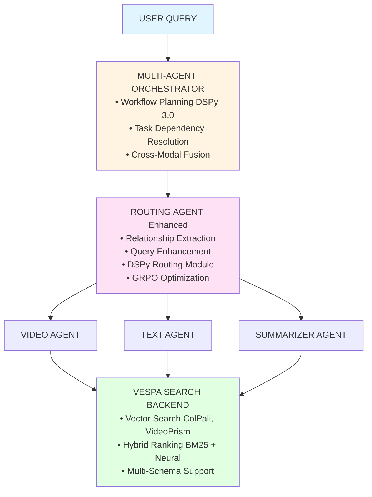
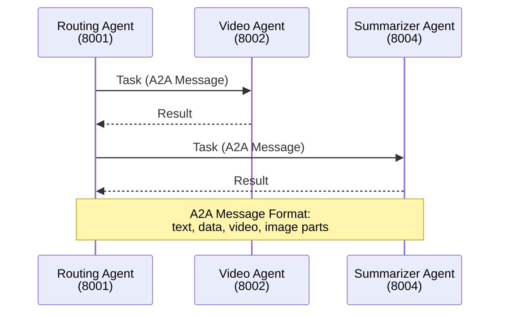
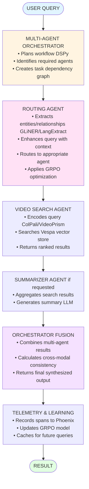
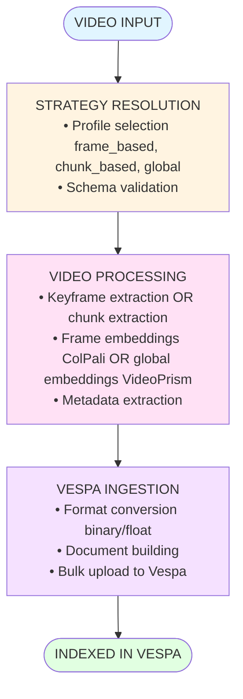

# Cogniverse System Architecture Overview

**Last Updated:** 2025-10-07
**Purpose:** Comprehensive study guide for understanding the multi-agent RAG system

---

## Table of Contents
1. [System Overview](#system-overview)
2. [Core Architecture](#core-architecture)
3. [Key Design Patterns](#key-design-patterns)
4. [Module Structure](#module-structure)
5. [Data Flow](#data-flow)
6. [Quick Reference](#quick-reference)

---

## System Overview

### What is Cogniverse?
Cogniverse is a **multi-agent RAG (Retrieval-Augmented Generation)** system designed for intelligent video content analysis and search with configurable processing pipelines.

### Key Capabilities
- **Multi-Modal Search**: Text-to-video, video-to-video, image-to-video search
- **Intelligent Routing**: DSPy-powered query routing with relationship extraction
- **Agent Orchestration**: Multi-agent workflows with dependency management
- **Video Processing**: Configurable keyframe extraction, transcription, embeddings
- **Production Features**: Caching, parallel execution, memory, telemetry

### Technology Stack
- **Framework**: Python 3.11+, DSPy 3.0, FastAPI
- **AI/ML**: ColPali, VideoPrism, Ollama (local LLMs), GLiNER (NER)
- **Search Backend**: Vespa (vector database)
- **Memory**: Mem0 (conversation memory)
- **Telemetry**: Phoenix (OpenTelemetry)
- **Optimization**: MLflow, GRPO, SIMBA

---

## Core Architecture

### High-Level System Diagram



### Agent Communication (A2A Protocol)



---

## Key Design Patterns

### 1. **Agent-to-Agent (A2A) Protocol**
- Standard message format for inter-agent communication
- Supports text, data, video, image parts
- Task-based workflow execution

### 2. **DSPy 3.0 Integration**
- Declarative programming for LLM applications
- Automatic prompt optimization
- Chain-of-thought reasoning

### 3. **Multi-Tenant Architecture**
- Tenant isolation for telemetry, memory, configuration
- Project-based separation in Phoenix
- LRU cache for tenant providers

### 4. **Tiered Routing Strategy**
```
Tier 1 (Fast):   GLiNER (NER-based)      → confidence > 0.7 ✓
Tier 2 (Medium): LLM (Ollama local)      → confidence > 0.6 ✓
Tier 3 (Slow):   LangExtract (Structured) → always succeeds
```

### 5. **Production-Ready Patterns**
- **Caching**: Multi-modal LRU cache per tenant
- **Parallel Execution**: AsyncIO-based agent orchestration
- **Circuit Breaker**: Fault tolerance for model inference
- **Health Checks**: Comprehensive monitoring
- **Graceful Degradation**: Fallback strategies at every level

---

## Module Structure

### **1. Agents Module** (`src/app/agents/`)
Core agent implementations with intelligence capabilities.

**Key Files:**
- `multi_agent_orchestrator.py` - Coordinates multi-agent workflows
- `routing_agent.py` - Enhanced routing with DSPy + GRPO
- `video_search_agent.py` - Multi-modal video search
- `summarizer_agent.py` - Content summarization
- `detailed_report_agent.py` - Comprehensive analysis
- `memory_aware_mixin.py` - Mem0 memory integration
- `query_analysis_tool_v3.py` - Advanced query understanding

**Study Guide:** `01_AGENTS_MODULE.md`

---

### **2. Routing Module** (`src/app/routing/`)
Intelligent query routing with multiple strategies.

**Key Files:**
- `strategies.py` - GLiNER, LLM, Keyword, Hybrid, Ensemble routing
- `advanced_optimizer.py` - GRPO optimization
- `cross_modal_optimizer.py` - Multi-modal fusion
- `query_enhancement_engine.py` - Query enrichment (SIMBA)
- `modality_cache.py` - Per-modality result caching
- `parallel_executor.py` - Concurrent agent execution

**Study Guide:** `02_ROUTING_MODULE.md`

---

### **3. Common Module** (`src/common/`)
Shared utilities, config, and interfaces.

**Key Files:**
- `unified_config.py` - Multi-tenant configuration system
- `config_store.py` - Vespa-backed config persistence
- `mem0_memory_manager.py` - Conversation memory
- `dynamic_dspy_mixin.py` - DSPy runtime integration
- `models/videoprism_text_encoder.py` - VideoPrism embeddings

**Study Guide:** `03_COMMON_MODULE.md`

---

### **4. Backends Module** (`src/backends/vespa/`)
Search backend integration with Vespa.

**Key Files:**
- `vespa_search_client.py` - Video search client
- `json_schema_parser.py` - Dynamic schema management
- `strategy_aware_processor.py` - Embedding format handling

**Study Guide:** `04_BACKENDS_MODULE.md`

---

### **5. Telemetry Module** (`src/app/telemetry/`)
Multi-tenant observability with Phoenix.

**Key Files:**
- `manager.py` - TelemetryManager (singleton)
- `config.py` - Telemetry configuration
- `modality_metrics.py` - Per-modality performance tracking

**Study Guide:** `05_TELEMETRY_MODULE.md`

---

### **6. Evaluation Module** (`src/evaluation/`)
Experiment tracking and routing evaluation.

**Key Files:**
- `core/experiment_tracker.py` - Phoenix experiment management
- `evaluators/routing_evaluator.py` - Routing decision evaluation
- `phoenix/analytics.py` - Performance analytics

**Study Guide:** `06_EVALUATION_MODULE.md`

---

### **7. Ingestion Module** (`src/app/ingestion/`)
Video processing pipeline with configurable strategies.

**Key Files:**
- `pipeline.py` - Main ingestion orchestration
- `strategy_factory.py` - Strategy resolution
- `processors/embedding_generator/` - Multi-modal embeddings

**Study Guide:** `07_INGESTION_MODULE.md`

---

## Data Flow

### End-to-End Query Processing



### Ingestion Pipeline Flow



---

## Quick Reference

### Agent Ports
- **Routing Agent**: 8001
- **Video Search Agent**: 8002
- **Text Agent**: 8003
- **Summarizer Agent**: 8004

### Key Configuration Files
- `configs/config.yaml` - Main system config
- `configs/schemas/*.json` - Vespa schemas
- `.env` - Environment variables

### Important Environment Variables
```bash
VESPA_URL=http://localhost
VESPA_PORT=8080
VESPA_SCHEMA=video_colpali_smol500_mv_frame
JAX_PLATFORM_NAME=cpu  # For VideoPrism
```

### Common Commands
```bash
# Run ingestion
JAX_PLATFORM_NAME=cpu uv run python scripts/run_ingestion.py \
  --video_dir data/testset/evaluation/sample_videos \
  --backend vespa

# Run tests
JAX_PLATFORM_NAME=cpu uv run pytest

# Start Phoenix dashboard
uv run streamlit run scripts/phoenix_dashboard_standalone.py
```

---

## Next Steps

For detailed module study guides, refer to:
1. `01_AGENTS_MODULE.md` - Agent architecture and workflows
2. `02_ROUTING_MODULE.md` - Routing strategies and optimization
3. `03_COMMON_MODULE.md` - Shared utilities and configuration
4. `04_BACKENDS_MODULE.md` - Vespa integration
5. `05_TELEMETRY_MODULE.md` - Observability and metrics
6. `06_EVALUATION_MODULE.md` - Experiment tracking
7. `07_INGESTION_MODULE.md` - Video processing pipeline

---

**Study Tips:**
1. Start with this overview to understand the big picture
2. Deep dive into individual modules as needed
3. Review sequence diagrams for data flow understanding
4. Experiment with the code using test files
5. Check integration tests for real-world usage patterns
