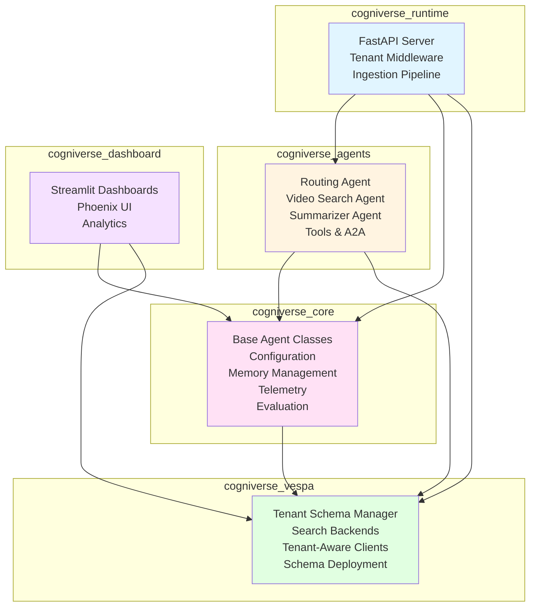
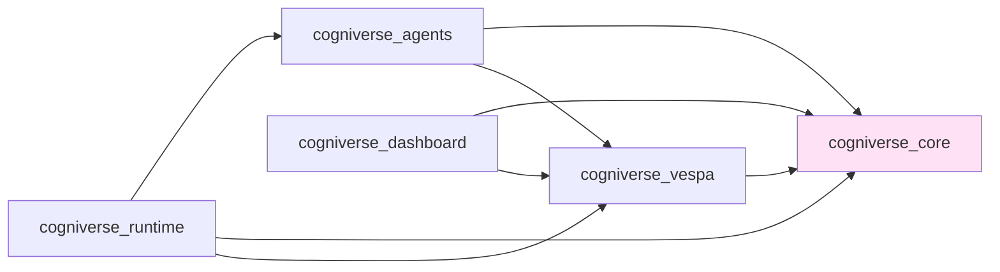
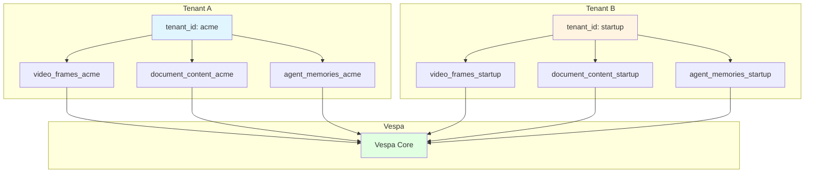
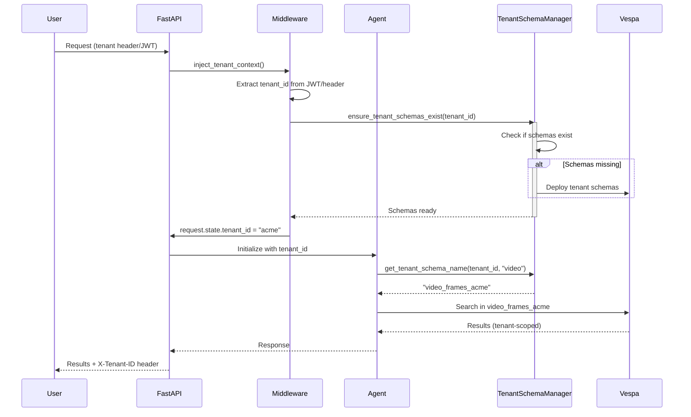
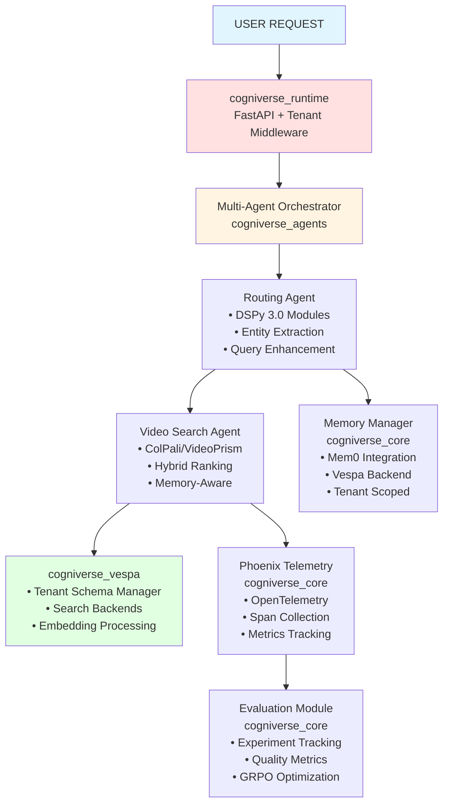
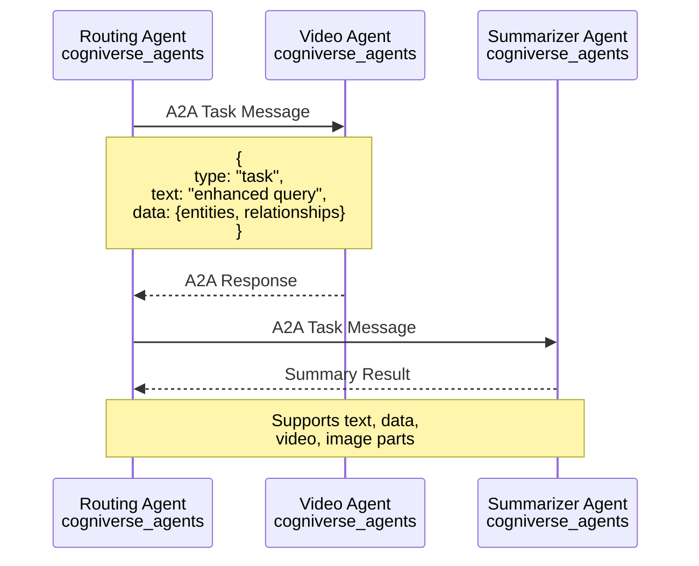

# Cogniverse System Architecture

**Last Updated:** 2025-10-15
**Purpose:** Comprehensive architecture guide for the multi-agent RAG system with SDK structure and multi-tenancy

---

## Table of Contents
1. [System Overview](#system-overview)
2. [SDK Architecture](#sdk-architecture)
3. [Multi-Tenant Architecture](#multi-tenant-architecture)
4. [Core Components](#core-components)
5. [Key Design Patterns](#key-design-patterns)
6. [Data Flow](#data-flow)
7. [Quick Reference](#quick-reference)

---

## System Overview

### What is Cogniverse?

Cogniverse is a **multi-agent RAG (Retrieval-Augmented Generation)** system designed for intelligent video content analysis and search with:
- **SDK Architecture**: Modular UV workspace with 5 independent packages
- **Multi-Tenant**: Complete isolation via schema-per-tenant pattern
- **Production-Ready**: Comprehensive telemetry, caching, and optimization

### Key Capabilities

- **Multi-Modal Search**: Text-to-video, video-to-video, image-to-video search
- **Intelligent Routing**: DSPy-powered query routing with relationship extraction
- **Agent Orchestration**: Multi-agent workflows with dependency management
- **Video Processing**: Configurable keyframe extraction, transcription, embeddings
- **Tenant Isolation**: Schema-per-tenant with independent configuration, memory, and telemetry

### Technology Stack

- **Framework**: Python 3.12+, UV workspace, FastAPI
- **AI/ML**: ColPali, VideoPrism, Ollama (local LLMs), DSPy 3.0, GLiNER (NER)
- **Search Backend**: Vespa (vector database)
- **Memory**: Mem0 with Vespa backend
- **Telemetry**: Phoenix (OpenTelemetry)
- **Optimization**: MLflow, GRPO, GEPA

---

## SDK Architecture

### UV Workspace Structure

Cogniverse uses a **monorepo workspace** with 5 independent packages:

```
cogniverse/
├── pyproject.toml                # Root workspace config
├── libs/
│   ├── core/                     # Core utilities and interfaces
│   │   ├── pyproject.toml
│   │   └── cogniverse_core/
│   │       ├── agents/           # Base agent classes
│   │       ├── common/           # Shared utilities
│   │       ├── config/           # Configuration management
│   │       ├── evaluation/       # Evaluation framework
│   │       ├── memory/           # Memory management
│   │       ├── registries/       # Component registries
│   │       └── telemetry/        # Observability
│   │
│   ├── agents/                   # Agent implementations
│   │   ├── pyproject.toml
│   │   └── cogniverse_agents/
│   │       ├── routing/          # Routing agent
│   │       ├── search/           # Search agents
│   │       └── tools/            # Agent tools
│   │
│   ├── vespa/                    # Vespa integration
│   │   ├── pyproject.toml
│   │   └── cogniverse_vespa/
│   │       ├── backends/         # Search backends
│   │       ├── schema/           # Schema management
│   │       └── tenant/           # Tenant management
│   │
│   ├── runtime/                  # Production runtime
│   │   ├── pyproject.toml
│   │   ├── Dockerfile
│   │   └── cogniverse_runtime/
│   │       ├── api/              # FastAPI endpoints
│   │       ├── ingestion/        # Video processing
│   │       └── middleware/       # Tenant middleware
│   │
│   └── dashboard/                # UI and dashboards
│       ├── pyproject.toml
│       ├── Dockerfile
│       └── cogniverse_dashboard/
│           ├── phoenix/          # Phoenix dashboards
│           └── streamlit/        # Streamlit apps
│
└── tests/                        # Test suite
    ├── agents/
    ├── memory/
    ├── ingestion/
    ├── evaluation/
    └── routing/
```

### Package Architecture Diagram



### Package Responsibilities

#### **cogniverse_core** (113 files)
Core utilities and interfaces shared across all packages.

**Key Modules**:
- `agents/`: Base agent classes, mixins (MemoryAwareMixin, HealthCheckMixin)
- `common/`: Shared utilities (tenant utils, Mem0 manager, config stores)
- `config/`: Configuration management (unified config, schema, API mixins)
- `evaluation/`: Evaluation framework (data models, metrics, storage)
- `memory/`: Memory management interfaces
- `registries/`: Agent, backend, and DSPy module registries
- `telemetry/`: Metrics tracking and observability

**Dependencies**: None (foundational package)

#### **cogniverse_agents** (101 files)
Agent implementations and routing logic.

**Key Modules**:
- `routing/`: Routing agent, strategies, evaluators
- `search/`: Video, document, web search agents
- `multi_modal/`: Multi-modal processing
- `tools/`: Agent tools and A2A protocol

**Dependencies**: `cogniverse_core`, `cogniverse_vespa`

#### **cogniverse_vespa** (16 files)
Vespa integration and tenant management.

**Key Modules**:
- `backends/`: Vespa search clients, ingestion clients
- `schema/`: JSON schema parser, schema manager
- `tenant/`: TenantSchemaManager, tenant-aware clients
- `embedding/`: Embedding format conversion

**Dependencies**: `cogniverse_core`

#### **cogniverse_runtime** (49 files)
Production runtime and APIs.

**Key Modules**:
- `api/`: FastAPI endpoints, tenant middleware
- `ingestion/`: Video processing pipeline
- `optimization/`: DSPy optimization workflows
- `deployment/`: Production deployment scripts

**Dependencies**: `cogniverse_core`, `cogniverse_agents`, `cogniverse_vespa`

**Deployment**: Docker container (`libs/runtime/Dockerfile`)

#### **cogniverse_dashboard** (54 files)
User interfaces and analytics.

**Key Modules**:
- `phoenix/`: Phoenix dashboard integrations
- `streamlit/`: Streamlit-based UI
- `analytics/`: Performance analytics
- `visualization/`: Embedding visualizations

**Dependencies**: `cogniverse_core`, `cogniverse_vespa`

**Deployment**: Docker container (`libs/dashboard/Dockerfile`)

### Package Dependency Graph



**Key**: Core is foundational, Vespa builds on Core, Agents uses both Core and Vespa, Runtime and Dashboard consume all packages.

---

## Multi-Tenant Architecture

### Schema-Per-Tenant Pattern

Cogniverse uses **physical tenant isolation** where each tenant gets dedicated Vespa schemas.



**Benefits**:
- **Physical Isolation**: No cross-tenant data leaks possible
- **No Query Filtering**: Entire schema is tenant-scoped
- **Independent Scaling**: Scale resources per tenant
- **Tenant-Specific Tuning**: Custom rank profiles, indexes per tenant

### Tenant Context Flow



### Multi-Tenant Components

#### **Tenant Middleware** (`libs/runtime/cogniverse_runtime/middleware/tenant_context.py`)
Extracts tenant_id from:
1. JWT token: `claims['organization_id']` (Logto integration)
2. Header: `X-Tenant-ID`
3. Query param: `?tenant_id=acme` (dev/testing)

#### **TenantSchemaManager** (`libs/vespa/cogniverse_vespa/tenant/tenant_schema_manager.py`)
Manages tenant schema lifecycle:
- `get_tenant_schema_name(tenant_id, base_schema)` → `{base_schema}_{tenant_id}`
- `ensure_tenant_schema_exists(tenant_id, base_schema)` → Lazy schema creation
- `deploy_tenant_schemas(tenant_id)` → Deploy all schemas for tenant
- `delete_tenant_schemas(tenant_id)` → Cleanup on tenant removal

#### **Tenant-Aware Backends** (`libs/vespa/cogniverse_vespa/backends/`)
All search clients are tenant-aware:
- Initialize with `tenant_id`
- Automatically route to tenant-specific schemas
- No hardcoded schema names

#### **Memory Isolation** (`libs/core/cogniverse_core/common/mem0_memory_manager.py`)
- Per-tenant singleton pattern: `Mem0MemoryManager._instances[tenant_id]`
- Tenant-specific Vespa schema: `agent_memories_{tenant_id}`
- `user_id=tenant_id` scoping in Mem0

#### **Telemetry Isolation** (`libs/core/cogniverse_core/telemetry/manager.py`)
- Phoenix projects per tenant: `{tenant_id}_routing_agent`
- Separate spans and traces per tenant
- Full observability isolation

---

## Core Components

### High-Level System Diagram



### Agent Communication (A2A Protocol)



---

## Key Design Patterns

### 1. **SDK Modularity**
- Each package has clear responsibilities
- Dependencies flow downward (no cycles)
- Core is foundational, runtime is top-level consumer

### 2. **Tenant Isolation**
- Schema-per-tenant for physical isolation
- Tenant context injected at middleware layer
- All components tenant-aware (search, memory, config, telemetry)

### 3. **DSPy 3.0 Integration**
- Declarative LLM programming
- Automatic prompt optimization
- Chain-of-thought reasoning
- Runtime module configuration

### 4. **Multi-Tier Routing**
```
Tier 1 (Fast):   GLiNER (NER-based)      → confidence > 0.7 ✓
Tier 2 (Medium): LLM (Ollama local)      → confidence > 0.6 ✓
Tier 3 (Slow):   LangExtract (Structured) → always succeeds
```

### 5. **Production-Ready Patterns**
- **Caching**: Multi-modal LRU cache per tenant
- **Parallel Execution**: AsyncIO-based agent orchestration
- **Circuit Breaker**: Fault tolerance for model inference
- **Health Checks**: Comprehensive monitoring per package
- **Graceful Degradation**: Fallback strategies at every level

---

## Data Flow

### End-to-End Query Processing

```
1. USER SUBMITS QUERY
   ↓
2. FastAPI (cogniverse_runtime)
   ├─→ Tenant Middleware extracts tenant_id
   └─→ Inject tenant_id into request.state
   ↓
3. Multi-Agent Orchestrator (cogniverse_agents)
   ├─→ Initialize agents with tenant_id
   └─→ Build task dependency graph
   ↓
4. Routing Agent (cogniverse_agents)
   ├─→ Extract entities (GLiNER)
   ├─→ Extract relationships
   ├─→ Enhance query
   └─→ Return RoutingDecision
   ↓
5. Video Search Agent (cogniverse_agents)
   ├─→ Get tenant schema name via TenantSchemaManager
   ├─→ Encode query (ColPali/VideoPrism)
   ├─→ Search tenant-specific Vespa schema
   ├─→ Apply relationship boost
   └─→ Return ranked results
   ↓
6. Orchestrator synthesizes response
   ↓
7. Return to USER
```

### Ingestion Pipeline Flow

```
1. VIDEO INPUT
   ↓
2. Ingestion Pipeline (cogniverse_runtime)
   ├─→ Strategy resolution (frame/chunk/global)
   └─→ Video processing (keyframes, transcription)
   ↓
3. Embedding Generation
   ├─→ ColPali (frame-based)
   ├─→ ColQwen (chunk-based)
   └─→ VideoPrism (global)
   ↓
4. Format Conversion (cogniverse_vespa)
   ├─→ Float embeddings (bfloat16 hex)
   └─→ Binary embeddings (int8 hex)
   ↓
5. Vespa Ingestion
   ├─→ TenantSchemaManager gets tenant schema
   ├─→ Build Vespa documents
   └─→ Bulk upload to tenant-specific schema
   ↓
6. INDEXED IN VESPA (tenant-scoped)
```

---

## Quick Reference

### Package Import Patterns

```python
# Core utilities
from cogniverse_core.agents.memory_aware_mixin import MemoryAwareMixin
from cogniverse_core.config.unified_config import SystemConfig
from cogniverse_core.telemetry.manager import TelemetryManager

# Agent implementations
from cogniverse_agents.routing.routing_agent import RoutingAgent
from cogniverse_agents.search.video_search_agent import VideoSearchAgent

# Vespa integration
from cogniverse_vespa.tenant.tenant_schema_manager import TenantSchemaManager
from cogniverse_vespa.backends.vespa_search_client import VespaSearchClient

# Runtime
from cogniverse_runtime.api.middleware.tenant_context import inject_tenant_context
```

### Key Ports

| Service | Port | Purpose |
|---------|------|---------|
| **Vespa HTTP** | 8080 | Document feed & search |
| **Vespa Config** | 19071 | Schema deployment |
| **Phoenix Web** | 6006 | Dashboard & experiments |
| **Phoenix Collector** | 4317 | OTLP span collection (gRPC) |
| **Ollama** | 11434 | LLM inference API |

### Common Commands

```bash
# Install UV workspace
uv sync

# Run tests (all packages)
JAX_PLATFORM_NAME=cpu uv run pytest

# Run tests (specific package)
JAX_PLATFORM_NAME=cpu uv run pytest tests/agents/

# Deploy tenant schema
uv run python scripts/deploy_tenant_schema.py --tenant-id acme

# Run ingestion
JAX_PLATFORM_NAME=cpu uv run python scripts/run_ingestion.py \
  --video_dir data/videos \
  --backend vespa \
  --tenant-id acme

# Start Phoenix dashboard
uv run streamlit run scripts/phoenix_dashboard_standalone.py
```

---

## Next Steps

For detailed guides, see:
- **[SDK Architecture](./sdk-architecture.md)** - Deep dive into UV workspace and package structure
- **[Multi-Tenant Architecture](./multi-tenant.md)** - Complete tenant isolation guide
- **[System Flows](./system-flows.md)** - Detailed sequence diagrams
- **[Module Documentation](../modules/)** - Per-package technical details

---

**Version**: 2.0 (SDK Architecture + Multi-Tenancy)
**Last Updated**: 2025-10-15
**Status**: Production-Ready
