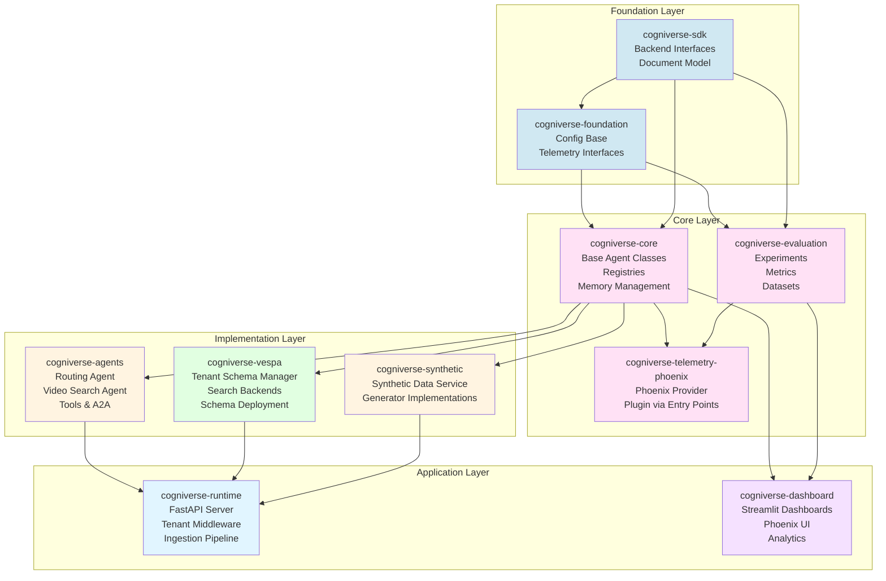
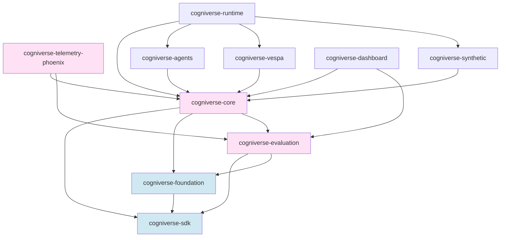
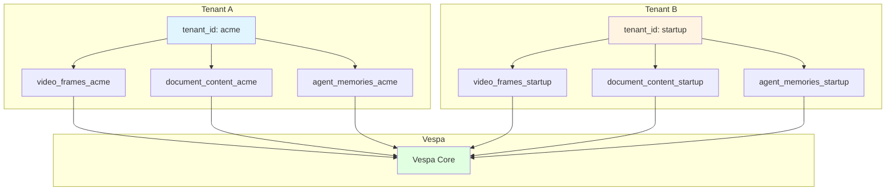
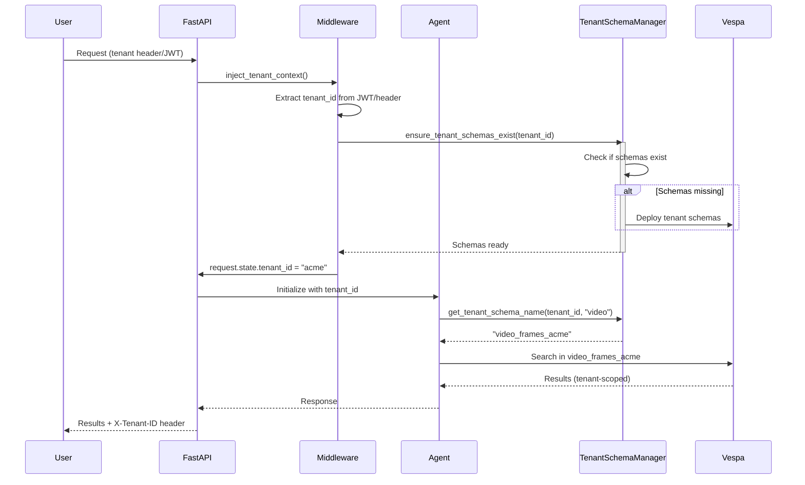
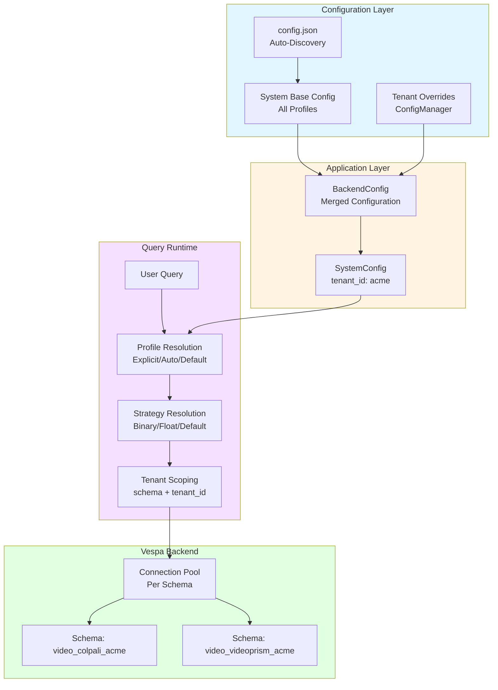
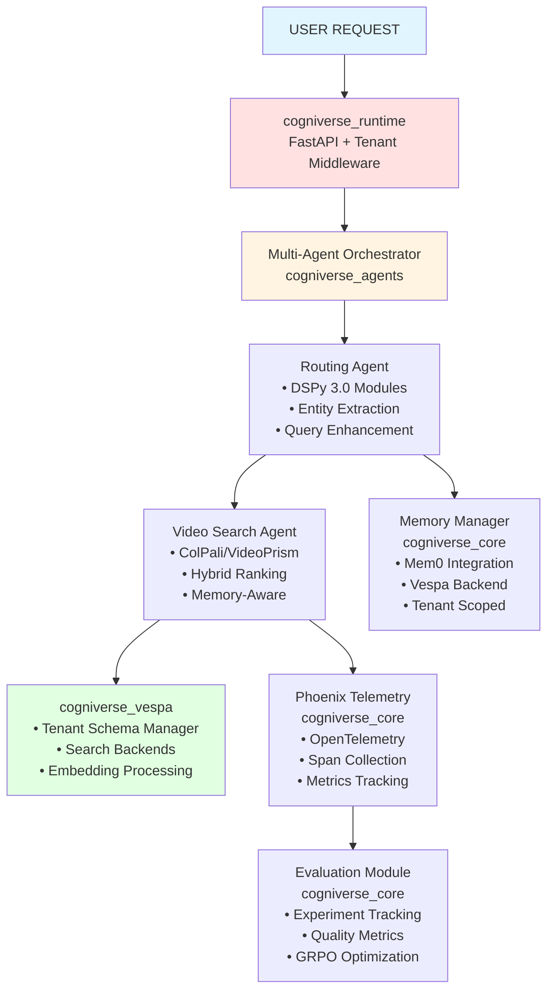
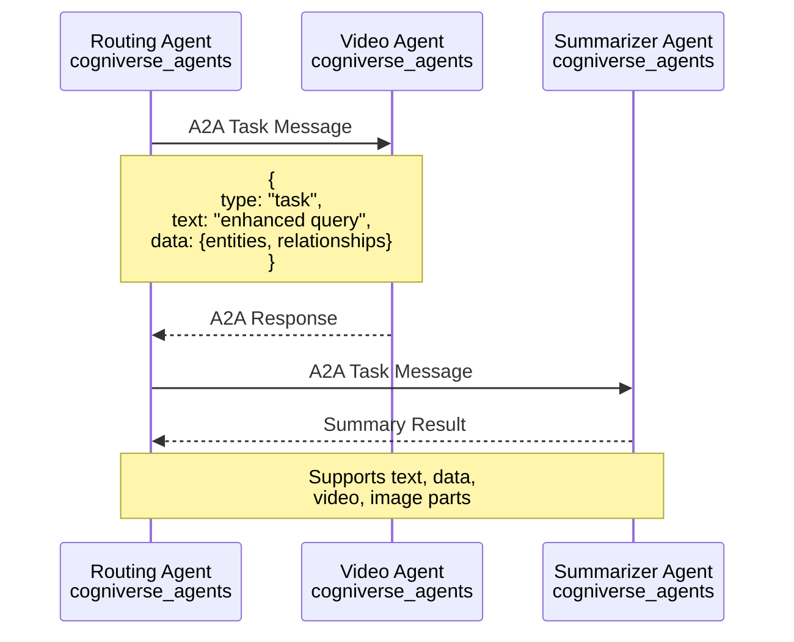

# Cogniverse System Architecture

**Last Updated:** 2026-01-25
**Purpose:** Comprehensive architecture guide for the general-purpose multi-agent AI platform with 11-package UV workspace structure and multi-tenancy

---

## Table of Contents
1. [System Overview](#system-overview)
2. [SDK Architecture](#sdk-architecture)
3. [Multi-Tenant Architecture](#multi-tenant-architecture)
4. [Core Components](#core-components)
5. [Key Design Patterns](#key-design-patterns)
6. [Data Flow](#data-flow)
7. [Quick Reference](#quick-reference)

---

## System Overview

### What is Cogniverse?

Cogniverse is a **Self-Optimizing Content Intelligence Platform** - a general-purpose multi-agent AI system with:
- **Extensible Agent Architecture**: Any agent type can integrate (content, web, code, domain-specific) via AgentBase/A2AAgent
- **11-Package Architecture**: Modular UV workspace with layered architecture (Foundation, Core, Implementation, Application)
- **DSPy Optimization**: Multiple optimizers available (GEPA, BootstrapFewShot, MIPRO, SIMBA) for continuous improvement
- **Multi-Tenant**: Complete physical isolation via schema-per-tenant pattern
- **Multi-Modal Understanding**: Built-in support for video, audio, images, documents, text, and dataframes
- **Production-Ready**: Comprehensive telemetry, caching, optimization, and evaluation

### Key Capabilities

- **Multi-Modal Search**: Video (frame/chunk/global), audio, images, documents, text with unified document model
- **Intelligent Routing**: DSPy 3.0-powered query routing with entity extraction and relationship detection
- **Agent Orchestration**: Multi-agent workflows with A2A protocol, dependency management, and parallel execution
- **Content Processing**: Frame extraction, audio transcription, embedding generation (ColPali, VideoPrism, ColQwen)
- **Experience-Guided Optimization**: GEPA optimizer for continuous learning from routing decisions
- **Tenant Isolation**: Schema-per-tenant with independent configuration, memory, telemetry, and evaluation

### Technology Stack

- **Framework**: Python 3.12+ (3.11+ for sdk/foundation), UV workspace, FastAPI, Streamlit
- **AI/ML**: ColPali (vidore/colsmol-500m), VideoPrism (scenic-t5), ColQwen, Ollama, DSPy 3.0 (GEPA, MIPRO, SIMBA, Bootstrap), GLiNER
- **Search Backend**: Vespa 8.x with 9 ranking strategies (BM25, float, binary, hybrid, phased)
- **Memory**: Mem0 with Vespa backend for multi-tenant context storage
- **Telemetry**: OpenTelemetry with Phoenix (Arize) collector
- **Optimization**: DSPy optimizers (GEPA, MIPRO, SIMBA, Bootstrap) with synthetic data generation
- **Evaluation**: Provider-agnostic evaluation framework with Phoenix provider implementation

---

## SDK Architecture

### UV Workspace Structure

Cogniverse uses a **monorepo workspace** with 11 packages in layered architecture:

```
cogniverse/
├── pyproject.toml                # Root workspace config
├── libs/
│   # FOUNDATION LAYER (Pure Interfaces)
│   ├── sdk/                      # cogniverse-sdk
│   │   ├── pyproject.toml
│   │   └── cogniverse_sdk/
│   │       ├── interfaces/       # Backend, ConfigStore, SchemaLoader interfaces
│   │       └── document.py       # Universal document model
│   │
│   ├── foundation/               # cogniverse-foundation
│   │   ├── pyproject.toml
│   │   └── cogniverse_foundation/
│   │       ├── config/           # Configuration base classes
│   │       └── telemetry/        # Telemetry interfaces
│   │
│   # CORE LAYER
│   ├── core/                     # cogniverse-core
│   │   ├── pyproject.toml
│   │   └── cogniverse_core/
│   │       ├── agents/           # Base agent classes
│   │       ├── common/           # Shared utilities
│   │       ├── registries/       # Component registries
│   │       └── memory/           # Memory management
│   │
│   ├── evaluation/               # cogniverse-evaluation
│   │   ├── pyproject.toml
│   │   └── cogniverse_evaluation/
│   │       ├── experiments/      # Experiment management
│   │       ├── metrics/          # Provider-agnostic metrics
│   │       ├── datasets/         # Dataset handling
│   │       └── storage/          # Storage interfaces
│   │
│   ├── telemetry-phoenix/        # cogniverse-telemetry-phoenix (Plugin)
│   │   ├── pyproject.toml
│   │   └── cogniverse_telemetry_phoenix/
│   │       ├── provider.py       # Phoenix telemetry provider
│   │       ├── evaluation/       # Phoenix evaluation provider
│   │       └── traces.py         # Phoenix trace queries
│   │
│   # IMPLEMENTATION LAYER
│   ├── agents/                   # cogniverse-agents
│   │   ├── pyproject.toml
│   │   └── cogniverse_agents/
│   │       ├── routing/          # Routing agents & DSPy optimization
│   │       ├── search/           # Search agents (video, document)
│   │       ├── orchestration/    # Composing agent
│   │       └── tools/            # A2A tools
│   │
│   ├── vespa/                    # cogniverse-vespa
│   │   ├── pyproject.toml
│   │   └── cogniverse_vespa/
│   │       ├── backends/         # Vespa search clients
│   │       ├── schema/           # Schema management
│   │       ├── tenant/           # Multi-tenant management
│   │       └── ingestion/        # Vespa ingestion
│   │
│   ├── synthetic/                # cogniverse-synthetic
│   │   ├── pyproject.toml
│   │   └── cogniverse_synthetic/
│   │       ├── service.py        # Main SyntheticDataService
│   │       ├── generators/       # Optimizer-specific generators
│   │       ├── profile_selector.py  # LLM-based profile selection
│   │       └── backend_querier.py   # Vespa content sampling
│   │
│   # APPLICATION LAYER
│   ├── runtime/                  # cogniverse-runtime
│   │   ├── pyproject.toml
│   │   ├── Dockerfile
│   │   └── cogniverse_runtime/
│   │       ├── server/           # FastAPI server
│   │       ├── api/              # API endpoints
│   │       ├── ingestion/        # Video processing
│   │       └── middleware/       # Tenant middleware
│   │
│   └── dashboard/                # cogniverse-dashboard
│       ├── pyproject.toml
│       ├── Dockerfile
│       └── cogniverse_dashboard/
│           ├── phoenix/          # Phoenix dashboards
│           └── streamlit/        # Streamlit apps
│
└── tests/                        # Test suite
    ├── sdk/
    ├── foundation/
    ├── core/
    ├── evaluation/
    ├── agents/
    ├── vespa/
    ├── synthetic/
    └── telemetry/
```

### Package Architecture Diagram



### Package Responsibilities

#### **Foundation Layer**

##### **cogniverse_sdk**
Pure backend interfaces with zero internal Cogniverse dependencies.

**Key Modules**:
- `interfaces/backend.py`: Backend interface (search + ingestion)
- `interfaces/config_store.py`: Configuration storage interface
- `interfaces/schema_loader.py`: Schema template loading interface
- `document.py`: Universal document model

**Dependencies**: None (only numpy for embedding arrays)

##### **cogniverse_foundation**
Cross-cutting concerns and shared infrastructure.

**Key Modules**:
- `config/`: Configuration base classes and utilities
- `telemetry/`: Telemetry interface definitions

**Dependencies**: `cogniverse_sdk`

#### **Core Layer**

##### **cogniverse_core**
Core functionality, base classes, and registries.

**Key Modules**:
- `agents/`: Base agent classes, mixins (MemoryAwareMixin, HealthCheckMixin)
- `common/`: Shared utilities (tenant utils, Mem0 manager)
- `registries/`: Agent, backend, and DSPy module registries
- `memory/`: Memory management interfaces

**Dependencies**: `cogniverse_sdk`, `cogniverse_foundation`, `cogniverse_evaluation`

##### **cogniverse_evaluation**
Provider-agnostic evaluation framework.

**Key Modules**:
- `experiments/`: Experiment management and tracking
- `metrics/`: Provider-agnostic metrics (accuracy, relevance, etc.)
- `datasets/`: Dataset handling and validation
- `storage/`: Storage interface for evaluation data

**Dependencies**: `cogniverse_sdk`, `cogniverse_foundation`

##### **cogniverse_telemetry_phoenix**
Phoenix-specific telemetry provider (plugin architecture).

**Key Modules**:
- `provider.py`: Phoenix telemetry provider implementation
- `evaluation/`: Phoenix evaluation provider
- `traces.py`: Phoenix trace query utilities
- `annotations.py`: Annotation management

**Dependencies**: `cogniverse_core`, `cogniverse_evaluation`

**Plugin Registration**: Entry points for auto-discovery

#### **Implementation Layer**

##### **cogniverse_agents**
Agent implementations and routing logic.

**Key Modules**:
- `routing/`: Routing agent, strategies, evaluators
- `search/`: Video, document, web search agents
- `orchestration/`: Composing agent
- `tools/`: Agent tools and A2A protocol

**Dependencies**: `cogniverse_core`

##### **cogniverse_vespa**
Vespa integration and tenant management.

**Key Modules**:
- `backends/`: Vespa search clients, ingestion clients
- `schema/`: JSON schema parser, schema manager
- `tenant/`: TenantSchemaManager, tenant-aware clients
- `embedding/`: Embedding format conversion

**Dependencies**: `cogniverse_core`

##### **cogniverse_synthetic**
Synthetic data generation for optimizer training.

**Key Modules**:
- `service.py`: Main SyntheticDataService
- `generators/`: Optimizer-specific generators (GEPA, MIPRO, etc.)
- `profile_selector.py`: LLM-based profile selection
- `backend_querier.py`: Vespa content sampling

**Dependencies**: `cogniverse_core`

#### **Application Layer**

##### **cogniverse_runtime**
Production runtime and APIs.

**Key Modules**:
- `server/`: FastAPI server
- `api/`: API endpoints, tenant middleware
- `ingestion/`: Video processing pipeline
- `middleware/`: Tenant context injection

**Dependencies**: `cogniverse_core`, `cogniverse_agents`, `cogniverse_vespa`, `cogniverse_synthetic`

**Deployment**: Docker container (`libs/runtime/Dockerfile`)

##### **cogniverse_dashboard**
User interfaces and analytics.

**Key Modules**:
- `phoenix/`: Phoenix dashboard integrations
- `streamlit/`: Streamlit-based UI
- `analytics/`: Performance analytics
- `visualization/`: Embedding visualizations

**Dependencies**: `cogniverse_core`, `cogniverse_evaluation`

**Deployment**: Docker container (`libs/dashboard/Dockerfile`)

### Package Dependency Graph



**Key**: SDK is the pure foundation with zero internal dependencies. Foundation builds on SDK. Core depends on SDK, Foundation, and Evaluation. Telemetry-Phoenix is a plugin. Implementation layer (Agents, Vespa, Synthetic) depends on Core. Application layer (Runtime, Dashboard) consumes lower layers.

---

## Multi-Tenant Architecture

### Schema-Per-Tenant Pattern

Cogniverse uses **physical tenant isolation** where each tenant gets dedicated Vespa schemas.



**Benefits**:
- **Physical Isolation**: No cross-tenant data leaks possible
- **No Query Filtering**: Entire schema is tenant-scoped
- **Independent Scaling**: Scale resources per tenant
- **Tenant-Specific Tuning**: Custom rank profiles, indexes per tenant

### Tenant Context Flow



### Multi-Tenant Components

#### **Tenant Middleware** (`libs/runtime/cogniverse_runtime/middleware/tenant_context.py`)
Extracts tenant_id from:
1. JWT token: `claims['organization_id']` (Logto integration)
2. Header: `X-Tenant-ID`
3. Query param: `?tenant_id=acme` (dev/testing)

#### **TenantSchemaManager** (`libs/vespa/cogniverse_vespa/tenant_schema_manager.py`)
Manages tenant schema lifecycle:
- `get_tenant_schema_name(tenant_id, base_schema)` → `{base_schema}_{tenant_id}`
- `ensure_tenant_schema_exists(tenant_id, base_schema)` → Lazy schema creation
- `deploy_tenant_schemas(tenant_id)` → Deploy all schemas for tenant
- `delete_tenant_schemas(tenant_id)` → Cleanup on tenant removal

#### **Tenant-Aware Backends** (`libs/vespa/cogniverse_vespa/`)
All search clients are tenant-aware:
- Initialize with `tenant_id`
- Automatically route to tenant-specific schemas
- No hardcoded schema names

#### **Memory Isolation** (`libs/core/cogniverse_core/common/mem0_memory_manager.py`)
- Per-tenant singleton pattern: `Mem0MemoryManager._instances[tenant_id]`
- Tenant-specific Vespa schema: `agent_memories_{tenant_id}`
- `user_id=tenant_id` scoping in Mem0

#### **Telemetry Isolation** (`libs/core/cogniverse_core/telemetry/manager.py`)
- Phoenix projects per tenant: `{tenant_id}_routing_agent`
- Separate spans and traces per tenant
- Full observability isolation

### Backend Configuration (Phase 6)

**Commits**: d307aad, 023ca59
**Feature**: Tenant-aware backend configuration with profile-based video processing

Phase 6 introduced hierarchical backend configuration enabling per-tenant customization of video processing pipelines:

#### Key Features

**1. Profile-Based Configuration**
```python
from cogniverse_core.config.unified_config import BackendConfig, BackendProfileConfig

# Backend profile defines video processing pipeline
profile = BackendProfileConfig(
    profile_name="video_colpali_smol500_mv_frame",
    schema_name="video_colpali_smol500_mv_frame",
    embedding_model="vidore/colsmol-500m",
    pipeline_config={
        "extract_keyframes": True,
        "keyframe_fps": 1.0,
        "max_frames": 100,
        "transcribe_audio": True
    },
    strategies={
        "segmentation": {"class": "FrameSegmentationStrategy"},
        "embedding": {"class": "MultiVectorEmbeddingStrategy"}
    },
    embedding_type="binary"
)
```

**2. Auto-Discovery**
- Automatically loads `config.json` from standard locations:
  - `COGNIVERSE_CONFIG` environment variable
  - `configs/config.json` (workspace root)
  - `../configs/config.json` (one level up)
- No manual configuration path specification required

**3. Tenant Configuration Overlay**
- System provides base configuration for all tenants
- Tenants can override specific settings via `ConfigManager`
- Deep merge: System base + Tenant overrides = Tenant config
- Example: Premium tenants get higher `max_frames` (200 vs 100)

**4. Query-Time Resolution**
- Profile selection at query time (explicit or auto-select)
- Strategy resolution based on embedding type
- Tenant schema scoping automatic

**Benefits**:
- **Customization**: Per-tenant video processing optimization
- **Resource Control**: Different quality tiers for different tenants
- **Flexibility**: Runtime profile selection without restart
- **Isolation**: Tenant configs don't interfere

#### Phase 6 Architecture Diagram



**See**: [Multi-Tenant Architecture](multi-tenant.md#backend-configuration) for complete details

---

## Core Components

### High-Level System Diagram



### Agent Communication (A2A Protocol)



---

## Key Design Patterns

### 1. **SDK Modularity**
- Each package has clear responsibilities
- Dependencies flow downward (no cycles)
- Core is foundational, runtime is top-level consumer

### 2. **Tenant Isolation**
- Schema-per-tenant for physical isolation
- Tenant context injected at middleware layer
- All components tenant-aware (search, memory, config, telemetry)

### 3. **DSPy 3.0 Integration**
- Declarative LLM programming
- Automatic prompt optimization
- Chain-of-thought reasoning
- Runtime module configuration

### 4. **Multi-Tier Routing**
```
Tier 1 (Fast):   GLiNER (NER-based)      → confidence > 0.7 ✓
Tier 2 (Medium): LLM (Ollama local)      → confidence > 0.6 ✓
Tier 3 (Slow):   LangExtract (Structured) → always succeeds
```

### 5. **Production-Ready Patterns**
- **Caching**: Multi-modal LRU cache per tenant
- **Parallel Execution**: AsyncIO-based agent orchestration
- **Circuit Breaker**: Fault tolerance for model inference
- **Health Checks**: Comprehensive monitoring per package
- **Graceful Degradation**: Fallback strategies at every level

---

## Data Flow

### End-to-End Query Processing

```
1. USER SUBMITS QUERY
   ↓
2. FastAPI (cogniverse_runtime)
   ├─→ Tenant Middleware extracts tenant_id
   └─→ Inject tenant_id into request.state
   ↓
3. Multi-Agent Orchestrator (cogniverse_agents)
   ├─→ Initialize agents with tenant_id
   └─→ Build task dependency graph
   ↓
4. Routing Agent (cogniverse_agents)
   ├─→ Extract entities (GLiNER)
   ├─→ Extract relationships
   ├─→ Enhance query
   └─→ Return RoutingDecision
   ↓
5. Video Search Agent (cogniverse_agents)
   ├─→ Get tenant schema name via TenantSchemaManager
   ├─→ Encode query (ColPali/VideoPrism)
   ├─→ Search tenant-specific Vespa schema
   ├─→ Apply relationship boost
   └─→ Return ranked results
   ↓
6. Orchestrator synthesizes response
   ↓
7. Return to USER
```

### Ingestion Pipeline Flow

```
1. VIDEO INPUT
   ↓
2. Ingestion Pipeline (cogniverse_runtime)
   ├─→ Strategy resolution (frame/chunk/global)
   └─→ Video processing (keyframes, transcription)
   ↓
3. Embedding Generation
   ├─→ ColPali (frame-based)
   ├─→ ColQwen (chunk-based)
   └─→ VideoPrism (global)
   ↓
4. Format Conversion (cogniverse_vespa)
   ├─→ Float embeddings (bfloat16 hex)
   └─→ Binary embeddings (int8 hex)
   ↓
5. Vespa Ingestion
   ├─→ TenantSchemaManager gets tenant schema
   ├─→ Build Vespa documents
   └─→ Bulk upload to tenant-specific schema
   ↓
6. INDEXED IN VESPA (tenant-scoped)
```

---

## Quick Reference

### Package Import Patterns

```python
# Core utilities
from cogniverse_core.agents.memory_aware_mixin import MemoryAwareMixin
from cogniverse_core.config.unified_config import SystemConfig
from cogniverse_core.telemetry.manager import TelemetryManager

# Agent implementations
from cogniverse_agents.routing_agent import RoutingAgent
from cogniverse_agents.video_search_agent import VideoSearchAgent

# Vespa integration
from cogniverse_vespa.tenant_schema_manager import TenantSchemaManager
from cogniverse_vespa.vespa_search_client import VespaSearchClient

# Runtime
from cogniverse_runtime.api.middleware.tenant_context import inject_tenant_context
```

### Key Ports

| Service | Port | Purpose |
|---------|------|---------|
| **Vespa HTTP** | 8080 | Document feed & search |
| **Vespa Config** | 19071 | Schema deployment |
| **Phoenix Web** | 6006 | Dashboard & experiments |
| **Phoenix Collector** | 4317 | OTLP span collection (gRPC) |
| **Ollama** | 11434 | LLM inference API |

### Common Commands

```bash
# Install UV workspace
uv sync

# Run tests (all packages)
JAX_PLATFORM_NAME=cpu uv run pytest

# Run tests (specific package)
JAX_PLATFORM_NAME=cpu uv run pytest tests/agents/

# Deploy tenant schema
uv run python scripts/deploy_tenant_schema.py --tenant-id acme

# Run ingestion
JAX_PLATFORM_NAME=cpu uv run python scripts/run_ingestion.py \
  --video_dir data/videos \
  --backend vespa \
  --tenant-id acme

# Start Phoenix dashboard
uv run streamlit run scripts/phoenix_dashboard_standalone.py
```

---

## Next Steps

For detailed guides, see:
- **[SDK Architecture](./sdk-architecture.md)** - Deep dive into UV workspace and package structure
- **[Multi-Tenant Architecture](./multi-tenant.md)** - Complete tenant isolation guide
- **[System Flows](./system-flows.md)** - Detailed sequence diagrams
- **[Module Documentation](../modules/)** - Per-package technical details

---

**Version**: 2.1.0
**Architecture**: UV Workspace (11 Packages - Layered Architecture)
**Last Updated:** 2026-01-25
**Status**: Production Ready
