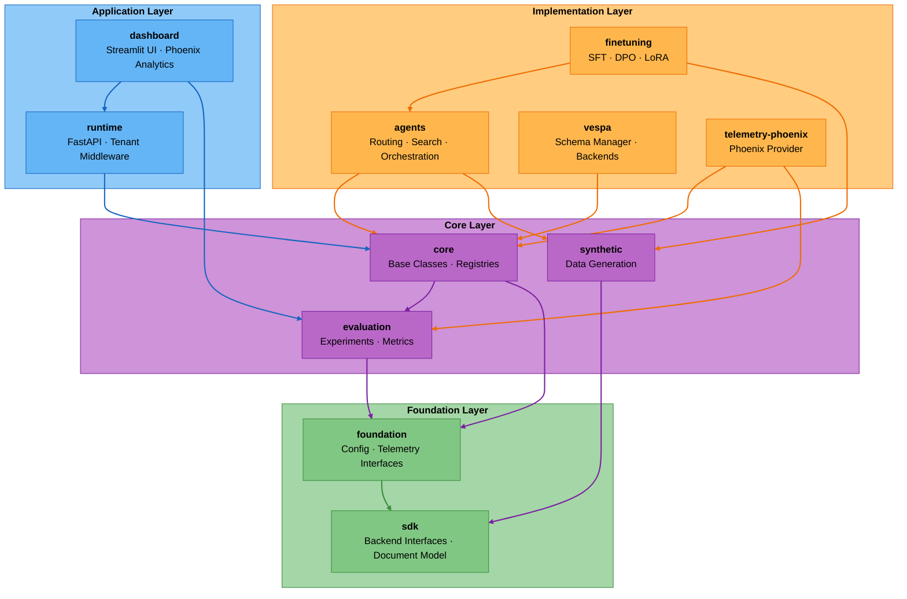
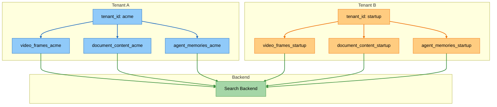
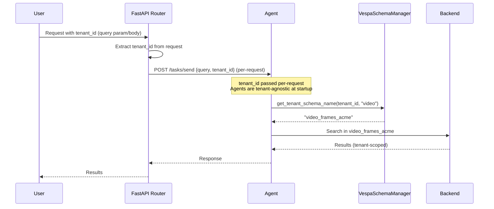
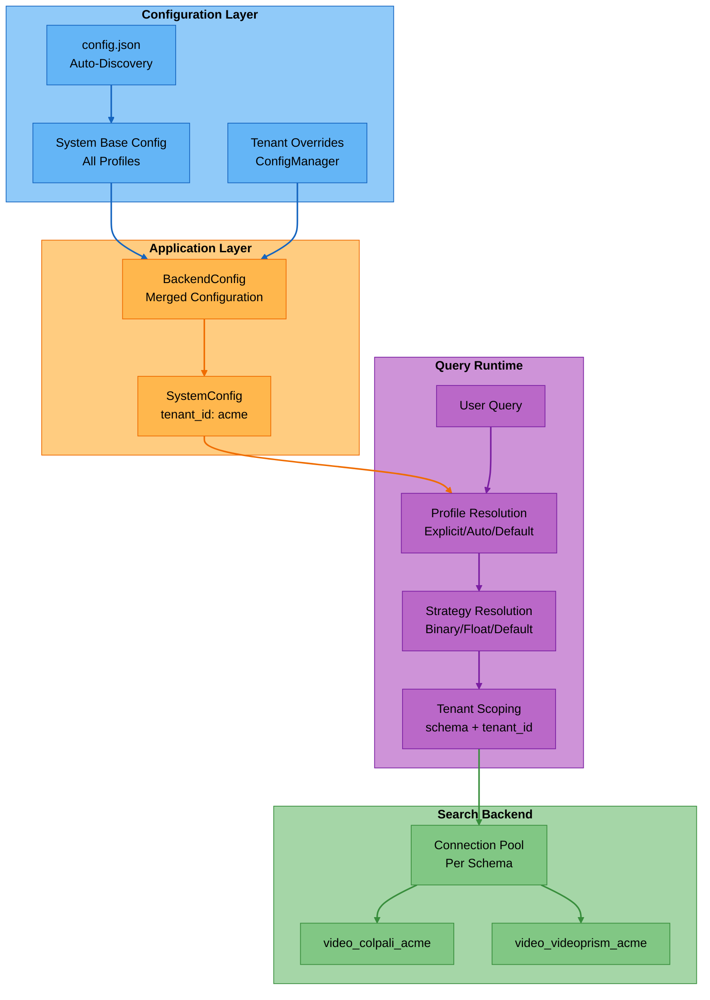
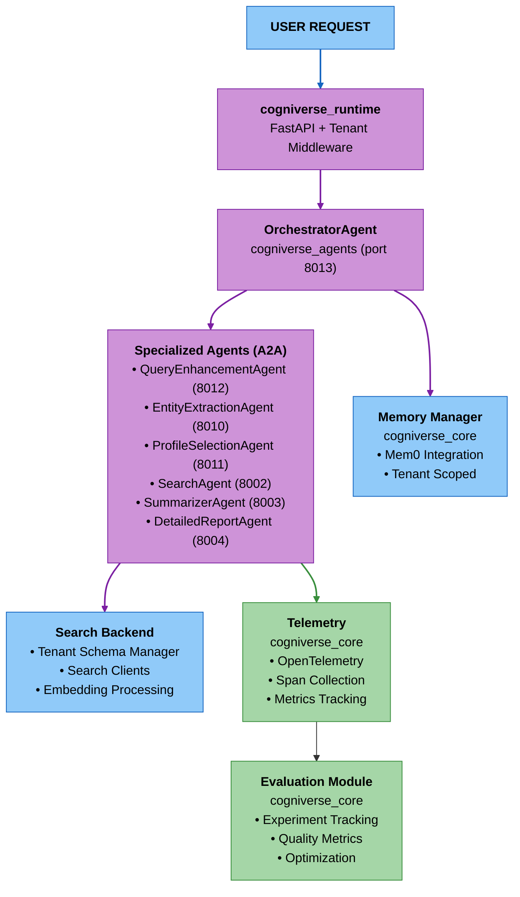
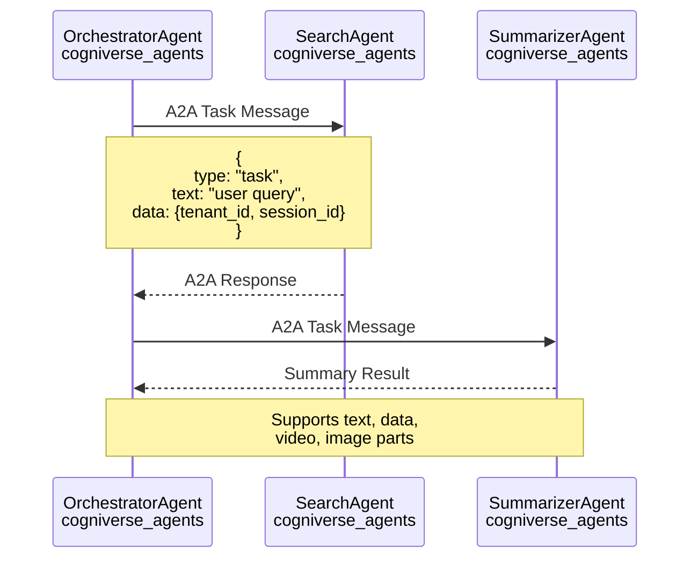

# Cogniverse System Architecture

---

## Table of Contents

1. [SDK Architecture](#sdk-architecture)
2. [Multi-Tenant Architecture](#multi-tenant-architecture)
3. [Core Components](#core-components)

---

## SDK Architecture

### UV Workspace Structure

Cogniverse uses a **monorepo workspace** with a layered architecture:

```text
cogniverse/
├── pyproject.toml                # Root workspace config
├── libs/
│   # FOUNDATION LAYER (Pure Interfaces)
│   ├── sdk/                      # cogniverse-sdk
│   │   ├── pyproject.toml
│   │   └── cogniverse_sdk/
│   │       ├── interfaces/       # Backend, ConfigStore, SchemaLoader, AdapterStore, WorkflowStore interfaces
│   │       └── document.py       # Universal document model
│   │
│   ├── foundation/               # cogniverse-foundation
│   │   ├── pyproject.toml
│   │   └── cogniverse_foundation/
│   │       ├── cache/            # Cache utilities
│   │       ├── config/           # Configuration base classes
│   │       ├── telemetry/        # Telemetry interfaces
│   │       └── utils/            # Utility functions
│   │
│   # CORE LAYER
│   ├── core/                     # cogniverse-core
│   │   ├── pyproject.toml
│   │   └── cogniverse_core/
│   │       ├── agents/           # Base agent classes
│   │       ├── common/           # Shared utilities
│   │       ├── events/           # EventQueue for real-time notifications
│   │       ├── registries/       # Component registries
│   │       └── memory/           # Memory management
│   │
│   ├── evaluation/               # cogniverse-evaluation
│   │   ├── pyproject.toml
│   │   └── cogniverse_evaluation/
│   │       ├── core/             # Experiment tracking, scorers, solvers
│   │       ├── evaluators/       # LLM judges, visual evaluators
│   │       ├── metrics/          # Provider-agnostic metrics
│   │       ├── data/             # Dataset handling and storage
│   │       └── providers/        # Evaluation provider registry
│   │
│   ├── synthetic/                # cogniverse-synthetic
│   │   ├── pyproject.toml
│   │   └── cogniverse_synthetic/
│   │       ├── service.py        # Main SyntheticDataService
│   │       ├── generators/       # Optimizer-specific generators
│   │       ├── profile_selector.py  # LLM-based profile selection
│   │       └── backend_querier.py   # Backend content sampling
│   │
│   # IMPLEMENTATION LAYER
│   ├── agents/                   # cogniverse-agents
│   │   ├── pyproject.toml
│   │   └── cogniverse_agents/
│   │       ├── routing/          # Routing agents & DSPy optimization
│   │       ├── search/           # Search service, base classes, rerankers
│   │       ├── orchestrator/     # Multi-agent orchestrator
│   │       └── tools/            # A2A tools
│   │
│   ├── telemetry-phoenix/        # cogniverse-telemetry-phoenix (Plugin)
│   │   ├── pyproject.toml
│   │   └── cogniverse_telemetry_phoenix/
│   │       ├── provider.py       # Phoenix telemetry provider
│   │       └── evaluation/       # Evaluation, analytics, monitoring providers
│   │
│   ├── vespa/                    # cogniverse-vespa
│   │   ├── pyproject.toml
│   │   └── cogniverse_vespa/
│   │       ├── config/           # Config store
│   │       ├── registry/         # Adapter store
│   │       ├── workflow/         # Workflow store
│   │       ├── vespa_schema_manager.py
│   │       ├── vespa_search_client.py
│   │       └── ingestion_client.py
│   │
│   ├── finetuning/               # cogniverse-finetuning
│   │   ├── pyproject.toml
│   │   └── cogniverse_finetuning/
│   │       ├── training/         # SFT, DPO training loops
│   │       ├── dataset/          # Trace-to-trajectory conversion
│   │       ├── registry/         # Adapter storage and versioning
│   │       └── orchestrator.py   # End-to-end finetuning orchestrator
│   │
│   # APPLICATION LAYER
│   ├── runtime/                  # cogniverse-runtime
│   │   ├── pyproject.toml
│   │   ├── Dockerfile
│   │   └── cogniverse_runtime/
│   │       ├── main.py           # FastAPI app
│   │       ├── routers/          # API endpoints
│   │       ├── ingestion/        # Video processing
│   │       ├── search/           # Search service
│   │       └── admin/            # Admin functionality
│   │
│   └── dashboard/                # cogniverse-dashboard
│       ├── pyproject.toml
│       ├── Dockerfile
│       └── cogniverse_dashboard/
│           ├── app.py            # Streamlit app
│           └── utils/            # Utilities
│
└── tests/                        # Test suite
    ├── admin/                    # Admin functionality tests
    ├── agents/                   # Agent tests
    ├── backends/                 # Backend integration tests
    ├── common/                   # Shared utility tests
    ├── dashboard/                # Dashboard tests
    ├── evaluation/               # Evaluation framework tests
    ├── events/                   # EventQueue tests
    ├── finetuning/               # Finetuning tests
    ├── ingestion/                # Pipeline tests
    ├── memory/                   # Memory manager tests
    ├── routing/                  # Routing agent tests
    ├── synthetic/                # Synthetic data tests
    ├── system/                   # System integration tests
    ├── telemetry/                # Telemetry provider tests
    ├── ui/                       # UI component tests
    └── utils/                    # Utility tests
```

### Package Architecture Diagram



### Package Responsibilities

| Layer | Package | Description | Key Modules | Dependencies |
|-------|---------|-------------|-------------|--------------|
| **Foundation** | **cogniverse_sdk** | Pure backend interfaces with zero internal dependencies | • `interfaces/backend.py` — Backend interface (search + ingestion)<br>• `interfaces/config_store.py` — Configuration storage interface<br>• `interfaces/schema_loader.py` — Schema template loading interface<br>• `document.py` — Universal document model | None |
| **Foundation** | **cogniverse_foundation** | Cross-cutting concerns and shared infrastructure | • `config/` — Configuration base classes and utilities<br>• `telemetry/` — Telemetry interface definitions | sdk |
| **Core** | **cogniverse_core** | Core functionality, base classes, and registries | • `agents/` — Base agent classes, mixins (MemoryAwareMixin, HealthCheckMixin)<br>• `common/` — Shared utilities (tenant utils, caching, VLM interface)<br>• `registries/` — Agent, backend, and DSPy module registries<br>• `memory/` — Memory management (Mem0MemoryManager) | sdk, foundation, evaluation |
| **Core** | **cogniverse_evaluation** | Provider-agnostic evaluation framework | • `core/` — Experiment tracking, scorers, solvers<br>• `evaluators/` — LLM judges, visual evaluators<br>• `metrics/` — Provider-agnostic metrics (accuracy, relevance)<br>• `data/` — Dataset handling and storage | sdk, foundation |
| **Implementation** | **cogniverse_telemetry_phoenix** | Phoenix-specific telemetry provider (plugin architecture) | • `provider.py` — Phoenix telemetry provider implementation<br>• `evaluation/` — Evaluation, analytics, and monitoring providers | core, evaluation |
| **Implementation** | **cogniverse_agents** | Agent implementations and routing logic | • `routing/` — Routing agent, strategies, evaluators<br>• `search/` — Search service, base classes, rerankers<br>• `orchestrator/` — Multi-agent orchestrator<br>• `tools/` — Agent tools and A2A protocol | sdk, core, synthetic |
| **Implementation** | **cogniverse_vespa** | Backend integration and tenant management | • `config/` — Configuration store and profile mapping<br>• `registry/` — Backend registry for Vespa<br>• `workflow/` — Deployment workflows<br>• Core modules: `vespa_schema_manager.py`, `vespa_search_client.py`, `ingestion_client.py` | sdk, core |
| **Core** | **cogniverse_synthetic** | Synthetic data generation for optimizer training | • `service.py` — Main SyntheticDataService<br>• `generators/` — Optimizer-specific generators (GEPA, MIPRO, etc.)<br>• `profile_selector.py` — LLM-based profile selection<br>• `backend_querier.py` — Backend content sampling | sdk |
| **Implementation** | **cogniverse_finetuning** | LLM fine-tuning infrastructure | • `training/` — SFT, DPO training loops<br>• `dataset/` — Trace-to-trajectory conversion<br>• `registry/` — Adapter storage and versioning<br>• `orchestrator.py` — End-to-end finetuning orchestrator | sdk, core, foundation, agents, synthetic |
| **Application** | **cogniverse_runtime** | Production runtime and APIs | • `routers/` — FastAPI route handlers (search, ingestion, admin)<br>• `ingestion/` — Video processing pipeline and processors<br>• `admin/` — Administrative endpoints<br>• `search/` — Search service layer | sdk, core (optional: vespa, agents) |
| **Application** | **cogniverse_dashboard** | User interfaces and analytics | • `app.py` — Main Streamlit dashboard application<br>• `utils/` — Utility functions (phoenix_launcher, etc.) | sdk, core, evaluation, runtime |

---

## Multi-Tenant Architecture

### Schema-Per-Tenant Pattern

Cogniverse uses **physical tenant isolation** where each tenant gets dedicated backend schemas.



**Benefits**:

- **Physical Isolation**: No cross-tenant data leaks possible
- **No Query Filtering**: Entire schema is tenant-scoped
- **Independent Scaling**: Scale resources per tenant
- **Tenant-Specific Tuning**: Custom rank profiles, indexes per tenant

### Tenant Context Flow



### Multi-Tenant Components

#### **Tenant Context Extraction** (handled inline in routers)

Tenant identification is extracted directly in router handlers from:

1. Query parameter: `tenant_id=acme`
2. Request body field: `tenant_id` in POST requests
3. Default fallback: `"default"` if not specified

#### **Backend Interface** (`libs/sdk/cogniverse_sdk/interfaces/backend.py`)

Pluggable backend implementations (e.g., Vespa) implement these tenant schema methods:

- `get_tenant_schema_name(tenant_id, base_schema)` → `{base_schema}_{tenant_id}`
- `schema_exists(schema_name, tenant_id)` → Check if schema exists
- `deploy_schemas(schema_definitions)` → Deploy schemas for tenant
- `delete_schema(schema_name, tenant_id)` → Cleanup on tenant removal

#### **Tenant-Aware Backends**

All search clients are tenant-aware:

- Initialize with `tenant_id`
- Automatically route to tenant-specific schemas
- No hardcoded schema names

#### **Memory Isolation** (`libs/core/cogniverse_core/memory/manager.py`)

- Per-tenant singleton pattern: `Mem0MemoryManager._instances[tenant_id]`
- Tenant-specific backend schema: `agent_memories_{tenant_id}`
- `user_id=tenant_id` scoping in Mem0

#### **Telemetry Isolation** (`libs/foundation/cogniverse_foundation/telemetry/manager.py`)

- Telemetry projects per tenant: `{tenant_id}_routing_agent`
- Separate spans and traces per tenant
- Full observability isolation

### Tenant Backend Configuration

Hierarchical configuration system enabling per-tenant customization of video processing pipelines:

#### Key Features

**1. Profile-Based Configuration**
```python
from cogniverse_foundation.config.unified_config import BackendConfig, BackendProfileConfig

# Backend profile defines video processing pipeline
profile = BackendProfileConfig(
    profile_name="video_colpali_smol500_mv_frame",
    schema_name="video_colpali_smol500_mv_frame",
    embedding_model="vidore/colsmol-500m",
    pipeline_config={
        "extract_keyframes": True,
        "keyframe_fps": 1.0,
        "max_frames": 100,
        "transcribe_audio": True
    },
    strategies={
        "segmentation": {"class": "FrameSegmentationStrategy"},
        "embedding": {"class": "MultiVectorEmbeddingStrategy"}
    },
    embedding_type="binary"
)
```

**2. Auto-Discovery**

- Automatically loads `config.json` from standard locations:
  - `COGNIVERSE_CONFIG` environment variable
  - `configs/config.json` (workspace root)
  - `../configs/config.json` (one level up)
- No manual configuration path specification required

**3. Tenant Configuration Overlay**

- System provides base configuration for all tenants
- Tenants can override specific settings via `ConfigManager`
- Deep merge: System base + Tenant overrides = Tenant config
- Example: Premium tenants get higher `max_frames` (200 vs 100)

**4. Query-Time Resolution**

- Profile selection at query time (explicit or auto-select)
- Strategy resolution based on embedding type
- Tenant schema scoping automatic

**Benefits**:

- **Customization**: Per-tenant video processing optimization
- **Resource Control**: Different quality tiers for different tenants
- **Flexibility**: Runtime profile selection without restart
- **Isolation**: Tenant configs don't interfere

#### Configuration Flow Diagram



**See**: [Multi-Tenant Architecture](multi-tenant.md#backend-configuration) for complete details

---

## Core Components

### High-Level System Diagram



### Agent Communication (A2A Protocol)



---

## Next Steps

For detailed guides, see:

- **[SDK Architecture](./sdk-architecture.md)** - Deep dive into UV workspace and package structure
- **[Multi-Tenant Architecture](./multi-tenant.md)** - Complete tenant isolation guide
- **[System Flows](./system-flows.md)** - Detailed sequence diagrams
- **[Module Documentation](../modules/sdk.md)** - Per-package technical details
