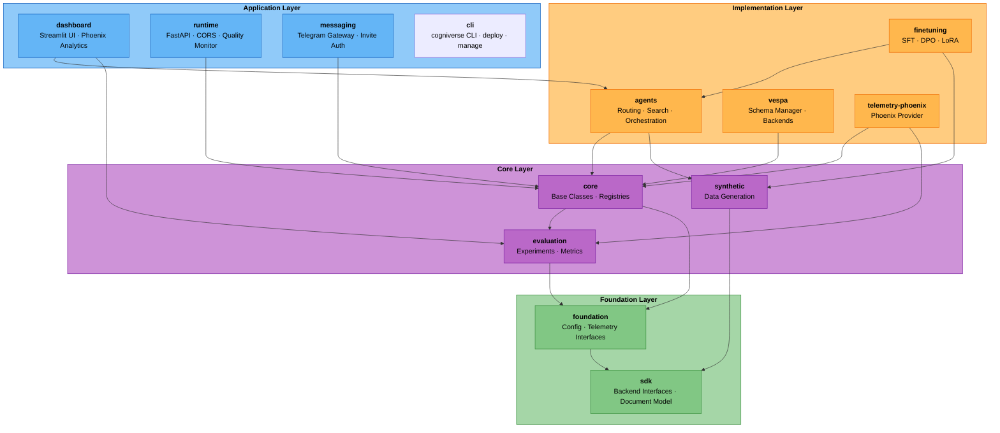
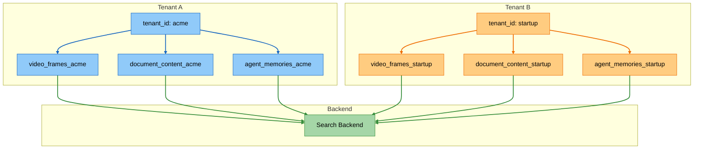
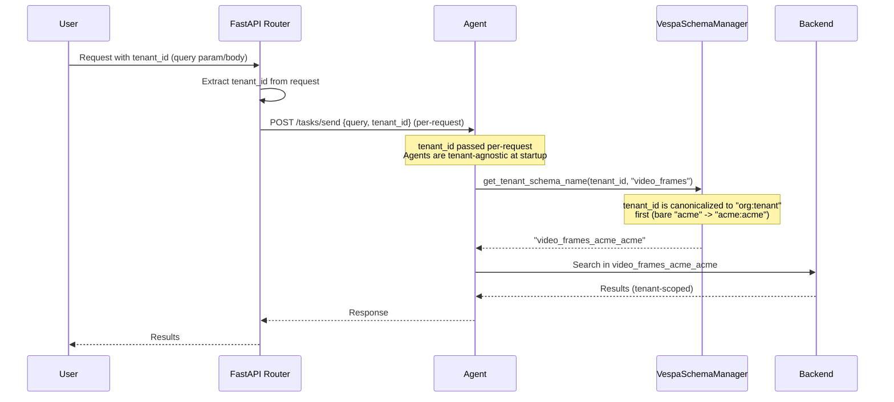
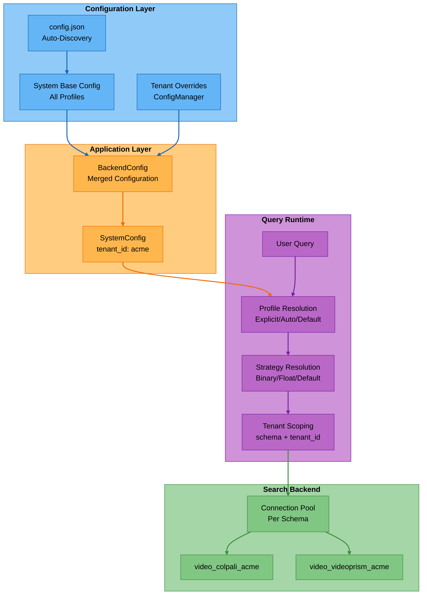
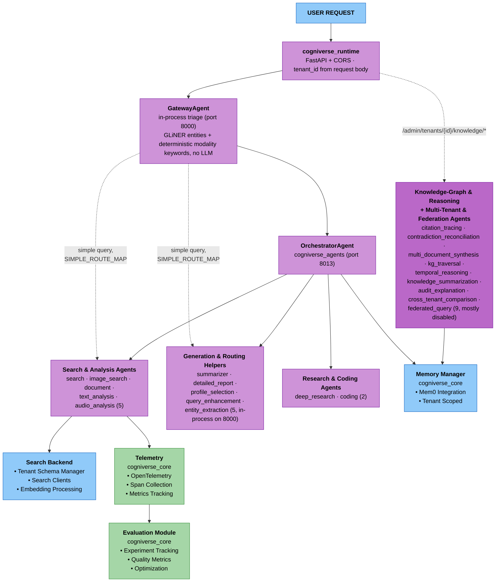
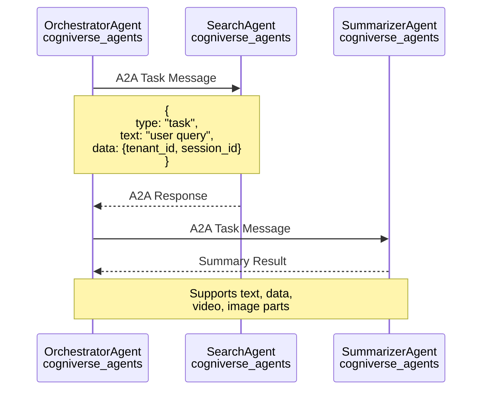

# Cogniverse System Architecture

---

## Table of Contents

1. [SDK Architecture](#sdk-architecture)
2. [Multi-Tenant Architecture](#multi-tenant-architecture)
3. [Core Components](#core-components)

---

## SDK Architecture

### UV Workspace Structure

Cogniverse uses a **monorepo workspace** with a layered architecture:

```text
cogniverse/
├── pyproject.toml                # Root workspace config
├── libs/
│   # FOUNDATION LAYER (Pure Interfaces)
│   ├── sdk/                      # cogniverse-sdk
│   │   ├── pyproject.toml
│   │   └── cogniverse_sdk/
│   │       ├── interfaces/       # Backend, ConfigStore, SchemaLoader, AdapterStore, WorkflowStore interfaces
│   │       └── document.py       # Universal document model
│   │
│   ├── foundation/               # cogniverse-foundation
│   │   ├── pyproject.toml
│   │   └── cogniverse_foundation/
│   │       ├── caching/          # Cache utilities
│   │       ├── config/           # Configuration base classes
│   │       ├── dspy/             # DSPy integration helpers
│   │       ├── registry/         # Provider registries
│   │       └── telemetry/        # Telemetry interfaces
│   │
│   # CORE LAYER
│   ├── core/                     # cogniverse-core
│   │   ├── pyproject.toml
│   │   └── cogniverse_core/
│   │       ├── agents/           # Base agent classes
│   │       ├── common/           # Shared utilities
│   │       ├── events/           # EventQueue for real-time notifications
│   │       ├── registries/       # Component registries
│   │       └── memory/           # Knowledge Management Layer
│   │           ├── manager.py        # Mem0MemoryManager (add/search/lifecycle)
│   │           ├── schema.py         # KnowledgeSchema, KnowledgeRegistry, Retention, Sensitivity
│   │           ├── provenance.py     # Provenance, CitationRef, ProvenanceWalker
│   │           ├── provenance_store.py # Vespa-backed provenance persistence
│   │           ├── contradiction.py  # ContradictionDetector, ConflictSet, reconcile()
│   │           ├── trust.py          # TrustRecord, rank_with_trust, apply_endorsement
│   │           ├── federation.py     # FederationService (org trunk + tenant overlays)
│   │           ├── pinning.py        # PinService, PinQuotas
│   │           └── lifecycle_scheduler.py # Schema-driven periodic cleanup
│   │
│   ├── evaluation/               # cogniverse-evaluation
│   │   ├── pyproject.toml
│   │   └── cogniverse_evaluation/
│   │       ├── core/             # Experiment tracking, scorers, solvers
│   │       ├── evaluators/       # LLM judges, visual evaluators
│   │       ├── metrics/          # Provider-agnostic metrics
│   │       ├── data/             # Dataset handling and storage
│   │       ├── providers/        # Evaluation provider registry
│   │       └── quality_monitor.py  # QualityMonitor (golden set + live traffic)
│   │
│   ├── synthetic/                # cogniverse-synthetic
│   │   ├── pyproject.toml
│   │   └── cogniverse_synthetic/
│   │       ├── service.py        # Main SyntheticDataService
│   │       ├── generators/       # Optimizer-specific generators
│   │       ├── profile_selector.py  # LLM-based profile selection
│   │       └── backend_querier.py   # Backend content sampling
│   │
│   # IMPLEMENTATION LAYER
│   ├── agents/                   # cogniverse-agents
│   │   ├── pyproject.toml
│   │   └── cogniverse_agents/
│   │       ├── routing/          # Routing agents & DSPy optimization
│   │       ├── search/           # Search service, base classes, rerankers
│   │       ├── orchestrator/     # Multi-agent orchestrator
│   │       ├── tools/            # A2A tools
│   │       ├── memory_aware_mixin.py  # MemoryAwareMixin with get_strategies()
│   │       ├── optimizer/        # DSPy optimizers + strategy learner
│   │       │   ├── artifact_manager.py   # ArtifactManager (ExperimentMetrics, promote_if_better, canary, rollback)
│   │       │   ├── signature_variants.py # SignatureVariantRegistry (per-tenant DSPy signature variants)
│   │       │   └── strategy_learner.py   # StrategyLearner (pattern + LLM distillation)
│   │       └── wiki/             # Wiki knowledge base (WikiManager, WikiPage)
│   │
│   ├── telemetry-phoenix/        # cogniverse-telemetry-phoenix (Plugin)
│   │   ├── pyproject.toml
│   │   └── cogniverse_telemetry_phoenix/
│   │       ├── provider.py       # Phoenix telemetry provider
│   │       └── evaluation/       # Evaluation, analytics, monitoring providers
│   │
│   ├── vespa/                    # cogniverse-vespa
│   │   ├── pyproject.toml
│   │   └── cogniverse_vespa/
│   │       ├── config/           # Config store
│   │       ├── registry/         # Adapter store
│   │       ├── vespa_schema_manager.py
│   │       ├── search_backend.py
│   │       └── ingestion_client.py
│   │
│   ├── finetuning/               # cogniverse-finetuning
│   │   ├── pyproject.toml
│   │   └── cogniverse_finetuning/
│   │       ├── training/         # SFT, DPO training loops
│   │       ├── dataset/          # Trace-to-trajectory conversion
│   │       ├── registry/         # Adapter storage and versioning
│   │       └── orchestrator.py   # End-to-end finetuning orchestrator
│   │
│   # APPLICATION LAYER
│   ├── runtime/                  # cogniverse-runtime
│   │   ├── pyproject.toml
│   │   ├── Dockerfile
│   │   └── cogniverse_runtime/
│   │       ├── main.py                # FastAPI app
│   │       ├── routers/               # API endpoints
│   │       ├── ingestion/             # Video processing
│   │       ├── admin/                 # Admin functionality
│   │       ├── sandbox_manager.py     # SandboxManager + SandboxPolicy (OpenShell)
│   │       ├── openshell_health.py    # GatewayHealthProbe (background 30 s probe)
│   │       ├── optimization_cli.py    # Argo-triggered optimization (promote/rollback)
│   │       └── quality_monitor_cli.py # Continuous evaluation sidecar
│   │
│   ├── messaging/                # cogniverse-messaging (Telegram gateway)
│   │   ├── pyproject.toml
│   │   └── cogniverse_messaging/
│   │       ├── gateway.py        # MessagingGateway (polling or webhook)
│   │       ├── auth.py           # InviteTokenManager, UserTenantMapper
│   │       ├── command_router.py # Command parsing (/search, /report, etc.)
│   │       ├── conversation.py   # Conversation history via Mem0
│   │       ├── runtime_client.py # Async client for runtime API
│   │       └── telegram_handler.py # Response formatting
│   │
│   ├── cli/                      # cogniverse-cli
│   │   ├── pyproject.toml
│   │   └── cogniverse_cli/
│   │       └── main.py           # cogniverse CLI entry point (up, status, code, index, graph, etc.)
│   │
│   └── dashboard/                # cogniverse-dashboard
│       ├── pyproject.toml
│       ├── Dockerfile
│       └── cogniverse_dashboard/
│           ├── app.py            # Streamlit app
│           ├── tabs/             # Dashboard tab modules
│           └── utils/            # Utilities
│
└── tests/                        # Test suite
    ├── admin/                    # Admin functionality tests
    ├── agents/                   # Agent tests
    ├── backends/                 # Backend integration tests
    ├── common/                   # Shared utility tests
    ├── dashboard/                # Dashboard tests
    ├── evaluation/               # Evaluation framework tests
    ├── events/                   # EventQueue tests
    ├── finetuning/               # Finetuning tests
    ├── ingestion/                # Pipeline tests
    ├── memory/                   # Memory manager tests
    ├── routing/                  # Routing agent tests
    ├── synthetic/                # Synthetic data tests
    ├── system/                   # System integration tests
    ├── telemetry/                # Telemetry provider tests
    ├── ui/                       # UI component tests
    └── utils/                    # Utility tests
```

### Package Architecture Diagram


```mermaid
flowchart TB
    subgraph Application["<span style='color:#000'><b>Application Layer</b></span>"]
        direction LR
        dashboard["<span style='color:#000'><b>dashboard</b><br/>Streamlit UI · Phoenix Analytics</span>"]
        runtime["<span style='color:#000'><b>runtime</b><br/>FastAPI · CORS · Quality Monitor</span>"]
        messaging["<span style='color:#000'><b>messaging</b><br/>Telegram Gateway · Invite Auth</span>"]
        cli["<span style='color:#000'><b>cli</b><br/>cogniverse CLI · deploy · manage</span>"]
    end

    subgraph Implementation["<span style='color:#000'><b>Implementation Layer</b></span>"]
        direction LR
        agents["<span style='color:#000'><b>agents</b><br/>Routing · Search · Orchestration</span>"]
        vespa["<span style='color:#000'><b>vespa</b><br/>Schema Manager · Backends</span>"]
        finetuning["<span style='color:#000'><b>finetuning</b><br/>SFT · DPO · LoRA</span>"]
        telemetry["<span style='color:#000'><b>telemetry-phoenix</b><br/>Phoenix Provider</span>"]
    end

    subgraph Core["<span style='color:#000'><b>Core Layer</b></span>"]
        direction LR
        core["<span style='color:#000'><b>core</b><br/>Base Classes · Registries</span>"]
        evaluation["<span style='color:#000'><b>evaluation</b><br/>Experiments · Metrics</span>"]
        synthetic["<span style='color:#000'><b>synthetic</b><br/>Data Generation</span>"]
    end

    subgraph Foundation["<span style='color:#000'><b>Foundation Layer</b></span>"]
        direction LR
        foundation["<span style='color:#000'><b>foundation</b><br/>Config · Telemetry Interfaces</span>"]
        sdk["<span style='color:#000'><b>sdk</b><br/>Backend Interfaces · Document Model</span>"]
    end

    dashboard --> agents
    dashboard --> evaluation
    runtime --> core
    messaging --> core

    agents --> core
    agents --> synthetic
    vespa --> core
    finetuning --> agents
    finetuning --> synthetic
    telemetry --> core
    telemetry --> evaluation

    core --> evaluation
    core --> foundation
    evaluation --> foundation
    synthetic --> sdk
    foundation --> sdk

    style Application fill:#90caf9,stroke:#1565c0,color:#000
    style Implementation fill:#ffcc80,stroke:#ef6c00,color:#000
    style Core fill:#ce93d8,stroke:#7b1fa2,color:#000
    style Foundation fill:#a5d6a7,stroke:#388e3c,color:#000

    style dashboard fill:#64b5f6,stroke:#1565c0,color:#000
    style runtime fill:#64b5f6,stroke:#1565c0,color:#000
    style messaging fill:#64b5f6,stroke:#1565c0,color:#000

    style agents fill:#ffb74d,stroke:#ef6c00,color:#000
    style vespa fill:#ffb74d,stroke:#ef6c00,color:#000
    style finetuning fill:#ffb74d,stroke:#ef6c00,color:#000
    style telemetry fill:#ffb74d,stroke:#ef6c00,color:#000

    style evaluation fill:#ba68c8,stroke:#7b1fa2,color:#000
    style core fill:#ba68c8,stroke:#7b1fa2,color:#000
    style synthetic fill:#ba68c8,stroke:#7b1fa2,color:#000

    style foundation fill:#81c784,stroke:#388e3c,color:#000
    style sdk fill:#81c784,stroke:#388e3c,color:#000
```

### Package Responsibilities

| Layer | Package | Description | Key Modules | Dependencies |
|-------|---------|-------------|-------------|--------------|
| **Foundation** | **cogniverse_sdk** | Pure backend interfaces with zero internal dependencies | • `interfaces/backend.py` — Backend interface (search + ingestion)<br>• `interfaces/config_store.py` — Configuration storage interface<br>• `interfaces/schema_loader.py` — Schema template loading interface<br>• `document.py` — Universal document model | None |
| **Foundation** | **cogniverse_foundation** | Cross-cutting concerns and shared infrastructure | • `config/` — Configuration base classes and utilities<br>• `telemetry/` — Telemetry interface definitions | sdk |
| **Core** | **cogniverse_core** | Core functionality, base classes, and registries | • `agents/` — Base agent classes, mixins (MemoryAwareMixin, HealthCheckMixin)<br>• `common/` — Shared utilities (tenant utils, caching, VLM interface)<br>• `registries/` — Agent, backend, and DSPy module registries<br>• `memory/` — Memory management (Mem0MemoryManager) | sdk, foundation, evaluation |
| **Core** | **cogniverse_evaluation** | Provider-agnostic evaluation framework | • `core/` — Experiment tracking, scorers, solvers<br>• `evaluators/` — LLM judges, visual evaluators<br>• `metrics/` — Provider-agnostic metrics (accuracy, relevance)<br>• `data/` — Dataset handling and storage | sdk, foundation |
| **Implementation** | **cogniverse_telemetry_phoenix** | Phoenix-specific telemetry provider (plugin architecture) | • `provider.py` — Phoenix telemetry provider implementation<br>• `evaluation/` — Evaluation, analytics, and monitoring providers | core, evaluation |
| **Implementation** | **cogniverse_agents** | Agent implementations, routing logic, and strategy learning | • `routing/` — Routing agent, strategies, evaluators<br>• `search/` — Search service, base classes, rerankers<br>• `orchestrator/` — Multi-agent orchestrator<br>• `tools/` — Agent tools and A2A protocol<br>• `memory_aware_mixin.py` — `MemoryAwareMixin` with `get_strategies()`<br>• `optimizer/strategy_learner.py` — `StrategyLearner` (pattern + LLM distillation)<br>• `wiki/` — `WikiManager` (Topic + Session pages in Vespa), `WikiPage`, `WikiIndex` | sdk, core, synthetic |
| **Implementation** | **cogniverse_vespa** | Backend integration and tenant management | • `config/` — Configuration store and profile mapping<br>• `registry/` — Backend registry for Vespa<br>• Core modules: `vespa_schema_manager.py`, `search_backend.py`, `ingestion_client.py` | sdk, core |
| **Core** | **cogniverse_synthetic** | Synthetic data generation for optimizer training | • `service.py` — Main SyntheticDataService<br>• `generators/` — Optimizer-specific generators (GEPA, MIPRO, etc.)<br>• `profile_selector.py` — LLM-based profile selection<br>• `backend_querier.py` — Backend content sampling | sdk |
| **Implementation** | **cogniverse_finetuning** | LLM fine-tuning infrastructure | • `training/` — SFT, DPO training loops<br>• `dataset/` — Trace-to-trajectory conversion<br>• `registry/` — Adapter storage and versioning<br>• `orchestrator.py` — End-to-end finetuning orchestrator | sdk, core, foundation, agents, synthetic |
| **Application** | **cogniverse_runtime** | Production runtime, APIs, and operational CLIs | • `routers/` — FastAPI route handlers (search, ingestion, admin, wiki, including `POST /admin/messaging/invite`)<br>• `ingestion/` — Video processing pipeline and processors<br>• `admin/` — Organization/tenant models and `TenantManager`<br>• `optimization_cli.py` — Argo-triggered optimization (`--mode triggered`)<br>• `quality_monitor_cli.py` — Continuous evaluation sidecar | sdk, core (optional: vespa, agents) |
| **Application** | **cogniverse_messaging** | Telegram messaging gateway | • `gateway.py` — `MessagingGateway` (polling/webhook)<br>• `auth.py` — `InviteTokenManager`, `UserTenantMapper`<br>• `command_router.py` — Parses `/search`, `/summarize`, `/report`, `/research`, `/code`, `/wiki` (save/search/topic/index), plain text, media<br>• `conversation.py` — Conversation history via Mem0<br>• `runtime_client.py` — Async client for runtime API dispatch | core, sdk (HTTP-only to runtime; no declared workspace dependency) |
| **Application** | **cogniverse_dashboard** | User interfaces and analytics | • `app.py` — Main Streamlit dashboard application<br>• `tabs/` — Dashboard tab modules | sdk, core, agents, evaluation, vespa, telemetry-phoenix |
| **Application** | **cogniverse_cli** | Cluster deploy and operational CLI | • `main.py` — `cogniverse` entry point (`up`, `down`, `status`, `code`, `index`, `graph`, `admin`, `sandbox`, `secrets`, `logs`)<br>• `deploy.py`, `cluster.py`, `argo.py`, `images.py` — Helm/k3d/Argo deployment helpers<br>• `health.py`, `streaming.py` — Runtime health polling and log streaming | None (HTTP-only client to `cogniverse_runtime`, no workspace dependency) |

---

## Multi-Tenant Architecture

### Schema-Per-Tenant Pattern

Cogniverse uses **physical tenant isolation** where each tenant gets dedicated backend schemas.


```mermaid
flowchart TB
    subgraph "Tenant A"
        TenantA["<span style='color:#000'>tenant_id: acme</span>"]
        TenantA --> SchemaA1["<span style='color:#000'>video_frames_acme</span>"]
        TenantA --> SchemaA2["<span style='color:#000'>document_content_acme</span>"]
        TenantA --> SchemaA3["<span style='color:#000'>agent_memories_acme</span>"]
    end

    subgraph "Tenant B"
        TenantB["<span style='color:#000'>tenant_id: startup</span>"]
        TenantB --> SchemaB1["<span style='color:#000'>video_frames_startup</span>"]
        TenantB --> SchemaB2["<span style='color:#000'>document_content_startup</span>"]
        TenantB --> SchemaB3["<span style='color:#000'>agent_memories_startup</span>"]
    end

    subgraph "Backend"
        SchemaA1 --> BackendCore["<span style='color:#000'>Search Backend</span>"]
        SchemaA2 --> BackendCore
        SchemaA3 --> BackendCore
        SchemaB1 --> BackendCore
        SchemaB2 --> BackendCore
        SchemaB3 --> BackendCore
    end

    style TenantA fill:#90caf9,stroke:#1565c0,color:#000
    style SchemaA1 fill:#90caf9,stroke:#1565c0,color:#000
    style SchemaA2 fill:#90caf9,stroke:#1565c0,color:#000
    style SchemaA3 fill:#90caf9,stroke:#1565c0,color:#000
    style TenantB fill:#ffcc80,stroke:#ef6c00,color:#000
    style SchemaB1 fill:#ffcc80,stroke:#ef6c00,color:#000
    style SchemaB2 fill:#ffcc80,stroke:#ef6c00,color:#000
    style SchemaB3 fill:#ffcc80,stroke:#ef6c00,color:#000
    style BackendCore fill:#a5d6a7,stroke:#388e3c,color:#000

    linkStyle 0,1,2 stroke:#1565c0,stroke-width:2px
    linkStyle 3,4,5 stroke:#ef6c00,stroke-width:2px
    linkStyle 6,7,8,9,10,11 stroke:#388e3c,stroke-width:2px
```

**Benefits**:

- **Physical Isolation**: No cross-tenant data leaks possible
- **No Query Filtering**: Entire schema is tenant-scoped
- **Independent Scaling**: Scale resources per tenant
- **Tenant-Specific Tuning**: Custom rank profiles, indexes per tenant

### Tenant Context Flow


```mermaid
sequenceDiagram
    participant User
    participant FastAPI as FastAPI Router
    participant Agent
    participant SchemaManager as VespaSchemaManager
    participant Backend

    User->>FastAPI: Request with tenant_id (query param/body)

    FastAPI->>FastAPI: Extract tenant_id from request
    FastAPI->>Agent: POST /tasks/send {query, tenant_id} (per-request)

    Note over Agent: tenant_id passed per-request<br/>Agents are tenant-agnostic at startup

    Agent->>SchemaManager: get_tenant_schema_name(tenant_id, "video_frames")
    Note over SchemaManager: tenant_id is canonicalized to "org:tenant"<br/>first (bare "acme" -> "acme:acme")
    SchemaManager-->>Agent: "video_frames_acme_acme"

    Agent->>Backend: Search in video_frames_acme_acme
    Backend-->>Agent: Results (tenant-scoped)
    Agent-->>FastAPI: Response
    FastAPI-->>User: Results
```

### Multi-Tenant Components

#### **Tenant Context Extraction** (handled inline in routers)

Tenant identification is extracted directly in router handlers from:

1. Query parameter: `tenant_id=acme`
2. Request body field: `tenant_id` in POST requests
3. Default fallback: `"default"` if not specified

#### **Backend Interface** (`libs/sdk/cogniverse_sdk/interfaces/backend.py`)

Pluggable backend implementations (e.g., Vespa) implement these tenant schema methods:

- `get_tenant_schema_name(tenant_id, base_schema)` → `{base_schema}_{tenant_id}`
- `schema_exists(schema_name, tenant_id)` → Check if schema exists
- `deploy_schemas(schema_definitions)` → Deploy schemas for tenant
- `delete_schema(schema_name, tenant_id)` → Cleanup on tenant removal

#### **Tenant-Aware Backends**

All search clients are tenant-aware:

- Initialize with `tenant_id`
- Automatically route to tenant-specific schemas
- No hardcoded schema names

#### **Memory Isolation** (`libs/core/cogniverse_core/memory/manager.py`)

- Per-tenant singleton pattern: `Mem0MemoryManager._instances[tenant_id]`
- Tenant-specific backend schema: `agent_memories_{tenant_id}`
- `user_id=tenant_id` scoping in Mem0

#### **Telemetry Isolation** (`libs/foundation/cogniverse_foundation/telemetry/manager.py`)

- Telemetry projects per tenant: `cogniverse-{tenant_id}-{service}` (e.g., `cogniverse-acme-orchestrator_agent`)
- Separate spans and traces per tenant
- Full observability isolation

### Tenant Backend Configuration

Hierarchical configuration system enabling per-tenant customization of video processing pipelines:

#### Key Features

**1. Profile-Based Configuration**
```python
from cogniverse_foundation.config.unified_config import BackendConfig, BackendProfileConfig

# Backend profile defines video processing pipeline
profile = BackendProfileConfig(
    profile_name="video_colpali_smol500_mv_frame",
    schema_name="video_colpali_smol500_mv_frame",
    embedding_model="TomoroAI/tomoro-colqwen3-embed-4b",
    pipeline_config={
        "extract_keyframes": True,
        "keyframe_fps": 0.5,
        "max_frames": 100,
        "transcribe_audio": True
    },
    strategies={
        "segmentation": {"class": "FrameSegmentationStrategy"},
        "embedding": {"class": "MultiVectorEmbeddingStrategy"}
    },
    embedding_type="binary"
)
```

**2. Auto-Discovery**

- Automatically loads `config.json` from standard locations:
  - `COGNIVERSE_CONFIG` environment variable
  - `configs/config.json` (workspace root)
  - `../configs/config.json` (one level up)
- No manual configuration path specification required

**3. Tenant Configuration Overlay**

- System provides base configuration for all tenants
- Tenants can override specific settings via `ConfigManager`
- Deep merge: System base + Tenant overrides = Tenant config
- Example: Premium tenants get higher `max_frames` (200 vs 100)

**4. Query-Time Resolution**

- Profile selection at query time (explicit or auto-select)
- Strategy resolution based on embedding type
- Tenant schema scoping automatic

**Benefits**:

- **Customization**: Per-tenant video processing optimization
- **Resource Control**: Different quality tiers for different tenants
- **Flexibility**: Runtime profile selection without restart
- **Isolation**: Tenant configs don't interfere

#### Configuration Flow Diagram


```mermaid
flowchart TB
    subgraph Config["<span style='color:#000'><b>Configuration Layer</b></span>"]
        ConfigFile["<span style='color:#000'>config.json<br/>Auto-Discovery</span>"]
        SystemBase["<span style='color:#000'>System Base Config<br/>All Profiles</span>"]
        TenantOverride["<span style='color:#000'>Tenant Overrides<br/>ConfigManager</span>"]
    end

    subgraph Application["<span style='color:#000'><b>Application Layer</b></span>"]
        SystemConfig["<span style='color:#000'>SystemConfig<br/>tenant_id: acme</span>"]
        BackendConfigNode["<span style='color:#000'>BackendConfig<br/>Merged Configuration</span>"]
    end

    subgraph Runtime["<span style='color:#000'><b>Query Runtime</b></span>"]
        Query["<span style='color:#000'>User Query</span>"]
        ProfileResolution["<span style='color:#000'>Profile Resolution<br/>Explicit/Auto/Default</span>"]
        StrategyResolution["<span style='color:#000'>Strategy Resolution<br/>Binary/Float/Default</span>"]
        TenantScoping["<span style='color:#000'>Tenant Scoping<br/>schema + tenant_id</span>"]
    end

    subgraph Backend["<span style='color:#000'><b>Search Backend</b></span>"]
        ConnectionPool["<span style='color:#000'>Connection Pool<br/>Per Schema</span>"]
        Schema1["<span style='color:#000'>video_colpali_acme</span>"]
        Schema2["<span style='color:#000'>video_videoprism_acme</span>"]
    end

    ConfigFile --> SystemBase
    SystemBase --> BackendConfigNode
    TenantOverride --> BackendConfigNode
    BackendConfigNode --> SystemConfig
    SystemConfig --> ProfileResolution

    Query --> ProfileResolution
    ProfileResolution --> StrategyResolution
    StrategyResolution --> TenantScoping

    TenantScoping --> ConnectionPool
    ConnectionPool --> Schema1
    ConnectionPool --> Schema2

    style Config fill:#90caf9,stroke:#1565c0,color:#000
    style Application fill:#ffcc80,stroke:#ef6c00,color:#000
    style Runtime fill:#ce93d8,stroke:#7b1fa2,color:#000
    style Backend fill:#a5d6a7,stroke:#388e3c,color:#000

    style ConfigFile fill:#64b5f6,stroke:#1565c0,color:#000
    style SystemBase fill:#64b5f6,stroke:#1565c0,color:#000
    style TenantOverride fill:#64b5f6,stroke:#1565c0,color:#000

    style SystemConfig fill:#ffb74d,stroke:#ef6c00,color:#000
    style BackendConfigNode fill:#ffb74d,stroke:#ef6c00,color:#000

    style Query fill:#ba68c8,stroke:#7b1fa2,color:#000
    style ProfileResolution fill:#ba68c8,stroke:#7b1fa2,color:#000
    style StrategyResolution fill:#ba68c8,stroke:#7b1fa2,color:#000
    style TenantScoping fill:#ba68c8,stroke:#7b1fa2,color:#000

    style ConnectionPool fill:#81c784,stroke:#388e3c,color:#000
    style Schema1 fill:#81c784,stroke:#388e3c,color:#000
    style Schema2 fill:#81c784,stroke:#388e3c,color:#000

    linkStyle 0,1,2 stroke:#1565c0,stroke-width:2px
    linkStyle 3,4 stroke:#ef6c00,stroke-width:2px
    linkStyle 5,6,7 stroke:#7b1fa2,stroke-width:2px
    linkStyle 8,9,10 stroke:#388e3c,stroke-width:2px
```

**See**: [Multi-Tenant Architecture](multi-tenant.md#backend-configuration) for complete details

---

## Core Components

### High-Level System Diagram


```mermaid
flowchart TB
    User["<span style='color:#000'><b>USER REQUEST</b></span>"] --> Runtime["<span style='color:#000'><b>cogniverse_runtime</b><br/>FastAPI + CORS · tenant_id from request body</span>"]

    Runtime --> Gateway["<span style='color:#000'><b>GatewayAgent</b><br/>in-process triage (port 8000)<br/>GLiNER entities + deterministic modality keywords, no LLM</span>"]

    Gateway --> Orchestrator["<span style='color:#000'><b>OrchestratorAgent</b><br/>cogniverse_agents (port 8013)</span>"]

    Gateway -.->|"simple query,<br/>SIMPLE_ROUTE_MAP"| SearchAnalysis
    Gateway -.->|"simple query,<br/>SIMPLE_ROUTE_MAP"| GenRouting

    Orchestrator --> SearchAnalysis["<span style='color:#000'><b>Search &amp; Analysis Agents</b><br/>search · image_search · document ·<br/>text_analysis · audio_analysis (5)</span>"]
    Orchestrator --> GenRouting["<span style='color:#000'><b>Generation &amp; Routing Helpers</b><br/>summarizer · detailed_report ·<br/>profile_selection · query_enhancement ·<br/>entity_extraction (5, in-process on 8000)</span>"]
    Orchestrator --> ResearchCoding["<span style='color:#000'><b>Research &amp; Coding Agents</b><br/>deep_research · coding (2)</span>"]

    Runtime -.->|"/admin/tenants/{id}/knowledge/*"| KnowledgeTier["<span style='color:#000'><b>Knowledge-Graph &amp; Reasoning<br/>+ Multi-Tenant &amp; Federation Agents</b><br/>citation_tracing · contradiction_reconciliation ·<br/>multi_document_synthesis · kg_traversal ·<br/>temporal_reasoning · knowledge_summarization ·<br/>audit_explanation · cross_tenant_comparison ·<br/>federated_query (9, mostly disabled)</span>"]

    SearchAnalysis --> Backend["<span style='color:#000'><b>Search Backend</b><br/>• Tenant Schema Manager<br/>• Search Clients<br/>• Embedding Processing</span>"]

    Orchestrator --> Memory["<span style='color:#000'><b>Memory Manager</b><br/>cogniverse_core<br/>• Mem0 Integration<br/>• Tenant Scoped</span>"]

    KnowledgeTier --> Memory

    SearchAnalysis --> Telemetry["<span style='color:#000'><b>Telemetry</b><br/>cogniverse_core<br/>• OpenTelemetry<br/>• Span Collection<br/>• Metrics Tracking</span>"]

    Telemetry --> Evaluation["<span style='color:#000'><b>Evaluation Module</b><br/>cogniverse_core<br/>• Experiment Tracking<br/>• Quality Metrics<br/>• Optimization</span>"]

    style User fill:#90caf9,stroke:#1565c0,color:#000
    style Runtime fill:#ce93d8,stroke:#7b1fa2,color:#000
    style Gateway fill:#ce93d8,stroke:#7b1fa2,color:#000
    style Orchestrator fill:#ce93d8,stroke:#7b1fa2,color:#000
    style SearchAnalysis fill:#ce93d8,stroke:#7b1fa2,color:#000
    style GenRouting fill:#ce93d8,stroke:#7b1fa2,color:#000
    style ResearchCoding fill:#ce93d8,stroke:#7b1fa2,color:#000
    style KnowledgeTier fill:#ba68c8,stroke:#7b1fa2,color:#000
    style Backend fill:#90caf9,stroke:#1565c0,color:#000
    style Memory fill:#90caf9,stroke:#1565c0,color:#000
    style Telemetry fill:#a5d6a7,stroke:#388e3c,color:#000
    style Evaluation fill:#a5d6a7,stroke:#388e3c,color:#000
```

### Agent Catalog

Cogniverse ships **23 agents** across five groups. Ports are the operational
values from `configs/config.json` `agents.*.url`; several in-process helpers
share port 8000 with the gateway. "Enabled" reflects `agents.*.enabled` in
that same config.

#### Search & Analysis Agents (5)

| Agent | Port | Enabled | Description |
|-------|------|---------|-------------|
| `search_agent` | 8002 | Yes | Multi-modal retrieval across video/image/text/audio/document via Vespa, with DSPy query rewriting, multi-query and multi-profile RRF ensemble fusion, and optional RLM synthesis over large result sets |
| `image_search_agent` | 8006 | Yes | ColPali multi-vector image similarity search (semantic or hybrid BM25+ColPali), plus image-to-image lookup |
| `document_agent` | 8008 | Yes | Dual-strategy document search — ColPali visual (page-as-image), ColBERT/BM25 text, or hybrid — with keyword-based auto strategy selection |
| `text_analysis_agent` | 8003 | Yes | Runtime-configurable DSPy text analysis (sentiment/summary/entities) with per-tenant persisted config |
| `audio_analysis_agent` | 8007 | Yes | Whisper transcription + Vespa audio search (transcript BM25, acoustic CLAP nearest-neighbor, or hybrid) |

#### Generation & Routing Agents (7)

| Agent | Port | Enabled | Description |
|-------|------|---------|-------------|
| `gateway_agent` | 8000 | Yes | LLM-free entry point; GLiNER classification + deterministic modality keywords route simple queries directly and hand complex ones to the orchestrator |
| `orchestrator_agent` | 8013 | Yes | DSPy-planned multi-agent workflow coordinator; executes the plan by calling sub-agents over A2A HTTP, with checkpoint/resume and cross-modal fusion |
| `summarizer_agent` | 8004 | Yes | Turns search results into structured summaries with a thinking phase and VLM visual analysis |
| `detailed_report_agent` | 8005 | Yes | Generates comprehensive reports (executive summary, findings, technical + visual analysis, recommendations) with optional RLM synthesis |
| `profile_selection_agent` | 8000 | Yes | DSPy-based selection of the optimal backend search profile, with a keyword/word-count heuristic fallback |
| `query_enhancement_agent` | 8000 | Yes | Expands and rewrites queries with synonyms, context, and RRF variants using DSPy |
| `entity_extraction_agent` | 8000 | Yes | Tiered NER: fast GLiNER + SpaCy path (no LLM) with a DSPy fallback |

#### Research & Coding Agents (2)

| Agent | Port | Enabled | Description |
|-------|------|---------|-------------|
| `deep_research_agent` | 8009 | Yes | Multi-step decompose → parallel-search → evaluate → synthesize loop producing a cited report |
| `coding_agent` | 8010 | Yes | Iterative search → plan → generate → execute → evaluate loop; executes DSPy-generated code inside an OpenShell sandbox |

**See**: [Coding-Agent Sandbox](coding-sandbox.md) for how generated code is run
safely — the in-cluster OpenShell gateway + agent-sandbox operator, deployment,
configuration (`--sandbox in-cluster|external|off`), and a plain-language glossary.

#### Knowledge-Graph & Reasoning Agents (7)

| Agent | Port | Enabled | Description |
|-------|------|---------|-------------|
| `citation_tracing_agent` | 8019 | No | Walks a memory's provenance chain back to its primary sources |
| `contradiction_reconciliation_agent` | 8020 | No | Resolves conflict sets by applying a knowledge schema's contradiction policy over member memories |
| `multi_document_synthesis_agent` | 8021 | No | Synthesizes a coherent answer across N source documents while preserving the citation graph |
| `kg_traversal_agent` | 8022 | No | Structurally walks `kg_node`/`kg_edge` memories from a seed entity into a node+edge graph view |
| `temporal_reasoning_agent` | 8025 | No | Compares a subject's knowledge across explicit time windows |
| `knowledge_summarization_agent` | 8026 | No | Distills a knowledge subgraph into a citation-aware summary, with admin-gated promotion to the org trunk |
| `audit_explanation_agent` | 8027 | Yes | Explains why an answer memory was produced — its derivation chain, per-source trust, and active contradictions |

#### Multi-Tenant & Federation Agents (2)

| Agent | Port | Enabled | Description |
|-------|------|---------|-------------|
| `cross_tenant_comparison_agent` | 8023 | No | Compares per-tenant views of one subject across all tenants in an org via the federation read path |
| `federated_query_agent` | 8024 | No | Answers a free-text query by aggregating federated reads across multiple tenants in an org, with an optional RLM summarizer |

The knowledge-tier agents (Knowledge-Graph & Reasoning, Multi-Tenant &
Federation) are reached via `/admin/tenants/{tenant_id}/knowledge/*` REST
routes (`routers/knowledge.py`), not through the orchestrator's A2A plan
execution. All but `audit_explanation_agent` are `enabled: false` in
`configs/config.json` today.

### Agent Communication (A2A Protocol)


```mermaid
sequenceDiagram
    participant Orch as OrchestratorAgent<br/>cogniverse_agents
    participant Search as SearchAgent<br/>cogniverse_agents
    participant Summ as SummarizerAgent<br/>cogniverse_agents

    Orch->>Search: A2A Task Message
    Note over Orch,Search: {<br/> type: "task",<br/> text: "user query",<br/> data: {tenant_id, session_id}<br/>}
    Search-->>Orch: A2A Response

    Orch->>Summ: A2A Task Message
    Summ-->>Orch: Summary Result

    Note over Orch,Summ: Supports text, data,<br/>video, image parts
```

---

## Next Steps

For detailed guides, see:

- **[SDK Architecture](./sdk-architecture.md)** - Deep dive into UV workspace and package structure
- **[Multi-Tenant Architecture](./multi-tenant.md)** - Complete tenant isolation guide
- **[System Flows](./system-flows.md)** - Detailed sequence diagrams
- **[Agents Module](../modules/agents.md)** - Per-agent implementation details
- **[Module Documentation](../modules/sdk.md)** - Per-package technical details
