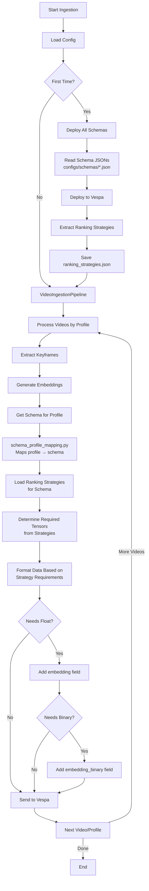
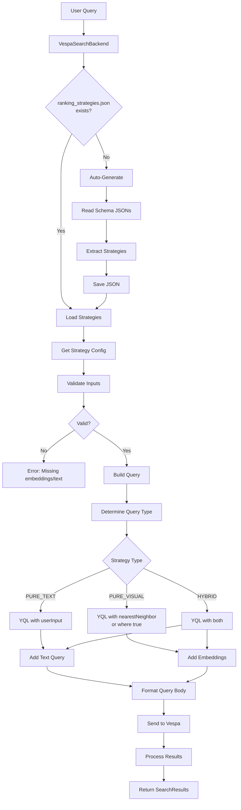

# Schema-Driven Processing and Query Flow

## 1. Processing/Ingestion Flow



### Detailed Processing Steps:

1. **Schema Deployment** (First time or schema updates):
   ```bash
   python scripts/deploy_all_schemas.py
   ```
   - Reads all schema JSON files from `configs/schemas/`
   - Deploys schemas to Vespa as one application package
   - Automatically extracts ranking strategies → `ranking_strategies.json`

2. **Video Processing** (Strategy-Aware):
   ```bash
   python scripts/run_ingestion.py --video_dir data/videos --backend vespa
   ```
   - For each profile (e.g., `frame_based_colpali`, `direct_video_global`):
     - Uses `schema_profile_mapping.py` to find the right schema
     - **Loads ranking strategies to determine requirements**:
       ```python
       # Check what embeddings are needed
       strategies = load_ranking_strategies()[schema_name]
       needs_float = any(s.needs_float_embeddings for s in strategies.values())
       needs_binary = any(s.needs_binary_embeddings for s in strategies.values())
       ```
     - **Processes videos according to strategy needs**:
       - Only generates float embeddings if needed
       - Only generates binary embeddings if needed
     - **Formats tensors based on strategy definitions**:
       - Extracts dimensions from tensor types in strategies
       - Formats as cells (patch-based) or lists (global)
     - Sends optimized document to Vespa

## 2. Query Flow



### Detailed Query Steps:

1. **Backend Initialization**:
   ```python
   backend = VespaSearchBackend(
       vespa_url="http://localhost",
       vespa_port=8080,
       schema_name="video_frame"  # Auto-determines profile
   )
   ```
   - Loads schema → profile mapping
   - Loads/generates ranking strategies
   - No hardcoded strategies!

2. **Query Execution**:
   ```python
   results = backend.search(
       query_embeddings=embeddings,
       query_text="person wearing winter clothes",
       ranking_strategy="hybrid_binary_bm25"
   )
   ```
   - Validates inputs based on strategy requirements
   - Builds appropriate YQL query
   - Formats tensors based on schema (global vs patch-based)

## 3. Key Components

### Schema Files (`configs/schemas/`)
```json
{
  "name": "video_frame",
  "document": {
    "fields": [...]
  },
  "rank_profiles": [
    {
      "name": "hybrid_binary_bm25",
      "inputs": [
        {"name": "query(qtb)", "type": "tensor<int8>(querytoken{}, v[16])"}
      ],
      "first_phase": "...",
      "needs_text_query": true
    }
  ]
}
```

### Schema-Profile Mapping
```python
# src/processing/vespa/schema_profile_mapping.py
SCHEMA_TO_PROFILE = {
    "video_frame": "frame_based_colpali",
    "video_videoprism_global": "direct_video_global",
    # ...
}
```

### Ranking Strategies (Auto-generated)
```json
// configs/schemas/ranking_strategies.json
{
  "video_frame": {
    "hybrid_binary_bm25": {
      "strategy_type": "hybrid",
      "needs_binary_embeddings": true,
      "needs_text_query": true,
      "use_nearestneighbor": false,
      // ...
    }
  }
}
```

## 4. Benefits of Schema-Driven Approach

1. **Single Source of Truth**: Schema JSON files define everything
2. **No Manual Steps**: Strategies extracted automatically during deployment
3. **Self-Healing**: Backend auto-generates strategies if missing
4. **Type Safety**: Clear validation based on strategy requirements
5. **Easy Extension**: Add new schemas/strategies by updating JSON files

## 5. Error Handling

The system provides clear errors at each step:

- **Unknown Schema**: "Cannot determine profile for schema X"
- **Missing Strategy**: "Unknown ranking strategy 'Y' for schema 'Z'"
- **Invalid Inputs**: "Strategy 'A' requires embeddings"
- **Missing Files**: Auto-generates what's needed

## 6. Production Workflow

1. **Update Schema**: Edit JSON file in `configs/schemas/`
2. **Deploy**: Run `python scripts/deploy_all_schemas.py`
3. **Process**: Run ingestion with new schema
4. **Query**: Backend automatically uses new strategies

No manual extraction step needed - it's all integrated!

## 7. Production Features (v2 Implementation)

### Connection Pooling
- Thread-safe pool with configurable min/max connections
- Health checks every 60 seconds
- Automatic cleanup of unhealthy connections
- Connection reuse for better performance

### Retry Logic with Exponential Backoff
```python
@retry_with_backoff(config=RetryConfig(
    max_attempts=3,
    initial_delay=0.5,
    exponential_base=2
))
def connect(self) -> bool:
    # Automatic retry on failure
```

### Circuit Breaker Pattern
- Opens after 3 consecutive failures
- Auto-recovery after 30 seconds
- Prevents cascading failures

### Comprehensive Metrics
```python
metrics = backend.get_metrics()
# Returns:
{
    "search_metrics": {
        "total_searches": 1000,
        "success_rate": 99.5,
        "avg_latency_ms": 45.2,
        "p95_latency_ms": 120.5,
        "strategy_usage": {"float_float": 600, "hybrid_binary_bm25": 400}
    },
    "encoder_metrics": {
        "cache_hit_rate": 0.75,
        "circuit_state": "closed"
    }
}
```

### Important Query Fix
The v2 implementation uses the correct Vespa query interface:
```python
# CORRECT (v2)
response = conn.query(body=query_params)

# INCORRECT (was causing scalar value errors)
response = conn.query(**query_params)
```

### Strategy-Based Query Building
The system intelligently builds queries based on strategy type:

- **Pure Visual** (float_float, binary_binary):
  - Global models: Use `nearestNeighbor`
  - Patch models: Use tensor ranking
  
- **Hybrid** (hybrid_binary_bm25):
  - Combines `userInput` for text with embeddings
  
- **Text-Only** (bm25_only):
  - Only uses `userInput`, no embeddings needed

### How Embeddings Flow
1. SearchService generates embeddings upfront
2. Backend receives both text and embeddings
3. Strategy determines what to use:
   - `requires_query_embedding: true` → Use embeddings
   - `requires_query_embedding: false` → Ignore embeddings
4. Future optimization: Make embeddings optional, generate lazily