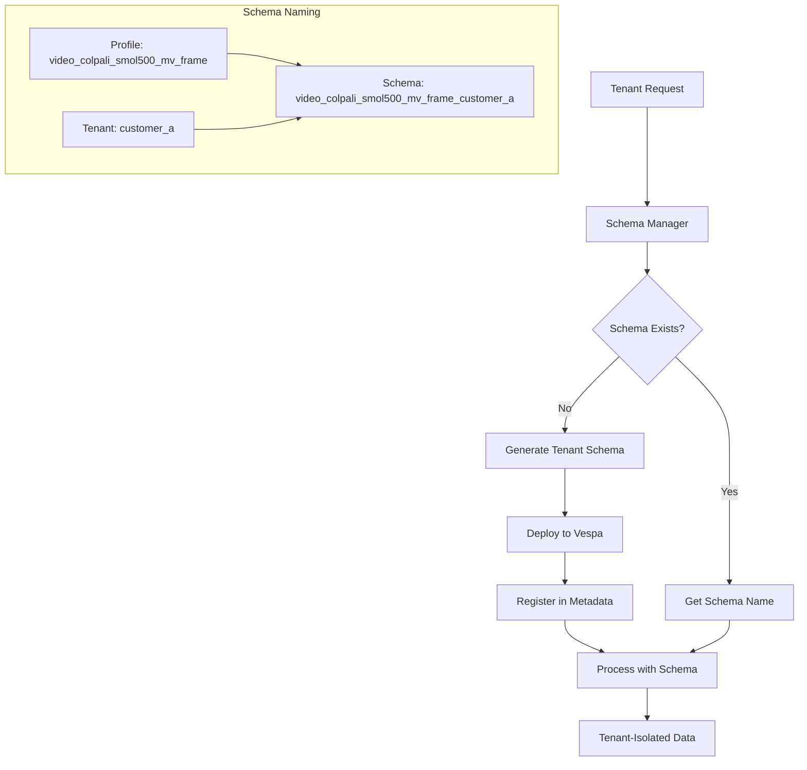
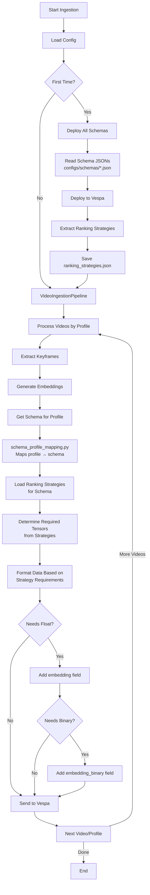
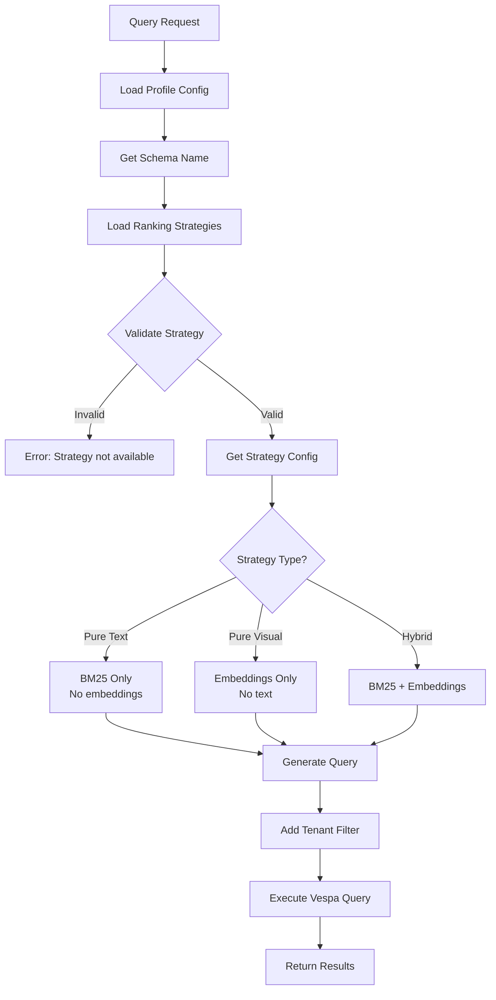

# Schema-Driven Multi-Tenant Processing Flow

## Overview

The Cogniverse system uses a schema-driven architecture where Vespa schemas define the data model, ranking strategies, and tenant isolation boundaries. Each tenant gets dedicated schemas deployed per embedding profile.

## Complete Flow Summary

1. **Schemas define everything** → `configs/schemas/*.json`
2. **Deployment extracts strategies** → `ranking_strategies.json`
3. **Processing uses schema mapping** → profile → schema
4. **Query loads strategies** → validates → executes
5. **No manual steps** → Everything is automatic!

## Multi-Tenant Schema Architecture



## 1. Processing/Ingestion Flow



### Detailed Processing Steps:

1. **Schema Deployment** (First time or schema updates):
   ```bash
   python scripts/deploy_all_schemas.py
   ```
   - Reads all schema JSON files from `configs/schemas/`
   - Deploys schemas to Vespa as one application package
   - Automatically extracts ranking strategies → `ranking_strategies.json`

2. **Profile Processing**:
   ```python
   # Get schema for the profile
   schema = PROFILE_SCHEMA_MAPPING[profile]  # e.g., "video_frame"

   # Load extracted ranking strategies
   strategies = load_ranking_strategies()[schema]

   # Determine what embeddings we need
   needs_float = any(s.needs_float_embeddings for s in strategies)
   needs_binary = any(s.needs_binary_embeddings for s in strategies)
   ```

3. **Data Formatting**:
   ```python
   document = {
       "video_id": video_id,
       "text": transcript,  # Always included for BM25
   }

   if needs_float:
       document["embedding"] = float_embeddings

   if needs_binary:
       document["embedding_binary"] = binary_embeddings
   ```

## 2. Query Flow



### Query Types and Embedding Requirements

- **Pure Visual** (float_float, binary_binary):
  - Global models: Use `nearestNeighbor`
  - Patch models: Use tensor ranking

- **Hybrid** (hybrid_binary_bm25):
  - Combines `userInput` for text with embeddings

- **Text-Only** (bm25_only):
  - Only uses `userInput`, no embeddings needed

### How Embeddings Flow
1. SearchService generates embeddings upfront
2. Backend receives both text and embeddings
3. Strategy determines what to use:
   - `requires_query_embedding: true` → Use embeddings
   - `requires_query_embedding: false` → Ignore embeddings
4. Future optimization: Make embeddings optional, generate lazily

## 3. Ranking Strategy Details

### Strategy Requirements Table

| Strategy | Text | Float | Binary | nearestNeighbor | Notes |
|----------|------|-------|--------|-----------------|-------|
| bm25_only | ✓ | - | - | - | Pure text search |
| float_float | - | ✓ | - | ✓* | Pure visual, float embeddings |
| binary_binary | - | - | ✓ | ✓* | Pure visual, binary embeddings |
| float_binary | - | ✓/✓ | ✓/✓ | ✓* | Float primary, binary fallback |
| hybrid_float_bm25 | ✓ | ✓ | - | ✓* | Text + float embeddings |
| hybrid_binary_bm25 | ✓ | - | ✓ | ✓* | Text + binary embeddings |
| phased | ✓ | ✓ | ✓ | ✓* | Two-phase: binary → float |
| bm25_float_rerank | ✓ | ✓ | - | - | BM25 first, float rerank |
| bm25_binary_rerank | ✓ | - | ✓ | - | BM25 first, binary rerank |

*nearestNeighbor used only for global embeddings (video_global, video_chunks schemas)

### Schema-Specific Behavior

```python
def determine_search_method(schema_name: str, strategy: str) -> dict:
    """Determine how to search based on schema and strategy"""

    is_global = schema_name in ["video_global", "video_chunks"]
    is_patch_based = schema_name == "video_frame"

    # Global embeddings use nearestNeighbor for visual strategies
    if is_global and strategy in ["float_float", "binary_binary",
                                   "hybrid_float_bm25", "hybrid_binary_bm25"]:
        return {
            "method": "nearestNeighbor",
            "field": "embedding" if "float" in strategy else "embedding_binary",
            "tensor": "qt" if "float" in strategy else "qtb"
        }

    # Patch-based models use tensor ranking
    elif is_patch_based and strategy in ["float_float", "binary_binary"]:
        return {
            "method": "tensor_ranking",
            "expression": "sum(reduce(sum(...), v))"
        }

    # Text-only uses userInput
    elif strategy == "bm25_only":
        return {
            "method": "userInput",
            "field": "text"
        }
```

## 4. Multi-Tenant Schema Deployment

### Tenant Schema Generation
```python
class TenantSchemaManager:
    def deploy_tenant_schema(self, tenant_id: str, profile: str):
        # 1. Generate unique schema name
        schema_name = f"{profile}_{tenant_id}"

        # 2. Load base schema template
        base_schema = self.load_template(profile)

        # 3. Add tenant-specific fields
        base_schema["fields"].append({
            "name": "tenant_id",
            "type": "string",
            "indexing": ["attribute", "summary"],
            "match": {"exact": True}
        })

        # 4. Add all ranking profiles
        for strategy in RANKING_STRATEGIES:
            base_schema["rank-profiles"].append(
                self.create_ranking_profile(strategy, tenant_id)
            )

        # 5. Deploy to Vespa
        vespa_app.deploy(schema_name, base_schema)

        # 6. Register in metadata
        self.registry.register(schema_name, tenant_id, profile)
```

### Profile to Schema Mapping

```python
PROFILE_SCHEMA_MAPPING = {
    # Frame-based models (patch embeddings)
    "video_colpali_smol500_mv_frame": {
        "base_schema": "video_frame",
        "embedding_dim": 768,
        "tensor_type": "tensor<float>(patch{}, v[768])",
        "binary_dim": 96,
        "chunking": "frame",
        "use_nearestneighbor": False  # Patch-based
    },

    # Global video models
    "video_videoprism_base_mv_chunk_30s": {
        "base_schema": "video_chunks",
        "embedding_dim": 768,
        "tensor_type": "tensor<float>(v[768])",
        "chunking": "30s",
        "use_nearestneighbor": True  # Global embeddings
    },

    "video_videoprism_lvt_base_sv_chunk_6s": {
        "base_schema": "video_global",
        "embedding_dim": 1152,
        "tensor_type": "tensor<float>(v[1152])",
        "chunking": "6s",
        "use_nearestneighbor": True  # Global embeddings
    }
}
```

## 5. Strategy Extraction and Validation

### Automatic Strategy Extraction
```python
def extract_ranking_strategies(schema_json_path: Path) -> dict:
    """Extract all ranking strategies from schema JSON"""

    with open(schema_json_path) as f:
        schema = json.load(f)

    strategies = {}

    for profile in schema.get("rank-profiles", []):
        profile_name = profile["name"]

        # Analyze first-phase expression
        first_phase = profile.get("first-phase", {})
        expression = first_phase.get("expression", "")

        # Determine requirements
        needs_text = "bm25(" in expression or "userInput" in expression
        needs_float = "embedding" in expression and "binary" not in expression
        needs_binary = "embedding_binary" in expression

        # Determine if uses nearestNeighbor
        schema_name = schema.get("schema", "")
        is_global = "global" in schema_name or schema_name == "video_chunks"
        use_nn = is_global and (needs_float or needs_binary)

        strategies[profile_name] = {
            "requires_text_query": needs_text,
            "requires_float_embeddings": needs_float,
            "requires_binary_embeddings": needs_binary,
            "use_nearestneighbor": use_nn,
            "nearestneighbor_field": "embedding" if needs_float else "embedding_binary" if use_nn else None
        }

    return strategies
```

### Strategy Validation
```python
def validate_strategy_compatibility(profile: str, strategy: str) -> bool:
    """Check if a strategy is compatible with a profile"""

    schema = PROFILE_SCHEMA_MAPPING[profile]
    available_strategies = load_ranking_strategies()[schema["base_schema"]]

    if strategy not in available_strategies:
        return False

    strategy_config = available_strategies[strategy]

    # Check embedding dimension compatibility
    if strategy_config.get("requires_float_embeddings"):
        if schema["embedding_dim"] != 768:  # Expected dimension
            return False

    # Check tensor type compatibility
    if strategy_config.get("use_nearestneighbor"):
        if "patch" in schema["tensor_type"]:
            return False  # Can't use nearestNeighbor with patch embeddings

    return True
```

## 6. Optimization Points

### Current Implementation
- Embeddings generated for ALL queries upfront
- Backend receives both text and embeddings
- Strategy decides what to use

### Future Optimizations
```python
# Lazy embedding generation
class OptimizedSearchService:
    async def search(self, query: str, strategy: str):
        # Only generate embeddings if strategy needs them
        strategy_config = self.get_strategy_config(strategy)

        embeddings = None
        if strategy_config.get("requires_query_embedding"):
            embeddings = await self.generate_embeddings(query)

        return await self.backend.search(
            text=query,
            embeddings=embeddings,  # May be None
            strategy=strategy
        )
```

## 7. Complete Configuration Flow

### Configuration Loading Order
1. **config.json** → Main configuration with profiles
2. **schemas/*.json** → Vespa schema definitions
3. **ranking_strategies.json** → Extracted strategies (auto-generated)
4. **schema_profile_mapping.py** → Profile to schema mapping

### Runtime Configuration
```python
class RuntimeConfig:
    def __init__(self):
        # Load main config
        self.config = load_json("configs/config.json")

        # Load profile mappings
        self.profile_mapping = PROFILE_SCHEMA_MAPPING

        # Load extracted strategies
        self.strategies = load_json("configs/schemas/ranking_strategies.json")

        # Validate all configurations
        self.validate_all()

    def get_strategy_for_profile(self, profile: str, strategy_name: str):
        """Get complete strategy configuration"""
        schema = self.profile_mapping[profile]["base_schema"]
        return self.strategies[schema][strategy_name]
```

## 8. Monitoring & Validation

### Schema Health Checks
```python
async def validate_tenant_schemas():
    """Validate all tenant schemas are properly deployed"""
    issues = []

    for tenant_id in get_all_tenants():
        for profile in get_all_profiles():
            schema_name = f"{profile}_{tenant_id}"

            # Check schema exists in Vespa
            if not await vespa_schema_exists(schema_name):
                issues.append(f"Missing schema: {schema_name}")

            # Check document count
            count = await get_document_count(schema_name)
            if count == 0:
                issues.append(f"Empty schema: {schema_name}")

            # Check ranking profiles
            profiles = await get_ranking_profiles(schema_name)
            expected_strategies = load_ranking_strategies()[
                PROFILE_SCHEMA_MAPPING[profile]["base_schema"]
            ]

            for strategy in expected_strategies:
                if strategy not in profiles:
                    issues.append(f"Missing ranking profile: {schema_name}/{strategy}")

    return issues
```

## Troubleshooting

### Common Issues

**Strategy Not Available**
```python
# Check if strategy exists for schema
schema = get_schema_for_profile(profile)
strategies = load_ranking_strategies()[schema]
if strategy_name not in strategies:
    raise ValueError(f"Strategy {strategy_name} not available for schema {schema}")
```

**nearestNeighbor vs Tensor Ranking**
```python
# Determine correct search method
if is_global_embedding and visual_strategy:
    # Use nearestNeighbor
    yql = "where ({targetHits:100}nearestNeighbor(embedding, qt))"
elif is_patch_embedding and visual_strategy:
    # Use tensor ranking expression
    yql = "where true"  # Ranking handled by first-phase expression
else:
    # Text search
    yql = "where userInput(@userQuery)"
```

**Dimension Mismatch**
```python
# Verify tensor dimensions match
schema_dim = get_schema_dimension(schema_name)
embedding_dim = embeddings.shape[-1]
if schema_dim != embedding_dim:
    raise ValueError(f"Dimension mismatch: {schema_dim} != {embedding_dim}")
```

## Best Practices

1. **Always deploy schemas first** before ingesting data
2. **Use extracted strategies** from ranking_strategies.json
3. **Validate strategy compatibility** before querying
4. **Monitor schema health** regularly
5. **Keep schema naming consistent**: `{profile}_{tenant_id}`
6. **Test strategy changes** in staging first
7. **Document custom modifications** to schemas

---

**Last Updated**: 2025-10-04
**Status**: Production Ready