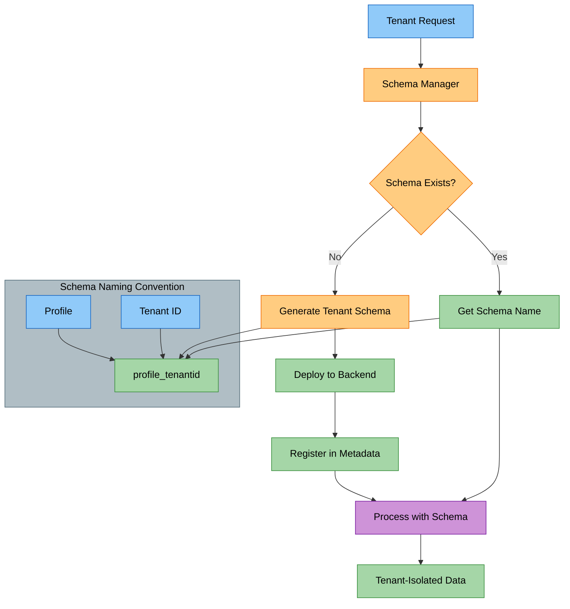
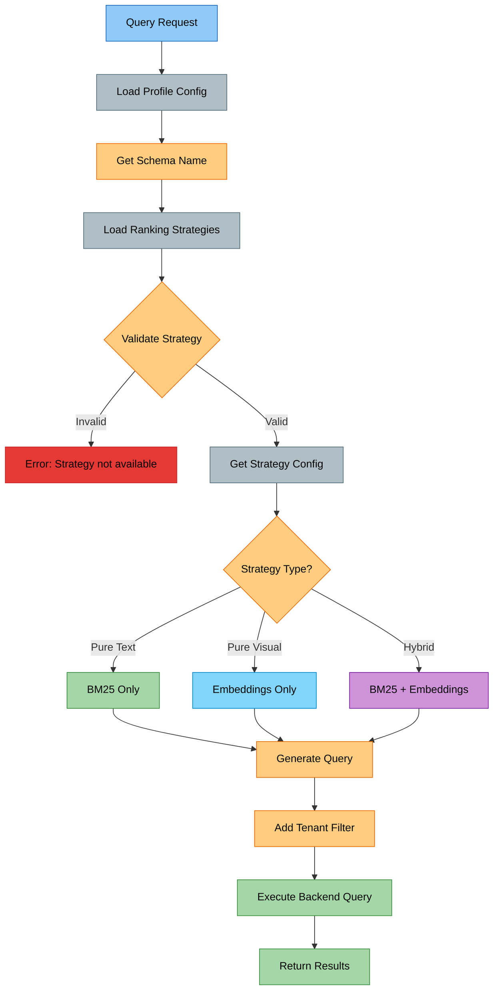

# Schema-Driven Multi-Tenant Processing Flow

## Overview

The Cogniverse system uses a schema-driven architecture where backend schemas (e.g., Vespa) define the data model, ranking strategies, and tenant isolation boundaries. Each tenant gets dedicated schemas deployed per embedding profile.

## Complete Flow Summary

1. **Schemas define everything** → `configs/schemas/*.json`
2. **Ingestion auto-generates strategies** → `StrategyAwareProcessor` writes `ranking_strategies.json` the first time it runs against a schema directory (deployment itself does not touch this file)
3. **Processing uses schema mapping** → profile → schema
4. **Query re-extracts strategies from the schema JSON** → validates → executes (search caches in-process; it does not read `ranking_strategies.json`)
5. **No manual steps** → Everything is automatic!

## Multi-Tenant Schema Architecture


```mermaid
flowchart TD
    A[<span style='color:#000'>Tenant Request</span>] --> B[<span style='color:#000'>Schema Manager</span>]
    B --> C{<span style='color:#000'>Schema Exists?</span>}

    C -->|No| D[<span style='color:#000'>Generate Tenant Schema</span>]
    D --> E[<span style='color:#000'>Deploy to Backend</span>]
    E --> F[<span style='color:#000'>Register in Metadata</span>]

    C -->|Yes| G[<span style='color:#000'>Get Schema Name</span>]

    F --> H[<span style='color:#000'>Process with Schema</span>]
    G --> H

    H --> I[<span style='color:#000'>Tenant-Isolated Data</span>]

    D --> L
    G --> L

    subgraph SchemaNaming[<span style='color:#000'>Schema Naming Convention</span>]
        J[<span style='color:#000'>Profile</span>]
        K[<span style='color:#000'>Tenant ID</span>]
        L[<span style='color:#000'>profile_tenantid</span>]
        J --> L
        K --> L
    end

    style A fill:#90caf9,stroke:#1565c0,color:#000
    style B fill:#ffcc80,stroke:#ef6c00,color:#000
    style C fill:#ffcc80,stroke:#ef6c00,color:#000
    style D fill:#ffcc80,stroke:#ef6c00,color:#000
    style E fill:#a5d6a7,stroke:#388e3c,color:#000
    style F fill:#a5d6a7,stroke:#388e3c,color:#000
    style G fill:#a5d6a7,stroke:#388e3c,color:#000
    style H fill:#ce93d8,stroke:#7b1fa2,color:#000
    style I fill:#a5d6a7,stroke:#388e3c,color:#000
    style SchemaNaming fill:#b0bec5,stroke:#546e7a,color:#000
    style J fill:#90caf9,stroke:#1565c0,color:#000
    style K fill:#90caf9,stroke:#1565c0,color:#000
    style L fill:#a5d6a7,stroke:#388e3c,color:#000
```

## 1. Processing/Ingestion Flow


```mermaid
flowchart TD
    A[<span style='color:#000'>Start Ingestion</span>] --> B[<span style='color:#000'>Load Config</span>]
    B --> C{<span style='color:#000'>First Time?</span>}

    C -->|Yes| D[<span style='color:#000'>Deploy All Schemas</span>]
    C -->|No| E[<span style='color:#000'>VideoIngestionPipeline</span>]

    D --> D1[<span style='color:#000'>Read Schema JSONs</span>]
    D1 --> D2[<span style='color:#000'>Deploy to Backend via SchemaRegistry</span>]
    D2 --> E

    E --> EP[<span style='color:#000'>StrategyAwareProcessor Init</span>]
    EP --> EP1{<span style='color:#000'>ranking_strategies.json exists?</span>}
    EP1 -->|No| EP2[<span style='color:#000'>Extract + Save ranking_strategies.json</span>]
    EP1 -->|Yes| F
    EP2 --> F[<span style='color:#000'>Process Videos by Profile</span>]
    F --> G[<span style='color:#000'>Extract Keyframes</span>]
    G --> H[<span style='color:#000'>Generate Embeddings</span>]
    H --> I[<span style='color:#000'>Get Schema for Profile</span>]

    I --> I1[<span style='color:#000'>Profile to Schema Mapping</span>]
    I1 --> I2[<span style='color:#000'>Load Ranking Strategies</span>]
    I2 --> I3[<span style='color:#000'>Determine Required Tensors</span>]

    I3 --> J[<span style='color:#000'>Format Data by Strategy</span>]
    J --> J1{<span style='color:#000'>Needs Float?</span>}
    J1 -->|Yes| J2[<span style='color:#000'>Add embedding field</span>]
    J1 -->|No| K
    J2 --> J3{<span style='color:#000'>Needs Binary?</span>}
    J3 -->|Yes| J4[<span style='color:#000'>Add embedding_binary</span>]
    J3 -->|No| K
    J4 --> K[<span style='color:#000'>Send to Backend</span>]
    K --> L[<span style='color:#000'>Next Video/Profile</span>]
    L -->|More Videos| F
    L -->|Done| M[<span style='color:#000'>End</span>]

    style A fill:#90caf9,stroke:#1565c0,color:#000
    style B fill:#b0bec5,stroke:#546e7a,color:#000
    style C fill:#ffcc80,stroke:#ef6c00,color:#000
    style D fill:#ffcc80,stroke:#ef6c00,color:#000
    style D1 fill:#ffcc80,stroke:#ef6c00,color:#000
    style D2 fill:#a5d6a7,stroke:#388e3c,color:#000
    style E fill:#ce93d8,stroke:#7b1fa2,color:#000
    style EP fill:#ce93d8,stroke:#7b1fa2,color:#000
    style EP1 fill:#ffcc80,stroke:#ef6c00,color:#000
    style EP2 fill:#a5d6a7,stroke:#388e3c,color:#000
    style F fill:#ce93d8,stroke:#7b1fa2,color:#000
    style G fill:#ffcc80,stroke:#ef6c00,color:#000
    style H fill:#81d4fa,stroke:#0288d1,color:#000
    style I fill:#ffcc80,stroke:#ef6c00,color:#000
    style I1 fill:#b0bec5,stroke:#546e7a,color:#000
    style I2 fill:#b0bec5,stroke:#546e7a,color:#000
    style I3 fill:#ffcc80,stroke:#ef6c00,color:#000
    style J fill:#ffcc80,stroke:#ef6c00,color:#000
    style J1 fill:#ffcc80,stroke:#ef6c00,color:#000
    style J2 fill:#a5d6a7,stroke:#388e3c,color:#000
    style J3 fill:#ffcc80,stroke:#ef6c00,color:#000
    style J4 fill:#a5d6a7,stroke:#388e3c,color:#000
    style K fill:#a5d6a7,stroke:#388e3c,color:#000
    style L fill:#ffcc80,stroke:#ef6c00,color:#000
    style M fill:#a5d6a7,stroke:#388e3c,color:#000
```

### Detailed Processing Steps:

1. **Schema Deployment** (First time or schema updates):
   ```bash
   RUNTIME_URL=http://localhost:8080
   curl -sfX POST "$RUNTIME_URL/admin/profiles/<profile>/deploy" \
     -H 'Content-Type: application/json' \
     -d '{"tenant_id": "<tenant>"}'
   ```
   - Reads the schema JSON from `configs/schemas/` via `FilesystemSchemaLoader`
   - Deploys via `SchemaRegistry.deploy_schema` so the package is the
     union of the new schema + everything already live in the cluster
   - Deployment itself never writes `ranking_strategies.json`. Two
     independent consumers extract ranking strategies on their own:
     `StrategyAwareProcessor` (ingestion) reads `configs/schemas/ranking_strategies.json`,
     auto-generating it via `extract_all_ranking_strategies` +
     `save_ranking_strategies` the first time it's missing; `VespaSearchBackend`
     (query time) re-extracts directly from the schema JSON files on first
     use and caches the result in-process — it never reads the on-disk file

2. **Profile Processing**:
   ```python
   from cogniverse_core.schemas.filesystem_loader import FilesystemSchemaLoader
   from pathlib import Path

   # Initialize schema loader
   loader = FilesystemSchemaLoader(Path("configs/schemas"))

   # Load ranking strategies from ranking_strategies.json
   strategies = loader.load_ranking_strategies()

   # Get strategies for a specific schema (e.g., "video_colpali_smol500_mv_frame")
   schema_strategies = strategies.get("video_colpali_smol500_mv_frame", {})

   # Determine what embeddings we need based on strategy config
   needs_float = any(s.get("needs_float_embeddings") for s in schema_strategies.values())
   needs_binary = any(s.get("needs_binary_embeddings") for s in schema_strategies.values())
   ```

3. **Data Formatting**:
   ```python
   document = {
       "video_id": video_id,
       "audio_transcript": transcript,  # BM25-indexed text field
       "segment_description": description,  # BM25-indexed text field
   }

   if needs_float:
       document["embedding"] = float_embeddings

   if needs_binary:
       document["embedding_binary"] = binary_embeddings
   ```

## 2. Query Flow


```mermaid
flowchart TD
    A[<span style='color:#000'>Query Request</span>] --> B[<span style='color:#000'>Load Profile Config</span>]
    B --> C[<span style='color:#000'>Get Schema Name</span>]
    C --> D[<span style='color:#000'>Load Ranking Strategies</span>]

    D --> E{<span style='color:#000'>Validate Strategy</span>}
    E -->|Invalid| F[<span style='color:#000'>Error: Strategy not available</span>]
    E -->|Valid| G[<span style='color:#000'>Get Strategy Config</span>]

    G --> H{<span style='color:#000'>Strategy Type?</span>}

    H -->|Pure Text| I[<span style='color:#000'>BM25 Only</span>]
    H -->|Pure Visual| J[<span style='color:#000'>Embeddings Only</span>]
    H -->|Hybrid| K[<span style='color:#000'>BM25 + Embeddings</span>]

    I --> L[<span style='color:#000'>Generate Query</span>]
    J --> L
    K --> L

    L --> M[<span style='color:#000'>Add Tenant Filter</span>]
    M --> N[<span style='color:#000'>Execute Backend Query</span>]

    N --> O[<span style='color:#000'>Return Results</span>]

    style A fill:#90caf9,stroke:#1565c0,color:#000
    style B fill:#b0bec5,stroke:#546e7a,color:#000
    style C fill:#ffcc80,stroke:#ef6c00,color:#000
    style D fill:#b0bec5,stroke:#546e7a,color:#000
    style E fill:#ffcc80,stroke:#ef6c00,color:#000
    style F fill:#e53935,stroke:#c62828,color:#000
    style G fill:#b0bec5,stroke:#546e7a,color:#000
    style H fill:#ffcc80,stroke:#ef6c00,color:#000
    style I fill:#a5d6a7,stroke:#388e3c,color:#000
    style J fill:#81d4fa,stroke:#0288d1,color:#000
    style K fill:#ce93d8,stroke:#7b1fa2,color:#000
    style L fill:#ffcc80,stroke:#ef6c00,color:#000
    style M fill:#ffcc80,stroke:#ef6c00,color:#000
    style N fill:#a5d6a7,stroke:#388e3c,color:#000
    style O fill:#a5d6a7,stroke:#388e3c,color:#000
```

### Query Types and Embedding Requirements

- **Pure Visual** (float_float, binary_binary):
  - Global models: Use `nearestNeighbor`
  - Patch models: Use tensor ranking

- **Hybrid** (hybrid_binary_bm25):
  - Combines `userInput` for text with embeddings

- **Text-Only** (bm25_only):
  - Only uses `userInput`, no embeddings needed

### How Embeddings Flow
1. `SearchService.search()` calls the backend with the raw query text and
   no pre-computed embeddings (`has_embeddings=False`)
2. `VespaSearchBackend` resolves the ranking strategy (requested or
   auto-selected) and checks its `needs_float_embeddings` /
   `needs_binary_embeddings` flags
3. Embeddings are generated on-demand only when the strategy needs them —
   `self.query_encoder.encode(query_text)` is called lazily inside the
   backend's search path
4. If both flags are false (e.g. `bm25_only`), the encoder is never called —
   text-only search via `userInput` YQL only

## 3. Ranking Strategy Details

### Strategy Requirements Table

| Strategy | Text | Float | Binary | nearestNeighbor | Notes |
|----------|------|-------|--------|-----------------|-------|
| default | - | - | ✓ | - | Schema's default profile; binary Hamming-distance ranking, not nearestNeighbor-eligible |
| bm25_only | ✓ | - | - | - | Pure text search |
| float_float | - | ✓ | - | ✓* | Pure visual, float embeddings |
| binary_binary | - | - | ✓ | ✓* | Pure visual, binary embeddings |
| float_binary | - | ✓/✓ | ✓/✓ | ✓* | Float primary, binary fallback |
| hybrid_float_bm25 | ✓ | ✓ | - | ✓* | Text + float embeddings, visual-similarity-first ranking |
| hybrid_binary_bm25 | ✓ | - | ✓ | ✓* | Text + binary embeddings, visual-similarity-first ranking |
| hybrid_bm25_float | ✓ | ✓ | - | - | Same fields as hybrid_float_bm25, but BM25-first ranking; not nearestNeighbor-eligible |
| hybrid_bm25_binary | ✓ | - | ✓ | - | Same fields as hybrid_binary_bm25, but BM25-first ranking; not nearestNeighbor-eligible |
| phased | ✓ | ✓ | ✓ | ✓* | Two-phase: binary → float |

*nearestNeighbor used by single-vector schemas (detected via `_sv_` or `_lvt_` token in the schema name, e.g., `video_videoprism_lvt_base_sv_chunk_6s`), and only for the profile names the extractor recognizes as nearestNeighbor-eligible (the `default` and `hybrid_bm25_*` profiles above always use tensor ranking, even on single-vector schemas).

The colpali/colqwen video schemas also carry `bm25_no_description` and
`hybrid_*_bm25_no_description` variants of the text/hybrid strategies above,
which drop the `segment_description` field from the BM25 expression — same
Text/Float/Binary/nearestNeighbor requirements as their non-`_no_description`
counterparts.

### Schema-Specific Behavior

The search method is determined by the `RankingStrategyInfo` extracted from schemas. Key fields:

```python
from pathlib import Path
from cogniverse_vespa.ranking_strategy_extractor import RankingStrategyExtractor

extractor = RankingStrategyExtractor()
strategies = extractor.extract_from_schema(Path("configs/schemas/video_videoprism_base_mv_chunk_30s_schema.json"))

# Example: Get float_float strategy info
float_strategy = strategies["float_float"]

# RankingStrategyInfo provides:
print(f"Use nearestNeighbor: {float_strategy.use_nearestneighbor}")  # False for mv schemas, True for _sv_ schemas
print(f"NN field: {float_strategy.nearestneighbor_field}")          # "embedding" for sv float strategies
print(f"NN tensor: {float_strategy.nearestneighbor_tensor}")        # "qt" for sv float strategies
print(f"Strategy type: {float_strategy.strategy_type}")             # SearchStrategyType.PURE_VISUAL
```

**Search Method Logic:**
- **Single-vector embeddings** (sv schemas containing `_sv_` like `video_videoprism_lvt_base_sv_chunk_6s`): `use_nearestneighbor=True` for visual/hybrid strategies → uses `nearestNeighbor(embedding, qt)` YQL for efficient ANN search - embeddings are `tensor<float>(v[N])` with no sparse dimensions
- **Multi-vector embeddings** (mv schemas like `video_colpali_smol500_mv_frame`, `video_videoprism_base_mv_chunk_30s`): `use_nearestneighbor=False` → uses tensor ranking expression - embeddings have `patch{}` or similar sparse dimensions
- **Text-only** (`bm25_only`): Uses `userInput` YQL function

## 4. Multi-Tenant Schema Deployment

### Tenant Schema Management

**Package**: cogniverse-vespa (Implementation Layer)
**Location**: `libs/vespa/cogniverse_vespa/vespa_schema_manager.py`

```python
from cogniverse_vespa.vespa_schema_manager import VespaSchemaManager

# Initialize with backend connection and optional registry
manager = VespaSchemaManager(
    backend_endpoint="http://localhost",
    backend_port=19071,
    schema_loader=schema_loader,  # Accepted for call-site compatibility but unused
    schema_registry=schema_registry  # Optional, needed for tenant schema operations
)

# Generate tenant-specific schema name
schema_name = manager.get_tenant_schema_name(
    tenant_id="acme",
    base_schema_name="video_colpali_smol500_mv_frame"
)
# Returns: "video_colpali_smol500_mv_frame_acme"

# Check if tenant schema exists
exists = manager.tenant_schema_exists(
    tenant_id="acme",
    base_schema_name="video_colpali_smol500_mv_frame"
)

# Deploy a tenant-scoped schema from its JSON base definition.
# SchemaRegistry.deploy_schema() is the primary entry point: it loads the
# base JSON schema from configs/schemas/, transforms it to a tenant-specific
# schema, and deploys via the backend.
from cogniverse_core.registries.schema_registry import SchemaRegistry

registry = SchemaRegistry(...)  # constructed with config_manager, backend, schema_loader (all required)
tenant_schema_name = registry.deploy_schema(
    tenant_id="acme",
    base_schema_name="video_colpali_smol500_mv_frame",
)
# Returns: "video_colpali_smol500_mv_frame_acme"

# Delete all schemas for a tenant (redeploys to Vespa without them first,
# then tombstones the registry entries)
deleted = manager.delete_tenant_schemas(tenant_id="acme")
# Returns: ["video_colpali_smol500_mv_frame_acme", ...]
```

**Key Methods:**
- `get_tenant_schema_name(tenant_id, base_schema_name)` - Generate tenant schema name
- `tenant_schema_exists(tenant_id, base_schema_name)` - Check schema existence
- `delete_tenant_schemas(tenant_id)` - Redeploy to Vespa without the tenant's schemas (`allow_schema_removal=True` via `_redeploy_dropping`), then tombstone the registry entries
- `SchemaRegistry.deploy_schema(tenant_id, base_schema_name)` - Primary entry point for deploying a tenant-scoped schema from its JSON base definition

### Profile to Schema Mapping

**Package**: cogniverse-vespa (Implementation Layer)
**Location**: Each profile has a dedicated schema in `configs/schemas/`

Each embedding profile has its own Vespa schema file. The schema name matches the profile name:

| Profile | Schema File | Embedding Type |
|---------|-------------|----------------|
| `video_colpali_smol500_mv_frame` | `video_colpali_smol500_mv_frame_schema.json` | Patch (multi-vector) |
| `video_colqwen_omni_mv_chunk_30s` | `video_colqwen_omni_mv_chunk_30s_schema.json` | Patch (multi-vector) |
| `video_videoprism_base_mv_chunk_30s` | `video_videoprism_base_mv_chunk_30s_schema.json` | Chunk (multi-vector) |
| `video_videoprism_large_mv_chunk_30s` | `video_videoprism_large_mv_chunk_30s_schema.json` | Chunk (multi-vector) |
| `video_videoprism_lvt_base_sv_chunk_6s` | `video_videoprism_lvt_base_sv_chunk_6s_schema.json` | Chunk (single-vector) |
| `video_videoprism_lvt_large_sv_chunk_6s` | `video_videoprism_lvt_large_sv_chunk_6s_schema.json` | Chunk (single-vector) |

**Schema Structure Example** (`configs/schemas/video_colpali_smol500_mv_frame_schema.json`):
```json
{
  "name": "video_colpali_smol500_mv_frame",
  "document": {
    "name": "video_colpali_smol500_mv_frame",
    "fields": [
      {"name": "video_id", "type": "string", ...},
      {"name": "embedding", "type": "tensor<bfloat16>(patch{}, v[320])", ...},
      {"name": "embedding_binary", "type": "tensor<int8>(patch{}, v[40])", ...}
    ]
  },
  "rank_profiles": [
    {"name": "default", ...},
    {"name": "binary_binary", ...},
    {"name": "hybrid_float_bm25", ...}
  ]
}
```

## 5. Strategy Extraction and Validation

### Automatic Strategy Extraction

**Package**: cogniverse-vespa (Implementation Layer)
**Location**: `libs/vespa/cogniverse_vespa/ranking_strategy_extractor.py`

```python
from cogniverse_vespa.ranking_strategy_extractor import (
    RankingStrategyExtractor,
    RankingStrategyInfo,
    SearchStrategyType,
    extract_all_ranking_strategies,
    save_ranking_strategies,
)
from pathlib import Path

# Extract strategies from a single schema
extractor = RankingStrategyExtractor()
strategies = extractor.extract_from_schema(
    Path("configs/schemas/video_colpali_smol500_mv_frame_schema.json")
)

# Each strategy is a RankingStrategyInfo dataclass with:
# - name: str
# - strategy_type: SearchStrategyType (PURE_VISUAL, PURE_TEXT, HYBRID)
# - needs_float_embeddings: bool
# - needs_binary_embeddings: bool
# - needs_text_query: bool
# - use_nearestneighbor: bool
# - nearestneighbor_field: Optional[str]
# - nearestneighbor_tensor: Optional[str]
# - embedding_field: Optional[str]
# - query_tensor_name: Optional[str]
# - timeout: float
# - description: str
# - inputs: Dict[str, str]  # Full input definitions
# - query_tensors_needed: List[str]  # List of tensor names needed
# - schema_name: str  # Schema this strategy belongs to

# Extract from all schemas in directory
all_strategies = extract_all_ranking_strategies(Path("configs/schemas"))

# Save to ranking_strategies.json
save_ranking_strategies(all_strategies, Path("configs/schemas/ranking_strategies.json"))
```

### Strategy Validation

Strategy validation is done by checking if the requested strategy exists in the schema's `ranking_strategies.json`:

```python
from cogniverse_core.schemas.filesystem_loader import FilesystemSchemaLoader
from pathlib import Path

loader = FilesystemSchemaLoader(Path("configs/schemas"))
strategies = loader.load_ranking_strategies()

def validate_strategy_for_schema(schema_name: str, strategy_name: str) -> bool:
    """Check if a strategy is available for a schema"""
    schema_strategies = strategies.get(schema_name, {})
    return strategy_name in schema_strategies

# Example usage
if not validate_strategy_for_schema("video_colpali_smol500_mv_frame", "float_float"):
    raise ValueError("Strategy not available for this schema")
```

## 6. Optimization Points

### Current Implementation

Lazy, on-demand embedding generation is already implemented in
`VespaSearchBackend`. `SearchService` never encodes the query itself —
it passes the raw query text to the backend, which resolves the ranking
strategy first and only invokes the query encoder when the strategy's
`needs_float_embeddings` / `needs_binary_embeddings` flags require it
(`libs/vespa/cogniverse_vespa/search_backend.py`, the on-demand-encode
block around `requires_embeddings = rank_config.get("needs_float_embeddings", ...)`).
Text-only strategies (`bm25_only`) never invoke the encoder:

```python
# libs/vespa/cogniverse_vespa/search_backend.py (simplified)
requires_embeddings = rank_config.get(
    "needs_float_embeddings", False
) or rank_config.get("needs_binary_embeddings", False)

if requires_embeddings and query_embeddings is None:
    if self.query_encoder:
        query_embeddings = self.query_encoder.encode(query_text)
```

### Remaining Gaps
- Float and binary embeddings are not independently gated — a `float_binary`
  strategy currently runs one encoder call and derives both representations
  from it rather than skipping the unused one

## 7. Configuration Storage in Vespa

Configuration is stored directly in Vespa via `VespaConfigStore`, providing unified storage with multi-tenant support.

**Package**: cogniverse-vespa (Implementation Layer)
**Location**: `libs/vespa/cogniverse_vespa/config/config_store.py`

### VespaConfigStore Schema

Uses the `config_metadata` schema with document structure:
```python
{
    "fields": {
        "config_id": "tenant_id:scope:service:config_key",
        "tenant_id": "default",
        "scope": "system",  # ConfigScope: system, agent, routing, telemetry, schema, backend
        "service": "video_search",
        "config_key": "search_settings",
        "config_value": {...},  # JSON serialized
        "version": 1,
        "created_at": "2024-01-01T00:00:00",
        "updated_at": "2024-01-01T00:00:00"
    }
}
```

### Usage
```python
from cogniverse_vespa.config.config_store import VespaConfigStore
from cogniverse_sdk.interfaces.config_store import ConfigScope

# Initialize with URL and port (Vespa app created internally)
config_store = VespaConfigStore(
    backend_url="http://localhost",
    backend_port=8080,
    schema_name="config_metadata"
)
config_store.initialize()

# Or initialize with existing Vespa app instance
from vespa.application import Vespa
vespa_app = Vespa(url="http://localhost:8080")
config_store = VespaConfigStore(
    vespa_app=vespa_app,
    schema_name="config_metadata"
)
config_store.initialize()

# Store configuration (creates new version)
entry = config_store.set_config(
    tenant_id="acme",
    scope=ConfigScope.SYSTEM,  # Valid scopes: SYSTEM, AGENT, ROUTING, TELEMETRY, SCHEMA, BACKEND
    service="video_search",
    config_key="search_settings",
    config_value={"default_limit": 10, "max_results": 100}
)

# Retrieve configuration (latest version)
config = config_store.get_config(
    tenant_id="acme",
    scope=ConfigScope.SYSTEM,
    service="video_search",
    config_key="search_settings"
)

# Get configuration history
history = config_store.get_config_history(
    tenant_id="acme",
    scope=ConfigScope.SYSTEM,
    service="video_search",
    config_key="search_settings",
    limit=10
)

# Export/import for tenant
exported = config_store.export_configs(tenant_id="acme")
config_store.import_configs(tenant_id="new_tenant", configs=exported)
```

**Key Features:**
- Versioned configurations (all updates create new versions)
- Multi-tenant isolation via tenant_id
- Scoped configurations (system, agent, routing, telemetry, schema, backend)
- Export/import for tenant migration
- Health checks and statistics

## 8. Complete Configuration Flow

### Configuration Loading Order (Layered Architecture)

1. **config.json** (cogniverse-foundation) → Main configuration with profiles
   - Location: `configs/config.json`
   - Package: cogniverse-foundation (config module)

2. **schemas/*.json** (cogniverse-vespa) → Backend schema definitions
   - Location: `configs/schemas/*.json`
   - Package: cogniverse-vespa (schema manager)

3. **ranking_strategies.json** (auto-generated by ingestion, bypassed by search) → Extracted strategies
   - Location: `configs/schemas/ranking_strategies.json`
   - Package: cogniverse-vespa (strategy extractor)
   - Written by `StrategyAwareProcessor` (ingestion) the first time it runs
     against a schema directory where the file doesn't exist yet.
     `VespaSearchBackend` (query time) never reads this file — it calls
     `extract_all_ranking_strategies` directly against the schema JSON
     files and caches the result in-process, so search always reflects
     the live schemas even if this file is stale or deleted.

4. **Profile-Schema Mapping** (Naming convention) → Profile to schema mapping
   - Convention: Each profile has a dedicated schema file named `{profile_name}_schema.json`
   - Location: `configs/schemas/` directory
   - Example: Profile `video_colpali_smol500_mv_frame` → `video_colpali_smol500_mv_frame_schema.json`

### Runtime Configuration

Configuration is loaded via `ConfigManager` from cogniverse-foundation:

```python
from cogniverse_foundation.config.manager import ConfigManager
from cogniverse_vespa.config.config_store import VespaConfigStore
from cogniverse_core.schemas.filesystem_loader import FilesystemSchemaLoader
from pathlib import Path

# Initialize config store and manager
config_store = VespaConfigStore(backend_url="http://localhost", backend_port=8080)
config_manager = ConfigManager(store=config_store)

# Load global system configuration
system_config = config_manager.get_system_config()

# Load schema and strategy information
loader = FilesystemSchemaLoader(Path("configs/schemas"))
strategies = loader.load_ranking_strategies()

# Get strategy config for a specific schema
schema_name = "video_colpali_smol500_mv_frame"
strategy_name = "hybrid_float_bm25"
strategy_config = strategies.get(schema_name, {}).get(strategy_name)

if strategy_config:
    print(f"Strategy type: {strategy_config['strategy_type']}")
    print(f"Needs float: {strategy_config['needs_float_embeddings']}")
    print(f"Uses nearestNeighbor: {strategy_config['use_nearestneighbor']}")
```

## 9. Monitoring & Validation

### Schema Health Checks

Use VespaSchemaManager to validate tenant schemas:

```python
from cogniverse_vespa.vespa_schema_manager import VespaSchemaManager

manager = VespaSchemaManager(
    backend_endpoint="http://localhost",
    backend_port=19071,
    schema_loader=schema_loader,  # Accepted for call-site compatibility but unused
    schema_registry=schema_registry  # Optional, needed for tenant operations
)

# Check if a specific tenant schema exists
exists = manager.tenant_schema_exists(
    tenant_id="acme",
    base_schema_name="video_colpali_smol500_mv_frame"
)

# Get the tenant-specific schema name
schema_name = manager.get_tenant_schema_name(
    tenant_id="acme",
    base_schema_name="video_colpali_smol500_mv_frame"
)
# Returns: "video_colpali_smol500_mv_frame_acme"
```

### Health Check via Vespa Query

```python
from vespa.application import Vespa

vespa = Vespa(url="http://localhost:8080")

# Check schema accessibility
try:
    response = vespa.query(
        yql=f"select * from {schema_name} where true limit 1"
    )
    doc_count = response.number_documents_retrieved
    print(f"Schema {schema_name}: {doc_count} documents accessible")
except Exception as e:
    print(f"Schema {schema_name}: NOT ACCESSIBLE - {e}")
```

## Troubleshooting

### Common Issues

**Strategy Not Available**
```python
from cogniverse_core.schemas.filesystem_loader import FilesystemSchemaLoader
from pathlib import Path

loader = FilesystemSchemaLoader(Path("configs/schemas"))
strategies = loader.load_ranking_strategies()

# Check if strategy exists for schema
schema_name = "video_colpali_smol500_mv_frame"
strategy_name = "float_float"

if schema_name not in strategies or strategy_name not in strategies[schema_name]:
    raise ValueError(f"Strategy {strategy_name} not available for schema {schema_name}")
```

**nearestNeighbor vs Tensor Ranking**

Use the extracted `RankingStrategyInfo` to determine the correct search method:
```python
from cogniverse_vespa.ranking_strategy_extractor import RankingStrategyExtractor

extractor = RankingStrategyExtractor()
strategies = extractor.extract_from_schema(schema_path)
strategy_info = strategies.get(strategy_name)

if strategy_info.use_nearestneighbor:
    # Global embedding - use nearestNeighbor
    field = strategy_info.nearestneighbor_field  # "embedding" or "embedding_binary"
    tensor = strategy_info.nearestneighbor_tensor  # "qt" or "qtb"
    yql = f"where ({{targetHits:100}}nearestNeighbor({field}, {tensor}))"
elif strategy_info.strategy_type.value == "pure_visual":
    # Patch embedding - use tensor ranking expression
    yql = "where true"  # Ranking handled by first-phase expression
else:
    # Text search
    yql = "where userInput(@userQuery)"
```

**Dimension Mismatch**

Check tensor dimensions from the schema JSON:
```python
import json

with open("configs/schemas/video_colpali_smol500_mv_frame_schema.json") as f:
    schema = json.load(f)

# Find embedding field dimension
for field in schema["document"]["fields"]:
    if field["name"] == "embedding":
        # Parse dimension from type like "tensor<bfloat16>(patch{}, v[320])"
        # (this schema's actual embedding type)
        field_type = field["type"]
        # Extract dimension - e.g., v[320] → 320
        print(f"Schema embedding dimension: {field_type}")

# Compare with actual embedding
if embedding_dim != expected_dim:
    raise ValueError(f"Dimension mismatch: expected {expected_dim}, got {embedding_dim}")
```

## Best Practices

1. **Always deploy schemas first** before ingesting data
2. **Use extracted strategies** from ranking_strategies.json
3. **Validate strategy compatibility** before querying
4. **Monitor schema health** regularly
5. **Keep schema naming consistent**: `{profile}_{tenant_id}`
6. **Test strategy changes** in staging first
7. **Document custom modifications** to schemas

---

**Package Architecture Note**: Schema-driven processing spans multiple packages in the layered architecture:

- **Foundation Layer**: cogniverse-sdk (schema interfaces), cogniverse-foundation (config)
- **Core Layer**: cogniverse-core (schema registries, base processing)
- **Implementation Layer**: cogniverse-vespa (schema management, deployment), cogniverse-agents (schema-based agents)
- **Application Layer**: cogniverse-runtime (ingestion pipelines using schemas)

**Key Locations:**

- Schema files: `configs/schemas/*.json`
- Schema processing: `libs/vespa/cogniverse_vespa/vespa_schema_manager.py`
- Tenant schema routing: `libs/vespa/cogniverse_vespa/vespa_schema_manager.py`
- Configuration storage: `libs/vespa/cogniverse_vespa/config/config_store.py` (VespaConfigStore)
