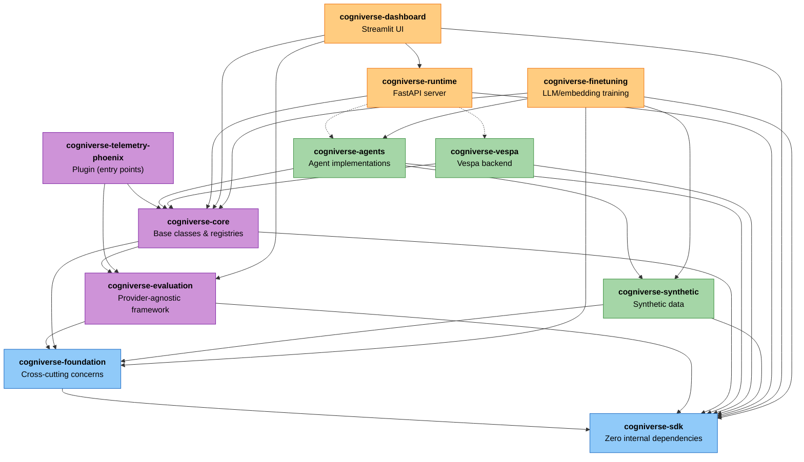

# Cogniverse SDK Architecture

---

## Table of Contents

1. [Overview](#overview)
2. [UV Workspace Structure](#uv-workspace-structure)
3. [Package Architecture](#package-architecture)
4. [Dependency Management](#dependency-management)
5. [Development Workflows](#development-workflows)
6. [Testing Strategy](#testing-strategy)
7. [Building and Distribution](#building-and-distribution)
8. [Import Patterns](#import-patterns)
9. [Package Versioning](#package-versioning)

---

## Overview

Cogniverse is structured as a **UV workspace monorepo** with a layered architecture. This architecture supports multi-modal content processing (video, audio, images, documents, text, dataframes) with multi-agent orchestration and provides:

- **Modular Design**: Clear separation of concerns across Foundation, Core, Implementation, and Application layers
- **Dependency Management**: Explicit package boundaries with workspace-based dependency resolution
- **Independent Testing**: Test packages in isolation or together for unit and integration testing
- **Selective Deployment**: Deploy only what's needed (e.g., runtime without dashboard, agents without synthetic)
- **Faster Iteration**: Work on specific packages without full system overhead
- **Multi-Modal Support**: Unified document model across video, audio, images, documents, text, and dataframes

### Key Statistics

- **Total Packages**: 11 packages in layered architecture
- **Workspace Location**: `libs/` directory
- **Python Version**: >= 3.11 (sdk) or >= 3.12 (all others)
- **Build System**: Hatchling for all packages
- **Package Manager**: UV for workspace and dependency management

### Package Breakdown by Layer

```text
Foundation Layer:
├── sdk/           # Pure backend interfaces (zero internal dependencies)
└── foundation/    # Cross-cutting concerns (config, telemetry base)

Core Layer:
├── core/          # Core functionality and base classes
├── evaluation/    # Provider-agnostic evaluation framework
└── telemetry-phoenix/ # Phoenix telemetry provider (plugin)

Implementation Layer:
├── agents/        # Agent implementations
├── vespa/         # Vespa backend integration
└── synthetic/     # Synthetic data generation

Application Layer:
├── runtime/       # FastAPI server and ingestion
├── dashboard/     # Streamlit analytics UI
└── finetuning/    # LLM/embedding fine-tuning infrastructure
```

---

## UV Workspace Structure

### Root Configuration

The root `pyproject.toml` defines the workspace:

```toml
[tool.uv.workspace]
members = ["libs/*"]

[project]
name = "cogniverse"
version = "0.1.0"
requires-python = ">=3.12"
```

**Key Points**:

- `members = ["libs/*"]` discovers all packages in `libs/` directory
- Root dependencies apply to all packages (heavy ML dependencies)
- Each package can override or extend root dependencies

### Workspace Benefits

1. **Shared Dependencies**: Common dependencies installed once
2. **Local Package Resolution**: Packages reference each other via workspace
3. **Unified Lock File**: Single `uv.lock` for reproducibility
4. **Cross-Package Development**: Edit multiple packages simultaneously
5. **Consistent Versions**: All packages use same version of shared dependencies

### Directory Structure

```text
cogniverse/
├── pyproject.toml              # Root workspace config
├── uv.lock                     # Unified lock file
├── libs/                       # Workspace packages
│   ├── core/
│   │   ├── pyproject.toml      # Package config
│   │   ├── README.md           # Package docs
│   │   └── cogniverse_core/    # Python package
│   │       ├── __init__.py
│   │       ├── agents/         # Module
│   │       ├── common/         # Module
│   │       └── ...
│   ├── agents/
│   ├── vespa/
│   ├── runtime/
│   └── dashboard/
├── tests/                      # Workspace-level tests
├── scripts/                    # Development scripts
└── docs/                       # Documentation
```

---

## Package Architecture

### Foundation Layer

#### Package 1: cogniverse-sdk

**Purpose**: Pure backend interfaces with zero internal Cogniverse dependencies.

**Package Name**: `cogniverse-sdk` (installable)
**Import Name**: `cogniverse_sdk` (Python import)
**Layer**: Foundation

#### Module Structure

```text
cogniverse_sdk/
├── __init__.py
├── document.py      # Universal document model
└── interfaces/      # Backend, ConfigStore, SchemaLoader, AdapterStore, WorkflowStore
```

> See `libs/sdk/cogniverse_sdk/` for complete structure

#### Dependencies

> See `libs/sdk/pyproject.toml` - Zero internal Cogniverse dependencies

#### Key Responsibilities

- **Backend Interface**: Defines contracts for backend implementations via `Backend`, `SearchBackend`, and `IngestionBackend` classes
- **Document Model**: Universal document representation across backends for video, audio, images, documents, text, dataframes
- **Configuration Interface**: Config storage abstraction via `ConfigStore` for multi-tenant configuration
- **Schema Loading**: Template loading interface via `SchemaLoader` for multi-tenancy with schema-per-tenant
- **Adapter Store**: Interface for adapter storage and retrieval via `AdapterStore`
- **Workflow Store**: Interface for workflow storage via `WorkflowStore`

---

#### Package 2: cogniverse-foundation

**Purpose**: Cross-cutting concerns and shared infrastructure (config, telemetry base).

**Package Name**: `cogniverse-foundation` (installable)
**Import Name**: `cogniverse_foundation` (Python import)
**Layer**: Foundation

#### Module Structure

```text
cogniverse_foundation/
├── __init__.py
├── cache/       # Caching utilities
├── config/      # SystemConfig, ConfigManager, bootstrap, sqlite store
├── telemetry/   # TelemetryManager, providers, exporters, context
└── utils/       # Utility functions
```

> See `libs/foundation/cogniverse_foundation/` for complete structure

#### Dependencies

> See `libs/foundation/pyproject.toml` - Depends on: cogniverse-sdk

#### Key Responsibilities

- **Configuration Management**: SystemConfig, ConfigManager, and bootstrap utilities
- **Telemetry Infrastructure**: TelemetryManager, providers, exporters, and context
- **Cross-cutting Concerns**: Shared infrastructure across all packages

---

### Core Layer

#### Package 3: cogniverse-core

**Purpose**: Core functionality, base classes, and registries.

**Package Name**: `cogniverse-core` (installable)
**Import Name**: `cogniverse_core` (Python import)
**Layer**: Core

#### Module Structure

```text
cogniverse_core/
├── __init__.py
├── agents/      # AgentBase, A2AAgent, mixins (memory_aware_mixin, health_mixin, tenant_aware_mixin, dspy_integration_mixin, a2a_mixin, dynamic_dspy_mixin, rlm_options)
├── backends/    # Backend implementations
├── common/      # Utilities, cache/, models/, utils/
├── config/      # Configuration utilities
├── events/      # Event queue system with backends
├── factories/   # Backend factory patterns
├── interfaces/  # Interface definitions
├── memory/      # Mem0MemoryManager, vector store
├── registries/  # Agent, backend, DSPy, schema, adapter_store, workflow_store registries
├── schemas/     # Filesystem schema loader
├── telemetry/   # Telemetry utilities
└── validation/  # Profile validation
```

> See `libs/core/cogniverse_core/` for complete structure

#### Dependencies

> See `libs/core/pyproject.toml` - Depends on: cogniverse-sdk, cogniverse-foundation, cogniverse-evaluation

#### Key Responsibilities

- **Base Classes**: Abstract agent interfaces (AgentBase, AgentInput, AgentOutput, AgentDeps, A2AAgent) and mixins (MemoryAwareMixin, HealthCheckMixin, A2AEndpointsMixin, DSPyIntegrationMixin, TenantAwareAgentMixin)
- **Registries**: Component registration and discovery for agents, backends, DSPy modules, schemas, adapters, workflows
- **Memory**: Mem0MemoryManager with multi-tenant support and vector store backend
- **Caching**: Pipeline and embedding caches with structured filesystem backend
- **Common Utilities**: Tenant context management, model loaders, query utilities, async polling, retry logic

---

#### Package 4: cogniverse-evaluation

**Purpose**: Provider-agnostic evaluation framework for experiments and metrics.

**Package Name**: `cogniverse-evaluation` (installable)
**Import Name**: `cogniverse_evaluation` (Python import)
**Layer**: Core

#### Module Structure

```text
cogniverse_evaluation/
├── __init__.py
├── analysis/       # Root cause analysis
├── core/           # Tasks, solvers, scorers, experiment tracking
├── data/           # Datasets, storage, traces
├── evaluators/     # LLM judge, visual judge, routing evaluator, etc.
├── inspect_tasks/  # Inspect AI video retrieval tasks
├── metrics/        # Custom and reference-free metrics
├── plugins/        # Video, document, visual analyzers
└── providers/      # EvaluationProvider abstraction and registry
```

> See `libs/evaluation/cogniverse_evaluation/` for complete structure

#### Dependencies

> See `libs/evaluation/pyproject.toml` - Depends on: cogniverse-foundation, cogniverse-sdk

#### Key Responsibilities

- **Core Framework**: Task definitions, solvers, scorers, and experiment tracking via Inspect AI
- **Evaluation Providers**: Provider-agnostic evaluation interface with registry
- **Metrics**: Custom and reference-free evaluation metrics
- **Plugins**: Domain-specific evaluators for video, documents, and visual content
- **Analysis**: Root cause analysis for evaluation results

---

#### Package 5: cogniverse-telemetry-phoenix

**Purpose**: Phoenix-specific telemetry provider (plugin architecture with entry points).

**Package Name**: `cogniverse-telemetry-phoenix` (installable)
**Import Name**: `cogniverse_telemetry_phoenix` (Python import)
**Layer**: Core (Plugin)

#### Module Structure

```text
cogniverse_telemetry_phoenix/
├── __init__.py
├── provider.py    # Phoenix telemetry provider
└── evaluation/    # Analytics, monitoring, experiments, evaluation provider
```

> See `libs/telemetry-phoenix/cogniverse_telemetry_phoenix/` for complete structure

#### Dependencies

> See `libs/telemetry-phoenix/pyproject.toml` - Depends on: cogniverse-core, cogniverse-evaluation

#### Entry Points

```toml
[project.entry-points."cogniverse.telemetry.providers"]
phoenix = "cogniverse_telemetry_phoenix:PhoenixProvider"

[project.entry-points."cogniverse.evaluation.providers"]
phoenix = "cogniverse_telemetry_phoenix.evaluation.evaluation_provider:PhoenixEvaluationProvider"
```

#### Key Responsibilities

- **Phoenix Provider**: Phoenix-specific telemetry implementation via entry points
- **Trace Queries**: Query Phoenix spans and traces
- **Analytics**: PhoenixAnalytics for data analysis
- **Evaluation Provider**: Phoenix evaluation implementation
- **Monitoring**: Performance monitoring with dedicated provider
- **Plugin Architecture**: Auto-discovered via entry points

---

### Implementation Layer

#### Package 6: cogniverse-agents

**Purpose**: Agent implementations including routing, video search, and orchestration.

**Package Name**: `cogniverse-agents` (installable)
**Import Name**: `cogniverse_agents` (Python import)
**Layer**: Implementation

#### Module Structure

```text
cogniverse_agents/
├── __init__.py
├── *_agent*.py    # Agent implementations (routing, video, audio, document, image, text, etc.)
├── approval/      # Human-in-the-loop approval workflow
├── inference/     # RLM inference with instrumentation
├── mixins/        # Agent mixins (RLM-aware)
├── optimizer/     # DSPy optimization with local/Modal providers
├── orchestrator/  # Multi-agent orchestration, A2A gateway, checkpoints
├── query/         # Query analysis and encoding
├── results/       # Result aggregation and enhancement
├── routing/       # Advanced routing subsystem (39 modules)
├── search/        # Rerankers (hybrid, learned, multi-modal)
├── tools/         # A2A utils, video tools, temporal extraction
└── workflow/      # Workflow intelligence, state machine
```

> See `libs/agents/cogniverse_agents/` for complete structure

#### Dependencies

> See `libs/agents/pyproject.toml` - Depends on: cogniverse-sdk, cogniverse-core, cogniverse-synthetic

#### Key Responsibilities

- **Agent Implementations**: OrchestratorAgent (A2A entry point), routing, video search, document, audio, image, text analysis agents
- **Query Processing**: Modality detection, entity extraction with GLiNER, query enhancement
- **Search Enhancement**: Multi-modal, hybrid, and learned reranking with relevance scoring
- **Optimization**: DSPy agent optimization with local and Modal GPU providers
- **A2A Protocol**: Agent-to-agent communication gateway and routing
- **Result Processing**: Aggregation and enhancement of search results

---

#### Package 7: cogniverse-vespa

**Purpose**: Vespa backend implementation with multi-tenant schema management.

**Package Name**: `cogniverse-vespa` (installable)
**Import Name**: `cogniverse_vespa` (Python import)
**Layer**: Implementation

#### Module Structure

```text
cogniverse_vespa/
├── __init__.py
├── *.py           # Backend, search, ingestion, schema management, embedding processing
├── config/        # VespaConfigStore
├── registry/      # VespaAdapterStore (entry point)
└── workflow/      # VespaWorkflowStore (entry point)
```

> See `libs/vespa/cogniverse_vespa/` for complete structure
> Dependencies and entry points: `libs/vespa/pyproject.toml`

#### Key Responsibilities

- **Schema Management**: Deploy and manage tenant-specific Vespa schemas
- **Search Backend**: Query execution, ranking strategies, and result processing
- **Data Ingestion**: Batch ingestion with schema validation via VespaPyClient
- **Tenant Isolation**: Schema-per-tenant pattern implementation
- **Embedding Processing**: Strategy-aware embedding processing
- **Plugin Architecture**: Workflow and adapter stores via entry points

---

#### Package 8: cogniverse-synthetic

**Purpose**: Synthetic data generation for optimizer training.

**Package Name**: `cogniverse-synthetic` (installable)
**Import Name**: `cogniverse_synthetic` (Python import)
**Layer**: Implementation

#### Module Structure

```text
cogniverse_synthetic/
├── __init__.py
├── *.py           # API, service, DSPy modules/signatures, profile selector, registry
├── approval/      # Confidence extraction, feedback handling
├── generators/    # Modality, routing, cross-modal, workflow generators
└── utils/         # Agent inference, pattern extraction
```

> See `libs/synthetic/cogniverse_synthetic/` for complete structure
> Dependencies: `libs/synthetic/pyproject.toml`

#### Key Responsibilities

- **Synthetic Data Generation**: Generate training data for DSPy optimizers via modality, routing, cross-modal, and workflow generators
- **Profile Selection**: LLM-based profile selection using DSPy modules
- **Content Sampling**: Sample real content from backends for synthetic generation
- **Approval Workflow**: Confidence extraction and feedback handling for data quality
- **REST API**: FastAPI service for synthetic data generation
- **Training Data Quality**: Generate diverse, representative training examples for routing optimization

---

### Application Layer

#### Package 9: cogniverse-runtime

**Purpose**: FastAPI server with ingestion pipeline and tenant middleware.

**Package Name**: `cogniverse-runtime` (installable)
**Import Name**: `cogniverse_runtime` (Python import)
**Layer**: Application

#### Module Structure

```text
cogniverse_runtime/
├── __init__.py
├── main.py            # FastAPI application with lifespan handler
├── config_loader.py   # Configuration loading
├── admin/             # Tenant management, admin models
├── inference/         # Modal inference service
├── ingestion/         # VideoIngestionPipeline, processors/ (video, audio, embedding)
├── instrumentation/   # Phoenix observability
├── routers/           # FastAPI routers (admin, agents, events, health, ingestion, search)
└── search/            # Search service
```

> See `libs/runtime/cogniverse_runtime/` for complete structure
> Dependencies and optional extras: `libs/runtime/pyproject.toml`

#### Key Responsibilities

- **API Server**: FastAPI endpoints for multi-modal search, ingestion, health checks
- **Tenant Management**: CRUD operations for organizations and tenants via `admin/tenant_manager.py`
- **Ingestion Pipeline**: Process video (frames/chunks), audio (transcription), images, documents, text with configurable profiles
- **Inference Services**: Modal inference service for remote processing
- **Dynamic Backend Loading**: Load backends (Vespa, agents) based on configuration with optional dependencies
- **Multi-Modal Processing**: Support video (ColPali, VideoPrism, ColQwen), audio (Whisper, faster-whisper), images, documents, text

---

#### Package 10: cogniverse-dashboard

**Purpose**: Streamlit analytics UI with Phoenix integration for experiment visualization.

**Package Name**: `cogniverse-dashboard` (installable)
**Import Name**: `cogniverse_dashboard` (Python import)
**Layer**: Application

#### Module Structure

```text
cogniverse_dashboard/
├── __init__.py
├── app.py     # Main Streamlit application
├── tabs/      # Dashboard tabs
└── utils/     # Phoenix launcher, data manager
```

> See `libs/dashboard/cogniverse_dashboard/` for complete structure
> Dependencies: `libs/dashboard/pyproject.toml`

#### Key Responsibilities

- **Analytics Dashboard**: Streamlit application for experiment visualization and system metrics
- **Phoenix Integration**: Phoenix server launcher and data management utilities
- **Experiment Management**: Browse and compare evaluation experiments
- **Embedding Visualization**: UMAP plots of multi-modal embeddings
- **Multi-Tenant Analytics**: Per-tenant dashboards and experiment tracking

---

#### Package 11: cogniverse-finetuning

**Purpose**: End-to-end fine-tuning infrastructure for LLM agents and embedding models.

**Package Name**: `cogniverse-finetuning` (installable)
**Import Name**: `cogniverse_finetuning` (Python import)
**Layer**: Application

#### Module Structure

```text
cogniverse_finetuning/
├── __init__.py
├── orchestrator.py  # End-to-end fine-tuning orchestration
├── dataset/         # Trace conversion, preference/triplet extraction, formatters
├── training/        # SFT/DPO trainers with LoRA, Modal GPU integration
├── evaluation/      # Adapter vs base model comparison
└── registry/        # Adapter registration, storage (HF Hub, S3, local), inference
```

> See `libs/finetuning/cogniverse_finetuning/` for complete structure
> Dependencies: `libs/finetuning/pyproject.toml`

#### Key Responsibilities

- **Dataset Extraction**: Extract training data from telemetry traces (SFT examples, DPO preference pairs, embedding triplets)
- **Auto-Selection**: Automatically select training method (SFT vs DPO) based on available data
- **LoRA Training**: Fine-tune LLMs with LoRA/PEFT for routing, profile selection, entity extraction agents
- **Embedding Fine-Tuning**: Contrastive learning for embedding model adaptation
- **Modal GPU Integration**: Remote GPU training on Modal infrastructure
- **Adapter Registry**: Register, version, and manage trained adapters
- **Evaluation**: Compare adapter performance against base models

#### Usage Example

```python
from cogniverse_finetuning import finetune
from cogniverse_foundation.telemetry import TelemetryManager

# Get telemetry provider
manager = TelemetryManager()
provider = manager.get_provider("tenant1", "cogniverse-tenant1")

# Fine-tune routing agent
result = await finetune(
    telemetry_provider=provider,
    tenant_id="tenant1",
    project="cogniverse-tenant1",
    model_type="llm",
    agent_type="routing",
    base_model="HuggingFaceTB/SmolLM-135M",
    backend="remote",
    backend_provider="modal",
    gpu="A100-40GB"
)
print(f"Adapter saved to: {result.adapter_path}")
```

---

## Dependency Management

### Dependency Graph



**Key Principles**:

- **SDK is Pure Foundation**: Zero internal Cogniverse dependencies (bottom layer)
- **Foundation depends on SDK**: Cross-cutting concerns build on SDK interfaces
- **Evaluation depends on Foundation + SDK**: Provider-agnostic evaluation framework
- **Core depends on SDK + Foundation + Evaluation**: Central package with base classes
- **Telemetry-Phoenix is a Plugin**: Depends on Core + Evaluation, auto-discovered via entry points
- **Implementation Layer depends on Core**: Agents, Vespa, Synthetic build on Core
- **Application Layer depends on lower layers**: Runtime, Dashboard, Finetuning use Implementation packages
- **No Circular Dependencies**: Clean layered hierarchy with dependencies flowing upward
- **Optional Dependencies**: Runtime can work without agents/vespa (runtime -.-> vespa/agents shows optional)
- **Workspace References**: Packages reference each other via `{ workspace = true }`

### Workspace Dependency Declaration

Each package declares workspace dependencies in `pyproject.toml`:

```toml
[project]
dependencies = [
    "cogniverse-core",  # Workspace dependency
    # ... external dependencies
]

[tool.uv.sources]
cogniverse-core = { workspace = true }
```

**Benefits**:

- UV resolves to local package (no PyPI lookup)
- Editable installs for development
- Changes in core immediately available to dependent packages

### External Dependencies

Heavy ML dependencies are declared in **root** `pyproject.toml` for shared installation:

```toml
[project]
dependencies = [
    "torch>=2.5.0",
    "jax>=0.7.0",
    "transformers>=4.50.0",
    # ... shared across all packages
]
```

**Strategy**:

- Root declares heavy ML libraries (torch, jax, transformers)
- Packages declare only package-specific dependencies
- Reduces duplication and ensures version consistency

---

## Development Workflows

### Initial Setup

```bash
# Clone repository
git clone https://github.com/your-org/cogniverse.git
cd cogniverse

# Install UV (if not already installed)
curl -LsSf https://astral.sh/uv/install.sh | sh

# Install workspace (all packages + dependencies)
uv sync

# Verify installation
uv run python -c "import cogniverse_core; print('OK')"
```

### Working on Single Package

```bash
# Navigate to package directory
cd libs/core

# Run tests for this package only
uv run pytest ../../tests/common/  # Tests for core

# Run linting
uv run ruff check cogniverse_core/

# Build package
uv build
```

### Working Across Multiple Packages

Workspace mode allows editing multiple packages simultaneously:

```bash
# From root directory
cd cogniverse/

# Make changes in foundation
vim libs/foundation/cogniverse_foundation/config/unified_config.py

# Make changes in agents (uses core)
vim libs/agents/cogniverse_agents/routing_agent.py

# Test both together
uv run pytest tests/routing/  # Uses both packages
```

**Key Point**: Changes in `cogniverse-core` are immediately visible to `cogniverse-agents` without reinstalling.

### Running Scripts

Scripts in `scripts/` directory use workspace packages:

```bash
# Run ingestion script (uses runtime + vespa)
uv run python scripts/run_ingestion.py \
    --video_dir data/videos \
    --backend vespa

# Run experiments (uses agents + core + dashboard)
uv run python scripts/run_experiments_with_visualization.py \
    --dataset-path data/queries.csv \
    --profiles frame_based_colpali
```

### Adding Dependencies

**To a specific package**:

```bash
cd libs/agents
uv add scikit-learn>=1.3.0  # Adds to agents/pyproject.toml
```

**To root workspace** (shared dependency):

```bash
cd cogniverse/
uv add --project . numpy>=1.24.0  # Adds to root pyproject.toml
```

---

## Testing Strategy

### Test Organization

Tests are organized by package/module in `tests/` directory with unit/integration subdirectories:

```text
tests/
├── common/              # Tests for cogniverse_core
│   ├── unit/            # Unit tests (test_agent_config.py, test_tenant_aware_mixin.py, etc.)
│   └── integration/     # Integration tests
├── agents/              # Tests for cogniverse_agents
│   ├── unit/            # Unit tests (test_routing_agent.py, test_document_agent.py, etc.)
│   ├── integration/     # Integration tests
│   └── e2e/             # End-to-end tests
├── routing/             # Routing-specific tests
│   ├── unit/
│   └── integration/
├── memory/              # Memory tests (core)
│   ├── unit/            # test_mem0_memory_manager.py, test_memory_aware_mixin.py
│   └── integration/
├── backends/            # Vespa backend tests
│   ├── unit/
│   └── integration/
├── ingestion/           # Ingestion tests (runtime)
│   ├── unit/
│   └── integration/
├── evaluation/          # Evaluation tests
│   ├── unit/
│   └── integration/
├── telemetry/           # Telemetry tests
│   ├── unit/
│   └── integration/
├── admin/               # Admin/tenant management tests (files at root + unit/)
│   └── unit/
├── events/              # Event queue tests
│   ├── unit/
│   └── integration/
├── finetuning/          # Fine-tuning tests (files at root + integration/)
│   └── integration/
├── synthetic/           # Synthetic data generation tests
│   └── integration/
├── dashboard/           # Dashboard tests (single file)
├── system/              # System integration tests
├── ui/                  # UI tests
│   └── integration/
└── unit/                # Miscellaneous unit tests
```

### Running Tests

**Full test suite**:

```bash
# From root
JAX_PLATFORM_NAME=cpu timeout 7200 uv run pytest -v
```

**Package-specific tests**:

```bash
# Test core package
uv run pytest tests/common/ tests/telemetry/ tests/evaluation/ -v

# Test agents package
uv run pytest tests/agents/ tests/routing/ -v

# Test vespa package
uv run pytest tests/backends/ -v

# Test runtime package
uv run pytest tests/ingestion/ -v
```

**Test isolation**:

```bash
# Run single test file
uv run pytest tests/routing/unit/test_routing_agent.py -v

# Run single test class
uv run pytest tests/memory/unit/test_mem0_memory_manager.py::TestMem0MemoryManager -v

# Run single test method
uv run pytest tests/routing/unit/test_routing_agent.py::TestRoutingAgent::test_route_query -v
```

### Test Fixtures

Workspace-level fixtures in `tests/conftest.py`:

```python
# tests/conftest.py - actual fixtures available
import pytest
from cogniverse_foundation.config.utils import create_default_config_manager
from cogniverse_foundation.config.manager import ConfigManager
from tests.utils.memory_store import InMemoryConfigStore

@pytest.fixture
def config_manager(backend_config_env):
    """ConfigManager with backend store (requires Vespa running)"""
    return create_default_config_manager()

@pytest.fixture
def config_manager_memory():
    """ConfigManager with in-memory store for unit testing"""
    store = InMemoryConfigStore()
    store.initialize()
    return ConfigManager(store=store)

@pytest.fixture
def telemetry_manager_without_phoenix():
    """Telemetry manager with mock endpoints (no real Phoenix)"""
    # ... sets up telemetry with mock endpoints
```

### Integration Tests

Integration tests validate cross-package interactions:

```python
# tests/routing/integration/test_routing_with_vespa.py
from cogniverse_agents.routing_agent import RoutingAgent, RoutingDeps
from cogniverse_vespa.vespa_search_client import VespaVideoSearchClient
from cogniverse_foundation.telemetry.config import TelemetryConfig
from cogniverse_foundation.config.manager import ConfigManager

@pytest.mark.integration
async def test_routing_agent_with_vespa_backend(config_manager, tenant_id):
    """Test routing agent with real Vespa backend"""

    # Initialize Vespa backend (config_manager required)
    vespa_client = VespaVideoSearchClient(
        vespa_url="http://localhost",
        vespa_port=8080,
        tenant_id=tenant_id,
        config_manager=config_manager
    )

    # Initialize routing agent
    deps = RoutingDeps(
        tenant_id=tenant_id,
        telemetry_config=TelemetryConfig(),
        model_name="smollm3:3b",
        base_url="http://localhost:11434/v1"
    )
    agent = RoutingAgent(deps=deps)

    # Execute query through full stack
    result = await agent.route_query(
        query="cooking videos"
    )

    assert result.recommended_agent
    assert result.confidence >= 0.0
```

---

## Building and Distribution

### Building Individual Packages

Each package can be built independently:

```bash
cd libs/core
uv build

# Creates:
# dist/cogniverse_core-0.1.0-py3-none-any.whl
# dist/cogniverse_core-0.1.0.tar.gz
```

### Building All Packages

```bash
# From root
for pkg in libs/*; do
    echo "Building $pkg..."
    (cd $pkg && uv build)
done
```

### Distribution Strategy

**Development Installation** (editable):

```bash
# Install package in editable mode
uv pip install -e libs/core
uv pip install -e libs/agents
```

**Production Installation** (from built wheels):

```bash
# Install from wheel
uv pip install dist/cogniverse_core-0.1.0-py3-none-any.whl

# Install with dependencies
uv pip install cogniverse_core[dev]
```

### Package Publication

For internal or public PyPI:

```bash
# Build package
cd libs/core
uv build

# Publish to PyPI (requires credentials)
uv publish --token $PYPI_TOKEN

# Publish to private index
uv publish --index-url https://pypi.your-org.com
```

---

## Import Patterns

### Package-Level Imports

**Core utilities**:

```python
# Configuration
from cogniverse_foundation.config.unified_config import SystemConfig

# Base classes for type-safe agents
from cogniverse_core.agents.base import (
    AgentBase,      # Generic base: AgentBase[InputT, OutputT, DepsT]
    AgentInput,     # Base class for agent inputs (Pydantic model)
    AgentOutput,    # Base class for agent outputs (Pydantic model)
    AgentDeps,      # Base class for agent dependencies (requires tenant_id)
)
from cogniverse_core.agents.memory_aware_mixin import MemoryAwareMixin

# Telemetry
from cogniverse_foundation.telemetry.manager import TelemetryManager

# Memory
from cogniverse_core.memory.manager import Mem0MemoryManager

# Tenant utilities
from cogniverse_core.common.tenant_utils import (
    parse_tenant_id,
    get_tenant_storage_path,
    validate_tenant_id
)
```

**Vespa integration**:

```python
# Tenant management
from cogniverse_vespa.vespa_schema_manager import VespaSchemaManager
from cogniverse_vespa.tenant_aware_search_client import TenantAwareVespaSearchClient

# Search clients
from cogniverse_vespa.vespa_search_client import VespaVideoSearchClient

# Ingestion
from cogniverse_vespa.ingestion_client import VespaPyClient
```

**Agent implementations**:

```python
# Agents (all at package root)
from cogniverse_agents.routing_agent import RoutingAgent
from cogniverse_agents.video_agent_refactored import VideoSearchAgent
from cogniverse_agents.document_agent import DocumentAgent
from cogniverse_agents.audio_analysis_agent import AudioAnalysisAgent
from cogniverse_agents.image_search_agent import ImageSearchAgent

# OrchestratorAgent (A2A entry point)
from cogniverse_agents.orchestrator_agent import OrchestratorAgent, OrchestratorDeps
from cogniverse_agents.agent_registry import AgentRegistry

# A2A Protocol
from cogniverse_agents.a2a_gateway import A2AGateway
from cogniverse_agents.a2a_routing_agent import A2ARoutingAgent

# Search utilities
from cogniverse_agents.search.multi_modal_reranker import QueryModality
from cogniverse_agents.search.hybrid_reranker import HybridReranker
from cogniverse_agents.search.base import SearchBackend, SearchResult

# Mixins
from cogniverse_agents.mixins.rlm_aware_mixin import RLMAwareMixin
```

**Runtime components**:

```python
# FastAPI application instance (not a factory function)
# The app variable is a FastAPI() instance created at module level
from cogniverse_runtime.main import app  # FastAPI instance with lifespan handler

# Ingestion
from cogniverse_runtime.ingestion.pipeline import VideoIngestionPipeline
from cogniverse_runtime.ingestion.pipeline_builder import VideoIngestionPipelineBuilder
```

**Dashboard**:

```python
# Dashboard is a Streamlit app - run via:
#   uv run streamlit run libs/dashboard/cogniverse_dashboard/app.py

# Available utility modules
from cogniverse_dashboard.utils.phoenix_launcher import PhoenixServer
from cogniverse_dashboard.utils.phoenix_data_manager import PhoenixDataManager
```

### Cross-Package Imports

**Agents using Core and Vespa**:

```python
# In cogniverse_agents/routing_agent.py (located at package root)

from cogniverse_core.agents.base import AgentBase
from cogniverse_core.agents.memory_aware_mixin import MemoryAwareMixin
from cogniverse_foundation.telemetry.manager import TelemetryManager

class RoutingAgent(AgentBase, MemoryAwareMixin):
    """
    Routing agent using core base classes and telemetry.

    Vespa backend injected at runtime (not imported directly).
    """

    def __init__(self, tenant_id: str):
        super().__init__(tenant_id=tenant_id)
        self.telemetry = TelemetryManager()  # Singleton
```

**Runtime using Agents and Vespa**:

```python
# In cogniverse_runtime/main.py

from cogniverse_foundation.config.unified_config import SystemConfig
from cogniverse_vespa.vespa_schema_manager import VespaSchemaManager

# Optional imports (only if extras installed)
try:
    from cogniverse_agents.routing_agent import RoutingAgent
    AGENTS_AVAILABLE = True
except ImportError:
    AGENTS_AVAILABLE = False

# FastAPI app is created at module level
from fastapi import FastAPI
app = FastAPI(title="Cogniverse Runtime")
```

---

## Package Versioning

### Current Versioning

All packages use **synchronized versioning** at `0.1.0`:

```toml
# All libs/*/pyproject.toml
[project]
version = "0.1.0"
```

### Versioning Strategy

**Pre-1.0 (Current)**:

- All packages at same version (`0.1.0`)
- Breaking changes allowed without major version bump
- Fast iteration without version compatibility constraints

**Post-1.0 (Future)**:

- Packages can version independently
- Core follows semantic versioning strictly
- Dependent packages specify version ranges:

```toml
# Future: cogniverse-agents/pyproject.toml
dependencies = [
    "cogniverse-core>=1.0.0,<2.0.0",  # Major version compatibility
]
```

### Version Bumping

**Manual version bumps**:

```bash
# Update all packages to 0.2.0
for pkg in libs/*/pyproject.toml; do
    sed -i 's/version = "0.1.0"/version = "0.2.0"/' $pkg
done
```

**Automated version bumps** (future):

```bash
# Using bump2version or similar tool
bump2version minor  # 0.1.0 -> 0.2.0
```

### Compatibility Matrix

| Core Version | Agents | Vespa | Runtime | Dashboard |
|-------------|--------|-------|---------|-----------|
| 0.1.0       | 0.1.0  | 0.1.0 | 0.1.0   | 0.1.0     |

**Future independent versioning**:

| Core Version | Agents | Vespa | Runtime | Dashboard |
|-------------|--------|-------|---------|-----------|
| 1.2.0       | 1.0.0  | 1.1.0 | 1.0.0   | 1.3.0     |
| 1.3.0       | 1.1.0  | 1.1.0 | 1.1.0   | 1.4.0     |

---

## Best Practices

### 1. Package Boundaries

**DO**:

- Keep core lightweight (interfaces, utilities, base classes)
- Put concrete implementations in specialized packages (agents, vespa)
- Use dependency injection for cross-package coupling

**DON'T**:

- Import from vespa/agents in core (violates dependency direction)
- Create circular dependencies between packages
- Put heavy ML code in core (belongs in agents/runtime)

### 2. Dependency Management

**DO**:

- Declare workspace dependencies with `{ workspace = true }`
- Pin minimum versions for external dependencies (`>=1.0.0`)
- Use optional dependencies for optional features

**DON'T**:

- Hard-pin exact versions (`==1.0.0`) unless necessary
- Declare workspace packages in `dependencies` and forget `[tool.uv.sources]`
- Duplicate heavy dependencies across multiple packages

### 3. Testing

**DO**:

- Test packages in isolation when possible
- Use integration tests for cross-package workflows
- Mock external dependencies (Vespa, Phoenix) in unit tests

**DON'T**:

- Assume all packages are installed in tests
- Skip integration tests (they catch real issues)
- Test implementation details instead of interfaces

### 4. Imports

**DO**:

- Use absolute imports from package roots (`from cogniverse_core.config import ...`)
- Keep imports at top of file (except for optional imports)
- Use `try/except ImportError` for optional dependencies

**DON'T**:

- Use relative imports across packages (`from ...agents import ...`)
- Import entire modules (`from cogniverse_core import *`)
- Assume dependent packages are always available

---

## Common Development Scenarios

### Scenario 1: Adding a New Agent

**Steps**:

1. **Create agent class** in `libs/agents/cogniverse_agents/my_agent/`:

```python
# libs/agents/cogniverse_agents/my_agent/my_new_agent.py
from cogniverse_core.agents.base import AgentBase
from cogniverse_core.agents.memory_aware_mixin import MemoryAwareMixin

class MyNewAgent(AgentBase, MemoryAwareMixin):
    """New agent implementation"""

    def __init__(self, tenant_id: str):
        super().__init__(tenant_id=tenant_id)

    async def execute(self, query: str) -> dict:
        """Execute agent logic"""
        pass
```

2. **Add tests** in `tests/agents/test_my_new_agent.py`:

```python
import pytest
from cogniverse_agents.my_agent.my_new_agent import MyNewAgent

class TestMyNewAgent:
    async def test_execute(self):
        agent = MyNewAgent(tenant_id="test")
        result = await agent.execute("test query")
        assert result["status"] == "success"
```

3. **Run tests**:

```bash
uv run pytest tests/agents/test_my_new_agent.py -v
```

4. **Update exports** in `libs/agents/cogniverse_agents/__init__.py`:

```python
from .my_agent.my_new_agent import MyNewAgent

__all__ = ["MyNewAgent", ...]
```

### Scenario 2: Adding Multi-Tenant Feature to Core

**Steps**:

1. **Add utility** in `libs/core/cogniverse_core/common/tenant_utils.py`
2. **Add tests** in `tests/common/test_tenant_utils.py`
3. **Verify dependent packages** (agents, vespa, runtime) still work:

```bash
uv run pytest tests/agents/ tests/routing/ tests/memory/ -v
```

4. **Update documentation** in `docs/modules/common.md`

### Scenario 3: Adding New Vespa Schema

**Steps**:

1. **Create schema file** in `libs/vespa/cogniverse_vespa/schemas/my_schema.sd`
2. **Add schema manager support** in `vespa_schema_manager.py`:

```python
def get_schema_path(self, schema_name: str) -> Path:
    """Get path to schema file"""
    schema_files = {
        "video_frames": "video_frames.sd",
        "agent_memories": "agent_memories.sd",
        "my_schema": "my_schema.sd",  # New schema
    }
    return self.schema_dir / schema_files[schema_name]
```

3. **Test schema deployment**:

```bash
uv run pytest tests/backends/test_schema_deployment.py -v
```

4. **Update ingestion** to support new schema in `runtime/ingestion/pipeline.py`

---

## Troubleshooting

### Issue: Package not found

**Error**: `ModuleNotFoundError: No module named 'cogniverse_core'`

**Solution**:

```bash
# Reinstall workspace
cd cogniverse/
uv sync

# Verify installation
uv run python -c "import cogniverse_core"
```

### Issue: Workspace dependency not resolving

**Error**: `Package cogniverse-core not found`

**Solution**: Check `[tool.uv.sources]` declaration:

```toml
[tool.uv.sources]
cogniverse-core = { workspace = true }  # Must match package name
```

### Issue: Circular import

**Error**: `ImportError: cannot import name 'X' from partially initialized module 'Y'`

**Solution**: Refactor to break circular dependency:

- Move shared code to core
- Use dependency injection
- Use late imports (`import` inside function)

### Issue: Test failures after package change

**Error**: Tests pass in package but fail in workspace

**Solution**: Run full test suite to catch integration issues:

```bash
uv run pytest -v  # Full suite
```

---

## Next Steps

- **Multi-Tenant Guide**: See [multi-tenant.md](./multi-tenant.md) for tenant architecture
- **Module Guides**: See [docs/modules/sdk.md](../modules/sdk.md) for package-specific details
- **Development Guide**: See [docs/development/package-dev.md](../development/package-dev.md) for workflows
- **Testing Guide**: See [docs/testing/TESTING_GUIDE.md](../testing/TESTING_GUIDE.md) for comprehensive testing strategies

---

## Summary

Cogniverse SDK uses a **UV workspace** with a layered architecture for multi-modal content processing:

**Foundation Layer:**

1. **cogniverse-sdk**: Pure backend interfaces, universal document model (zero internal dependencies)
2. **cogniverse-foundation**: Cross-cutting concerns (config base, telemetry interfaces)

**Core Layer:**

3. **cogniverse-core**: Core functionality (base agent classes, registries, memory with Mem0, caching, tenant utilities)
4. **cogniverse-evaluation**: Provider-agnostic evaluation framework (core tasks, scorers, metrics, providers)
5. **cogniverse-telemetry-phoenix**: Phoenix telemetry provider (plugin with entry points for auto-discovery)

**Implementation Layer:**

6. **cogniverse-agents**: Agent implementations (routing, video, document, audio, image agents with A2A protocol)
7. **cogniverse-vespa**: Vespa backend (tenant schema management, ranking strategies, multi-tenant isolation)
8. **cogniverse-synthetic**: Synthetic data generation (routing, modality, workflow generators with DSPy)

**Application Layer:**

9. **cogniverse-runtime**: FastAPI server (multi-modal ingestion, tenant management, JWT authentication)
10. **cogniverse-dashboard**: Streamlit UI (analytics, Phoenix experiments, UMAP visualization)
11. **cogniverse-finetuning**: LLM/embedding fine-tuning infrastructure (LoRA/PEFT, DPO, contrastive learning, Modal GPU integration)

**Key Characteristics**:

- Layered architecture with clear dependency flow (Foundation → Core → Implementation → Application)
- Multi-modal support: video, audio, images, documents, text, dataframes with unified document model
- SDK foundation with zero internal dependencies for maximum flexibility
- Plugin architecture for telemetry providers via entry points
- UV workspace for unified dependency management with single lockfile
- Python >= 3.11 (sdk) or >= 3.12 (all other packages)
- Hatchling build system for all packages
- Modular design for flexible deployment (deploy only what you need)
- Multi-tenant architecture with schema-per-tenant physical isolation
- Experience-guided optimization (GEPA) for continuous learning
- Multi-agent orchestration with A2A protocol
