# Cogniverse System Flows & Architecture Scenarios

---

## Table of Contents
1. [Component Interaction](#component-interaction-with-package-boundaries)
2. [Query Processing Flows](#query-processing-flows)
3. [Agent Orchestration Flows](#agent-orchestration-flows)
4. [Multi-Tenant Flows](#multi-tenant-flows)
5. [Optimization & Learning Flows](#optimization-learning-flows)
6. [Evaluation & Experiment Flows](#evaluation-experiment-flows)
7. [Memory & Context Flows](#memory-context-flows)
8. [Ingestion & Dataset Flows](#ingestion-dataset-flows)
9. [Production Deployment Flows](#production-deployment-flows)

---

## Component Interaction with Package Boundaries

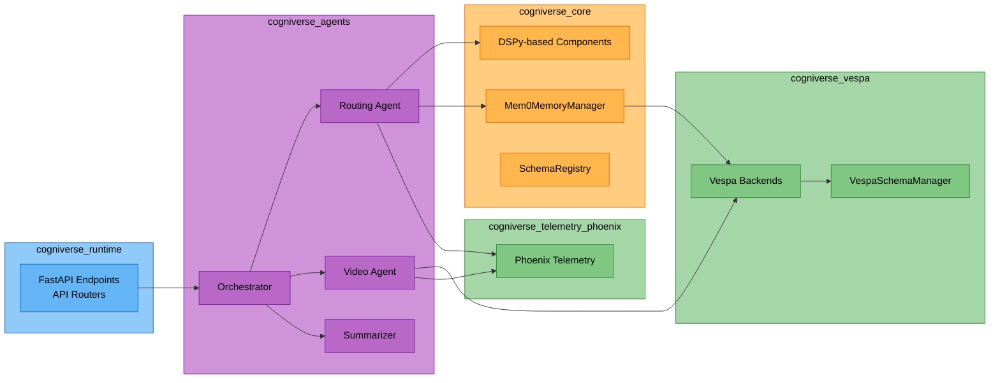
```mermaid
flowchart LR
    subgraph Runtime[<span style='color:#000'>cogniverse_runtime</span>]
        API[<span style='color:#000'>FastAPI Endpoints<br/>API Routers</span>]
    end

    subgraph AgentsPkg[<span style='color:#000'>cogniverse_agents</span>]
        ORC[<span style='color:#000'>Orchestrator</span>]
        RT[<span style='color:#000'>Routing Agent</span>]
        VA[<span style='color:#000'>Video Agent</span>]
        SUM[<span style='color:#000'>Summarizer</span>]
    end

    subgraph CorePkg[<span style='color:#000'>cogniverse_core</span>]
        DSPy[<span style='color:#000'>DSPy-based Components</span>]
        Memory[<span style='color:#000'>Mem0MemoryManager</span>]
        SchemaReg[<span style='color:#000'>SchemaRegistry</span>]
    end

    subgraph TelemetryPkg[<span style='color:#000'>cogniverse_telemetry_phoenix</span>]
        Phoenix[<span style='color:#000'>Phoenix Telemetry</span>]
    end

    subgraph VespaPkg[<span style='color:#000'>cogniverse_vespa</span>]
        SchemaMgr[<span style='color:#000'>VespaSchemaManager</span>]
        VespaBackend[<span style='color:#000'>Vespa Backends</span>]
    end

    API --> ORC
    ORC --> RT
    ORC --> VA
    ORC --> SUM

    RT --> DSPy
    RT --> Memory
    RT --> Phoenix

    VA --> VespaBackend
    VA --> Phoenix

    VespaBackend --> SchemaMgr
    Memory --> VespaBackend

    style Runtime fill:#90caf9,stroke:#1565c0,color:#000
    style API fill:#64b5f6,stroke:#1565c0,color:#000
    style AgentsPkg fill:#ce93d8,stroke:#7b1fa2,color:#000
    style ORC fill:#ba68c8,stroke:#7b1fa2,color:#000
    style RT fill:#ba68c8,stroke:#7b1fa2,color:#000
    style VA fill:#ba68c8,stroke:#7b1fa2,color:#000
    style SUM fill:#ba68c8,stroke:#7b1fa2,color:#000
    style CorePkg fill:#ffcc80,stroke:#ef6c00,color:#000
    style DSPy fill:#ffb74d,stroke:#ef6c00,color:#000
    style Memory fill:#ffb74d,stroke:#ef6c00,color:#000
    style SchemaReg fill:#ffb74d,stroke:#ef6c00,color:#000
    style TelemetryPkg fill:#a5d6a7,stroke:#388e3c,color:#000
    style Phoenix fill:#81c784,stroke:#388e3c,color:#000
    style VespaPkg fill:#a5d6a7,stroke:#388e3c,color:#000
    style SchemaMgr fill:#81c784,stroke:#388e3c,color:#000
    style VespaBackend fill:#81c784,stroke:#388e3c,color:#000
```

---

## Query Processing Flows

### Scenario 1: Simple Video Search with Tenant Context

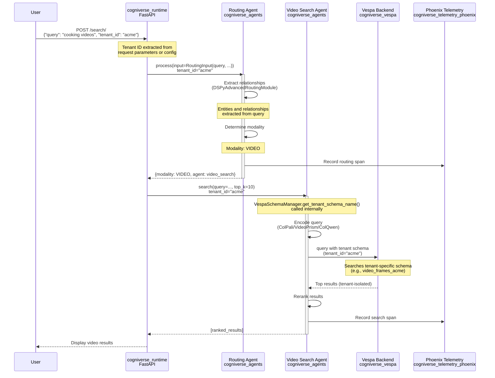
```mermaid
sequenceDiagram
    participant User
    participant Runtime as cogniverse_runtime<br/>FastAPI
    participant Routing as Routing Agent<br/>cogniverse_agents
    participant VideoAgent as Video Search Agent<br/>cogniverse_agents
    participant Vespa as Vespa Backend<br/>cogniverse_vespa
    participant Phoenix as Phoenix Telemetry<br/>cogniverse_telemetry_phoenix

    User->>Runtime: POST /search/<br/>{"query": "cooking videos", "tenant_id": "acme"}

    Note over Runtime: Tenant ID extracted from<br/>request parameters or config

    Runtime->>Routing: process(input=RoutingInput(query, ...))<br/>tenant_id="acme"

    activate Routing
    Routing->>Routing: Extract relationships<br/>(DSPyAdvancedRoutingModule)
    Note over Routing: Entities and relationships<br/>extracted from query
    Routing->>Routing: Determine modality
    Note over Routing: Modality: VIDEO
    Routing->>Phoenix: Record routing span
    Routing-->>Runtime: {modality: VIDEO, agent: video_search}
    deactivate Routing

    Runtime->>VideoAgent: search(query=..., top_k=10)<br/>tenant_id="acme"

    activate VideoAgent
    Note over VideoAgent: VespaSchemaManager.get_tenant_schema_name()<br/>called internally
    VideoAgent->>VideoAgent: Encode query<br/>(ColPali/VideoPrism/ColQwen)
    VideoAgent->>Vespa: query with tenant schema<br/>(tenant_id="acme")
    Note over Vespa: Searches tenant-specific schema<br/>(e.g., video_frames_acme)
    Vespa-->>VideoAgent: Top results (tenant-isolated)
    VideoAgent->>VideoAgent: Rerank results
    VideoAgent->>Phoenix: Record search span
    VideoAgent-->>Runtime: [ranked_results]
    deactivate VideoAgent

    Runtime-->>User: Display video results
```

### Scenario 2: Multi-Modal Query with Fusion

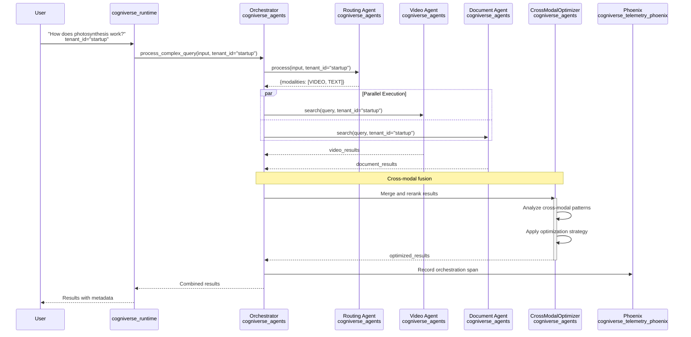
```mermaid
sequenceDiagram
    participant User
    participant Runtime as cogniverse_runtime
    participant Orchestrator as Orchestrator<br/>cogniverse_agents
    participant Routing as Routing Agent<br/>cogniverse_agents
    participant VideoAgent as Video Agent<br/>cogniverse_agents
    participant DocumentAgent as Document Agent<br/>cogniverse_agents
    participant Fusion as CrossModalOptimizer<br/>cogniverse_agents
    participant Phoenix as Phoenix<br/>cogniverse_telemetry_phoenix

    User->>Runtime: "How does photosynthesis work?"<br/>tenant_id="startup"

    Runtime->>Orchestrator: process_complex_query(input, tenant_id="startup")
    Orchestrator->>Routing: process(input, tenant_id="startup")
    Routing-->>Orchestrator: {modalities: [VIDEO, TEXT]}

    par Parallel Execution
        Orchestrator->>VideoAgent: search(query, tenant_id="startup")
        and
        Orchestrator->>DocumentAgent: search(query, tenant_id="startup")
    end

    VideoAgent-->>Orchestrator: video_results
    DocumentAgent-->>Orchestrator: document_results

    Note over Orchestrator,Fusion: Cross-modal fusion
    Orchestrator->>Fusion: Merge and rerank results
    activate Fusion
    Fusion->>Fusion: Analyze cross-modal patterns
    Fusion->>Fusion: Apply optimization strategy
    Fusion-->>Orchestrator: optimized_results
    deactivate Fusion

    Orchestrator->>Phoenix: Record orchestration span
    Orchestrator-->>Runtime: Combined results
    Runtime-->>User: Results with metadata
```

### Scenario 3: Memory-Enhanced Routing

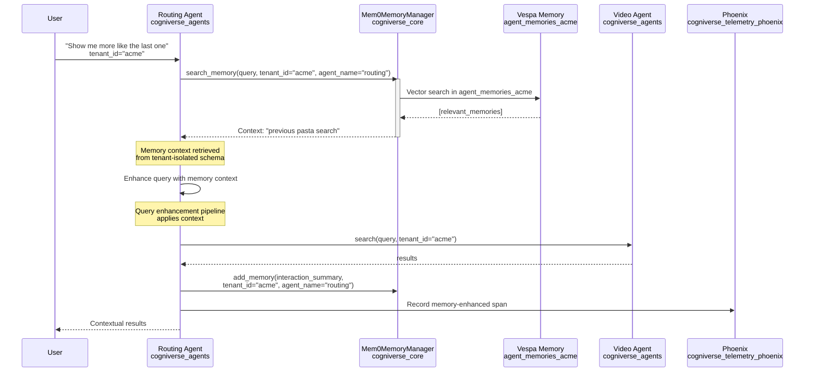
```mermaid
sequenceDiagram
    participant User
    participant Routing as Routing Agent<br/>cogniverse_agents
    participant Memory as Mem0MemoryManager<br/>cogniverse_core
    participant Vespa as Vespa Memory<br/>agent_memories_acme
    participant VideoAgent as Video Agent<br/>cogniverse_agents
    participant Phoenix as Phoenix<br/>cogniverse_telemetry_phoenix

    User->>Routing: "Show me more like the last one"<br/>tenant_id="acme"

    Routing->>Memory: search_memory(query, tenant_id="acme", agent_name="routing")
    activate Memory
    Memory->>Vespa: Vector search in agent_memories_acme
    Vespa-->>Memory: [relevant_memories]
    Memory-->>Routing: Context: "previous pasta search"
    deactivate Memory

    Note over Routing: Memory context retrieved<br/>from tenant-isolated schema

    Routing->>Routing: Enhance query with memory context
    Note over Routing: Query enhancement pipeline<br/>applies context

    Routing->>VideoAgent: search(query, tenant_id="acme")
    VideoAgent-->>Routing: results

    Routing->>Memory: add_memory(interaction_summary,<br/>tenant_id="acme", agent_name="routing")
    Routing->>Phoenix: Record memory-enhanced span

    Routing-->>User: Contextual results
```

---

## Agent Orchestration Flows

### Scenario 4: Complex Multi-Agent Workflow with SDK Packages

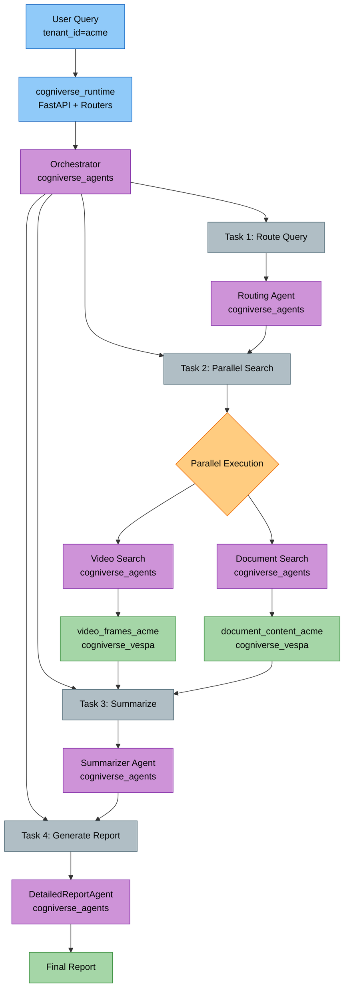
```mermaid
flowchart TB
    Start[<span style='color:#000'>User Query<br/>tenant_id=acme</span>] --> Runtime[<span style='color:#000'>cogniverse_runtime<br/>FastAPI + Routers</span>]

    Runtime --> Orchestrator[<span style='color:#000'>Orchestrator<br/>cogniverse_agents</span>]

    Orchestrator --> T1[<span style='color:#000'>Task 1: Route Query</span>]
    Orchestrator --> T2[<span style='color:#000'>Task 2: Parallel Search</span>]
    Orchestrator --> T3[<span style='color:#000'>Task 3: Summarize</span>]
    Orchestrator --> T4[<span style='color:#000'>Task 4: Generate Report</span>]

    T1 --> Routing[<span style='color:#000'>Routing Agent<br/>cogniverse_agents</span>]
    Routing --> T2

    T2 --> ParallelBlock{<span style='color:#000'>Parallel Execution</span>}
    ParallelBlock --> Video[<span style='color:#000'>Video Search<br/>cogniverse_agents</span>]
    ParallelBlock --> Document[<span style='color:#000'>Document Search<br/>cogniverse_agents</span>]

    Video --> VespaV[<span style='color:#000'>video_frames_acme<br/>cogniverse_vespa</span>]
    Document --> VespaT[<span style='color:#000'>document_content_acme<br/>cogniverse_vespa</span>]

    VespaV --> T3
    VespaT --> T3

    T3 --> Summarizer[<span style='color:#000'>Summarizer Agent<br/>cogniverse_agents</span>]
    Summarizer --> T4

    T4 --> Reporter[<span style='color:#000'>DetailedReportAgent<br/>cogniverse_agents</span>]
    Reporter --> Result[<span style='color:#000'>Final Report</span>]

    style Start fill:#90caf9,stroke:#1565c0,color:#000
    style Runtime fill:#90caf9,stroke:#1565c0,color:#000
    style Orchestrator fill:#ce93d8,stroke:#7b1fa2,color:#000
    style T1 fill:#b0bec5,stroke:#546e7a,color:#000
    style T2 fill:#b0bec5,stroke:#546e7a,color:#000
    style T3 fill:#b0bec5,stroke:#546e7a,color:#000
    style T4 fill:#b0bec5,stroke:#546e7a,color:#000
    style Routing fill:#ce93d8,stroke:#7b1fa2,color:#000
    style ParallelBlock fill:#ffcc80,stroke:#ef6c00,color:#000
    style Video fill:#ce93d8,stroke:#7b1fa2,color:#000
    style Document fill:#ce93d8,stroke:#7b1fa2,color:#000
    style VespaV fill:#a5d6a7,stroke:#388e3c,color:#000
    style VespaT fill:#a5d6a7,stroke:#388e3c,color:#000
    style Summarizer fill:#ce93d8,stroke:#7b1fa2,color:#000
    style Reporter fill:#ce93d8,stroke:#7b1fa2,color:#000
    style Result fill:#a5d6a7,stroke:#388e3c,color:#000
```

### Scenario 5: Task Dependency Resolution

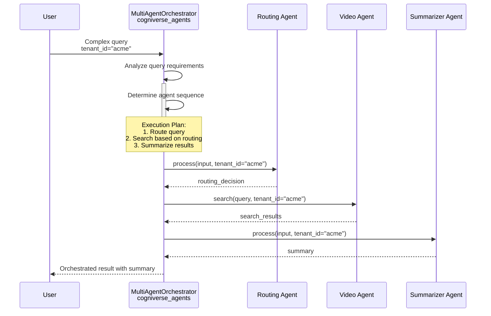
```mermaid
sequenceDiagram
    participant User
    participant Orchestrator as MultiAgentOrchestrator<br/>cogniverse_agents
    participant Routing as Routing Agent
    participant VideoAgent as Video Agent
    participant Summarizer as Summarizer Agent

    User->>Orchestrator: Complex query<br/>tenant_id="acme"

    Orchestrator->>Orchestrator: Analyze query requirements
    activate Orchestrator
    Orchestrator->>Orchestrator: Determine agent sequence
    Note over Orchestrator: Execution Plan:<br/>1. Route query<br/>2. Search based on routing<br/>3. Summarize results
    deactivate Orchestrator

    Orchestrator->>Routing: process(input, tenant_id="acme")
    Routing-->>Orchestrator: routing_decision

    Orchestrator->>VideoAgent: search(query, tenant_id="acme")
    VideoAgent-->>Orchestrator: search_results

    Orchestrator->>Summarizer: process(input, tenant_id="acme")
    Summarizer-->>Orchestrator: summary

    Orchestrator-->>User: Orchestrated result with summary
```

### Scenario 6: Agent-to-Agent Communication (A2A Protocol)

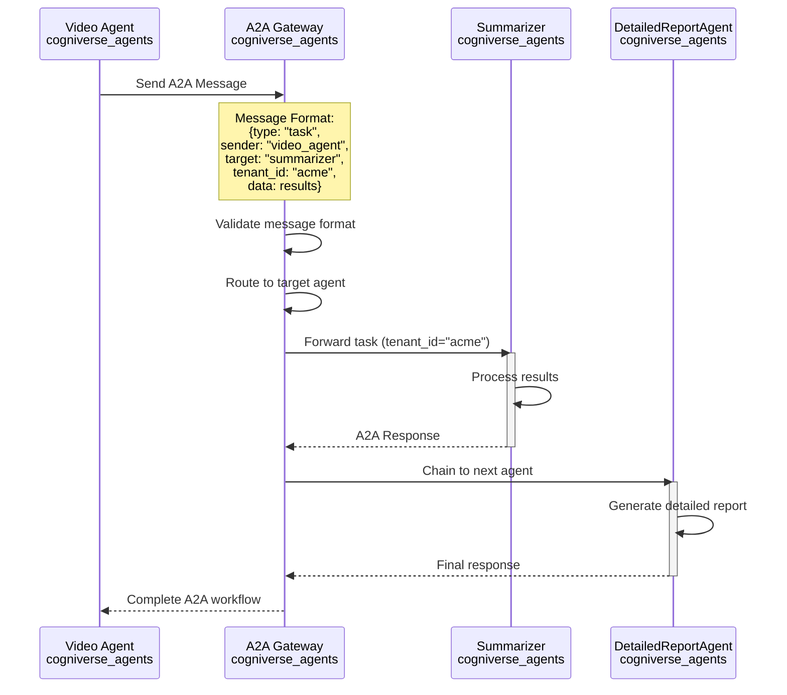
```mermaid
sequenceDiagram
    participant VideoAgent as Video Agent<br/>cogniverse_agents
    participant Gateway as A2A Gateway<br/>cogniverse_agents
    participant Summarizer as Summarizer<br/>cogniverse_agents
    participant ReportAgent as DetailedReportAgent<br/>cogniverse_agents

    VideoAgent->>Gateway: Send A2A Message
    Note over Gateway: Message Format:<br/>{type: "task",<br/>sender: "video_agent",<br/>target: "summarizer",<br/>tenant_id: "acme",<br/>data: results}

    Gateway->>Gateway: Validate message format
    Gateway->>Gateway: Route to target agent

    Gateway->>Summarizer: Forward task (tenant_id="acme")

    activate Summarizer
    Summarizer->>Summarizer: Process results
    Summarizer-->>Gateway: A2A Response
    deactivate Summarizer

    Gateway->>ReportAgent: Chain to next agent
    activate ReportAgent
    ReportAgent->>ReportAgent: Generate detailed report
    ReportAgent-->>Gateway: Final response
    deactivate ReportAgent

    Gateway-->>VideoAgent: Complete A2A workflow
```

---

## Multi-Tenant Flows

### Scenario 7: Tenant Schema Lifecycle

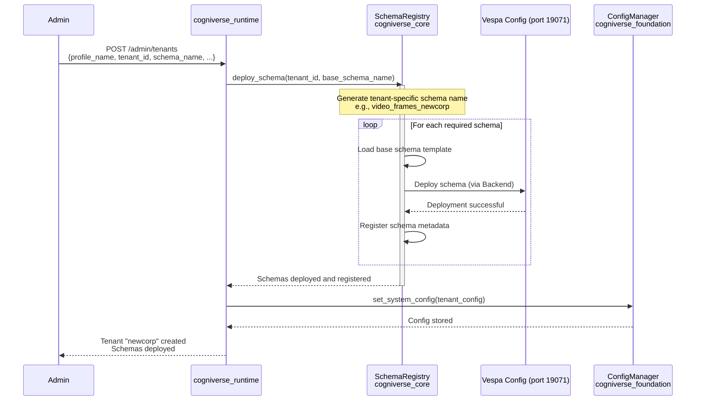
```mermaid
sequenceDiagram
    participant Admin
    participant Runtime as cogniverse_runtime
    participant SchemaReg as SchemaRegistry<br/>cogniverse_core
    participant Vespa as Vespa Config (port 19071)
    participant ConfigMgr as ConfigManager<br/>cogniverse_foundation

    Admin->>Runtime: POST /admin/tenants<br/>{profile_name, tenant_id, schema_name, ...}

    Runtime->>SchemaReg: deploy_schema(tenant_id, base_schema_name)

    activate SchemaReg
    Note over SchemaReg: Generate tenant-specific schema name<br/>e.g., video_frames_newcorp

    loop For each required schema
        SchemaReg->>SchemaReg: Load base schema template
        SchemaReg->>Vespa: Deploy schema (via Backend)
        Vespa-->>SchemaReg: Deployment successful
        SchemaReg->>SchemaReg: Register schema metadata
    end

    SchemaReg-->>Runtime: Schemas deployed and registered
    deactivate SchemaReg

    Runtime->>ConfigMgr: set_system_config(tenant_config)
    ConfigMgr-->>Runtime: Config stored

    Runtime-->>Admin: Tenant "newcorp" created<br/>Schemas deployed
```

### Scenario 8: Multi-Tenant Request Isolation

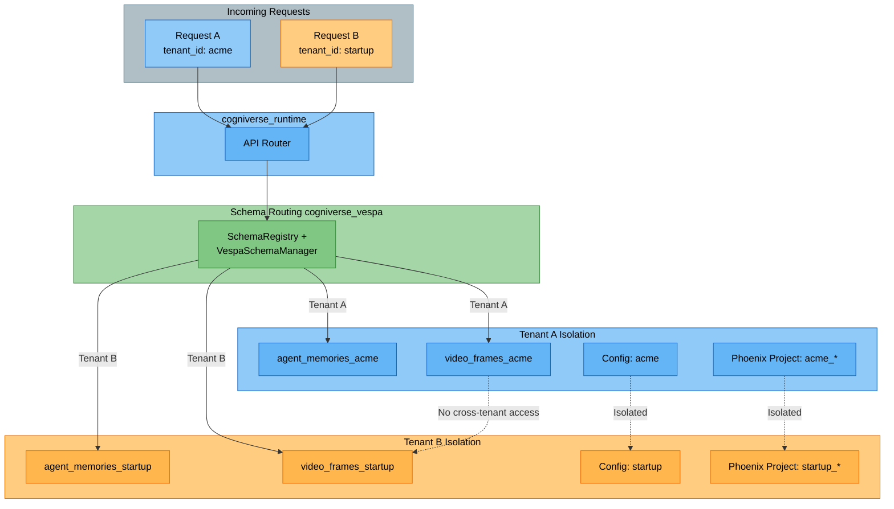
```mermaid
flowchart TB
    subgraph Incoming[<span style='color:#000'>Incoming Requests</span>]
        ReqA[<span style='color:#000'>Request A<br/>tenant_id: acme</span>]
        ReqB[<span style='color:#000'>Request B<br/>tenant_id: startup</span>]
    end

    subgraph RuntimePkg[<span style='color:#000'>cogniverse_runtime</span>]
        Router[<span style='color:#000'>API Router</span>]
    end

    subgraph VespaPkg[<span style='color:#000'>Schema Routing cogniverse_vespa</span>]
        SchemaMgr[<span style='color:#000'>SchemaRegistry +<br/>VespaSchemaManager</span>]
    end

    subgraph TenantA[<span style='color:#000'>Tenant A Isolation</span>]
        SchemaA1[<span style='color:#000'>video_frames_acme</span>]
        SchemaA2[<span style='color:#000'>agent_memories_acme</span>]
        ConfigA[<span style='color:#000'>Config: acme</span>]
        PhoenixA[<span style='color:#000'>Phoenix Project: acme_*</span>]
    end

    subgraph TenantB[<span style='color:#000'>Tenant B Isolation</span>]
        SchemaB1[<span style='color:#000'>video_frames_startup</span>]
        SchemaB2[<span style='color:#000'>agent_memories_startup</span>]
        ConfigB[<span style='color:#000'>Config: startup</span>]
        PhoenixB[<span style='color:#000'>Phoenix Project: startup_*</span>]
    end

    ReqA --> Router
    ReqB --> Router

    Router --> SchemaMgr

    SchemaMgr -->|Tenant A| SchemaA1
    SchemaMgr -->|Tenant A| SchemaA2
    SchemaMgr -->|Tenant B| SchemaB1
    SchemaMgr -->|Tenant B| SchemaB2

    SchemaA1 -.->|No cross-tenant access| SchemaB1
    ConfigA -.->|Isolated| ConfigB
    PhoenixA -.->|Isolated| PhoenixB

    style Incoming fill:#b0bec5,stroke:#546e7a,color:#000
    style ReqA fill:#90caf9,stroke:#1565c0,color:#000
    style ReqB fill:#ffcc80,stroke:#ef6c00,color:#000
    style RuntimePkg fill:#90caf9,stroke:#1565c0,color:#000
    style Router fill:#64b5f6,stroke:#1565c0,color:#000
    style VespaPkg fill:#a5d6a7,stroke:#388e3c,color:#000
    style SchemaMgr fill:#81c784,stroke:#388e3c,color:#000
    style TenantA fill:#90caf9,stroke:#1565c0,color:#000
    style SchemaA1 fill:#64b5f6,stroke:#1565c0,color:#000
    style SchemaA2 fill:#64b5f6,stroke:#1565c0,color:#000
    style ConfigA fill:#64b5f6,stroke:#1565c0,color:#000
    style PhoenixA fill:#64b5f6,stroke:#1565c0,color:#000
    style TenantB fill:#ffcc80,stroke:#ef6c00,color:#000
    style SchemaB1 fill:#ffb74d,stroke:#ef6c00,color:#000
    style SchemaB2 fill:#ffb74d,stroke:#ef6c00,color:#000
    style ConfigB fill:#ffb74d,stroke:#ef6c00,color:#000
    style PhoenixB fill:#ffb74d,stroke:#ef6c00,color:#000
```

### Scenario 9: Tenant Memory Isolation

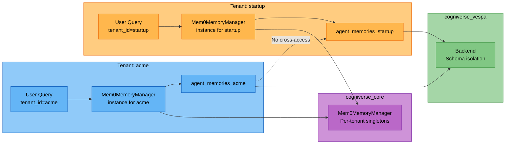
```mermaid
flowchart LR
    subgraph TenantAcme[<span style='color:#000'>Tenant: acme</span>]
        UserA[<span style='color:#000'>User Query<br/>tenant_id=acme</span>]
        MemA[<span style='color:#000'>Mem0MemoryManager<br/>instance for acme</span>]
        SchemaA[<span style='color:#000'>agent_memories_acme</span>]
    end

    subgraph TenantStartup[<span style='color:#000'>Tenant: startup</span>]
        UserB[<span style='color:#000'>User Query<br/>tenant_id=startup</span>]
        MemB[<span style='color:#000'>Mem0MemoryManager<br/>instance for startup</span>]
        SchemaB[<span style='color:#000'>agent_memories_startup</span>]
    end

    subgraph CorePkg[<span style='color:#000'>cogniverse_core</span>]
        MemSingleton[<span style='color:#000'>Mem0MemoryManager<br/>Per-tenant singletons</span>]
    end

    subgraph VespaPkg[<span style='color:#000'>cogniverse_vespa</span>]
        VespaCore[<span style='color:#000'>Backend<br/>Schema isolation</span>]
    end

    UserA --> MemA
    UserB --> MemB

    MemA --> MemSingleton
    MemB --> MemSingleton

    MemA --> SchemaA
    MemB --> SchemaB

    SchemaA --> VespaCore
    SchemaB --> VespaCore

    SchemaA -.->|No cross-access| SchemaB

    style TenantAcme fill:#90caf9,stroke:#1565c0,color:#000
    style UserA fill:#64b5f6,stroke:#1565c0,color:#000
    style MemA fill:#64b5f6,stroke:#1565c0,color:#000
    style SchemaA fill:#64b5f6,stroke:#1565c0,color:#000
    style TenantStartup fill:#ffcc80,stroke:#ef6c00,color:#000
    style UserB fill:#ffb74d,stroke:#ef6c00,color:#000
    style MemB fill:#ffb74d,stroke:#ef6c00,color:#000
    style SchemaB fill:#ffb74d,stroke:#ef6c00,color:#000
    style CorePkg fill:#ce93d8,stroke:#7b1fa2,color:#000
    style MemSingleton fill:#ba68c8,stroke:#7b1fa2,color:#000
    style VespaPkg fill:#a5d6a7,stroke:#388e3c,color:#000
    style VespaCore fill:#81c784,stroke:#388e3c,color:#000
```

---

## Optimization & Learning Flows

### Scenario 10: GRPO Optimization Cycle with Packages

```mermaid
flowchart TB
    Start[<span style='color:#000'>Query Execution<br/>tenant_id=acme</span>] --> Telemetry[<span style='color:#000'>Phoenix Records Spans<br/>cogniverse_telemetry_phoenix</span>]

    Telemetry --> SpanEval[<span style='color:#000'>Span Evaluator<br/>cogniverse_evaluation</span>]

    SpanEval --> Extract{<span style='color:#000'>Extract Experiences<br/>per tenant</span>}
    Extract --> Quality[<span style='color:#000'>Quality Signals</span>]
    Extract --> Latency[<span style='color:#000'>Latency Metrics</span>]
    Extract --> UserFeedback[<span style='color:#000'>User Feedback</span>]

    Quality --> GRPO[<span style='color:#000'>AdvancedRoutingOptimizer<br/>(GRPO-based)<br/>cogniverse_agents</span>]
    Latency --> GRPO
    UserFeedback --> GRPO

    GRPO --> UpdateDSPy[<span style='color:#000'>Update DSPy Module<br/>cogniverse_agents</span>]
    UpdateDSPy --> NewModel[<span style='color:#000'>Optimized Routing Model<br/>tenant-specific</span>]

    NewModel --> Deploy[<span style='color:#000'>Deploy to Routing Agent<br/>cogniverse_agents</span>]
    Deploy --> Monitor[<span style='color:#000'>Monitor Performance<br/>cogniverse_telemetry_phoenix</span>]

    Monitor --> Telemetry

    style Start fill:#90caf9,stroke:#1565c0,color:#000
    style Telemetry fill:#a5d6a7,stroke:#388e3c,color:#000
    style SpanEval fill:#a5d6a7,stroke:#388e3c,color:#000
    style Extract fill:#ffcc80,stroke:#ef6c00,color:#000
    style Quality fill:#ffcc80,stroke:#ef6c00,color:#000
    style Latency fill:#ffcc80,stroke:#ef6c00,color:#000
    style UserFeedback fill:#90caf9,stroke:#1565c0,color:#000
    style GRPO fill:#ffcc80,stroke:#ef6c00,color:#000
    style UpdateDSPy fill:#81d4fa,stroke:#0288d1,color:#000
    style NewModel fill:#81d4fa,stroke:#0288d1,color:#000
    style Deploy fill:#ce93d8,stroke:#7b1fa2,color:#000
    style Monitor fill:#a5d6a7,stroke:#388e3c,color:#000
```

### Scenario 11: Experience Collection & Optimization

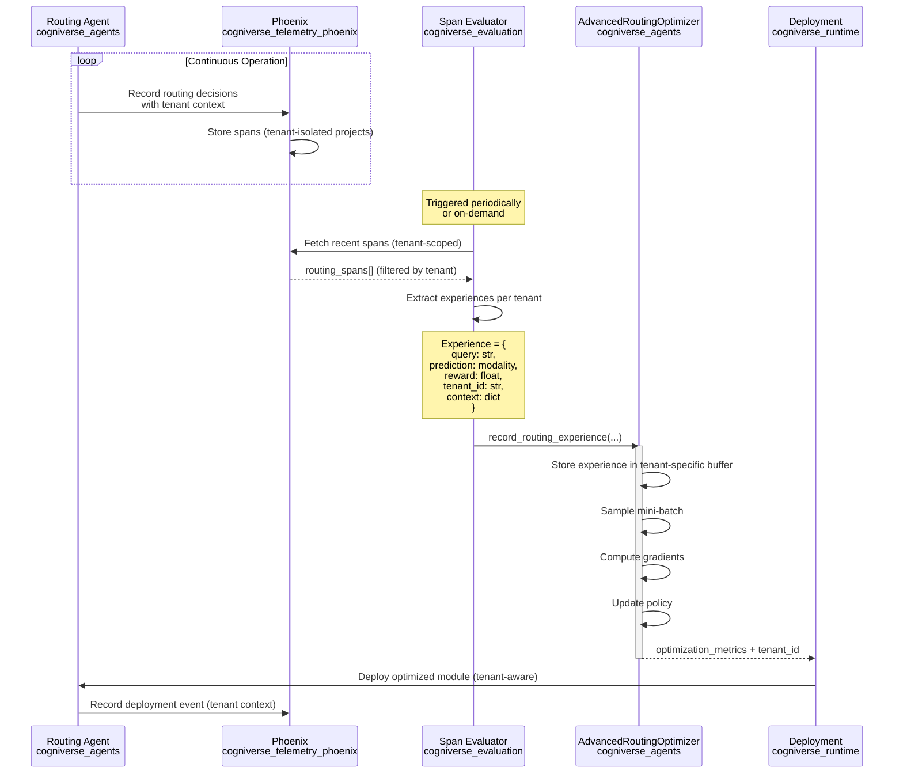
```mermaid
sequenceDiagram
    participant Routing as Routing Agent<br/>cogniverse_agents
    participant Phoenix as Phoenix<br/>cogniverse_telemetry_phoenix
    participant SpanEval as Span Evaluator<br/>cogniverse_evaluation
    participant GRPO as AdvancedRoutingOptimizer<br/>cogniverse_agents
    participant Deploy as Deployment<br/>cogniverse_runtime

    loop Continuous Operation
        Routing->>Phoenix: Record routing decisions<br/>with tenant context
        Phoenix->>Phoenix: Store spans (tenant-isolated projects)
    end

    Note over SpanEval: Triggered periodically<br/>or on-demand

    SpanEval->>Phoenix: Fetch recent spans (tenant-scoped)
    Phoenix-->>SpanEval: routing_spans[] (filtered by tenant)

    SpanEval->>SpanEval: Extract experiences per tenant
    Note over SpanEval: Experience = {<br/>  query: str,<br/>  prediction: modality,<br/>  reward: float,<br/>  tenant_id: str,<br/>  context: dict<br/>}

    SpanEval->>GRPO: record_routing_experience(...)

    activate GRPO
    GRPO->>GRPO: Store experience in tenant-specific buffer
    GRPO->>GRPO: Sample mini-batch
    GRPO->>GRPO: Compute gradients
    GRPO->>GRPO: Update policy
    GRPO-->>Deploy: optimization_metrics + tenant_id
    deactivate GRPO

    Deploy->>Routing: Deploy optimized module (tenant-aware)
    Routing->>Phoenix: Record deployment event (tenant context)
```

### Scenario 12: Cross-Modal Optimization

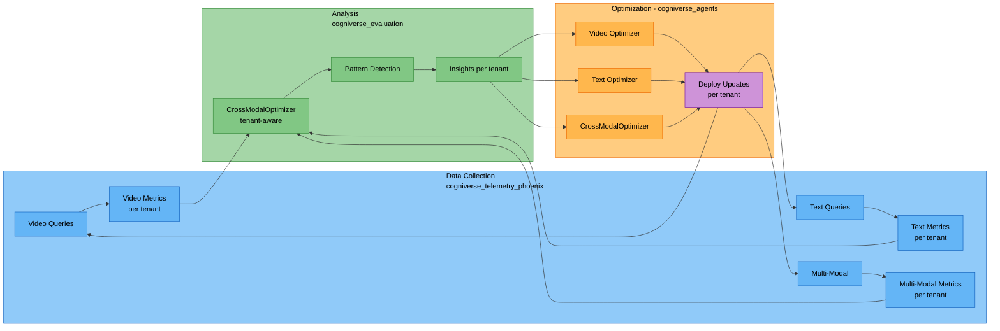
```mermaid
flowchart LR
    subgraph DataCollection[<span style='color:#000'>Data Collection<br/>cogniverse_telemetry_phoenix</span>]
        V[<span style='color:#000'>Video Queries</span>] --> VMetrics[<span style='color:#000'>Video Metrics<br/>per tenant</span>]
        T[<span style='color:#000'>Text Queries</span>] --> TMetrics[<span style='color:#000'>Text Metrics<br/>per tenant</span>]
        M[<span style='color:#000'>Multi-Modal</span>] --> MMetrics[<span style='color:#000'>Multi-Modal Metrics<br/>per tenant</span>]
    end

    subgraph Analysis[<span style='color:#000'>Analysis<br/>cogniverse_evaluation</span>]
        VMetrics --> Analyzer[<span style='color:#000'>CrossModalOptimizer<br/>tenant-aware</span>]
        TMetrics --> Analyzer
        MMetrics --> Analyzer

        Analyzer --> Patterns[<span style='color:#000'>Pattern Detection</span>]
        Patterns --> Insights[<span style='color:#000'>Insights per tenant</span>]
    end

    subgraph Optimization[<span style='color:#000'>Optimization - cogniverse_agents</span>]
        Insights --> VidOpt[<span style='color:#000'>Video Optimizer</span>]
        Insights --> TextOpt[<span style='color:#000'>Text Optimizer</span>]
        Insights --> FusionOpt[<span style='color:#000'>CrossModalOptimizer</span>]

        VidOpt --> Deploy[<span style='color:#000'>Deploy Updates<br/>per tenant</span>]
        TextOpt --> Deploy
        FusionOpt --> Deploy
    end

    Deploy --> V
    Deploy --> T
    Deploy --> M

    style DataCollection fill:#90caf9,stroke:#1565c0,color:#000
    style V fill:#64b5f6,stroke:#1565c0,color:#000
    style T fill:#64b5f6,stroke:#1565c0,color:#000
    style M fill:#64b5f6,stroke:#1565c0,color:#000
    style VMetrics fill:#64b5f6,stroke:#1565c0,color:#000
    style TMetrics fill:#64b5f6,stroke:#1565c0,color:#000
    style MMetrics fill:#64b5f6,stroke:#1565c0,color:#000
    style Analysis fill:#a5d6a7,stroke:#388e3c,color:#000
    style Analyzer fill:#81c784,stroke:#388e3c,color:#000
    style Patterns fill:#81c784,stroke:#388e3c,color:#000
    style Insights fill:#81c784,stroke:#388e3c,color:#000
    style Optimization fill:#ffcc80,stroke:#ef6c00,color:#000
    style VidOpt fill:#ffb74d,stroke:#ef6c00,color:#000
    style TextOpt fill:#ffb74d,stroke:#ef6c00,color:#000
    style FusionOpt fill:#ffb74d,stroke:#ef6c00,color:#000
    style Deploy fill:#ce93d8,stroke:#7b1fa2,color:#000
```

---

## Evaluation & Experiment Flows

### Scenario 13: Phoenix Experiment Workflow

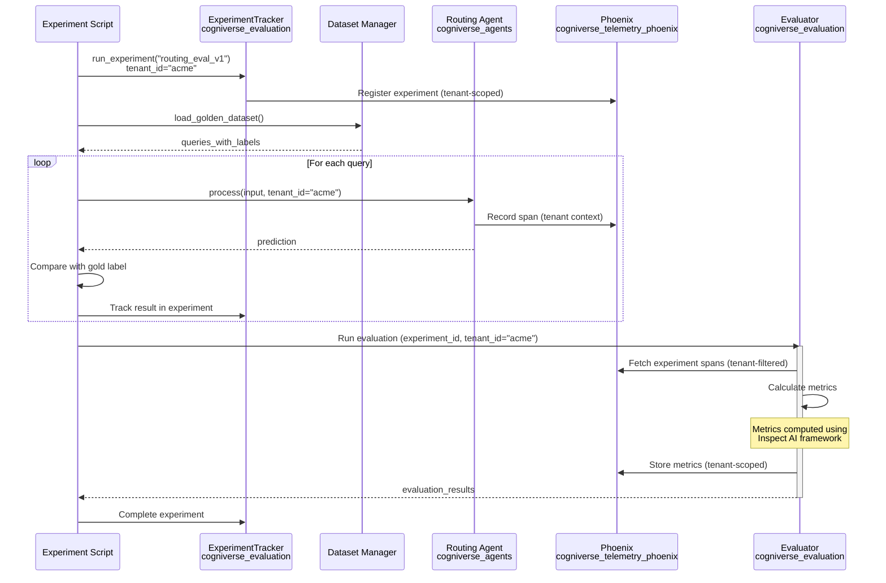
```mermaid
sequenceDiagram
    participant Script as Experiment Script
    participant Tracker as ExperimentTracker<br/>cogniverse_evaluation
    participant Dataset as Dataset Manager
    participant Routing as Routing Agent<br/>cogniverse_agents
    participant Phoenix as Phoenix<br/>cogniverse_telemetry_phoenix
    participant Eval as Evaluator<br/>cogniverse_evaluation

    Script->>Tracker: run_experiment("routing_eval_v1")<br/>tenant_id="acme"
    Tracker->>Phoenix: Register experiment (tenant-scoped)

    Script->>Dataset: load_golden_dataset()
    Dataset-->>Script: queries_with_labels

    loop For each query
        Script->>Routing: process(input, tenant_id="acme")
        Routing->>Phoenix: Record span (tenant context)
        Routing-->>Script: prediction

        Script->>Script: Compare with gold label
        Script->>Tracker: Track result in experiment
    end

    Script->>Eval: Run evaluation (experiment_id, tenant_id="acme")

    activate Eval
    Eval->>Phoenix: Fetch experiment spans (tenant-filtered)
    Eval->>Eval: Calculate metrics
    Note over Eval: Metrics computed using<br/>Inspect AI framework
    Eval->>Phoenix: Store metrics (tenant-scoped)
    Eval-->>Script: evaluation_results
    deactivate Eval

    Script->>Tracker: Complete experiment
```

### Scenario 14: Routing Evaluator Integration

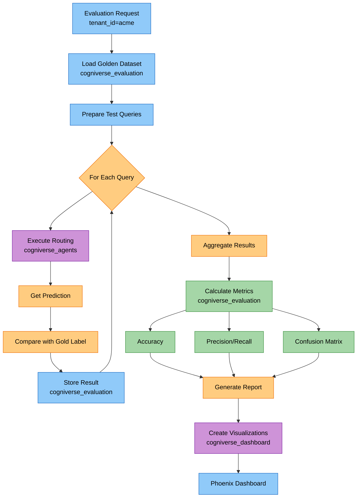
```mermaid
flowchart TB
    Start[<span style='color:#000'>Evaluation Request<br/>tenant_id=acme</span>] --> LoadDataset[<span style='color:#000'>Load Golden Dataset<br/>cogniverse_evaluation</span>]
    LoadDataset --> PrepQueries[<span style='color:#000'>Prepare Test Queries</span>]

    PrepQueries --> Loop{<span style='color:#000'>For Each Query</span>}

    Loop --> Execute[<span style='color:#000'>Execute Routing<br/>cogniverse_agents</span>]
    Execute --> Predict[<span style='color:#000'>Get Prediction</span>]
    Predict --> Compare[<span style='color:#000'>Compare with Gold Label</span>]

    Compare --> StoreResult[<span style='color:#000'>Store Result<br/>cogniverse_evaluation</span>]
    StoreResult --> Loop

    Loop --> Aggregate[<span style='color:#000'>Aggregate Results</span>]

    Aggregate --> CalcMetrics[<span style='color:#000'>Calculate Metrics<br/>cogniverse_evaluation</span>]
    CalcMetrics --> Accuracy[<span style='color:#000'>Accuracy</span>]
    CalcMetrics --> Precision[<span style='color:#000'>Precision/Recall</span>]
    CalcMetrics --> Confusion[<span style='color:#000'>Confusion Matrix</span>]

    Accuracy --> Report[<span style='color:#000'>Generate Report</span>]
    Precision --> Report
    Confusion --> Report

    Report --> Visualize[<span style='color:#000'>Create Visualizations<br/>cogniverse_dashboard</span>]
    Visualize --> Dashboard[<span style='color:#000'>Phoenix Dashboard</span>]

    style Start fill:#90caf9,stroke:#1565c0,color:#000
    style LoadDataset fill:#90caf9,stroke:#1565c0,color:#000
    style PrepQueries fill:#90caf9,stroke:#1565c0,color:#000
    style Loop fill:#ffcc80,stroke:#ef6c00,color:#000
    style Execute fill:#ce93d8,stroke:#7b1fa2,color:#000
    style Predict fill:#ffcc80,stroke:#ef6c00,color:#000
    style Compare fill:#ffcc80,stroke:#ef6c00,color:#000
    style StoreResult fill:#90caf9,stroke:#1565c0,color:#000
    style Aggregate fill:#ffcc80,stroke:#ef6c00,color:#000
    style CalcMetrics fill:#a5d6a7,stroke:#388e3c,color:#000
    style Accuracy fill:#a5d6a7,stroke:#388e3c,color:#000
    style Precision fill:#a5d6a7,stroke:#388e3c,color:#000
    style Confusion fill:#a5d6a7,stroke:#388e3c,color:#000
    style Report fill:#ffcc80,stroke:#ef6c00,color:#000
    style Visualize fill:#ce93d8,stroke:#7b1fa2,color:#000
    style Dashboard fill:#90caf9,stroke:#1565c0,color:#000
```

### Scenario 15: Quality Evaluator for Experiments

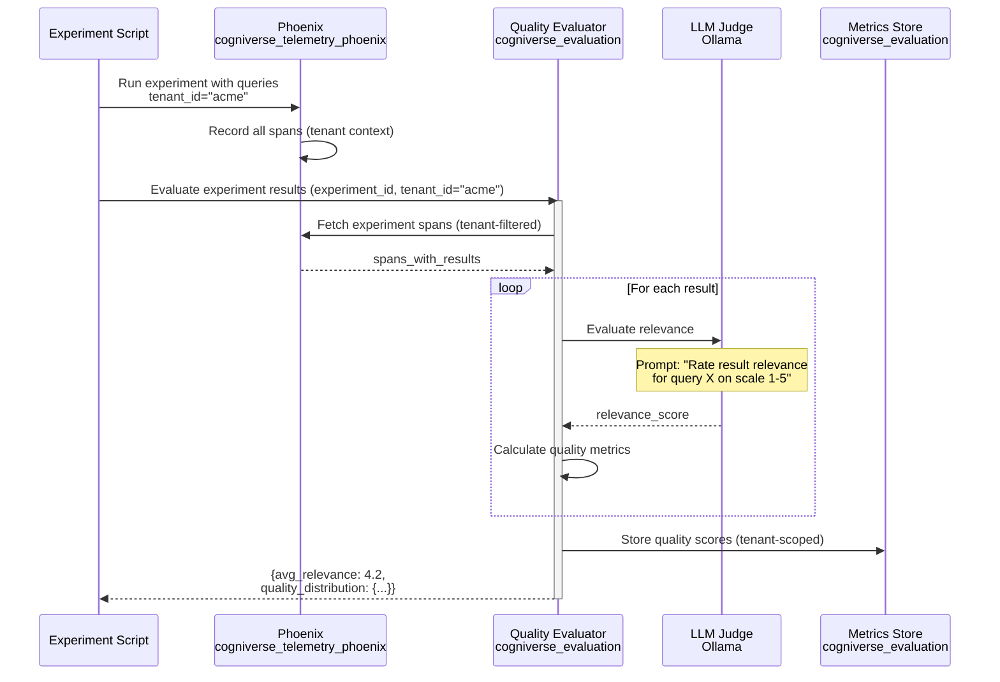
```mermaid
sequenceDiagram
    participant Exp as Experiment Script
    participant Phoenix as Phoenix<br/>cogniverse_telemetry_phoenix
    participant QualityEval as Quality Evaluator<br/>cogniverse_evaluation
    participant LLM as LLM Judge<br/>Ollama
    participant Metrics as Metrics Store<br/>cogniverse_evaluation

    Exp->>Phoenix: Run experiment with queries<br/>tenant_id="acme"
    Phoenix->>Phoenix: Record all spans (tenant context)

    Exp->>QualityEval: Evaluate experiment results (experiment_id, tenant_id="acme")

    activate QualityEval
    QualityEval->>Phoenix: Fetch experiment spans (tenant-filtered)
    Phoenix-->>QualityEval: spans_with_results

    loop For each result
        QualityEval->>LLM: Evaluate relevance
        Note over LLM: Prompt: "Rate result relevance<br/>for query X on scale 1-5"
        LLM-->>QualityEval: relevance_score

        QualityEval->>QualityEval: Calculate quality metrics
    end

    QualityEval->>Metrics: Store quality scores (tenant-scoped)
    QualityEval-->>Exp: {avg_relevance: 4.2,<br/>quality_distribution: {...}}
    deactivate QualityEval
```

---

## Memory & Context Flows

### Scenario 16: Conversation Memory Integration

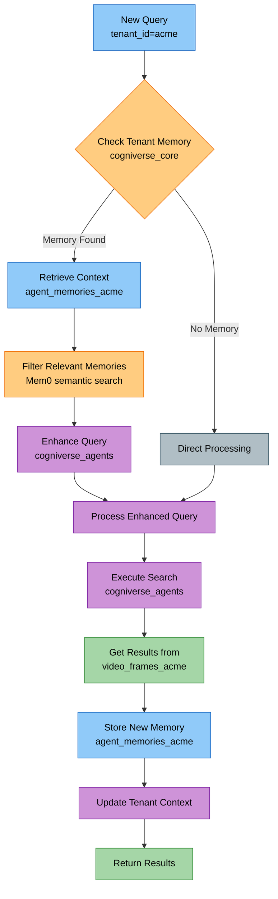
```mermaid
flowchart TB
    Query[<span style='color:#000'>New Query<br/>tenant_id=acme</span>] --> CheckMemory{<span style='color:#000'>Check Tenant Memory<br/>cogniverse_core</span>}

    CheckMemory -->|Memory Found| Retrieve[<span style='color:#000'>Retrieve Context<br/>agent_memories_acme</span>]
    CheckMemory -->|No Memory| Direct[<span style='color:#000'>Direct Processing</span>]

    Retrieve --> Relevant[<span style='color:#000'>Filter Relevant Memories<br/>Mem0 semantic search</span>]
    Relevant --> Enhance[<span style='color:#000'>Enhance Query<br/>cogniverse_agents</span>]

    Enhance --> Process[<span style='color:#000'>Process Enhanced Query</span>]
    Direct --> Process

    Process --> Execute[<span style='color:#000'>Execute Search<br/>cogniverse_agents</span>]
    Execute --> Results[<span style='color:#000'>Get Results from<br/>video_frames_acme</span>]

    Results --> Store[<span style='color:#000'>Store New Memory<br/>agent_memories_acme</span>]
    Store --> Update[<span style='color:#000'>Update Tenant Context</span>]

    Update --> Return[<span style='color:#000'>Return Results</span>]

    style Query fill:#90caf9,stroke:#1565c0,color:#000
    style CheckMemory fill:#ffcc80,stroke:#ef6c00,color:#000
    style Retrieve fill:#90caf9,stroke:#1565c0,color:#000
    style Direct fill:#b0bec5,stroke:#546e7a,color:#000
    style Relevant fill:#ffcc80,stroke:#ef6c00,color:#000
    style Enhance fill:#ce93d8,stroke:#7b1fa2,color:#000
    style Process fill:#ce93d8,stroke:#7b1fa2,color:#000
    style Execute fill:#ce93d8,stroke:#7b1fa2,color:#000
    style Results fill:#a5d6a7,stroke:#388e3c,color:#000
    style Store fill:#90caf9,stroke:#1565c0,color:#000
    style Update fill:#ce93d8,stroke:#7b1fa2,color:#000
    style Return fill:#a5d6a7,stroke:#388e3c,color:#000
```

### Scenario 17: Memory Lifecycle with Tenant Isolation

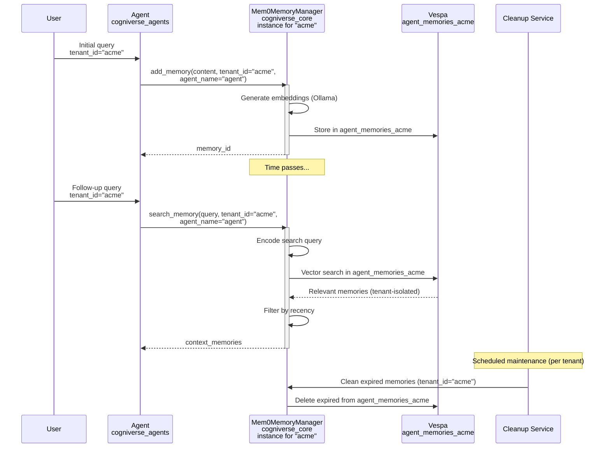
```mermaid
sequenceDiagram
    participant User
    participant Agent as Agent<br/>cogniverse_agents
    participant Memory as Mem0MemoryManager<br/>cogniverse_core<br/>instance for "acme"
    participant Vespa as Vespa<br/>agent_memories_acme
    participant Cleanup as Cleanup Service

    User->>Agent: Initial query<br/>tenant_id="acme"
    Agent->>Memory: add_memory(content, tenant_id="acme",<br/>agent_name="agent")

    activate Memory
    Memory->>Memory: Generate embeddings (Ollama)
    Memory->>Vespa: Store in agent_memories_acme
    Memory-->>Agent: memory_id
    deactivate Memory

    Note over Memory: Time passes...

    User->>Agent: Follow-up query<br/>tenant_id="acme"
    Agent->>Memory: search_memory(query, tenant_id="acme",<br/>agent_name="agent")

    activate Memory
    Memory->>Memory: Encode search query
    Memory->>Vespa: Vector search in agent_memories_acme
    Vespa-->>Memory: Relevant memories (tenant-isolated)
    Memory->>Memory: Filter by recency
    Memory-->>Agent: context_memories
    deactivate Memory

    Note over Cleanup: Scheduled maintenance (per tenant)

    Cleanup->>Memory: Clean expired memories (tenant_id="acme")
    Memory->>Vespa: Delete expired from agent_memories_acme
```

### Scenario 18: Per-Tenant Memory Singleton Pattern

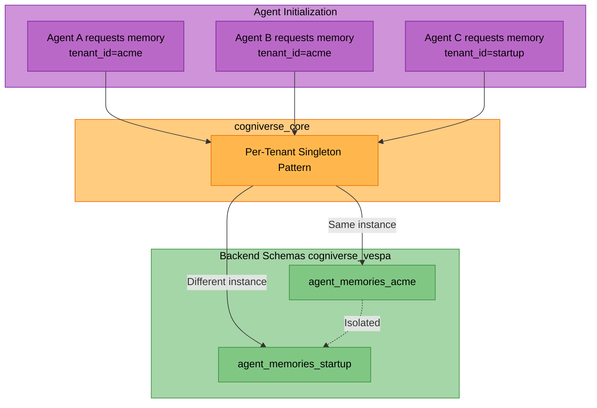
```mermaid
flowchart TB
    subgraph AgentInit[<span style='color:#000'>Agent Initialization</span>]
        AgentA[<span style='color:#000'>Agent A requests memory<br/>tenant_id=acme</span>]
        AgentB[<span style='color:#000'>Agent B requests memory<br/>tenant_id=acme</span>]
        AgentC[<span style='color:#000'>Agent C requests memory<br/>tenant_id=startup</span>]
    end

    subgraph CorePkg[<span style='color:#000'>cogniverse_core<br/>Mem0MemoryManager</span>]
        Singleton[<span style='color:#000'>Per-Tenant Singleton Pattern</span>]
    end

    subgraph VespaPkg[<span style='color:#000'>Backend Schemas cogniverse_vespa</span>]
        SchemaA[<span style='color:#000'>agent_memories_acme</span>]
        SchemaB[<span style='color:#000'>agent_memories_startup</span>]
    end

    AgentA --> Singleton
    AgentB --> Singleton
    AgentC --> Singleton

    Singleton -->|Same instance| SchemaA
    Singleton -->|Different instance| SchemaB

    SchemaA -.->|Isolated| SchemaB

    style AgentInit fill:#ce93d8,stroke:#7b1fa2,color:#000
    style AgentA fill:#ba68c8,stroke:#7b1fa2,color:#000
    style AgentB fill:#ba68c8,stroke:#7b1fa2,color:#000
    style AgentC fill:#ba68c8,stroke:#7b1fa2,color:#000
    style CorePkg fill:#ffcc80,stroke:#ef6c00,color:#000
    style Singleton fill:#ffb74d,stroke:#ef6c00,color:#000
    style VespaPkg fill:#a5d6a7,stroke:#388e3c,color:#000
    style SchemaA fill:#81c784,stroke:#388e3c,color:#000
    style SchemaB fill:#81c784,stroke:#388e3c,color:#000
```

---

## Ingestion & Dataset Flows

### Scenario 19: Video Ingestion Pipeline with Tenant Routing

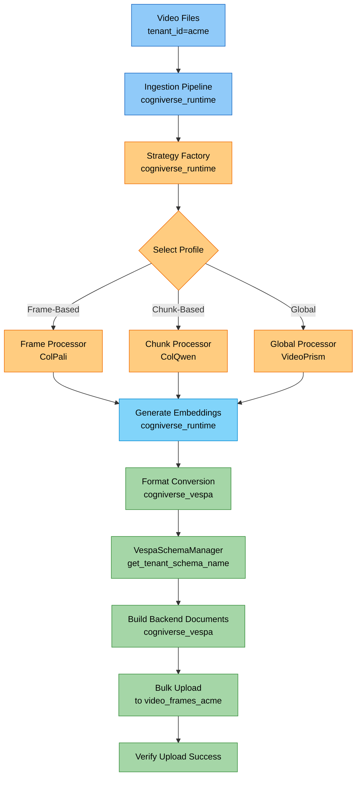
```mermaid
flowchart TB
    Input[<span style='color:#000'>Video Files<br/>tenant_id=acme</span>] --> Runtime[<span style='color:#000'>Ingestion Pipeline<br/>cogniverse_runtime</span>]

    Runtime --> Strategy[<span style='color:#000'>Strategy Factory<br/>cogniverse_runtime</span>]

    Strategy --> Profile{<span style='color:#000'>Select Profile</span>}
    Profile -->|Frame-Based| FrameProc[<span style='color:#000'>Frame Processor<br/>ColPali</span>]
    Profile -->|Chunk-Based| ChunkProc[<span style='color:#000'>Chunk Processor<br/>ColQwen</span>]
    Profile -->|Global| GlobalProc[<span style='color:#000'>Global Processor<br/>VideoPrism</span>]

    FrameProc --> Embed[<span style='color:#000'>Generate Embeddings<br/>cogniverse_runtime</span>]
    ChunkProc --> Embed
    GlobalProc --> Embed

    Embed --> Format[<span style='color:#000'>Format Conversion<br/>cogniverse_vespa</span>]

    Format --> SchemaMgr[<span style='color:#000'>VespaSchemaManager<br/>get_tenant_schema_name</span>]

    SchemaMgr --> Build[<span style='color:#000'>Build Backend Documents<br/>cogniverse_vespa</span>]

    Build --> Upload[<span style='color:#000'>Bulk Upload<br/>to video_frames_acme</span>]
    Upload --> Verify[<span style='color:#000'>Verify Upload Success</span>]

    style Input fill:#90caf9,stroke:#1565c0,color:#000
    style Runtime fill:#90caf9,stroke:#1565c0,color:#000
    style Strategy fill:#ffcc80,stroke:#ef6c00,color:#000
    style Profile fill:#ffcc80,stroke:#ef6c00,color:#000
    style FrameProc fill:#ffcc80,stroke:#ef6c00,color:#000
    style ChunkProc fill:#ffcc80,stroke:#ef6c00,color:#000
    style GlobalProc fill:#ffcc80,stroke:#ef6c00,color:#000
    style Embed fill:#81d4fa,stroke:#0288d1,color:#000
    style Format fill:#a5d6a7,stroke:#388e3c,color:#000
    style SchemaMgr fill:#a5d6a7,stroke:#388e3c,color:#000
    style Build fill:#a5d6a7,stroke:#388e3c,color:#000
    style Upload fill:#a5d6a7,stroke:#388e3c,color:#000
    style Verify fill:#a5d6a7,stroke:#388e3c,color:#000
```

### Scenario 20: Dataset Extraction for Evaluation

```mermaid
sequenceDiagram
    participant Script
    participant DatasetMgr as Dataset Manager<br/>cogniverse_evaluation
    participant Phoenix as Phoenix<br/>cogniverse_telemetry_phoenix
    participant Vespa as Vespa<br/>cogniverse_vespa
    participant Export as Export Service

    Script->>DatasetMgr: Create and upload dataset<br/>tenant_id="acme"

    DatasetMgr->>Phoenix: Fetch production spans (tenant-filtered)
    Note over Phoenix: Filter by:<br/>- Date range<br/>- Quality threshold<br/>- User feedback<br/>- Tenant isolation
    Phoenix-->>DatasetMgr: high_quality_spans (tenant-scoped)

    DatasetMgr->>DatasetMgr: Extract queries & labels

    loop For each span
        DatasetMgr->>DatasetMgr: Parse routing decision
        DatasetMgr->>DatasetMgr: Validate gold label
        DatasetMgr->>DatasetMgr: Verify tenant_id="acme"
    end

    DatasetMgr->>DatasetMgr: Deduplicate queries
    DatasetMgr->>DatasetMgr: Balance modalities

    DatasetMgr->>Vespa: Store dataset<br/>(tenant-scoped storage)
    DatasetMgr->>Export: Export to CSV with tenant_id

    Export-->>Script: dataset_file_path
    Script->>Script: Validate dataset quality
```

### Scenario 21: Ingestion Strategy Resolution

```mermaid
flowchart TB
    Start[<span style='color:#000'>Video Input<br/>tenant_id=acme</span>] --> Runtime[<span style='color:#000'>cogniverse_runtime<br/>Ingestion Service</span>]

    Runtime --> Analyzer[<span style='color:#000'>Analyze Video Properties</span>]

    Analyzer --> Duration{<span style='color:#000'>Duration?</span>}
    Analyzer --> Resolution{<span style='color:#000'>Resolution?</span>}
    Analyzer --> Format{<span style='color:#000'>Format?</span>}

    Duration -->|Short| ShortStrategy[<span style='color:#000'>Frame-Based Strategy<br/>ColPali</span>]
    Duration -->|Medium| MediumStrategy[<span style='color:#000'>Chunk-Based Strategy<br/>ColQwen</span>]
    Duration -->|Long| LongStrategy[<span style='color:#000'>Hybrid Strategy<br/>Multi-model</span>]

    Resolution -->|Low| LowRes[<span style='color:#000'>Basic Processing</span>]
    Resolution -->|High| HighRes[<span style='color:#000'>Advanced Processing</span>]

    Format -->|MP4| DirectProcess[<span style='color:#000'>Direct Processing</span>]
    Format -->|Other| Convert[<span style='color:#000'>Convert Format</span>]

    ShortStrategy --> Combine[<span style='color:#000'>Combine Strategies<br/>cogniverse_runtime</span>]
    MediumStrategy --> Combine
    LongStrategy --> Combine
    LowRes --> Combine
    HighRes --> Combine
    DirectProcess --> Combine
    Convert --> Combine

    Combine --> TenantRoute[<span style='color:#000'>VespaSchemaManager<br/>cogniverse_vespa</span>]

    TenantRoute --> Execute[<span style='color:#000'>Execute Ingestion</span>]

    style Start fill:#90caf9,stroke:#1565c0,color:#000
    style Runtime fill:#90caf9,stroke:#1565c0,color:#000
    style Analyzer fill:#ffcc80,stroke:#ef6c00,color:#000
    style Duration fill:#ffcc80,stroke:#ef6c00,color:#000
    style Resolution fill:#ffcc80,stroke:#ef6c00,color:#000
    style Format fill:#ffcc80,stroke:#ef6c00,color:#000
    style ShortStrategy fill:#ffcc80,stroke:#ef6c00,color:#000
    style MediumStrategy fill:#ffcc80,stroke:#ef6c00,color:#000
    style LongStrategy fill:#ffcc80,stroke:#ef6c00,color:#000
    style LowRes fill:#ffcc80,stroke:#ef6c00,color:#000
    style HighRes fill:#ffcc80,stroke:#ef6c00,color:#000
    style DirectProcess fill:#ffcc80,stroke:#ef6c00,color:#000
    style Convert fill:#ffcc80,stroke:#ef6c00,color:#000
    style Combine fill:#ce93d8,stroke:#7b1fa2,color:#000
    style TenantRoute fill:#a5d6a7,stroke:#388e3c,color:#000
    style Execute fill:#a5d6a7,stroke:#388e3c,color:#000
```

---

## Production Deployment Flows

### Scenario 22: SDK Package Deployment

```mermaid
flowchart TB
    Code[<span style='color:#000'>Code Changes<br/>in libs/ packages</span>] --> Tests[<span style='color:#000'>Run Tests<br/>uv run pytest</span>]

    Tests --> UnitPass{<span style='color:#000'>Unit Tests Pass?</span>}

    UnitPass -->|No| Fix[<span style='color:#000'>Fix Issues</span>]
    Fix --> Tests

    UnitPass -->|Yes| Integration[<span style='color:#000'>Integration Tests<br/>Multi-tenant + SDK</span>]
    Integration --> IntPass{<span style='color:#000'>Integration Pass?</span>}

    IntPass -->|No| Fix
    IntPass -->|Yes| BuildPkg[<span style='color:#000'>Build Packages<br/>uv build libs/runtime<br/>uv build libs/dashboard</span>]

    BuildPkg --> Containers[<span style='color:#000'>Build Docker Containers<br/>cogniverse_runtime<br/>cogniverse_dashboard</span>]

    Containers --> Stage[<span style='color:#000'>Deploy to Staging<br/>With tenant isolation</span>]

    Stage --> StageTest[<span style='color:#000'>Staging Tests<br/>Multi-tenant validation</span>]
    StageTest --> StagePass{<span style='color:#000'>Tests Pass?</span>}

    StagePass -->|No| Rollback[<span style='color:#000'>Rollback</span>]
    StagePass -->|Yes| Prod[<span style='color:#000'>Deploy to Production<br/>Blue-Green deployment</span>]

    Prod --> Monitor[<span style='color:#000'>Monitor Metrics<br/>Per-tenant observability</span>]
    Monitor --> Health{<span style='color:#000'>Healthy?</span>}

    Health -->|No| Rollback
    Health -->|Yes| Complete[<span style='color:#000'>Deployment Complete</span>]

    style Code fill:#90caf9,stroke:#1565c0,color:#000
    style Tests fill:#ce93d8,stroke:#7b1fa2,color:#000
    style UnitPass fill:#ffcc80,stroke:#ef6c00,color:#000
    style Fix fill:#ffcc80,stroke:#ef6c00,color:#000
    style Integration fill:#ce93d8,stroke:#7b1fa2,color:#000
    style IntPass fill:#ffcc80,stroke:#ef6c00,color:#000
    style BuildPkg fill:#ce93d8,stroke:#7b1fa2,color:#000
    style Containers fill:#ce93d8,stroke:#7b1fa2,color:#000
    style Stage fill:#a5d6a7,stroke:#388e3c,color:#000
    style StageTest fill:#ce93d8,stroke:#7b1fa2,color:#000
    style StagePass fill:#ffcc80,stroke:#ef6c00,color:#000
    style Rollback fill:#e53935,stroke:#c62828,color:#fff
    style Prod fill:#a5d6a7,stroke:#388e3c,color:#000
    style Monitor fill:#a5d6a7,stroke:#388e3c,color:#000
    style Health fill:#ffcc80,stroke:#ef6c00,color:#000
    style Complete fill:#a5d6a7,stroke:#388e3c,color:#000
```

### Scenario 23: Blue-Green Deployment with Multi-Tenancy

```mermaid
sequenceDiagram
    participant Traffic
    participant LB as Load Balancer
    participant Blue as Blue Environment<br/>cogniverse_runtime v1.0
    participant Green as Green Environment<br/>cogniverse_runtime v2.0
    participant Monitor as Monitor<br/>cogniverse_telemetry_phoenix
    participant Evaluator

    Note over Blue: Current Production<br/>All tenants: acme, startup, enterprise
    Note over Green: New Version Deployed<br/>Ready for A/B testing

    Traffic->>LB: User requests (all tenants)
    LB->>Blue: 90% traffic (all tenants)
    LB->>Green: 10% traffic (sampled tenants)

    Blue-->>Monitor: Metrics (baseline)<br/>Per-tenant Phoenix projects
    Green-->>Monitor: Metrics (new version)<br/>Per-tenant Phoenix projects

    Monitor->>Evaluator: Compare performance<br/>Aggregate across tenants

    alt Performance Improved (all tenants)
        Evaluator->>LB: Increase Green traffic
        LB->>Blue: 50% traffic
        LB->>Green: 50% traffic

        Note over Evaluator: Continue monitoring<br/>per tenant...

        Evaluator->>LB: Full cutover
        LB->>Green: 100% traffic (all tenants)

        Evaluator->>Blue: Decommission old version
    else Performance Degraded (any tenant)
        Evaluator->>LB: Rollback
        LB->>Blue: 100% traffic (all tenants)

        Evaluator->>Green: Debug and fix<br/>Tenant-specific issues
    end
```

---

## Key Takeaways

### Multi-Tenant Design Patterns

1. **Schema-Per-Tenant**: Schema-based isolation via dedicated backend schemas

2. **Tenant Context Injection**: Request parameters or config provide tenant_id context

3. **Per-Tenant Singletons**: Mem0MemoryManager maintains isolated instances

4. **Tenant-Scoped Telemetry**: Observability projects per tenant for complete isolation

### Critical Integration Points

1. **runtime ↔ vespa**: Automatic schema routing via VespaSchemaManager

2. **agents ↔ vespa**: Tenant-aware search clients with schema resolution

3. **core ↔ vespa**: Memory using backend (agent_memories_{tenant_id})

4. **foundation ↔ telemetry-phoenix**: Telemetry provider interface and implementation

5. **evaluation ↔ telemetry-phoenix**: Experiment tracking

6. **All packages ↔ sdk**: Common interfaces and document models

---

**Related Guides:**

[architecture/overview.md](./overview.md) - SDK and multi-tenant architecture

[architecture/sdk-architecture.md](./sdk-architecture.md) - UV workspace deep dive

[architecture/multi-tenant.md](./multi-tenant.md) - Tenant isolation guide

[modules/sdk.md](../modules/sdk.md) - Per-package technical details

