# Cogniverse System Flows & Architecture Scenarios

**Last Updated:** 2025-10-15
**Purpose:** Comprehensive system flows with SDK architecture and multi-tenant patterns
**Format:** Mermaid diagrams showing package boundaries and tenant context

---

## Table of Contents
1. [Overall System Architecture](#overall-system-architecture)
2. [Query Processing Flows](#query-processing-flows)
3. [Agent Orchestration Flows](#agent-orchestration-flows)
4. [Multi-Tenant Flows](#multi-tenant-flows)
5. [Optimization & Learning Flows](#optimization--learning-flows)
6. [Evaluation & Experiment Flows](#evaluation--experiment-flows)
7. [Memory & Context Flows](#memory--context-flows)
8. [Ingestion & Dataset Flows](#ingestion--dataset-flows)
9. [Production Deployment Flows](#production-deployment-flows)

---

## Overall System Architecture

### SDK Package Architecture

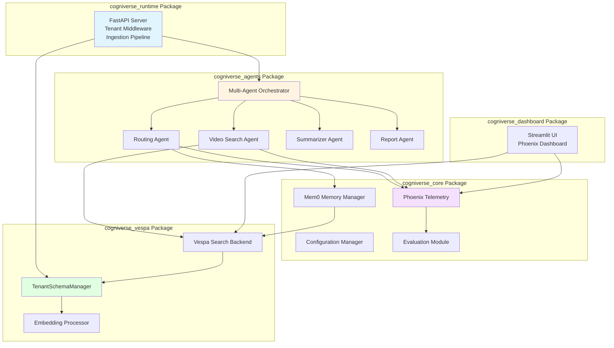

### Component Interaction with Package Boundaries

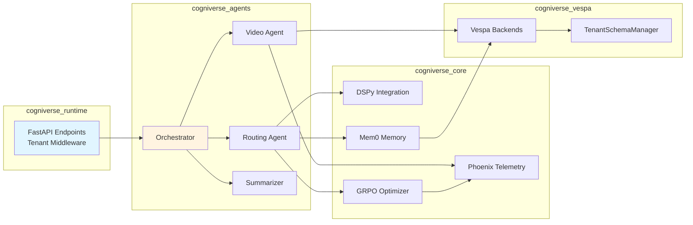

---

## Query Processing Flows

### Scenario 1: Simple Video Search with Tenant Context

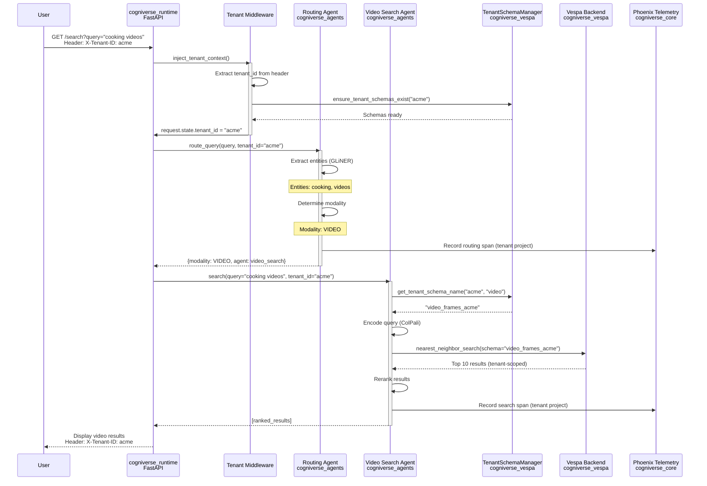

### Scenario 2: Multi-Modal Query with Fusion

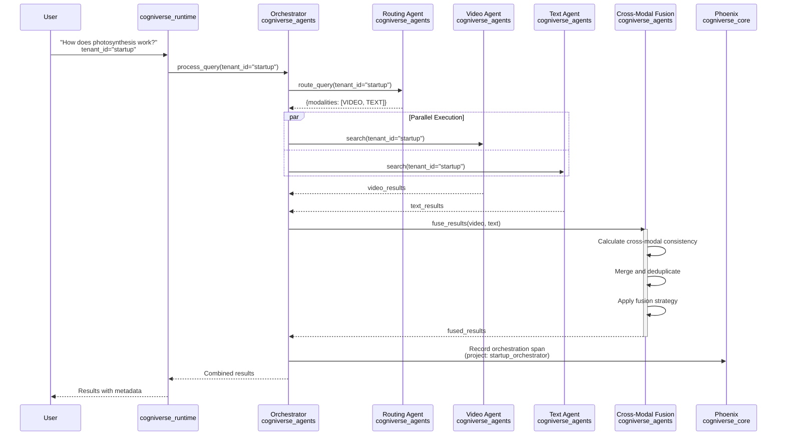

### Scenario 3: Memory-Enhanced Routing

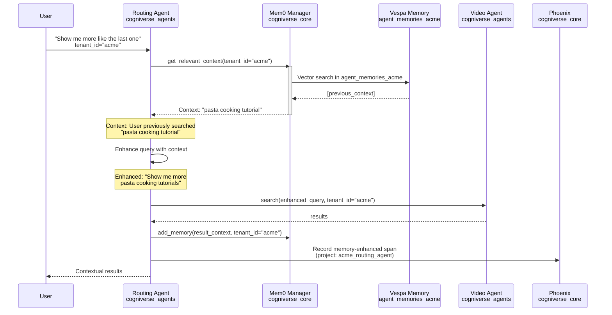

---

## Agent Orchestration Flows

### Scenario 4: Complex Multi-Agent Workflow with SDK Packages

```mermaid
graph TB
    Start[User Query<br/>tenant_id="acme"] --> Runtime[cogniverse_runtime<br/>FastAPI + Middleware]

    Runtime --> Orchestrator[Orchestrator<br/>cogniverse_agents]

    Orchestrator --> T1[Task 1: Route Query]
    Orchestrator --> T2[Task 2: Parallel Search]
    Orchestrator --> T3[Task 3: Summarize]
    Orchestrator --> T4[Task 4: Generate Report]

    T1 --> Routing[Routing Agent<br/>cogniverse_agents]
    Routing --> T2

    T2 --> ParallelBlock{Parallel Execution}
    ParallelBlock --> Video[Video Search<br/>cogniverse_agents]
    ParallelBlock --> Text[Text Search<br/>cogniverse_agents]

    Video --> VespaV[video_frames_acme<br/>cogniverse_vespa]
    Text --> VespaT[document_content_acme<br/>cogniverse_vespa]

    VespaV --> T3
    VespaT --> T3

    T3 --> Summarizer[Summarizer Agent<br/>cogniverse_agents]
    Summarizer --> T4

    T4 --> Reporter[Report Agent<br/>cogniverse_agents]
    Reporter --> Result[Final Report]

    style Start fill:#e1f5ff
    style Result fill:#e1ffe1
    style ParallelBlock fill:#fff4e1
    style Runtime fill:#ffe1e1
```

### Scenario 5: Task Dependency Resolution

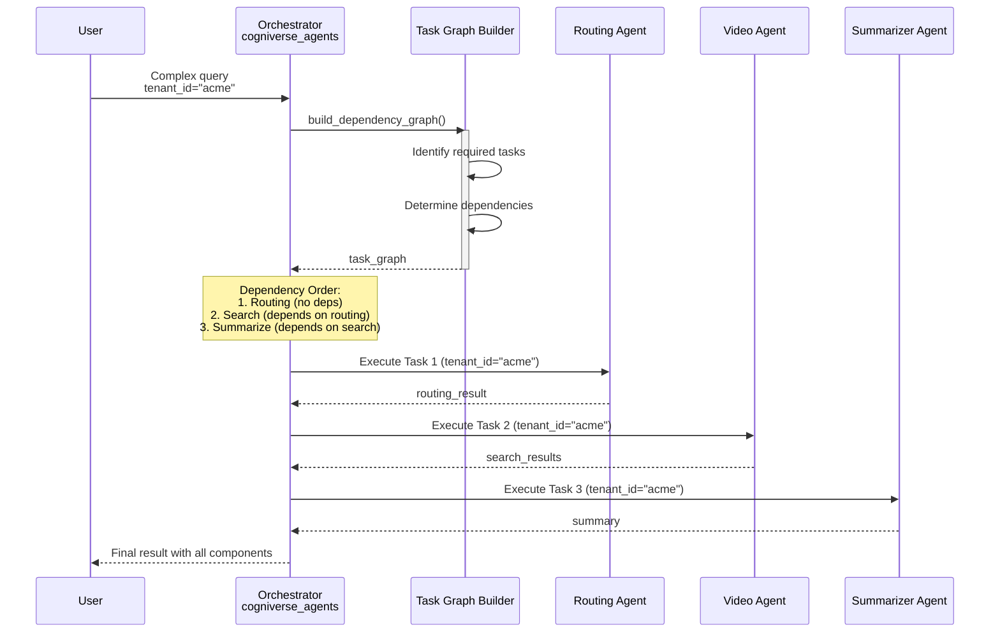

### Scenario 6: Agent-to-Agent Communication (A2A Protocol)

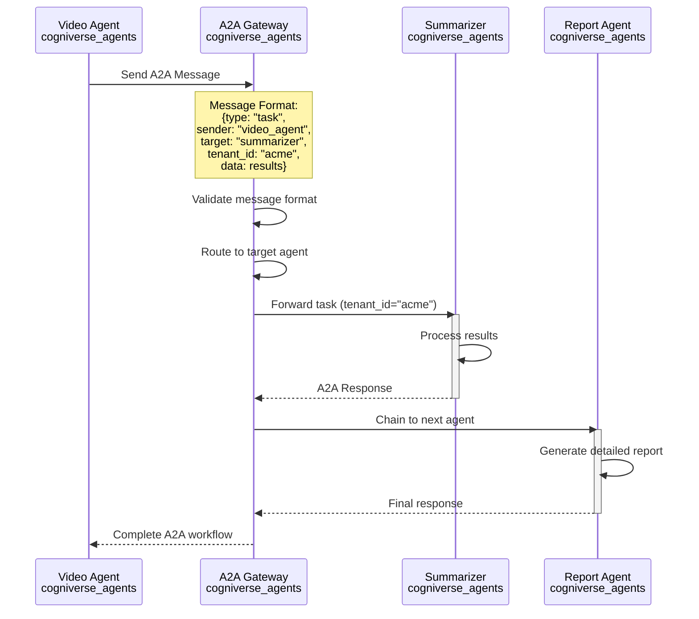

---

## Multi-Tenant Flows

### Scenario 7: Tenant Schema Lifecycle

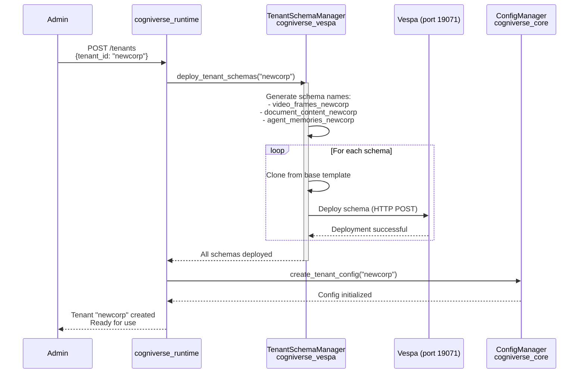

### Scenario 8: Multi-Tenant Request Isolation

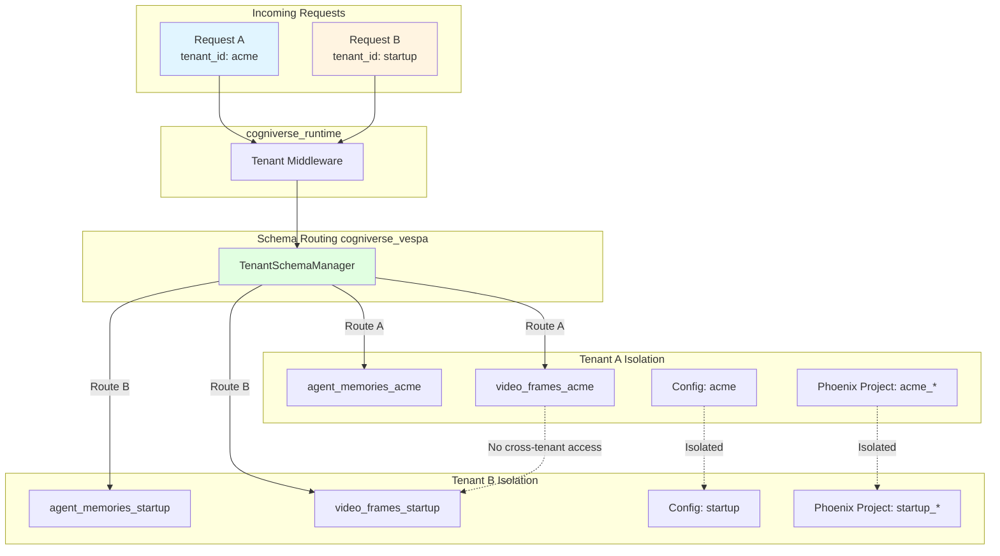

### Scenario 9: Tenant Memory Isolation

```mermaid
graph LR
    subgraph "Tenant: acme"
        UserA[User Query<br/>tenant_id="acme"]
        MemA[Mem0Manager<br/>instance for acme]
        SchemaA[agent_memories_acme]
    end

    subgraph "Tenant: startup"
        UserB[User Query<br/>tenant_id="startup"]
        MemB[Mem0Manager<br/>instance for startup]
        SchemaB[agent_memories_startup]
    end

    subgraph "cogniverse_core"
        MemSingleton[Mem0MemoryManager<br/>Per-tenant singletons<br/>_instances['acme']<br/>_instances['startup']]
    end

    subgraph "cogniverse_vespa"
        VespaCore[Vespa Core<br/>Physical isolation]
    end

    UserA --> MemA
    UserB --> MemB

    MemA --> MemSingleton
    MemB --> MemSingleton

    MemA --> SchemaA
    MemB --> SchemaB

    SchemaA --> VespaCore
    SchemaB --> VespaCore

    SchemaA -.->|No cross-access| SchemaB

    style UserA fill:#e1f5ff
    style UserB fill:#fff4e1
    style VespaCore fill:#e1ffe1
```

---

## Optimization & Learning Flows

### Scenario 10: GRPO Optimization Cycle with Packages

```mermaid
graph TB
    Start[Query Execution<br/>tenant_id="acme"] --> Telemetry[Phoenix Records Spans<br/>cogniverse_core<br/>project: acme_routing_agent]

    Telemetry --> SpanEval[Span Evaluator<br/>cogniverse_core]

    SpanEval --> Extract{Extract Experiences<br/>per tenant}
    Extract --> Quality[Quality Signals]
    Extract --> Latency[Latency Metrics]
    Extract --> UserFeedback[User Feedback]

    Quality --> ExpReplay[Experience Replay Buffer<br/>cogniverse_core]
    Latency --> ExpReplay
    UserFeedback --> ExpReplay

    ExpReplay --> GRPO[GRPO Optimizer<br/>cogniverse_core]

    GRPO --> UpdateDSPy[Update DSPy Module<br/>cogniverse_agents]
    UpdateDSPy --> NewModel[Optimized Routing Model<br/>tenant-specific]

    NewModel --> Deploy[Deploy to Routing Agent<br/>cogniverse_agents]
    Deploy --> Monitor[Monitor Performance<br/>cogniverse_core]

    Monitor --> Telemetry

    style Start fill:#e1f5ff
    style NewModel fill:#e1ffe1
    style ExpReplay fill:#fff4e1
```

### Scenario 11: Experience Collection & Optimization

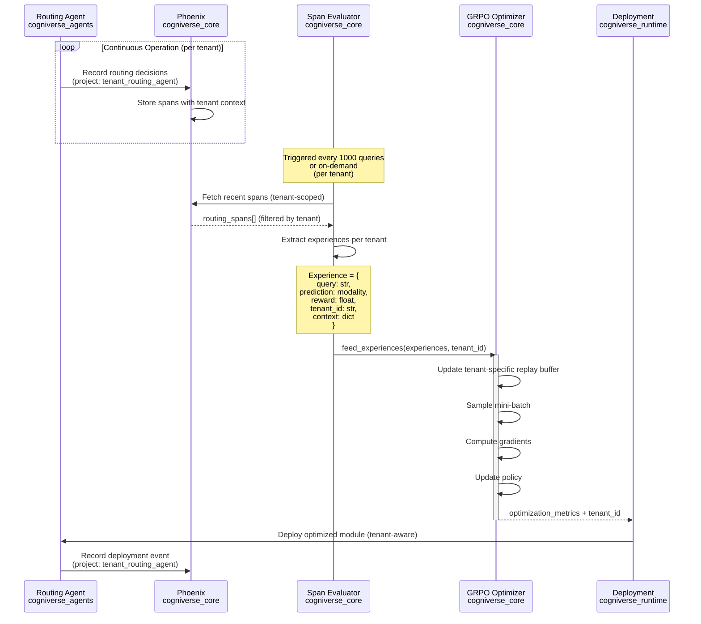

### Scenario 12: Cross-Modal Optimization

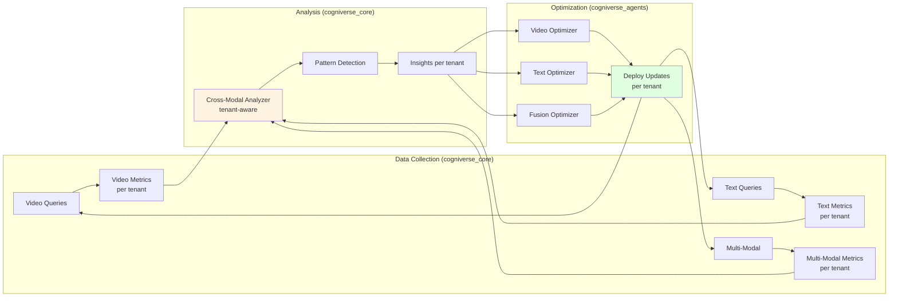

---

## Evaluation & Experiment Flows

### Scenario 13: Phoenix Experiment Workflow

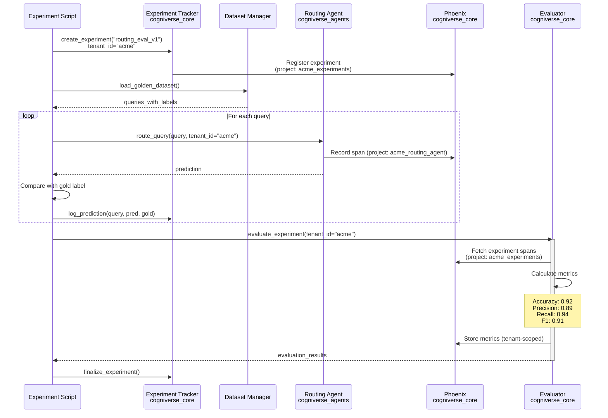

### Scenario 14: Routing Evaluator Integration

```mermaid
graph TB
    Start[Evaluation Request<br/>tenant_id="acme"] --> LoadDataset[Load Golden Dataset<br/>cogniverse_core]
    LoadDataset --> PrepQueries[Prepare Test Queries]

    PrepQueries --> Loop{For Each Query}

    Loop --> Execute[Execute Routing<br/>cogniverse_agents]
    Execute --> Predict[Get Prediction]
    Predict --> Compare[Compare with Gold Label]

    Compare --> StoreResult[Store Result<br/>cogniverse_core]
    StoreResult --> Loop

    Loop --> Aggregate[Aggregate Results]

    Aggregate --> CalcMetrics[Calculate Metrics<br/>cogniverse_core]
    CalcMetrics --> Accuracy[Accuracy]
    CalcMetrics --> Precision[Precision/Recall]
    CalcMetrics --> Confusion[Confusion Matrix]

    Accuracy --> Report[Generate Report]
    Precision --> Report
    Confusion --> Report

    Report --> Visualize[Create Visualizations<br/>cogniverse_dashboard]
    Visualize --> Dashboard[Phoenix Dashboard<br/>project: acme_evaluation]

    style Start fill:#e1f5ff
    style Dashboard fill:#e1ffe1
```

### Scenario 15: Quality Evaluator for Experiments

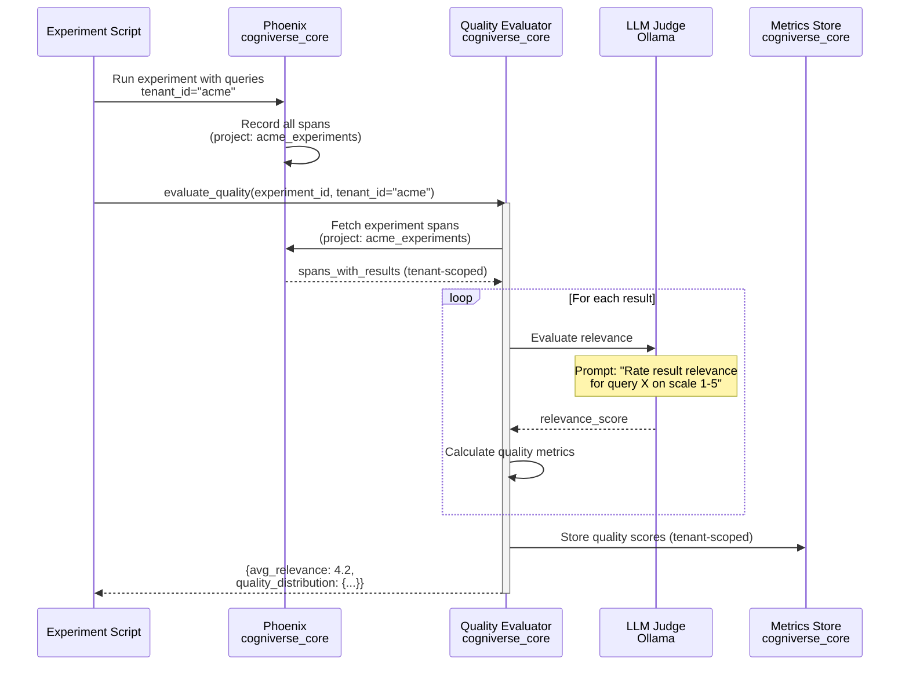

---

## Memory & Context Flows

### Scenario 16: Conversation Memory Integration

```mermaid
graph TB
    Query[New Query<br/>tenant_id="acme"] --> CheckMemory{Check Tenant Memory<br/>cogniverse_core}

    CheckMemory -->|Memory Found| Retrieve[Retrieve Context<br/>agent_memories_acme]
    CheckMemory -->|No Memory| Direct[Direct Processing]

    Retrieve --> Relevant[Filter Relevant Memories<br/>Mem0 semantic search]
    Relevant --> Enhance[Enhance Query<br/>cogniverse_agents]

    Enhance --> Process[Process Enhanced Query]
    Direct --> Process

    Process --> Execute[Execute Search<br/>cogniverse_agents]
    Execute --> Results[Get Results from<br/>video_frames_acme]

    Results --> Store[Store New Memory<br/>agent_memories_acme]
    Store --> Update[Update Tenant Context]

    Update --> Return[Return Results]

    style Query fill:#e1f5ff
    style Return fill:#e1ffe1
    style Relevant fill:#fff4e1
```

### Scenario 17: Memory Lifecycle with Tenant Isolation

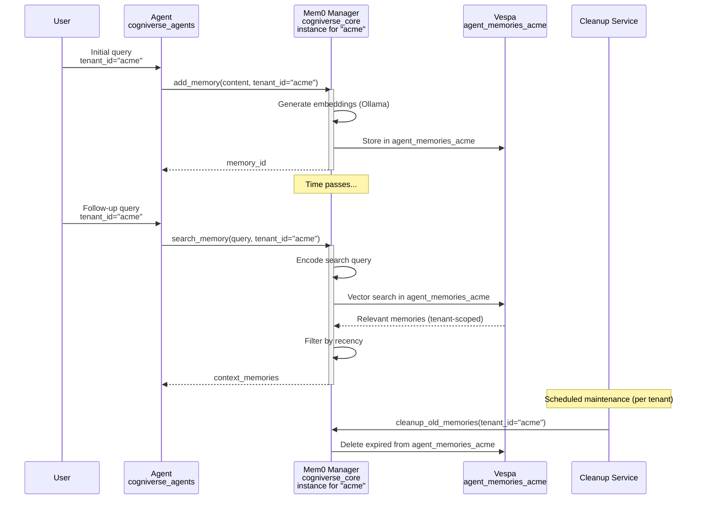

### Scenario 18: Per-Tenant Memory Singleton Pattern

```mermaid
graph TB
    subgraph "Agent Initialization"
        AgentA[Agent A requests memory<br/>tenant_id="acme"]
        AgentB[Agent B requests memory<br/>tenant_id="acme"]
        AgentC[Agent C requests memory<br/>tenant_id="startup"]
    end

    subgraph "cogniverse_core Mem0MemoryManager"
        Singleton[Per-Tenant Singleton<br/>_instances = {<br/>  'acme': manager_instance_1,<br/>  'startup': manager_instance_2<br/>}]
    end

    subgraph "Vespa Schemas cogniverse_vespa"
        SchemaA[agent_memories_acme]
        SchemaB[agent_memories_startup]
    end

    AgentA --> Singleton
    AgentB --> Singleton
    AgentC --> Singleton

    Singleton -->|Same instance| SchemaA
    Singleton -->|Same instance| SchemaA
    Singleton -->|Different instance| SchemaB

    SchemaA -.->|Isolated| SchemaB

    style AgentA fill:#e1f5ff
    style AgentB fill:#e1f5ff
    style AgentC fill:#fff4e1
    style Singleton fill:#e1ffe1
```

---

## Ingestion & Dataset Flows

### Scenario 19: Video Ingestion Pipeline with Tenant Routing

```mermaid
graph TB
    Input[Video Files<br/>tenant_id="acme"] --> Runtime[Ingestion Pipeline<br/>cogniverse_runtime]

    Runtime --> Strategy[Strategy Factory<br/>cogniverse_runtime]

    Strategy --> Profile{Select Profile}
    Profile -->|Frame-Based| FrameProc[Frame Processor<br/>ColPali]
    Profile -->|Chunk-Based| ChunkProc[Chunk Processor<br/>ColQwen]
    Profile -->|Global| GlobalProc[Global Processor<br/>VideoPrism]

    FrameProc --> Embed[Generate Embeddings<br/>cogniverse_runtime]
    ChunkProc --> Embed
    GlobalProc --> Embed

    Embed --> Format[Format Conversion<br/>cogniverse_vespa<br/>Binary + Float]

    Format --> TenantMgr[TenantSchemaManager<br/>get_tenant_schema_name<br/>'acme', 'video']

    TenantMgr --> Build[Build Vespa Documents<br/>cogniverse_vespa]

    Build --> Upload[Bulk Upload<br/>to video_frames_acme]
    Upload --> Verify[Verify Upload Success]

    style Input fill:#e1f5ff
    style Verify fill:#e1ffe1
```

### Scenario 20: Dataset Extraction for Evaluation

```mermaid
sequenceDiagram
    participant Script
    participant DatasetMgr as Dataset Manager<br/>cogniverse_core
    participant Phoenix as Phoenix<br/>cogniverse_core
    participant Vespa as Vespa<br/>cogniverse_vespa
    participant Export as Export Service

    Script->>DatasetMgr: create_dataset("golden_eval_v1")<br/>tenant_id="acme"

    DatasetMgr->>Phoenix: Fetch production spans<br/>(project: acme_routing_agent)
    Note over Phoenix: Filter by:<br/>- Date range<br/>- Quality threshold<br/>- User feedback<br/>- Tenant isolation
    Phoenix-->>DatasetMgr: high_quality_spans (tenant-scoped)

    DatasetMgr->>DatasetMgr: Extract queries & labels

    loop For each span
        DatasetMgr->>DatasetMgr: Parse routing decision
        DatasetMgr->>DatasetMgr: Validate gold label
        DatasetMgr->>DatasetMgr: Verify tenant_id="acme"
    end

    DatasetMgr->>DatasetMgr: Deduplicate queries
    DatasetMgr->>DatasetMgr: Balance modalities

    DatasetMgr->>Vespa: Store dataset<br/>(tenant-scoped storage)
    DatasetMgr->>Export: Export to CSV with tenant_id

    Export-->>Script: dataset_file_path
    Script->>Script: Validate dataset quality
```

### Scenario 21: Ingestion Strategy Resolution

```mermaid
graph TB
    Start[Video Input<br/>tenant_id="acme"] --> Runtime[cogniverse_runtime<br/>Ingestion Service]

    Runtime --> Analyzer[Analyze Video Properties]

    Analyzer --> Duration{Duration?}
    Analyzer --> Resolution{Resolution?}
    Analyzer --> Format{Format?}

    Duration -->|Short < 30s| ShortStrategy[Frame-Based Strategy<br/>ColPali]
    Duration -->|Medium 30s-5m| MediumStrategy[Chunk-Based Strategy<br/>ColQwen]
    Duration -->|Long > 5m| LongStrategy[Hybrid Strategy<br/>Multi-model]

    Resolution -->|Low < 720p| LowRes[Basic Processing]
    Resolution -->|High >= 720p| HighRes[Advanced Processing]

    Format -->|MP4| DirectProcess[Direct Processing]
    Format -->|Other| Convert[Convert Format]

    ShortStrategy --> Combine[Combine Strategies<br/>cogniverse_runtime]
    MediumStrategy --> Combine
    LongStrategy --> Combine
    LowRes --> Combine
    HighRes --> Combine
    DirectProcess --> Combine
    Convert --> Combine

    Combine --> TenantRoute[TenantSchemaManager<br/>cogniverse_vespa<br/>Route to video_frames_acme]

    TenantRoute --> Execute[Execute Ingestion]

    style Start fill:#e1f5ff
    style Execute fill:#e1ffe1
```

---

## Production Deployment Flows

### Scenario 22: SDK Package Deployment

```mermaid
graph TB
    Code[Code Changes<br/>in libs/ packages] --> Tests[Run Tests<br/>JAX_PLATFORM_NAME=cpu uv run pytest]

    Tests --> UnitPass{Unit Tests Pass?}

    UnitPass -->|No| Fix[Fix Issues]
    Fix --> Tests

    UnitPass -->|Yes| Integration[Integration Tests<br/>Multi-tenant + SDK]
    Integration --> IntPass{Integration Pass?}

    IntPass -->|No| Fix
    IntPass -->|Yes| BuildPkg[Build Packages<br/>uv build libs/runtime<br/>uv build libs/dashboard]

    BuildPkg --> Containers[Build Docker Containers<br/>cogniverse_runtime<br/>cogniverse_dashboard]

    Containers --> Stage[Deploy to Staging<br/>With tenant isolation]

    Stage --> StageTest[Staging Tests<br/>Multi-tenant validation]
    StageTest --> StagePass{Tests Pass?}

    StagePass -->|No| Rollback[Rollback]
    StagePass -->|Yes| Prod[Deploy to Production<br/>Blue-Green deployment]

    Prod --> Monitor[Monitor Metrics<br/>Per-tenant Phoenix projects]
    Monitor --> Health{Healthy?}

    Health -->|No| Rollback
    Health -->|Yes| Complete[Deployment Complete]

    style Code fill:#e1f5ff
    style Complete fill:#e1ffe1
    style Rollback fill:#ffe1e1
```

### Scenario 23: Blue-Green Deployment with Multi-Tenancy

```mermaid
sequenceDiagram
    participant Traffic
    participant LB as Load Balancer
    participant Blue as Blue Environment<br/>cogniverse_runtime v1.0
    participant Green as Green Environment<br/>cogniverse_runtime v2.0
    participant Monitor as Monitor<br/>cogniverse_core
    participant Evaluator

    Note over Blue: Current Production<br/>All tenants: acme, startup, enterprise
    Note over Green: New Version Deployed<br/>Ready for A/B testing

    Traffic->>LB: User requests (all tenants)
    LB->>Blue: 90% traffic (all tenants)
    LB->>Green: 10% traffic (sampled tenants)

    Blue-->>Monitor: Metrics (baseline)<br/>Per-tenant Phoenix projects
    Green-->>Monitor: Metrics (new version)<br/>Per-tenant Phoenix projects

    Monitor->>Evaluator: Compare performance<br/>Aggregate across tenants

    alt Performance Improved (all tenants)
        Evaluator->>LB: Increase Green traffic
        LB->>Blue: 50% traffic
        LB->>Green: 50% traffic

        Note over Evaluator: Continue monitoring<br/>per tenant...

        Evaluator->>LB: Full cutover
        LB->>Green: 100% traffic (all tenants)

        Evaluator->>Blue: Decommission old version
    else Performance Degraded (any tenant)
        Evaluator->>LB: Rollback
        LB->>Blue: 100% traffic (all tenants)

        Evaluator->>Green: Debug and fix<br/>Tenant-specific issues
    end
```

---

## Key Takeaways

### SDK Architecture Principles
1. **Package Boundaries**: Clear separation between core, agents, vespa, runtime, dashboard
2. **Dependency Flow**: Core is foundational → Vespa builds on Core → Agents uses both → Runtime consumes all
3. **UV Workspace**: Monorepo with independent package versioning
4. **Import Paths**: All imports use `cogniverse_*` package names

### Multi-Tenant Design Patterns
1. **Schema-Per-Tenant**: Physical isolation via dedicated Vespa schemas
2. **Tenant Context Injection**: Middleware layer extracts and validates tenant_id
3. **Per-Tenant Singletons**: Mem0MemoryManager maintains isolated instances
4. **Tenant-Scoped Telemetry**: Phoenix projects per tenant for complete observability

### Critical Integration Points
1. **Runtime ↔ TenantSchemaManager**: Automatic schema routing and lazy creation
2. **Agents ↔ Vespa**: Tenant-aware search clients with schema resolution
3. **Memory ↔ Vespa**: Tenant-specific memory schemas (agent_memories_{tenant_id})
4. **Phoenix ↔ All Packages**: Tenant-scoped span collection and metrics

### Data Flow Patterns
1. **Request Flow**: User → Runtime (Middleware extracts tenant_id) → Agents (tenant-aware) → Vespa (tenant schema)
2. **Optimization Flow**: Phoenix (tenant project) → Evaluator → GRPO (tenant-specific) → Agents
3. **Memory Flow**: Query → Mem0 (tenant singleton) → Vespa (agent_memories_{tenant_id}) → Context
4. **Ingestion Flow**: Video → Runtime → TenantSchemaManager → Vespa (video_frames_{tenant_id})

---

**Related Guides:**
- [architecture/overview.md](./overview.md) - SDK and multi-tenant architecture
- [architecture/sdk-architecture.md](./sdk-architecture.md) - UV workspace deep dive
- [architecture/multi-tenant.md](./multi-tenant.md) - Tenant isolation guide
- [modules/](../modules/) - Per-package technical details

---

**Version**: 2.0 (SDK Architecture + Multi-Tenancy)
**Last Updated**: 2025-10-15
**Status**: Production-Ready

**Note:** All diagrams use Mermaid syntax and render in:
- GitHub markdown files
- IDEs with Mermaid support (VS Code, IntelliJ)
- Documentation sites (GitBook, Docusaurus)
- Mermaid Live Editor (https://mermaid.live)
