# Cogniverse Study Guide: System Flows & Architecture Scenarios

**Last Updated:** 2025-10-08
**Purpose:** Comprehensive system flows with interactive diagrams
**Format:** Mermaid railroad diagrams for clarity and readability

---

## Table of Contents
1. [Overall System Architecture](#overall-system-architecture)
2. [Query Processing Flows](#query-processing-flows)
3. [Agent Orchestration Flows](#agent-orchestration-flows)
4. [Optimization & Learning Flows](#optimization--learning-flows)
5. [Evaluation & Experiment Flows](#evaluation--experiment-flows)
6. [Memory & Context Flows](#memory--context-flows)
7. [Ingestion & Dataset Flows](#ingestion--dataset-flows)

---

## Overall System Architecture

### High-Level System Components

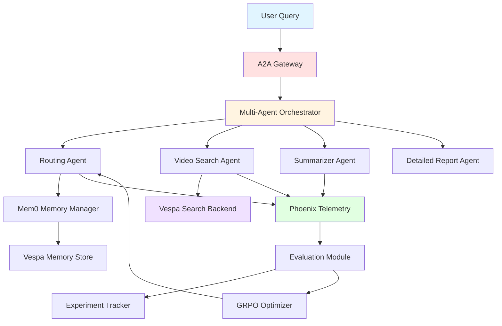
```mermaid
graph TB
    User[User Query] --> Gateway[A2A Gateway]
    Gateway --> Orchestrator[Multi-Agent Orchestrator]

    Orchestrator --> Routing[Routing Agent]
    Orchestrator --> VideoAgent[Video Search Agent]
    Orchestrator --> Summarizer[Summarizer Agent]
    Orchestrator --> ReportAgent[Detailed Report Agent]

    Routing --> Memory[Mem0 Memory Manager]
    VideoAgent --> Vespa[Vespa Search Backend]

    Routing --> Phoenix[Phoenix Telemetry]
    VideoAgent --> Phoenix
    Summarizer --> Phoenix

    Phoenix --> Evaluation[Evaluation Module]
    Evaluation --> Experiments[Experiment Tracker]
    Evaluation --> Optimizer[GRPO Optimizer]

    Optimizer --> Routing

    Memory --> VespaMemory[Vespa Memory Store]

    style User fill:#e1f5ff
    style Gateway fill:#ffe1e1
    style Orchestrator fill:#fff4e1
    style Phoenix fill:#e1ffe1
    style Vespa fill:#f0e1ff
```

### Component Interaction Map

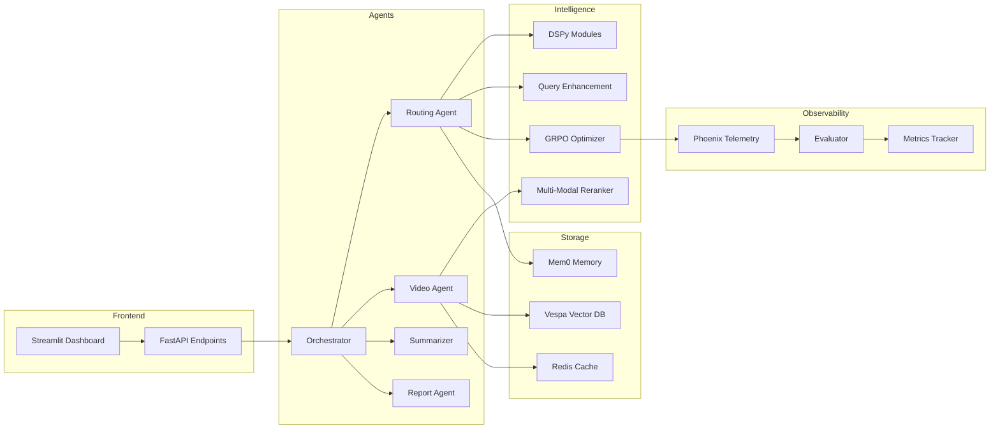
```mermaid
graph LR
    subgraph Frontend
        UI[Streamlit Dashboard]
        API[FastAPI Endpoints]
    end

    subgraph Agents
        ORC[Orchestrator]
        RT[Routing Agent]
        VA[Video Agent]
        SUM[Summarizer]
        REP[Report Agent]
    end

    subgraph Intelligence
        DSPy[DSPy Modules]
        GRPO[GRPO Optimizer]
        QueryEnh[Query Enhancement]
        Reranker[Multi-Modal Reranker]
    end

    subgraph Storage
        Vespa[Vespa Vector DB]
        Mem0[Mem0 Memory]
        Cache[Redis Cache]
    end

    subgraph Observability
        Phoenix[Phoenix Telemetry]
        Metrics[Metrics Tracker]
        Eval[Evaluator]
    end

    UI --> API
    API --> ORC
    ORC --> RT
    ORC --> VA
    ORC --> SUM
    ORC --> REP

    RT --> DSPy
    RT --> QueryEnh
    VA --> Reranker

    RT --> GRPO
    GRPO --> Phoenix

    VA --> Vespa
    RT --> Mem0
    VA --> Cache

    Phoenix --> Eval
    Eval --> Metrics
```

---

## Query Processing Flows

### Scenario 1: Simple Video Search

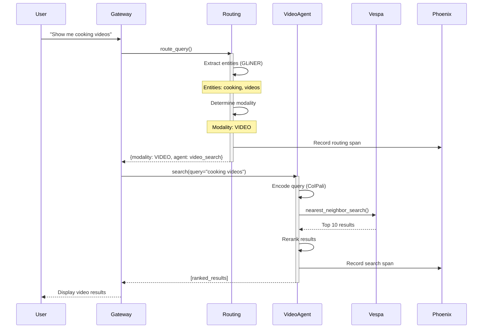
```mermaid
sequenceDiagram
    participant User
    participant Gateway
    participant Routing
    participant VideoAgent
    participant Vespa
    participant Phoenix

    User->>Gateway: "Show me cooking videos"
    Gateway->>Routing: route_query()

    activate Routing
    Routing->>Routing: Extract entities (GLiNER)
    Note over Routing: Entities: cooking, videos
    Routing->>Routing: Determine modality
    Note over Routing: Modality: VIDEO
    Routing->>Phoenix: Record routing span
    Routing-->>Gateway: {modality: VIDEO, agent: video_search}
    deactivate Routing

    Gateway->>VideoAgent: search(query="cooking videos")

    activate VideoAgent
    VideoAgent->>VideoAgent: Encode query (ColPali)
    VideoAgent->>Vespa: nearest_neighbor_search()
    Vespa-->>VideoAgent: Top 10 results
    VideoAgent->>VideoAgent: Rerank results
    VideoAgent->>Phoenix: Record search span
    VideoAgent-->>Gateway: [ranked_results]
    deactivate VideoAgent

    Gateway-->>User: Display video results
```

### Scenario 2: Multi-Modal Query with Fusion

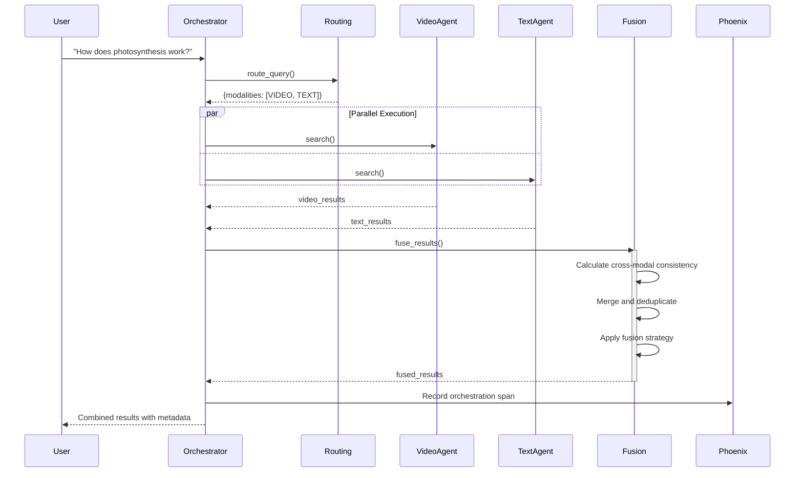
```mermaid
sequenceDiagram
    participant User
    participant Orchestrator
    participant Routing
    participant VideoAgent
    participant TextAgent
    participant Fusion
    participant Phoenix

    User->>Orchestrator: "How does photosynthesis work?"

    Orchestrator->>Routing: route_query()
    Routing-->>Orchestrator: {modalities: [VIDEO, TEXT]}

    par Parallel Execution
        Orchestrator->>VideoAgent: search()
        and
        Orchestrator->>TextAgent: search()
    end

    VideoAgent-->>Orchestrator: video_results
    TextAgent-->>Orchestrator: text_results

    Orchestrator->>Fusion: fuse_results()
    activate Fusion
    Fusion->>Fusion: Calculate cross-modal consistency
    Fusion->>Fusion: Merge and deduplicate
    Fusion->>Fusion: Apply fusion strategy
    Fusion-->>Orchestrator: fused_results
    deactivate Fusion

    Orchestrator->>Phoenix: Record orchestration span
    Orchestrator-->>User: Combined results with metadata
```

### Scenario 3: Memory-Enhanced Routing

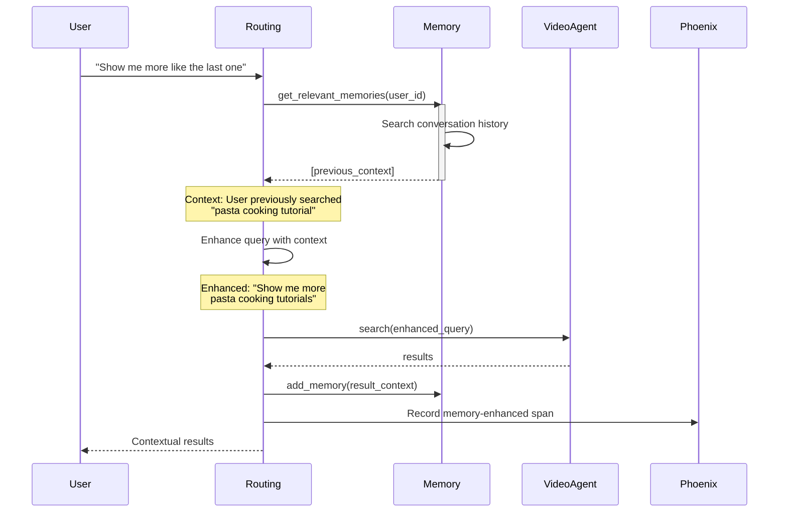
```mermaid
sequenceDiagram
    participant User
    participant Routing
    participant Memory
    participant VideoAgent
    participant Phoenix

    User->>Routing: "Show me more like the last one"

    Routing->>Memory: get_relevant_memories(user_id)
    activate Memory
    Memory->>Memory: Search conversation history
    Memory-->>Routing: [previous_context]
    deactivate Memory

    Note over Routing: Context: User previously searched<br/>"pasta cooking tutorial"

    Routing->>Routing: Enhance query with context
    Note over Routing: Enhanced: "Show me more<br/>pasta cooking tutorials"

    Routing->>VideoAgent: search(enhanced_query)
    VideoAgent-->>Routing: results

    Routing->>Memory: add_memory(result_context)
    Routing->>Phoenix: Record memory-enhanced span

    Routing-->>User: Contextual results
```

---

## Agent Orchestration Flows

### Scenario 4: Complex Multi-Agent Workflow

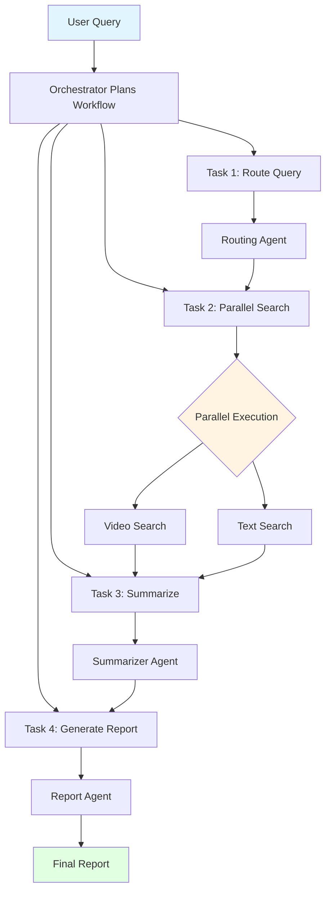
```mermaid
graph TB
    Start[User Query] --> Orchestrator[Orchestrator Plans Workflow]

    Orchestrator --> T1[Task 1: Route Query]
    Orchestrator --> T2[Task 2: Parallel Search]
    Orchestrator --> T3[Task 3: Summarize]
    Orchestrator --> T4[Task 4: Generate Report]

    T1 --> Routing[Routing Agent]
    Routing --> T2

    T2 --> ParallelBlock{Parallel Execution}
    ParallelBlock --> Video[Video Search]
    ParallelBlock --> Text[Text Search]

    Video --> T3
    Text --> T3

    T3 --> Summarizer[Summarizer Agent]
    Summarizer --> T4

    T4 --> Reporter[Report Agent]
    Reporter --> Result[Final Report]

    style Start fill:#e1f5ff
    style Result fill:#e1ffe1
    style ParallelBlock fill:#fff4e1
```

### Scenario 5: Task Dependency Resolution

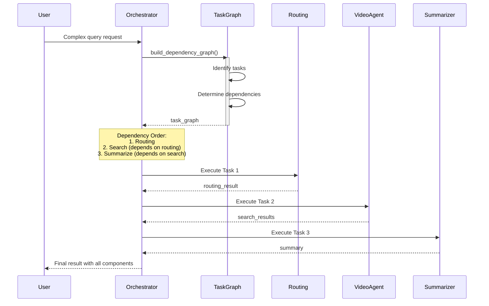
```mermaid
sequenceDiagram
    participant User
    participant Orchestrator
    participant TaskGraph
    participant Routing
    participant VideoAgent
    participant Summarizer

    User->>Orchestrator: Complex query request

    Orchestrator->>TaskGraph: build_dependency_graph()
    activate TaskGraph
    TaskGraph->>TaskGraph: Identify tasks
    TaskGraph->>TaskGraph: Determine dependencies
    TaskGraph-->>Orchestrator: task_graph
    deactivate TaskGraph

    Note over Orchestrator: Dependency Order:<br/>1. Routing<br/>2. Search (depends on routing)<br/>3. Summarize (depends on search)

    Orchestrator->>Routing: Execute Task 1
    Routing-->>Orchestrator: routing_result

    Orchestrator->>VideoAgent: Execute Task 2
    VideoAgent-->>Orchestrator: search_results

    Orchestrator->>Summarizer: Execute Task 3
    Summarizer-->>Orchestrator: summary

    Orchestrator-->>User: Final result with all components
```

### Scenario 6: Agent-to-Agent Communication

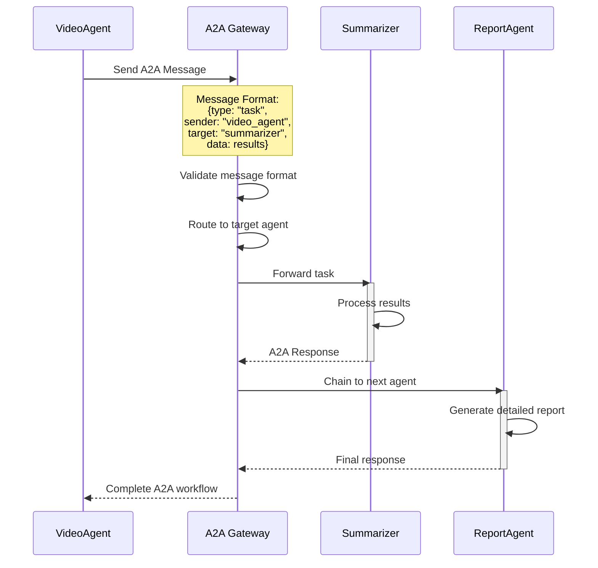
```mermaid
sequenceDiagram
    participant VideoAgent
    participant Gateway as A2A Gateway
    participant Summarizer
    participant ReportAgent

    VideoAgent->>Gateway: Send A2A Message
    Note over Gateway: Message Format:<br/>{type: "task",<br/>sender: "video_agent",<br/>target: "summarizer",<br/>data: results}

    Gateway->>Gateway: Validate message format
    Gateway->>Gateway: Route to target agent

    Gateway->>Summarizer: Forward task

    activate Summarizer
    Summarizer->>Summarizer: Process results
    Summarizer-->>Gateway: A2A Response
    deactivate Summarizer

    Gateway->>ReportAgent: Chain to next agent
    activate ReportAgent
    ReportAgent->>ReportAgent: Generate detailed report
    ReportAgent-->>Gateway: Final response
    deactivate ReportAgent

    Gateway-->>VideoAgent: Complete A2A workflow
```

---

## Optimization & Learning Flows

### Scenario 7: GRPO Optimization Cycle

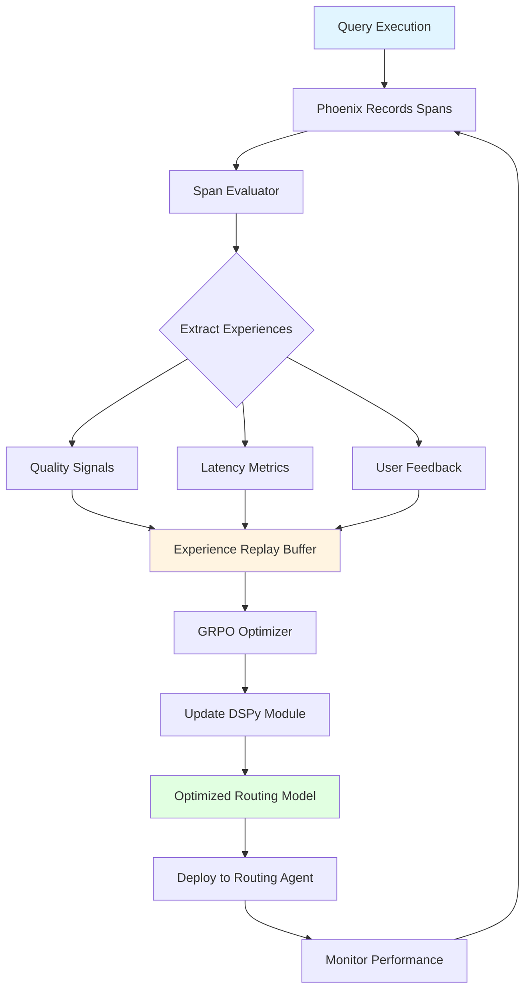
```mermaid
graph TB
    Start[Query Execution] --> Telemetry[Phoenix Records Spans]
    Telemetry --> SpanEval[Span Evaluator]

    SpanEval --> Extract{Extract Experiences}
    Extract --> Quality[Quality Signals]
    Extract --> Latency[Latency Metrics]
    Extract --> UserFeedback[User Feedback]

    Quality --> ExpReplay[Experience Replay Buffer]
    Latency --> ExpReplay
    UserFeedback --> ExpReplay

    ExpReplay --> GRPO[GRPO Optimizer]

    GRPO --> UpdateDSPy[Update DSPy Module]
    UpdateDSPy --> NewModel[Optimized Routing Model]

    NewModel --> Deploy[Deploy to Routing Agent]
    Deploy --> Monitor[Monitor Performance]

    Monitor --> Telemetry

    style Start fill:#e1f5ff
    style NewModel fill:#e1ffe1
    style ExpReplay fill:#fff4e1
```

### Scenario 8: Experience Collection & Optimization

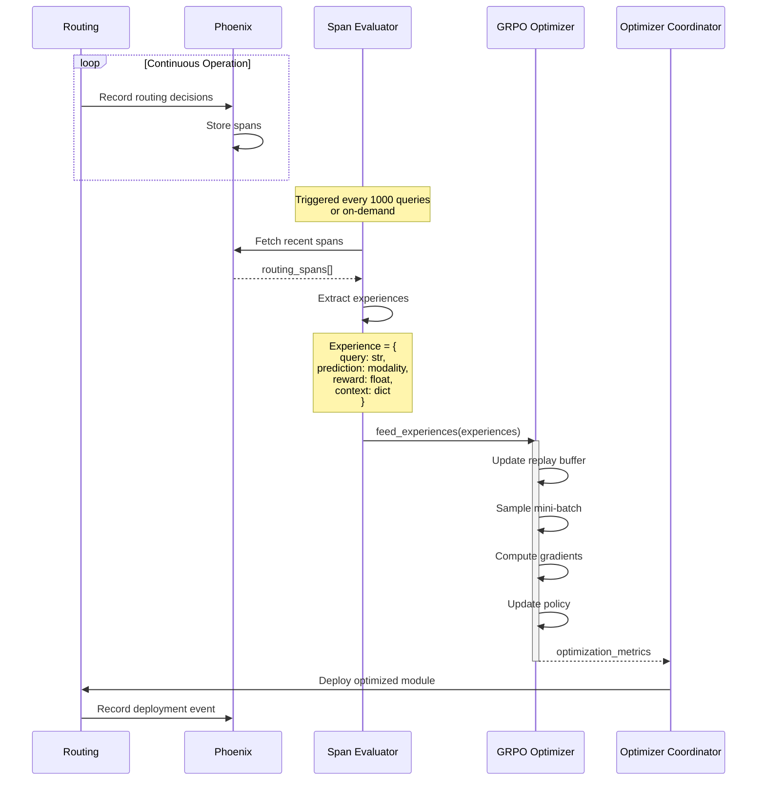
```mermaid
sequenceDiagram
    participant Routing
    participant Phoenix
    participant SpanEval as Span Evaluator
    participant GRPO as GRPO Optimizer
    participant Optimizer as Optimizer Coordinator

    loop Continuous Operation
        Routing->>Phoenix: Record routing decisions
        Phoenix->>Phoenix: Store spans
    end

    Note over SpanEval: Triggered every 1000 queries<br/>or on-demand

    SpanEval->>Phoenix: Fetch recent spans
    Phoenix-->>SpanEval: routing_spans[]

    SpanEval->>SpanEval: Extract experiences
    Note over SpanEval: Experience = {<br/>  query: str,<br/>  prediction: modality,<br/>  reward: float,<br/>  context: dict<br/>}

    SpanEval->>GRPO: feed_experiences(experiences)

    activate GRPO
    GRPO->>GRPO: Update replay buffer
    GRPO->>GRPO: Sample mini-batch
    GRPO->>GRPO: Compute gradients
    GRPO->>GRPO: Update policy
    GRPO-->>Optimizer: optimization_metrics
    deactivate GRPO

    Optimizer->>Routing: Deploy optimized module
    Routing->>Phoenix: Record deployment event
```

### Scenario 9: Cross-Modal Optimization

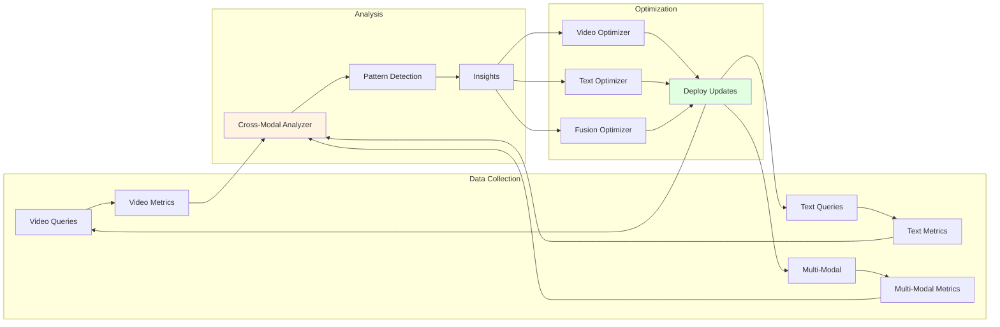
```mermaid
graph LR
    subgraph Data Collection
        V[Video Queries] --> VMetrics[Video Metrics]
        T[Text Queries] --> TMetrics[Text Metrics]
        M[Multi-Modal] --> MMetrics[Multi-Modal Metrics]
    end

    subgraph Analysis
        VMetrics --> Analyzer[Cross-Modal Analyzer]
        TMetrics --> Analyzer
        MMetrics --> Analyzer

        Analyzer --> Patterns[Pattern Detection]
        Patterns --> Insights[Insights]
    end

    subgraph Optimization
        Insights --> VidOpt[Video Optimizer]
        Insights --> TextOpt[Text Optimizer]
        Insights --> FusionOpt[Fusion Optimizer]

        VidOpt --> Deploy[Deploy Updates]
        TextOpt --> Deploy
        FusionOpt --> Deploy
    end

    Deploy --> V
    Deploy --> T
    Deploy --> M

    style Analyzer fill:#fff4e1
    style Deploy fill:#e1ffe1
```

---

## Evaluation & Experiment Flows

### Scenario 10: Phoenix Experiment Workflow

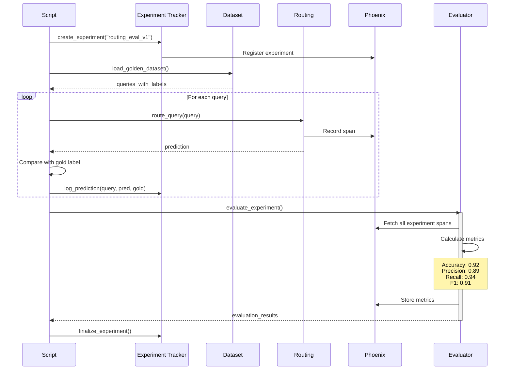
```mermaid
sequenceDiagram
    participant Script
    participant Tracker as Experiment Tracker
    participant Dataset
    participant Routing
    participant Phoenix
    participant Eval as Evaluator

    Script->>Tracker: create_experiment("routing_eval_v1")
    Tracker->>Phoenix: Register experiment

    Script->>Dataset: load_golden_dataset()
    Dataset-->>Script: queries_with_labels

    loop For each query
        Script->>Routing: route_query(query)
        Routing->>Phoenix: Record span
        Routing-->>Script: prediction

        Script->>Script: Compare with gold label
        Script->>Tracker: log_prediction(query, pred, gold)
    end

    Script->>Eval: evaluate_experiment()

    activate Eval
    Eval->>Phoenix: Fetch all experiment spans
    Eval->>Eval: Calculate metrics
    Note over Eval: Accuracy: 0.92<br/>Precision: 0.89<br/>Recall: 0.94<br/>F1: 0.91
    Eval->>Phoenix: Store metrics
    Eval-->>Script: evaluation_results
    deactivate Eval

    Script->>Tracker: finalize_experiment()
```

### Scenario 11: Routing Evaluator Integration

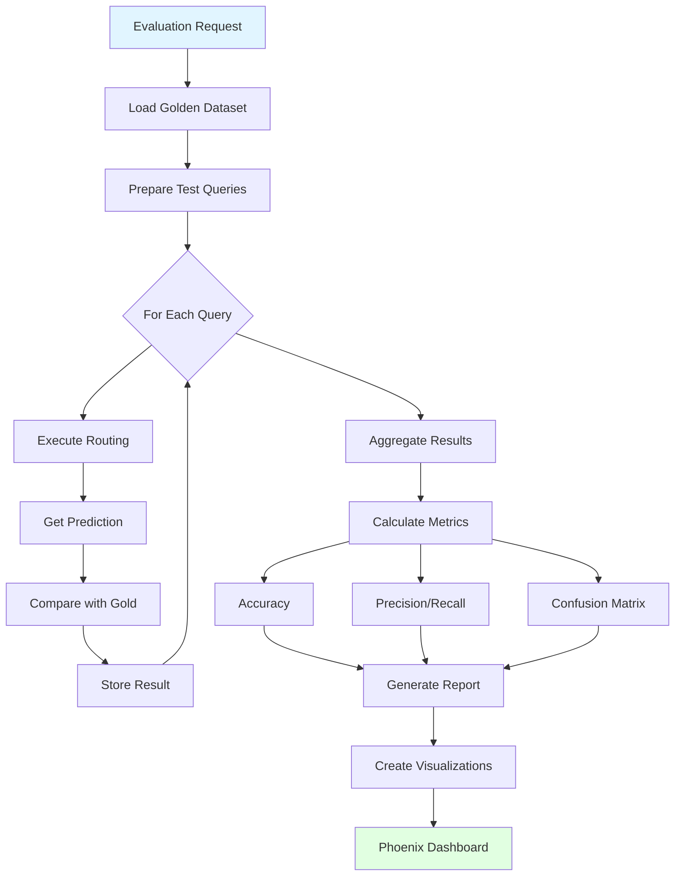
```mermaid
graph TB
    Start[Evaluation Request] --> LoadDataset[Load Golden Dataset]
    LoadDataset --> PrepQueries[Prepare Test Queries]

    PrepQueries --> Loop{For Each Query}

    Loop --> Execute[Execute Routing]
    Execute --> Predict[Get Prediction]
    Predict --> Compare[Compare with Gold]

    Compare --> StoreResult[Store Result]
    StoreResult --> Loop

    Loop --> Aggregate[Aggregate Results]

    Aggregate --> CalcMetrics[Calculate Metrics]
    CalcMetrics --> Accuracy[Accuracy]
    CalcMetrics --> Precision[Precision/Recall]
    CalcMetrics --> Confusion[Confusion Matrix]

    Accuracy --> Report[Generate Report]
    Precision --> Report
    Confusion --> Report

    Report --> Visualize[Create Visualizations]
    Visualize --> Dashboard[Phoenix Dashboard]

    style Start fill:#e1f5ff
    style Dashboard fill:#e1ffe1
```

### Scenario 12: Quality Evaluator for Experiments

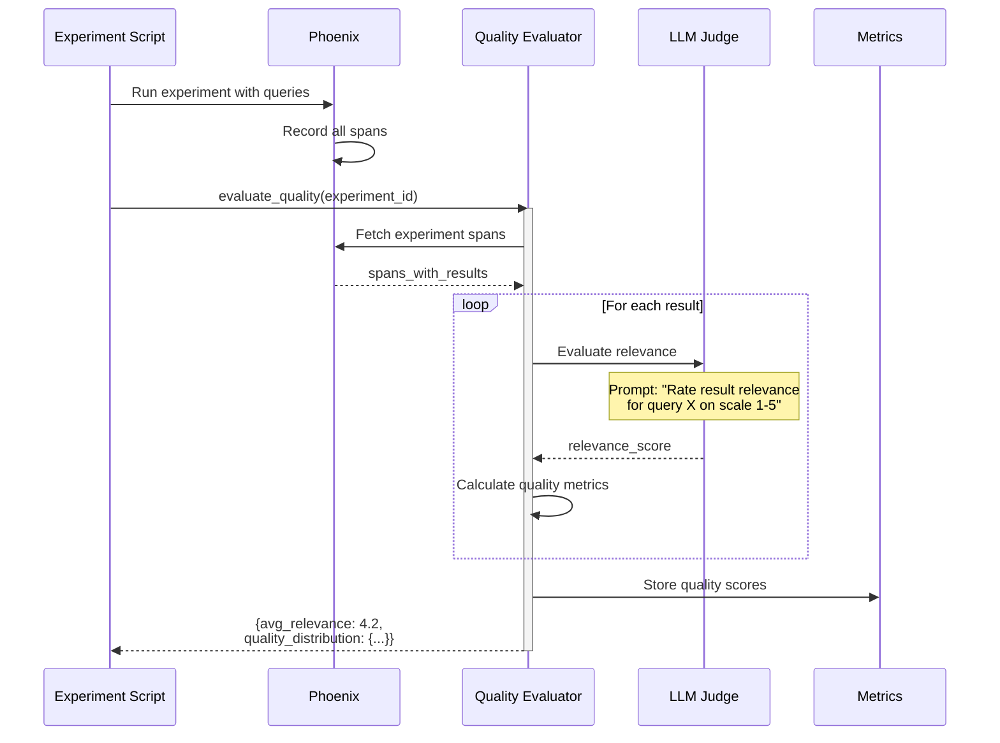
```mermaid
sequenceDiagram
    participant Exp as Experiment Script
    participant Phoenix
    participant QualityEval as Quality Evaluator
    participant LLM as LLM Judge
    participant Metrics

    Exp->>Phoenix: Run experiment with queries
    Phoenix->>Phoenix: Record all spans

    Exp->>QualityEval: evaluate_quality(experiment_id)

    activate QualityEval
    QualityEval->>Phoenix: Fetch experiment spans
    Phoenix-->>QualityEval: spans_with_results

    loop For each result
        QualityEval->>LLM: Evaluate relevance
        Note over LLM: Prompt: "Rate result relevance<br/>for query X on scale 1-5"
        LLM-->>QualityEval: relevance_score

        QualityEval->>QualityEval: Calculate quality metrics
    end

    QualityEval->>Metrics: Store quality scores
    QualityEval-->>Exp: {avg_relevance: 4.2,<br/>quality_distribution: {...}}
    deactivate QualityEval
```

---

## Memory & Context Flows

### Scenario 13: Conversation Memory Integration

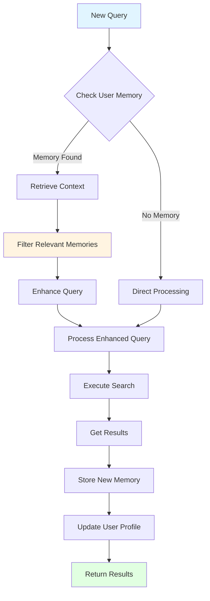
```mermaid
graph TB
    Query[New Query] --> CheckMemory{Check User Memory}

    CheckMemory -->|Memory Found| Retrieve[Retrieve Context]
    CheckMemory -->|No Memory| Direct[Direct Processing]

    Retrieve --> Relevant[Filter Relevant Memories]
    Relevant --> Enhance[Enhance Query]

    Enhance --> Process[Process Enhanced Query]
    Direct --> Process

    Process --> Execute[Execute Search]
    Execute --> Results[Get Results]

    Results --> Store[Store New Memory]
    Store --> Update[Update User Profile]

    Update --> Return[Return Results]

    style Query fill:#e1f5ff
    style Return fill:#e1ffe1
    style Relevant fill:#fff4e1
```

### Scenario 14: Memory Lifecycle

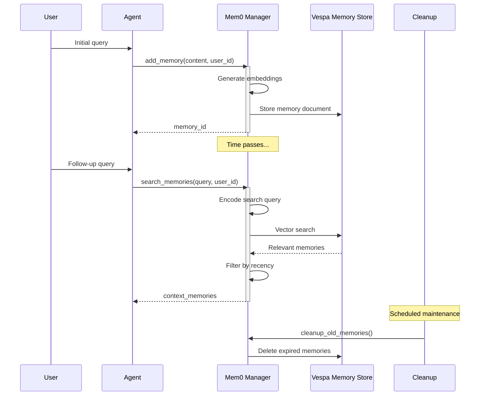
```mermaid
sequenceDiagram
    participant User
    participant Agent
    participant Memory as Mem0 Manager
    participant Vespa as Vespa Memory Store
    participant Cleanup

    User->>Agent: Initial query
    Agent->>Memory: add_memory(content, user_id)

    activate Memory
    Memory->>Memory: Generate embeddings
    Memory->>Vespa: Store memory document
    Memory-->>Agent: memory_id
    deactivate Memory

    Note over Memory: Time passes...

    User->>Agent: Follow-up query
    Agent->>Memory: search_memories(query, user_id)

    activate Memory
    Memory->>Memory: Encode search query
    Memory->>Vespa: Vector search
    Vespa-->>Memory: Relevant memories
    Memory->>Memory: Filter by recency
    Memory-->>Agent: context_memories
    deactivate Memory

    Note over Cleanup: Scheduled maintenance

    Cleanup->>Memory: cleanup_old_memories()
    Memory->>Vespa: Delete expired memories
```

### Scenario 15: Multi-Tenant Memory Isolation

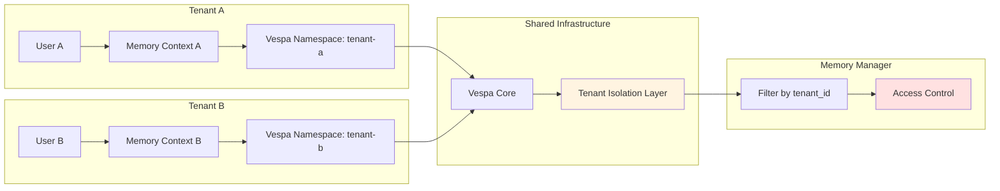
```mermaid
graph LR
    subgraph Tenant A
        UA[User A] --> MemA[Memory Context A]
        MemA --> VespaA[Vespa Namespace: tenant-a]
    end

    subgraph Tenant B
        UB[User B] --> MemB[Memory Context B]
        MemB --> VespaB[Vespa Namespace: tenant-b]
    end

    subgraph Shared Infrastructure
        VespaA --> VespaCore[Vespa Core]
        VespaB --> VespaCore

        VespaCore --> Isolation[Tenant Isolation Layer]
    end

    subgraph Memory Manager
        Isolation --> Filter[Filter by tenant_id]
        Filter --> Access[Access Control]
    end

    style Isolation fill:#fff4e1
    style Access fill:#ffe1e1
```

---

## Ingestion & Dataset Flows

### Scenario 16: Video Ingestion Pipeline

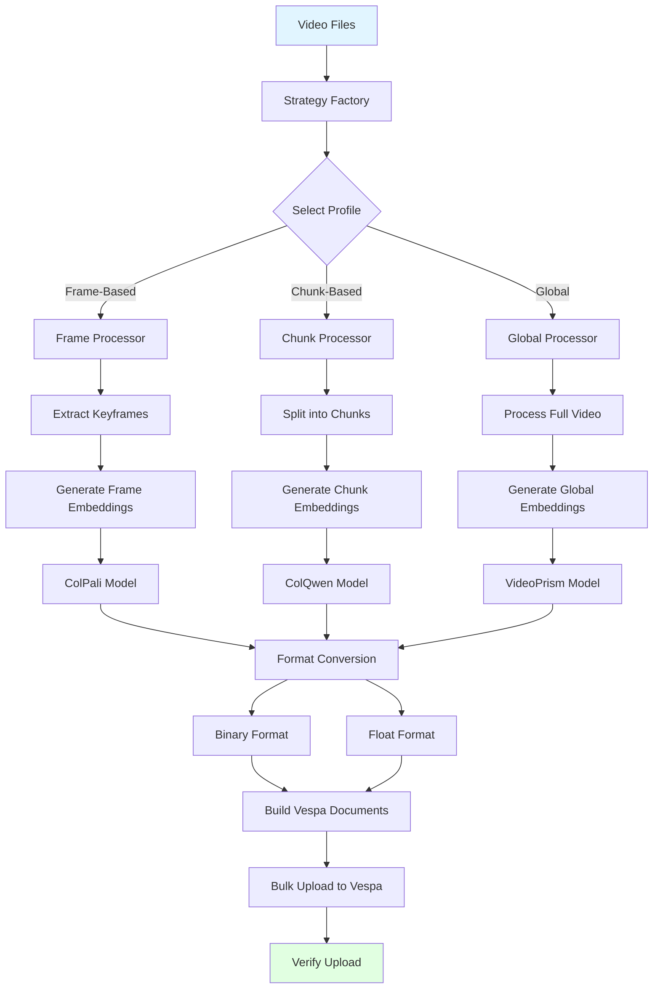
```mermaid
graph TB
    Input[Video Files] --> Strategy[Strategy Factory]

    Strategy --> Profile{Select Profile}
    Profile -->|Frame-Based| FrameProc[Frame Processor]
    Profile -->|Chunk-Based| ChunkProc[Chunk Processor]
    Profile -->|Global| GlobalProc[Global Processor]

    FrameProc --> Keyframes[Extract Keyframes]
    ChunkProc --> Chunks[Split into Chunks]
    GlobalProc --> FullVideo[Process Full Video]

    Keyframes --> EmbedFrame[Generate Frame Embeddings]
    Chunks --> EmbedChunk[Generate Chunk Embeddings]
    FullVideo --> EmbedGlobal[Generate Global Embeddings]

    EmbedFrame --> ColPali[ColPali Model]
    EmbedChunk --> ColQwen[ColQwen Model]
    EmbedGlobal --> VideoPrism[VideoPrism Model]

    ColPali --> Format[Format Conversion]
    ColQwen --> Format
    VideoPrism --> Format

    Format --> Binary[Binary Format]
    Format --> Float[Float Format]

    Binary --> Build[Build Vespa Documents]
    Float --> Build

    Build --> Upload[Bulk Upload to Vespa]
    Upload --> Verify[Verify Upload]

    style Input fill:#e1f5ff
    style Verify fill:#e1ffe1
```

### Scenario 17: Dataset Extraction for Evaluation

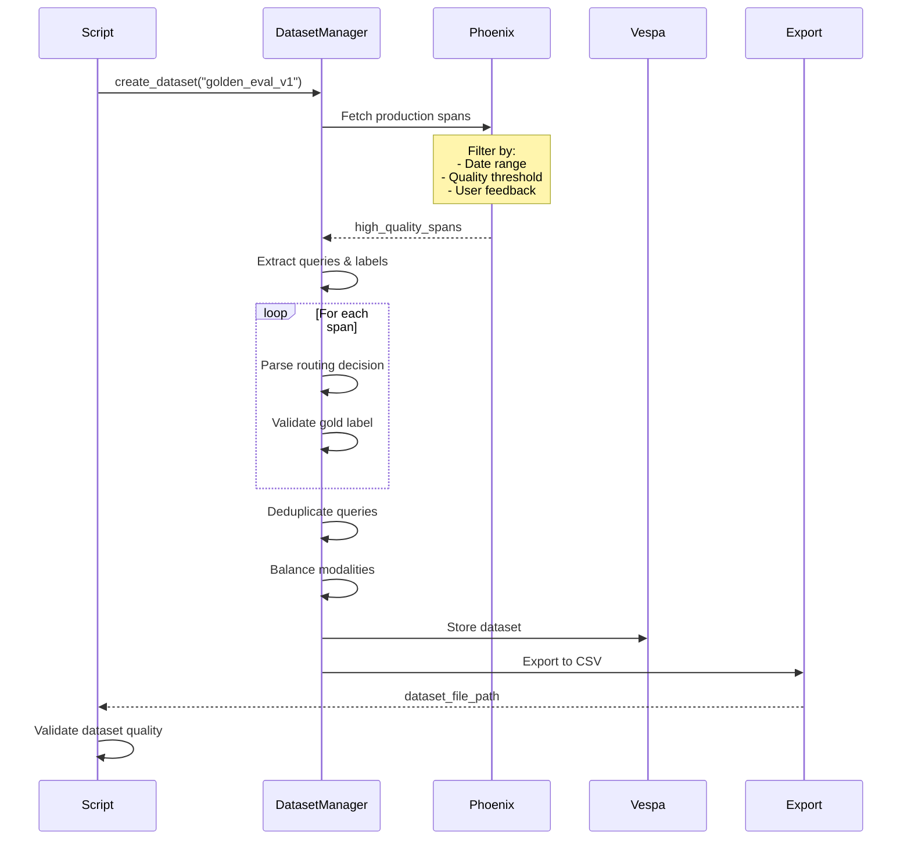
```mermaid
sequenceDiagram
    participant Script
    participant DatasetManager
    participant Phoenix
    participant Vespa
    participant Export

    Script->>DatasetManager: create_dataset("golden_eval_v1")

    DatasetManager->>Phoenix: Fetch production spans
    Note over Phoenix: Filter by:<br/>- Date range<br/>- Quality threshold<br/>- User feedback
    Phoenix-->>DatasetManager: high_quality_spans

    DatasetManager->>DatasetManager: Extract queries & labels

    loop For each span
        DatasetManager->>DatasetManager: Parse routing decision
        DatasetManager->>DatasetManager: Validate gold label
    end

    DatasetManager->>DatasetManager: Deduplicate queries
    DatasetManager->>DatasetManager: Balance modalities

    DatasetManager->>Vespa: Store dataset
    DatasetManager->>Export: Export to CSV

    Export-->>Script: dataset_file_path

    Script->>Script: Validate dataset quality
```

### Scenario 18: Ingestion Strategy Resolution

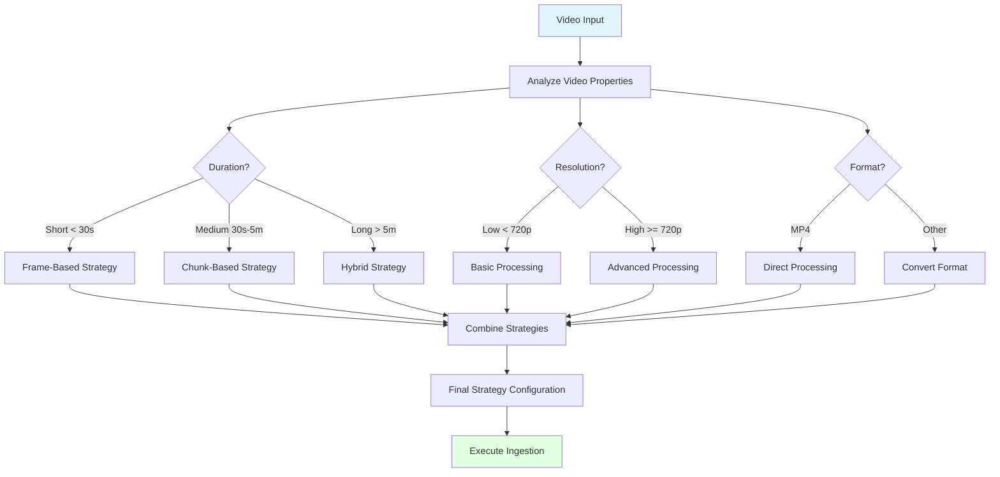
```mermaid
graph TB
    Start[Video Input] --> Analyzer[Analyze Video Properties]

    Analyzer --> Duration{Duration?}
    Analyzer --> Resolution{Resolution?}
    Analyzer --> Format{Format?}

    Duration -->|Short < 30s| ShortStrategy[Frame-Based Strategy]
    Duration -->|Medium 30s-5m| MediumStrategy[Chunk-Based Strategy]
    Duration -->|Long > 5m| LongStrategy[Hybrid Strategy]

    Resolution -->|Low < 720p| LowRes[Basic Processing]
    Resolution -->|High >= 720p| HighRes[Advanced Processing]

    Format -->|MP4| DirectProcess[Direct Processing]
    Format -->|Other| Convert[Convert Format]

    ShortStrategy --> Combine[Combine Strategies]
    MediumStrategy --> Combine
    LongStrategy --> Combine
    LowRes --> Combine
    HighRes --> Combine
    DirectProcess --> Combine
    Convert --> Combine

    Combine --> FinalStrategy[Final Strategy Configuration]
    FinalStrategy --> Execute[Execute Ingestion]

    style Start fill:#e1f5ff
    style Execute fill:#e1ffe1
```

---

## Production Deployment Flows

### Scenario 19: Complete Deployment Workflow

```mermaid
graph TB
    Code[Code Changes] --> Tests[Run Tests]
    Tests --> UnitPass{Unit Tests Pass?}

    UnitPass -->|No| Fix[Fix Issues]
    Fix --> Tests

    UnitPass -->|Yes| Integration[Integration Tests]
    Integration --> IntPass{Integration Pass?}

    IntPass -->|No| Fix
    IntPass -->|Yes| Optimize[Run Optimization]

    Optimize --> TrainModels[Train/Update Models]
    TrainModels --> ValidateModels[Validate Models]

    ValidateModels --> Artifacts[Build Artifacts]
    Artifacts --> Stage[Deploy to Staging]

    Stage --> StageTest[Staging Tests]
    StageTest --> StagePass{Tests Pass?}

    StagePass -->|No| Rollback[Rollback]
    StagePass -->|Yes| Prod[Deploy to Production]

    Prod --> Monitor[Monitor Metrics]
    Monitor --> Health{Healthy?}

    Health -->|No| Rollback
    Health -->|Yes| Complete[Deployment Complete]

    style Code fill:#e1f5ff
    style Complete fill:#e1ffe1
    style Rollback fill:#ffe1e1
```

### Scenario 20: Blue-Green Deployment with A/B Testing

```mermaid
sequenceDiagram
    participant Traffic
    participant LB as Load Balancer
    participant Blue as Blue Environment
    participant Green as Green Environment
    participant Monitor
    participant Evaluator

    Note over Blue: Current Production
    Note over Green: New Version Deployed

    Traffic->>LB: User requests
    LB->>Blue: 90% traffic
    LB->>Green: 10% traffic (A/B test)

    Blue-->>Monitor: Metrics (baseline)
    Green-->>Monitor: Metrics (new version)

    Monitor->>Evaluator: Compare performance

    alt Performance Improved
        Evaluator->>LB: Increase Green traffic
        LB->>Blue: 50% traffic
        LB->>Green: 50% traffic

        Note over Evaluator: Continue monitoring...

        Evaluator->>LB: Full cutover
        LB->>Green: 100% traffic

        Evaluator->>Blue: Decommission old version
    else Performance Degraded
        Evaluator->>LB: Rollback
        LB->>Blue: 100% traffic

        Evaluator->>Green: Debug and fix
    end
```

---

## Key Takeaways

### System Design Principles
1. **Modular Architecture**: Each agent has clear responsibilities
2. **Observability First**: Phoenix telemetry integrated throughout
3. **Optimization Loop**: Continuous learning from production data
4. **Multi-Tenant Isolation**: Complete separation at all layers
5. **Graceful Degradation**: Fallbacks at every level

### Critical Integration Points
1. **Phoenix ↔ GRPO**: Automatic experience extraction
2. **Mem0 ↔ Routing**: Context-aware decision making
3. **Vespa ↔ Agents**: Unified search backend
4. **Orchestrator ↔ Agents**: Flexible workflow execution

### Data Flow Patterns
1. **Request Flow**: User → Gateway → Orchestrator → Agents → Backends
2. **Optimization Flow**: Phoenix → Evaluator → Optimizer → Agents
3. **Memory Flow**: Query → Memory → Context → Enhanced Query
4. **Ingestion Flow**: Video → Strategy → Processing → Vespa

---

**Related Guides:**
- [00_ARCHITECTURE_OVERVIEW.md](./00_ARCHITECTURE_OVERVIEW.md) - High-level architecture
- [01_AGENTS_MODULE.md](./01_AGENTS_MODULE.md) - Agent implementations
- [02_ROUTING_MODULE.md](./02_ROUTING_MODULE.md) - Routing strategies
- [17_INSTRUMENTATION.md](./17_INSTRUMENTATION.md) - Telemetry and observability

**Note:** All diagrams use Mermaid syntax and can be rendered in:
- GitHub markdown files
- IDEs with Mermaid support (VS Code, IntelliJ)
- Documentation sites (GitBook, Docusaurus)
- Mermaid Live Editor (https://mermaid.live)
