# Cogniverse System Flows & Architecture Scenarios

---

## Table of Contents
1. [Component Interaction](#component-interaction-with-package-boundaries)
2. [Full Agent Roster](#full-agent-roster)
3. [Query Processing Flows](#query-processing-flows)
4. [Agent Orchestration Flows](#agent-orchestration-flows)
5. [Multi-Tenant Flows](#multi-tenant-flows)
6. [Optimization & Learning Flows](#optimization-learning-flows)
7. [Evaluation & Experiment Flows](#evaluation-experiment-flows)
8. [Memory & Context Flows](#memory-context-flows)
9. [Ingestion & Dataset Flows](#ingestion-dataset-flows)
10. [Production Deployment Flows](#production-deployment-flows)

---

## Component Interaction with Package Boundaries

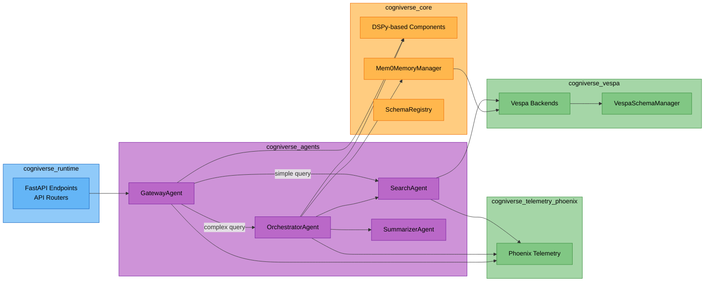
```mermaid
flowchart LR
    subgraph Runtime[<span style='color:#000'>cogniverse_runtime</span>]
        API[<span style='color:#000'>FastAPI Endpoints<br/>API Routers</span>]
    end

    subgraph AgentsPkg[<span style='color:#000'>cogniverse_agents</span>]
        GW[<span style='color:#000'>GatewayAgent</span>]
        ORC[<span style='color:#000'>OrchestratorAgent</span>]
        SA[<span style='color:#000'>SearchAgent</span>]
        SUM[<span style='color:#000'>SummarizerAgent</span>]
    end

    subgraph CorePkg[<span style='color:#000'>cogniverse_core</span>]
        DSPy[<span style='color:#000'>DSPy-based Components</span>]
        Memory[<span style='color:#000'>Mem0MemoryManager</span>]
        SchemaReg[<span style='color:#000'>SchemaRegistry</span>]
    end

    subgraph TelemetryPkg[<span style='color:#000'>cogniverse_telemetry_phoenix</span>]
        Phoenix[<span style='color:#000'>Phoenix Telemetry</span>]
    end

    subgraph VespaPkg[<span style='color:#000'>cogniverse_vespa</span>]
        SchemaMgr[<span style='color:#000'>VespaSchemaManager</span>]
        VespaBackend[<span style='color:#000'>Vespa Backends</span>]
    end

    API --> GW
    GW -->|simple query| SA
    GW -->|complex query| ORC
    ORC --> SA
    ORC --> SUM
    ORC --> Memory

    GW --> DSPy
    ORC --> DSPy
    SA --> Phoenix
    ORC --> Phoenix
    GW --> Phoenix

    SA --> VespaBackend

    VespaBackend --> SchemaMgr
    Memory --> VespaBackend

    style Runtime fill:#90caf9,stroke:#1565c0,color:#000
    style API fill:#64b5f6,stroke:#1565c0,color:#000
    style AgentsPkg fill:#ce93d8,stroke:#7b1fa2,color:#000
    style GW fill:#ba68c8,stroke:#7b1fa2,color:#000
    style ORC fill:#ba68c8,stroke:#7b1fa2,color:#000
    style SA fill:#ba68c8,stroke:#7b1fa2,color:#000
    style SUM fill:#ba68c8,stroke:#7b1fa2,color:#000
    style CorePkg fill:#ffcc80,stroke:#ef6c00,color:#000
    style DSPy fill:#ffb74d,stroke:#ef6c00,color:#000
    style Memory fill:#ffb74d,stroke:#ef6c00,color:#000
    style SchemaReg fill:#ffb74d,stroke:#ef6c00,color:#000
    style TelemetryPkg fill:#a5d6a7,stroke:#388e3c,color:#000
    style Phoenix fill:#81c784,stroke:#388e3c,color:#000
    style VespaPkg fill:#a5d6a7,stroke:#388e3c,color:#000
    style SchemaMgr fill:#81c784,stroke:#388e3c,color:#000
    style VespaBackend fill:#81c784,stroke:#388e3c,color:#000
```

---

## Full Agent Roster

`libs/agents/cogniverse_agents/` implements 23 A2A agents, declared in `configs/config.json` under `agents.*` (url/port, capabilities, modalities, enabled). The scenarios below illustrate representative flows through a subset of these agents; this section is the complete roster.

```mermaid
flowchart TB
    subgraph SearchGroup[<span style='color:#000'>Search & Analysis Agents</span>]
        search_agent[<span style='color:#000'>search_agent :8002</span>]
        image_search_agent[<span style='color:#000'>image_search_agent :8006</span>]
        document_agent[<span style='color:#000'>document_agent :8008</span>]
        text_analysis_agent[<span style='color:#000'>text_analysis_agent :8003</span>]
        audio_analysis_agent[<span style='color:#000'>audio_analysis_agent :8007</span>]
    end

    subgraph GenGroup[<span style='color:#000'>Generation & Routing Agents</span>]
        gateway_agent[<span style='color:#000'>gateway_agent :8000</span>]
        orchestrator_agent[<span style='color:#000'>orchestrator_agent :8013</span>]
        summarizer_agent[<span style='color:#000'>summarizer_agent :8004</span>]
        detailed_report_agent[<span style='color:#000'>detailed_report_agent :8005</span>]
        profile_selection_agent[<span style='color:#000'>profile_selection_agent :8000*</span>]
        query_enhancement_agent[<span style='color:#000'>query_enhancement_agent :8000*</span>]
        entity_extraction_agent[<span style='color:#000'>entity_extraction_agent :8000*</span>]
    end

    subgraph ResearchGroup[<span style='color:#000'>Research & Coding Agents</span>]
        deep_research_agent[<span style='color:#000'>deep_research_agent :8009</span>]
        coding_agent[<span style='color:#000'>coding_agent :8010</span>]
    end

    subgraph KGGroup[<span style='color:#000'>Knowledge-Graph & Reasoning Agents</span>]
        citation_tracing_agent[<span style='color:#000'>citation_tracing_agent :8019 (disabled)</span>]
        contradiction_reconciliation_agent[<span style='color:#000'>contradiction_reconciliation_agent :8020 (disabled)</span>]
        multi_document_synthesis_agent[<span style='color:#000'>multi_document_synthesis_agent :8021 (disabled)</span>]
        kg_traversal_agent[<span style='color:#000'>kg_traversal_agent :8022 (disabled)</span>]
        temporal_reasoning_agent[<span style='color:#000'>temporal_reasoning_agent :8025 (disabled)</span>]
        knowledge_summarization_agent[<span style='color:#000'>knowledge_summarization_agent :8026 (disabled)</span>]
        audit_explanation_agent[<span style='color:#000'>audit_explanation_agent :8027</span>]
    end

    subgraph FedGroup[<span style='color:#000'>Multi-Tenant & Federation Agents</span>]
        cross_tenant_comparison_agent[<span style='color:#000'>cross_tenant_comparison_agent :8023 (disabled)</span>]
        federated_query_agent[<span style='color:#000'>federated_query_agent :8024 (disabled)</span>]
    end

    style SearchGroup fill:#90caf9,stroke:#1565c0,color:#000
    style search_agent fill:#64b5f6,stroke:#1565c0,color:#000
    style image_search_agent fill:#64b5f6,stroke:#1565c0,color:#000
    style document_agent fill:#64b5f6,stroke:#1565c0,color:#000
    style text_analysis_agent fill:#64b5f6,stroke:#1565c0,color:#000
    style audio_analysis_agent fill:#64b5f6,stroke:#1565c0,color:#000

    style GenGroup fill:#ce93d8,stroke:#7b1fa2,color:#000
    style gateway_agent fill:#ba68c8,stroke:#7b1fa2,color:#000
    style orchestrator_agent fill:#ba68c8,stroke:#7b1fa2,color:#000
    style summarizer_agent fill:#ba68c8,stroke:#7b1fa2,color:#000
    style detailed_report_agent fill:#ba68c8,stroke:#7b1fa2,color:#000
    style profile_selection_agent fill:#ba68c8,stroke:#7b1fa2,color:#000
    style query_enhancement_agent fill:#ba68c8,stroke:#7b1fa2,color:#000
    style entity_extraction_agent fill:#ba68c8,stroke:#7b1fa2,color:#000

    style ResearchGroup fill:#a5d6a7,stroke:#388e3c,color:#000
    style deep_research_agent fill:#81c784,stroke:#388e3c,color:#000
    style coding_agent fill:#81c784,stroke:#388e3c,color:#000

    style KGGroup fill:#ffcc80,stroke:#ef6c00,color:#000
    style citation_tracing_agent fill:#ffb74d,stroke:#ef6c00,color:#000
    style contradiction_reconciliation_agent fill:#ffb74d,stroke:#ef6c00,color:#000
    style multi_document_synthesis_agent fill:#ffb74d,stroke:#ef6c00,color:#000
    style kg_traversal_agent fill:#ffb74d,stroke:#ef6c00,color:#000
    style temporal_reasoning_agent fill:#ffb74d,stroke:#ef6c00,color:#000
    style knowledge_summarization_agent fill:#ffb74d,stroke:#ef6c00,color:#000
    style audit_explanation_agent fill:#ffb74d,stroke:#ef6c00,color:#000

    style FedGroup fill:#b0bec5,stroke:#546e7a,color:#000
    style cross_tenant_comparison_agent fill:#90a4ae,stroke:#546e7a,color:#000
    style federated_query_agent fill:#90a4ae,stroke:#546e7a,color:#000
```

`*` gateway/entity_extraction/query_enhancement/profile_selection all resolve to `:8000` in `configs/config.json` — they run as in-process helpers dispatched by `AgentDispatcher` rather than standalone HTTP services (their code-level `__init__` defaults differ: 8014/8010/8012/8011 respectively, but the live config value is what `AgentDispatcher` actually uses).

### Search & Analysis Agents

| Agent | Port | Enabled | What it does |
|---|---|---|---|
| `search_agent` | 8002 | Yes | Multi-modal retrieval across video/image/text/audio/document via Vespa, with DSPy query rewriting, RRF ensemble fusion across profiles/query-variants, and optional RLM synthesis over large result sets. |
| `image_search_agent` | 8006 | Yes | ColPali multi-vector image similarity search (semantic or hybrid BM25+ColPali) plus image-to-image lookup via a ColPaliQueryEncoder. |
| `document_agent` | 8008 | Yes | Dual-strategy document search — ColPali visual (page-as-image), ColBERT/BM25 text, or hybrid — with keyword-based auto strategy selection. |
| `text_analysis_agent` | 8003 | Yes | Runtime-configurable DSPy text analysis (sentiment/summary/entities) with per-tenant persisted `AgentConfig` and a FastAPI `/analyze` endpoint. |
| `audio_analysis_agent` | 8007 | Yes | Whisper transcription (sidecar or in-process) plus Vespa audio search supporting transcript (BM25), acoustic (CLAP nearest-neighbor), and hybrid modes. |

### Generation & Routing Agents

| Agent | Port | Enabled | What it does |
|---|---|---|---|
| `gateway_agent` | 8000 | Yes | LLM-free front door: GLiNER + deterministic keyword fallback classify modality/complexity and route simple queries directly or hand off complex ones to the orchestrator. |
| `orchestrator_agent` | 8013 | Yes | Two-phase coordinator — DSPy planning then A2A-HTTP action fan-out to sub-agents, with checkpoint/resume, sufficiency gating, and cross-modal fusion. |
| `summarizer_agent` | 8004 | Yes | Produces structured summaries (brief/comprehensive/bullet points) via DSPy with a thinking phase and VLM visual analysis. |
| `detailed_report_agent` | 8005 | Yes | Generates comprehensive reports (executive summary, findings, technical + visual analysis, recommendations) with optional RLM synthesis. |
| `profile_selection_agent` | 8000* | Yes | DSPy-driven backend profile selection with a heuristic fallback and up to 3 alternative candidates. |
| `query_enhancement_agent` | 8000* | Yes | Expands/rewrites queries (synonyms, context, RRF variants) via DSPy, folding in upstream entity-extraction output. |
| `entity_extraction_agent` | 8000* | Yes | Tiered NER — fast GLiNER + SpaCy path (no LLM) with a DSPy ChainOfThought fallback. |

### Research & Coding Agents

| Agent | Port | Enabled | What it does |
|---|---|---|---|
| `deep_research_agent` | 8009 | Yes | Decompose &rarr; parallel-search &rarr; evaluate &rarr; (iterate) &rarr; synthesize loop producing a cited report. |
| `coding_agent` | 8010 | Yes | Search &rarr; plan &rarr; generate &rarr; execute &rarr; evaluate loop; generated code always runs inside an OpenShell sandbox. |

### Knowledge-Graph & Reasoning Agents

| Agent | Port | Enabled | What it does |
|---|---|---|---|
| `citation_tracing_agent` | 8019 | No | Read-only BFS walk of a memory's provenance chain back to primary sources (`ProvenanceWalker`). |
| `contradiction_reconciliation_agent` | 8020 | No | Applies a knowledge schema's contradiction policy (latest_wins/trust_ranked/preserve_both) to reconcile a conflicting memory set. |
| `multi_document_synthesis_agent` | 8021 | No | Synthesizes a coherent answer across N source documents while preserving the citation graph; can persist the result as a new provenance-linked memory. |
| `kg_traversal_agent` | 8022 | No | BFS-walks `kg_node`/`kg_edge` memories from a seed entity into a node+edge graph view, honoring max depth/edges and relation allowlists. |
| `temporal_reasoning_agent` | 8025 | No | Compares a subject's knowledge across explicit time windows using `provenance.written_at`, reporting a content-signature diff per window. |
| `knowledge_summarization_agent` | 8026 | No | Distills a knowledge subgraph into a citation-aware summary, with optional admin-gated promotion to the org trunk. |
| `audit_explanation_agent` | 8027 | Yes | Explains why an answer memory was produced — its derivation chain, per-source trust, and active contradictions. |

### Multi-Tenant & Federation Agents

| Agent | Port | Enabled | What it does |
|---|---|---|---|
| `cross_tenant_comparison_agent` | 8023 | No | Compares per-tenant views of one subject across tenants in an org via the federation read path, enforcing org-scoped ACLs. |
| `federated_query_agent` | 8024 | No | Answers a free-text query by aggregating federated reads across tenants in the same org, with an optional RLM summarizer. |

The knowledge-tier and multi-tenant/federation agents (ports 8019–8027, mostly `enabled: false`) are reached via `/admin/tenants/{tenant_id}/knowledge/*` REST routes (`routers/knowledge.py`), not the primary A2A query path used by Scenarios 1–6 below.

---

## Query Processing Flows

### Scenario 1: Simple Video Search with Tenant Context

A "simple" query never reaches the orchestrator: `AgentDispatcher._execute_gateway_task` runs `GatewayAgent` in-process, and for a `(video, raw_results)` classification, `SIMPLE_ROUTE_MAP` routes straight to `search_agent` — also instantiated and called in-process via `_execute_search_task` (no network hop between gateway and search agent). The separate `POST /search/` REST route (`routers/search.py`) is a lower-level path that calls `SearchService` directly and never touches the agent/gateway system at all; it is not shown here.

```mermaid
sequenceDiagram
    participant User
    participant Runtime as cogniverse_runtime<br/>AgentDispatcher
    participant Gateway as GatewayAgent<br/>cogniverse_agents (in-process)
    participant SearchAgent as SearchAgent<br/>cogniverse_agents (in-process)
    participant Vespa as Vespa Backend<br/>cogniverse_vespa
    participant Phoenix as Phoenix Telemetry<br/>cogniverse_telemetry_phoenix

    User->>Runtime: POST /agents/gateway_agent/process<br/>{"query": "cooking videos", "tenant_id": "acme"}

    Note over Runtime: require_tenant_id validates tenant_id="acme"

    Runtime->>Gateway: GatewayAgent._process_impl(GatewayInput)

    activate Gateway
    Note over Gateway: GLiNER + MODALITY_KEYWORDS classify<br/>modality=video, generation_type=raw_results<br/>complexity=simple (no LLM call)
    Gateway->>Phoenix: Record gateway span (tenant context)
    Gateway-->>Runtime: routed_to="search_agent"
    deactivate Gateway

    Note over Runtime: SIMPLE_ROUTE_MAP[(video, raw_results)]<br/>= search_agent &rarr; _execute_search_task (in-process)

    Runtime->>SearchAgent: SearchAgent._process_impl(SearchInput)

    activate SearchAgent
    Note over SearchAgent: VespaSchemaManager.get_tenant_schema_name()<br/>called internally
    SearchAgent->>SearchAgent: Encode query<br/>(ColPali/VideoPrism/ColQwen)
    SearchAgent->>Vespa: query with tenant schema<br/>(tenant_id="acme")
    Note over Vespa: Searches tenant-specific schema<br/>(e.g., video_colpali_smol500_mv_frame_acme)
    Vespa-->>SearchAgent: Top results (tenant-isolated)
    SearchAgent->>SearchAgent: Rerank results
    SearchAgent->>Phoenix: Record search span
    SearchAgent-->>Runtime: SearchOutput{results: [...]}
    deactivate SearchAgent

    Runtime-->>User: {status: "success", agent: "gateway_agent",<br/>downstream_result: {...}}
```

### Scenario 2: Multi-Modal Query with Fusion

```mermaid
sequenceDiagram
    participant User
    participant Runtime as cogniverse_runtime
    participant Orchestrator as OrchestratorAgent<br/>cogniverse_agents
    participant SearchAgent as SearchAgent<br/>cogniverse_agents
    participant Summarizer as SummarizerAgent<br/>cogniverse_agents
    participant Phoenix as Phoenix<br/>cogniverse_telemetry_phoenix

    User->>Runtime: POST /agents/orchestrator_agent/process<br/>{query: "How does photosynthesis work?", tenant_id="startup"}

    Runtime->>Orchestrator: OrchestratorAgent._process_impl(OrchestratorInput)<br/>(in-process; gateway classified this "both"/complex)

    Note over Orchestrator: Planning Phase: DSPy planner<br/>analyzes query and creates<br/>execution plan via OrchestrationSignature

    par Parallel Execution (A2A HTTP via execute_step)
        Orchestrator->>SearchAgent: POST /agents/search_agent/process<br/>{query, tenant_id="startup"}
        and
        Orchestrator->>Summarizer: POST /agents/summarizer_agent/process<br/>{query, tenant_id="startup"}
    end

    SearchAgent-->>Orchestrator: search_results
    Summarizer-->>Orchestrator: summary_results

    Orchestrator->>Orchestrator: Aggregate results
    Orchestrator->>Phoenix: Record orchestration span
    Orchestrator-->>Runtime: Combined results
    Runtime-->>User: Results with metadata
```

### Scenario 3: Memory-Enhanced Query Processing

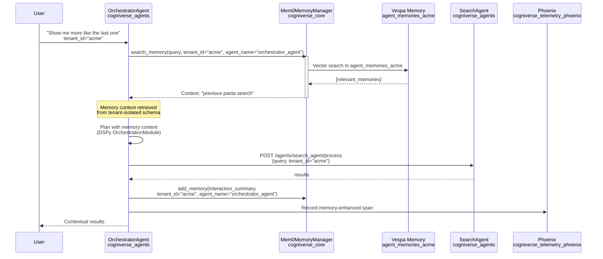
```mermaid
sequenceDiagram
    participant User
    participant Orchestrator as OrchestratorAgent<br/>cogniverse_agents
    participant Memory as Mem0MemoryManager<br/>cogniverse_core
    participant Vespa as Vespa Memory<br/>agent_memories_acme
    participant SearchAgent as SearchAgent<br/>cogniverse_agents
    participant Phoenix as Phoenix<br/>cogniverse_telemetry_phoenix

    User->>Orchestrator: "Show me more like the last one"<br/>tenant_id="acme"

    Orchestrator->>Memory: search_memory(query, tenant_id="acme", agent_name="orchestrator_agent")
    activate Memory
    Memory->>Vespa: Vector search in agent_memories_acme
    Vespa-->>Memory: [relevant_memories]
    Memory-->>Orchestrator: Context: "previous pasta search"
    deactivate Memory

    Note over Orchestrator: Memory context retrieved<br/>from tenant-isolated schema

    Orchestrator->>Orchestrator: Plan with memory context<br/>(DSPy OrchestrationModule)

    Orchestrator->>SearchAgent: POST /agents/search_agent/process<br/>{query, tenant_id="acme"}
    SearchAgent-->>Orchestrator: results

    Orchestrator->>Memory: add_memory(interaction_summary,<br/>tenant_id="acme", agent_name="orchestrator_agent")
    Orchestrator->>Phoenix: Record memory-enhanced span

    Orchestrator-->>User: Contextual results
```

---

## Agent Orchestration Flows

### Scenario 4: Complex Multi-Agent Workflow with SDK Packages

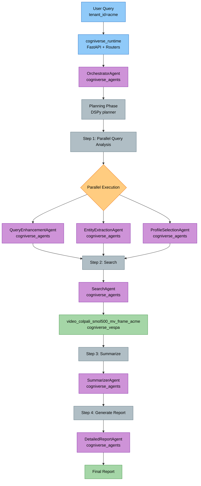
```mermaid
flowchart TB
    Start[<span style='color:#000'>User Query<br/>tenant_id=acme</span>] --> Runtime[<span style='color:#000'>cogniverse_runtime<br/>FastAPI + Routers</span>]

    Runtime --> Orchestrator[<span style='color:#000'>OrchestratorAgent<br/>cogniverse_agents</span>]

    Orchestrator --> T1[<span style='color:#000'>Planning Phase<br/>DSPy planner</span>]

    T1 --> T2[<span style='color:#000'>Step 1: Parallel Query Analysis</span>]
    T2 --> ParallelBlock{<span style='color:#000'>Parallel Execution</span>}
    ParallelBlock --> QEnh[<span style='color:#000'>QueryEnhancementAgent<br/>cogniverse_agents</span>]
    ParallelBlock --> Entity[<span style='color:#000'>EntityExtractionAgent<br/>cogniverse_agents</span>]
    ParallelBlock --> Profile[<span style='color:#000'>ProfileSelectionAgent<br/>cogniverse_agents</span>]

    QEnh --> T3[<span style='color:#000'>Step 2: Search</span>]
    Entity --> T3
    Profile --> T3

    T3 --> Search[<span style='color:#000'>SearchAgent<br/>cogniverse_agents</span>]
    Search --> VespaV[<span style='color:#000'>video_colpali_smol500_mv_frame_acme<br/>cogniverse_vespa</span>]

    VespaV --> T4[<span style='color:#000'>Step 3: Summarize</span>]
    T4 --> Summarizer[<span style='color:#000'>SummarizerAgent<br/>cogniverse_agents</span>]
    Summarizer --> T5[<span style='color:#000'>Step 4: Generate Report</span>]

    T5 --> Reporter[<span style='color:#000'>DetailedReportAgent<br/>cogniverse_agents</span>]
    Reporter --> Result[<span style='color:#000'>Final Report</span>]

    style Start fill:#90caf9,stroke:#1565c0,color:#000
    style Runtime fill:#90caf9,stroke:#1565c0,color:#000
    style Orchestrator fill:#ce93d8,stroke:#7b1fa2,color:#000
    style T1 fill:#b0bec5,stroke:#546e7a,color:#000
    style T2 fill:#b0bec5,stroke:#546e7a,color:#000
    style T3 fill:#b0bec5,stroke:#546e7a,color:#000
    style T4 fill:#b0bec5,stroke:#546e7a,color:#000
    style T5 fill:#b0bec5,stroke:#546e7a,color:#000
    style ParallelBlock fill:#ffcc80,stroke:#ef6c00,color:#000
    style QEnh fill:#ce93d8,stroke:#7b1fa2,color:#000
    style Entity fill:#ce93d8,stroke:#7b1fa2,color:#000
    style Profile fill:#ce93d8,stroke:#7b1fa2,color:#000
    style Search fill:#ce93d8,stroke:#7b1fa2,color:#000
    style VespaV fill:#a5d6a7,stroke:#388e3c,color:#000
    style Summarizer fill:#ce93d8,stroke:#7b1fa2,color:#000
    style Reporter fill:#ce93d8,stroke:#7b1fa2,color:#000
    style Result fill:#a5d6a7,stroke:#388e3c,color:#000
```

### Scenario 5: Task Dependency Resolution

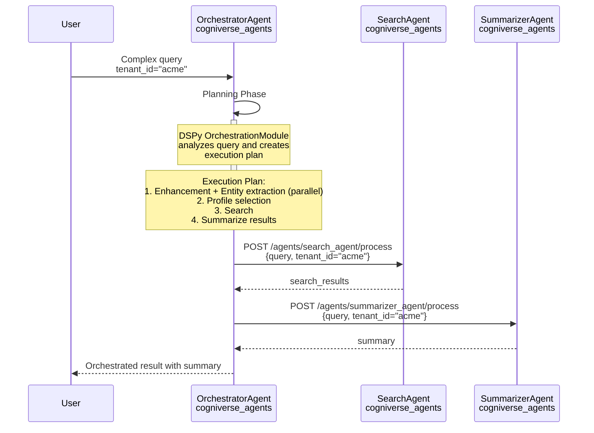
```mermaid
sequenceDiagram
    participant User
    participant Orchestrator as OrchestratorAgent<br/>cogniverse_agents
    participant SearchAgent as SearchAgent<br/>cogniverse_agents
    participant Summarizer as SummarizerAgent<br/>cogniverse_agents

    User->>Orchestrator: Complex query<br/>tenant_id="acme"

    Orchestrator->>Orchestrator: Planning Phase
    activate Orchestrator
    Note over Orchestrator: DSPy OrchestrationModule<br/>analyzes query and creates<br/>execution plan
    Note over Orchestrator: Execution Plan:<br/>1. Enhancement + Entity extraction (parallel)<br/>2. Profile selection<br/>3. Search<br/>4. Summarize results
    deactivate Orchestrator

    Orchestrator->>SearchAgent: POST /agents/search_agent/process<br/>{query, tenant_id="acme"}
    SearchAgent-->>Orchestrator: search_results

    Orchestrator->>Summarizer: POST /agents/summarizer_agent/process<br/>{query, tenant_id="acme"}
    Summarizer-->>Orchestrator: summary

    Orchestrator-->>User: Orchestrated result with summary
```

### Scenario 6: External A2A Protocol Access (JSON-RPC)

Besides the internal `/agents/{name}/process` REST route, the runtime mounts a standards-based A2A JSON-RPC server at `/a2a` (`A2AStarletteApplication`) for external A2A clients. Both entry points converge on the same shared `AgentDispatcher`, so an external `message/send` call gets identical routing/orchestration behavior to the REST path.

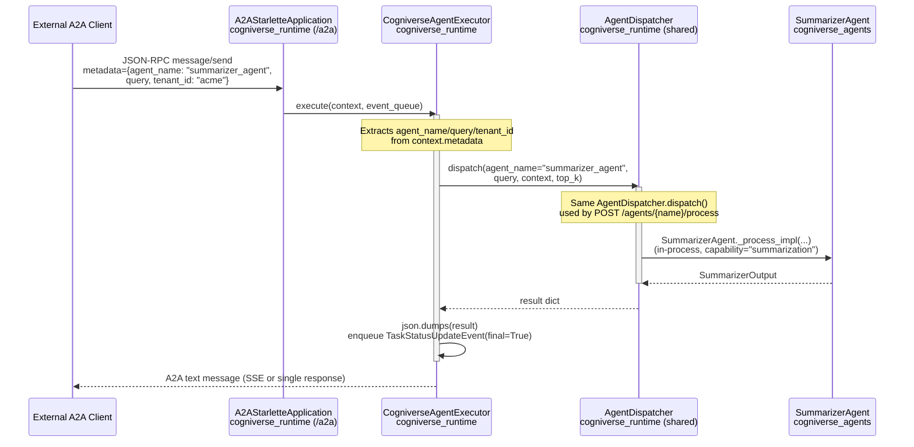
```mermaid
sequenceDiagram
    participant Client as External A2A Client
    participant A2A as A2AStarletteApplication<br/>cogniverse_runtime (/a2a)
    participant Executor as CogniverseAgentExecutor<br/>cogniverse_runtime
    participant Dispatcher as AgentDispatcher<br/>cogniverse_runtime (shared)
    participant Summarizer as SummarizerAgent<br/>cogniverse_agents

    Client->>A2A: JSON-RPC message/send<br/>metadata={agent_name: "summarizer_agent",<br/>query, tenant_id: "acme"}

    A2A->>Executor: execute(context, event_queue)
    activate Executor
    Note over Executor: Extracts agent_name/query/tenant_id<br/>from context.metadata

    Executor->>Dispatcher: dispatch(agent_name="summarizer_agent",<br/>query, context, top_k)

    activate Dispatcher
    Note over Dispatcher: Same AgentDispatcher.dispatch()<br/>used by POST /agents/{name}/process
    Dispatcher->>Summarizer: SummarizerAgent._process_impl(...)<br/>(in-process, capability="summarization")
    Summarizer-->>Dispatcher: SummarizerOutput
    deactivate Dispatcher

    Dispatcher-->>Executor: result dict
    Executor->>Executor: json.dumps(result)<br/>enqueue TaskStatusUpdateEvent(final=True)
    deactivate Executor

    Executor-->>Client: A2A text message (SSE or single response)
```

---

## Multi-Tenant Flows

### Scenario 7: Tenant Schema Lifecycle

```mermaid
sequenceDiagram
    participant Admin
    participant Runtime as cogniverse_runtime
    participant SchemaReg as SchemaRegistry<br/>cogniverse_core
    participant Vespa as Vespa Config (port 19071)
    participant ConfigMgr as ConfigManager<br/>cogniverse_foundation

    Admin->>Runtime: POST /admin/tenants<br/>{profile_name, tenant_id, schema_name, ...}

    Runtime->>SchemaReg: deploy_schema(tenant_id, base_schema_name)

    activate SchemaReg
    Note over SchemaReg: Canonicalize tenant_id (org:tenant form)<br/>then generate schema name: base + "_" + tenant<br/>e.g., "newcorp" &rarr; "newcorp:newcorp" &rarr; video_colpali_smol500_mv_frame_newcorp_newcorp<br/>(bare tenant_ids double-suffix; "acme:prod" &rarr; ..._acme_prod)

    loop For each required schema
        SchemaReg->>SchemaReg: Load base schema template
        SchemaReg->>Vespa: Deploy schema (via Backend)
        Vespa-->>SchemaReg: Deployment successful
        SchemaReg->>SchemaReg: Register schema metadata
    end

    SchemaReg-->>Runtime: Schemas deployed and registered
    deactivate SchemaReg

    Runtime->>ConfigMgr: set_system_config(tenant_config)
    ConfigMgr-->>Runtime: Config stored

    Runtime-->>Admin: Tenant "newcorp" created<br/>Schemas deployed
```

### Scenario 8: Multi-Tenant Request Isolation

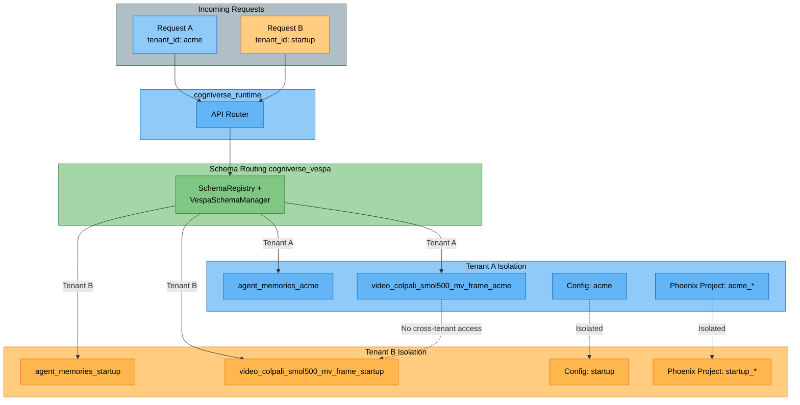
```mermaid
flowchart TB
    subgraph Incoming[<span style='color:#000'>Incoming Requests</span>]
        ReqA[<span style='color:#000'>Request A<br/>tenant_id: acme</span>]
        ReqB[<span style='color:#000'>Request B<br/>tenant_id: startup</span>]
    end

    subgraph RuntimePkg[<span style='color:#000'>cogniverse_runtime</span>]
        Router[<span style='color:#000'>API Router</span>]
    end

    subgraph VespaPkg[<span style='color:#000'>Schema Routing cogniverse_vespa</span>]
        SchemaMgr[<span style='color:#000'>SchemaRegistry +<br/>VespaSchemaManager</span>]
    end

    subgraph TenantA[<span style='color:#000'>Tenant A Isolation</span>]
        SchemaA1[<span style='color:#000'>video_colpali_smol500_mv_frame_acme</span>]
        SchemaA2[<span style='color:#000'>agent_memories_acme</span>]
        ConfigA[<span style='color:#000'>Config: acme</span>]
        PhoenixA[<span style='color:#000'>Phoenix Project: acme_*</span>]
    end

    subgraph TenantB[<span style='color:#000'>Tenant B Isolation</span>]
        SchemaB1[<span style='color:#000'>video_colpali_smol500_mv_frame_startup</span>]
        SchemaB2[<span style='color:#000'>agent_memories_startup</span>]
        ConfigB[<span style='color:#000'>Config: startup</span>]
        PhoenixB[<span style='color:#000'>Phoenix Project: startup_*</span>]
    end

    ReqA --> Router
    ReqB --> Router

    Router --> SchemaMgr

    SchemaMgr -->|Tenant A| SchemaA1
    SchemaMgr -->|Tenant A| SchemaA2
    SchemaMgr -->|Tenant B| SchemaB1
    SchemaMgr -->|Tenant B| SchemaB2

    SchemaA1 -.->|No cross-tenant access| SchemaB1
    ConfigA -.->|Isolated| ConfigB
    PhoenixA -.->|Isolated| PhoenixB

    style Incoming fill:#b0bec5,stroke:#546e7a,color:#000
    style ReqA fill:#90caf9,stroke:#1565c0,color:#000
    style ReqB fill:#ffcc80,stroke:#ef6c00,color:#000
    style RuntimePkg fill:#90caf9,stroke:#1565c0,color:#000
    style Router fill:#64b5f6,stroke:#1565c0,color:#000
    style VespaPkg fill:#a5d6a7,stroke:#388e3c,color:#000
    style SchemaMgr fill:#81c784,stroke:#388e3c,color:#000
    style TenantA fill:#90caf9,stroke:#1565c0,color:#000
    style SchemaA1 fill:#64b5f6,stroke:#1565c0,color:#000
    style SchemaA2 fill:#64b5f6,stroke:#1565c0,color:#000
    style ConfigA fill:#64b5f6,stroke:#1565c0,color:#000
    style PhoenixA fill:#64b5f6,stroke:#1565c0,color:#000
    style TenantB fill:#ffcc80,stroke:#ef6c00,color:#000
    style SchemaB1 fill:#ffb74d,stroke:#ef6c00,color:#000
    style SchemaB2 fill:#ffb74d,stroke:#ef6c00,color:#000
    style ConfigB fill:#ffb74d,stroke:#ef6c00,color:#000
    style PhoenixB fill:#ffb74d,stroke:#ef6c00,color:#000
```

### Scenario 9: Tenant Memory Isolation

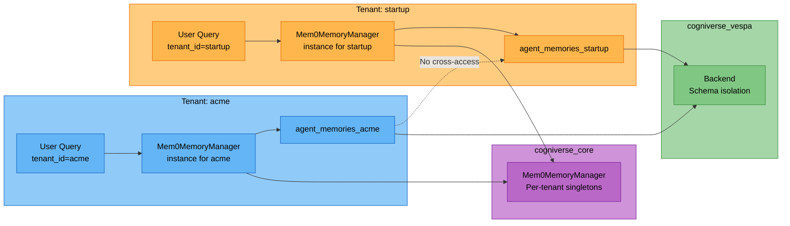
```mermaid
flowchart LR
    subgraph TenantAcme[<span style='color:#000'>Tenant: acme</span>]
        UserA[<span style='color:#000'>User Query<br/>tenant_id=acme</span>]
        MemA[<span style='color:#000'>Mem0MemoryManager<br/>instance for acme</span>]
        SchemaA[<span style='color:#000'>agent_memories_acme</span>]
    end

    subgraph TenantStartup[<span style='color:#000'>Tenant: startup</span>]
        UserB[<span style='color:#000'>User Query<br/>tenant_id=startup</span>]
        MemB[<span style='color:#000'>Mem0MemoryManager<br/>instance for startup</span>]
        SchemaB[<span style='color:#000'>agent_memories_startup</span>]
    end

    subgraph CorePkg[<span style='color:#000'>cogniverse_core</span>]
        MemSingleton[<span style='color:#000'>Mem0MemoryManager<br/>Per-tenant singletons</span>]
    end

    subgraph VespaPkg[<span style='color:#000'>cogniverse_vespa</span>]
        VespaCore[<span style='color:#000'>Backend<br/>Schema isolation</span>]
    end

    UserA --> MemA
    UserB --> MemB

    MemA --> MemSingleton
    MemB --> MemSingleton

    MemA --> SchemaA
    MemB --> SchemaB

    SchemaA --> VespaCore
    SchemaB --> VespaCore

    SchemaA -.->|No cross-access| SchemaB

    style TenantAcme fill:#90caf9,stroke:#1565c0,color:#000
    style UserA fill:#64b5f6,stroke:#1565c0,color:#000
    style MemA fill:#64b5f6,stroke:#1565c0,color:#000
    style SchemaA fill:#64b5f6,stroke:#1565c0,color:#000
    style TenantStartup fill:#ffcc80,stroke:#ef6c00,color:#000
    style UserB fill:#ffb74d,stroke:#ef6c00,color:#000
    style MemB fill:#ffb74d,stroke:#ef6c00,color:#000
    style SchemaB fill:#ffb74d,stroke:#ef6c00,color:#000
    style CorePkg fill:#ce93d8,stroke:#7b1fa2,color:#000
    style MemSingleton fill:#ba68c8,stroke:#7b1fa2,color:#000
    style VespaPkg fill:#a5d6a7,stroke:#388e3c,color:#000
    style VespaCore fill:#81c784,stroke:#388e3c,color:#000
```

---

## Optimization & Learning Flows

### Scenario 10: Gateway Optimization Cycle with Packages

```mermaid
flowchart TB
    Start[<span style='color:#000'>Query Execution<br/>tenant_id=acme</span>] --> Telemetry[<span style='color:#000'>Phoenix Records Spans<br/>cogniverse_telemetry_phoenix</span>]

    Telemetry --> SpanEval[<span style='color:#000'>Span Evaluator<br/>cogniverse_evaluation</span>]

    SpanEval --> Extract{<span style='color:#000'>Extract Signals<br/>per tenant</span>}
    Extract --> Quality[<span style='color:#000'>Quality Signals</span>]
    Extract --> Latency[<span style='color:#000'>Latency Metrics</span>]
    Extract --> UserFeedback[<span style='color:#000'>User Feedback</span>]

    Quality --> OptCLI[<span style='color:#000'>optimization_cli --mode gateway-thresholds<br/>_compute_gateway_thresholds(spans_df)<br/>cogniverse_runtime</span>]
    Latency --> OptCLI
    UserFeedback --> OptCLI

    OptCLI --> Calibrate[<span style='color:#000'>Calibrate fast_path_confidence_threshold<br/>+ gliner_threshold (numeric, no DSPy/LLM)</span>]
    Calibrate --> SaveArtifact[<span style='color:#000'>ArtifactManager.save_blob<br/>kind="config", key="gateway_thresholds"</span>]

    SaveArtifact --> Deploy[<span style='color:#000'>GatewayAgent._load_artifact()<br/>cogniverse_agents (loads on next init)</span>]
    Deploy --> Monitor[<span style='color:#000'>Monitor Performance<br/>cogniverse_telemetry_phoenix</span>]

    Monitor --> Telemetry

    style Start fill:#90caf9,stroke:#1565c0,color:#000
    style Telemetry fill:#a5d6a7,stroke:#388e3c,color:#000
    style SpanEval fill:#a5d6a7,stroke:#388e3c,color:#000
    style Extract fill:#ffcc80,stroke:#ef6c00,color:#000
    style Quality fill:#ffcc80,stroke:#ef6c00,color:#000
    style Latency fill:#ffcc80,stroke:#ef6c00,color:#000
    style UserFeedback fill:#90caf9,stroke:#1565c0,color:#000
    style OptCLI fill:#ffcc80,stroke:#ef6c00,color:#000
    style Calibrate fill:#81d4fa,stroke:#0288d1,color:#000
    style SaveArtifact fill:#81d4fa,stroke:#0288d1,color:#000
    style Deploy fill:#ce93d8,stroke:#7b1fa2,color:#000
    style Monitor fill:#a5d6a7,stroke:#388e3c,color:#000
```

### Scenario 11: Span Collection & Optimization

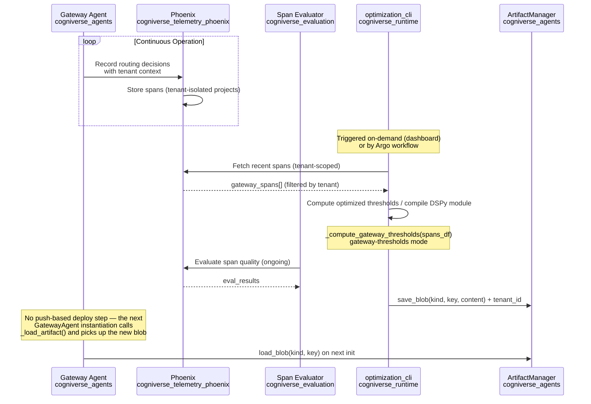
```mermaid
sequenceDiagram
    participant Gateway as Gateway Agent<br/>cogniverse_agents
    participant Phoenix as Phoenix<br/>cogniverse_telemetry_phoenix
    participant SpanEval as Span Evaluator<br/>cogniverse_evaluation
    participant OptCLI as optimization_cli<br/>cogniverse_runtime
    participant Artifact as ArtifactManager<br/>cogniverse_agents

    loop Continuous Operation
        Gateway->>Phoenix: Record routing decisions<br/>with tenant context
        Phoenix->>Phoenix: Store spans (tenant-isolated projects)
    end

    Note over OptCLI: Triggered on-demand (dashboard)<br/>or by Argo workflow

    OptCLI->>Phoenix: Fetch recent spans (tenant-scoped)
    Phoenix-->>OptCLI: gateway_spans[] (filtered by tenant)

    OptCLI->>OptCLI: Compute optimized thresholds / compile DSPy module
    Note over OptCLI: _compute_gateway_thresholds(spans_df)<br/>gateway-thresholds mode

    SpanEval->>Phoenix: Evaluate span quality (ongoing)
    Phoenix-->>SpanEval: eval_results

    OptCLI->>Artifact: save_blob(kind, key, content) + tenant_id

    Note over Gateway: No push-based deploy step — the next<br/>GatewayAgent instantiation calls<br/>_load_artifact() and picks up the new blob
    Gateway->>Artifact: load_blob(kind, key) on next init
```

### Scenario 12: Profile Selection Optimization

```mermaid
flowchart LR
    subgraph DataCollection[<span style='color:#000'>Data Collection<br/>cogniverse_telemetry_phoenix</span>]
        Q[<span style='color:#000'>Queries</span>] --> Spans[<span style='color:#000'>cogniverse.profile_selection spans<br/>per tenant</span>]
    end

    subgraph Synthesis[<span style='color:#000'>Synthetic Data<br/>cogniverse_synthetic</span>]
        Spans --> ProfileGen[<span style='color:#000'>ProfileGenerator<br/>generates ProfileSelectionExampleSchema</span>]
    end

    subgraph Optimization[<span style='color:#000'>Optimization<br/>cogniverse_runtime</span>]
        ProfileGen --> OptCLI[<span style='color:#000'>run_profile_optimization<br/>BootstrapFewShot (scaled by trainset size)</span>]
        OptCLI --> Artifact[<span style='color:#000'>Artifact saved<br/>("model", "profile_selection")</span>]
    end

    Artifact --> Agent[<span style='color:#000'>ProfileSelectionAgent<br/>loads at startup</span>]
    Agent --> Q

    style DataCollection fill:#90caf9,stroke:#1565c0,color:#000
    style Q fill:#64b5f6,stroke:#1565c0,color:#000
    style Spans fill:#64b5f6,stroke:#1565c0,color:#000
    style Synthesis fill:#a5d6a7,stroke:#388e3c,color:#000
    style ProfileGen fill:#81c784,stroke:#388e3c,color:#000
    style Optimization fill:#ffcc80,stroke:#ef6c00,color:#000
    style OptCLI fill:#ffb74d,stroke:#ef6c00,color:#000
    style Artifact fill:#ffb74d,stroke:#ef6c00,color:#000
    style Agent fill:#ce93d8,stroke:#7b1fa2,color:#000
```

---

## Evaluation & Experiment Flows

### Scenario 13: Phoenix Experiment Workflow

`ExperimentTracker.run_experiment` does not loop over queries itself or call a routing agent — it hands the whole run to the Inspect AI framework, which iterates the dataset via a retrieval solver that hits Vespa directly (no LLM, no A2A call).

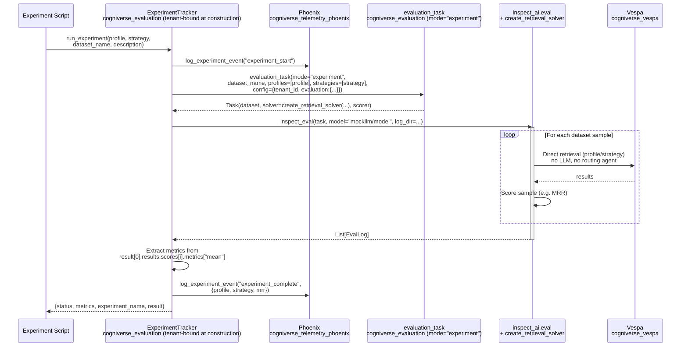
```mermaid
sequenceDiagram
    participant Script as Experiment Script
    participant Tracker as ExperimentTracker<br/>cogniverse_evaluation (tenant-bound at construction)
    participant Phoenix as Phoenix<br/>cogniverse_telemetry_phoenix
    participant Task as evaluation_task<br/>cogniverse_evaluation (mode="experiment")
    participant Inspect as inspect_ai.eval<br/>+ create_retrieval_solver
    participant Vespa as Vespa<br/>cogniverse_vespa

    Script->>Tracker: run_experiment(profile, strategy,<br/>dataset_name, description)

    Tracker->>Phoenix: log_experiment_event("experiment_start")

    Tracker->>Task: evaluation_task(mode="experiment",<br/>dataset_name, profiles=[profile], strategies=[strategy],<br/>config={tenant_id, evaluation:{...}})
    Task-->>Tracker: Task(dataset, solver=create_retrieval_solver(...), scorer)

    Tracker->>Inspect: inspect_eval(task, model="mockllm/model", log_dir=...)

    activate Inspect
    loop For each dataset sample
        Inspect->>Vespa: Direct retrieval (profile/strategy)<br/>no LLM, no routing agent
        Vespa-->>Inspect: results
        Inspect->>Inspect: Score sample (e.g. MRR)
    end
    Inspect-->>Tracker: List[EvalLog]
    deactivate Inspect

    Tracker->>Tracker: Extract metrics from<br/>result[0].results.scores[i].metrics["mean"]

    Tracker->>Phoenix: log_experiment_event("experiment_complete",<br/>{profile, strategy, mrr})

    Tracker-->>Script: {status, metrics, experiment_name, result}
```

### Scenario 14: Routing Evaluator Integration

`RoutingEvaluator` works on already-recorded telemetry, not a live query-execution loop: it fetches `cogniverse.routing` spans, classifies each decision's outcome from the downstream agent span's status (not a gold-label lookup), then aggregates into `RoutingMetrics`.

```mermaid
flowchart TB
    Start[<span style='color:#000'>Evaluation Request<br/>tenant_id=acme</span>] --> QuerySpans[<span style='color:#000'>query_routing_spans<br/>cogniverse_evaluation</span>]

    QuerySpans --> Loop{<span style='color:#000'>For each cogniverse.routing span</span>}

    Loop --> Evaluate[<span style='color:#000'>evaluate_routing_decision(span_data)<br/>cogniverse_evaluation</span>]
    Evaluate --> Classify[<span style='color:#000'>_classify_routing_outcome<br/>(downstream agent span status)</span>]
    Classify --> Outcome[<span style='color:#000'>RoutingOutcome + metrics dict<br/>(chosen_agent, confidence, latency_ms, success)</span>]

    Outcome --> Loop

    Loop --> CalcMetrics[<span style='color:#000'>calculate_metrics(routing_spans)<br/>cogniverse_evaluation</span>]
    CalcMetrics --> Accuracy[<span style='color:#000'>routing_accuracy</span>]
    CalcMetrics --> Calib[<span style='color:#000'>confidence_calibration</span>]
    CalcMetrics --> PerAgent[<span style='color:#000'>per_agent_precision/recall/f1</span>]

    Accuracy --> Report[<span style='color:#000'>RoutingMetrics result</span>]
    Calib --> Report
    PerAgent --> Report

    Report --> Visualize[<span style='color:#000'>Create Visualizations<br/>cogniverse_dashboard</span>]
    Visualize --> Dashboard[<span style='color:#000'>Phoenix Dashboard</span>]

    style Start fill:#90caf9,stroke:#1565c0,color:#000
    style QuerySpans fill:#90caf9,stroke:#1565c0,color:#000
    style Loop fill:#ffcc80,stroke:#ef6c00,color:#000
    style Evaluate fill:#ce93d8,stroke:#7b1fa2,color:#000
    style Classify fill:#ce93d8,stroke:#7b1fa2,color:#000
    style Outcome fill:#ffcc80,stroke:#ef6c00,color:#000
    style CalcMetrics fill:#a5d6a7,stroke:#388e3c,color:#000
    style Accuracy fill:#a5d6a7,stroke:#388e3c,color:#000
    style Calib fill:#a5d6a7,stroke:#388e3c,color:#000
    style PerAgent fill:#a5d6a7,stroke:#388e3c,color:#000
    style Report fill:#ffcc80,stroke:#ef6c00,color:#000
    style Visualize fill:#ce93d8,stroke:#7b1fa2,color:#000
    style Dashboard fill:#90caf9,stroke:#1565c0,color:#000
```

### Scenario 15: Quality Evaluator for Experiments

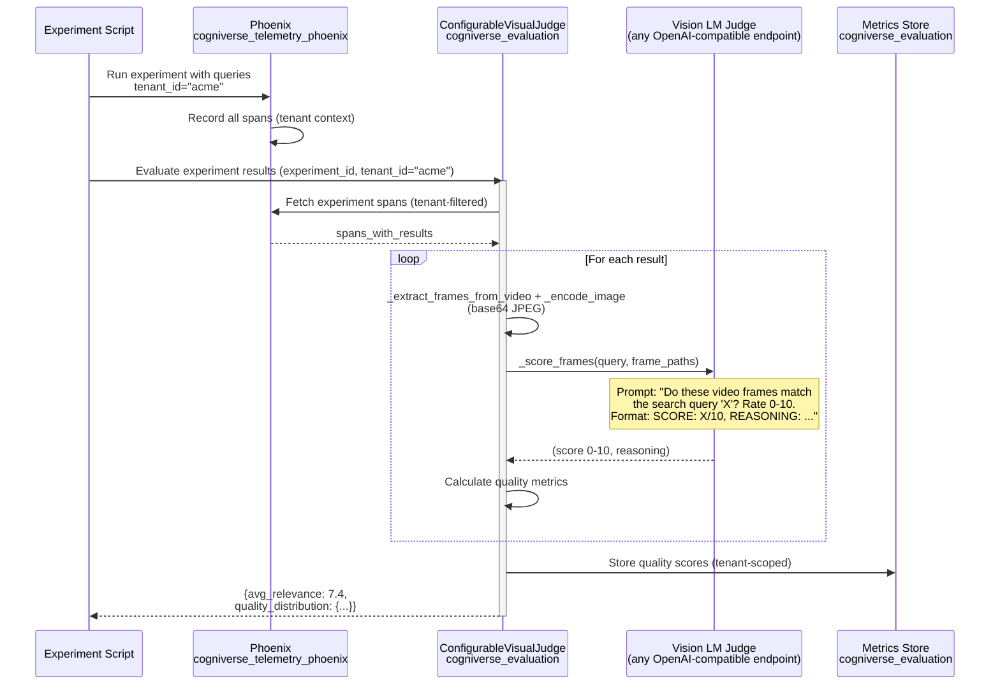
```mermaid
sequenceDiagram
    participant Exp as Experiment Script
    participant Phoenix as Phoenix<br/>cogniverse_telemetry_phoenix
    participant QualityEval as ConfigurableVisualJudge<br/>cogniverse_evaluation
    participant LLM as Vision LM Judge<br/>(any OpenAI-compatible endpoint)
    participant Metrics as Metrics Store<br/>cogniverse_evaluation

    Exp->>Phoenix: Run experiment with queries<br/>tenant_id="acme"
    Phoenix->>Phoenix: Record all spans (tenant context)

    Exp->>QualityEval: Evaluate experiment results (experiment_id, tenant_id="acme")

    activate QualityEval
    QualityEval->>Phoenix: Fetch experiment spans (tenant-filtered)
    Phoenix-->>QualityEval: spans_with_results

    loop For each result
        QualityEval->>QualityEval: _extract_frames_from_video + _encode_image<br/>(base64 JPEG)
        QualityEval->>LLM: _score_frames(query, frame_paths)
        Note over LLM: Prompt: "Do these video frames match<br/>the search query 'X'? Rate 0-10.<br/>Format: SCORE: X/10, REASONING: ..."
        LLM-->>QualityEval: (score 0-10, reasoning)

        QualityEval->>QualityEval: Calculate quality metrics
    end

    QualityEval->>Metrics: Store quality scores (tenant-scoped)
    QualityEval-->>Exp: {avg_relevance: 7.4,<br/>quality_distribution: {...}}
    deactivate QualityEval
```

---

## Memory & Context Flows

### Scenario 16: Conversation Memory Integration

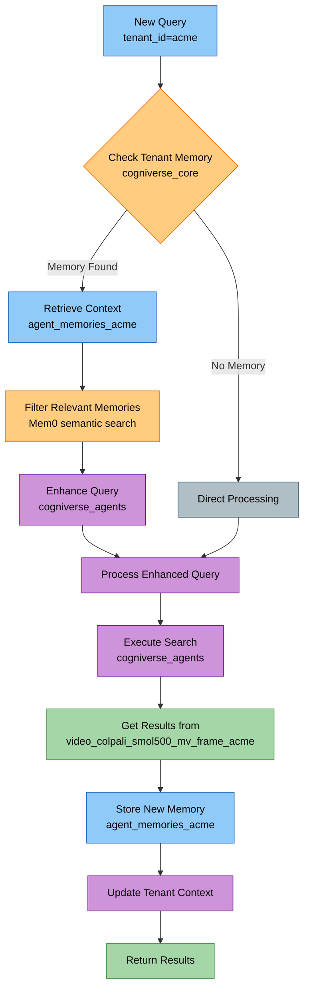
```mermaid
flowchart TB
    Query[<span style='color:#000'>New Query<br/>tenant_id=acme</span>] --> CheckMemory{<span style='color:#000'>Check Tenant Memory<br/>cogniverse_core</span>}

    CheckMemory -->|Memory Found| Retrieve[<span style='color:#000'>Retrieve Context<br/>agent_memories_acme</span>]
    CheckMemory -->|No Memory| Direct[<span style='color:#000'>Direct Processing</span>]

    Retrieve --> Relevant[<span style='color:#000'>Filter Relevant Memories<br/>Mem0 semantic search</span>]
    Relevant --> Enhance[<span style='color:#000'>Enhance Query<br/>cogniverse_agents</span>]

    Enhance --> Process[<span style='color:#000'>Process Enhanced Query</span>]
    Direct --> Process

    Process --> Execute[<span style='color:#000'>Execute Search<br/>cogniverse_agents</span>]
    Execute --> Results[<span style='color:#000'>Get Results from<br/>video_colpali_smol500_mv_frame_acme</span>]

    Results --> Store[<span style='color:#000'>Store New Memory<br/>agent_memories_acme</span>]
    Store --> Update[<span style='color:#000'>Update Tenant Context</span>]

    Update --> Return[<span style='color:#000'>Return Results</span>]

    style Query fill:#90caf9,stroke:#1565c0,color:#000
    style CheckMemory fill:#ffcc80,stroke:#ef6c00,color:#000
    style Retrieve fill:#90caf9,stroke:#1565c0,color:#000
    style Direct fill:#b0bec5,stroke:#546e7a,color:#000
    style Relevant fill:#ffcc80,stroke:#ef6c00,color:#000
    style Enhance fill:#ce93d8,stroke:#7b1fa2,color:#000
    style Process fill:#ce93d8,stroke:#7b1fa2,color:#000
    style Execute fill:#ce93d8,stroke:#7b1fa2,color:#000
    style Results fill:#a5d6a7,stroke:#388e3c,color:#000
    style Store fill:#90caf9,stroke:#1565c0,color:#000
    style Update fill:#ce93d8,stroke:#7b1fa2,color:#000
    style Return fill:#a5d6a7,stroke:#388e3c,color:#000
```

### Scenario 17: Memory Lifecycle with Tenant Isolation

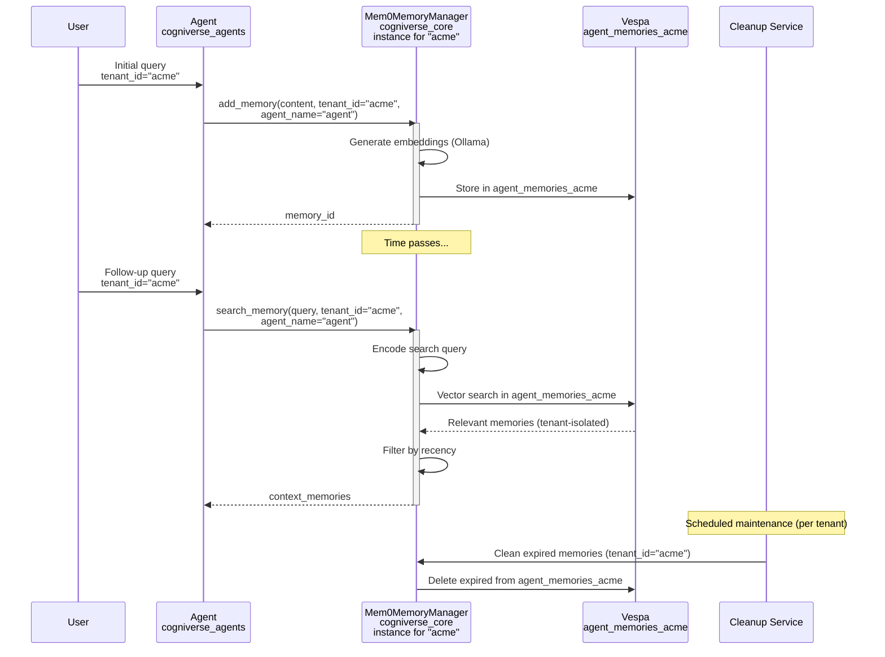
```mermaid
sequenceDiagram
    participant User
    participant Agent as Agent<br/>cogniverse_agents
    participant Memory as Mem0MemoryManager<br/>cogniverse_core<br/>instance for "acme"
    participant Vespa as Vespa<br/>agent_memories_acme
    participant Cleanup as Cleanup Service

    User->>Agent: Initial query<br/>tenant_id="acme"
    Agent->>Memory: add_memory(content, tenant_id="acme",<br/>agent_name="agent")

    activate Memory
    Memory->>Memory: Generate embeddings (Ollama)
    Memory->>Vespa: Store in agent_memories_acme
    Memory-->>Agent: memory_id
    deactivate Memory

    Note over Memory: Time passes...

    User->>Agent: Follow-up query<br/>tenant_id="acme"
    Agent->>Memory: search_memory(query, tenant_id="acme",<br/>agent_name="agent")

    activate Memory
    Memory->>Memory: Encode search query
    Memory->>Vespa: Vector search in agent_memories_acme
    Vespa-->>Memory: Relevant memories (tenant-isolated)
    Memory->>Memory: Filter by recency
    Memory-->>Agent: context_memories
    deactivate Memory

    Note over Cleanup: Scheduled maintenance (per tenant)

    Cleanup->>Memory: Clean expired memories (tenant_id="acme")
    Memory->>Vespa: Delete expired from agent_memories_acme
```

### Scenario 18: Per-Tenant Memory Singleton Pattern

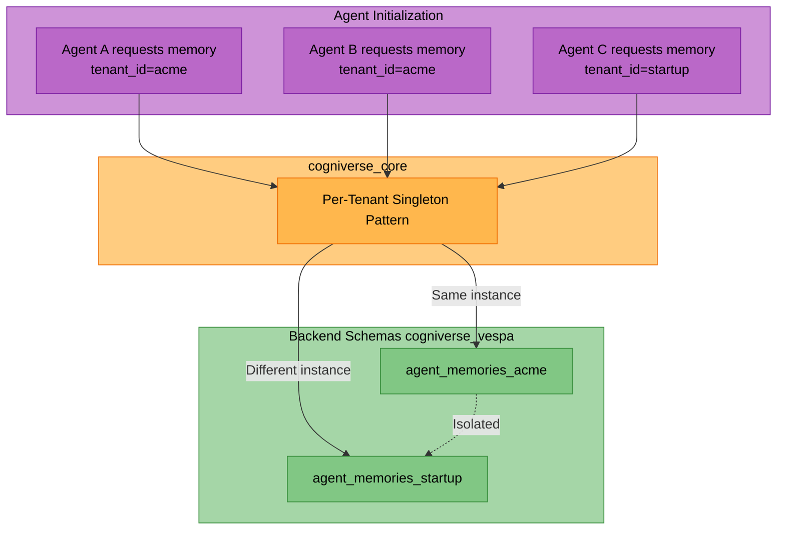
```mermaid
flowchart TB
    subgraph AgentInit[<span style='color:#000'>Agent Initialization</span>]
        AgentA[<span style='color:#000'>Agent A requests memory<br/>tenant_id=acme</span>]
        AgentB[<span style='color:#000'>Agent B requests memory<br/>tenant_id=acme</span>]
        AgentC[<span style='color:#000'>Agent C requests memory<br/>tenant_id=startup</span>]
    end

    subgraph CorePkg[<span style='color:#000'>cogniverse_core<br/>Mem0MemoryManager</span>]
        Singleton[<span style='color:#000'>Per-Tenant Singleton Pattern</span>]
    end

    subgraph VespaPkg[<span style='color:#000'>Backend Schemas cogniverse_vespa</span>]
        SchemaA[<span style='color:#000'>agent_memories_acme</span>]
        SchemaB[<span style='color:#000'>agent_memories_startup</span>]
    end

    AgentA --> Singleton
    AgentB --> Singleton
    AgentC --> Singleton

    Singleton -->|Same instance| SchemaA
    Singleton -->|Different instance| SchemaB

    SchemaA -.->|Isolated| SchemaB

    style AgentInit fill:#ce93d8,stroke:#7b1fa2,color:#000
    style AgentA fill:#ba68c8,stroke:#7b1fa2,color:#000
    style AgentB fill:#ba68c8,stroke:#7b1fa2,color:#000
    style AgentC fill:#ba68c8,stroke:#7b1fa2,color:#000
    style CorePkg fill:#ffcc80,stroke:#ef6c00,color:#000
    style Singleton fill:#ffb74d,stroke:#ef6c00,color:#000
    style VespaPkg fill:#a5d6a7,stroke:#388e3c,color:#000
    style SchemaA fill:#81c784,stroke:#388e3c,color:#000
    style SchemaB fill:#81c784,stroke:#388e3c,color:#000
```

---

## Ingestion & Dataset Flows

### Scenario 19: Video Ingestion Pipeline with Tenant Routing

```mermaid
flowchart TB
    Input[<span style='color:#000'>Video Files<br/>tenant_id=acme</span>] --> Runtime[<span style='color:#000'>Ingestion Pipeline<br/>cogniverse_runtime</span>]

    Runtime --> Strategy[<span style='color:#000'>Strategy Factory<br/>cogniverse_runtime</span>]

    Strategy --> Profile{<span style='color:#000'>Select Profile</span>}
    Profile -->|Frame-Based| FrameProc[<span style='color:#000'>Frame Processor<br/>ColPali</span>]
    Profile -->|Chunk-Based| ChunkProc[<span style='color:#000'>Chunk Processor<br/>ColQwen</span>]
    Profile -->|Global| GlobalProc[<span style='color:#000'>Global Processor<br/>VideoPrism</span>]

    FrameProc --> Embed[<span style='color:#000'>Generate Embeddings<br/>cogniverse_runtime</span>]
    ChunkProc --> Embed
    GlobalProc --> Embed

    Embed --> Format[<span style='color:#000'>Format Conversion<br/>cogniverse_vespa</span>]

    Format --> SchemaMgr[<span style='color:#000'>VespaSchemaManager<br/>get_tenant_schema_name</span>]

    SchemaMgr --> Build[<span style='color:#000'>Build Backend Documents<br/>cogniverse_vespa</span>]

    Build --> Upload[<span style='color:#000'>Bulk Upload<br/>to video_colpali_smol500_mv_frame_acme</span>]
    Upload --> Verify[<span style='color:#000'>Verify Upload Success</span>]

    style Input fill:#90caf9,stroke:#1565c0,color:#000
    style Runtime fill:#90caf9,stroke:#1565c0,color:#000
    style Strategy fill:#ffcc80,stroke:#ef6c00,color:#000
    style Profile fill:#ffcc80,stroke:#ef6c00,color:#000
    style FrameProc fill:#ffcc80,stroke:#ef6c00,color:#000
    style ChunkProc fill:#ffcc80,stroke:#ef6c00,color:#000
    style GlobalProc fill:#ffcc80,stroke:#ef6c00,color:#000
    style Embed fill:#81d4fa,stroke:#0288d1,color:#000
    style Format fill:#a5d6a7,stroke:#388e3c,color:#000
    style SchemaMgr fill:#a5d6a7,stroke:#388e3c,color:#000
    style Build fill:#a5d6a7,stroke:#388e3c,color:#000
    style Upload fill:#a5d6a7,stroke:#388e3c,color:#000
    style Verify fill:#a5d6a7,stroke:#388e3c,color:#000
```

### Scenario 20: Dataset Extraction for Evaluation

```mermaid
sequenceDiagram
    participant Script
    participant DatasetMgr as Dataset Manager<br/>cogniverse_evaluation
    participant Phoenix as Phoenix<br/>cogniverse_telemetry_phoenix
    participant Vespa as Vespa<br/>cogniverse_vespa
    participant Export as Export Service

    Script->>DatasetMgr: Create and upload dataset<br/>tenant_id="acme"

    DatasetMgr->>Phoenix: Fetch production spans (tenant-filtered)
    Note over Phoenix: Filter by:<br/>- Date range<br/>- Quality threshold<br/>- User feedback<br/>- Tenant isolation
    Phoenix-->>DatasetMgr: high_quality_spans (tenant-scoped)

    DatasetMgr->>DatasetMgr: Extract queries & labels

    loop For each span
        DatasetMgr->>DatasetMgr: Parse routing decision
        DatasetMgr->>DatasetMgr: Validate gold label
        DatasetMgr->>DatasetMgr: Verify tenant_id="acme"
    end

    DatasetMgr->>DatasetMgr: Deduplicate queries
    DatasetMgr->>DatasetMgr: Balance modalities

    DatasetMgr->>Vespa: Store dataset<br/>(tenant-scoped storage)
    DatasetMgr->>Export: Export to CSV with tenant_id

    Export-->>Script: dataset_file_path
    Script->>Script: Validate dataset quality
```

### Scenario 21: Ingestion Strategy Resolution

Profile selection is explicit and config-driven, not inferred from video properties: the caller passes `--profile` (or the pipeline falls back to `active_video_profile` in `configs/config.json`), and `VideoIngestionPipeline._create_strategy_set_from_config` looks up `backend.profiles.<profile_name>.strategies` to build the strategy set via `StrategyFactory.create_from_profile_config`.

```mermaid
flowchart TB
    Start[<span style='color:#000'>Video Input<br/>tenant_id=acme<br/>profile=video_colpali_smol500_mv_frame</span>] --> Runtime[<span style='color:#000'>cogniverse_runtime<br/>VideoIngestionPipeline</span>]

    Runtime --> HasProfile{<span style='color:#000'>schema_name set?</span>}

    HasProfile -->|No profile| Default[<span style='color:#000'>Basic default strategies<br/>FrameSegmentation + AudioTranscription<br/>+ NoDescription + MultiVectorEmbedding</span>]
    HasProfile -->|profile given| Lookup[<span style='color:#000'>Look up backend.profiles.&lt;profile_name&gt;<br/>configs/config.json</span>]

    Lookup --> HasStrategies{<span style='color:#000'>'strategies' key present?</span>}
    HasStrategies -->|No| Error[<span style='color:#000'>raise ValueError<br/>profile missing 'strategies'</span>]
    HasStrategies -->|Yes| Factory[<span style='color:#000'>StrategyFactory.create_from_profile_config<br/>cogniverse_runtime</span>]

    Factory --> PerType[<span style='color:#000'>For each strategy_type:<br/>instantiate explicit "class" name + params<br/>(segmentation, transcription, description, embedding)</span>]
    PerType --> InjectService[<span style='color:#000'>Inject inference_service kwarg<br/>from profile-level inference_services<br/>(only if constructor accepts it)</span>]

    Default --> StratSet[<span style='color:#000'>ProcessingStrategySet</span>]
    InjectService --> StratSet

    StratSet --> TenantRoute[<span style='color:#000'>VespaSchemaManager.get_tenant_schema_name<br/>cogniverse_vespa</span>]

    TenantRoute --> Execute[<span style='color:#000'>Execute Ingestion<br/>process_video_async</span>]

    style Start fill:#90caf9,stroke:#1565c0,color:#000
    style Runtime fill:#90caf9,stroke:#1565c0,color:#000
    style HasProfile fill:#ffcc80,stroke:#ef6c00,color:#000
    style Default fill:#ffcc80,stroke:#ef6c00,color:#000
    style Lookup fill:#ffcc80,stroke:#ef6c00,color:#000
    style HasStrategies fill:#ffcc80,stroke:#ef6c00,color:#000
    style Error fill:#e53935,stroke:#c62828,color:#fff
    style Factory fill:#ce93d8,stroke:#7b1fa2,color:#000
    style PerType fill:#ce93d8,stroke:#7b1fa2,color:#000
    style InjectService fill:#ce93d8,stroke:#7b1fa2,color:#000
    style StratSet fill:#ce93d8,stroke:#7b1fa2,color:#000
    style TenantRoute fill:#a5d6a7,stroke:#388e3c,color:#000
    style Execute fill:#a5d6a7,stroke:#388e3c,color:#000
```

---

## Production Deployment Flows

### Scenario 22: SDK Package Testing & Publishing

Package publishing runs in `.github/workflows/publish-packages.yml`, triggered by a `v*.*.*` tag push (or manual dispatch). It builds the whole UV workspace with `scripts/build_packages.sh`, verifies the wheels against a real Vespa service container, then gates TestPyPI/PyPI publication on tag shape.

```mermaid
flowchart TB
    Tag[<span style='color:#000'>Push tag v*.*.*<br/>or workflow_dispatch</span>] --> Build[<span style='color:#000'>scripts/build_packages.sh --clean<br/>builds all libs/* wheels + sdists</span>]

    Build --> TestJob[<span style='color:#000'>Test Packages job<br/>real Vespa service container</span>]
    TestJob --> Install[<span style='color:#000'>Install built wheels in dependency order<br/>core &rarr; agents &rarr; vespa &rarr; runtime &rarr; dashboard</span>]
    Install --> VerifyImports[<span style='color:#000'>Verify imports<br/>SystemConfig, GatewayAgent, VespaBackend</span>]
    VerifyImports --> RunTests[<span style='color:#000'>uv run pytest<br/>tests/common/ tests/routing/unit/</span>]

    RunTests --> TagShape{<span style='color:#000'>Tag shape?</span>}

    TagShape -->|"-alpha/-beta/-rc<br/>or dispatch target=testpypi"| TestPyPI[<span style='color:#000'>publish-testpypi job<br/>scripts/publish_packages.sh TEST_PYPI=true</span>]
    TagShape -->|"vX.Y.Z (no prerelease)<br/>or dispatch target=pypi"| PyPI[<span style='color:#000'>publish-pypi job<br/>scripts/publish_packages.sh</span>]

    TestPyPI --> VerifyInstallTest[<span style='color:#000'>pip install from TestPyPI<br/>verify cogniverse-core resolves</span>]
    PyPI --> VerifyInstallProd[<span style='color:#000'>pip install from PyPI<br/>verify cogniverse-core resolves</span>]

    style Tag fill:#90caf9,stroke:#1565c0,color:#000
    style Build fill:#ce93d8,stroke:#7b1fa2,color:#000
    style TestJob fill:#a5d6a7,stroke:#388e3c,color:#000
    style Install fill:#81c784,stroke:#388e3c,color:#000
    style VerifyImports fill:#81c784,stroke:#388e3c,color:#000
    style RunTests fill:#81c784,stroke:#388e3c,color:#000
    style TagShape fill:#ffcc80,stroke:#ef6c00,color:#000
    style TestPyPI fill:#ffb74d,stroke:#ef6c00,color:#000
    style PyPI fill:#ffb74d,stroke:#ef6c00,color:#000
    style VerifyInstallTest fill:#a5d6a7,stroke:#388e3c,color:#000
    style VerifyInstallProd fill:#a5d6a7,stroke:#388e3c,color:#000
```

### Scenario 23: Kubernetes Deployment via Helm Chart

The runtime deploys as a Helm chart (`charts/cogniverse`), validated on every PR touching `charts/**` by `.github/workflows/chart-validation.yml` (`helm lint` &rarr; `helm template` &rarr; `kubeconform`). There is no blue-green or traffic-split rollout in this codebase — model-weight-holding Deployments (`runtime`, `llm`, per-agent `inference-*`) use `strategy: Recreate` (avoids two pods contending for the same GPU device); `dashboard` and `messaging` use the Kubernetes default rolling update. Only the `runtime` component has an optional HPA.

```mermaid
flowchart TB
    PR[<span style='color:#000'>PR touching charts/**</span>] --> Validate[<span style='color:#000'>chart-validation.yml<br/>helm lint + helm template + kubeconform</span>]
    Validate --> Merge[<span style='color:#000'>Merge to main</span>]

    Merge --> Upgrade[<span style='color:#000'>helm upgrade cogniverse<br/>charts/cogniverse -f values.*.yaml</span>]

    Upgrade --> Deployments[<span style='color:#000'>Renders per-component Deployments</span>]

    Deployments --> Recreate[<span style='color:#000'>strategy: Recreate<br/>runtime, llm, inference-&lt;agent&gt;<br/>(GPU/model-weight singleton pods)</span>]
    Deployments --> Rolling[<span style='color:#000'>default RollingUpdate<br/>dashboard, messaging</span>]

    Recreate --> HPA{<span style='color:#000'>runtime.autoscaling.enabled?</span>}
    HPA -->|Yes| Scale[<span style='color:#000'>HPA: min/maxReplicas<br/>CPU/memory utilization target</span>]
    HPA -->|No| Fixed[<span style='color:#000'>Fixed replica count</span>]

    style PR fill:#90caf9,stroke:#1565c0,color:#000
    style Validate fill:#ce93d8,stroke:#7b1fa2,color:#000
    style Merge fill:#90caf9,stroke:#1565c0,color:#000
    style Upgrade fill:#ce93d8,stroke:#7b1fa2,color:#000
    style Deployments fill:#a5d6a7,stroke:#388e3c,color:#000
    style Recreate fill:#81c784,stroke:#388e3c,color:#000
    style Rolling fill:#81c784,stroke:#388e3c,color:#000
    style HPA fill:#ffcc80,stroke:#ef6c00,color:#000
    style Scale fill:#ffb74d,stroke:#ef6c00,color:#000
    style Fixed fill:#ffb74d,stroke:#ef6c00,color:#000
```

---

## Key Takeaways

### Multi-Tenant Design Patterns

1. **Schema-Per-Tenant**: Schema-based isolation via dedicated backend schemas

2. **Tenant Context Injection**: Request parameters or config provide tenant_id context

3. **Per-Tenant Singletons**: Mem0MemoryManager maintains isolated instances

4. **Tenant-Scoped Telemetry**: Observability projects per tenant for complete isolation

5. **Org-Scoped Federation ACLs**: `cross_tenant_comparison_agent` / `federated_query_agent` require `actor_role` in `{tenant_admin, org_admin}` and reject any requested tenant that doesn't share the caller's org before performing a federated read

### Critical Integration Points

1. **runtime ↔ vespa**: Automatic schema routing via VespaSchemaManager

2. **agents ↔ vespa**: Tenant-aware search clients with schema resolution

3. **core ↔ vespa**: Memory using backend (agent_memories_{tenant_id})

4. **foundation ↔ telemetry-phoenix**: Telemetry provider interface and implementation

5. **evaluation ↔ telemetry-phoenix**: Experiment tracking

6. **All packages ↔ sdk**: Common interfaces and document models

7. **agents (knowledge tier) ↔ core**: `citation_tracing`/`contradiction_reconciliation`/`kg_traversal`/`temporal_reasoning`/`knowledge_summarization`/`audit_explanation` agents read `cogniverse_core.memory` primitives directly (`ProvenanceWalker`, `TrustScorer`, `ContradictionDetector`), reached via `/admin/tenants/{tenant_id}/knowledge/*` REST routes rather than the primary gateway/orchestrator query path

---

**Related Guides:**

[architecture/overview.md](./overview.md) - SDK and multi-tenant architecture

[architecture/sdk-architecture.md](./sdk-architecture.md) - UV workspace deep dive

[architecture/multi-tenant.md](./multi-tenant.md) - Tenant isolation guide

[modules/sdk.md](../modules/sdk.md) - Per-package technical details

