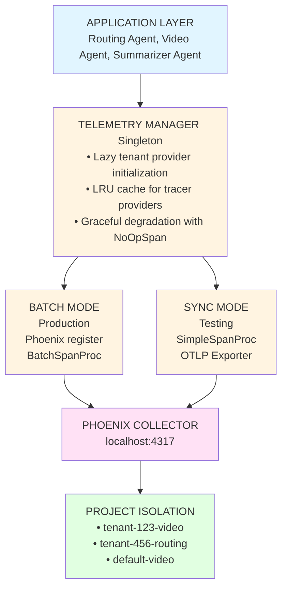
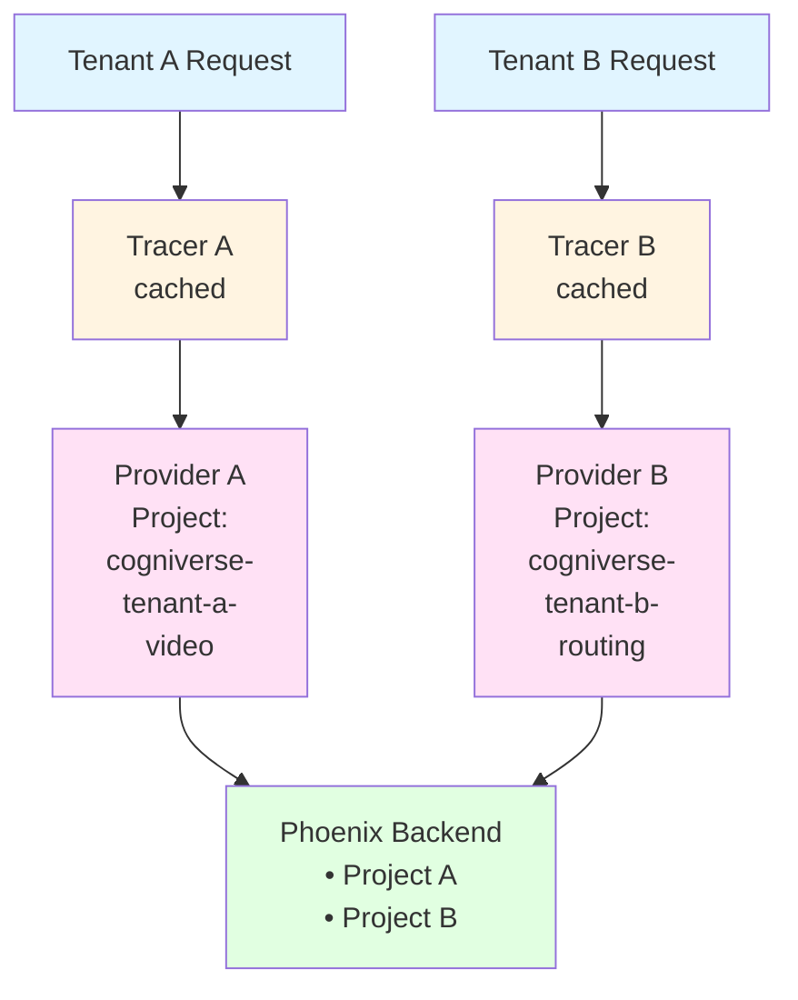
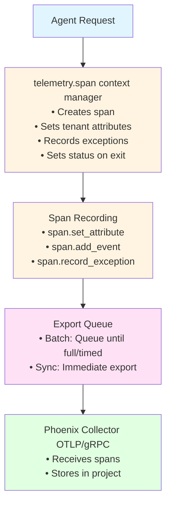

# Cogniverse Study Guide: Instrumentation & Observability Module

**Last Updated:** 2025-10-07
**Module Path:** `src/app/telemetry/`, `src/evaluation/phoenix/`
**Purpose:** Phoenix-powered observability and multi-tenant telemetry

---

## Module Overview

### Purpose
The Instrumentation module provides production-grade observability through:
- **Multi-Tenant Telemetry**: Isolated tracing per tenant/project
- **OpenTelemetry Integration**: Industry-standard span instrumentation
- **Phoenix Backend**: Arize Phoenix for trace collection and analysis
- **Performance Metrics**: Modality-specific performance tracking
- **Analytics**: Trace analysis and visualization

### Key Features
- Lazy initialization with LRU caching for tracer providers
- Batch vs synchronous span export modes
- Graceful degradation when telemetry unavailable
- Per-modality performance metrics (latency percentiles, success rates)
- Phoenix analytics with Plotly visualizations

---

## Architecture

### 1. Telemetry Architecture



### 2. Multi-Tenant Isolation



### 3. Span Lifecycle



---

## Core Components

### 1. TelemetryManager

**File:** `src/app/telemetry/manager.py`

The singleton manager for all telemetry operations.

#### Key Features
- **Lazy Initialization**: Tracer providers created on first use
- **LRU Caching**: Max 100 tenants cached by default
- **Thread-Safe**: Uses threading.RLock for concurrent access
- **Graceful Degradation**: Returns NoOpSpan when telemetry disabled

#### Usage

```python
from src.app.telemetry.manager import get_telemetry_manager

# Get singleton instance
telemetry = get_telemetry_manager()

# Create tenant-specific span
tenant_id = "tenant-123"
with telemetry.span(
    name="cogniverse.routing",
    tenant_id=tenant_id,
    attributes={
        "routing.chosen_agent": "video_search",
        "routing.confidence": 0.95
    }
) as span:
    # Perform routing logic
    result = route_query(query)

    # Add more attributes dynamically
    span.set_attribute("routing.strategy", result.strategy)
    span.set_attribute("routing.latency_ms", result.latency)
```

#### Configuration

```python
from src.app.telemetry.config import TelemetryConfig, TelemetryLevel

config = TelemetryConfig(
    enabled=True,
    level=TelemetryLevel.DETAILED,
    phoenix_endpoint="localhost:4317",
    phoenix_enabled=True,
    tenant_project_template="cogniverse-{tenant_id}-{service}",
    max_cached_tenants=100
)

telemetry = TelemetryManager(config)
```

#### Environment Variables

```bash
# Core settings
TELEMETRY_ENABLED=true
TELEMETRY_LEVEL=detailed  # disabled, basic, detailed, verbose

# Phoenix settings
PHOENIX_ENABLED=true
PHOENIX_COLLECTOR_ENDPOINT=localhost:4317
PHOENIX_USE_TLS=false

# Test mode
TELEMETRY_SYNC_EXPORT=true  # Synchronous export for tests
```

### 2. TelemetryConfig

**File:** `src/app/telemetry/config.py`

Configuration for telemetry system with multi-tenant support.

#### Key Settings

```python
@dataclass
class TelemetryConfig:
    # Core settings
    enabled: bool = True
    level: TelemetryLevel = TelemetryLevel.DETAILED
    environment: str = "development"

    # Phoenix settings
    phoenix_enabled: bool = True
    phoenix_endpoint: str = "localhost:4317"
    phoenix_use_tls: bool = False

    # Multi-tenant settings
    tenant_project_template: str = "cogniverse-{tenant_id}-{service}"
    default_tenant_id: str = "default"
    max_cached_tenants: int = 100

    # Batch export settings
    batch_config: BatchExportConfig = field(default_factory=BatchExportConfig)
```

#### Telemetry Levels

```python
class TelemetryLevel(Enum):
    DISABLED = "disabled"   # No telemetry
    BASIC = "basic"         # Only search operations
    DETAILED = "detailed"   # Search + encoders + backend
    VERBOSE = "verbose"     # Everything including internal operations
```

#### Batch Export Config

```python
@dataclass
class BatchExportConfig:
    max_queue_size: int = 2048
    max_export_batch_size: int = 512
    export_timeout_millis: int = 30_000
    schedule_delay_millis: int = 500

    # Queue behavior when full
    drop_on_queue_full: bool = True
    log_dropped_spans: bool = True

    # Test mode - synchronous export
    use_sync_export: bool = False  # Set via TELEMETRY_SYNC_EXPORT=true
```

### 3. ModalityMetricsTracker

**File:** `src/app/telemetry/modality_metrics.py`

Tracks per-modality performance metrics with rolling windows.

#### Key Features
- **Latency Percentiles**: P50, P95, P99
- **Success Rates**: Per modality error tracking
- **Throughput**: Queries per second
- **Rolling Windows**: Configurable window size (default 1000)

#### Usage

```python
from src.app.telemetry.modality_metrics import ModalityMetricsTracker
from src.app.search.multi_modal_reranker import QueryModality

tracker = ModalityMetricsTracker(window_size=1000)

# Record execution
tracker.record_modality_execution(
    modality=QueryModality.VIDEO,
    latency_ms=234.5,
    success=True
)

# Get stats for specific modality
stats = tracker.get_modality_stats(QueryModality.VIDEO)
print(f"P95 latency: {stats['p95_latency']:.2f}ms")
print(f"Success rate: {stats['success_rate']:.2%}")

# Get all stats
all_stats = tracker.get_all_stats()
for modality, stats in all_stats.items():
    print(f"{modality}: {stats['total_requests']} requests")

# Get slowest modalities
slowest = tracker.get_slowest_modalities(top_k=3)
for entry in slowest:
    print(f"{entry['modality']}: {entry['p95_latency']:.0f}ms")

# Get error-prone modalities
error_prone = tracker.get_error_prone_modalities(min_error_rate=0.1)
for entry in error_prone:
    print(f"{entry['modality']}: {entry['error_rate']:.2%}")
    print(f"  Errors: {entry['error_breakdown']}")
```

#### Metrics Structure

```python
{
    "modality": "video",
    "total_requests": 1000,
    "success_count": 950,
    "error_count": 50,
    "success_rate": 0.95,
    "p50_latency": 150.0,
    "p95_latency": 450.0,
    "p99_latency": 850.0,
    "avg_latency": 200.5,
    "min_latency": 50.0,
    "max_latency": 2000.0,
    "error_breakdown": {
        "timeout": 30,
        "connection_error": 20
    },
    "throughput_qps": 5.2
}
```

### 4. PhoenixAnalytics

**File:** `src/evaluation/phoenix/analytics.py`

Analytics and visualization engine for Phoenix traces.

#### Key Features
- Fetch traces with time range and operation filters
- Calculate trace-level metrics (duration, status, errors)
- Extract profile and strategy attributes
- Generate performance analytics
- Create Plotly visualizations

#### Usage

```python
from datetime import datetime, timedelta
from src.evaluation.phoenix.analytics import PhoenixAnalytics

analytics = PhoenixAnalytics(phoenix_url="http://localhost:6006")

# Fetch recent traces
end_time = datetime.now()
start_time = end_time - timedelta(hours=1)

traces = analytics.get_traces(
    start_time=start_time,
    end_time=end_time,
    operation_filter="cogniverse.routing",
    limit=1000
)

# Analyze traces
for trace in traces:
    print(f"Trace {trace.trace_id}:")
    print(f"  Operation: {trace.operation}")
    print(f"  Duration: {trace.duration_ms:.2f}ms")
    print(f"  Status: {trace.status}")
    print(f"  Profile: {trace.profile}")
    print(f"  Strategy: {trace.strategy}")
```

#### TraceMetrics Structure

```python
@dataclass
class TraceMetrics:
    trace_id: str
    timestamp: datetime
    duration_ms: float
    operation: str
    status: str  # "success" or "error"
    profile: str | None
    strategy: str | None
    error: str | None
    metadata: dict[str, Any]
```

---

## Integration Patterns

### 1. Agent Instrumentation

```python
from src.app.telemetry.manager import get_telemetry_manager

class VideoSearchAgent:
    def __init__(self, config):
        self.config = config
        self.telemetry = get_telemetry_manager()

    def search(self, query: str, tenant_id: str = "default"):
        # Create root span for the search operation
        with self.telemetry.span(
            name="video_agent.search",
            tenant_id=tenant_id,
            attributes={
                "agent.type": "video_search",
                "query.text": query,
                "query.length": len(query)
            }
        ) as root_span:
            # Embedding generation (child span)
            with self.telemetry.span(
                name="video_agent.encode_query",
                tenant_id=tenant_id
            ) as encode_span:
                embedding = self.encoder.encode(query)
                encode_span.set_attribute("embedding.dimension", len(embedding))

            # Vespa search (child span)
            with self.telemetry.span(
                name="video_agent.vespa_search",
                tenant_id=tenant_id
            ) as search_span:
                results = self.vespa_client.search(embedding)
                search_span.set_attribute("results.count", len(results))

            # Add final attributes to root span
            root_span.set_attribute("search.success", True)
            root_span.set_attribute("search.result_count", len(results))

            return results
```

### 2. Routing Agent with Phoenix Projects

```python
from src.app.telemetry.manager import get_telemetry_manager
from src.app.telemetry.config import SERVICE_NAME_ORCHESTRATION

class RoutingAgent:
    def __init__(self, config):
        self.telemetry = get_telemetry_manager()

    def route_query(self, query: str, tenant_id: str = "default"):
        # Use orchestration service name for Phoenix project
        with self.telemetry.span(
            name="cogniverse.routing",
            tenant_id=tenant_id,
            service_name=SERVICE_NAME_ORCHESTRATION,
            attributes={
                "openinference.project.name": f"cogniverse-{tenant_id}-orchestration"
            }
        ) as span:
            # Extract entities
            entities = self.extract_entities(query)
            span.set_attribute("routing.entities_found", len(entities))

            # Determine modality
            modality = self.determine_modality(entities)
            span.set_attribute("routing.chosen_modality", modality.value)

            # Select agent
            agent = self.select_agent(modality)
            span.set_attribute("routing.chosen_agent", agent.name)

            return {
                "modality": modality,
                "agent": agent,
                "confidence": 0.95
            }
```

### 3. Error Handling with Spans

```python
from src.app.telemetry.manager import get_telemetry_manager
from opentelemetry.trace import Status, StatusCode

class SearchService:
    def __init__(self):
        self.telemetry = get_telemetry_manager()

    def search_with_retry(self, query: str, tenant_id: str = "default"):
        with self.telemetry.span(
            name="search_service.search_with_retry",
            tenant_id=tenant_id
        ) as span:
            max_retries = 3
            for attempt in range(max_retries):
                try:
                    span.add_event(f"attempt_{attempt + 1}")

                    results = self._execute_search(query)

                    span.set_attribute("search.attempts", attempt + 1)
                    span.set_attribute("search.success", True)
                    span.set_status(Status(StatusCode.OK))

                    return results

                except Exception as e:
                    span.add_event(
                        f"attempt_{attempt + 1}_failed",
                        attributes={"error": str(e)}
                    )

                    if attempt == max_retries - 1:
                        # Final retry failed
                        span.record_exception(e)
                        span.set_status(Status(StatusCode.ERROR, str(e)))
                        span.set_attribute("search.success", False)
                        raise
```

### 4. Multi-Tenant Testing

```python
import pytest
from src.app.telemetry.manager import TelemetryManager
from src.app.telemetry.config import TelemetryConfig

@pytest.fixture
def telemetry_manager():
    config = TelemetryConfig(
        enabled=True,
        phoenix_enabled=True,
        batch_config=BatchExportConfig(use_sync_export=True)  # Sync for tests
    )
    manager = TelemetryManager(config)
    yield manager
    manager.force_flush(timeout_millis=5000)
    manager.shutdown()

def test_multi_tenant_isolation(telemetry_manager):
    # Tenant A
    with telemetry_manager.span("test_operation", tenant_id="tenant-a") as span:
        span.set_attribute("tenant.data", "sensitive-a")

    # Tenant B
    with telemetry_manager.span("test_operation", tenant_id="tenant-b") as span:
        span.set_attribute("tenant.data", "sensitive-b")

    # Flush spans
    assert telemetry_manager.force_flush()

    # Verify spans are in separate Phoenix projects
    # (would query Phoenix API to verify isolation)
```

---

## Production Considerations

### 1. Performance

**Span Creation Overhead**
- Lazy tracer initialization (first request per tenant)
- LRU cache hit rate typically >95% in production
- NoOpSpan fallback adds <1μs overhead when telemetry disabled

**Batch Export Efficiency**
```python
# Production configuration
BatchExportConfig(
    max_queue_size=2048,           # Large queue for bursty traffic
    max_export_batch_size=512,     # Efficient batch size
    export_timeout_millis=30_000,  # 30s timeout
    schedule_delay_millis=500,     # Export every 500ms or when batch full
    drop_on_queue_full=True        # Prevent blocking application
)
```

**Memory Management**
- Rolling window for modality metrics (default 1000 samples)
- LRU eviction for tenant tracers (default 100 tenants)
- Span processors automatically clean up exported spans

### 2. Multi-Tenancy

**Project Isolation**
```python
# Template generates unique project names
tenant_project_template = "cogniverse-{tenant_id}-{service}"

# Examples:
# cogniverse-tenant-123-video
# cogniverse-tenant-123-routing
# cogniverse-tenant-456-video
```

**Resource Attributes**
```python
# Every span includes tenant context
resource = Resource.create({
    "service.name": service_name,
    "openinference.project.name": project_name,
    "tenant.id": tenant_id,
    "environment": environment
})
```

### 3. Monitoring

**Key Metrics to Monitor**
```python
# TelemetryManager stats
stats = telemetry.get_stats()
print(f"Cache hit rate: {stats['cache_hits'] / (stats['cache_hits'] + stats['cache_misses']):.2%}")
print(f"Failed initializations: {stats['failed_initializations']}")
print(f"Active tenants: {stats['cached_tenants']}")

# Modality metrics
summary = metrics_tracker.get_summary_stats()
print(f"Overall success rate: {summary['overall_success_rate']:.2%}")
print(f"Active modalities: {summary['active_modalities']}")
print(f"Avg P95 latency: {summary['avg_latency_p95']:.0f}ms")

# Slowest operations
slowest = metrics_tracker.get_slowest_modalities(top_k=3)
for entry in slowest:
    alert_if_slow(entry['modality'], entry['p95_latency'])
```

**Health Checks**
```python
def check_telemetry_health():
    telemetry = get_telemetry_manager()

    # Check configuration
    if not telemetry.config.enabled:
        return {"status": "disabled"}

    # Check Phoenix connectivity
    try:
        test_span = telemetry.span("health_check", tenant_id="system")
        with test_span:
            pass

        # Force flush to verify export works
        success = telemetry.force_flush(timeout_millis=5000)

        return {
            "status": "healthy" if success else "degraded",
            "phoenix_endpoint": telemetry.config.phoenix_endpoint,
            "stats": telemetry.get_stats()
        }
    except Exception as e:
        return {
            "status": "unhealthy",
            "error": str(e)
        }
```

### 4. Troubleshooting

**Common Issues**

1. **Spans not appearing in Phoenix**
```python
# Check synchronous export for immediate visibility (tests)
export TELEMETRY_SYNC_EXPORT=true

# Or force flush manually
telemetry.force_flush(timeout_millis=10000)

# Check Phoenix collector endpoint
export PHOENIX_COLLECTOR_ENDPOINT=localhost:4317

# Verify Phoenix is running
curl http://localhost:6006
```

2. **High memory usage**
```python
# Reduce cached tenants
config = TelemetryConfig(max_cached_tenants=50)

# Reduce modality metrics window
tracker = ModalityMetricsTracker(window_size=500)

# Reduce batch queue size
config.batch_config.max_queue_size = 1024
```

3. **Dropped spans**
```python
# Check stats for dropped spans
stats = telemetry.get_stats()
if stats.get('dropped_spans', 0) > 0:
    # Increase queue size
    config.batch_config.max_queue_size = 4096

    # Decrease export delay
    config.batch_config.schedule_delay_millis = 250
```

4. **Tenant isolation issues**
```python
# Verify project name generation
project_name = config.get_project_name("tenant-123", "video")
print(project_name)  # Should be: cogniverse-tenant-123-video

# Check span attributes
with telemetry.span("test", tenant_id="tenant-123") as span:
    # Should automatically include:
    # - tenant.id = tenant-123
    # - openinference.project.name = cogniverse-tenant-123-video
    pass
```

---

## Testing Guide

### Unit Tests

**File:** `tests/telemetry/unit/test_telemetry_manager.py`

```python
def test_lazy_initialization():
    """Tracers created on first use"""
    manager = TelemetryManager()
    assert len(manager._tenant_tracers) == 0

    tracer = manager.get_tracer("tenant-1")
    assert tracer is not None
    assert len(manager._tenant_tracers) == 1

def test_lru_eviction():
    """Old tracers evicted when cache full"""
    config = TelemetryConfig(max_cached_tenants=2)
    manager = TelemetryManager(config)

    # Add 3 tenants (should evict oldest)
    manager.get_tracer("tenant-1")
    manager.get_tracer("tenant-2")
    manager.get_tracer("tenant-3")

    assert len(manager._tenant_tracers) <= 2

def test_graceful_degradation():
    """Returns NoOpSpan when disabled"""
    config = TelemetryConfig(enabled=False)
    manager = TelemetryManager(config)

    with manager.span("test", tenant_id="tenant-1") as span:
        # Should be NoOpSpan
        span.set_attribute("key", "value")  # No error
```

### Integration Tests

**File:** `tests/telemetry/integration/test_multi_tenant_telemetry.py`

```python
def test_multi_tenant_span_isolation():
    """Spans go to correct Phoenix projects"""
    telemetry = get_telemetry_manager()

    # Create spans for different tenants
    tenants = ["tenant-a", "tenant-b", "tenant-c"]
    for tenant in tenants:
        with telemetry.span("test_operation", tenant_id=tenant) as span:
            span.set_attribute("tenant.test_data", f"data-{tenant}")

    # Force flush
    assert telemetry.force_flush(timeout_millis=5000)

    # Verify spans in Phoenix (requires Phoenix API client)
    # Would check each tenant's spans are in correct project
```

---

## Key Files Reference

### Telemetry Module
- `src/app/telemetry/manager.py` - TelemetryManager singleton (376 lines)
- `src/app/telemetry/config.py` - Configuration and settings (113 lines)
- `src/app/telemetry/modality_metrics.py` - Performance metrics tracking (355 lines)

### Phoenix Analytics
- `src/evaluation/phoenix/analytics.py` - Analytics and visualization (150+ lines)
- `src/evaluation/core/experiment_tracker.py` - Experiment tracking (See Guide 06)

### Tests
- `tests/telemetry/integration/test_multi_tenant_telemetry.py` - Multi-tenant integration tests
- `tests/routing/integration/test_phoenix_span_evaluator_integration.py` - Span evaluator tests

---

## Best Practices

### 1. Span Naming
```python
# Good: Hierarchical and descriptive
"cogniverse.request"
"cogniverse.routing"
"cogniverse.orchestration"
"video_agent.search"
"video_agent.encode_query"
"video_agent.vespa_search"

# Bad: Generic and unhelpful
"process"
"execute"
"run"
```

### 2. Attribute Organization
```python
# Use semantic conventions
span.set_attribute("http.method", "POST")
span.set_attribute("http.status_code", 200)

# Use prefixes for custom attributes
span.set_attribute("cogniverse.query.text", query)
span.set_attribute("cogniverse.agent.type", "video_search")
span.set_attribute("cogniverse.routing.confidence", 0.95)

# Use OpenInference conventions
span.set_attribute("openinference.project.name", project_name)
```

### 3. Error Recording
```python
try:
    result = risky_operation()
except SpecificError as e:
    span.record_exception(e)
    span.set_status(Status(StatusCode.ERROR, str(e)))
    span.set_attribute("error.type", type(e).__name__)
    span.set_attribute("error.handled", True)
    raise
```

### 4. Performance Monitoring
```python
# Record timing breakdown
with telemetry.span("search", tenant_id=tenant_id) as span:
    start = time.time()

    # Encoding
    encode_start = time.time()
    embedding = encode(query)
    encode_time = (time.time() - encode_start) * 1000
    span.set_attribute("timing.encode_ms", encode_time)

    # Search
    search_start = time.time()
    results = search(embedding)
    search_time = (time.time() - search_start) * 1000
    span.set_attribute("timing.search_ms", search_time)

    # Total
    total_time = (time.time() - start) * 1000
    span.set_attribute("timing.total_ms", total_time)
```

---

**Next**: Update README.md and PROGRESS.md with all new guides (11-17)

**Related Guides:**
- [05_TELEMETRY_MODULE.md](./05_TELEMETRY_MODULE.md) - TelemetryManager overview
- [06_EVALUATION_MODULE.md](./06_EVALUATION_MODULE.md) - Phoenix experiments and evaluation
- [16_SYSTEM_INTEGRATION.md](./16_SYSTEM_INTEGRATION.md) - E2E integration testing
