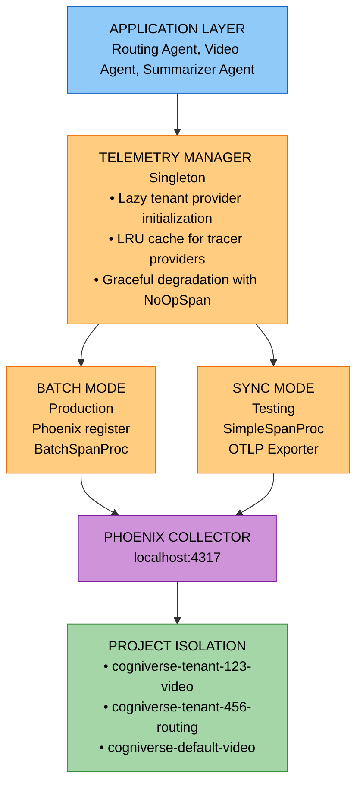
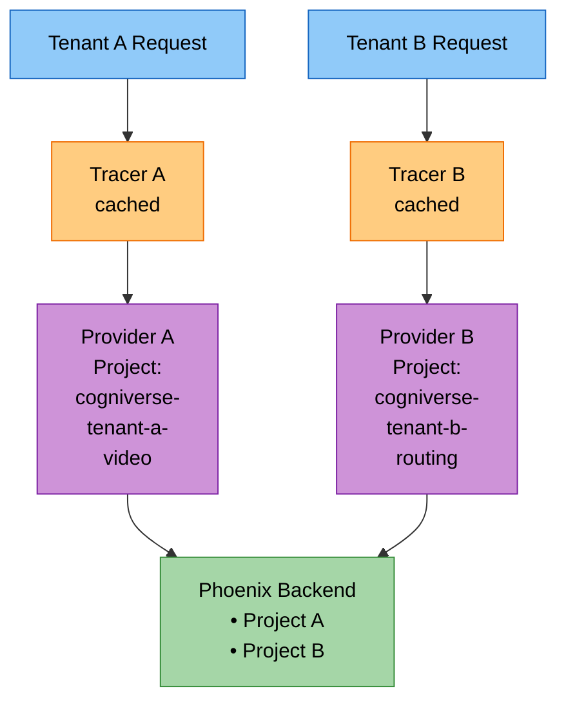
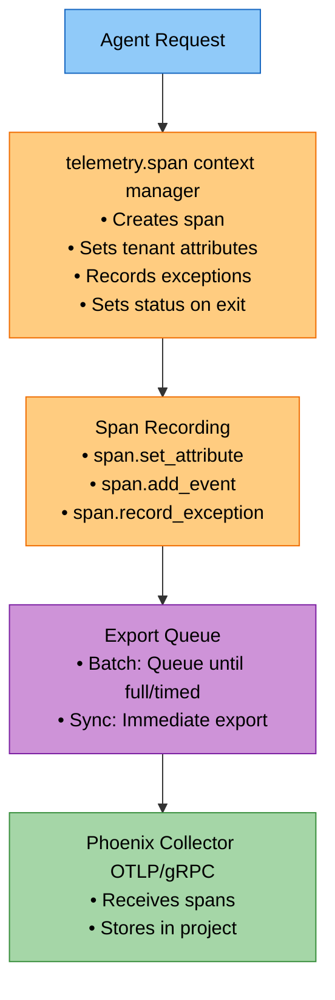

# Cogniverse Study Guide: Instrumentation & Observability Module

**Module Path:** `libs/foundation/cogniverse_foundation/telemetry/`, `libs/telemetry-phoenix/cogniverse_telemetry_phoenix/`

---

## Module Overview

### Purpose
The Instrumentation module provides production-grade observability through:

- **Multi-Tenant Telemetry**: Isolated tracing per tenant/project

- **OpenTelemetry Integration**: Industry-standard span instrumentation

- **Phoenix Backend**: Arize Phoenix for trace collection and analysis

- **Per-Modality Observability**: `cogniverse.profile_selection` spans aggregated by modality in the Profile Routing Metrics dashboard tab

- **Analytics**: Trace analysis and visualization

### Key Features
- Lazy initialization with LRU caching for tracer providers
- Batch vs synchronous span export modes
- Graceful degradation when telemetry unavailable
- Per-modality observability via `cogniverse.profile_selection` spans and the Profile Routing Metrics dashboard tab
- Phoenix analytics with Plotly visualizations
- **Session Tracking**: Multi-turn conversation tracking with `session_span()` method
- **Phoenix Sessions View**: Grouped trace visualization for conversation trajectories
- **Provider Abstraction**: `TelemetryProvider` and its three store interfaces (`TraceStore`, `AnnotationStore`, `DatasetStore`) define a backend-agnostic contract; `PhoenixProvider` is the shipped implementation, auto-discovered via the `cogniverse.telemetry.providers` entry-point group
- **Real-Time Monitoring**: `RetrievalMonitor` sliding-window latency/error/MRR tracking with configurable alert thresholds, used by the quality-monitor cycle

---

## Architecture

### 1. Telemetry Architecture


```mermaid
flowchart TB
    App["<span style='color:#000'>APPLICATION LAYER<br/>Routing Agent, Video Agent, Summarizer Agent</span>"]

    Manager["<span style='color:#000'>TELEMETRY MANAGER Singleton<br/>• Lazy tenant provider initialization<br/>• LRU cache for tracer providers<br/>• Graceful degradation with NoOpSpan</span>"]

    Batch["<span style='color:#000'>BATCH MODE<br/>Production<br/>Phoenix register<br/>BatchSpanProc</span>"]
    Sync["<span style='color:#000'>SYNC MODE<br/>Testing<br/>SimpleSpanProc<br/>OTLP Exporter</span>"]

    Collector["<span style='color:#000'>PHOENIX COLLECTOR<br/>localhost:4317</span>"]

    Isolation["<span style='color:#000'>PROJECT ISOLATION<br/>• cogniverse-tenant-123-video<br/>• cogniverse-tenant-456-routing<br/>• cogniverse-default-video</span>"]

    App --> Manager
    Manager --> Batch
    Manager --> Sync
    Batch --> Collector
    Sync --> Collector
    Collector --> Isolation

    style App fill:#90caf9,stroke:#1565c0,color:#000
    style Manager fill:#ffcc80,stroke:#ef6c00,color:#000
    style Batch fill:#ffcc80,stroke:#ef6c00,color:#000
    style Sync fill:#ffcc80,stroke:#ef6c00,color:#000
    style Collector fill:#ce93d8,stroke:#7b1fa2,color:#000
    style Isolation fill:#a5d6a7,stroke:#388e3c,color:#000
```

### 2. Multi-Tenant Isolation


```mermaid
flowchart TB
    ReqA["<span style='color:#000'>Tenant A Request</span>"]
    ReqB["<span style='color:#000'>Tenant B Request</span>"]

    TracerA["<span style='color:#000'>Tracer A<br/>cached</span>"]
    TracerB["<span style='color:#000'>Tracer B<br/>cached</span>"]

    ProviderA["<span style='color:#000'>Provider A<br/>Project:<br/>cogniverse-<br/>tenant-a-<br/>video</span>"]
    ProviderB["<span style='color:#000'>Provider B<br/>Project:<br/>cogniverse-<br/>tenant-b-<br/>routing</span>"]

    Phoenix["<span style='color:#000'>Phoenix Backend<br/>• Project A<br/>• Project B</span>"]

    ReqA --> TracerA
    ReqB --> TracerB

    TracerA --> ProviderA
    TracerB --> ProviderB

    ProviderA --> Phoenix
    ProviderB --> Phoenix

    style ReqA fill:#90caf9,stroke:#1565c0,color:#000
    style ReqB fill:#90caf9,stroke:#1565c0,color:#000
    style TracerA fill:#ffcc80,stroke:#ef6c00,color:#000
    style TracerB fill:#ffcc80,stroke:#ef6c00,color:#000
    style ProviderA fill:#ce93d8,stroke:#7b1fa2,color:#000
    style ProviderB fill:#ce93d8,stroke:#7b1fa2,color:#000
    style Phoenix fill:#a5d6a7,stroke:#388e3c,color:#000
```

### 3. Span Lifecycle


```mermaid
flowchart TB
    Request["<span style='color:#000'>Agent Request</span>"]

    Context["<span style='color:#000'>telemetry.span context manager<br/>• Creates span<br/>• Sets tenant attributes<br/>• Records exceptions<br/>• Sets status on exit</span>"]

    Recording["<span style='color:#000'>Span Recording<br/>• span.set_attribute<br/>• span.add_event<br/>• span.record_exception</span>"]

    Queue["<span style='color:#000'>Export Queue<br/>• Batch: Queue until full/timed<br/>• Sync: Immediate export</span>"]

    Collector["<span style='color:#000'>Phoenix Collector OTLP/gRPC<br/>• Receives spans<br/>• Stores in project</span>"]

    Request --> Context
    Context --> Recording
    Recording --> Queue
    Queue --> Collector

    style Request fill:#90caf9,stroke:#1565c0,color:#000
    style Context fill:#ffcc80,stroke:#ef6c00,color:#000
    style Recording fill:#ffcc80,stroke:#ef6c00,color:#000
    style Queue fill:#ce93d8,stroke:#7b1fa2,color:#000
    style Collector fill:#a5d6a7,stroke:#388e3c,color:#000
```

---

## Core Components

### 1. TelemetryManager

**File:** `libs/foundation/cogniverse_foundation/telemetry/manager.py`

**Package:** `cogniverse-foundation` (foundation layer)

The singleton manager for all telemetry operations.

#### Key Features
- **Lazy Initialization**: Tracer providers created on first use
- **LRU Caching**: Max 100 tenants cached by default
- **Thread-Safe**: Uses threading.RLock for concurrent access
- **Graceful Degradation**: Returns NoOpSpan when telemetry disabled

#### Usage

```python
from cogniverse_foundation.telemetry.manager import get_telemetry_manager

# Get singleton instance
telemetry = get_telemetry_manager()

# Create tenant-specific span
tenant_id = "tenant-123"
with telemetry.span(
    name="cogniverse.routing",
    tenant_id=tenant_id,
    attributes={
        "routing.chosen_agent": "video_search",
        "routing.confidence": 0.95
    }
) as span:
    # Perform routing logic
    result = route_query(query)

    # Add more attributes dynamically
    span.set_attribute("routing.strategy", result.strategy)
    span.set_attribute("routing.latency_ms", result.latency)
```

#### Session Tracking for Multi-Turn Conversations

```python
from cogniverse_foundation.telemetry.manager import get_telemetry_manager

telemetry = get_telemetry_manager()

# Multi-turn conversation with session tracking
session_id = "user-session-uuid-123"

# Turn 1: First search
with telemetry.session_span("search", tenant_id="acme", session_id=session_id) as span:
    span.set_attribute("query", "find basketball videos")
    results = search("find basketball videos")

# Turn 2: Follow-up search (same session)
with telemetry.session_span("search", tenant_id="acme", session_id=session_id) as span:
    span.set_attribute("query", "show me dunks")
    results = search("show me dunks")

# Both spans will be grouped in Phoenix Sessions view under session_id
# Enables:
# - Trajectory extraction for fine-tuning
# - Session-level evaluation
# - Conversation history analysis
```

**Session Tracking Benefits:**

- **Phoenix Sessions View**: Traces with same `session.id` grouped together

- **Fine-Tuning Data**: Extract conversation trajectories for fine-tuning datasets

- **Session Evaluation**: Log session-level outcomes (success/partial/failure)

- **Conversation Analysis**: View complete user journeys across turns

#### Configuration

```python
from cogniverse_foundation.telemetry.config import TelemetryConfig, TelemetryLevel

config = TelemetryConfig(
    enabled=True,
    level=TelemetryLevel.DETAILED,
    otlp_endpoint="localhost:4317",
    otlp_enabled=True,
    tenant_service_template="cogniverse-{tenant_id}-{service}",
    max_cached_tenants=100
)

telemetry = TelemetryManager(config)
```

### 2. TelemetryConfig

**File:** `libs/foundation/cogniverse_foundation/telemetry/config.py`

**Package:** `cogniverse-foundation` (foundation layer)

Configuration for telemetry system with multi-tenant support.

#### Key Settings

```python
@dataclass
class TelemetryConfig:
    # Core settings
    enabled: bool = True
    level: TelemetryLevel = TelemetryLevel.DETAILED
    environment: str = "development"

    # OpenTelemetry OTLP settings (backend-agnostic)
    otlp_enabled: bool = True
    otlp_endpoint: str = "localhost:4317"
    otlp_use_tls: bool = False

    # Provider selection for querying spans/annotations/datasets
    # (separate from OTLP span export above); None = auto-detect
    provider: str | None = None
    provider_config: dict = field(default_factory=dict)

    # Multi-tenant settings
    tenant_project_template: str = "cogniverse-{tenant_id}"
    tenant_service_template: str = "cogniverse-{tenant_id}-{service}"
    max_cached_tenants: int = 100  # LRU cache size
    tenant_cache_ttl_seconds: int = 3600  # 1 hour; 0 disables expiry

    # Batch export settings
    batch_config: BatchExportConfig = field(default_factory=BatchExportConfig)

    # Service identification
    service_name: str = "video-search"
    service_version: str = "1.0.0"

    # Extra OTel resource attributes merged into every tracer provider
    extra_resource_attributes: dict = field(default_factory=dict)
```

#### Telemetry Levels

```python
class TelemetryLevel(Enum):
    DISABLED = "disabled"   # No telemetry
    BASIC = "basic"         # Only search operations
    DETAILED = "detailed"   # Search + encoders + backend
    VERBOSE = "verbose"     # Everything including internal operations
```

#### Batch Export Config

```python
@dataclass
class BatchExportConfig:
    max_queue_size: int = 2048
    max_export_batch_size: int = 512
    export_timeout_millis: int = 30_000
    schedule_delay_millis: int = 500

    # Test mode - synchronous export
    use_sync_export: bool = False  # Set via TELEMETRY_SYNC_EXPORT=true
```

Queue-full drop behaviour is handled natively by OTel's `BatchSpanProcessor`
(created by `phoenix.otel.register(batch=True)` inside `PhoenixProvider`):
when the queue reaches `max_queue_size` the processor drops new spans rather
than blocking the calling thread.

### 3. Context Helpers

**File:** `libs/foundation/cogniverse_foundation/telemetry/context.py`

**Package:** `cogniverse-foundation` (foundation layer)

Pre-built span helpers matching the legacy instrumentation shape, so callers don't hand-assemble the same attribute sets. All wrap `TelemetryManager.span()`.

#### Key Functions
- `search_span(tenant_id, query, top_k=10, ranking_strategy="default", profile="unknown", backend="vespa")` — CHAIN span (`search_service.search`, component `search_service`), sets `latency_ms` and OK/ERROR status on exit
- `encode_span(tenant_id, encoder_type, query_length=0, query="")` — EMBEDDING span (`encoder.{encoder_type}.encode`, component `encoder`), sets `encoding_time_ms`
- `backend_search_span(tenant_id, backend_type="vespa", schema_name="unknown", ranking_strategy="default", top_k=10, has_embeddings=False, query_text="")` — RETRIEVER span (`search.execute`, component `backend`)
- `add_search_results_to_span(span, results)` — attaches `num_results`, `top_score`, and a `search_results` event with the top 3 hits
- `add_embedding_details_to_span(span, embeddings)` — attaches `embedding_shape`, `embedding_dtype`, norm mean/std

#### Usage

```python
from cogniverse_foundation.telemetry.context import search_span, add_search_results_to_span

with search_span(tenant_id="tenant-123", query="find basketball videos", top_k=10) as span:
    results = run_search(query)
    add_search_results_to_span(span, results)
```

### 4. TelemetryProvider Interfaces & Registry

**Files:**
- `libs/foundation/cogniverse_foundation/telemetry/providers/base.py` — abstract interfaces
- `libs/foundation/cogniverse_foundation/telemetry/providers/__init__.py` — public exports
- `libs/foundation/cogniverse_foundation/telemetry/registry.py` — entry-point registry

**Package:** `cogniverse-foundation` (foundation layer)

Backend-agnostic contract for querying telemetry data. Core has zero knowledge of Phoenix/LangSmith specifics — provider packages implement these interfaces.

#### Key Classes
- **`TelemetryProvider`** (ABC) — exposes exactly three store properties, `.traces`, `.annotations`, `.datasets`, plus `initialize(config)`, `configure_span_export(...)`, and `session_context(session_id)`
- **`TraceStore`** (ABC) — `get_spans(project, start_time=None, end_time=None, filters=None, limit=1000)`, `get_span_by_id(span_id, project)`
- **`AnnotationStore`** (ABC) — `add_annotation(...)`, `get_annotations(...)`, `log_evaluations(eval_name, evaluations_df, project)`
- **`DatasetStore`** (ABC) — `create_dataset(...)`, `get_dataset(name)`, `append_to_dataset(...)`
- **`TelemetryRegistry`** — `EntryPointRegistry` subclass; providers register via the `cogniverse.telemetry.providers` entry-point group and are cached per `(tenant_id, project)` so distinct projects for one tenant don't share endpoints

#### Usage

```python
from cogniverse_foundation.telemetry.registry import get_telemetry_registry

registry = get_telemetry_registry()
provider = registry.get(
    name="phoenix",  # None = auto-detect the only registered provider
    tenant_id="tenant-123",
    config={"tenant_id": "tenant-123", "http_endpoint": "http://localhost:6006"},
)
spans_df = await provider.traces.get_spans(project="cogniverse-tenant-123", limit=1000)
```

### 5. PhoenixProvider

**File:** `libs/telemetry-phoenix/cogniverse_telemetry_phoenix/provider.py`

**Package:** `cogniverse-telemetry-phoenix` (implementation layer)

The shipped `TelemetryProvider` implementation, registered under the `phoenix` entry point. Implements every store interface using Phoenix's `AsyncClient` (query side) and `phoenix.otel.register()` (span-export side).

#### Key Classes
- `PhoenixProvider(name="phoenix")` — `initialize(config)` requires `tenant_id`, `http_endpoint`, `grpc_endpoint`; `configure_span_export(...)` builds a `TracerProvider` via `phoenix.otel.register()`, swapping in a `BatchSpanProcessor` sized from `BatchExportConfig` when `use_batch_export=True`
- `PhoenixTraceStore.get_spans(...)` — pushes `filters={"name": ...}` down to a server-side `SpanQuery` predicate (single name or list) instead of pulling the whole project window and filtering client-side; always passes `timeout=120` (the client method's own default is 5s)
- `PhoenixAnnotationStore`, `PhoenixDatasetStore` — remaining store implementations
- AsyncClient instances are memoized per `(running event loop, endpoint)` in a `WeakKeyDictionary`, since a client's connection pool binds to the loop that created it (Streamlit runs a fresh loop per interaction)

### 6. PhoenixAnalytics

**File:** `libs/telemetry-phoenix/cogniverse_telemetry_phoenix/evaluation/analytics.py`

**Package:** `cogniverse-telemetry-phoenix` (implementation layer)

Analytics and visualization engine for Phoenix traces.

#### Key Features
- Fetch traces with time range and operation filters
- Calculate trace-level metrics (duration, status, errors)
- Extract profile and strategy attributes
- Generate performance analytics
- Create Plotly visualizations

#### Usage

```python
from datetime import datetime, timedelta
from cogniverse_telemetry_phoenix.evaluation.analytics import PhoenixAnalytics

analytics = PhoenixAnalytics(telemetry_url="http://localhost:6006")

# Fetch recent traces
end_time = datetime.now()
start_time = end_time - timedelta(hours=1)

traces = analytics.get_traces(
    start_time=start_time,
    end_time=end_time,
    operation_filter="cogniverse.routing",
    limit=1000
)

# Analyze traces
for trace in traces:
    print(f"Trace {trace.trace_id}:")
    print(f"  Operation: {trace.operation}")
    print(f"  Duration: {trace.duration_ms:.2f}ms")
    print(f"  Status: {trace.status}")
    print(f"  Profile: {trace.profile}")
    print(f"  Strategy: {trace.strategy}")
```

#### TraceMetrics Structure

```python
@dataclass
class TraceMetrics:
    trace_id: str
    timestamp: datetime
    duration_ms: float
    operation: str
    status: str  # "success" or "error"
    profile: str | None = None
    strategy: str | None = None
    error: str | None = None
    metadata: dict[str, Any] = field(default_factory=dict)
```

`TraceMetrics` is defined once in `libs/evaluation/cogniverse_evaluation/providers/base.py` (provider-agnostic) and re-exported from `cogniverse_telemetry_phoenix.evaluation.analytics` so existing imports keep working.

### 7. PhoenixEvaluationProvider & PhoenixEvaluatorFramework

**Files:**
- `libs/telemetry-phoenix/cogniverse_telemetry_phoenix/evaluation/evaluation_provider.py`
- `libs/telemetry-phoenix/cogniverse_telemetry_phoenix/evaluation/framework.py`

**Package:** `cogniverse-telemetry-phoenix` (implementation layer)

Phoenix implementation of the generic `EvaluationProvider` / `EvaluatorFramework` interfaces from `cogniverse_evaluation.providers.base`, used by `ExperimentTracker` and the quality-monitor cycle.

#### Key Classes
- **`PhoenixEvaluationProvider`** — `initialize(config)` resolves HTTP/gRPC endpoints from the shared `TelemetryManager` config when not explicitly provided; keeps strong references to fire-and-forget annotation tasks (`_spawn_background`) so CPython doesn't garbage-collect them before completion
- **`PhoenixEvaluatorFramework`** — `get_evaluator_base_class()` returns Phoenix's `BaseEvaluator`; `get_evaluation_result_type()` returns `EvaluationResult`
- **`EvaluationResult`** — `dict` subclass with attribute access (`result.score`, `result.label`), bridging Phoenix v14's `TypedDict`-based `ExperimentEvaluation` with code that expects attribute access

### 8. RetrievalMonitor

**File:** `libs/telemetry-phoenix/cogniverse_telemetry_phoenix/evaluation/monitoring.py`

**Package:** `cogniverse-telemetry-phoenix` (implementation layer)

Real-time sliding-window monitoring for retrieval quality, used by the quality-monitor cycle (`libs/evaluation/cogniverse_evaluation/quality_monitor.py`).

#### Key Classes
- **`AlertThresholds`** — `latency_p95_ms=1000.0`, `error_rate=0.05`, `mrr_drop=0.1`, `throughput_drop=0.3`
- **`MetricWindow`** — fixed-size `deque` (default 100) with `add(value)`, `get_mean()`, `get_p95()`, `get_error_rate()`
- **`RetrievalMonitor`** — per-profile `latency_windows` / `error_windows` / `mrr_windows`; `start()` launches a Phoenix session and a background monitoring thread; `log_retrieval_event(event)` feeds the windows; `get_metrics_summary()` returns aggregated stats; `stop()` shuts the thread down

### 9. Profile Routing Metrics Dashboard Tab

**File:** `libs/dashboard/cogniverse_dashboard/tabs/profile_metrics.py`

**Package:** `cogniverse-dashboard` (application layer)

Provides per-modality runtime observability by querying `cogniverse.profile_selection` spans from Phoenix and aggregating them by the `profile_selection.modality` attribute that `ProfileSelectionAgent` emits on every dispatch.

#### Key Features
- **Latency Percentiles**: P50, P95, P99 per modality, computed from span durations
- **Success Rates**: Per modality, derived from span `status_code`
- **Request Counts**: Per modality, from span count
- **Pie + Bar charts**: Query distribution and latency visualisation via Plotly
- **Lookback window**: Configurable (1–720 hours)

#### Usage

The tab is rendered automatically when the dashboard is running. To view per-modality metrics:

```bash
uv run streamlit run libs/dashboard/cogniverse_dashboard/app.py --server.port 8501
```

Select a tenant in the sidebar and open the "Profile Routing Metrics" tab. No extra instrumentation is required — metrics are derived entirely from `cogniverse.profile_selection` spans already emitted by `ProfileSelectionAgent`.

---

## Integration Patterns

Illustrative wiring patterns against the real `TelemetryManager` API. The
class and method names below (`VideoSearchAgent.search`,
`OrchestratorAgent.route_query`, `SearchService`) are simplified examples —
they do not match the actual `SearchAgent` (`libs/agents/cogniverse_agents/search_agent.py`)
or `OrchestratorAgent` (`libs/agents/cogniverse_agents/orchestrator_agent.py`)
method surfaces. For ready-made span helpers matching the codebase's own
conventions, prefer the `search_span` / `encode_span` / `backend_search_span`
context managers described in [Context Helpers](#3-context-helpers).

### 1. Agent Instrumentation

```python
from cogniverse_foundation.telemetry.manager import get_telemetry_manager

class VideoSearchAgent:
    def __init__(self, config):
        self.config = config
        self.telemetry = get_telemetry_manager()

    def search(self, query: str, tenant_id: str = "default"):
        # Create root span for the search operation
        with self.telemetry.span(
            name="video_agent.search",
            tenant_id=tenant_id,
            attributes={
                "agent.type": "video_search",
                "query.text": query,
                "query.length": len(query)
            }
        ) as root_span:
            # Embedding generation (child span)
            with self.telemetry.span(
                name="video_agent.encode_query",
                tenant_id=tenant_id
            ) as encode_span:
                embedding = self.encoder.encode(query)
                encode_span.set_attribute("embedding.dimension", len(embedding))

            # Vespa search (child span)
            with self.telemetry.span(
                name="video_agent.vespa_search",
                tenant_id=tenant_id
            ) as search_span:
                results = self.vespa_client.search(embedding)
                search_span.set_attribute("results.count", len(results))

            # Add final attributes to root span
            root_span.set_attribute("search.success", True)
            root_span.set_attribute("search.result_count", len(results))

            return results
```

### 2. Orchestrator Agent with Phoenix Projects

```python
from cogniverse_foundation.telemetry.manager import get_telemetry_manager

class OrchestratorAgent:
    def __init__(self, config):
        self.telemetry = get_telemetry_manager()

    def route_query(self, query: str, tenant_id: str = "default"):
        # Use project_name parameter for separate orchestration project
        with self.telemetry.span(
            name="cogniverse.routing",
            tenant_id=tenant_id,
            project_name="orchestration",
            attributes={
                "routing.operation": "route_query"
            }
        ) as span:
            # Extract entities
            entities = self.extract_entities(query)
            span.set_attribute("routing.entities_found", len(entities))

            # Determine modality
            modality = self.determine_modality(entities)
            span.set_attribute("routing.chosen_modality", modality.value)

            # Select agent
            agent = self.select_agent(modality)
            span.set_attribute("routing.chosen_agent", agent.name)

            return {
                "modality": modality,
                "agent": agent,
                "confidence": 0.95
            }
```

### 3. Error Handling with Spans

```python
from cogniverse_foundation.telemetry.manager import get_telemetry_manager
from opentelemetry.trace import Status, StatusCode

class SearchService:
    def __init__(self):
        self.telemetry = get_telemetry_manager()

    def search_with_retry(self, query: str, tenant_id: str = "default"):
        with self.telemetry.span(
            name="search_service.search_with_retry",
            tenant_id=tenant_id
        ) as span:
            max_retries = 3
            for attempt in range(max_retries):
                try:
                    span.add_event(f"attempt_{attempt + 1}")

                    results = self._execute_search(query)

                    span.set_attribute("search.attempts", attempt + 1)
                    span.set_attribute("search.success", True)
                    span.set_status(Status(StatusCode.OK))

                    return results

                except Exception as e:
                    span.add_event(
                        f"attempt_{attempt + 1}_failed",
                        attributes={"error": str(e)}
                    )

                    if attempt == max_retries - 1:
                        # Final retry failed
                        span.record_exception(e)
                        span.set_status(Status(StatusCode.ERROR, str(e)))
                        span.set_attribute("search.success", False)
                        raise
```

### 4. Multi-Tenant Testing

```python
import pytest
from cogniverse_foundation.telemetry.manager import TelemetryManager
from cogniverse_foundation.telemetry.config import TelemetryConfig, BatchExportConfig

@pytest.fixture
def telemetry_manager():
    config = TelemetryConfig(
        enabled=True,
        otlp_enabled=True,
        batch_config=BatchExportConfig(use_sync_export=True)  # Sync for tests
    )
    manager = TelemetryManager(config)
    yield manager
    manager.force_flush(timeout_millis=5000)
    manager.shutdown()

def test_multi_tenant_isolation(telemetry_manager):
    # Tenant A
    with telemetry_manager.span("test_operation", tenant_id="tenant-a") as span:
        span.set_attribute("tenant.data", "sensitive-a")

    # Tenant B
    with telemetry_manager.span("test_operation", tenant_id="tenant-b") as span:
        span.set_attribute("tenant.data", "sensitive-b")

    # Flush spans
    assert telemetry_manager.force_flush()

    # Verify spans are in separate Phoenix projects
    # (would query Phoenix API to verify isolation)
```

---

## Production Considerations

### 1. Performance

**Span Creation Overhead**
- Lazy tracer initialization (first request per tenant)
- LRU cache hit rate typically >95% in production
- NoOpSpan fallback adds <1μs overhead when telemetry disabled

**Batch Export Efficiency**
```python
# Production configuration
BatchExportConfig(
    max_queue_size=2048,           # Large queue for bursty traffic
    max_export_batch_size=512,     # Efficient batch size
    export_timeout_millis=30_000,  # 30s timeout
    schedule_delay_millis=500,     # Export every 500ms or when batch full
)
```

Queue-full drop behaviour is handled natively by OTel's `BatchSpanProcessor`
(created by `phoenix.otel.register(batch=True)` inside `PhoenixProvider`).

**Memory Management**
- `RetrievalMonitor.MetricWindow` sliding window (default 100 samples) per profile/strategy for latency, error, and MRR tracking; the buffered-for-Phoenix `metrics_buffer` deque is capped at 10,000 entries
- LRU eviction for tenant tracers (default 100 tenants, `TelemetryConfig.max_cached_tenants`), plus TTL-based expiry (`tenant_cache_ttl_seconds`, default 3600s)
- Span processors automatically clean up exported spans

### 2. Multi-Tenancy

**Project Isolation**
```python
# Templates generate unique project names
tenant_project_template = "cogniverse-{tenant_id}"
tenant_service_template = "cogniverse-{tenant_id}-{service}"

# Examples:
# cogniverse-tenant-123 (user operations)
# cogniverse-tenant-123-video (service-specific management)
# cogniverse-tenant-123-routing (service-specific management)
```

**Resource Attributes vs. Span Attributes**

OTel resource attributes are set once per tenant's `TracerProvider` (in
`TelemetryManager._create_tenant_provider_for_project`, passed through to
`PhoenixProvider.configure_span_export`); tenant context is added per-span
by `TelemetryManager.span()`:

```python
# Set once when the tracer provider is created (applies to every span it emits)
resource_attributes = {
    "service.name": config.service_name,
    "service.version": config.service_version,
    **config.extra_resource_attributes,
}
tracer_provider = provider.configure_span_export(
    endpoint=endpoint,
    project_name=project_name,  # phoenix.otel.register() attaches this, not a manual key
    resource_attributes=resource_attributes,
)

# Set on every span inside TelemetryManager.span()
span.set_attribute("tenant.id", tenant_id)
span.set_attribute("service.name", config.service_name)
span.set_attribute("environment", config.environment)
```

### 3. Monitoring

**Key Metrics to Monitor**
```python
# TelemetryManager stats
stats = telemetry.get_stats()
print(f"Cache hit rate: {stats['cache_hits'] / (stats['cache_hits'] + stats['cache_misses']):.2%}")
print(f"Failed initializations: {stats['failed_initializations']}")
print(f"Active tenants: {stats['cached_tenants']}")

# Per-modality metrics: aggregated live from cogniverse.profile_selection
# spans (see libs/dashboard/cogniverse_dashboard/tabs/profile_metrics.py) —
# there is no in-process tracker; Phoenix is the source of truth.
async def fetch_profile_selection_spans(tenant_id: str, project_name: str):
    provider = telemetry.get_provider(tenant_id=tenant_id)
    return await provider.traces.get_spans(
        project=project_name,
        filters={"name": "cogniverse.profile_selection"},
        limit=1000,
    )

# Real-time sliding-window alerting for retrieval quality
from cogniverse_telemetry_phoenix.evaluation.monitoring import RetrievalMonitor

monitor = RetrievalMonitor()
monitor.start()
monitor.log_retrieval_event({"profile": "video_search", "latency_ms": 120, "error": False})
summary = monitor.get_metrics_summary()
```

**Health Checks**
```python
def check_telemetry_health():
    telemetry = get_telemetry_manager()

    # Check configuration
    if not telemetry.config.enabled:
        return {"status": "disabled"}

    # Check OTLP connectivity
    try:
        test_span = telemetry.span("health_check", tenant_id="system")
        with test_span:
            pass

        # Force flush to verify export works
        success = telemetry.force_flush(timeout_millis=5000)

        return {
            "status": "healthy" if success else "degraded",
            "otlp_endpoint": telemetry.config.otlp_endpoint,
            "stats": telemetry.get_stats()
        }
    except Exception as e:
        return {
            "status": "unhealthy",
            "error": str(e)
        }
```

### 4. Troubleshooting

**Common Issues**

1. **Spans not appearing in backend**
```bash
# Check synchronous export for immediate visibility (tests)
export TELEMETRY_SYNC_EXPORT=true

# Or force flush manually (in Python)
# telemetry.force_flush(timeout_millis=10000)

# Check OTLP collector endpoint
export TELEMETRY_OTLP_ENDPOINT=localhost:4317

# Verify telemetry backend is running (e.g., Phoenix)
curl http://localhost:6006
```

2. **High memory usage**
```python
# Reduce cached tenants
config = TelemetryConfig(max_cached_tenants=50)

# Reduce batch queue size
config.batch_config.max_queue_size = 1024
```

3. **Spans being dropped by OTel BatchSpanProcessor**

When the export queue fills up, OTel's `BatchSpanProcessor` (created by
`phoenix.otel.register(batch=True)`) drops new spans rather than blocking.
To reduce drops, increase `max_queue_size` and/or lower `schedule_delay_millis`:
```python
# Increase queue capacity and export frequency
config.batch_config.max_queue_size = 4096
config.batch_config.schedule_delay_millis = 250
```

4. **Tenant isolation issues**
```python
# Verify project name generation
project_name = config.get_project_name("tenant-123", "video")
print(project_name)  # Should be: cogniverse-tenant-123-video

# Check span attributes
with telemetry.span("test", tenant_id="tenant-123", project_name="video") as span:
    # Should automatically include:
    # - tenant.id = tenant-123
    # - service.name = video-search (or configured service name)
    pass
```

---

## Testing Guide

### Unit Tests

**Directory:** `tests/telemetry/unit/`

- `test_session_tracking.py` — `session_context()` on `TelemetryProvider`/`PhoenixProvider`, `TelemetryManager.session_span()`
- `test_span_export_config.py` — `BatchExportConfig` knobs and `extra_resource_attributes` actually reach the live `phoenix.otel.register()` TracerProvider, not just round-trip through serialization
- `test_telemetry_level_filter.py` — `TelemetryConfig.should_instrument_component` and `TelemetryManager.span()`'s NoOpSpan short-circuit when a component is below the configured level
- `test_tracer_cache_eviction.py` — LRU count cap, orphaned-provider cleanup, and `tenant_cache_ttl_seconds` expiry
- `test_provider_project_cache.py` — `TelemetryRegistry` caches providers per `(tenant_id, project)`, not per tenant alone
- `test_analytics_timestamp_tz.py` — `PhoenixAnalytics.get_traces` always returns timezone-aware timestamps, even when a span is missing `start_time`

### Integration Tests

**File:** `tests/telemetry/integration/test_multi_tenant_telemetry.py`

`TestMultiTenantTelemetryIntegration` covers singleton behavior, SYNC/BATCH span creation, project-name mapping, tenant cache eviction, span error handling, and stats reporting. `TestPhoenixIntegrationWithRealServer` runs against a real Phoenix container:

```python
def test_real_phoenix_multi_tenant_isolation(self, phoenix_container):
    """Spans for two tenants land in two isolated Phoenix projects."""
    manager = TelemetryManager(phoenix_config)
    run_id = uuid.uuid4().hex[:8]

    for i in range(5):
        with manager.span(
            name=f"alpha_op_{run_id}_{i}",
            tenant_id="tenant-alpha",
            project_name="routing",
        ) as span:
            span.set_attribute("step", "processing")

    assert manager.force_flush(timeout_millis=10000)

    client = Client(base_url=phoenix_container["http_endpoint"])
    alpha_project = phoenix_config.get_project_name("tenant-alpha", "routing")
    alpha_spans = client.spans.get_spans_dataframe(project_identifier=alpha_project)
    # ... assert exactly this run's 5 spans are present, and tenant-beta's are not
```

`TestGetSpansNameFilterRealPhoenix` verifies the server-side `filters={"name": ...}` predicate on `PhoenixTraceStore.get_spans` returns only matching spans.

---

## Key Files Reference

### Foundation Layer - Telemetry Core
- `libs/foundation/cogniverse_foundation/telemetry/manager.py` - `TelemetryManager` singleton, `NoOpSpan`, `get_telemetry_manager()`
- `libs/foundation/cogniverse_foundation/telemetry/config.py` - `TelemetryConfig`, `TelemetryLevel`, `BatchExportConfig`, span-name constants
- `libs/foundation/cogniverse_foundation/telemetry/context.py` - `search_span`, `encode_span`, `backend_search_span`, span-enrichment helpers
- `libs/foundation/cogniverse_foundation/telemetry/registry.py` - `TelemetryRegistry`, `get_telemetry_registry()`
- `libs/foundation/cogniverse_foundation/telemetry/providers/base.py` - `TelemetryProvider` and store ABCs (`TraceStore`, `AnnotationStore`, `DatasetStore`)
- `libs/foundation/cogniverse_foundation/telemetry/providers/__init__.py` - Public re-exports of the provider ABCs

### Implementation Layer - Phoenix Integration
- `libs/telemetry-phoenix/cogniverse_telemetry_phoenix/provider.py` - `PhoenixProvider` and its store implementations
- `libs/telemetry-phoenix/cogniverse_telemetry_phoenix/evaluation/analytics.py` - `PhoenixAnalytics`, re-exported `TraceMetrics`
- `libs/telemetry-phoenix/cogniverse_telemetry_phoenix/evaluation/evaluation_provider.py` - `PhoenixEvaluationProvider`
- `libs/telemetry-phoenix/cogniverse_telemetry_phoenix/evaluation/framework.py` - `PhoenixEvaluatorFramework`, `EvaluationResult`
- `libs/telemetry-phoenix/cogniverse_telemetry_phoenix/evaluation/monitoring.py` - `RetrievalMonitor`, `AlertThresholds`, `MetricWindow`

### Core Layer - Evaluation & Experiment Tracking
- `libs/evaluation/cogniverse_evaluation/core/experiment_tracker.py` - `ExperimentTracker`
- `libs/evaluation/cogniverse_evaluation/providers/base.py` - Provider-agnostic `TraceMetrics` dataclass

### Dashboard Layer - Per-Modality Observability
- `libs/dashboard/cogniverse_dashboard/tabs/profile_metrics.py` - Profile Routing Metrics tab (aggregates `cogniverse.profile_selection` spans by modality)

### Tests
- `tests/telemetry/unit/` - Session tracking, span-export config, telemetry-level filtering, tracer-cache eviction, provider-project caching, analytics timestamp handling
- `tests/telemetry/integration/test_multi_tenant_telemetry.py` - Multi-tenant isolation, SYNC/BATCH modes, cache eviction, real-Phoenix isolation and name-filter tests

---

## Best Practices

### 1. Span Naming
```python
# Good: Hierarchical and descriptive (real span names/constants used in this codebase)
"cogniverse.request"
"cogniverse.routing"
"cogniverse.orchestration"
"cogniverse.profile_selection"
"search_service.search"       # context.search_span()
"encoder.colpali.encode"      # context.encode_span()
"search.execute"              # context.backend_search_span()

# Bad: Generic and unhelpful
"process"
"execute"
"run"
```

### 2. Attribute Organization
```python
# Use semantic conventions
span.set_attribute("http.method", "POST")
span.set_attribute("http.status_code", 200)

# Use prefixes for custom attributes
span.set_attribute("cogniverse.query.text", query)
span.set_attribute("cogniverse.agent.type", "video_search")
span.set_attribute("cogniverse.routing.confidence", 0.95)

# Use OpenInference conventions
span.set_attribute("openinference.project.name", project_name)
```

### 3. Error Recording
```python
try:
    result = risky_operation()
except SpecificError as e:
    span.record_exception(e)
    span.set_status(Status(StatusCode.ERROR, str(e)))
    span.set_attribute("error.type", type(e).__name__)
    span.set_attribute("error.handled", True)
    raise
```

### 4. Performance Monitoring
```python
# Record timing breakdown
with telemetry.span("search", tenant_id=tenant_id) as span:
    start = time.time()

    # Encoding
    encode_start = time.time()
    embedding = encode(query)
    encode_time = (time.time() - encode_start) * 1000
    span.set_attribute("timing.encode_ms", encode_time)

    # Search
    search_start = time.time()
    results = search(embedding)
    search_time = (time.time() - search_start) * 1000
    span.set_attribute("timing.search_ms", search_time)

    # Total
    total_time = (time.time() - start) * 1000
    span.set_attribute("timing.total_ms", total_time)
```

---

**Related Guides:**

- [Telemetry Module](../modules/telemetry.md) - TelemetryManager overview

- [Evaluation Module](../modules/evaluation.md) - Phoenix experiments and evaluation

- [System Integration](../architecture/integration.md) - E2E integration testing
