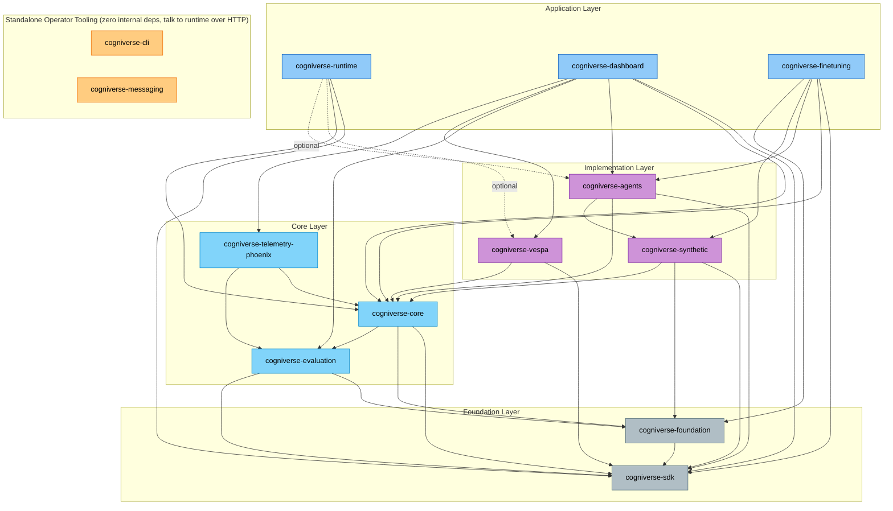

# Cogniverse Learning Path

**Purpose**: Systematic bottom-up learning path for the layered codebase.

**Time Estimate**: 20 days (2-3 hours/day)

**Approach**: Study from foundation layer upward, understanding zero-dependency packages first.

**Prerequisites**: [QUICKSTART.md](../QUICKSTART.md) | [GLOSSARY.md](../GLOSSARY.md)

---

## Dependency Graph

13 packages in the UV workspace. Arrows point from a package to what it depends on.

`cogniverse-cli` (`libs/cli/`, see [modules/cli.md](../modules/cli.md)) and `cogniverse-messaging` (`libs/messaging/`, see [modules/messaging.md](../modules/messaging.md)) have no internal cogniverse dependencies — they're operator-facing HTTP clients of the runtime (CLI for local dev/ops, a Telegram bot gateway) and aren't part of the bottom-up layering below, but are worth a skim after Step 8.

---

## Learning Path (8 Steps)

### Step 1: SDK (Days 1-2)

**Package**: `cogniverse-sdk` — Zero dependencies, core abstractions

**Documentation**: [modules/sdk.md](../modules/sdk.md)

**Key Files**:

- `libs/sdk/cogniverse_sdk/document.py` — Universal Document model
- `libs/sdk/cogniverse_sdk/interfaces/` — abstract interfaces: `Backend`/`SearchBackend`/`IngestionBackend`, `ConfigStore`, `AdapterStore`, `WorkflowStore`, `SchemaLoader`

---

### Step 2: Foundation (Days 3-4)

**Package**: `cogniverse-foundation` — Config + telemetry infrastructure

**Documentation**: [modules/foundation.md](../modules/foundation.md)

**Key Files**:

- `libs/foundation/cogniverse_foundation/config/manager.py` — ConfigManager
- `libs/foundation/cogniverse_foundation/telemetry/manager.py` — TelemetryManager

---

### Step 3: Core (Days 5-7)

**Package**: `cogniverse-core` — Agent base classes, registries, memory, events

**Documentation**: [modules/core.md](../modules/core.md) | [modules/events.md](../modules/events.md)

**Key Files**:

- `libs/core/cogniverse_core/agents/base.py` — AgentBase generic class
- `libs/core/cogniverse_core/agents/a2a_agent.py` — A2AAgent with A2A protocol
- `libs/core/cogniverse_core/registries/` — Agent/Backend registries
- `libs/core/cogniverse_core/events/` — A2A EventQueue for real-time notifications

---

### Step 4: Evaluation & Telemetry (Days 8-9)

**Packages**: `cogniverse-evaluation`, `cogniverse-telemetry-phoenix`

**Documentation**: [modules/evaluation.md](../modules/evaluation.md) | [modules/telemetry.md](../modules/telemetry.md)

**Key Files**:

- `libs/evaluation/cogniverse_evaluation/core/experiment_tracker.py` — Experiment tracking
- `libs/evaluation/cogniverse_evaluation/metrics/` — retrieval metrics (MRR, NDCG, precision/recall/F1@K, MAP)
- `libs/telemetry-phoenix/cogniverse_telemetry_phoenix/provider.py` — Phoenix provider

---

### Step 5: Agents (Days 10-12)

**Package**: `cogniverse-agents` — Agent implementations with DSPy

**Documentation**: [modules/agents.md](../modules/agents.md) | [tutorials/creating-agents.md](../tutorials/creating-agents.md)

**Key Files** (start here — the triage/orchestration entry points):

- `libs/agents/cogniverse_agents/gateway_agent.py` — GatewayAgent (GLiNER-based triage, LLM-free)
- `libs/agents/cogniverse_agents/search_agent.py` — SearchAgent
- `libs/agents/cogniverse_agents/orchestrator_agent.py` — OrchestratorAgent (A2A entry point with DSPy planning)

**Full roster (23 agents, all in `libs/agents/cogniverse_agents/`)**. The 9 knowledge/federation agents are covered separately in [Knowledge Subsystem → Knowledge Agents](#5-knowledge-agents-9); the remaining 14 group as follows:

*Generation + Routing*:
- `gateway_agent.py` — LLM-free entry triage (GLiNER + deterministic rules), hands off to the orchestrator or a direct execution agent
- `orchestrator_agent.py` — DSPy planning + A2A fan-out to sub-agents, checkpoint/resume, cross-modal fusion
- `summarizer_agent.py` — structured summaries with a thinking phase and VLM visual analysis
- `detailed_report_agent.py` — comprehensive multi-section reports with optional RLM synthesis
- `profile_selection_agent.py` — DSPy-driven backend search profile selection with a heuristic fallback
- `query_enhancement_agent.py` — query expansion/rewriting and RRF query-variant generation
- `entity_extraction_agent.py` — tiered NER (fast GLiNER+SpaCy path, DSPy ChainOfThought fallback)

*Search & Analysis*:
- `search_agent.py` — multi-modal Vespa retrieval with query rewriting and RRF ensemble fusion
- `image_search_agent.py` — ColPali multi-vector image similarity search (semantic/hybrid)
- `document_agent.py` — ColPali visual + ColBERT/BM25 text document search with auto strategy selection
- `text_analysis_agent.py` — runtime-configurable DSPy sentiment/summary/entity analysis
- `audio_analysis_agent.py` — Whisper transcription + Vespa transcript/acoustic/hybrid search

*Research + Coding*:
- `deep_research_agent.py` — decompose → parallel search → evaluate → synthesize research loop
- `coding_agent.py` — search → plan → generate → execute (OpenShell sandbox) → evaluate loop

See [modules/agents.md](../modules/agents.md) for the complete roster with capabilities and ports.

---

### Step 6: Vespa & Synthetic (Days 13-14)

**Packages**: `cogniverse-vespa`, `cogniverse-synthetic`

**Documentation**: [modules/backends.md](../modules/backends.md) | [modules/synthetic.md](../modules/synthetic.md)

**Key Files**:

- `libs/vespa/cogniverse_vespa/search_backend.py` — VespaSearchBackend (tenant-scoped search, tenant_id required per query)
- `libs/vespa/cogniverse_vespa/vespa_schema_manager.py` — VespaSchemaManager (schema-per-tenant)
- `libs/synthetic/cogniverse_synthetic/service.py` — Synthetic data generation

---

### Step 7: Fine-Tuning (Days 15-16)

**Package**: `cogniverse-finetuning` — Phoenix-to-adapter pipeline

**Documentation**: [modules/finetuning.md](../modules/finetuning.md)

**Key Files**:

- `libs/finetuning/cogniverse_finetuning/orchestrator.py` — End-to-end pipeline
- `libs/finetuning/cogniverse_finetuning/training/sft_trainer.py` — SFT trainer
- `libs/finetuning/cogniverse_finetuning/training/dpo_trainer.py` — DPO trainer

---

### Step 8: Runtime & Dashboard (Days 17-20)

**Packages**: `cogniverse-runtime`, `cogniverse-dashboard`

**Documentation**: [modules/runtime.md](../modules/runtime.md) | [modules/dashboard.md](../modules/dashboard.md)

**Key Files**:

- `libs/runtime/cogniverse_runtime/main.py` — FastAPI server
- `libs/runtime/cogniverse_runtime/ingestion/pipeline.py` — Video ingestion
- `libs/dashboard/cogniverse_dashboard/app.py` — Streamlit dashboard

---

## Knowledge Subsystem

Cross-cutting track for the memory/provenance/trust stack and the agents that consume it. Read after Step 5.

### 1. Memory Layer Foundations

**Reading order**: `schema.py` → `manager.py::cleanup_with_schema`

**Key Files**:

- `libs/core/cogniverse_core/memory/schema.py` — KnowledgeRegistry, KnowledgeSchema, Retention enum, Sensitivity, Pinnable, `build_default_registry`
- `libs/core/cogniverse_core/memory/manager.py` — `cleanup_with_schema` (retention-driven sweep)

**Diagram**: [diagrams/multi-tenant-diagrams.md](../diagrams/multi-tenant-diagrams.md) — knowledge sections

---

### 2. Provenance

**Key Files**:

- `libs/core/cogniverse_core/memory/provenance.py` — CitationRef (memory vs external), DerivationKind, ProvenanceWalker
- `libs/core/cogniverse_core/memory/provenance_store.py` — per-tenant `provenance_<tenant>` Vespa schema isolation

---

### 3. Trust + Contradiction

**Key Files**:

- `libs/core/cogniverse_core/memory/trust.py` — derivation-weighted initial trust, endorsement bumps (user / org_admin), `rank_with_trust` composite score
- `libs/core/cogniverse_core/memory/contradiction.py` — ContradictionDetector, ConflictSet, reconciliation policies: LATEST_WINS, TRUST_RANKED, PRESERVE_BOTH

**Diagram**: [diagrams/knowledge-system-diagrams.md](../diagrams/knowledge-system-diagrams.md) — Diagram 1

---

### 4. Federation + Pinning

**Key Files**:

- `libs/core/cogniverse_core/memory/federation.py` — org_trunk promotion (sensitivity-gated), `federated_get_all` cross-tenant read
- `libs/core/cogniverse_core/memory/pinning.py` — PinService, PinQuotas (per-role floor)
- `libs/core/cogniverse_core/memory/lifecycle_scheduler.py` — periodic `cleanup_with_schema` driver

---

### 5. Knowledge Agents (9)

**Dispatcher**: `libs/runtime/cogniverse_runtime/routers/knowledge.py`

**Agents** (`libs/agents/cogniverse_agents/`):

- `multi_document_synthesis_agent.py`
- `kg_traversal_agent.py`
- `cross_tenant_comparison_agent.py`
- `contradiction_reconciliation_agent.py`
- `citation_tracing_agent.py`
- `temporal_reasoning_agent.py`
- `federated_query_agent.py`
- `knowledge_summarization_agent.py`
- `audit_explanation_agent.py`

**Diagram**: [diagrams/knowledge-system-diagrams.md](../diagrams/knowledge-system-diagrams.md) — Diagram 2

---

### 6. DeepSynthesisWorkflow

**Key File**: `libs/agents/cogniverse_agents/deep_synthesis_workflow.py`

**Concepts**: orchestrator-inside-RLM composition, rate limit + hard call cap + per-round bounded fan-out + max iterations

**Diagram**: [diagrams/knowledge-system-diagrams.md](../diagrams/knowledge-system-diagrams.md) — Diagram 3

---

### 7. Sandbox + OpenShell

**Key Files**:

- `libs/runtime/cogniverse_runtime/sandbox_manager.py` — SandboxPolicy enum (required / optional / disabled), SandboxGatewayUnavailableError
- `libs/runtime/cogniverse_runtime/openshell_health.py` — GatewayHealthProbe

**Telemetry spans**: `sandbox.exec`, `openshell.gateway_health`

**Diagram**: [diagrams/knowledge-system-diagrams.md](../diagrams/knowledge-system-diagrams.md) — Diagram 4

---

### 8. Optimizer Canary + Variants

**Key Files**:

- `libs/agents/cogniverse_agents/optimizer/signature_variants.py` — `SignatureVariantRegistry.register`, `selected_for_tenant` fallback
- `libs/agents/cogniverse_agents/optimizer/artifact_manager.py` — canary FSM: `promote_to_canary`, `promote_canary_to_active`, `retire_canary`, `rollback_to_version`
- `libs/runtime/cogniverse_runtime/optimization_cli.py` — `--mode rollback` CLI

**Diagram**: [diagrams/knowledge-system-diagrams.md](../diagrams/knowledge-system-diagrams.md) — Diagram 5

---

### 9. Maintenance Workflows

**Chart crons**:

- `cogniverse-daily-cleanup` — 4 sections: memory, log rotation, temp purge, config_metadata vacuum
- `cogniverse-monthly-reports` — usage + perf JSON to MinIO

**CLI source**: `libs/runtime/cogniverse_runtime/optimization_cli.py` — `run_cleanup`, `run_monthly_reports`

**Diagram**: [diagrams/knowledge-system-diagrams.md](../diagrams/knowledge-system-diagrams.md) — Diagram 6

---

## Practical Exercises

### Exercise 1: Trace a Document Through the System
1. Start: `scripts/run_ingestion.py`
2. Follow: Document creation → Backend storage → Agent retrieval
3. Layers: runtime → vespa → agents → sdk

### Exercise 2: Trace an Agent Query (A2A Pipeline)
1. Start: User query to OrchestratorAgent `/tasks/send`
2. Follow: DSPy planning → A2A dispatch (QueryEnhancement → ProfileSelection → Search) → Result aggregation
3. Layers: dashboard → orchestrator → agents (via A2A HTTP) → SearchService → vespa
4. Key: `tenant_id` and `session_id` flow per-request through every A2A call

### Exercise 3: Understand Config Overlay
1. Start: `ConfigManager.get_backend_config(tenant_id)` — `service` defaults to `"backend"` (same default used by the runtime admin API and the dashboard)
2. Follow: system base (`backend` section of `configs/config.json`) → tenant overrides fetched via `ConfigManager.get_backend_config` → deep-merged per-profile in `ConfigUtils._ensure_backend_config` → profile lookup via `ConfigManager.get_backend_profile`
3. Files: `foundation/config/manager.py` → `foundation/config/utils.py` (`ConfigUtils._ensure_backend_config`) → `foundation/config/unified_config.py` (`BackendConfig`, `BackendProfileConfig`)

### Exercise 4: Understand Checkpoint Recovery
1. Start: `OrchestratorAgent._process_impl(...)` with checkpoint support
2. Follow: Load checkpoint → Skip completed → Resume from phase
3. Files: agents/orchestrator_agent.py → agents/orchestrator/checkpoint_storage.py

### Exercise 4b: Trace Real-Time Event Flow
1. Start: Create EventQueue for workflow
2. Follow: Checkpoint save → Event emission → SSE subscription
3. Files: core/events/ → agents/orchestrator/checkpoint_storage.py → runtime/routers/events.py

### Exercise 5: Trace Fine-Tuning Pipeline
1. Start: Phoenix annotations
2. Follow: Dataset export → Method selection → Training → Evaluation
3. Layers: finetuning (orchestrator) → training → evaluation

### Exercise 6: Understand Ensemble Composition
1. Start: Multi-profile query via SearchService
2. Follow: Profile-agnostic SearchService → QueryEncoderFactory (cached per model) → Parallel Vespa queries → Result fusion (RRF) → Final ranking
3. Files: agents/search/service.py → core/query/encoders.py → vespa/

---

## Next Steps

After completing the learning path:

- [Code Style Guide](../development/code-style.md) — For contributions

- [Testing Guide](../testing/TESTING_GUIDE.md) — Testing practices

- [Troubleshooting](../TROUBLESHOOTING.md) — Common issues
