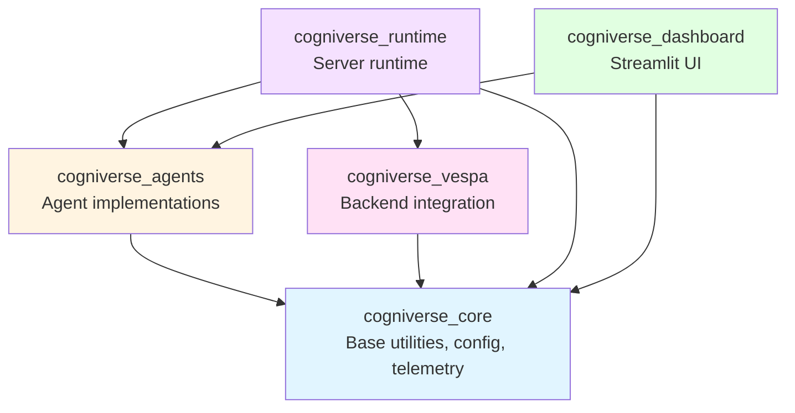

# Cogniverse Study Guide: Package Development

**Last Updated:** 2025-10-15
**Architecture:** UV Workspace with 5 SDK packages
**Purpose:** Package development workflows, dependency management, and best practices

---

## Table of Contents
1. [Package Architecture](#package-architecture)
2. [Development Workflows](#development-workflows)
3. [Dependency Management](#dependency-management)
4. [Building Packages](#building-packages)
5. [Testing Strategies](#testing-strategies)
6. [Versioning and Releases](#versioning-and-releases)
7. [Best Practices](#best-practices)

---

## Package Architecture

### UV Workspace Structure

```
cogniverse/
├── pyproject.toml         # Workspace root configuration
├── uv.lock                # Unified dependency lockfile
├── .venv/                 # Shared virtual environment
├── libs/
│   ├── core/              # cogniverse_core
│   │   ├── pyproject.toml
│   │   ├── README.md
│   │   └── cogniverse_core/
│   │       ├── __init__.py
│   │       ├── config/
│   │       ├── telemetry/
│   │       ├── evaluation/
│   │       └── common/
│   ├── agents/            # cogniverse_agents
│   │   ├── pyproject.toml
│   │   ├── README.md
│   │   └── cogniverse_agents/
│   │       ├── __init__.py
│   │       ├── agents/
│   │       ├── routing/
│   │       ├── ingestion/
│   │       ├── search/
│   │       └── tools/
│   ├── vespa/             # cogniverse_vespa
│   │   ├── pyproject.toml
│   │   ├── README.md
│   │   └── cogniverse_vespa/
│   │       └── backends/
│   ├── runtime/           # cogniverse_runtime
│   │   ├── pyproject.toml
│   │   ├── README.md
│   │   └── cogniverse_runtime/
│   │       └── server/
│   └── dashboard/         # cogniverse_dashboard
│       ├── pyproject.toml
│       ├── README.md
│       └── cogniverse_dashboard/
│           └── ui/
├── tests/                 # Workspace-level tests
│   ├── agents/
│   ├── evaluation/
│   ├── ingestion/
│   ├── memory/
│   └── routing/
└── scripts/               # Operational scripts
```

### Package Dependency Graph



**Dependency Rules:**
- `cogniverse_core`: No dependencies on other packages (foundational)
- `cogniverse_agents`: Depends on `cogniverse_core`
- `cogniverse_vespa`: Depends on `cogniverse_core`
- `cogniverse_runtime`: Depends on `core`, `agents`, `vespa`
- `cogniverse_dashboard`: Depends on `core`, `agents`

---

## Development Workflows

### Initial Setup

**1. Clone and Install Workspace:**
```bash
# Clone repository
git clone <repository-url>
cd cogniverse

# Install uv if not already installed
pip install uv

# Sync entire workspace (all packages in editable mode)
uv sync

# Verify installation
uv pip list | grep cogniverse
# Expected:
# cogniverse-core         0.1.0
# cogniverse-agents       0.1.0
# cogniverse-vespa        0.1.0
# cogniverse-runtime      0.1.0
# cogniverse-dashboard    0.1.0
```

**2. Activate Virtual Environment:**
```bash
# Activate workspace virtual environment
source .venv/bin/activate  # Linux/macOS
# or
.venv\Scripts\activate     # Windows

# Verify Python path
which python
# Should point to: /path/to/cogniverse/.venv/bin/python
```

### Working on Individual Packages

**Scenario 1: Developing Core Package**
```bash
# Navigate to core package
cd libs/core

# Add a new dependency
uv add pydantic

# Update existing dependency
uv add --upgrade pydantic

# Remove dependency
uv remove pydantic

# Sync workspace after changes
cd ../..
uv sync
```

**Scenario 2: Developing Agents Package**
```bash
# Navigate to agents package
cd libs/agents

# Add dependency (will automatically install if needed)
uv add litellm

# Since agents depends on core, changes to core are immediately available
# Edit code in cogniverse_agents/agents/routing_agent.py
from cogniverse_core.config import SystemConfig  # Uses editable core

# Run tests for this package only
uv run pytest ../../tests/agents/ -v
```

**Scenario 3: Cross-Package Development**
```bash
# Scenario: Adding a new feature that spans multiple packages

# 1. Start with core package (foundational change)
cd libs/core
# Edit cogniverse_core/config/unified_config.py
# Add new configuration field for tenant memory settings

# 2. Update agents package to use new config
cd ../agents
# Edit cogniverse_agents/agents/base_agent.py
from cogniverse_core.config import SystemConfig
# Use new tenant memory config

# 3. Update runtime to expose new feature
cd ../runtime
# Edit cogniverse_runtime/server/api.py
# Add endpoint for tenant memory configuration

# 4. Sync workspace to ensure all changes are available
cd ../../..
uv sync

# 5. Run comprehensive tests
JAX_PLATFORM_NAME=cpu timeout 7200 uv run pytest tests/ -v
```

### Running Scripts and Applications

**Using uv run for Scripts:**
```bash
# Run ingestion script
JAX_PLATFORM_NAME=cpu uv run python scripts/run_ingestion.py \
  --video_dir data/testset/evaluation/sample_videos \
  --backend vespa \
  --tenant-id acme_corp

# Run dashboard
uv run streamlit run scripts/phoenix_dashboard_standalone.py --server.port 8501

# Run experiments
uv run python scripts/run_experiments_with_visualization.py \
  --dataset-name golden_eval_v1 \
  --profiles frame_based_colpali
```

**Direct Python Imports (in Scripts):**
```python
# scripts/custom_script.py
from cogniverse_core.config import SystemConfig
from cogniverse_agents.routing.strategies import GLiNERRoutingStrategy
from cogniverse_vespa.backends import VespaBackend

# All packages available in editable mode
config = SystemConfig(tenant_id="acme_corp")
strategy = GLiNERRoutingStrategy(config)
backend = VespaBackend(config)
```

---

## Dependency Management

### Adding Dependencies

**Package-Level Dependencies:**
```bash
# Navigate to specific package
cd libs/core

# Add runtime dependency
uv add httpx

# Add with version constraint
uv add "pydantic>=2.0,<3.0"

# Add optional dependency group
uv add --optional telemetry arize-phoenix-otel

# Add development dependency
uv add --dev pytest-asyncio
```

**Workspace Root Dependencies:**
```bash
# Add dependency used across multiple packages
cd /path/to/cogniverse
uv add ruff  # Code formatter/linter

# Add test dependency for workspace
uv add --dev pytest pytest-cov
```

### Managing Inter-Package Dependencies

**Example: Adding New Core Feature Used by Agents**

**Step 1: Update core package:**
```toml
# libs/core/pyproject.toml
[project]
name = "cogniverse-core"
version = "0.2.0"  # Increment version
dependencies = [
    "pydantic>=2.0",
    "httpx>=0.25.0",
    "mem0ai>=0.1.0",  # New dependency
]
```

**Step 2: Update agents to use new core version:**
```toml
# libs/agents/pyproject.toml
[project]
name = "cogniverse-agents"
version = "0.2.0"
dependencies = [
    "cogniverse-core>=0.2.0",  # Update minimum version
    "litellm>=1.0.0",
]
```

**Step 3: Sync workspace:**
```bash
cd /path/to/cogniverse
uv sync
```

### Dependency Resolution

**Understanding uv.lock:**
```bash
# View lockfile (contains exact versions for all packages)
cat uv.lock

# Regenerate lockfile (after pyproject.toml changes)
uv lock

# Upgrade all dependencies to latest compatible versions
uv lock --upgrade

# Upgrade specific package
uv add --upgrade pydantic
```

**Resolving Conflicts:**
```bash
# Scenario: Two packages require different versions of same dependency

# libs/core/pyproject.toml requires: httpx>=0.25.0,<0.26.0
# libs/agents/pyproject.toml requires: httpx>=0.24.0

# uv will resolve to: httpx==0.25.x (satisfies both)

# If incompatible, uv will report error:
# ERROR: Cannot resolve dependencies:
#   cogniverse-core requires httpx>=0.25.0,<0.26.0
#   cogniverse-agents requires httpx>=0.27.0

# Solution: Align version constraints in pyproject.toml files
```

---

## Building Packages

### Building Distribution Packages

**Build All Packages:**
```bash
# Build all SDK packages for distribution
for dir in libs/*/; do
  echo "Building $(basename $dir)..."
  (cd "$dir" && uv build)
done

# Output (in each libs/*/dist/):
# cogniverse_core-0.1.0-py3-none-any.whl
# cogniverse_core-0.1.0.tar.gz
# cogniverse_agents-0.1.0-py3-none-any.whl
# cogniverse_agents-0.1.0.tar.gz
# ...
```

**Build Individual Package:**
```bash
# Build core package only
cd libs/core
uv build

# Verify build artifacts
ls -lh dist/
# cogniverse_core-0.1.0-py3-none-any.whl
# cogniverse_core-0.1.0.tar.gz

# Inspect wheel contents
unzip -l dist/cogniverse_core-0.1.0-py3-none-any.whl
```

### Installing from Built Wheels

**Local Installation:**
```bash
# Create test environment
python -m venv test_env
source test_env/bin/activate

# Install core package from wheel
pip install libs/core/dist/cogniverse_core-0.1.0-py3-none-any.whl

# Install agents (will automatically install core dependency)
pip install libs/agents/dist/cogniverse_agents-0.1.0-py3-none-any.whl

# Verify imports
python -c "from cogniverse_core.config import SystemConfig; print('Success!')"
```

**Installation Order Matters:**
```bash
# CORRECT: Install in dependency order
pip install dist/cogniverse_core-0.1.0-py3-none-any.whl
pip install dist/cogniverse_vespa-0.1.0-py3-none-any.whl
pip install dist/cogniverse_agents-0.1.0-py3-none-any.whl
pip install dist/cogniverse_runtime-0.1.0-py3-none-any.whl

# INCORRECT: May fail due to missing dependencies
pip install dist/cogniverse_runtime-0.1.0-py3-none-any.whl  # Needs core, agents, vespa
```

### Build Verification

**Verify Package Metadata:**
```bash
# Check package metadata
cd libs/core
uv build
pip show cogniverse-core

# Output:
# Name: cogniverse-core
# Version: 0.1.0
# Summary: Core utilities for Cogniverse multi-agent system
# Home-page: https://github.com/yourorg/cogniverse
# Author: Your Name
# License: MIT
# Requires: pydantic, httpx, arize-phoenix-otel
# Required-by: cogniverse-agents, cogniverse-vespa
```

**Test Installed Package:**
```python
# test_package_install.py
import cogniverse_core
from cogniverse_core.config import SystemConfig
from cogniverse_core.telemetry import TelemetryManager

# Verify version
assert cogniverse_core.__version__ == "0.1.0"

# Test basic functionality
config = SystemConfig(tenant_id="test")
assert config.tenant_id == "test"

print("✅ Package installation verified")
```

---

## Testing Strategies

### Package-Specific Testing

**Test Core Package:**
```bash
# Run all core package tests
uv run pytest tests/common/ tests/evaluation/ tests/telemetry/ -v

# Run with coverage
uv run pytest tests/common/ --cov=cogniverse_core --cov-report=html

# View coverage report
open htmlcov/index.html
```

**Test Agents Package:**
```bash
# Run agents tests
JAX_PLATFORM_NAME=cpu timeout 1800 uv run pytest tests/agents/ -v --tb=line

# Run specific test file
uv run pytest tests/agents/test_routing_agent.py -v

# Run with markers
uv run pytest tests/agents/ -m "not slow" -v
```

**Test Integration:**
```bash
# Run integration tests (multiple packages)
JAX_PLATFORM_NAME=cpu timeout 7200 uv run pytest \
  tests/memory/ \
  tests/ingestion/ \
  tests/evaluation/ \
  tests/routing/ \
  -v --tb=line
```

### Test Organization

**Per-Package Test Structure:**
```
tests/
├── agents/              # cogniverse_agents tests
│   ├── unit/
│   │   ├── test_routing_agent.py
│   │   └── test_video_search_agent.py
│   └── integration/
│       └── test_agent_pipeline.py
├── common/              # cogniverse_core.common tests
│   ├── test_cache.py
│   └── test_utils.py
├── evaluation/          # cogniverse_core.evaluation tests
│   ├── test_experiment_tracker.py
│   └── test_evaluators.py
├── ingestion/           # cogniverse_agents.ingestion tests
│   ├── unit/
│   │   └── test_pipeline.py
│   └── integration/
│       └── test_backend_ingestion.py
├── memory/              # cogniverse_core.common.memory tests
│   ├── unit/
│   │   └── test_mem0_memory_manager.py
│   └── integration/
│       └── test_mem0_vespa_integration.py
└── routing/             # cogniverse_agents.routing tests
    ├── unit/
    │   ├── test_phoenix_span_evaluator.py
    │   └── test_modality_evaluator.py
    └── integration/
        └── test_routing_evaluation.py
```

### Testing Best Practices

**1. Use Fixtures for Package Dependencies:**
```python
# tests/conftest.py
import pytest
from cogniverse_core.config import SystemConfig
from cogniverse_vespa.backends import VespaBackend

@pytest.fixture
def system_config():
    """Shared config for tests"""
    return SystemConfig(
        tenant_id="test_tenant",
        vespa_url="http://localhost:8080",
        vespa_config_port=19071,
        phoenix_enabled=False  # Disable for unit tests
    )

@pytest.fixture
def vespa_backend(system_config):
    """Vespa backend for integration tests"""
    return VespaBackend(system_config)
```

**2. Isolate Package Tests:**
```python
# tests/agents/unit/test_routing_agent.py
from cogniverse_agents.routing_agent import RoutingAgent
from cogniverse_core.config import SystemConfig

def test_routing_agent_initialization():
    """Test agent initialization (no external dependencies)"""
    config = SystemConfig(tenant_id="test")
    agent = RoutingAgent(config)

    assert agent.tenant_id == "test"
    assert agent.config is config

def test_routing_agent_strategy_selection(mocker):
    """Test strategy selection with mocked LLM"""
    # Mock external dependencies
    mocker.patch("cogniverse_agents.routing.strategies.GLiNERRoutingStrategy.route")

    config = SystemConfig(tenant_id="test")
    agent = RoutingAgent(config)

    result = agent.route_query("test query")
    assert result.modality in ["text", "video", "audio"]
```

**3. Integration Tests Across Packages:**
```python
# tests/ingestion/integration/test_backend_ingestion.py
import pytest
from cogniverse_agents.ingestion.pipeline import VideoIngestionPipeline
from cogniverse_vespa.backends import VespaBackend
from cogniverse_core.config import SystemConfig

@pytest.mark.integration
async def test_video_ingestion_to_vespa(vespa_backend, sample_video):
    """Test complete ingestion pipeline with real Vespa"""
    config = SystemConfig(
        tenant_id="test",
        vespa_url="http://localhost:8080"
    )

    pipeline = VideoIngestionPipeline(
        profile="video_colpali_smol500_mv_frame",
        tenant_id="test",
        backend="vespa"
    )

    result = await pipeline.process_video(sample_video)

    assert result["status"] == "success"
    assert result["documents_created"] > 0

    # Verify in Vespa
    docs = vespa_backend.search(
        query="test",
        schema_name="video_colpali_smol500_mv_frame_test"
    )
    assert len(docs) > 0
```

---

## Versioning and Releases

### Semantic Versioning

**Version Format: MAJOR.MINOR.PATCH**

```
0.1.0 → Initial release
0.1.1 → Patch release (bug fixes)
0.2.0 → Minor release (new features, backward compatible)
1.0.0 → Major release (breaking changes)
```

**Version Bump Strategy:**

**PATCH (0.1.0 → 0.1.1):**
- Bug fixes
- Documentation updates
- Performance improvements (no API changes)

**MINOR (0.1.0 → 0.2.0):**
- New features (backward compatible)
- New optional parameters
- Deprecation warnings
- Internal refactoring

**MAJOR (0.2.0 → 1.0.0):**
- Breaking API changes
- Removed deprecated features
- Changed function signatures
- Renamed modules/classes

### Release Process

**Step 1: Update Version Numbers**
```bash
# Update core package version
# libs/core/pyproject.toml
[project]
name = "cogniverse-core"
version = "0.2.0"  # Increment version

# Update agents package (depends on core)
# libs/agents/pyproject.toml
[project]
name = "cogniverse-agents"
version = "0.2.0"
dependencies = [
    "cogniverse-core>=0.2.0",  # Update dependency
]
```

**Step 2: Update Changelog**
```markdown
# CHANGELOG.md

## [0.2.0] - 2025-10-15

### Added
- Multi-tenant memory isolation with Mem0
- Per-tenant Phoenix project support
- Tenant-aware schema deployment

### Changed
- Updated SystemConfig to include tenant_id field
- Refactored TelemetryManager for multi-tenant support

### Fixed
- Fixed memory leak in embedding cache
- Resolved race condition in concurrent video processing

### Breaking Changes
- `SystemConfig` now requires `tenant_id` parameter
- Removed deprecated `use_default_config()` method
```

**Step 3: Build Packages**
```bash
# Build all packages
for dir in libs/*/; do
  echo "Building $(basename $dir) v0.2.0..."
  (cd "$dir" && uv build)
done
```

**Step 4: Test Built Packages**
```bash
# Create clean test environment
python -m venv release_test_env
source release_test_env/bin/activate

# Install in dependency order
pip install libs/core/dist/cogniverse_core-0.2.0-py3-none-any.whl
pip install libs/vespa/dist/cogniverse_vespa-0.2.0-py3-none-any.whl
pip install libs/agents/dist/cogniverse_agents-0.2.0-py3-none-any.whl

# Run smoke tests
python -c "
from cogniverse_core.config import SystemConfig
from cogniverse_agents.routing_agent import RoutingAgent

config = SystemConfig(tenant_id='test')
agent = RoutingAgent(config)
print('✅ Release smoke test passed')
"
```

**Step 5: Tag Release**
```bash
# Create git tag
git tag -a v0.2.0 -m "Release version 0.2.0"
git push origin v0.2.0
```

**Step 6: Publish to PyPI (Optional)**
```bash
# Publish core package
cd libs/core
uv publish

# Publish other packages (in dependency order)
cd ../vespa && uv publish
cd ../agents && uv publish
cd ../runtime && uv publish
cd ../dashboard && uv publish
```

### Version Compatibility Matrix

| Package          | Version | Requires Core | Requires Agents | Requires Vespa |
|-----------------|---------|---------------|-----------------|----------------|
| cogniverse-core | 0.2.0   | -             | -               | -              |
| cogniverse-vespa | 0.2.0   | >=0.2.0       | -               | -              |
| cogniverse-agents | 0.2.0   | >=0.2.0       | -               | -              |
| cogniverse-runtime | 0.2.0   | >=0.2.0       | >=0.2.0         | >=0.2.0        |
| cogniverse-dashboard | 0.2.0   | >=0.2.0       | >=0.2.0         | -              |

---

## Best Practices

### 1. Package Organization

**Keep Packages Focused:**
```python
# ✅ GOOD: Clear package boundaries
# cogniverse_core - foundational utilities only
from cogniverse_core.config import SystemConfig
from cogniverse_core.telemetry import TelemetryManager

# cogniverse_agents - agent implementations only
from cogniverse_agents.routing_agent import RoutingAgent
from cogniverse_agents.agents.video_search_agent import VideoSearchAgent

# ❌ BAD: Mixing concerns
# Don't put agent implementations in cogniverse_core
# Don't put core utilities in cogniverse_agents
```

**Avoid Circular Dependencies:**
```python
# ❌ BAD: Circular dependency
# libs/core/cogniverse_core/config.py
from cogniverse_agents.agents import BaseAgent  # ❌ core depends on agents

# ✅ GOOD: One-way dependency
# libs/agents/cogniverse_agents/agents/base_agent.py
from cogniverse_core.config import SystemConfig  # ✅ agents depends on core
```

### 2. Import Conventions

**Use Absolute Imports:**
```python
# ✅ GOOD: Absolute imports from package root
from cogniverse_core.config.unified_config import SystemConfig
from cogniverse_core.telemetry.manager import TelemetryManager
from cogniverse_agents.routing_agent import RoutingAgent

# ❌ BAD: Relative imports across packages
from ...core.config import SystemConfig  # ❌ Hard to read
from ..agents.routing_agent import RoutingAgent  # ❌ Fragile
```

**Package-Level Exports:**
```python
# libs/core/cogniverse_core/__init__.py
from cogniverse_core.config.unified_config import SystemConfig
from cogniverse_core.telemetry.manager import TelemetryManager
from cogniverse_core.evaluation.core.experiment_tracker import ExperimentTracker

__all__ = ["SystemConfig", "TelemetryManager", "ExperimentTracker"]
__version__ = "0.2.0"

# Usage (simplified imports):
from cogniverse_core import SystemConfig, TelemetryManager
```

### 3. Dependency Hygiene

**Minimal Dependencies:**
```toml
# ✅ GOOD: Only essential dependencies
[project]
dependencies = [
    "pydantic>=2.0",
    "httpx>=0.25.0",
]

# ❌ BAD: Unnecessary dependencies
[project]
dependencies = [
    "pydantic>=2.0",
    "httpx>=0.25.0",
    "numpy>=1.24.0",      # ❌ Not used in core
    "pandas>=2.0.0",      # ❌ Only used in one file
]
```

**Optional Dependencies:**
```toml
# Use optional dependency groups for specialized features
[project.optional-dependencies]
telemetry = [
    "arize-phoenix-otel>=4.0.0",
    "opentelemetry-sdk>=1.20.0",
]
memory = [
    "mem0ai>=0.1.0",
]
all = [
    "arize-phoenix-otel>=4.0.0",
    "opentelemetry-sdk>=1.20.0",
    "mem0ai>=0.1.0",
]

# Install with: uv add --optional telemetry arize-phoenix-otel
```

### 4. Testing Discipline

**Test Coverage Requirements:**
```bash
# Maintain >80% coverage for all packages
uv run pytest tests/agents/ --cov=cogniverse_agents --cov-fail-under=80

# ✅ Coverage report:
# cogniverse_agents/agents/base_agent.py          95%
# cogniverse_agents/agents/routing_agent.py       87%
# cogniverse_agents/routing/strategies.py         82%
# TOTAL                                            88%
```

**Test Before Commit:**
```bash
# Pre-commit checklist
uv run ruff check .                 # Linting
uv run ruff format .                # Formatting
uv run pytest tests/ -v             # All tests
uv build                            # Build verification
```

### 5. Documentation Standards

**Package README.md:**
```markdown
# cogniverse-agents

Agent implementations for Cogniverse multi-agent RAG system.

## Installation

```bash
pip install cogniverse-agents
```

## Quick Start

```python
from cogniverse_agents.agents import RoutingAgent
from cogniverse_core.config import SystemConfig

config = SystemConfig(tenant_id="acme_corp")
agent = RoutingAgent(config)
result = agent.route_query("Show me machine learning videos")
```

## Features

- Intelligent query routing with GLiNER and LLM strategies
- Video search with ColPali and VideoPrism
- Multi-tenant support with schema isolation
- Phoenix telemetry integration

## Documentation

See [docs/modules/agents.md](../../docs/modules/agents.md)
```

**Docstring Standards:**
```python
def process_video(
    self,
    video_path: Path,
    tenant_id: str,
    profile: str = "video_colpali_smol500_mv_frame"
) -> dict:
    """
    Process video and upload to tenant-specific Vespa schema.

    Args:
        video_path: Path to video file
        tenant_id: Tenant identifier for schema isolation
        profile: Processing profile name (default: frame-based ColPali)

    Returns:
        Dict with keys:
            - status: "success" or "failed"
            - documents_created: Number of documents uploaded
            - processing_time: Time in seconds
            - schema_name: Tenant-specific schema name

    Raises:
        VideoProcessingError: If video processing fails
        VespaUploadError: If upload to Vespa fails

    Examples:
        >>> pipeline = VideoIngestionPipeline(tenant_id="acme_corp")
        >>> result = pipeline.process_video(Path("video.mp4"))
        >>> print(result["status"])
        'success'
    """
```

### 6. CI/CD Integration

**GitHub Actions Workflow:**
```yaml
# .github/workflows/test-packages.yml
name: Test Packages

on: [push, pull_request]

jobs:
  test:
    runs-on: ubuntu-latest
    steps:
      - uses: actions/checkout@v3

      - name: Set up Python
        uses: actions/setup-python@v4
        with:
          python-version: '3.12'

      - name: Install uv
        run: pip install uv

      - name: Sync workspace
        run: uv sync

      - name: Run linter
        run: uv run ruff check .

      - name: Run formatter
        run: uv run ruff format --check .

      - name: Run tests
        run: |
          JAX_PLATFORM_NAME=cpu timeout 7200 uv run pytest \
            tests/ -v --tb=line --cov=libs --cov-report=xml

      - name: Upload coverage
        uses: codecov/codecov-action@v3
        with:
          file: ./coverage.xml
```

---

## Summary

This guide covers comprehensive UV workspace package development:

1. **Package Architecture**: 5-package structure with clear dependency hierarchy
2. **Development Workflows**: Editable installs, cross-package development
3. **Dependency Management**: Package-level and workspace-level dependencies
4. **Building**: Distribution packages with wheels and source distributions
5. **Testing**: Per-package and integration testing strategies
6. **Versioning**: Semantic versioning and release process
7. **Best Practices**: Organization, imports, documentation, CI/CD

**Key Principles:**
- Packages depend on `core`, not vice versa
- Use `uv sync` for workspace-wide changes
- Test thoroughly before releases
- Maintain backward compatibility in minor versions
- Document all public APIs

**Next Steps:**
- [Scripts & Operations](scripts-operations.md) - Operational scripts
- [Testing Guide](../testing/testing-guide.md) - Comprehensive testing strategies
- [Deployment Guide](../operations/deployment.md) - Production deployment

---

**Related Documentation:**
- [SDK Architecture](../architecture/sdk-architecture.md)
- [Setup & Installation](../operations/setup-installation.md)
- [Configuration Guide](../operations/configuration.md)
