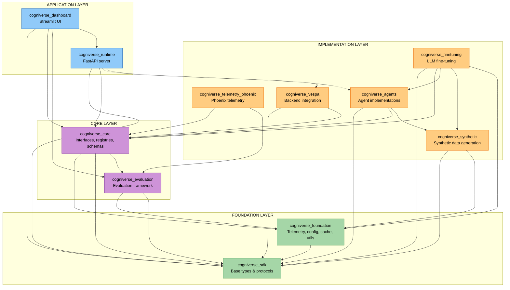

# Cogniverse Study Guide: Package Development

---

## Table of Contents
1. [Package Architecture](#package-architecture)
2. [Development Workflows](#development-workflows)
3. [Dependency Management](#dependency-management)
4. [Building Packages](#building-packages)
5. [Testing Strategies](#testing-strategies)
6. [Versioning and Releases](#versioning-and-releases)
7. [Best Practices](#best-practices)

---

## Package Architecture

### UV Workspace Structure

```text
cogniverse/
├── pyproject.toml         # Workspace root configuration
├── uv.lock                # Unified dependency lockfile
├── .venv/                 # Shared virtual environment
├── libs/
│   ├── FOUNDATION LAYER (base types and utilities)
│   ├── sdk/               # cogniverse_sdk
│   │   ├── pyproject.toml
│   │   ├── README.md
│   │   └── cogniverse_sdk/
│   │       ├── __init__.py
│   │       ├── document.py     # Document types
│   │       └── interfaces/     # Base interfaces and protocols
│   ├── foundation/        # cogniverse_foundation
│   │   ├── pyproject.toml
│   │   ├── README.md
│   │   └── cogniverse_foundation/
│   │       ├── __init__.py
│   │       ├── telemetry/      # Core telemetry
│   │       ├── config/         # Base configuration
│   │       └── utils/          # Common utilities
│   │
│   ├── CORE LAYER (business logic and frameworks)
│   ├── evaluation/        # cogniverse_evaluation
│   │   ├── pyproject.toml
│   │   ├── README.md
│   │   └── cogniverse_evaluation/
│   │       ├── __init__.py
│   │       ├── core/           # Evaluation framework
│   │       ├── evaluators/     # Evaluator implementations
│   │       └── metrics/        # Metric definitions
│   ├── core/              # cogniverse_core
│   │   ├── pyproject.toml
│   │   ├── README.md
│   │   └── cogniverse_core/
│   │       ├── __init__.py
│   │       ├── agents/         # Agent base classes
│   │       ├── backends/       # Backend interfaces
│   │       ├── common/         # Core business logic
│   │       ├── config/         # System configuration
│   │       ├── events/         # Event system
│   │       ├── factories/      # Factory classes
│   │       ├── interfaces/     # Core interfaces
│   │       ├── memory/         # Memory management
│   │       ├── registries/     # Component registries
│   │       ├── schemas/        # Schema management
│   │       ├── telemetry/      # Telemetry integration
│   │       └── validation/     # Validation logic
│   │
│   ├── IMPLEMENTATION LAYER (specific implementations)
│   ├── telemetry-phoenix/ # cogniverse_telemetry_phoenix
│   │   ├── pyproject.toml
│   │   ├── README.md
│   │   └── cogniverse_telemetry_phoenix/
│   │       └── __init__.py     # Phoenix telemetry implementation
│   ├── agents/            # cogniverse_agents
│   │   ├── pyproject.toml
│   │   ├── README.md
│   │   └── cogniverse_agents/
│   │       ├── __init__.py
│   │       ├── routing_agent.py       # Routing agent
│   │       ├── orchestrator_agent.py  # A2A orchestration entry point
│   │       ├── video_agent_refactored.py  # Video search agent
│   │       ├── approval/       # Approval workflow
│   │       ├── inference/      # Inference logic
│   │       ├── mixins/         # Agent mixins
│   │       ├── optimizer/      # Optimizer agents
│   │       ├── orchestrator/   # Orchestration
│   │       ├── query/          # Query processing
│   │       ├── results/        # Result handling
│   │       ├── routing/        # Routing strategies
│   │       ├── search/         # Search implementations
│   │       ├── tools/          # Agent tools
│   │       └── workflow/       # Workflow management
│   ├── vespa/             # cogniverse_vespa
│   │   ├── pyproject.toml
│   │   ├── README.md
│   │   └── cogniverse_vespa/
│   │       ├── backend.py      # Main backend implementation
│   │       ├── search_backend.py  # Search backend
│   │       ├── config/         # Vespa configuration
│   │       ├── registry/       # Adapter registry
│   │       └── workflow/       # Workflow store
│   ├── synthetic/         # cogniverse_synthetic
│   │   ├── pyproject.toml
│   │   ├── README.md
│   │   └── cogniverse_synthetic/
│   │       ├── __init__.py
│   │       ├── approval/       # Approval data generation
│   │       ├── generators/     # Synthetic data generators
│   │       └── utils/          # Utility functions
│   ├── finetuning/        # cogniverse_finetuning
│   │   ├── pyproject.toml
│   │   ├── README.md
│   │   └── cogniverse_finetuning/
│   │       ├── __init__.py
│   │       ├── trainers/       # LoRA/DPO trainers
│   │       ├── datasets/       # Dataset preparation
│   │       └── modal/          # Modal GPU infrastructure
│   │
│   ├── APPLICATION LAYER (user-facing applications)
│   ├── runtime/           # cogniverse_runtime
│   │   ├── pyproject.toml
│   │   ├── README.md
│   │   └── cogniverse_runtime/
│   │       ├── main.py         # FastAPI application
│   │       ├── admin/          # Admin endpoints
│   │       ├── inference/      # Inference endpoints
│   │       ├── ingestion/      # Data ingestion
│   │       ├── instrumentation/ # Telemetry setup
│   │       ├── routers/        # API routers
│   │       └── search/         # Search endpoints
│   └── dashboard/         # cogniverse_dashboard
│       ├── pyproject.toml
│       ├── README.md
│       └── cogniverse_dashboard/
│           ├── app.py          # Main Streamlit app
│           ├── tabs/           # Dashboard tabs
│           └── utils/          # Utility functions
├── tests/                 # Workspace-level tests
│   ├── admin/
│   ├── agents/
│   ├── backends/
│   ├── common/
│   ├── dashboard/
│   ├── evaluation/
│   ├── events/
│   ├── finetuning/
│   ├── ingestion/
│   ├── memory/
│   ├── routing/
│   ├── synthetic/
│   ├── system/
│   ├── telemetry/
│   ├── ui/
│   ├── unit/
│   └── utils/
└── scripts/               # Operational scripts
```

### Package Dependency Graph



**Layered Dependency Rules:**

**Foundation Layer** (no dependencies on other Cogniverse packages):

- `cogniverse_sdk`: Base types and protocols

- `cogniverse_foundation`: Core telemetry, configuration, cache, utilities (depends on `sdk`)

**Core Layer** (depends only on foundation):

- `cogniverse_evaluation`: Depends on `foundation`, `sdk`

- `cogniverse_core`: Depends on `foundation`, `sdk`, `evaluation`

**Implementation Layer** (depends on core and foundation):

- `cogniverse_telemetry_phoenix`: Depends on `core`, `evaluation`

- `cogniverse_agents`: Depends on `sdk`, `core`, `synthetic`

- `cogniverse_vespa`: Depends on `sdk`, `core`

- `cogniverse_synthetic`: Depends on `sdk`, `foundation`

- `cogniverse_finetuning`: Depends on `sdk`, `core`, `agents`, `synthetic`, `foundation`

**Application Layer** (depends on lower layers as needed):

- `cogniverse_runtime`: Depends on `sdk`, `core` (optional: `agents`, `vespa`)

- `cogniverse_dashboard`: Depends on `sdk`, `core`, `evaluation`, `runtime`

---

## Development Workflows

### Initial Setup

**1. Clone and Install Workspace:**
```bash
# Clone repository
git clone <repository-url>
cd cogniverse

# Install uv if not already installed
pip install uv

# Sync entire workspace (all packages in editable mode)
uv sync

# Verify installation
uv pip list | grep cogniverse
# Expected (11 packages in dependency order):
# cogniverse-sdk                   0.1.0
# cogniverse-foundation            0.1.0
# cogniverse-evaluation            0.1.0
# cogniverse-core                  0.1.0
# cogniverse-telemetry-phoenix     0.1.0
# cogniverse-agents                0.1.0
# cogniverse-vespa                 0.1.0
# cogniverse-synthetic             0.1.0
# cogniverse-finetuning            0.1.0
# cogniverse-runtime               0.1.0
# cogniverse-dashboard             0.1.0
```

**2. Activate Virtual Environment:**
```bash
# Activate workspace virtual environment
source .venv/bin/activate  # Linux/macOS
# or
.venv\Scripts\activate     # Windows

# Verify Python path
which python
# Should point to: /path/to/cogniverse/.venv/bin/python
```

### Working on Individual Packages

**Scenario 1: Developing Foundation Package (Base Layer)**
```bash
# Navigate to foundation package
cd libs/foundation

# Add a new dependency
uv add pydantic

# Update existing dependency
uv add --upgrade pydantic

# Remove dependency
uv remove pydantic

# Sync workspace after changes
cd ../..
uv sync

# Test foundation package
uv run pytest tests/telemetry/ -v
```

**Scenario 2: Developing Agents Package (Implementation Layer)**
```bash
# Navigate to agents package
cd libs/agents

# Add dependency (will automatically install if needed)
uv add litellm

# Since agents depends on core and synthetic, changes to those are immediately available
# Edit code in cogniverse_agents/routing_agent.py
from cogniverse_foundation.config.unified_config import SystemConfig  # Uses editable foundation
from cogniverse_core.registries.backend_registry import BackendRegistry  # Uses editable core

# Run tests for this package only
uv run pytest tests/agents/ -v
```

**Scenario 2b: Developing Synthetic Package (Implementation Layer)**
```bash
# Navigate to synthetic package
cd libs/synthetic

# Add dependencies
uv add faker  # For synthetic data generation

# Since synthetic depends on sdk only, keep dependencies minimal
from pydantic import BaseModel, Field

# Run tests
uv run pytest tests/synthetic/ -v
```

**Scenario 3: Cross-Layer Development**
```bash
# Scenario: Adding a new feature that spans multiple layers

# 1. Start with foundation layer (base types/utilities)
cd libs/foundation
# Edit cogniverse_foundation/telemetry/manager.py
# Add new telemetry capability

# 2. Update evaluation package (core layer) to use new telemetry
cd ../evaluation
# Edit cogniverse_evaluation/core/experiment_tracker.py
from cogniverse_foundation.telemetry.manager import TelemetryManager
telemetry = TelemetryManager()
# Use new telemetry capability

# 3. Update core package (core layer) for business logic
cd ../core
# Edit cogniverse_core/config/unified_config.py
# Add new configuration field for tenant memory settings

# 4. Update agents package (implementation layer) to use new config
cd ../agents
# Edit cogniverse_agents/routing_agent.py
from cogniverse_foundation.config.unified_config import SystemConfig
from cogniverse_core.registries.backend_registry import BackendRegistry
# Use new tenant memory config

# 5. Update runtime (application layer) to expose new feature
cd ../runtime
# Edit cogniverse_runtime/routers/admin.py or cogniverse_runtime/main.py
# Add endpoint for tenant memory configuration

# 6. Sync workspace to ensure all changes are available
cd ../../..
uv sync

# 7. Run layer-aware tests
# Foundation layer tests
uv run pytest tests/telemetry/ tests/common/ -v

# Core layer tests
uv run pytest tests/evaluation/ tests/memory/ -v

# Implementation layer tests
JAX_PLATFORM_NAME=cpu uv run pytest tests/agents/ tests/synthetic/ -v

# Application layer tests
uv run pytest tests/runtime/ -v
```

### Running Scripts and Applications

**Using uv run for Scripts:**
```bash
# Run ingestion script
JAX_PLATFORM_NAME=cpu uv run python scripts/run_ingestion.py \
  --video_dir data/testset/evaluation/sample_videos \
  --backend vespa \
  --tenant-id acme_corp

# Run dashboard
uv run streamlit run scripts/phoenix_dashboard_standalone.py --server.port 8501

# Run experiments
uv run python scripts/run_experiments_with_visualization.py \
  --dataset-name golden_eval_v1 \
  --profiles frame_based_colpali
```

**Direct Python Imports (in Scripts):**
```python
# scripts/custom_script.py
# Import from foundation layer
from cogniverse_foundation.telemetry.manager import TelemetryManager
from cogniverse_foundation.telemetry.config import TelemetryConfig

# Import from core layer
from cogniverse_foundation.config.unified_config import SystemConfig
from cogniverse_core.registries.backend_registry import BackendRegistry
from cogniverse_core.schemas.filesystem_loader import FilesystemSchemaLoader
from cogniverse_evaluation.core.experiment_tracker import ExperimentTracker

# Import from implementation layer
from cogniverse_agents.routing.strategies import GLiNERRoutingStrategy
from cogniverse_synthetic.generators.modality import ModalityGenerator
from pathlib import Path
from cogniverse_foundation.config.utils import create_default_config_manager

# All packages available in editable mode
config_manager = create_default_config_manager()
schema_loader = FilesystemSchemaLoader(Path("configs/schemas"))
backend = BackendRegistry.get_search_backend(
    name="vespa",
    config_manager=config_manager, schema_loader=schema_loader
)
# TelemetryManager is a singleton class - use constructor to get instance
telemetry = TelemetryManager(config=TelemetryConfig())
# GLiNERRoutingStrategy accepts optional config dict for labels and thresholds
routing_strategy = GLiNERRoutingStrategy(config={"gliner_labels": ["video_content", "text_information"]})
```

---

## Dependency Management

### Adding Dependencies

**Package-Level Dependencies:**
```bash
# Navigate to specific package
cd libs/core

# Add runtime dependency
uv add httpx

# Add with version constraint
uv add "pydantic>=2.0,<3.0"

# Add optional dependency group
uv add --optional telemetry arize-phoenix-otel

# Add development dependency
uv add --dev pytest-asyncio
```

**Workspace Root Dependencies:**
```bash
# Add dependency used across multiple packages
cd /path/to/cogniverse
uv add ruff  # Code formatter/linter

# Add test dependency for workspace
uv add --dev pytest pytest-cov
```

### Managing Inter-Package Dependencies

**Example: Adding New Foundation Feature Used by Upper Layers**

**Step 1: Update foundation package (base layer):**
```toml
# libs/foundation/pyproject.toml
[project]
name = "cogniverse-foundation"
version = "0.2.0"  # Increment version
dependencies = [
    "cogniverse-sdk>=0.2.0",  # SDK dependency
    "pydantic>=2.0",
    "httpx>=0.25.0",
]
```

**Step 2: Update evaluation package (core layer) to use new foundation:**
```toml
# libs/evaluation/pyproject.toml
[project]
name = "cogniverse-evaluation"
version = "0.2.0"
dependencies = [
    "cogniverse-foundation>=0.2.0",  # Update minimum version
    "arize-phoenix>=4.0.0",
]
```

**Step 3: Update core package (core layer):**
```toml
# libs/core/pyproject.toml
[project]
name = "cogniverse-core"
version = "0.2.0"
dependencies = [
    "cogniverse-foundation>=0.2.0",  # Foundation dependency
    "cogniverse-sdk>=0.2.0",         # SDK dependency
    "mem0ai>=0.1.0",
]
```

**Step 4: Update agents (implementation layer) to use new core:**
```toml
# libs/agents/pyproject.toml
[project]
name = "cogniverse-agents"
version = "0.2.0"
dependencies = [
    "cogniverse-core>=0.2.0",       # Core dependency
    "cogniverse-evaluation>=0.2.0",  # Evaluation dependency
    "litellm>=1.0.0",
]
```

**Step 5: Sync workspace (propagates changes through all layers):**
```bash
cd /path/to/cogniverse
uv sync
```

### Dependency Resolution

**Understanding uv.lock:**
```bash
# View lockfile (contains exact versions for all 11 packages + dependencies)
cat uv.lock

# Regenerate lockfile (after pyproject.toml changes)
uv lock

# Upgrade all dependencies to latest compatible versions
uv lock --upgrade

# Upgrade specific package
uv add --upgrade pydantic
```

**Resolving Conflicts Across Layers:**
```bash
# Scenario: Multiple packages in different layers require different versions of same dependency

# libs/foundation/pyproject.toml requires: httpx>=0.25.0,<0.26.0
# libs/agents/pyproject.toml requires: httpx>=0.24.0
# libs/runtime/pyproject.toml requires: httpx>=0.25.0

# uv will resolve to: httpx==0.25.x (satisfies all layers)

# If incompatible, uv will report error:
# ERROR: Cannot resolve dependencies:
#   cogniverse-foundation requires httpx>=0.25.0,<0.26.0
#   cogniverse-agents requires httpx>=0.27.0

# Solution: Align version constraints across layers in pyproject.toml files
# Start with foundation layer and propagate upward
```

---

## Building Packages

### Building Distribution Packages

**Build All Packages (in dependency order):**
```bash
# Build all 11 SDK packages for distribution (order matters!)
# Foundation layer first
for dir in libs/sdk libs/foundation; do
  echo "Building $(basename $dir)..."
  (cd "$dir" && uv build)
done

# Core layer
for dir in libs/evaluation libs/core; do
  echo "Building $(basename $dir)..."
  (cd "$dir" && uv build)
done

# Implementation layer
for dir in libs/telemetry-phoenix libs/agents libs/vespa libs/synthetic libs/finetuning; do
  echo "Building $(basename $dir)..."
  (cd "$dir" && uv build)
done

# Application layer
for dir in libs/runtime libs/dashboard; do
  echo "Building $(basename $dir)..."
  (cd "$dir" && uv build)
done

# Output (in each libs/*/dist/):
# cogniverse_sdk-0.1.0-py3-none-any.whl
# cogniverse_sdk-0.1.0.tar.gz
# cogniverse_foundation-0.1.0-py3-none-any.whl
# cogniverse_foundation-0.1.0.tar.gz
# ... (all 11 packages)
```

**Build Individual Package:**
```bash
# Build core package only
cd libs/core
uv build

# Verify build artifacts
ls -lh dist/
# cogniverse_core-0.1.0-py3-none-any.whl
# cogniverse_core-0.1.0.tar.gz

# Inspect wheel contents
unzip -l dist/cogniverse_core-0.1.0-py3-none-any.whl
```

### Installing from Built Wheels

**Local Installation:**
```bash
# Create test environment
python -m venv test_env
source test_env/bin/activate

# Install core package from wheel
pip install libs/core/dist/cogniverse_core-0.1.0-py3-none-any.whl

# Install agents (will automatically install core dependency)
pip install libs/agents/dist/cogniverse_agents-0.1.0-py3-none-any.whl

# Verify imports
python -c "from cogniverse_foundation.config.unified_config import SystemConfig; print('Success!')"
```

**Installation Order Matters (Layer-Aware):**
```bash
# CORRECT: Install in layer dependency order

# Foundation layer
pip install dist/cogniverse_sdk-0.1.0-py3-none-any.whl
pip install dist/cogniverse_foundation-0.1.0-py3-none-any.whl

# Core layer
pip install dist/cogniverse_evaluation-0.1.0-py3-none-any.whl
pip install dist/cogniverse_core-0.1.0-py3-none-any.whl

# Implementation layer
pip install dist/cogniverse_telemetry_phoenix-0.1.0-py3-none-any.whl
pip install dist/cogniverse_agents-0.1.0-py3-none-any.whl
pip install dist/cogniverse_vespa-0.1.0-py3-none-any.whl
pip install dist/cogniverse_synthetic-0.1.0-py3-none-any.whl
pip install dist/cogniverse_finetuning-0.1.0-py3-none-any.whl

# Application layer
pip install dist/cogniverse_runtime-0.1.0-py3-none-any.whl
pip install dist/cogniverse_dashboard-0.1.0-py3-none-any.whl

# INCORRECT: May fail due to missing dependencies
pip install dist/cogniverse_runtime-0.1.0-py3-none-any.whl  # Needs all lower layers
```

### Build Verification

**Verify Package Metadata:**
```bash
# Check package metadata
cd libs/core
uv build
pip show cogniverse-core

# Output:
# Name: cogniverse-core
# Version: 0.1.0
# Summary: Core utilities for Cogniverse multi-agent system
# Home-page: https://github.com/yourorg/cogniverse
# Author: Your Name
# License: MIT
# Requires: pydantic, httpx, arize-phoenix-otel
# Required-by: cogniverse-agents, cogniverse-vespa
```

**Test Installed Packages (Layer-by-Layer):**
```python
# test_package_install.py

# Test foundation layer
import cogniverse_sdk
import cogniverse_foundation
from cogniverse_foundation.telemetry.manager import TelemetryManager
from cogniverse_foundation.telemetry.config import TelemetryConfig

# Test core layer
import cogniverse_evaluation
import cogniverse_core
from cogniverse_foundation.config.unified_config import SystemConfig
from cogniverse_evaluation.core.experiment_tracker import ExperimentTracker

# Test implementation layer
import cogniverse_telemetry_phoenix
import cogniverse_agents
import cogniverse_vespa
import cogniverse_synthetic
import cogniverse_finetuning
from cogniverse_agents.routing.strategies import GLiNERRoutingStrategy

# Test application layer
import cogniverse_runtime
import cogniverse_dashboard

# Verify versions
assert cogniverse_sdk.__version__ == "0.1.0"
assert cogniverse_foundation.__version__ == "0.1.0"
assert cogniverse_core.__version__ == "0.1.0"
# ... verify all 11 packages

# Test basic functionality
config = SystemConfig(tenant_id="test")
assert config.tenant_id == "test"

# TelemetryManager is a singleton class
telemetry = TelemetryManager(config=TelemetryConfig())
assert telemetry is not None

print("✅ All 11 packages installed and verified")
```

---

## Testing Strategies

### Package-Specific Testing

**Test Core Package:**
```bash
# Run all core package tests
uv run pytest tests/common/ tests/telemetry/ -v

# Run with coverage
uv run pytest tests/common/ --cov=cogniverse_core --cov-report=html

# View coverage report
open htmlcov/index.html
```

**Test Agents Package:**
```bash
# Run agents tests
JAX_PLATFORM_NAME=cpu timeout 1800 uv run pytest tests/agents/ -v --tb=line

# Run specific test file
uv run pytest tests/agents/unit/ -v

# Run with markers
uv run pytest tests/agents/ -m "not slow" -v
```

**Test Integration:**
```bash
# Run integration tests (multiple packages)
JAX_PLATFORM_NAME=cpu timeout 7200 uv run pytest \
  tests/memory/ \
  tests/ingestion/integration/ \
  tests/evaluation/ \
  tests/routing/ \
  -v --tb=line
```

### Test Organization

**Per-Package Test Structure:**
```text
tests/
├── agents/              # cogniverse_agents tests
│   ├── unit/
│   │   ├── test_routing_agent.py
│   │   └── test_video_agent.py
│   └── integration/
│       └── test_agent_pipeline.py
├── common/              # cogniverse_core.common tests
│   ├── test_cache.py
│   └── test_utils.py
├── evaluation/          # cogniverse_evaluation tests
│   ├── test_experiment_tracker.py
│   └── test_evaluators.py
├── ingestion/           # cogniverse_runtime.ingestion tests
│   ├── unit/
│   │   └── test_pipeline.py
│   └── integration/
│       └── test_backend_ingestion.py
├── memory/              # cogniverse_core.common.memory tests
│   ├── unit/
│   │   └── test_mem0_memory_manager.py
│   └── integration/
│       └── test_mem0_vespa_integration.py
└── routing/             # cogniverse_agents.routing tests
    ├── unit/
    │   ├── test_phoenix_span_evaluator.py
    │   └── test_modality_evaluator.py
    └── integration/
        └── test_routing_evaluation.py
```

### Testing Best Practices

**1. Use Fixtures for Package Dependencies:**
```python
# tests/conftest.py
import pytest
from pathlib import Path
from cogniverse_foundation.config.unified_config import SystemConfig
from cogniverse_core.registries.backend_registry import BackendRegistry
from cogniverse_core.schemas.filesystem_loader import FilesystemSchemaLoader
from cogniverse_foundation.config.utils import create_default_config_manager

@pytest.fixture
def config_manager():
    """Shared config manager for tests"""
    return create_default_config_manager()

@pytest.fixture
def schema_loader():
    """Shared schema loader for tests"""
    return FilesystemSchemaLoader(Path("configs/schemas"))

@pytest.fixture
def vespa_backend(config_manager, schema_loader):
    """Vespa backend for integration tests"""
    return BackendRegistry.get_search_backend(
        name="vespa",
        config_manager=config_manager,
        schema_loader=schema_loader
    )
```

**2. Isolate Package Tests:**
```python
# tests/agents/unit/test_routing_agent.py
from cogniverse_agents.routing_agent import RoutingAgent
from cogniverse_foundation.config.unified_config import SystemConfig

def test_routing_agent_initialization():
    """Test agent initialization (no external dependencies)"""
    from cogniverse_agents.routing_agent import RoutingDeps
    from cogniverse_foundation.telemetry.config import TelemetryConfig

    deps = RoutingDeps(
        tenant_id="test",
        telemetry_config=TelemetryConfig()
    )
    agent = RoutingAgent(deps)

    assert agent.tenant_id == "test"

async def test_routing_agent_strategy_selection(mocker):
    """Test strategy selection with mocked LLM"""
    from cogniverse_agents.routing_agent import RoutingDeps
    from cogniverse_foundation.telemetry.config import TelemetryConfig

    # Mock external dependencies
    mocker.patch("cogniverse_agents.routing.strategies.GLiNERRoutingStrategy.route")

    deps = RoutingDeps(
        tenant_id="test",
        telemetry_config=TelemetryConfig()
    )
    agent = RoutingAgent(deps)

    # route_query is async and returns RoutingOutput with recommended_agent field
    result = await agent.route_query("test query")
    assert result.recommended_agent is not None
    assert result.confidence >= 0.0
```

**3. Integration Tests Across Packages:**
```python
# tests/ingestion/integration/test_backend_ingestion.py
import pytest
from cogniverse_runtime.ingestion.pipeline import VideoIngestionPipeline
from cogniverse_vespa.backend import VespaBackend
from cogniverse_foundation.config.unified_config import SystemConfig

@pytest.mark.integration
async def test_video_ingestion_to_vespa(vespa_backend, sample_video, config_manager, schema_loader):
    """Test complete ingestion pipeline with real Vespa"""
    pipeline = VideoIngestionPipeline(
        tenant_id="test",
        config_manager=config_manager,
        schema_loader=schema_loader,
        schema_name="video_colpali_smol500_mv_frame_test"
    )

    result = await pipeline.process_video(sample_video)

    assert result["status"] == "success"
    assert result["documents_created"] > 0

    # Verify in Vespa
    docs = vespa_backend.search(
        query="test",
        schema_name="video_colpali_smol500_mv_frame_test"
    )
    assert len(docs) > 0
```

---

## Versioning and Releases

### Semantic Versioning

**Version Format: MAJOR.MINOR.PATCH**

```text
0.1.0 → Initial release
0.1.1 → Patch release (bug fixes)
0.2.0 → Minor release (new features, backward compatible)
1.0.0 → Major release (breaking changes)
```

**Version Bump Strategy:**

**PATCH (0.1.0 → 0.1.1):**

- Bug fixes

- Documentation updates

- Performance improvements (no API changes)

**MINOR (0.1.0 → 0.2.0):**

- New features (backward compatible)

- New optional parameters

- Deprecation warnings

- Internal refactoring

**MAJOR (0.2.0 → 1.0.0):**

- Breaking API changes

- Removed deprecated features

- Changed function signatures

- Renamed modules/classes

### Release Process

**Step 1: Update Version Numbers**
```bash
# Update core package version
# libs/core/pyproject.toml
[project]
name = "cogniverse-core"
version = "0.2.0"  # Increment version

# Update agents package (depends on core)
# libs/agents/pyproject.toml
[project]
name = "cogniverse-agents"
version = "0.2.0"
dependencies = [
    "cogniverse-core>=0.2.0",  # Update dependency
]
```

**Step 2: Update Changelog**
```markdown
# CHANGELOG.md

## [0.2.0] - 2025-10-15

### Added
- Multi-tenant memory isolation with Mem0
- Per-tenant Phoenix project support
- Tenant-aware schema deployment

### Changed
- Updated SystemConfig to include tenant_id field
- Refactored TelemetryManager for multi-tenant support

### Fixed
- Fixed memory leak in embedding cache
- Resolved race condition in concurrent video processing

### Breaking Changes
- `SystemConfig` now requires `tenant_id` parameter
- Removed deprecated `use_default_config()` method
```

**Step 3: Build Packages**
```bash
# Build all packages
for dir in libs/*/; do
  echo "Building $(basename $dir) v0.2.0..."
  (cd "$dir" && uv build)
done
```

**Step 4: Test Built Packages**
```bash
# Create clean test environment
python -m venv release_test_env
source release_test_env/bin/activate

# Install in dependency order
pip install libs/core/dist/cogniverse_core-0.2.0-py3-none-any.whl
pip install libs/vespa/dist/cogniverse_vespa-0.2.0-py3-none-any.whl
pip install libs/agents/dist/cogniverse_agents-0.2.0-py3-none-any.whl

# Run smoke tests
python -c "
from cogniverse_foundation.telemetry.config import TelemetryConfig
from cogniverse_agents.routing_agent import RoutingAgent, RoutingDeps

deps = RoutingDeps(
    tenant_id='test',
    telemetry_config=TelemetryConfig()
)
agent = RoutingAgent(deps)
print('✅ Release smoke test passed')
"
```

**Step 5: Tag Release**
```bash
# Create git tag
git tag -a v0.2.0 -m "Release version 0.2.0"
git push origin v0.2.0
```

**Step 6: Publish to PyPI (Optional)**
```bash
# Publish core package
cd libs/core
uv publish

# Publish other packages (in dependency order)
cd ../vespa && uv publish
cd ../agents && uv publish
cd ../runtime && uv publish
cd ../dashboard && uv publish
```

### Version Compatibility Matrix (Key Packages)

| Package          | Version | Requires SDK | Requires Foundation | Requires Core | Requires Evaluation | Requires Synthetic | Requires Agents | Requires Runtime |
|-----------------|---------|--------------|---------------------|---------------|---------------------|-------------------|----------------|------------------|
| cogniverse-sdk | 0.2.0   | -            | -                   | -             | -                   | -                 | -              | -                |
| cogniverse-foundation | 0.2.0 | >=0.2.0    | -                   | -             | -                   | -                 | -              | -                |
| cogniverse-evaluation | 0.2.0 | >=0.2.0    | >=0.2.0             | -             | -                   | -                 | -              | -                |
| cogniverse-core | 0.2.0   | >=0.2.0      | >=0.2.0             | -             | >=0.2.0             | -                 | -              | -                |
| cogniverse-telemetry-phoenix | 0.2.0 | -  | -                   | >=0.2.0       | >=0.2.0             | -                 | -              | -                |
| cogniverse-agents | 0.2.0   | >=0.2.0    | -                   | >=0.2.0       | -                   | >=0.2.0           | -              | -                |
| cogniverse-vespa | 0.2.0   | >=0.2.0     | -                   | >=0.2.0       | -                   | -                 | -              | -                |
| cogniverse-synthetic | 0.2.0 | >=0.2.0    | >=0.2.0             | -             | -                   | -                 | -              | -                |
| cogniverse-finetuning | 0.2.0 | >=0.2.0   | >=0.2.0             | >=0.2.0       | -                   | >=0.2.0           | >=0.2.0        | -                |
| cogniverse-runtime | 0.2.0 | >=0.2.0     | -                   | >=0.2.0       | -                   | -                 | -              | -                |
| cogniverse-dashboard | 0.2.0 | >=0.2.0   | -                   | >=0.2.0       | >=0.2.0             | -                 | -              | >=0.2.0          |

Note: This shows required dependencies only. Runtime has optional dependencies on agents and vespa.

---

## Best Practices

### 1. Package Organization

**Keep Packages Focused:**
```python
# ✅ GOOD: Clear package boundaries
# cogniverse_core - foundational utilities only
from cogniverse_foundation.config.unified_config import SystemConfig
from cogniverse_foundation.telemetry.manager import TelemetryManager

# cogniverse_agents - agent implementations only
from cogniverse_agents.routing_agent import RoutingAgent
from cogniverse_agents.video_agent_refactored import VideoSearchAgent

# ❌ BAD: Mixing concerns
# Don't put agent implementations in cogniverse_core
# Don't put core utilities in cogniverse_agents
```

**Avoid Circular Dependencies:**
```python
# ❌ BAD: Circular dependency
# libs/core/cogniverse_core/config.py
from cogniverse_agents.routing_agent import RoutingAgent  # ❌ core depends on agents

# ✅ GOOD: One-way dependency
# libs/agents/cogniverse_agents/routing_agent.py
from cogniverse_foundation.config.unified_config import SystemConfig  # ✅ agents depends on core
```

### 2. Import Conventions

**Use Absolute Imports:**
```python
# ✅ GOOD: Absolute imports from package root
from cogniverse_foundation.config.unified_config import SystemConfig
from cogniverse_foundation.telemetry.manager import TelemetryManager
from cogniverse_agents.routing_agent import RoutingAgent

# ❌ BAD: Relative imports across packages
from ...core.config import SystemConfig  # ❌ Hard to read
from ..agents.routing_agent import RoutingAgent  # ❌ Fragile
```

**Package-Level Exports:**
```python
# libs/core/cogniverse_core/__init__.py
# Note: This package's __init__.py is intentionally empty (no exports)
# Always import directly from submodules for explicit dependencies

# Usage (use full import paths):
from cogniverse_foundation.config.unified_config import SystemConfig
from cogniverse_foundation.telemetry.manager import TelemetryManager
from cogniverse_evaluation.core.experiment_tracker import ExperimentTracker
from cogniverse_core.registries.backend_registry import BackendRegistry
```

### 3. Dependency Hygiene

**Minimal Dependencies:**
```toml
# ✅ GOOD: Only essential dependencies
[project]
dependencies = [
    "pydantic>=2.0",
    "httpx>=0.25.0",
]

# ❌ BAD: Unnecessary dependencies
[project]
dependencies = [
    "pydantic>=2.0",
    "httpx>=0.25.0",
    "numpy>=1.24.0",      # ❌ Not used in core
    "pandas>=2.0.0",      # ❌ Only used in one file
]
```

**Optional Dependencies:**
```toml
# Use optional dependency groups for specialized features
[project.optional-dependencies]
telemetry = [
    "arize-phoenix-otel>=4.0.0",
    "opentelemetry-sdk>=1.20.0",
]
memory = [
    "mem0ai>=0.1.0",
]
all = [
    "arize-phoenix-otel>=4.0.0",
    "opentelemetry-sdk>=1.20.0",
    "mem0ai>=0.1.0",
]

# Install with: uv add --optional telemetry arize-phoenix-otel
```

### 4. Testing Discipline

**Test Coverage Requirements:**
```bash
# Maintain >80% coverage for all packages
uv run pytest tests/agents/ --cov=cogniverse_agents --cov-fail-under=80

# ✅ Coverage report:
# cogniverse_agents/routing_agent.py              95%
# cogniverse_agents/video_agent_refactored.py     87%
# cogniverse_agents/routing/strategies.py         82%
# TOTAL                                            88%
```

**Test Before Commit:**
```bash
# Pre-commit checklist
uv run ruff check .                 # Linting
uv run ruff format .                # Formatting
uv run pytest tests/ -v             # All tests
uv build                            # Build verification
```

### 5. Documentation Standards

**Package README.md:**
```markdown
# cogniverse-agents

Agent implementations for Cogniverse multi-agent AI platform.

## Installation

```bash
pip install cogniverse-agents
```

## Quick Start

```python
import asyncio
from cogniverse_agents.routing_agent import RoutingAgent, RoutingDeps
from cogniverse_foundation.telemetry.config import TelemetryConfig

async def main():
    deps = RoutingDeps(
        tenant_id="acme_corp",
        telemetry_config=TelemetryConfig()
    )
    agent = RoutingAgent(deps)
    result = await agent.route_query("Show me machine learning videos")
    print(f"Route to: {result.recommended_agent}")

asyncio.run(main())
```

## Features

- Intelligent query routing with GLiNER and LLM strategies
- Video search with ColPali and VideoPrism
- Multi-tenant support with schema isolation
- Phoenix telemetry integration

## Documentation

See [docs/modules/agents.md](../../docs/modules/agents.md)
```

**Docstring Standards:**
```python
def process_video(
    self,
    video_path: Path,
    tenant_id: str,
    profile: str = "video_colpali_smol500_mv_frame"
) -> dict:
    """
    Process video and upload to tenant-specific Vespa schema.

    Args:
        video_path: Path to video file
        tenant_id: Tenant identifier for schema isolation
        profile: Processing profile name (default: frame-based ColPali)

    Returns:
        Dict with keys:
            - status: "success" or "failed"
            - documents_created: Number of documents uploaded
            - processing_time: Time in seconds
            - schema_name: Tenant-specific schema name

    Raises:
        VideoProcessingError: If video processing fails
        VespaUploadError: If upload to Vespa fails

    Examples:
        >>> pipeline = VideoIngestionPipeline(tenant_id="acme_corp")
        >>> result = pipeline.process_video(Path("video.mp4"))
        >>> print(result["status"])
        'success'
    """
```

### 6. CI/CD Integration

**GitHub Actions Workflow:**
```yaml
# .github/workflows/test-packages.yml
name: Test Packages

on: [push, pull_request]

jobs:
  test:
    runs-on: ubuntu-latest
    steps:
      - uses: actions/checkout@v3

      - name: Set up Python
        uses: actions/setup-python@v4
        with:
          python-version: '3.12'

      - name: Install uv
        run: pip install uv

      - name: Sync workspace
        run: uv sync

      - name: Run linter
        run: uv run ruff check .

      - name: Run formatter
        run: uv run ruff format --check .

      - name: Run tests
        run: |
          JAX_PLATFORM_NAME=cpu timeout 7200 uv run pytest \
            tests/ -v --tb=line --cov=libs --cov-report=xml

      - name: Upload coverage
        uses: codecov/codecov-action@v3
        with:
          file: ./coverage.xml
```

---

## Summary

This guide covers comprehensive UV workspace package development with layered architecture:

1. **Package Architecture**: layered structure with 4-layer dependency hierarchy
2. **Development Workflows**: Layer-aware editable installs, cross-layer development
3. **Dependency Management**: Layer-specific dependencies and workspace-level dependencies
4. **Building**: Distribution packages with wheels and source distributions in dependency order
5. **Testing**: Per-layer and integration testing strategies
6. **Versioning**: Semantic versioning and release process for all 11 packages
7. **Best Practices**: Layer organization, imports, documentation, CI/CD

**Key Principles for Layered Architecture:**

- **Foundation Layer** (sdk, foundation): Minimal cross-dependencies (foundation depends on sdk)

- **Core Layer** (evaluation, core): Depends only on foundation layer

- **Implementation Layer** (telemetry-phoenix, agents, vespa, synthetic, finetuning): Depends on core and/or foundation

- **Application Layer** (runtime, dashboard): Depends on lower layers as needed

- Use `uv sync` for workspace-wide changes across all layers

- Test layer-by-layer before releases

- Maintain backward compatibility in minor versions

- Document all public APIs with layer information

- Optional dependencies (runtime → agents, vespa) use dashed arrows in diagrams

**Layer-Aware Development:**

- Start changes in lower layers (foundation) and propagate upward

- Test each layer independently before integration testing

- Build and publish in dependency order: foundation → core → implementation → application

- Version bumps should be coordinated across dependent layers

**Next Steps:**

- [Scripts & Operations](scripts-operations.md) - Operational scripts

- [Testing Guide](../testing/TESTING_GUIDE.md) - Layer-aware testing strategies

- [Deployment Guide](../operations/deployment.md) - Production deployment

- [Publishing Guide](publishing-guide.md) - publishing workflow

---

**Related Documentation:**

- [SDK Architecture](../architecture/sdk-architecture.md)

- [Setup & Installation](../operations/setup-installation.md)

- [Configuration Guide](../operations/configuration.md)
