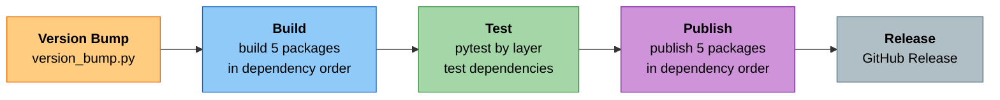
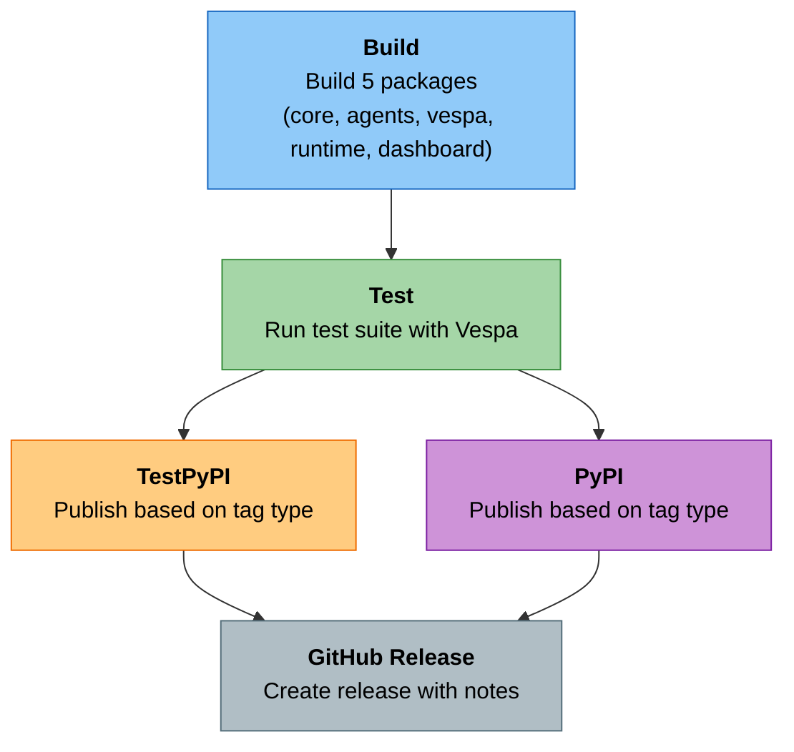

# Package Publishing Guide

---

## Table of Contents

- [Overview](#overview)
- [Package Structure](#package-structure)
- [Prerequisites](#prerequisites)
- [Version Management](#version-management)
- [Building Packages](#building-packages)
- [Testing Packages](#testing-packages)
- [Publishing to TestPyPI](#publishing-to-testpypi)
- [Publishing to PyPI](#publishing-to-pypi)
- [Automated Publishing (CI/CD)](#automated-publishing-cicd)
- [Troubleshooting](#troubleshooting)
- [Best Practices](#best-practices)

---

## Overview

Cogniverse consists of **11 independent packages** organized in a **layered architecture**. The publishing scripts currently support **5 main packages** (core, agents, vespa, runtime, dashboard):

### Packages Supported by Publishing Scripts

| Package | Description | Dependencies |
|---------|-------------|--------------|
| **cogniverse-core** | Business logic and system configuration | cogniverse-foundation, cogniverse-sdk, cogniverse-evaluation |
| **cogniverse-agents** | Agent implementations | cogniverse-core, cogniverse-synthetic |
| **cogniverse-vespa** | Vespa backend integration | cogniverse-core |
| **cogniverse-runtime** | FastAPI server runtime | cogniverse-core, cogniverse-sdk (agents/vespa optional) |
| **cogniverse-dashboard** | Streamlit UI dashboard | cogniverse-core, cogniverse-evaluation, cogniverse-runtime |

### Other Packages (Manual Publishing Required)

| Package | Description | Layer |
|---------|-------------|-------|
| **cogniverse-sdk** | Base types and protocols | Foundation |
| **cogniverse-foundation** | Core telemetry, config, utils | Foundation |
| **cogniverse-evaluation** | Evaluation framework and Phoenix analytics | Core |
| **cogniverse-telemetry-phoenix** | Phoenix telemetry implementation | Implementation |
| **cogniverse-synthetic** | Synthetic data generation | Implementation |
| **cogniverse-finetuning** | Model fine-tuning and optimization | Implementation |

### Publishing Workflow



**Publishing Scripts Handle 5 Packages**

The automated scripts (`build_packages.sh`, `version_bump.py`, `publish_packages.sh`) handle these packages in dependency order:

1. **cogniverse-core** - Built first (has workspace dependencies on foundation, sdk, evaluation)
2. **cogniverse-agents**, **cogniverse-vespa** - Built in parallel (depend on core)
3. **cogniverse-runtime**, **cogniverse-dashboard** - Built last (depend on core, agents, vespa)

**Note:** The other 6 packages (sdk, foundation, evaluation, telemetry-phoenix, synthetic, finetuning) must be published manually or require script updates.

---

## Package Structure

Each package follows UV workspace structure with layer organization:

```text
libs/
├── FOUNDATION LAYER
├── sdk/                     # cogniverse-sdk
│   ├── cogniverse_sdk/
│   │   ├── __init__.py
│   │   ├── document.py
│   │   └── interfaces/
│   ├── pyproject.toml
│   └── README.md
├── foundation/              # cogniverse-foundation
│   ├── cogniverse_foundation/
│   │   ├── __init__.py
│   │   ├── telemetry/
│   │   ├── config/
│   │   ├── cache/
│   │   └── utils/
│   ├── pyproject.toml
│   └── README.md
├── CORE LAYER
├── evaluation/              # cogniverse-evaluation
├── core/                    # cogniverse-core
├── IMPLEMENTATION LAYER
├── telemetry-phoenix/       # cogniverse-telemetry-phoenix
├── agents/                  # cogniverse-agents
├── vespa/                   # cogniverse-vespa
├── synthetic/               # cogniverse-synthetic
├── finetuning/              # cogniverse-finetuning
├── APPLICATION LAYER
├── runtime/                 # cogniverse-runtime
└── dashboard/               # cogniverse-dashboard
```

**Key File: `pyproject.toml` (Foundation Layer Example)**

```toml
# libs/foundation/pyproject.toml
[project]
name = "cogniverse-foundation"
version = "0.1.0"
description = "Cogniverse Foundation - Cross-cutting concerns and shared infrastructure"
requires-python = ">=3.12"
dependencies = [
    "cogniverse-sdk",
    "opentelemetry-api>=1.20.0",
    "opentelemetry-sdk>=1.20.0",
    "pydantic>=2.0.0",
    "sqlalchemy>=2.0.0",
    "pandas>=2.0.0",
]

[tool.uv.sources]
cogniverse-sdk = { workspace = true }

[build-system]
requires = ["hatchling"]
build-backend = "hatchling.build"
```

**Key File: `pyproject.toml` (Implementation Layer Example)**

```toml
# libs/agents/pyproject.toml
[project]
name = "cogniverse-agents"
version = "0.1.0"
description = "Agent implementations, routing logic, and search enhancement for Cogniverse"
requires-python = ">=3.12"
dependencies = [
    "cogniverse-sdk",
    "cogniverse-core",
    "cogniverse-synthetic",
    # Machine Learning
    "torch>=2.5.0",
    "transformers>=4.50.0",
    "colpali-engine>=0.3.12",
    "sentence-transformers>=5.1.0",
    # Optimization and ML
    "xgboost>=3.0.5",
    "scikit-learn>=1.3.0",
    "scipy>=1.10.0",
    # NLP
    "spacy>=3.7.0",
    "gliner>=0.2.21",
    "langextract>=1.0.6",
    # MLflow for experiment tracking
    "mlflow>=3.0.0",
]

[tool.uv.sources]
cogniverse-sdk = { workspace = true }
cogniverse-core = { workspace = true }
cogniverse-synthetic = { workspace = true }

[build-system]
requires = ["hatchling"]
build-backend = "hatchling.build"
```

---

## Prerequisites

### Required Tools

```bash
# UV package manager
pip install uv

# Python dependencies for versioning
pip install tomli tomli-w

# Twine for PyPI uploads (optional - installed by scripts)
pip install twine
```

### PyPI Account Setup

#### 1. Create PyPI Accounts

- **PyPI (Production):** https://pypi.org/account/register/
- **TestPyPI (Testing):** https://test.pypi.org/account/register/

#### 2. Generate API Tokens

**PyPI:**

1. Go to https://pypi.org/manage/account/token/

2. Create token with scope: "Entire account"

3. Save token securely (starts with `pypi-`)

**TestPyPI:**

1. Go to https://test.pypi.org/manage/account/token/

2. Create token with scope: "Entire account"

3. Save token securely (starts with `pypi-`)

#### 3. Configure Credentials

**Option A: Environment Variables (Recommended for CI/CD)**

```bash
export PYPI_TOKEN="pypi-your-production-token"
export TEST_PYPI_TOKEN="pypi-your-test-token"
```

**Option B: .pypirc File (Local Development)**

```ini
# ~/.pypirc
[distutils]
index-servers =
    pypi
    testpypi

[pypi]
username = __token__
password = pypi-your-production-token

[testpypi]
repository = https://test.pypi.org/legacy/
username = __token__
password = pypi-your-test-token
```

**Security Note:** Never commit `.pypirc` or tokens to version control!

---

## Version Management

### Semantic Versioning

Cogniverse follows [Semantic Versioning 2.0.0](https://semver.org/):

```text
MAJOR.MINOR.PATCH[-PRERELEASE]
  ↓     ↓     ↓         ↓
  0  .  1  .  0  -  alpha.0

MAJOR: Breaking changes
MINOR: New features (backward compatible)
PATCH: Bug fixes
PRERELEASE: alpha, beta, rc
```

### Version Bump Script

**Script:** `scripts/version_bump.py`

#### Basic Usage

```bash
# Patch bump (0.1.0 → 0.1.1)
./scripts/version_bump.py patch

# Minor bump (0.1.0 → 0.2.0)
./scripts/version_bump.py minor

# Major bump (0.2.0 → 1.0.0)
./scripts/version_bump.py major

# Prerelease (0.1.0 → 0.1.1-alpha.0)
./scripts/version_bump.py prerelease --prerelease-suffix alpha
```

#### Advanced Options

```bash
# Dry run (preview changes)
./scripts/version_bump.py patch --dry-run

# Bump specific package only
./scripts/version_bump.py patch --package core

# With git commit and tag
./scripts/version_bump.py minor --commit --tag

# Force (ignore git status)
./scripts/version_bump.py patch --force
```

#### Workflow Example

```bash
# 1. Preview version bump
./scripts/version_bump.py minor --dry-run

# 2. Apply version bump with commit and tag
./scripts/version_bump.py minor --commit --tag

# Output:
# [INFO] Current version: 0.1.0
# [INFO] New version: 0.2.0
# [SUCCESS] Updated core: 0.1.0 → 0.2.0
# [SUCCESS] Updated agents: 0.1.0 → 0.2.0
# ...
# [SUCCESS] Committed version bump: 0.2.0
# [SUCCESS] Created git tag: v0.2.0
```

---

## Building Packages

### Build Script

**Script:** `scripts/build_packages.sh`

#### Basic Build

```bash
# Build all packages
./scripts/build_packages.sh

# Clean build (remove previous artifacts)
./scripts/build_packages.sh --clean

# Verbose output
./scripts/build_packages.sh --verbose
```

#### Advanced Options

```bash
# Build with tests
./scripts/build_packages.sh --test

# Strict mode (fail on test failures)
./scripts/build_packages.sh --test --strict

# Continue on errors
CONTINUE_ON_ERROR=true ./scripts/build_packages.sh
```

#### Build Output

```text
dist/
├── cogniverse_core-0.1.0-py3-none-any.whl
├── cogniverse_core-0.1.0.tar.gz
├── cogniverse_agents-0.1.0-py3-none-any.whl
├── cogniverse_agents-0.1.0.tar.gz
├── cogniverse_vespa-0.1.0-py3-none-any.whl
├── cogniverse_vespa-0.1.0.tar.gz
├── cogniverse_runtime-0.1.0-py3-none-any.whl
├── cogniverse_runtime-0.1.0.tar.gz
├── cogniverse_dashboard-0.1.0-py3-none-any.whl
├── cogniverse_dashboard-0.1.0.tar.gz
└── BUILD_MANIFEST.txt
```

#### Build Process

1. **Validation:** Checks package structure and version format for 5 packages (core, agents, vespa, runtime, dashboard)
2. **Dependency Order:** Builds packages respecting dependencies:
   - core (built first)
   - agents, vespa (built in parallel after core)
   - runtime, dashboard (built last)
3. **Artifact Generation:** Creates wheel (.whl) and source (.tar.gz) distributions
4. **Verification:** Validates metadata and contents for each package
5. **Manifest:** Generates build manifest

---

## Testing Packages

### Local Testing

#### Install from Built Distributions

```bash
# Create test environment
python -m venv test-env
source test-env/bin/activate

# Install built packages in dependency order

# Core package (built first)
pip install dist/cogniverse_core-*.whl

# Agent and backend packages (depend on core)
pip install dist/cogniverse_agents-*.whl
pip install dist/cogniverse_vespa-*.whl

# Application packages (depend on core, agents, vespa)
pip install dist/cogniverse_runtime-*.whl
pip install dist/cogniverse_dashboard-*.whl

# Verify imports
python -c "from cogniverse_foundation.config.unified_config import SystemConfig"
python -c "from cogniverse_agents.routing_agent import RoutingAgent"
python -c "from cogniverse_vespa import VespaBackend"
python -c "from cogniverse_runtime.main import app"
python -c "print('All packages imported successfully')"
```

#### Run Test Suite

```bash
# Run all tests
JAX_PLATFORM_NAME=cpu uv run pytest

# Run package-specific tests
JAX_PLATFORM_NAME=cpu uv run pytest tests/common/
JAX_PLATFORM_NAME=cpu uv run pytest tests/agents/
```

---

## Publishing to TestPyPI

### Why TestPyPI?

- **Safe testing environment** for PyPI without affecting production
- **Validate package metadata** before production release
- **Test installation** from PyPI-like repository

### Manual Publishing

```bash
# 1. Build packages
./scripts/build_packages.sh --clean

# 2. Publish to TestPyPI (with dry run first)
TEST_PYPI_TOKEN="your-test-token" ./scripts/publish_packages.sh --test --dry-run

# 3. Actual publish
TEST_PYPI_TOKEN="your-test-token" ./scripts/publish_packages.sh --test

# Output:
# [INFO] Publishing package: cogniverse-core
# [INFO]   Version: 0.1.0
# [INFO]   Uploading...
# [SUCCESS] Published successfully: cogniverse-core v0.1.0
```

### Test Installation

```bash
# Install from TestPyPI
pip install --index-url https://test.pypi.org/simple/ \
            --extra-index-url https://pypi.org/simple/ \
            cogniverse-core

# Note: --extra-index-url allows dependencies from production PyPI
```

### Verification

```bash
# Test package functionality
python -c "
from cogniverse_foundation.config.unified_config import SystemConfig
config = SystemConfig(tenant_id='test')
print(f'Successfully imported: {config.tenant_id}')
"
```

---

## Publishing to PyPI

### Pre-publish Checklist

- [ ] All tests passing
- [ ] Version bumped correctly
- [ ] Git tag created (`v0.1.0`)
- [ ] CHANGELOG updated (optional - file not currently maintained)
- [ ] README accurate
- [ ] License included
- [ ] Tested on TestPyPI

### Manual Publishing

```bash
# 1. Build packages
./scripts/build_packages.sh --clean --test

# 2. Publish to PyPI (with dry run first)
PYPI_TOKEN="your-production-token" ./scripts/publish_packages.sh --dry-run

# 3. Actual publish
PYPI_TOKEN="your-production-token" ./scripts/publish_packages.sh

# Output:
# [INFO] Publishing package: cogniverse-core
# [INFO]   Version: 0.1.0
# [INFO]   Uploading...
# [SUCCESS] Published successfully: cogniverse-core v0.1.0
# [SUCCESS] Published successfully: cogniverse-agents v0.1.0
# [SUCCESS] Published successfully: cogniverse-vespa v0.1.0
# [SUCCESS] Published successfully: cogniverse-runtime v0.1.0
# [SUCCESS] Published successfully: cogniverse-dashboard v0.1.0
```

**Note:** The scripts publish all 5 packages (core, agents, vespa, runtime, dashboard). For other packages (sdk, foundation, evaluation, telemetry-phoenix, synthetic, finetuning), manual publishing or script updates are required.


### Verify Publication

```bash
# Check PyPI page
open https://pypi.org/project/cogniverse-core/

# Test installation
pip install cogniverse-core==0.1.0

# Test functionality
python -c "from cogniverse_foundation.config.unified_config import SystemConfig; print('Success!')"
```

---

## Automated Publishing (CI/CD)

### GitHub Actions Workflow

**File:** `.github/workflows/publish-packages.yml`

#### Trigger: Version Tags

```bash
# Create and push version tag
git tag -a v0.1.0 -m "Release 0.1.0"
git push origin v0.1.0

# GitHub Actions automatically:
# 1. Builds packages
# 2. Runs tests
# 3. Publishes to PyPI
# 4. Creates GitHub Release
```

#### Trigger: Manual Workflow Dispatch

```bash
# Via GitHub UI:
# 1. Go to Actions → "Publish SDK Packages"
# 2. Click "Run workflow"
# 3. Select target: testpypi or pypi
# 4. Optional: Enable dry run
```

### Workflow Stages



### Tag-Based Publishing Rules

| Tag Format | Target | Example |
|------------|--------|---------|
| `v*.*.*` | PyPI | `v0.1.0` |
| `v*.*.*-alpha.*` | TestPyPI | `v0.1.0-alpha.0` |
| `v*.*.*-beta.*` | TestPyPI | `v0.1.0-beta.1` |
| `v*.*.*-rc.*` | TestPyPI | `v0.1.0-rc.1` |

### Required GitHub Secrets

```text
Settings → Secrets → Actions:

PYPI_TOKEN           Production PyPI API token
TEST_PYPI_TOKEN      TestPyPI API token
```

---

## Troubleshooting

### Common Issues

#### Version Already Exists on PyPI

**Error:**
```text
HTTPError: 400 Bad Request from https://upload.pypi.org/legacy/
File already exists
```

**Solution:**
```bash
# PyPI doesn't allow overwriting versions
# You must bump the version
./scripts/version_bump.py patch --commit --tag

# Then rebuild and republish
./scripts/build_packages.sh --clean
./scripts/publish_packages.sh
```

#### Missing Dependencies in Build

**Error:**
```text
ModuleNotFoundError: No module named 'cogniverse_core'
```

**Solution:**
```bash
# Sync workspace dependencies
uv sync

# Rebuild
./scripts/build_packages.sh --clean
```

#### Twine Upload Fails

**Error:**
```text
twine.exceptions.TwineException: Invalid or non-existent authentication information
```

**Solution:**
```bash
# Check credentials
cat ~/.pypirc

# Or use environment variables
export PYPI_TOKEN="pypi-your-token"
./scripts/publish_packages.sh
```

#### Package Import Fails After Install

**Error:**
```text
ImportError: cannot import name 'SystemConfig' from 'cogniverse_foundation.config.unified_config'
```

**Solution:**
```bash
# Check package contents
unzip -l dist/cogniverse_foundation-*.whl | grep config

# Verify __init__.py exports
cat libs/foundation/cogniverse_foundation/__init__.py

# Rebuild with correct exports
./scripts/build_packages.sh --clean
```

---

## Best Practices

### Version Management

1. **Use semantic versioning strictly**
   ```bash
   # Breaking changes
   ./scripts/version_bump.py major

   # New features
   ./scripts/version_bump.py minor

   # Bug fixes
   ./scripts/version_bump.py patch
   ```

2. **Always test prereleases**
   ```bash
   # Create prerelease
   ./scripts/version_bump.py prerelease --prerelease-suffix alpha

   # Publish to TestPyPI
   ./scripts/publish_packages.sh --test

   # Test thoroughly before production
   ```

3. **Use git tags for releases**
   ```bash
   ./scripts/version_bump.py minor --commit --tag
   git push origin --tags
   ```

### Building

1. **Always use clean builds for releases**
   ```bash
   ./scripts/build_packages.sh --clean
   ```

2. **Run tests before publishing**
   ```bash
   ./scripts/build_packages.sh --clean --test --strict
   ```

3. **Verify build artifacts**
   ```bash
   # Check wheel contents
   unzip -l dist/*.whl

   # Validate with twine
   twine check dist/*
   ```

### Publishing

1. **Always test on TestPyPI first**
   ```bash
   # Test publish
   ./scripts/publish_packages.sh --test

   # Verify installation
   pip install --index-url https://test.pypi.org/simple/ cogniverse-core

   # Then publish to production
   ./scripts/publish_packages.sh
   ```

2. **Use dry runs for validation**
   ```bash
   ./scripts/publish_packages.sh --dry-run
   ```

3. **Document changes in CHANGELOG (optional)**
   ```markdown
   ## [0.2.0] - 2025-10-15
   ### Added
   - New routing strategy: GLiNER-based
   - Multi-tenant Phoenix projects

   ### Changed
   - Improved memory performance

   ### Fixed
   - Vespa schema deployment bug
   ```

   Note: CHANGELOG.md is not currently maintained in this project. This is a recommended best practice if you choose to implement it.

### Security

1. **Never commit secrets**
   ```bash
   # Add to .gitignore
   echo "*.pypirc" >> .gitignore
   echo ".env" >> .gitignore
   ```

2. **Use environment variables in CI/CD**
   ```yaml
   # GitHub Actions
   env:
     PYPI_TOKEN: ${{ secrets.PYPI_TOKEN }}
   ```

3. **Rotate API tokens regularly**
   - PyPI tokens should be rotated every 6 months
   - Use scoped tokens when possible

### Quality Assurance

1. **Maintain package READMEs**
   - Each package should have a clear README
   - Include installation and usage examples

2. **Keep pyproject.toml updated**
   - Accurate dependencies
   - Correct Python version requirements
   - Proper classifiers

3. **Test cross-package dependencies**
   ```bash
   # Install only runtime (should pull dependencies)
   pip install cogniverse-runtime

   # Verify all dependencies installed
   pip list | grep cogniverse
   ```

---

## Complete Publishing Workflow

### Standard Release Process

```bash
# 1. Update code and tests
git add .
git commit -m "Add new routing feature"

# 2. Bump version
./scripts/version_bump.py minor --dry-run    # Preview
./scripts/version_bump.py minor --commit --tag

# 3. Build packages
./scripts/build_packages.sh --clean --verbose

# 4. Test packages
JAX_PLATFORM_NAME=cpu uv run pytest

# 5. Publish to TestPyPI
TEST_PYPI_TOKEN="your-token" ./scripts/publish_packages.sh --test

# 6. Test installation from TestPyPI
pip install --index-url https://test.pypi.org/simple/ cogniverse-core

# 7. Publish to production PyPI
PYPI_TOKEN="your-token" ./scripts/publish_packages.sh

# 8. Push tags to trigger CI/CD
git push origin --tags

# 9. Verify on PyPI
open https://pypi.org/project/cogniverse-core/

# 10. Create GitHub release notes
# (Automated by CI/CD workflow)
```

---

## Related Documentation

- [Package Development](package-dev.md) - SDK development guide
- [SDK Architecture](../architecture/sdk-architecture.md) - Package structure details
- [Testing Guide](../testing/pytest-best-practices.md) - Testing practices

---

## Support

- **PyPI Issues:** Check [PyPI Help](https://pypi.org/help/)
- **Build Issues:** Review build logs in `dist/BUILD_MANIFEST.txt`
- **CI/CD Issues:** Check GitHub Actions logs

---
