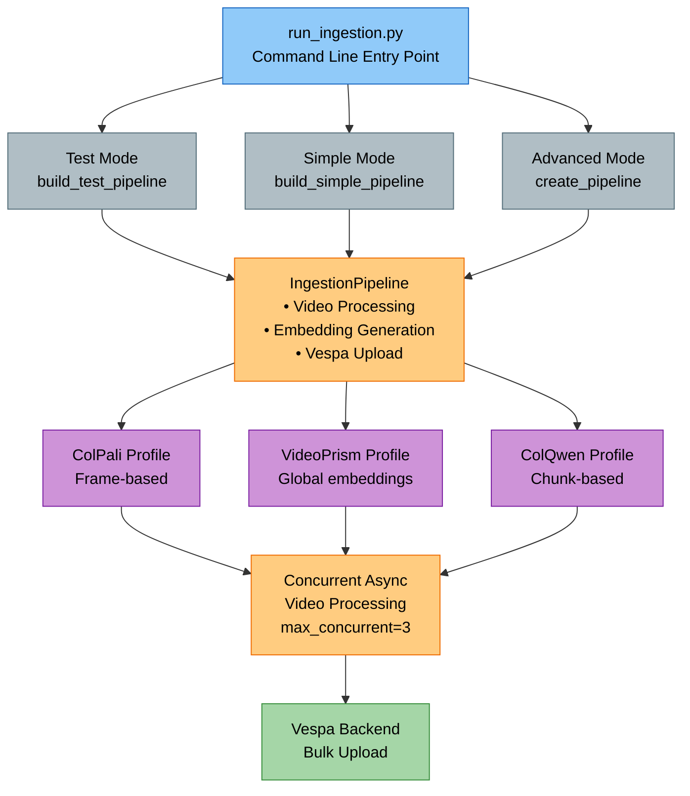
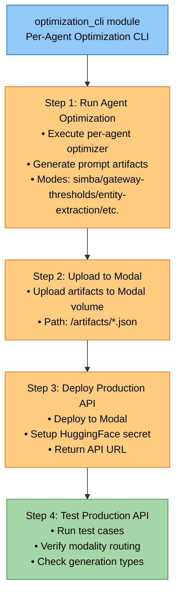
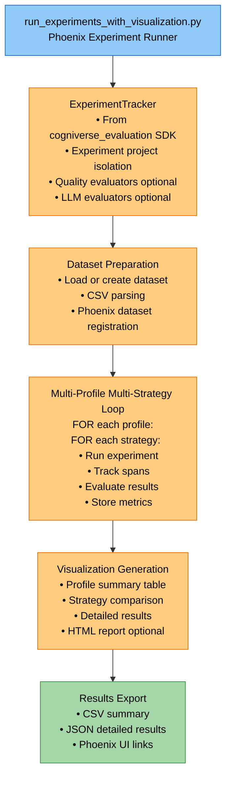

# Cogniverse Study Guide: Scripts & Operations Module

**Module Path:** `scripts/`
**SDK Packages:** Uses all 11 packages (foundation → core → implementation → application)

---

## Table of Contents
1. [Module Overview](#module-overview)
2. [Architecture](#architecture)
3. [Core Scripts](#core-scripts)
4. [Data Flow](#data-flow)
5. [Usage Examples](#usage-examples)
6. [Production Considerations](#production-considerations)

---

## Module Overview

### Purpose
The Scripts & Operations module provides command-line tools for:

- **Video Ingestion**: Processing and indexing video content

- **Schema Deployment**: Managing Vespa search schemas

- **System Setup**: Initializing the system environment

- **Optimization**: Running DSPy optimization workflows

- **Experimentation**: Conducting Phoenix experiments with visualization

- **Dataset Management**: Managing evaluation datasets

- **Dashboard**: Interactive Streamlit-based analytics UI

### Key Features
- **Builder Pattern Ingestion**: Fluent API for configurable pipeline construction
- **Multi-Profile Support**: Process videos with multiple embedding strategies simultaneously
- **Tenant-Aware Processing**: Per-tenant schema isolation and configuration
- **Async Processing**: Concurrent video processing with configurable limits
- **Phoenix Integration**: Per-tenant experiment tracking with visual analytics
- **Schema Management**: JSON-based tenant-specific schema deployment
- **Interactive Dashboards**: Streamlit tabs for analytics, configuration, and memory management
- **UV Workspace**: All scripts use `uv run` for SDK package management

### Script Categories

```text
scripts/
├── Ingestion & Processing
│   ├── run_ingestion.py              # Main video ingestion pipeline
│   ├── test_ingestion.py             # Test ingestion with validation
│   ├── ingest_documents.py           # Document ingestion
│   ├── ingest_images.py              # Image ingestion
│   └── ingest_audio.py               # Audio ingestion
│
├── Deployment & Setup
│   ├── deploy_json_schema.py         # Deploy single JSON schema
│   ├── deploy_memory_schema.py       # Deploy memory schema
│   ├── setup_system.py               # System initialization
│   ├── setup_ollama.py               # Ollama model setup
│   ├── setup_gliner.py               # GLiNER setup
│   └── setup_video_processing.py    # Video processing setup
│   (bulk schema deploy flows through the runtime admin API:
│    POST /admin/profiles/{profile}/deploy — see charts/cogniverse/
│    templates/init-jobs.yaml for the in-cluster init job.)
│
├── Optimization & Experiments
│   ├── run_experiments_with_visualization.py  # Phoenix experiments
│   ├── optimize_system.py            # System-wide optimization
│   └── auto_optimization_trigger.py  # Automated optimization trigger
│   (optimization_cli module replaces deleted run_module_optimization.py)
│
├── Dataset Management
│   ├── manage_datasets.py            # Dataset CRUD operations
│   ├── create_golden_dataset_from_traces.py  # Golden dataset from traces
│   ├── bootstrap_dataset_from_traces.py      # Bootstrap from traces
│   ├── generate_dataset_from_videos.py       # Dataset from videos
│   ├── create_sample_dataset.py      # Sample dataset creation
│   └── interactive_dataset_builder.py  # Interactive builder UI
│
├── Dashboard & UI
│   └── atlas_viewer.py               # Standalone embedding atlas viewer
│
└── Utilities & Analysis
    ├── analyze_traces.py             # Phoenix trace analysis
    ├── export_backend_embeddings.py  # Backend embedding export (tenant-aware)
    └── manage_phoenix_data.py        # Phoenix data management
```

---

## Architecture

### 1. Ingestion Pipeline Architecture


```mermaid
flowchart TB
    Entry["<span style='color:#000'>run_ingestion.py<br/>Command Line Entry Point</span>"]

    TestMode["<span style='color:#000'>Test Mode<br/>build_test_pipeline</span>"]
    SimpleMode["<span style='color:#000'>Simple Mode<br/>build_simple_pipeline</span>"]
    AdvMode["<span style='color:#000'>Advanced Mode<br/>create_pipeline</span>"]

    Pipeline["<span style='color:#000'>IngestionPipeline<br/>• Video Processing<br/>• Embedding Generation<br/>• Vespa Upload</span>"]

    ColPali["<span style='color:#000'>ColPali Profile<br/>Frame-based</span>"]
    VideoPrism["<span style='color:#000'>VideoPrism Profile<br/>Global embeddings</span>"]
    ColQwen["<span style='color:#000'>ColQwen Profile<br/>Chunk-based</span>"]

    Concurrent["<span style='color:#000'>Concurrent Async<br/>Video Processing<br/>max_concurrent=3</span>"]

    Vespa["<span style='color:#000'>Vespa Backend<br/>Bulk Upload</span>"]

    Entry --> TestMode
    Entry --> SimpleMode
    Entry --> AdvMode

    TestMode --> Pipeline
    SimpleMode --> Pipeline
    AdvMode --> Pipeline

    Pipeline --> ColPali
    Pipeline --> VideoPrism
    Pipeline --> ColQwen

    ColPali --> Concurrent
    VideoPrism --> Concurrent
    ColQwen --> Concurrent

    Concurrent --> Vespa

    style Entry fill:#90caf9,stroke:#1565c0,color:#000
    style TestMode fill:#b0bec5,stroke:#546e7a,color:#000
    style SimpleMode fill:#b0bec5,stroke:#546e7a,color:#000
    style AdvMode fill:#b0bec5,stroke:#546e7a,color:#000
    style Pipeline fill:#ffcc80,stroke:#ef6c00,color:#000
    style ColPali fill:#ce93d8,stroke:#7b1fa2,color:#000
    style VideoPrism fill:#ce93d8,stroke:#7b1fa2,color:#000
    style ColQwen fill:#ce93d8,stroke:#7b1fa2,color:#000
    style Concurrent fill:#ffcc80,stroke:#ef6c00,color:#000
    style Vespa fill:#a5d6a7,stroke:#388e3c,color:#000
```

### 2. Optimization Workflow Architecture


```mermaid
flowchart TB
    Start["<span style='color:#000'>optimization_cli module<br/>Per-Agent Optimization CLI</span>"]

    Step1["<span style='color:#000'>Step 1: Run Agent Optimization<br/>• Execute per-agent optimizer<br/>• Generate prompt artifacts<br/>• Modes: simba/gateway-thresholds/entity-extraction/etc.</span>"]

    Step2["<span style='color:#000'>Step 2: Upload to Modal<br/>• Upload artifacts to Modal volume<br/>• Path: /artifacts/*.json</span>"]

    Step3["<span style='color:#000'>Step 3: Deploy Production API<br/>• Deploy to Modal<br/>• Setup HuggingFace secret<br/>• Return API URL</span>"]

    Step4["<span style='color:#000'>Step 4: Test Production API<br/>• Run test cases<br/>• Verify modality routing<br/>• Check generation types</span>"]

    Start --> Step1
    Step1 --> Step2
    Step2 --> Step3
    Step3 --> Step4

    style Start fill:#90caf9,stroke:#1565c0,color:#000
    style Step1 fill:#ffcc80,stroke:#ef6c00,color:#000
    style Step2 fill:#ffcc80,stroke:#ef6c00,color:#000
    style Step3 fill:#ffcc80,stroke:#ef6c00,color:#000
    style Step4 fill:#a5d6a7,stroke:#388e3c,color:#000
```

### 3. Experiment Workflow Architecture


```mermaid
flowchart TB
    Start["<span style='color:#000'>run_experiments_with_visualization.py<br/>Phoenix Experiment Runner</span>"]

    Runner["<span style='color:#000'>ExperimentTracker<br/>• From cogniverse_evaluation SDK<br/>• Experiment project isolation<br/>• Quality evaluators optional<br/>• LLM evaluators optional</span>"]

    Dataset["<span style='color:#000'>Dataset Preparation<br/>• Load or create dataset<br/>• CSV parsing<br/>• Phoenix dataset registration</span>"]

    Loop["<span style='color:#000'>Multi-Profile Multi-Strategy Loop<br/>FOR each profile:<br/>  FOR each strategy:<br/>    • Run experiment<br/>    • Track spans<br/>    • Evaluate results<br/>    • Store metrics</span>"]

    Viz["<span style='color:#000'>Visualization Generation<br/>• Profile summary table<br/>• Strategy comparison<br/>• Detailed results<br/>• HTML report optional</span>"]

    Export["<span style='color:#000'>Results Export<br/>• CSV summary<br/>• JSON detailed results<br/>• Phoenix UI links</span>"]

    Start --> Runner
    Runner --> Dataset
    Dataset --> Loop
    Loop --> Viz
    Viz --> Export

    style Start fill:#90caf9,stroke:#1565c0,color:#000
    style Runner fill:#ffcc80,stroke:#ef6c00,color:#000
    style Dataset fill:#ffcc80,stroke:#ef6c00,color:#000
    style Loop fill:#ffcc80,stroke:#ef6c00,color:#000
    style Viz fill:#ffcc80,stroke:#ef6c00,color:#000
    style Export fill:#a5d6a7,stroke:#388e3c,color:#000
```

### 4. Schema Deployment Architecture


```mermaid
flowchart TB
    subgraph Single["<span style='color:#000'>Single Schema Deployment</span>"]
        Single1["<span style='color:#000'>deploy_json_schema.py<br/>Single Schema Deployment</span>"]
        Parser["<span style='color:#000'>JsonSchemaParser<br/>• Load JSON schema file<br/>• Parse to Vespa Schema object<br/>• Validate structure</span>"]
        Package1["<span style='color:#000'>ApplicationPackage<br/>• Create package<br/>• Add schema<br/>• Generate ZIP</span>"]
        Deploy1["<span style='color:#000'>HTTP Deployment<br/>• POST to config server<br/>• Port: 19071<br/>• Endpoint: prepareandactivate</span>"]
        Verify["<span style='color:#000'>Verification<br/>• Check ApplicationStatus<br/>• Verify Vespa responding</span>"]

        Single1 --> Parser
        Parser --> Package1
        Package1 --> Deploy1
        Deploy1 --> Verify
    end

    subgraph Multi["<span style='color:#000'>Multi-Tenant Deployment</span>"]
        Multi1["<span style='color:#000'>Runtime admin API<br/>POST /admin/profiles/{profile}/deploy</span>"]
        Registry["<span style='color:#000'>SchemaRegistry.deploy_schema<br/>• Per-tenant scoping<br/>• Merge with live cluster via<br/>  list_deployed_document_types()</span>"]
        Package2["<span style='color:#000'>ApplicationPackage<br/>• Merged schemas (registry + Vespa)<br/>• allow_schema_removal=False<br/>  (fail-loud on unresolved drops)</span>"]

        Multi1 --> Registry
        Registry --> Package2
    end

    style Single1 fill:#90caf9,stroke:#1565c0,color:#000
    style Multi1 fill:#90caf9,stroke:#1565c0,color:#000
    style Parser fill:#ffcc80,stroke:#ef6c00,color:#000
    style Package1 fill:#ffcc80,stroke:#ef6c00,color:#000
    style Registry fill:#ffcc80,stroke:#ef6c00,color:#000
    style Package2 fill:#ffcc80,stroke:#ef6c00,color:#000
    style Deploy1 fill:#ce93d8,stroke:#7b1fa2,color:#000
    style Verify fill:#a5d6a7,stroke:#388e3c,color:#000
    style Extract fill:#a5d6a7,stroke:#388e3c,color:#000
```

---

## Core Scripts

### 1. run_ingestion.py

**Purpose:** Main entry point for video ingestion pipeline with builder pattern configuration

**Location:** `scripts/run_ingestion.py` (213 lines)

**Command Line Arguments:**
```python
--video_dir PATH         # Directory containing videos
--output_dir PATH        # Output directory for processed data
--backend {byaldi,vespa} # Search backend (default: vespa)
--profile PROFILES       # Processing profiles (space-separated)
--tenant-id TENANT       # Tenant ID for schema isolation (required — no default)
--max-concurrent INT     # Max concurrent videos (default: 3)
--max-frames INT         # Maximum frames per video
--test-mode             # Use test mode with limited frames
--debug                 # Enable debug mode
```

**Usage Modes:**

**Test Mode** (for quick validation):
```python
# Use test pipeline builder
pipeline = build_test_pipeline(
    video_dir=Path("data/testset/evaluation/sample_videos"),
    schema="video_colpali_smol500_mv_frame",
    max_frames=10
)
```

**Simple Mode** (for standard usage):
```python
# Use simple pipeline builder
pipeline = build_simple_pipeline(
    video_dir=Path("data/testset/evaluation/sample_videos"),
    schema="video_colpali_smol500_mv_frame",
    backend="vespa",
    debug=False
)
```

**Advanced Mode** (for custom configuration):
```python
# Use fluent builder with custom config
config = (create_config()
    .video_dir(Path("data/videos"))
    .backend("vespa")
    .output_dir(Path("custom/output"))
    .max_frames_per_video(100)
    .build())

pipeline = (create_pipeline()
    .with_config(config)
    .with_schema("video_colpali_smol500_mv_frame")
    .with_debug(True)
    .with_concurrency(5)
    .build())
```

**Multi-Profile Processing (Tenant-Aware):**
```python
# Process with multiple profiles simultaneously for specific tenant
# Uses builder pattern from runtime package
from cogniverse_runtime.ingestion.pipeline_builder import build_simple_pipeline

for profile in ["video_colpali_smol500_mv_frame",
                "video_videoprism_base_mv_chunk_30s"]:
    pipeline = build_simple_pipeline(
        tenant_id="acme_corp",  # Tenant-specific processing
        video_dir=Path("data/videos"),
        schema=profile,
        backend="vespa"
    )
    results = await pipeline.process_videos_concurrent(
        video_files,
        max_concurrent=3
    )
```

**Output:**

- Success/failure status per video

- Documents fed to Vespa

- Processing time and throughput

- Per-profile summary statistics

---

### 2. deploy_json_schema.py

**Purpose:** Deploy individual JSON schema files to Vespa

**Location:** `scripts/deploy_json_schema.py` (197 lines)

**Command Line Arguments:**
```python
schema_file              # Path to JSON schema file (required)
--config-host HOST       # Vespa config server host (default: localhost)
--config-port PORT       # Config server port (default: 19071)
--data-host HOST         # Vespa data endpoint host (default: localhost)
--data-port PORT         # Data endpoint port (default: 8080)
```

**Deployment Process:**
```python
def deploy_json_schema(schema_file, vespa_host, config_port, data_port):
    # Imports from SDK packages
    from cogniverse_vespa.json_schema_parser import JsonSchemaParser
    from vespa.package import ApplicationPackage

    # 1. Load JSON schema
    with open(schema_file, 'r') as f:
        schema_config = json.load(f)

    # 2. Parse schema using JsonSchemaParser
    parser = JsonSchemaParser()
    schema = parser.parse_schema(schema_config)

    # 3. Create application package
    app_package = ApplicationPackage(name=schema.name.replace('_', ''))
    app_package.add_schema(schema)

    # 4. Deploy via HTTP
    deploy_url = f"http://{vespa_host}:{config_port}/application/v2/tenant/default/prepareandactivate"
    app_zip = app_package.to_zip()
    response = requests.post(deploy_url, headers={"Content-Type": "application/zip"},
                            data=app_zip, timeout=60)

    # 5. Verify deployment
    verify_deployment(schema.name, vespa_host, data_port)
```

**Verification:**
```python
def verify_deployment(schema_name, vespa_host, data_port):
    # Check application status endpoint
    response = requests.get(
        f"http://{vespa_host}:{data_port}/ApplicationStatus",
        timeout=5
    )
    return response.status_code == 200
```

**Example Usage:**
```bash
# Deploy agent memories schema
python scripts/deploy_json_schema.py \
  configs/schemas/agent_memories_schema.json

# Deploy video schema
python scripts/deploy_json_schema.py \
  configs/schemas/video_colpali_smol500_mv_frame_schema.json

# Deploy to remote Vespa instance
python scripts/deploy_json_schema.py \
  configs/schemas/config_metadata_schema.json \
  --config-host vespa.example.com \
  --config-port 19071
```

---

### 3. Bulk per-tenant schema deployment (runtime admin API)

**Replaced the legacy `scripts/deploy_all_schemas.py` bulk deploy.**
Schema deployment is now always per-tenant and always flows through the
runtime admin API so it goes through `SchemaRegistry.deploy_schema` and
the hardened `VespaBackend.deploy_schemas` merge path. The script
previously used a Vespa `schema-removal` validation override to force
deploys through, which silently dropped peer-tenant schemas — exactly
the class of bug task #34 eradicated.

**In-cluster path:** `charts/cogniverse/templates/init-jobs.yaml`
iterates `.Values.config.tenants` × `.Values.initJobs.schemaDeployment.profiles`
and calls the runtime:

```yaml
curl -X POST "$RUNTIME_URL/admin/profiles/{{ . }}/deploy" \
  -H "Content-Type: application/json" \
  -d '{"tenant_id": "{{ $tenant.id }}", "force": false}'
```

**Local path:**

```bash
RUNTIME_URL=http://localhost:8080
# Register tenant (deploys tenant_metadata etc.)
curl -X POST "$RUNTIME_URL/admin/tenants" \
  -H 'Content-Type: application/json' \
  -d '{"tenant_id": "acme:production"}'

# Deploy a profile's content schema for that tenant
curl -X POST "$RUNTIME_URL/admin/profiles/video_colpali_smol500_mv_frame/deploy" \
  -H 'Content-Type: application/json' \
  -d '{"tenant_id": "acme:production", "force": false}'
```

For a single-schema JSON deploy from the filesystem (dev workflow),
`scripts/deploy_json_schema.py` still works.

---

### 4. setup_system.py

**Purpose:** Initialize the system environment, create directories, and setup initial content

**Location:** `scripts/setup_system.py` (258 lines)

**Setup Steps:**
```python
def main():
    # Imports from SDK packages
    from cogniverse_foundation.config.utils import create_default_config_manager, get_config

    # 1. Check dependencies
    required_modules = [
        ("torch", "PyTorch"),
        ("transformers", "Transformers"),
        ("byaldi", "Byaldi"),
        ("colpali_engine", "ColPali Engine"),
        ("faster_whisper", "Faster Whisper"),
        ("PIL", "Pillow"),
        ("cv2", "OpenCV")
    ]

    # 2. Create directories
    create_directories()  # Creates data/videos, data/text, data/indexes, .byaldi

    # 3. Create sample content
    create_sample_content()  # README files
    download_sample_videos()  # Test video with imageio

    # 4. Setup video index (calls run_ingestion.py via subprocess)
    setup_byaldi_index()
```

**Sample Video Creation:**
```python
def download_sample_videos():
    # Create a simple test video using imageio
    writer = imageio.get_writer('sample_test_video.mp4', fps=30)

    for i in range(90):  # 3 seconds at 30fps
        frame = np.zeros((480, 640, 3), dtype=np.uint8)
        x_pos = int((i / 90) * 500 + 50)
        frame[200:280, x_pos:x_pos+80] = [255, 0, 0]  # Red square

        # Simulate text
        if i % 30 < 15:
            frame[100:120, 50:590] = [255, 255, 255]

        writer.append_data(frame)

    writer.close()
```

**Next Steps After Setup:**
```bash
# 1. Start the servers
./scripts/run_servers.sh

# 2. Open browser
http://localhost:8000

# 3. Try example queries
"Show me videos with moving objects"
"Find clips from the test video"
```

---

### 5. cogniverse_runtime.optimization_cli

**Purpose:** Per-agent optimization CLI with automatic DSPy optimizer selection and synthetic data generation

**Location:** `libs/runtime/cogniverse_runtime/optimization_cli.py`

**What Gets Optimized (Modes):**

- `simba` - Per-modality routing (VIDEO, DOCUMENT, IMAGE, AUDIO)

- `gateway-thresholds` - Gateway confidence threshold tuning

- `entity-extraction` - Entity extraction optimization

- `workflow` - Multi-agent workflow orchestration

- `profile` - Search profile selection

- `cleanup` - Remove stale optimization logs

**How They Get Optimized:**

- System automatically selects DSPy optimizer (GEPA/Bootstrap/SIMBA/MIPRO) based on training data size

- < 100 examples → Bootstrap

- 100-500 examples → SIMBA

- 500-1000 examples → MIPRO

- \> 1000 examples → GEPA

**Command Line Usage:**

```bash
# Optimize modality routing (SIMBA)
uv run python -m cogniverse_runtime.optimization_cli \
  --mode simba \
  --tenant-id default

# Optimize gateway thresholds
uv run python -m cogniverse_runtime.optimization_cli \
  --mode gateway-thresholds \
  --tenant-id acme_corp

# Clean up old logs
uv run python -m cogniverse_runtime.optimization_cli \
  --mode cleanup \
  --log-retention-days 7
```

**Command Line Options:**
```bash
--mode CHOICE                # simba|gateway-thresholds|entity-extraction|workflow|profile|cleanup (required)
--tenant-id ID               # Tenant identifier (default: default)
--log-retention-days DAYS    # Days to retain logs (cleanup mode, default: 7)
```

**Integration with Argo Workflows:**

The `optimization_cli` module is used by Argo Workflows for batch optimization:

```yaml
# workflows/batch-optimization.yaml
- name: run-optimization
  container:
    image: cogniverse/runtime:2.0.0
    command: ["/bin/bash", "-c"]
    args:
      - |
        uv run python -m cogniverse_runtime.optimization_cli \
          --mode {{inputs.parameters.optimizer-mode}} \
          --tenant-id {{workflow.parameters.tenant-id}}
```

**Scheduled Execution:**

See `workflows/scheduled-optimization.yaml` for automatic scheduled optimization:

- **Weekly**: Sunday 3 AM UTC (all modes)

- **Daily**: 4 AM UTC (gateway-thresholds mode)

---

### 6. run_experiments_with_visualization.py

**Purpose:** Run Phoenix experiments with comprehensive visualization and quality evaluators

**Location:** `scripts/run_experiments_with_visualization.py` (148 lines)

**Architecture:** This script is a thin CLI wrapper that delegates to `ExperimentTracker` from the `cogniverse_evaluation` SDK package.

**Experiment Execution:**
```python
def main():
    # Parse CLI arguments (dataset-name, profiles, strategies, evaluators, etc.)
    args = parser.parse_args()

    # Initialize ExperimentTracker from SDK
    from cogniverse_evaluation.core.experiment_tracker import ExperimentTracker

    tracker = ExperimentTracker(
        experiment_project_name="experiments",
        enable_quality_evaluators=args.quality_evaluators,
        enable_llm_evaluators=args.llm_evaluators,
        evaluator_name=args.evaluator,
        llm_model=args.llm_model,
        llm_base_url=args.llm_base_url,
    )

    # Get configurations (profiles x strategies matrix)
    tracker.get_experiment_configurations(
        profiles=args.profiles,
        strategies=args.strategies,
        all_strategies=args.all_strategies,
    )

    # Create or get dataset
    dataset_name = tracker.create_or_get_dataset(
        dataset_name=args.dataset_name,
        csv_path=args.csv_path,
        force_new=args.force_new,
    )

    # Run all experiments
    experiments = tracker.run_all_experiments(dataset_name)

    # Create and print visualization tables
    tables = tracker.create_visualization_tables()
    tracker.print_visualization(tables)

    # Save results (CSV + JSON) and generate HTML report
    tracker.save_results(tables, experiments)
    tracker.generate_html_report()
```

**Output:**

- Profile summary table

- Strategy comparison by profile

- Detailed experiment results

- CSV summary file

- JSON detailed results

- HTML integrated report (if quantitative tests exist)

**Command Line Arguments:**
```bash
python scripts/run_experiments_with_visualization.py \
  --dataset-name golden_eval_v1 \
  --dataset-path data/testset/evaluation/sample_videos_retrieval_queries.json \
  --profiles frame_based_colpali \
  --quality-evaluators \
  --llm-evaluators \
  --evaluator visual_judge \
  --llm-model google/gemma-4-e4b-it
```

---

### 7. manage_datasets.py

**Purpose:** CLI tool for managing evaluation datasets

**Location:** `scripts/manage_datasets.py` (60 lines)

**Operations:**

**List Datasets:**
```bash
python scripts/manage_datasets.py --list

# Output:
# Registered datasets:
#
# Name: golden_eval_v1
#   Dataset ID: ds_abc123
#   Created: 2025-10-07 10:30:00
#   Examples: 50
#   Description: Golden evaluation dataset
```

**Create Dataset:**
```bash
python scripts/manage_datasets.py \
  --create my_dataset \
  --csv data/queries.csv

# Output:
# Dataset 'my_dataset' created with ID: ds_xyz789
```

**Get Dataset Info:**
```bash
python scripts/manage_datasets.py --info golden_eval_v1

# Output:
# Dataset: golden_eval_v1
#   dataset_id: ds_abc123
#   created_at: 2025-10-07 10:30:00
#   num_examples: 50
#   description: Golden evaluation dataset
```

**Implementation:**
```python
def main():
    from cogniverse_evaluation.data import DatasetManager

    dm = DatasetManager()

    if args.list:
        dataset_names = dm.list_datasets()  # Returns List[str]
        if dataset_names:
            print("\nRegistered datasets:")
            for ds_name in dataset_names:
                info = dm.get_dataset(ds_name)
                print(f"\nName: {ds_name}")
                if info:
                    for key, value in info.items():
                        print(f"  {key}: {value}")
        else:
            print("\nNo datasets registered yet")

    elif args.create and args.csv:
        dataset_id = dm.create_from_csv(
            csv_path=args.csv,
            dataset_name=args.create,
            description=f"Created from {args.csv}",
        )

    elif args.info:
        info = dm.get_dataset(args.info)
        if info:
            print(f"\nDataset: {args.info}")
            for key, value in info.items():
                print(f"  {key}: {value}")
        else:
            print(f"\nDataset '{args.info}' not found")
```

---

### 8. cogniverse_dashboard/app.py

**Purpose:** Interactive Streamlit dashboard for analytics, configuration, and system management

**Location:** `libs/dashboard/cogniverse_dashboard/app.py` (3054 lines, multi-tab)

**Dashboard Tabs:**

**1. Analytics Tab**:
```python
# Phoenix analytics are displayed via Streamlit components
# Charts include:
# - Performance metrics over time
# - Latency distribution
# - Error rate tracking
# - Request throughput

st.plotly_chart(
    plot_latency_distribution(),
    use_container_width=True
)

st.plotly_chart(
    plot_error_rate_over_time(),
    use_container_width=True
)
```

**2. Evaluation Tab** (`cogniverse_dashboard.tabs.evaluation`):
```python
from cogniverse_dashboard.tabs.evaluation import render_evaluation_tab
render_evaluation_tab()
# - Experiment list
# - Side-by-side comparison
# - Metric visualization
# - Dataset management
```

**3. Config Management Tab** (`cogniverse_dashboard.tabs.config_management`):
```python
from cogniverse_dashboard.tabs.config_management import render_config_management_tab
render_config_management_tab()
# - Create/update/delete configs
# - Profile selection
# - Strategy configuration
# - Schema management
```

**4. Memory Management Tab** (`cogniverse_dashboard.tabs.memory_management`):
```python
from cogniverse_dashboard.tabs.memory_management import render_memory_management_tab
render_memory_management_tab()
# - View memories by tenant
# - Search conversations
# - Memory analytics
# - Cache statistics
```

**5. Routing Evaluation Tab** (`cogniverse_dashboard.tabs.routing_evaluation`):
```python
from cogniverse_dashboard.tabs.routing_evaluation import render_routing_evaluation_tab
render_routing_evaluation_tab()
# - Routing accuracy metrics
# - Confusion matrix
# - Golden dataset comparison
# - Per-query analysis
```

**6. Orchestration Annotation Tab** (`cogniverse_dashboard.tabs.orchestration_annotation`):
```python
from cogniverse_dashboard.tabs.orchestration_annotation import render_orchestration_annotation_tab
render_orchestration_annotation_tab()
# - Workflow visualization
# - Agent communication logs
# - Dependency graphs
# - Performance bottlenecks
```

**Dashboard Features:**

- Auto-refresh capability

- Time range filtering

- Tenant isolation

- Export functionality

- Real-time metrics

**Startup:**
```bash
uv run streamlit run libs/dashboard/cogniverse_dashboard/app.py --server.port 8501

# Then open: http://localhost:8501
```

---

## Data Flow

### 1. Video Ingestion Flow

```text
User Command
    │
    ├─> run_ingestion.py
    │       │
    │       ├─> Parse arguments
    │       │   • video_dir
    │       │   • profiles
    │       │   • backend
    │       │
    │       ├─> Get profiles (from config or args)
    │       │   default: video_colpali_smol500_mv_frame
    │       │
    │       └─> FOR each profile:
    │               │
    │               ├─> Build Pipeline
    │               │   • Test mode → build_test_pipeline()
    │               │   • Simple mode → build_simple_pipeline()
    │               │   • Advanced mode → create_pipeline().with_*().build()
    │               │
    │               ├─> Discover Videos
    │               │   • video_dir.glob('*.mp4')
    │               │
    │               ├─> Process Concurrently
    │               │   • max_concurrent=3 (default)
    │               │   • async video processing
    │               │   │
    │               │   └─> FOR each video:
    │               │           ├─> Extract frames/chunks
    │               │           ├─> Generate embeddings
    │               │           ├─> Build documents
    │               │           └─> Upload to Vespa
    │               │
    │               └─> Collect Results
    │                   • successful videos
    │                   • documents fed
    │                   • processing time
    │                   • throughput
    │
    └─> Print Summary
        • Per-profile statistics
        • Overall success rate
        • Total documents processed
```

### 2. Schema Deployment Flow

Per-tenant deployment flows through the runtime admin API rather than a
bulk script; single-schema JSON deploys continue to work via
``deploy_json_schema.py`` for dev iteration.

```text
User / init-job
    │
    ├─> Per-tenant (production):
    │   POST $RUNTIME_URL/admin/profiles/{profile}/deploy
    │   body: {"tenant_id": "...", "force": false}
    │     │
    │     └─> SchemaRegistry.deploy_schema(tenant_id, base_schema_name)
    │           │
    │           ├─> Transform base schema → tenant-scoped schema name
    │           ├─> Merge existing registry schemas + live Vespa document
    │           │   types (VespaBackend.deploy_schemas)
    │           ├─> ApplicationPackage with ``allow_schema_removal=False``
    │           │   (refuses to drop peer-tenant schemas)
    │           ├─> _deploy_package -> Vespa config server
    │           │   POST /application/v2/tenant/default/prepareandactivate
    │           └─> _wait_for_schema_convergence (source-ref visibility)
    │
    └─> Single-schema dev deploy:
        deploy_json_schema.py → ApplicationPackage → Vespa
```

### 3. Experiment Workflow Flow

```text
User Command
    │
    ├─> run_experiments_with_visualization.py
    │       │
    │       ├─> Initialize ExperimentTracker
    │       │   • From cogniverse_evaluation.core.experiment_tracker
    │       │   • Separate "experiments" project
    │       │   • Quality evaluators: relevance, diversity, distribution
    │       │   • LLM evaluators: reference-free, reference-based
    │       │
    │       ├─> Prepare Dataset
    │       │   • create_or_get_dataset()
    │       │   • Load or create dataset from CSV
    │       │   • Register with Phoenix
    │       │
    │       ├─> Get Experiment Configurations
    │       │   • tracker.get_experiment_configurations()
    │       │   • Filter profiles (--profiles or all)
    │       │   • Filter strategies (--strategies or common)
    │       │   • Build profile × strategy matrix
    │       │
    │       ├─> Run Experiments
    │       │   FOR each profile:
    │       │       FOR each strategy:
    │       │           │
    │       │           ├─> Create Experiment
    │       │           │   • Name: "{profile} - {strategy}"
    │       │           │   • Attach to dataset
    │       │           │
    │       │           ├─> Run Search Queries
    │       │           │   FOR each query in dataset:
    │       │           │       • Execute search
    │       │           │       • Record spans
    │       │           │       • Collect results
    │       │           │
    │       │           ├─> Evaluate Results
    │       │           │   IF quality_evaluators:
    │       │           │       • Relevance score
    │       │           │       • Diversity score
    │       │           │       • Distribution metrics
    │       │           │       • Temporal coverage
    │       │           │   IF llm_evaluators:
    │       │           │       • Reference-free evaluation
    │       │           │       • Reference-based comparison
    │       │           │
    │       │           └─> Store Results
    │       │               • Experiment ID
    │       │               • Status (success/failed)
    │       │               • Evaluation scores
    │       │               • Span traces
    │       │
    │       ├─> Generate Visualizations
    │       │   • Profile summary table
    │       │   • Strategy comparison (grouped by profile)
    │       │   • Detailed results (all experiments)
    │       │   • Print to console with tabulate
    │       │
    │       ├─> Export Results
    │       │   • CSV: outputs/experiment_results/experiment_summary_*.csv
    │       │   • JSON: outputs/experiment_results/experiment_details_*.json
    │       │   • HTML: generate_integrated_report() if quantitative tests exist
    │       │
    │       └─> Print Phoenix UI Links
    │           • Dataset URL: http://localhost:6006/datasets/{id}
    │           • Experiments Project: http://localhost:6006/projects/experiments
    │           • Default Project: http://localhost:6006/projects/default
    │
    └─> Exit with Summary Statistics
```

### 4. Optimization & Deployment Flow

```text
User Command
    │
    ├─> python -m cogniverse_runtime.optimization_cli --mode <MODE> --tenant-id <TENANT>
    │       │
    │       ├─> Step 1: Run Per-Agent Optimizer
    │       │   • Mode: simba | gateway-thresholds | entity-extraction | workflow | profile
    │       │   • Collects Phoenix spans for the agent
    │       │   • Selects DSPy optimizer based on training data size
    │       │   • Output: artifacts saved to optimization output directory
    │       │
    │       ├─> Step 2: Upload Artifacts to Modal
    │       │       • modal volume put optimization-artifacts
    │       │       • Target: /artifacts/unified_router_prompt_artifact.json
    │       │       • Timeout: 5 minutes
    │       │
    │       ├─> Step 3: Deploy Production API
    │       │       ├─> Check HuggingFace Secret
    │       │       │   • modal secret list
    │       │       │   IF not exists:
    │       │       │       • Get HF_TOKEN from environment
    │       │       │       • modal secret create huggingface-token HF_TOKEN=...
    │       │       │
    │       │       └─> Deploy to Modal
    │       │           • modal deploy src/inference/modal_inference_service.py
    │       │           • Timeout: 10 minutes
    │       │           • Return: API URL
    │       │
    │       └─> Print Summary
    │           • Total time
    │           • Artifacts path
    │           • API URL
    │
    └─> Exit with Status Code
```

---

## Usage Examples

### Example 1: Basic Video Ingestion

```bash
# Process videos with default profile
JAX_PLATFORM_NAME=cpu uv run python scripts/run_ingestion.py \
  --video_dir data/testset/evaluation/sample_videos \
  --backend vespa

# Output:
# ============================================================
# 🎯 Processing with profile: video_colpali_smol500_mv_frame
# ============================================================
# 🎬 Starting Video Processing Pipeline
# 📁 Video directory: data/testset/evaluation/sample_videos
# 📂 Output directory: outputs/ingestion/video_colpali_smol500_mv_frame
# 🔧 Backend: vespa
# 📹 Found 3 videos to process
#
# ✅ Profile video_colpali_smol500_mv_frame completed!
#    Time: 45.32 seconds
#    Videos: 3/3 successful
#    Documents fed: 180
#    Throughput: 4.0 docs/sec
#    Avg per video: 15.11 seconds
```

### Example 2: Multi-Profile Ingestion

```bash
# Process with multiple profiles simultaneously
JAX_PLATFORM_NAME=cpu uv run python scripts/run_ingestion.py \
  --video_dir data/testset/evaluation/sample_videos \
  --backend vespa \
  --profile video_colpali_smol500_mv_frame \
           video_videoprism_base_mv_chunk_30s \
           video_colqwen_omni_mv_chunk_30s

# Output shows processing for each profile:
# ============================================================
# 🎯 Processing with profile: video_colpali_smol500_mv_frame
# ============================================================
# ...
# ✅ Profile video_colpali_smol500_mv_frame completed!
#
# ============================================================
# 🎯 Processing with profile: video_videoprism_base_mv_chunk_30s
# ============================================================
# ...
# ✅ Profile video_videoprism_base_mv_chunk_30s completed!
#
# ============================================================
# 📊 Overall Summary
# ============================================================
# Processed 3 profiles
# ✅ video_colpali_smol500_mv_frame: 3/3 videos succeeded, 180 docs in 45.3s
# ✅ video_videoprism_base_mv_chunk_30s: 3/3 videos succeeded, 90 docs in 38.1s
# ⚠️ video_colqwen_omni_mv_chunk_30s: 2/3 videos succeeded, 120 docs in 52.7s
```

### Example 3: Test Mode Ingestion

```bash
# Quick validation with limited frames
uv run python scripts/run_ingestion.py \
  --video_dir data/testset/evaluation/sample_videos \
  --backend vespa \
  --test-mode \
  --max-frames 10

# Output:
# 🧪 Using test pipeline builder...
# 🖼️ Max frames: 10
# ✅ Profile video_colpali_smol500_mv_frame completed!
#    Time: 12.45 seconds
#    Videos: 3/3 successful
#    Documents fed: 30  # Only 10 frames per video
```

### Example 4: Schema Deployment

```bash
# Deploy single schema
python scripts/deploy_json_schema.py \
  configs/schemas/video_colpali_smol500_mv_frame_schema.json

# Output:
# ============================================================
# Vespa JSON Schema Deployment
# ============================================================
# Schema file: configs/schemas/video_colpali_smol500_mv_frame_schema.json
# Config server: localhost:19071
# Data endpoint: localhost:8080
#
# 📄 Loading schema from video_colpali_smol500_mv_frame_schema.json
# 📦 Processing schema: video_colpali_smol500_mv_frame
# 🚀 Deploying to http://localhost:19071/application/v2/tenant/default/prepareandactivate...
# ✅ Schema 'video_colpali_smol500_mv_frame' deployed successfully!
#
# ⏳ Waiting for deployment to propagate...
#
# 🔍 Verifying 'video_colpali_smol500_mv_frame' deployment...
# ✅ Vespa is running and responding
#
# ============================================================
# Deployment complete!
# ============================================================

# Deploy tenant schemas via the runtime admin API (single profile)
RUNTIME_URL=http://localhost:8080
curl -sfX POST "$RUNTIME_URL/admin/tenants" \
  -H 'Content-Type: application/json' \
  -d '{"tenant_id": "acme:production"}'
curl -sfX POST "$RUNTIME_URL/admin/profiles/video_colpali_smol500_mv_frame/deploy" \
  -H 'Content-Type: application/json' \
  -d '{"tenant_id": "acme:production", "force": false}'
```

### Example 5: Phoenix Experiments

```bash
# Run experiments with quality evaluators
uv run python scripts/run_experiments_with_visualization.py \
  --dataset-name golden_eval_v1 \
  --dataset-path data/testset/evaluation/sample_videos_retrieval_queries.json \
  --profiles frame_based_colpali \
  --quality-evaluators

# Output:
# ================================================================================
# PHOENIX EXPERIMENTS WITH VISUALIZATION
# ================================================================================
#
# Timestamp: 2025-10-07 14:30:00
# Experiment Project: experiments (separate from default traces)
# Quality Evaluators: ✅ ENABLED (relevance, diversity, distribution, temporal coverage)
# LLM Evaluators: ❌ DISABLED
#
# Preparing experiment dataset...
# ✅ Dataset ready: http://localhost:6006/datasets/ds_abc123
#
# ============================================================
# Profile: frame_based_colpali
# ============================================================
#
# [1/6] Frame Based Colpali - Binary
#   Strategy: binary_binary
#   ✅ Success
#
# [2/6] Frame Based Colpali - Float
#   Strategy: float_float
#   ✅ Success
#
# [3/6] Frame Based Colpali - Phased
#   Strategy: phased
#   ✅ Success
#
# ...
#
# ================================================================================
# EXPERIMENT RESULTS VISUALIZATION
# ================================================================================
#
# 📊 PROFILE SUMMARY
# ------------------------------------------------------------
# +---------------------+-------+---------+--------+---------------+
# | Profile             | Total | Success | Failed | Success Rate  |
# +=====================+=======+=========+========+===============+
# | frame_based_colpali |     6 |       6 |      0 | 100.0%        |
# +---------------------+-------+---------+--------+---------------+
#
# 🔍 STRATEGY COMPARISON BY PROFILE
# ------------------------------------------------------------
#
# frame_based_colpali:
# Strategy              Description         Status
# --------------------  ------------------  -------------
# binary_binary         Binary              ✅ Success
# float_float           Float               ✅ Success
# float_binary          Float-Binary        ✅ Success
# phased                Phased              ✅ Success
# hybrid_binary_bm25    Hybrid + Desc       ✅ Success
# bm25_only             Text Only           ✅ Success
#
# ================================================================================
# SUMMARY STATISTICS
# ================================================================================
#
# Total Experiments Attempted: 6
# Successful: 6 (100.0%)
# Failed: 0 (0.0%)
#
# ================================================================================
# VIEW IN PHOENIX UI
# ================================================================================
#
# 🔗 Dataset: http://localhost:6006/datasets/ds_abc123
# 🔗 Experiments Project: http://localhost:6006/projects/experiments
# 🔗 Default Project (spans): http://localhost:6006/projects/default
#
# ℹ️  Notes:
#   - Experiments are in separate 'experiments' project
#   - Each experiment has its own traces with detailed spans
#   - Use Phoenix UI to compare experiments side-by-side
#   - Evaluation scores are attached to each experiment
#
# 💾 Results saved to: outputs/experiment_results/experiment_summary_20251007_143000.csv
# 💾 Detailed results saved to: outputs/experiment_results/experiment_details_20251007_143000.json
#
# ✅ All experiments completed!
```

### Example 6: Per-Agent Optimization

```bash
# Optimize each agent mode for a tenant
uv run python -m cogniverse_runtime.optimization_cli --mode simba --tenant-id acme_corp
uv run python -m cogniverse_runtime.optimization_cli --mode gateway-thresholds --tenant-id acme_corp
uv run python -m cogniverse_runtime.optimization_cli --mode entity-extraction --tenant-id acme_corp
uv run python -m cogniverse_runtime.optimization_cli --mode workflow --tenant-id acme_corp
uv run python -m cogniverse_runtime.optimization_cli --mode profile --tenant-id acme_corp

# Clean up old logs afterward
uv run python -m cogniverse_runtime.optimization_cli --mode cleanup --log-retention-days 7
```

### Example 7: Dataset Management

```bash
# List all datasets
python scripts/manage_datasets.py --list

# Output:
# Registered datasets:
#
# Name: golden_eval_v1
#   Dataset ID: ds_abc123
#   Created: 2025-10-05 10:30:00
#   Examples: 50
#   Description: Golden evaluation dataset v1
#
# Name: video_search_test
#   Dataset ID: ds_def456
#   Created: 2025-10-06 14:15:00
#   Examples: 25
#   Description: Test queries for video search

# Create new dataset
python scripts/manage_datasets.py \
  --create my_queries \
  --csv data/my_queries.csv

# Output:
# Dataset 'my_queries' created with ID: ds_ghi789

# Get dataset info
python scripts/manage_datasets.py --info golden_eval_v1

# Output:
# Dataset: golden_eval_v1
#   dataset_id: ds_abc123
#   created_at: 2025-10-05 10:30:00
#   num_examples: 50
#   description: Golden evaluation dataset v1
```

### Example 8: Interactive Dashboard

```bash
# Start Phoenix dashboard
uv run streamlit run libs/dashboard/cogniverse_dashboard/app.py --server.port 8501

# Output:
# You can now view your Streamlit app in your browser.
#
#   Local URL: http://localhost:8501
#   Network URL: http://192.168.1.100:8501
#
# Dashboard features:
# - Analytics: Performance metrics, latency distribution, error rates
# - Evaluation: Experiment comparison, metric visualization
# - Config Management: Tenant configuration, profile selection
# - Memory Management: Conversation history, cache stats
# - Embedding Atlas: 2D/3D visualization, cluster analysis
# - Routing Evaluation: Routing accuracy, confusion matrix
# - Orchestration: Multi-agent workflow visualization

# Access in browser: http://localhost:8501
# Select tab from sidebar to explore different features
```

---

## Production Considerations

### 1. Performance Optimization

**Ingestion Throughput:**
```python
# Adjust concurrency based on available resources
--max-concurrent 5  # More concurrent videos (CPU/memory intensive)
--max-concurrent 1  # Serial processing (safer for limited resources)

# Throughput metrics:
# - ColPali frame-based: ~4-5 docs/sec (GPU)
# - VideoPrism global: ~2-3 docs/sec (GPU)
# - ColQwen chunk-based: ~3-4 docs/sec (GPU)
```

**Async Processing:**
```python
# Use async methods for I/O-bound operations
results = await pipeline.process_videos_concurrent(
    video_files,
    max_concurrent=3
)

# Benefits:
# - Non-blocking video processing
# - Better CPU utilization
# - Faster overall throughput
```

**Schema Deployment:**
```bash
# Production: init-job loops tenant × profile against the runtime admin
# API — see charts/cogniverse/templates/init-jobs.yaml. The runtime
# merges existing Vespa document types into every redeploy so peer
# tenants never get dropped.

# Dev: iterate a single schema file through deploy_json_schema.py.
```

### 2. Error Handling

**Ingestion Errors:**
```python
# Pipeline continues on individual video failures
result = {
    'status': 'failed',
    'error': 'Embedding generation failed',
    'video_path': str(video_path)
}

# Overall statistics still reported:
# ⚠️ Profile frame_based_colpali partially completed!
#    Time: 52.7 seconds
#    Videos: 2/3 successful
#    Failed: 1 videos
```

**Schema Deployment Errors:**
```python
# Common errors:
# - "Connection refused" → Vespa not running
# - "HTTP 400" → Schema validation failed
# - "Timeout" → Vespa busy or unresponsive

# Verification step catches deployment failures:
if not verify_deployment(schema_name):
    logger.error("Deployment verification failed")
    sys.exit(1)
```

**Experiment Errors:**
```python
# Experiments continue on individual strategy failures
if result["status"] == "failed":
    error = result.get("error", "Unknown error")
    if "Text encoder not available" in error:
        print(f"  ⚠️  Skipped: Encoder not available")
    else:
        print(f"  ❌ Failed: {error[:50]}...")

# Final summary shows partial success:
# Total: 10, Successful: 8 (80.0%), Failed: 2 (20.0%)
```

### 3. Monitoring and Logging

**Ingestion Logs:**
```python
# Logs written to outputs/logs/
# - ingestion_pipeline.log  # Main pipeline logs
# - video_processing.log    # Per-video processing
# - embedding_generation.log  # Embedding logs
# - vespa_upload.log        # Upload logs

# View logs:
tail -f outputs/logs/ingestion_pipeline.log
```

**Experiment Logs:**
```python
# Experiment results saved to:
# - outputs/experiment_results/experiment_summary_*.csv
# - outputs/experiment_results/experiment_details_*.json

# Phoenix spans capture:
# - Query execution time
# - Search latency
# - Embedding generation time
# - Evaluation scores

# View in Phoenix UI: http://localhost:6006
```

**Dashboard Monitoring:**
```python
# Real-time metrics in Streamlit dashboard:
# - Request latency (p50, p95, p99)
# - Error rate over time
# - Cache hit rate
# - Throughput (requests/sec)

# Auto-refresh every 30s (configurable)
st.session_state.auto_refresh = True
```

### 4. Resource Management

**Memory Management:**
```python
# Video processing is memory-intensive
# Estimated memory per video:
# - Frame extraction: ~200-500 MB
# - Embedding generation: ~1-2 GB (GPU)
# - Document building: ~50-100 MB

# Total concurrent memory:
# max_concurrent=3 → ~4-6 GB peak memory

# Recommendations:
# - 16 GB RAM minimum for production
# - 32 GB RAM recommended for max_concurrent > 5
```

**GPU Utilization:**
```python
# GPU required for:
# - ColPali embedding generation
# - VideoPrism encoding
# - ColQwen embedding generation

# GPU memory requirements:
# - ColPali Smol 500M: ~2 GB VRAM
# - VideoPrism Base: ~4 GB VRAM
# - ColQwen Omni: ~6 GB VRAM

# For multiple profiles:
# - Process sequentially (GPU memory limits)
# - Or use multiple GPUs with CUDA_VISIBLE_DEVICES
```

**Disk Space:**
```python
# Storage requirements per video:
# - Original video: ~50-500 MB
# - Extracted frames: ~10-50 MB
# - Transcripts: ~10-50 KB
# - Embeddings (binary): ~100-500 KB
# - Embeddings (float): ~1-5 MB

# Total for 1000 videos: ~100-500 GB
```

### 5. Scaling Strategies

**Horizontal Scaling:**
```python
# Ingestion:
# - Run multiple ingestion processes
# - Partition videos by directory
# - Each process handles different profiles

# Example:
# Process 1: --profile video_colpali_smol500_mv_frame
# Process 2: --profile video_videoprism_base_mv_chunk_30s
# Process 3: --profile video_colqwen_omni_mv_chunk_30s
```

**Vertical Scaling:**
```python
# Increase concurrency with more resources:
--max-concurrent 10  # Requires 32+ GB RAM, 16+ CPU cores

# Benefits:
# - Faster overall throughput
# - Better resource utilization
# - Reduced total processing time
```

**Batch Processing:**
```python
# Process large video collections in batches:
videos_per_batch = 100
for i in range(0, len(videos), videos_per_batch):
    batch = videos[i:i+videos_per_batch]
    run_ingestion(batch)
```

### 6. Best Practices

**Schema Management:**
```text
1. Deploy per-tenant via the runtime admin API; the Helm init job
   (charts/cogniverse/templates/init-jobs.yaml) runs tenant × profile
   on install. Never bulk-deploy with allow_schema_removal overrides
   — that path silently drops peer-tenant schemas.
2. Version-control all schema JSON files in configs/schemas/.
3. Test schema changes in staging before production.
4. Ranking strategies are extracted at search time (no separate step).
5. Validate schemas before deployment with deploy_json_schema.py
   against a local Vespa container.
```

**Ingestion Pipeline:**
```python
# 1. Test with --test-mode first (max_frames=10)
# 2. Process small batches before full ingestion
# 3. Monitor logs for errors during processing
# 4. Verify documents in Vespa after ingestion
# 5. Use appropriate backend (vespa for production)
```

**Experiments:**
```python
# 1. Use separate "experiments" project in Phoenix
# 2. Enable quality evaluators for comprehensive metrics
# 3. Save results to CSV/JSON for analysis
# 4. Compare experiments side-by-side in Phoenix UI
# 5. Export results before deleting experiments
```

**Dashboard:**
```python
# 1. Use dedicated server for production dashboard
# 2. Enable authentication for multi-tenant access
# 3. Set appropriate auto-refresh intervals
# 4. Monitor resource usage (CPU, memory)
# 5. Export metrics regularly for long-term analysis
```

### 7. Common Issues and Solutions

**Issue: "Video processing failed: CUDA out of memory"**
```bash
# Solution: Reduce concurrency or batch size
--max-concurrent 1  # Process one video at a time
--max-frames 50     # Reduce frames per video
```

**Issue: "Schema deployment failed: Connection refused"**
```bash
# Solution: Ensure Vespa is running
docker ps | grep vespa  # Check Vespa container
cogniverse up  # Start Vespa if not running
```

**Issue: "Experiment failed: Text encoder not available"**
```bash
# Solution: Ensure required models are downloaded
python scripts/setup_video_processing.py  # Download models
```

**Issue: "Dashboard not loading: ModuleNotFoundError"**
```bash
# Solution: Install all dependencies
uv pip install -r requirements.txt
uv pip install streamlit plotly tabulate
```

---

## Summary

The Scripts & Operations module provides comprehensive tooling for:

1. **Video Ingestion**: Builder pattern pipeline with multi-profile support
2. **Schema Management**: JSON-based deployment with validation
3. **Optimization**: Complete DSPy optimization and deployment workflow
4. **Experimentation**: Phoenix experiments with quality evaluators
5. **Dataset Management**: CRUD operations for evaluation datasets
6. **Interactive Dashboard**: Streamlit-based analytics and management UI
7. **System Setup**: Environment initialization and dependency checking

**Key Design Patterns:**

- Builder pattern for flexible pipeline configuration

- Async processing for concurrent video handling

- Command pattern for CLI tool design

- Context manager for experiment runner lifecycle

- Factory pattern for strategy resolution

**Production Features:**

- Concurrent async video processing

- Multi-profile simultaneous ingestion

- Phoenix experiment tracking with visualization

- Comprehensive error handling and logging

- Resource-aware concurrency limits

- Interactive Streamlit dashboards

This module serves as the operational backbone of the Cogniverse system, providing production-grade tools for deployment, ingestion, optimization, and monitoring.

---

**Next Study Guides:**

- **15_UI_DASHBOARD.md**: Detailed Streamlit dashboard components

- **16_SYSTEM_INTEGRATION.md**: End-to-end system integration

- **17_INSTRUMENTATION.md**: Phoenix telemetry and observability
