# Cogniverse Study Guide: Scripts & Operations Module

**Last Updated:** 2025-10-15
**Module Path:** `scripts/`
**SDK Packages:** Uses `cogniverse_core`, `cogniverse_agents`, `cogniverse_vespa`
**Purpose:** Operational scripts for system deployment, ingestion, optimization, experimentation, and tenant-aware management

---

## Table of Contents
1. [Module Overview](#module-overview)
2. [Architecture](#architecture)
3. [Core Scripts](#core-scripts)
4. [Data Flow](#data-flow)
5. [Usage Examples](#usage-examples)
6. [Production Considerations](#production-considerations)

---

## Module Overview

### Purpose
The Scripts & Operations module provides command-line tools for:
- **Video Ingestion**: Processing and indexing video content
- **Schema Deployment**: Managing Vespa search schemas
- **System Setup**: Initializing the system environment
- **Optimization**: Running DSPy optimization workflows
- **Experimentation**: Conducting Phoenix experiments with visualization
- **Dataset Management**: Managing evaluation datasets
- **Dashboard**: Interactive Streamlit-based analytics UI

### Key Features
- **Builder Pattern Ingestion**: Fluent API for configurable pipeline construction
- **Multi-Profile Support**: Process videos with multiple embedding strategies simultaneously
- **Tenant-Aware Processing**: Per-tenant schema isolation and configuration
- **Async Processing**: Concurrent video processing with configurable limits
- **Phoenix Integration**: Per-tenant experiment tracking with visual analytics
- **Schema Management**: JSON-based tenant-specific schema deployment
- **Interactive Dashboards**: Streamlit tabs for analytics, configuration, and memory management
- **UV Workspace**: All scripts use `uv run` for SDK package management

### Script Categories

```
scripts/
├── Ingestion & Processing
│   ├── run_ingestion.py              # Main video ingestion pipeline
│   ├── test_ingestion.py             # Test ingestion with validation
│   ├── ingest_documents.py           # Document ingestion
│   ├── ingest_images.py              # Image ingestion
│   └── ingest_audio.py               # Audio ingestion
│
├── Deployment & Setup
│   ├── deploy_json_schema.py         # Deploy single JSON schema
│   ├── deploy_all_schemas.py         # Deploy all schemas at once
│   ├── deploy_memory_schema.py       # Deploy memory schema
│   ├── setup_system.py               # System initialization
│   ├── setup_ollama.py               # Ollama model setup
│   ├── setup_gliner.py               # GLiNER setup
│   └── setup_video_processing.py    # Video processing setup
│
├── Optimization & Experiments
│   ├── run_optimization.py           # DSPy optimization workflow
│   ├── run_experiments_with_visualization.py  # Phoenix experiments
│   ├── optimize_system.py            # System-wide optimization
│   └── checkpoint_phase5.py          # Optimization checkpoint
│
├── Dataset Management
│   ├── manage_datasets.py            # Dataset CRUD operations
│   ├── create_golden_dataset_from_traces.py  # Golden dataset from traces
│   ├── bootstrap_dataset_from_traces.py      # Bootstrap from traces
│   ├── generate_dataset_from_videos.py       # Dataset from videos
│   ├── create_sample_dataset.py      # Sample dataset creation
│   └── interactive_dataset_builder.py  # Interactive builder UI
│
├── Dashboard & UI
│   ├── phoenix_dashboard_standalone.py  # Main analytics dashboard
│   ├── config_management_tab.py      # Config management UI
│   ├── memory_management_tab.py      # Memory management UI
│   ├── embedding_atlas_tab.py        # Embedding visualization
│   ├── routing_evaluation_tab.py     # Routing evaluation UI
│   └── orchestration_annotation_tab.py  # Orchestration annotation
│
└── Utilities & Analysis
    ├── analyze_traces.py             # Phoenix trace analysis
    ├── export_vespa_embeddings.py    # Export embeddings
    ├── export_backend_embeddings.py  # Backend embedding export
    └── manage_phoenix_data.py        # Phoenix data management
```

---

## Architecture

### 1. Ingestion Pipeline Architecture

```mermaid
graph TB
    Entry[run_ingestion.py<br/>Command Line Entry Point]

    TestMode[Test Mode<br/>build_test_pipeline]
    SimpleMode[Simple Mode<br/>build_simple_pipeline]
    AdvMode[Advanced Mode<br/>create_pipeline]

    Pipeline[IngestionPipeline<br/>• Video Processing<br/>• Embedding Generation<br/>• Vespa Upload]

    ColPali[ColPali Profile<br/>Frame-based]
    VideoPrism[VideoPrism Profile<br/>Global embeddings]
    ColQwen[ColQwen Profile<br/>Chunk-based]

    Concurrent[Concurrent Async<br/>Video Processing<br/>max_concurrent=3]

    Vespa[Vespa Backend<br/>Bulk Upload]

    Entry --> TestMode
    Entry --> SimpleMode
    Entry --> AdvMode

    TestMode --> Pipeline
    SimpleMode --> Pipeline
    AdvMode --> Pipeline

    Pipeline --> ColPali
    Pipeline --> VideoPrism
    Pipeline --> ColQwen

    ColPali --> Concurrent
    VideoPrism --> Concurrent
    ColQwen --> Concurrent

    Concurrent --> Vespa

    style Entry fill:#e1f5ff
    style Pipeline fill:#fff4e1
    style Concurrent fill:#fff4e1
    style Vespa fill:#e1ffe1
```



### 2. Optimization Workflow Architecture

```mermaid
graph TB
    Start[run_optimization.py<br/>Complete Optimization & Deployment]

    Step1[Step 1: Run Orchestrator<br/>• Execute optimization<br/>• Generate prompt artifacts<br/>• Timeout: 2 hours]

    Step2[Step 2: Upload to Modal<br/>• Upload artifacts to Modal volume<br/>• Path: /artifacts/*.json]

    Step3[Step 3: Deploy Production API<br/>• Deploy to Modal<br/>• Setup HuggingFace secret<br/>• Return API URL]

    Step4[Step 4: Test Production API<br/>• Run test cases<br/>• Verify modality routing<br/>• Check generation types]

    Start --> Step1
    Step1 --> Step2
    Step2 --> Step3
    Step3 --> Step4

    style Start fill:#e1f5ff
    style Step1 fill:#fff4e1
    style Step2 fill:#fff4e1
    style Step3 fill:#fff4e1
    style Step4 fill:#e1ffe1
```



### 3. Experiment Workflow Architecture

```mermaid
graph TB
    Start[run_experiments_with_visualization.py<br/>Phoenix Experiment Runner]

    Runner[PhoenixExperimentRunner<br/>• Experiment project isolation<br/>• Quality evaluators optional<br/>• LLM evaluators optional]

    Dataset[Dataset Preparation<br/>• Load or create dataset<br/>• CSV parsing<br/>• Phoenix dataset registration]

    Loop[Multi-Profile Multi-Strategy Loop<br/>FOR each profile:<br/>  FOR each strategy:<br/>    • Run experiment<br/>    • Track spans<br/>    • Evaluate results<br/>    • Store metrics]

    Viz[Visualization Generation<br/>• Profile summary table<br/>• Strategy comparison<br/>• Detailed results<br/>• HTML report optional]

    Export[Results Export<br/>• CSV summary<br/>• JSON detailed results<br/>• Phoenix UI links]

    Start --> Runner
    Runner --> Dataset
    Dataset --> Loop
    Loop --> Viz
    Viz --> Export

    style Start fill:#e1f5ff
    style Runner fill:#fff4e1
    style Dataset fill:#fff4e1
    style Loop fill:#fff4e1
    style Viz fill:#fff4e1
    style Export fill:#e1ffe1
```



### 4. Schema Deployment Architecture

```mermaid
graph TB
    subgraph Single["Single Schema Deployment"]
        Single1[deploy_json_schema.py<br/>Single Schema Deployment]
        Parser[JsonSchemaParser<br/>• Load JSON schema file<br/>• Parse to Vespa Schema object<br/>• Validate structure]
        Package1[ApplicationPackage<br/>• Create package<br/>• Add schema<br/>• Generate ZIP]
        Deploy1[HTTP Deployment<br/>• POST to config server<br/>• Port: 19071<br/>• Endpoint: prepareandactivate]
        Verify[Verification<br/>• Check ApplicationStatus<br/>• Verify Vespa responding]

        Single1 --> Parser
        Parser --> Package1
        Package1 --> Deploy1
        Deploy1 --> Verify
    end

    subgraph Multi["Multi-Schema Deployment"]
        Multi1[deploy_all_schemas.py<br/>Multi-Schema Deployment]
        Discovery[Schema Discovery<br/>• Scan configs/schemas/*.json<br/>• Load all schema files]
        Package2[ApplicationPackage Multi-Schema<br/>• Create single package<br/>• Add all schemas<br/>• Add validation overrides]
        Extract[Ranking Strategy Extraction<br/>• Extract from all schemas<br/>• Save to ranking_strategies.json]

        Multi1 --> Discovery
        Discovery --> Package2
        Package2 --> Extract
    end

    style Single1 fill:#e1f5ff
    style Multi1 fill:#e1f5ff
    style Parser fill:#fff4e1
    style Package1 fill:#fff4e1
    style Discovery fill:#fff4e1
    style Package2 fill:#fff4e1
    style Deploy1 fill:#ffe1f5
    style Verify fill:#e1ffe1
    style Extract fill:#e1ffe1
```



---

## Core Scripts

### 1. run_ingestion.py

**Purpose:** Main entry point for video ingestion pipeline with builder pattern configuration

**Location:** `scripts/run_ingestion.py` (205 lines)

**Command Line Arguments:**
```python
--video_dir PATH         # Directory containing videos
--output_dir PATH        # Output directory for processed data
--backend {byaldi,vespa} # Search backend (default: vespa)
--profile PROFILES       # Processing profiles (space-separated)
--tenant-id TENANT       # Tenant ID for schema isolation (default: "default")
--max-concurrent INT     # Max concurrent videos (default: 3)
--max-frames INT         # Maximum frames per video
--test-mode             # Use test mode with limited frames
--debug                 # Enable debug mode
```

**Usage Modes:**

**Test Mode** (for quick validation):
```python
# Use test pipeline builder
pipeline = build_test_pipeline(
    video_dir=Path("data/testset/evaluation/sample_videos"),
    schema="video_colpali_smol500_mv_frame",
    max_frames=10
)
```

**Simple Mode** (for standard usage):
```python
# Use simple pipeline builder
pipeline = build_simple_pipeline(
    video_dir=Path("data/testset/evaluation/sample_videos"),
    schema="video_colpali_smol500_mv_frame",
    backend="vespa",
    debug=False
)
```

**Advanced Mode** (for custom configuration):
```python
# Use fluent builder with custom config
config = (create_config()
    .video_dir(Path("data/videos"))
    .backend("vespa")
    .output_dir(Path("custom/output"))
    .max_frames_per_video(100)
    .build())

pipeline = (create_pipeline()
    .with_config(config)
    .with_schema("video_colpali_smol500_mv_frame")
    .with_debug(True)
    .with_concurrency(5)
    .build())
```

**Multi-Profile Processing (Tenant-Aware):**
```python
# Process with multiple profiles simultaneously for specific tenant
from cogniverse_agents.ingestion.pipeline import VideoIngestionPipeline

for profile in ["video_colpali_smol500_mv_frame",
                "video_videoprism_base_mv_chunk_30s"]:
    pipeline = VideoIngestionPipeline(
        profile=profile,
        tenant_id="acme_corp",  # Tenant-specific processing
        backend="vespa"
    )
    results = await pipeline.process_videos_concurrent(
        video_files,
        max_concurrent=3
    )
```

**Output:**
- Success/failure status per video
- Documents fed to Vespa
- Processing time and throughput
- Per-profile summary statistics

---

### 2. deploy_json_schema.py

**Purpose:** Deploy individual JSON schema files to Vespa

**Location:** `scripts/deploy_json_schema.py` (198 lines)

**Command Line Arguments:**
```python
schema_file              # Path to JSON schema file (required)
--tenant-id TENANT       # Tenant ID for schema isolation (default: "default")
--config-host HOST       # Vespa config server host (default: localhost)
--config-port PORT       # Config server port (default: 19071)
--data-host HOST         # Vespa data endpoint host (default: localhost)
--data-port PORT         # Data endpoint port (default: 8080)
```

**Deployment Process (Tenant-Aware):**
```python
def deploy_json_schema(schema_file, tenant_id, vespa_host, config_port, data_port):
    from cogniverse_vespa.backends.json_schema_parser import JsonSchemaParser
    from cogniverse_vespa.backends.vespa_schema_manager import VespaSchemaManager

    # 1. Load JSON schema
    with open(schema_path, 'r') as f:
        schema_config = json.load(f)

    # 2. Parse schema using JsonSchemaParser
    parser = JsonSchemaParser()
    schema = parser.parse_schema(schema_config)

    # 3. Add tenant suffix to schema name
    tenant_schema_name = f"{schema.name}_{tenant_id}"

    # 4. Deploy using VespaSchemaManager
    schema_manager = VespaSchemaManager(
        vespa_url=f"http://{vespa_host}",
        vespa_config_port=config_port
    )
    schema_manager.deploy_schema(
        schema=schema,
        tenant_id=tenant_id,
        schema_suffix=f"_{tenant_id}"
    )

    # 5. Verify deployment
    verify_deployment(tenant_schema_name, vespa_host, data_port)
```

**Verification:**
```python
def verify_deployment(schema_name, vespa_host, data_port):
    # Check application status endpoint
    response = requests.get(
        f"http://{vespa_host}:{data_port}/ApplicationStatus",
        timeout=5
    )
    return response.status_code == 200
```

**Example Usage:**
```bash
# Deploy agent memories schema for default tenant
uv run python scripts/deploy_json_schema.py \
  configs/schemas/agent_memories_schema.json \
  --tenant-id default

# Deploy for specific tenant
uv run python scripts/deploy_json_schema.py \
  configs/schemas/video_colpali_smol500_mv_frame.json \
  --tenant-id acme_corp

# Deploy to remote Vespa instance
uv run python scripts/deploy_json_schema.py \
  configs/schemas/config_metadata_schema.json \
  --tenant-id acme_corp \
  --config-host vespa.example.com \
  --config-port 19071
```

---

### 3. deploy_all_schemas.py

**Purpose:** Deploy all schemas from configs/schemas directory in a single application package

**Location:** `scripts/deploy_all_schemas.py` (104 lines)

**Deployment Workflow (Multi-Tenant):**
```python
def main():
    from cogniverse_vespa.backends.vespa_schema_manager import VespaSchemaManager
    from cogniverse_vespa.backends.json_schema_parser import JsonSchemaParser

    # 1. Get all schema files
    schemas_dir = Path("configs/schemas")
    schema_files = list(schemas_dir.glob("*.json"))

    # 2. Define tenants
    tenants = ["acme_corp", "globex_inc", "default"]

    # 3. Deploy schemas for each tenant
    for tenant_id in tenants:
        print(f"Deploying schemas for tenant: {tenant_id}")

        schema_manager = VespaSchemaManager(
            vespa_url="http://localhost:8080",
            vespa_config_port=19071
        )

        # 4. Parse and deploy each schema with tenant suffix
        for schema_file in schema_files:
            parser = JsonSchemaParser()
            schema = parser.load_schema_from_json_file(str(schema_file))

            # Deploy with tenant-specific name
            schema_manager.deploy_schema(
                schema=schema,
                tenant_id=tenant_id,
                schema_suffix=f"_{tenant_id}"  # e.g., video_colpali_mv_frame_acme_corp
            )

            print(f"  ✓ Deployed: {schema.name}_{tenant_id}")
```

**Benefits:**
- Single deployment for all schemas
- Consistent schema versions
- Automatic ranking strategy extraction
- Validation override handling

---

### 4. setup_system.py

**Purpose:** Initialize the system environment, create directories, and setup initial content

**Location:** `scripts/setup_system.py` (258 lines)

**Setup Steps:**
```python
def main():
    from cogniverse_agents.ingestion.pipeline import VideoIngestionPipeline

    # 1. Check dependencies
    required_modules = [
        ("torch", "PyTorch"),
        ("transformers", "Transformers"),
        ("colpali_engine", "ColPali Engine"),
        ("faster_whisper", "Faster Whisper"),
        ("PIL", "Pillow"),
        ("cv2", "OpenCV")
    ]

    # 2. Create directories
    directories = [
        "data/videos",
        "data/text",
        "outputs/ingestion",
        "outputs/logs"
    ]

    # 3. Create sample content
    create_sample_content()  # README files
    download_sample_videos()  # Test video with imageio

    # 4. Setup video ingestion (using SDK pipeline)
    pipeline = VideoIngestionPipeline(
        profile="video_colpali_smol500_mv_frame",
        tenant_id="default",
        backend="vespa"
    )
```

**Sample Video Creation:**
```python
def download_sample_videos():
    # Create a simple test video using imageio
    writer = imageio.get_writer('sample_test_video.mp4', fps=30)

    for i in range(90):  # 3 seconds at 30fps
        frame = np.zeros((480, 640, 3), dtype=np.uint8)
        x_pos = int((i / 90) * 500 + 50)
        frame[200:280, x_pos:x_pos+80] = [255, 0, 0]  # Red square

        # Simulate text
        if i % 30 < 15:
            frame[100:120, 50:590] = [255, 255, 255]

        writer.append_data(frame)

    writer.close()
```

**Next Steps After Setup:**
```bash
# 1. Start the servers
./scripts/run_servers.sh

# 2. Open browser
http://localhost:8000

# 3. Try example queries
"Show me videos with moving objects"
"Find clips from the test video"
```

---

### 5. run_optimization.py

**Purpose:** Complete optimization and deployment workflow for agentic router

**Location:** `scripts/run_optimization.py` (299 lines)

**Workflow Steps:**

**Step 1: Run Orchestrator**
```python
def run_orchestrator(config_path="config.json"):
    from cogniverse_agents.routing.optimization_orchestrator import OptimizationOrchestrator

    # Run orchestrator using SDK package
    orchestrator = OptimizationOrchestrator(config_path=config_path)

    result = orchestrator.run_optimization(
        timeout=7200  # 2 hour timeout
    )

    # Find artifacts file
    artifacts_path = Path("optimization_results/unified_router_prompt_artifact.json")
    return str(artifacts_path)
```

**Step 2: Upload Artifacts to Modal**
```python
def upload_artifacts_to_modal(artifacts_path):
    # Create Modal volume and upload artifacts
    cmd = [
        "modal", "volume", "put",
        "optimization-artifacts",  # Volume name
        artifacts_path,
        "/artifacts/unified_router_prompt_artifact.json"
    ]

    result = subprocess.run(cmd, capture_output=True, text=True, timeout=300)
    return result.returncode == 0
```

**Step 3: Deploy Production API**
```python
def deploy_production_api():
    # Check if HuggingFace secret exists
    result = subprocess.run(["modal", "secret", "list"],
                           capture_output=True, text=True)

    if "huggingface-token" not in result.stdout:
        # Create secret from environment
        hf_token = os.getenv("HF_TOKEN")
        subprocess.run(["modal", "secret", "create",
                       "huggingface-token", f"HF_TOKEN={hf_token}"])

    # Deploy to Modal (uses SDK packages)
    cmd = ["modal", "deploy", "scripts/modal_vlm_service.py"]
    result = subprocess.run(cmd, timeout=600)

    return "https://cogniverse-production.modal.run"
```

**Step 4: Test Production API**
```python
def test_production_api(api_url):
    test_cases = [
        {
            "query": "Show me how to cook pasta",
            "expected_modality": "video",
            "expected_type": "raw_results"
        },
        {
            "query": "Create a detailed report on climate change",
            "expected_modality": "text",
            "expected_type": "detailed_report"
        }
    ]

    for test_case in test_cases:
        response = requests.post(
            api_url,
            json={"user_query": test_case["query"]},
            timeout=30
        )
        # Verify response format and routing decisions
```

**Command Line Options:**
```bash
python scripts/run_optimization.py \
  --config config.json \
  --skip-upload    # Skip uploading to Modal
  --skip-deploy    # Skip deploying production API
  --skip-test      # Skip testing the API
```

---

### 6. run_experiments_with_visualization.py

**Purpose:** Run Phoenix experiments with comprehensive visualization and quality evaluators

**Location:** `scripts/run_experiments_with_visualization.py` (425 lines)

**Experiment Configuration:**
```python
def get_experiment_configurations(args):
    # Get profiles from registry
    registry = get_registry()
    profiles = args.profiles if args.profiles else registry.list_profiles()

    # Strategy descriptions
    strategy_descriptions = {
        "binary_binary": "Binary",
        "float_float": "Float",
        "float_binary": "Float-Binary",
        "phased": "Phased",
        "hybrid_binary_bm25": "Hybrid + Desc",
        "bm25_only": "Text Only"
    }

    # Build configurations
    for profile in profiles:
        all_strategies = registry.list_ranking_strategies(profile)
        strategies_to_use = filter_strategies(all_strategies, args)

        configurations.append({
            "profile": profile,
            "strategies": [(s, strategy_descriptions[s]) for s in strategies_to_use]
        })

    return configurations
```

**Experiment Execution:**
```python
def main(args):
    # Initialize experiment runner
    with PhoenixExperimentRunner(
        experiment_project_name="experiments",
        enable_quality_evaluators=args.quality_evaluators,
        enable_llm_evaluators=args.llm_evaluators,
        evaluator_name=args.evaluator,
        llm_model=args.llm_model
    ) as runner:

        # Create/get dataset
        dataset = runner.create_experiment_dataset(
            dataset_name=args.dataset_name,
            csv_path=args.csv_path,
            force_new=args.force_new
        )

        # Run experiments for each profile/strategy
        for config in EXPERIMENT_CONFIGURATIONS:
            for strategy, description in config["strategies"]:
                result = runner.run_experiment(
                    profile=config["profile"],
                    strategy=strategy,
                    dataset=dataset,
                    description=f"{profile} - {description}"
                )
                all_experiments.append(result)
```

**Visualization Generation:**
```python
def create_visualization_tables(experiments):
    # 1. Profile summary
    profile_summary = [{
        "Profile": profile,
        "Total": stats["total"],
        "Success": stats["success"],
        "Failed": stats["failed"],
        "Success Rate": f"{stats['success']/stats['total']*100:.1f}%"
    } for profile, stats in profiles.items()]

    # 2. Detailed results
    detailed_results = [{
        "Profile": exp["profile"],
        "Strategy": exp["strategy"],
        "Status": "✅" if exp["status"] == "success" else "❌",
        "Experiment Name": exp["experiment_name"]
    } for exp in experiments]

    # 3. Strategy comparison
    strategy_comparison = [...]  # Grouped by profile

    return {
        "profile_summary": pd.DataFrame(profile_summary),
        "detailed_results": pd.DataFrame(detailed_results),
        "strategy_comparison": pd.DataFrame(strategy_comparison)
    }
```

**Output:**
- Profile summary table
- Strategy comparison by profile
- Detailed experiment results
- CSV summary file
- JSON detailed results
- HTML integrated report (if quantitative tests exist)

**Command Line Arguments:**
```bash
python scripts/run_experiments_with_visualization.py \
  --dataset-name golden_eval_v1 \
  --csv-path data/testset/evaluation/video_search_queries.csv \
  --profiles frame_based_colpali \
  --quality-evaluators \
  --llm-evaluators \
  --evaluator visual_judge \
  --llm-model deepseek-r1:7b
```

---

### 7. manage_datasets.py

**Purpose:** CLI tool for managing evaluation datasets

**Location:** `scripts/manage_datasets.py` (58 lines)

**Operations:**

**List Datasets:**
```bash
python scripts/manage_datasets.py --list

# Output:
# Registered datasets:
#
# Name: golden_eval_v1
#   Phoenix ID: ds_abc123
#   Created: 2025-10-07 10:30:00
#   Examples: 50
#   Description: Golden evaluation dataset
```

**Create Dataset:**
```bash
python scripts/manage_datasets.py \
  --create my_dataset \
  --csv data/queries.csv

# Output:
# Dataset 'my_dataset' created with ID: ds_xyz789
```

**Get Dataset Info:**
```bash
python scripts/manage_datasets.py --info golden_eval_v1

# Output:
# Dataset: golden_eval_v1
#   phoenix_id: ds_abc123
#   created_at: 2025-10-07 10:30:00
#   num_examples: 50
#   description: Golden evaluation dataset
```

**Implementation:**
```python
def main():
    from cogniverse_core.evaluation.dataset_manager import DatasetManager

    dm = DatasetManager()

    if args.list:
        datasets = dm.list_datasets()
        for ds in datasets:
            print(f"\nName: {ds['name']}")
            print(f"  Phoenix ID: {ds['phoenix_id']}")
            print(f"  Created: {ds['created_at']}")
            print(f"  Examples: {ds['num_examples']}")

    elif args.create and args.csv:
        dataset_id = dm.get_or_create_dataset(
            name=args.create,
            csv_path=args.csv,
            description=f"Created from {args.csv}"
        )

    elif args.info:
        info = dm.get_dataset_info(args.info)
        for key, value in info.items():
            print(f"  {key}: {value}")
```

---

### 8. phoenix_dashboard_standalone.py

**Purpose:** Interactive Streamlit dashboard for analytics, configuration, and system management

**Location:** `scripts/phoenix_dashboard_standalone.py` (200+ lines, multi-tab)

**Dashboard Tabs:**

**1. Analytics Tab** (PhoenixAnalytics):
```python
from cogniverse_core.telemetry.phoenix_analytics import PhoenixAnalytics

# Performance metrics over time (tenant-aware)
analytics = PhoenixAnalytics(tenant_id="acme_corp")
metrics = analytics.get_performance_metrics(time_range="7d")

# Display charts
st.plotly_chart(
    analytics.plot_latency_distribution(),
    use_container_width=True
)

st.plotly_chart(
    analytics.plot_error_rate_over_time(),
    use_container_width=True
)
```

**2. Evaluation Tab** (from phoenix_dashboard_evaluation_tab_tabbed):
```python
# Experiment comparison
render_evaluation_tab()
# - Experiment list
# - Side-by-side comparison
# - Metric visualization
# - Dataset management
```

**3. Config Management Tab** (from config_management_tab):
```python
# Tenant configuration
render_config_management_tab()
# - Create/update/delete configs
# - Profile selection
# - Strategy configuration
# - Schema management
```

**4. Memory Management Tab** (from memory_management_tab):
```python
# Conversation memory
render_memory_management_tab()
# - View memories by tenant
# - Search conversations
# - Memory analytics
# - Cache statistics
```

**5. Embedding Atlas Tab** (from embedding_atlas_tab):
```python
# Embedding visualization
render_embedding_atlas_tab()
# - 2D/3D embedding plots
# - Cluster analysis
# - Similarity search
# - Export embeddings
```

**6. Routing Evaluation Tab** (from routing_evaluation_tab):
```python
# Routing decision analysis
render_routing_evaluation_tab()
# - Routing accuracy metrics
# - Confusion matrix
# - Golden dataset comparison
# - Per-query analysis
```

**7. Orchestration Annotation Tab** (from orchestration_annotation_tab):
```python
# Multi-agent orchestration
render_orchestration_annotation_tab()
# - Workflow visualization
# - Agent communication logs
# - Dependency graphs
# - Performance bottlenecks
```

**Dashboard Features:**
- Auto-refresh capability
- Time range filtering
- Tenant isolation
- Export functionality
- Real-time metrics

**Startup:**
```bash
uv run streamlit run scripts/phoenix_dashboard_standalone.py --server.port 8501

# Then open: http://localhost:8501
```

---

## Data Flow

### 1. Video Ingestion Flow

```
User Command
    │
    ├─> run_ingestion.py
    │       │
    │       ├─> Parse arguments
    │       │   • video_dir
    │       │   • profiles
    │       │   • backend
    │       │
    │       ├─> Get profiles (from config or args)
    │       │   default: video_colpali_smol500_mv_frame
    │       │
    │       └─> FOR each profile:
    │               │
    │               ├─> Build Pipeline
    │               │   • Test mode → build_test_pipeline()
    │               │   • Simple mode → build_simple_pipeline()
    │               │   • Advanced mode → create_pipeline().with_*().build()
    │               │
    │               ├─> Discover Videos
    │               │   • video_dir.glob('*.mp4')
    │               │
    │               ├─> Process Concurrently
    │               │   • max_concurrent=3 (default)
    │               │   • async video processing
    │               │   │
    │               │   └─> FOR each video:
    │               │           ├─> Extract frames/chunks
    │               │           ├─> Generate embeddings
    │               │           ├─> Build documents
    │               │           └─> Upload to Vespa
    │               │
    │               └─> Collect Results
    │                   • successful videos
    │                   • documents fed
    │                   • processing time
    │                   • throughput
    │
    └─> Print Summary
        • Per-profile statistics
        • Overall success rate
        • Total documents processed
```

### 2. Schema Deployment Flow

```
User Command
    │
    ├─> deploy_json_schema.py OR deploy_all_schemas.py
    │       │
    │       ├─> Load Schema Files
    │       │   • Single: specified file
    │       │   • All: configs/schemas/*.json
    │       │
    │       ├─> Parse Schemas
    │       │   • JsonSchemaParser.parse_schema()
    │       │   • Validate structure
    │       │   • Convert to Vespa Schema objects
    │       │
    │       ├─> Create Application Package
    │       │   • ApplicationPackage(name="videosearch")
    │       │   • Add schema(s)
    │       │   • Add validation overrides (if multi-schema)
    │       │
    │       ├─> Generate ZIP
    │       │   • app_package.to_zip()
    │       │
    │       ├─> Deploy via HTTP
    │       │   POST http://localhost:19071/application/v2/tenant/default/prepareandactivate
    │       │   • Content-Type: application/zip
    │       │   • Body: ZIP bytes
    │       │   • Timeout: 60s
    │       │
    │       ├─> Wait for Propagation
    │       │   • sleep(5)
    │       │
    │       ├─> Verify Deployment
    │       │   GET http://localhost:8080/ApplicationStatus
    │       │   • Check 200 OK
    │       │
    │       └─> Extract Ranking Strategies (if deploy_all_schemas)
    │           • Parse rank-profiles from schemas
    │           • Save to ranking_strategies.json
    │
    └─> Print Success/Failure
```

### 3. Experiment Workflow Flow

```
User Command
    │
    ├─> run_experiments_with_visualization.py
    │       │
    │       ├─> Initialize PhoenixExperimentRunner
    │       │   • Separate "experiments" project
    │       │   • Quality evaluators: relevance, diversity, distribution
    │       │   • LLM evaluators: reference-free, reference-based
    │       │
    │       ├─> Prepare Dataset
    │       │   IF --list-datasets:
    │       │       • List all registered datasets
    │       │       • Exit
    │       │   ELSE:
    │       │       • Load or create dataset from CSV
    │       │       • Register with Phoenix
    │       │
    │       ├─> Get Experiment Configurations
    │       │   • Query strategy registry
    │       │   • Filter profiles (--profiles or all)
    │       │   • Filter strategies (--strategies or common)
    │       │   • Build profile × strategy matrix
    │       │
    │       ├─> Run Experiments
    │       │   FOR each profile:
    │       │       FOR each strategy:
    │       │           │
    │       │           ├─> Create Experiment
    │       │           │   • Name: "{profile} - {strategy}"
    │       │           │   • Attach to dataset
    │       │           │
    │       │           ├─> Run Search Queries
    │       │           │   FOR each query in dataset:
    │       │           │       • Execute search
    │       │           │       • Record spans
    │       │           │       • Collect results
    │       │           │
    │       │           ├─> Evaluate Results
    │       │           │   IF quality_evaluators:
    │       │           │       • Relevance score
    │       │           │       • Diversity score
    │       │           │       • Distribution metrics
    │       │           │       • Temporal coverage
    │       │           │   IF llm_evaluators:
    │       │           │       • Reference-free evaluation
    │       │           │       • Reference-based comparison
    │       │           │
    │       │           └─> Store Results
    │       │               • Experiment ID
    │       │               • Status (success/failed)
    │       │               • Evaluation scores
    │       │               • Span traces
    │       │
    │       ├─> Generate Visualizations
    │       │   • Profile summary table
    │       │   • Strategy comparison (grouped by profile)
    │       │   • Detailed results (all experiments)
    │       │   • Print to console with tabulate
    │       │
    │       ├─> Export Results
    │       │   • CSV: outputs/experiment_results/experiment_summary_*.csv
    │       │   • JSON: outputs/experiment_results/experiment_details_*.json
    │       │   • HTML: generate_integrated_report() if quantitative tests exist
    │       │
    │       └─> Print Phoenix UI Links
    │           • Dataset URL: http://localhost:6006/datasets/{id}
    │           • Experiments Project: http://localhost:6006/projects/experiments
    │           • Default Project: http://localhost:6006/projects/default
    │
    └─> Exit with Summary Statistics
```

### 4. Optimization & Deployment Flow

```
User Command
    │
    ├─> run_optimization.py
    │       │
    │       ├─> Step 1: Run Orchestrator
    │       │   • Execute: python -m src.optimizer.orchestrator
    │       │   • Timeout: 2 hours
    │       │   • Output: optimization_results/unified_router_prompt_artifact.json
    │       │   • Contains: optimized prompts, chain-of-thought examples
    │       │
    │       ├─> Step 2: Upload Artifacts to Modal
    │       │   IF --skip-upload:
    │       │       • Skip this step
    │       │   ELSE:
    │       │       • modal volume put optimization-artifacts
    │       │       • Target: /artifacts/unified_router_prompt_artifact.json
    │       │       • Timeout: 5 minutes
    │       │
    │       ├─> Step 3: Deploy Production API
    │       │   IF --skip-deploy:
    │       │       • Skip this step
    │       │   ELSE:
    │       │       ├─> Check HuggingFace Secret
    │       │       │   • modal secret list
    │       │       │   IF not exists:
    │       │       │       • Get HF_TOKEN from environment
    │       │       │       • modal secret create huggingface-token HF_TOKEN=...
    │       │       │
    │       │       └─> Deploy to Modal
    │       │           • modal deploy src/inference/modal_inference_service.py
    │       │           • Timeout: 10 minutes
    │       │           • Return: API URL
    │       │
    │       ├─> Step 4: Test Production API
    │       │   IF --skip-test:
    │       │       • Skip this step
    │       │   ELSE:
    │       │       FOR each test_case:
    │       │           • POST {api_url} with query
    │       │           • Verify: search_modality, generation_type
    │       │           • Check: latency, HTTP status
    │       │           • Print: ✅ or ❌
    │       │
    │       └─> Print Summary
    │           • Total time
    │           • Artifacts path
    │           • API URL
    │           • Test results
    │           • Usage example (curl command)
    │
    └─> Exit with Status Code
```

---

## Usage Examples

### Example 1: Basic Video Ingestion

```bash
# Process videos with default profile
JAX_PLATFORM_NAME=cpu uv run python scripts/run_ingestion.py \
  --video_dir data/testset/evaluation/sample_videos \
  --backend vespa

# Output:
# ============================================================
# 🎯 Processing with profile: video_colpali_smol500_mv_frame
# ============================================================
# 🎬 Starting Video Processing Pipeline
# 📁 Video directory: data/testset/evaluation/sample_videos
# 📂 Output directory: outputs/ingestion/video_colpali_smol500_mv_frame
# 🔧 Backend: vespa
# 📹 Found 3 videos to process
#
# ✅ Profile video_colpali_smol500_mv_frame completed!
#    Time: 45.32 seconds
#    Videos: 3/3 successful
#    Documents fed: 180
#    Throughput: 4.0 docs/sec
#    Avg per video: 15.11 seconds
```

### Example 2: Multi-Profile Ingestion

```bash
# Process with multiple profiles simultaneously
JAX_PLATFORM_NAME=cpu uv run python scripts/run_ingestion.py \
  --video_dir data/testset/evaluation/sample_videos \
  --backend vespa \
  --profile video_colpali_smol500_mv_frame \
           video_videoprism_base_mv_chunk_30s \
           video_colqwen_omni_mv_chunk_30s

# Output shows processing for each profile:
# ============================================================
# 🎯 Processing with profile: video_colpali_smol500_mv_frame
# ============================================================
# ...
# ✅ Profile video_colpali_smol500_mv_frame completed!
#
# ============================================================
# 🎯 Processing with profile: video_videoprism_base_mv_chunk_30s
# ============================================================
# ...
# ✅ Profile video_videoprism_base_mv_chunk_30s completed!
#
# ============================================================
# 📊 Overall Summary
# ============================================================
# Processed 3 profiles
# ✅ video_colpali_smol500_mv_frame: 3/3 videos succeeded, 180 docs in 45.3s
# ✅ video_videoprism_base_mv_chunk_30s: 3/3 videos succeeded, 90 docs in 38.1s
# ⚠️ video_colqwen_omni_mv_chunk_30s: 2/3 videos succeeded, 120 docs in 52.7s
```

### Example 3: Test Mode Ingestion

```bash
# Quick validation with limited frames
uv run python scripts/run_ingestion.py \
  --video_dir data/testset/evaluation/sample_videos \
  --backend vespa \
  --test-mode \
  --max-frames 10

# Output:
# 🧪 Using test pipeline builder...
# 🖼️ Max frames: 10
# ✅ Profile video_colpali_smol500_mv_frame completed!
#    Time: 12.45 seconds
#    Videos: 3/3 successful
#    Documents fed: 30  # Only 10 frames per video
```

### Example 4: Schema Deployment

```bash
# Deploy single schema
python scripts/deploy_json_schema.py \
  configs/schemas/video_colpali_smol500_mv_frame.json

# Output:
# ============================================================
# Vespa JSON Schema Deployment
# ============================================================
# Schema file: configs/schemas/video_colpali_smol500_mv_frame.json
# Config server: localhost:19071
# Data endpoint: localhost:8080
#
# 📄 Loading schema from video_colpali_smol500_mv_frame.json
# 📦 Processing schema: video_colpali_smol500_mv_frame
# 🚀 Deploying to http://localhost:19071/application/v2/tenant/default/prepareandactivate...
# ✅ Schema 'video_colpali_smol500_mv_frame' deployed successfully!
#
# ⏳ Waiting for deployment to propagate...
#
# 🔍 Verifying 'video_colpali_smol500_mv_frame' deployment...
# ✅ Vespa is running and responding
#
# ============================================================
# Deployment complete!
# ============================================================

# Deploy all schemas at once
python scripts/deploy_all_schemas.py

# Output:
# 🚀 Found 8 schemas to deploy
# 📄 Loading schema from video_colpali_smol500_mv_frame.json
# ✅ Added schema: video_colpali_smol500_mv_frame
# 📄 Loading schema from video_videoprism_base_mv_chunk_30s.json
# ✅ Added schema: video_videoprism_base_mv_chunk_30s
# ...
# 📦 Deploying all schemas to Vespa...
# ✅ All schemas deployed successfully!
# 📊 Extracting ranking strategies from all schemas...
# ✅ Extracted 42 ranking strategies from 8 schemas
# 🎉 Schema deployment complete!
```

### Example 5: Phoenix Experiments

```bash
# Run experiments with quality evaluators
uv run python scripts/run_experiments_with_visualization.py \
  --dataset-name golden_eval_v1 \
  --csv-path data/testset/evaluation/video_search_queries.csv \
  --profiles frame_based_colpali \
  --quality-evaluators

# Output:
# ================================================================================
# PHOENIX EXPERIMENTS WITH VISUALIZATION
# ================================================================================
#
# Timestamp: 2025-10-07 14:30:00
# Experiment Project: experiments (separate from default traces)
# Quality Evaluators: ✅ ENABLED (relevance, diversity, distribution, temporal coverage)
# LLM Evaluators: ❌ DISABLED
#
# Preparing experiment dataset...
# ✅ Dataset ready: http://localhost:6006/datasets/ds_abc123
#
# ============================================================
# Profile: frame_based_colpali
# ============================================================
#
# [1/6] Frame Based Colpali - Binary
#   Strategy: binary_binary
#   ✅ Success
#
# [2/6] Frame Based Colpali - Float
#   Strategy: float_float
#   ✅ Success
#
# [3/6] Frame Based Colpali - Phased
#   Strategy: phased
#   ✅ Success
#
# ...
#
# ================================================================================
# EXPERIMENT RESULTS VISUALIZATION
# ================================================================================
#
# 📊 PROFILE SUMMARY
# ------------------------------------------------------------
# +---------------------+-------+---------+--------+---------------+
# | Profile             | Total | Success | Failed | Success Rate  |
# +=====================+=======+=========+========+===============+
# | frame_based_colpali |     6 |       6 |      0 | 100.0%        |
# +---------------------+-------+---------+--------+---------------+
#
# 🔍 STRATEGY COMPARISON BY PROFILE
# ------------------------------------------------------------
#
# frame_based_colpali:
# Strategy              Description         Status
# --------------------  ------------------  -------------
# binary_binary         Binary              ✅ Success
# float_float           Float               ✅ Success
# float_binary          Float-Binary        ✅ Success
# phased                Phased              ✅ Success
# hybrid_binary_bm25    Hybrid + Desc       ✅ Success
# bm25_only             Text Only           ✅ Success
#
# ================================================================================
# SUMMARY STATISTICS
# ================================================================================
#
# Total Experiments Attempted: 6
# Successful: 6 (100.0%)
# Failed: 0 (0.0%)
#
# ================================================================================
# VIEW IN PHOENIX UI
# ================================================================================
#
# 🔗 Dataset: http://localhost:6006/datasets/ds_abc123
# 🔗 Experiments Project: http://localhost:6006/projects/experiments
# 🔗 Default Project (spans): http://localhost:6006/projects/default
#
# ℹ️  Notes:
#   - Experiments are in separate 'experiments' project
#   - Each experiment has its own traces with detailed spans
#   - Use Phoenix UI to compare experiments side-by-side
#   - Evaluation scores are attached to each experiment
#
# 💾 Results saved to: outputs/experiment_results/experiment_summary_20251007_143000.csv
# 💾 Detailed results saved to: outputs/experiment_results/experiment_details_20251007_143000.json
#
# ✅ All experiments completed!
```

### Example 6: Complete Optimization Workflow

```bash
# Run full optimization and deployment
python scripts/run_optimization.py --config config.json

# Output:
# 🎯 Agentic Router Complete Optimization & Deployment
# ============================================================
#
# 🚀 Starting Orchestrator Optimization...
# ============================================================
# [Orchestrator runs for ~30-60 minutes...]
# ✅ Orchestrator completed successfully
# 📄 Artifacts found: optimization_results/unified_router_prompt_artifact.json
#
# 📤 Uploading artifacts to Modal volume...
# ✅ Artifacts uploaded to Modal volume
#
# 🚀 Deploying Production API...
# ⚠️  Modal secret 'huggingface-token' not found
# 📝 Creating Modal secret...
# ✅ Modal secret created successfully
# ✅ Production API deployed successfully
# 🌐 API URL: https://agentic-router-production-route.modal.run
#
# 🧪 Testing Production API...
#   Test 1: 'Show me how to cook pasta'
#     ✅ video/raw_results (125.3ms)
#   Test 2: 'Create a detailed report on climate change'
#     ✅ text/detailed_report (98.7ms)
#   Test 3: 'What's the summary of the AI paper?'
#     ✅ text/summary (87.2ms)
# ✅ All API tests completed
#
# ============================================================
# 🎉 DEPLOYMENT COMPLETE!
# ============================================================
# ⏱️  Total time: 45.3 minutes
# 📄 Artifacts: optimization_results/unified_router_prompt_artifact.json
# 🌐 API URL: https://agentic-router-production-route.modal.run
# ✅ Tests: Passed
#
# 🔗 Usage:
# curl -X POST https://agentic-router-production-route.modal.run \
#   -H 'Content-Type: application/json' \
#   -d '{"user_query": "Show me cooking videos"}'
```

### Example 7: Dataset Management

```bash
# List all datasets
python scripts/manage_datasets.py --list

# Output:
# Registered datasets:
#
# Name: golden_eval_v1
#   Phoenix ID: ds_abc123
#   Created: 2025-10-05 10:30:00
#   Examples: 50
#   Description: Golden evaluation dataset v1
#
# Name: video_search_test
#   Phoenix ID: ds_def456
#   Created: 2025-10-06 14:15:00
#   Examples: 25
#   Description: Test queries for video search

# Create new dataset
python scripts/manage_datasets.py \
  --create my_queries \
  --csv data/my_queries.csv

# Output:
# Dataset 'my_queries' created with ID: ds_ghi789

# Get dataset info
python scripts/manage_datasets.py --info golden_eval_v1

# Output:
# Dataset: golden_eval_v1
#   phoenix_id: ds_abc123
#   created_at: 2025-10-05 10:30:00
#   num_examples: 50
#   description: Golden evaluation dataset v1
```

### Example 8: Interactive Dashboard

```bash
# Start Phoenix dashboard
uv run streamlit run scripts/phoenix_dashboard_standalone.py --server.port 8501

# Output:
# You can now view your Streamlit app in your browser.
#
#   Local URL: http://localhost:8501
#   Network URL: http://192.168.1.100:8501
#
# Dashboard features:
# - Analytics: Performance metrics, latency distribution, error rates
# - Evaluation: Experiment comparison, metric visualization
# - Config Management: Tenant configuration, profile selection
# - Memory Management: Conversation history, cache stats
# - Embedding Atlas: 2D/3D visualization, cluster analysis
# - Routing Evaluation: Routing accuracy, confusion matrix
# - Orchestration: Multi-agent workflow visualization

# Access in browser: http://localhost:8501
# Select tab from sidebar to explore different features
```

---

## Production Considerations

### 1. Performance Optimization

**Ingestion Throughput:**
```python
# Adjust concurrency based on available resources
--max-concurrent 5  # More concurrent videos (CPU/memory intensive)
--max-concurrent 1  # Serial processing (safer for limited resources)

# Throughput metrics:
# - ColPali frame-based: ~4-5 docs/sec (GPU)
# - VideoPrism global: ~2-3 docs/sec (GPU)
# - ColQwen chunk-based: ~3-4 docs/sec (GPU)
```

**Async Processing:**
```python
# Use async methods for I/O-bound operations
results = await pipeline.process_videos_concurrent(
    video_files,
    max_concurrent=3
)

# Benefits:
# - Non-blocking video processing
# - Better CPU utilization
# - Faster overall throughput
```

**Schema Deployment:**
```python
# Deploy all schemas at once (faster than sequential)
python scripts/deploy_all_schemas.py  # Single deployment

# vs

# Multiple sequential deployments (slower)
for schema in schemas:
    python scripts/deploy_json_schema.py {schema}
```

### 2. Error Handling

**Ingestion Errors:**
```python
# Pipeline continues on individual video failures
result = {
    'status': 'failed',
    'error': 'Embedding generation failed',
    'video_path': str(video_path)
}

# Overall statistics still reported:
# ⚠️ Profile frame_based_colpali partially completed!
#    Time: 52.7 seconds
#    Videos: 2/3 successful
#    Failed: 1 videos
```

**Schema Deployment Errors:**
```python
# Common errors:
# - "Connection refused" → Vespa not running
# - "HTTP 400" → Schema validation failed
# - "Timeout" → Vespa busy or unresponsive

# Verification step catches deployment failures:
if not verify_deployment(schema_name):
    logger.error("Deployment verification failed")
    sys.exit(1)
```

**Experiment Errors:**
```python
# Experiments continue on individual strategy failures
if result["status"] == "failed":
    error = result.get("error", "Unknown error")
    if "Text encoder not available" in error:
        print(f"  ⚠️  Skipped: Encoder not available")
    else:
        print(f"  ❌ Failed: {error[:50]}...")

# Final summary shows partial success:
# Total: 10, Successful: 8 (80.0%), Failed: 2 (20.0%)
```

### 3. Monitoring and Logging

**Ingestion Logs:**
```python
# Logs written to outputs/logs/
# - ingestion_pipeline.log  # Main pipeline logs
# - video_processing.log    # Per-video processing
# - embedding_generation.log  # Embedding logs
# - vespa_upload.log        # Upload logs

# View logs:
tail -f outputs/logs/ingestion_pipeline.log
```

**Experiment Logs:**
```python
# Experiment results saved to:
# - outputs/experiment_results/experiment_summary_*.csv
# - outputs/experiment_results/experiment_details_*.json

# Phoenix spans capture:
# - Query execution time
# - Search latency
# - Embedding generation time
# - Evaluation scores

# View in Phoenix UI: http://localhost:6006
```

**Dashboard Monitoring:**
```python
# Real-time metrics in Streamlit dashboard:
# - Request latency (p50, p95, p99)
# - Error rate over time
# - Cache hit rate
# - Throughput (requests/sec)

# Auto-refresh every 30s (configurable)
st.session_state.auto_refresh = True
```

### 4. Resource Management

**Memory Management:**
```python
# Video processing is memory-intensive
# Estimated memory per video:
# - Frame extraction: ~200-500 MB
# - Embedding generation: ~1-2 GB (GPU)
# - Document building: ~50-100 MB

# Total concurrent memory:
# max_concurrent=3 → ~4-6 GB peak memory

# Recommendations:
# - 16 GB RAM minimum for production
# - 32 GB RAM recommended for max_concurrent > 5
```

**GPU Utilization:**
```python
# GPU required for:
# - ColPali embedding generation
# - VideoPrism encoding
# - ColQwen embedding generation

# GPU memory requirements:
# - ColPali Smol 500M: ~2 GB VRAM
# - VideoPrism Base: ~4 GB VRAM
# - ColQwen Omni: ~6 GB VRAM

# For multiple profiles:
# - Process sequentially (GPU memory limits)
# - Or use multiple GPUs with CUDA_VISIBLE_DEVICES
```

**Disk Space:**
```python
# Storage requirements per video:
# - Original video: ~50-500 MB
# - Extracted frames: ~10-50 MB
# - Transcripts: ~10-50 KB
# - Embeddings (binary): ~100-500 KB
# - Embeddings (float): ~1-5 MB

# Total for 1000 videos: ~100-500 GB
```

### 5. Scaling Strategies

**Horizontal Scaling:**
```python
# Ingestion:
# - Run multiple ingestion processes
# - Partition videos by directory
# - Each process handles different profiles

# Example:
# Process 1: --profile video_colpali_smol500_mv_frame
# Process 2: --profile video_videoprism_base_mv_chunk_30s
# Process 3: --profile video_colqwen_omni_mv_chunk_30s
```

**Vertical Scaling:**
```python
# Increase concurrency with more resources:
--max-concurrent 10  # Requires 32+ GB RAM, 16+ CPU cores

# Benefits:
# - Faster overall throughput
# - Better resource utilization
# - Reduced total processing time
```

**Batch Processing:**
```python
# Process large video collections in batches:
videos_per_batch = 100
for i in range(0, len(videos), videos_per_batch):
    batch = videos[i:i+videos_per_batch]
    run_ingestion(batch)
```

### 6. Best Practices

**Schema Management:**
```python
# 1. Always use deploy_all_schemas.py for consistency
# 2. Version control all schema JSON files
# 3. Test schema changes in staging before production
# 4. Extract ranking strategies after deployment
# 5. Validate schemas before deployment
```

**Ingestion Pipeline:**
```python
# 1. Test with --test-mode first (max_frames=10)
# 2. Process small batches before full ingestion
# 3. Monitor logs for errors during processing
# 4. Verify documents in Vespa after ingestion
# 5. Use appropriate backend (vespa for production)
```

**Experiments:**
```python
# 1. Use separate "experiments" project in Phoenix
# 2. Enable quality evaluators for comprehensive metrics
# 3. Save results to CSV/JSON for analysis
# 4. Compare experiments side-by-side in Phoenix UI
# 5. Export results before deleting experiments
```

**Dashboard:**
```python
# 1. Use dedicated server for production dashboard
# 2. Enable authentication for multi-tenant access
# 3. Set appropriate auto-refresh intervals
# 4. Monitor resource usage (CPU, memory)
# 5. Export metrics regularly for long-term analysis
```

### 7. Common Issues and Solutions

**Issue: "Video processing failed: CUDA out of memory"**
```bash
# Solution: Reduce concurrency or batch size
--max-concurrent 1  # Process one video at a time
--max-frames 50     # Reduce frames per video
```

**Issue: "Schema deployment failed: Connection refused"**
```bash
# Solution: Ensure Vespa is running
docker ps | grep vespa  # Check Vespa container
docker-compose up vespa  # Start Vespa if not running
```

**Issue: "Experiment failed: Text encoder not available"**
```bash
# Solution: Ensure required models are downloaded
python scripts/setup_video_processing.py  # Download models
```

**Issue: "Dashboard not loading: ModuleNotFoundError"**
```bash
# Solution: Install all dependencies
uv pip install -r requirements.txt
uv pip install streamlit plotly tabulate
```

---

## Summary

The Scripts & Operations module provides comprehensive tooling for:

1. **Video Ingestion**: Builder pattern pipeline with multi-profile support
2. **Schema Management**: JSON-based deployment with validation
3. **Optimization**: Complete DSPy optimization and deployment workflow
4. **Experimentation**: Phoenix experiments with quality evaluators
5. **Dataset Management**: CRUD operations for evaluation datasets
6. **Interactive Dashboard**: Streamlit-based analytics and management UI
7. **System Setup**: Environment initialization and dependency checking

**Key Design Patterns:**
- Builder pattern for flexible pipeline configuration
- Async processing for concurrent video handling
- Command pattern for CLI tool design
- Context manager for experiment runner lifecycle
- Factory pattern for strategy resolution

**Production Features:**
- Concurrent async video processing
- Multi-profile simultaneous ingestion
- Phoenix experiment tracking with visualization
- Comprehensive error handling and logging
- Resource-aware concurrency limits
- Interactive Streamlit dashboards

This module serves as the operational backbone of the Cogniverse system, providing production-grade tools for deployment, ingestion, optimization, and monitoring.

---

**Next Study Guides:**
- **15_UI_DASHBOARD.md**: Detailed Streamlit dashboard components
- **16_SYSTEM_INTEGRATION.md**: End-to-end system integration
- **17_INSTRUMENTATION.md**: Phoenix telemetry and observability
