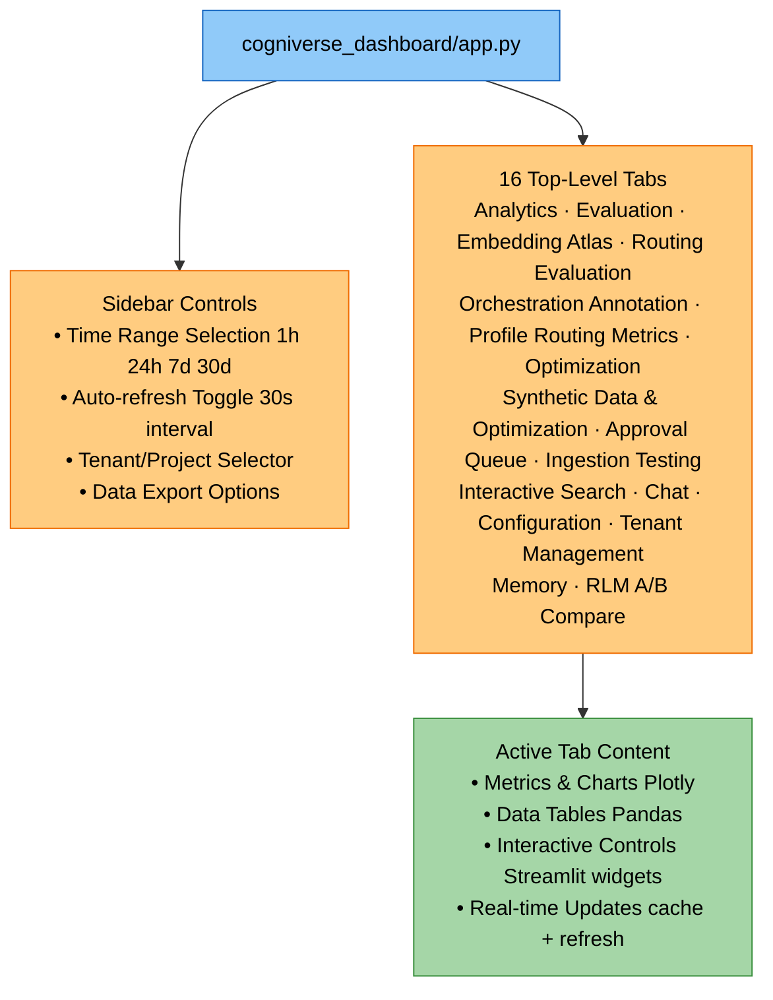
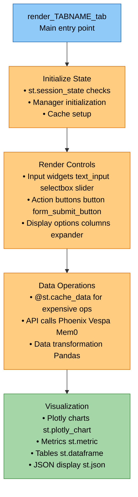
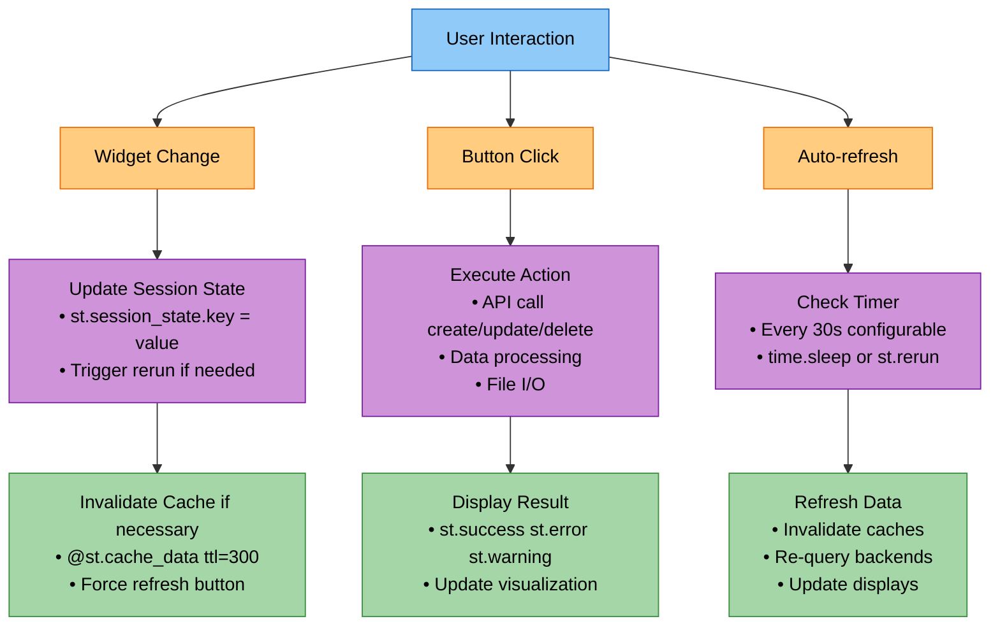

# Cogniverse Study Guide: UI/Dashboard Module

**Module Path:** `libs/dashboard/cogniverse_dashboard/tabs/`
**SDK Packages:** Uses dashboard (application layer) + agents, telemetry-phoenix (implementation layer) + core, evaluation (core layer) + foundation (foundation layer)

---

## Table of Contents
1. [Module Overview](#module-overview)
2. [Dashboard Architecture](#dashboard-architecture)
3. [Core Components](#core-components)
4. [Usage Examples](#usage-examples)
5. [Production Considerations](#production-considerations)
6. [Summary](#summary)

---

## Module Overview

### Purpose
The UI/Dashboard module provides interactive web-based interfaces, organized as 16
top-level Streamlit tabs plus a persistent sidebar, for:

- **Analytics**: Phoenix telemetry visualization and performance monitoring

- **Evaluation**: Phoenix experiment dataset browsing and comparison

- **Embedding Atlas**: UMAP + embedding-atlas visualization of exported embeddings

- **Routing Evaluation**: Routing decision analysis from live telemetry spans

- **Orchestration Annotation**: Multi-agent workflow annotation for DSPy optimization

- **Profile Routing Metrics**: Per-modality runtime observability

- **Optimization Framework**: Comprehensive optimization dashboard with annotation, golden dataset building, synthetic data generation, and module training

- **Approval Queue**: Human-in-the-loop review for AI-generated/synthetic outputs

- **Ingestion Testing / Interactive Search / Chat**: Interactive pipeline and agent-layer testing

- **Configuration Management**: Full CRUD for multi-tenant system configuration, including backend profiles

- **Tenant Management**: Organization/tenant CRUD via the Runtime API

- **Memory Management**: Mem0 conversation memory inspection and management

- **RLM A/B Compare**: RLM-on/RLM-off comparison spans

### Technology Stack
- **Framework**: Streamlit (dashboard package - application layer)
- **Visualization**: Plotly (interactive charts), Pandas (data manipulation)
- **Data Sources**:
  - Phoenix telemetry (telemetry-phoenix package - implementation layer)
  - Vespa embeddings (vespa package - implementation layer)
  - Mem0 memories (core package - core layer)
  - Evaluation metrics (evaluation package - core layer)
- **Configuration**: SystemConfig (core package - core layer)
- **Styling**: Custom CSS with dark theme support

### Dashboard Structure

```text
libs/dashboard/cogniverse_dashboard/
├── app.py                        # Main dashboard entry point (16 top-level tabs, sidebar)
├── search_summary.py             # Streaming "Summarize Results" control for Interactive Search
├── tabs/
│   ├── approval_queue.py         # Human-in-the-loop approval queue
│   ├── backend_profile.py        # Backend profile CRUD + schema deploy (sub-tab of Configuration)
│   ├── config_management.py      # Configuration CRUD UI
│   ├── embedding_atlas.py        # UMAP + embedding-atlas visualization
│   ├── evaluation.py             # Phoenix experiment/dataset evaluation
│   ├── memory_management.py      # Memory inspection UI
│   ├── optimization.py           # Optimization framework (8 sub-tabs)
│   ├── orchestration_annotation.py  # Orchestration workflow annotation UI
│   ├── profile_metrics.py        # Per-modality runtime metrics from ProfileSelectionAgent spans
│   ├── rlm_ab_compare.py         # RLM A/B comparison spans
│   ├── routing_evaluation.py     # Routing decision metrics from RoutingEvaluator
│   └── tenant_management.py      # Organization/tenant CRUD UI
└── utils/
    └── async_utils.py            # run_async_in_streamlit — drives async provider calls from Streamlit
```

---

## Dashboard Architecture

### 1. Main Dashboard Structure


```mermaid
flowchart TB
    Dashboard["<span style='color:#000'>cogniverse_dashboard/app.py</span>"]

    Sidebar["<span style='color:#000'>Sidebar Controls<br/>• Time Range Selection 1h 24h 7d 30d<br/>• Auto-refresh Toggle 30s interval<br/>• Tenant/Project Selector<br/>• Data Export Options</span>"]

    Tabs["<span style='color:#000'>16 Top-Level Tabs<br/>Analytics · Evaluation · Embedding Atlas · Routing Evaluation<br/>Orchestration Annotation · Profile Routing Metrics · Optimization<br/>Synthetic Data & Optimization · Approval Queue · Ingestion Testing<br/>Interactive Search · Chat · Configuration · Tenant Management<br/>Memory · RLM A/B Compare</span>"]

    Content["<span style='color:#000'>Active Tab Content<br/>• Metrics & Charts Plotly<br/>• Data Tables Pandas<br/>• Interactive Controls Streamlit widgets<br/>• Real-time Updates cache + refresh</span>"]

    Dashboard --> Sidebar
    Dashboard --> Tabs
    Tabs --> Content

    style Dashboard fill:#90caf9,stroke:#1565c0,color:#000
    style Sidebar fill:#ffcc80,stroke:#ef6c00,color:#000
    style Tabs fill:#ffcc80,stroke:#ef6c00,color:#000
    style Content fill:#a5d6a7,stroke:#388e3c,color:#000
```

### 2. Tab Architecture Pattern


```mermaid
flowchart TB
    Entry["<span style='color:#000'>render_TABNAME_tab<br/>Main entry point</span>"]

    Init["<span style='color:#000'>Initialize State<br/>• st.session_state checks<br/>• Manager initialization<br/>• Cache setup</span>"]

    Controls["<span style='color:#000'>Render Controls<br/>• Input widgets text_input selectbox slider<br/>• Action buttons button form_submit_button<br/>• Display options columns expander</span>"]

    Data["<span style='color:#000'>Data Operations<br/>• @st.cache_data for expensive ops<br/>• API calls Phoenix Vespa Mem0<br/>• Data transformation Pandas</span>"]

    Viz["<span style='color:#000'>Visualization<br/>• Plotly charts st.plotly_chart<br/>• Metrics st.metric<br/>• Tables st.dataframe<br/>• JSON display st.json</span>"]

    Entry --> Init
    Init --> Controls
    Controls --> Data
    Data --> Viz

    style Entry fill:#90caf9,stroke:#1565c0,color:#000
    style Init fill:#ffcc80,stroke:#ef6c00,color:#000
    style Controls fill:#ffcc80,stroke:#ef6c00,color:#000
    style Data fill:#ffcc80,stroke:#ef6c00,color:#000
    style Viz fill:#a5d6a7,stroke:#388e3c,color:#000
```

### 3. Data Flow Architecture


```mermaid
flowchart TB
    User["<span style='color:#000'>User Interaction</span>"]

    Widget["<span style='color:#000'>Widget Change</span>"]
    Button["<span style='color:#000'>Button Click</span>"]
    Auto["<span style='color:#000'>Auto-refresh</span>"]

    UpdateState["<span style='color:#000'>Update Session State<br/>• st.session_state.key = value<br/>• Trigger rerun if needed</span>"]
    InvalidateCache["<span style='color:#000'>Invalidate Cache if necessary<br/>• @st.cache_data ttl=300<br/>• Force refresh button</span>"]

    Execute["<span style='color:#000'>Execute Action<br/>• API call create/update/delete<br/>• Data processing<br/>• File I/O</span>"]
    Display["<span style='color:#000'>Display Result<br/>• st.success st.error st.warning<br/>• Update visualization</span>"]

    Timer["<span style='color:#000'>Check Timer<br/>• Every 30s configurable<br/>• time.sleep or st.rerun</span>"]
    Refresh["<span style='color:#000'>Refresh Data<br/>• Invalidate caches<br/>• Re-query backends<br/>• Update displays</span>"]

    User --> Widget
    User --> Button
    User --> Auto

    Widget --> UpdateState
    UpdateState --> InvalidateCache

    Button --> Execute
    Execute --> Display

    Auto --> Timer
    Timer --> Refresh

    style User fill:#90caf9,stroke:#1565c0,color:#000
    style Widget fill:#ffcc80,stroke:#ef6c00,color:#000
    style Button fill:#ffcc80,stroke:#ef6c00,color:#000
    style Auto fill:#ffcc80,stroke:#ef6c00,color:#000
    style UpdateState fill:#ce93d8,stroke:#7b1fa2,color:#000
    style Execute fill:#ce93d8,stroke:#7b1fa2,color:#000
    style Timer fill:#ce93d8,stroke:#7b1fa2,color:#000
    style InvalidateCache fill:#a5d6a7,stroke:#388e3c,color:#000
    style Display fill:#a5d6a7,stroke:#388e3c,color:#000
    style Refresh fill:#a5d6a7,stroke:#388e3c,color:#000
```

---

## Core Components

### 1. Config Management Tab

**Purpose**: Full CRUD interface for multi-tenant system configuration

**Location**: `libs/dashboard/cogniverse_dashboard/tabs/config_management.py`

**Features**: seven sub-tabs, each backed by its own `render_*_ui` function:

- System Config — agent URLs, search backend, LLM config, Phoenix/telemetry URLs, environment
- Agent Configs (`render_agent_configs_ui`) — DSPy module types, optimizers, prompts
- Routing Config (`render_routing_config_ui`) — `RoutingConfigUnified` strategies/thresholds/cache
- Telemetry Config (`render_telemetry_config_ui`) — `TelemetryConfig` Phoenix projects, span export
- Backend Profiles — delegates to `render_backend_profile_tab()` from `tabs/backend_profile.py`
- History (`render_config_history_ui`) — versioning, rollback
- Import/Export (`render_import_export_ui`) — JSON format

**Key Functions**:
```python
from cogniverse_dashboard.tabs.backend_profile import render_backend_profile_tab


def render_config_management_tab():
    """Main entry point"""
    if "config_manager" not in st.session_state:
        from cogniverse_foundation.config.utils import create_default_config_manager
        st.session_state.config_manager = create_default_config_manager()
    manager = st.session_state.config_manager

    tenant_id = st.text_input("Tenant ID", value=st.session_state["current_tenant"])

    tab1, tab2, tab3, tab4, tab5, tab6, tab7 = st.tabs([
        "🖥️ System Config",
        "🤖 Agent Configs",
        "🔀 Routing Config",
        "📊 Telemetry Config",
        "🔧 Backend Profiles",
        "📜 History",
        "💾 Import/Export",
    ])

    with tab1:
        render_system_config_ui(manager, tenant_id)
    with tab5:
        render_backend_profile_tab()
    # ... other tabs

def save_system_config_edits(manager, current: SystemConfig, **edits) -> SystemConfig:
    """Apply form edits onto the loaded config via dataclasses.replace, so
    fields the form doesn't expose (inference_service_urls, redis_url,
    minio_endpoint, agents, video_processing_profiles, ...) are preserved
    instead of being reset to dataclass defaults."""
    updated = dataclasses.replace(current, **edits)
    manager.set_system_config(updated)
    return updated

def render_system_config_ui(manager, tenant_id: str):
    """System configuration form"""
    system_config = manager.get_system_config()

    with st.form("system_config_form"):
        video_agent_url = st.text_input(
            "Video Agent URL", value=system_config.video_agent_url
        )
        backend_url = st.text_input("Backend URL", value=system_config.backend_url)
        backend_port = st.number_input("Backend Port", value=system_config.backend_port)
        # ... summarizer_agent_url, search_backend, llm_model, base_url,
        #     llm_api_key, telemetry_url, telemetry_collector_endpoint, environment

        if st.form_submit_button("💾 Save System Configuration"):
            save_system_config_edits(
                manager, system_config,
                video_agent_url=video_agent_url,
                backend_url=backend_url,
                backend_port=backend_port,
                # ... other fields
            )
            st.success("✅ System configuration saved successfully!")
```

**UI Elements**:

- Text inputs for URLs and string values
- Number inputs for ports and numeric settings
- Selectboxes for enum values (backend types, optimizer types)
- JSON text areas for complex config objects
- Form submit buttons for atomic updates

---

### 2. Memory Management Tab

**Purpose**: Inspect and manage Mem0 agent memories

**Location**: `libs/dashboard/cogniverse_dashboard/tabs/memory_management.py`

**Features**:

- Search memories (semantic search)
- Add new memories (with metadata)
- View all memories (paginated)
- Delete specific memories
- Clear all memories (with confirmation)
- Memory statistics (count, health check)

**Key Functions**:
```python
def render_memory_management_tab():
    """Main entry point"""
    # Tenant is fixed to the gate-validated current_tenant; the sidebar Active
    # Tenant selector is the only place tenant can change — no per-tab text input.
    tenant_id = st.session_state["current_tenant"]
    agent_name = st.text_input("Agent Name", value="gateway_agent")

    from cogniverse_core.memory.manager import Mem0MemoryManager
    from cogniverse_core.schemas.filesystem_loader import FilesystemSchemaLoader
    from cogniverse_foundation.config.utils import create_default_config_manager
    from pathlib import Path

    config_manager = create_default_config_manager()
    system_config = config_manager.get_system_config()

    # Gate on Vespa reachability before touching Mem0 at all
    if not vespa_available(f"{system_config.backend_url}:{system_config.backend_port}/ApplicationStatus"):
        st.warning("⚠️ Vespa backend is not running")
        return

    manager = Mem0MemoryManager(tenant_id=tenant_id)
    if manager.memory is None:
        # Params are read from SystemConfig + configs/config.json, not hardcoded
        schema_loader = FilesystemSchemaLoader(Path("configs/schemas"))
        denseon_url = system_config.inference_service_urls["denseon"]
        manager.initialize(
            backend_host=system_config.backend_url,
            backend_port=system_config.backend_port,
            llm_model=bare_model_name(llm_primary["model"]),
            embedding_model="lightonai/DenseOn",
            llm_base_url=llm_primary.get("api_base") or system_config.base_url,
            embedder_base_url=denseon_url,
            config_manager=config_manager,
            schema_loader=schema_loader,
        )

    if st.button("📈 Refresh Stats"):
        stats = manager.get_memory_stats(tenant_id=tenant_id, agent_name=agent_name)
        st.metric("Total Memories", stats.get("total_memories", 0))

    # Operation tabs
    tabs = st.tabs([
        "🔍 Search Memories",
        "📝 Add Memory",
        "📋 View All",
        "🗑️ Delete Memory",
        "⚠️ Clear All"
    ])

    with tabs[0]:  # Search
        search_query = st.text_area("Search Query")
        limit = st.slider("Number of Results", 1, 20, 5)
        if st.button("🔍 Search"):
            results = manager.search_memory(
                query=search_query,
                tenant_id=tenant_id,
                agent_name=agent_name,
                top_k=limit,
            )
            for i, result in enumerate(results, 1):
                with st.expander(f"Memory {i} - Score: {result.get('score', 0):.3f}"):
                    st.write("**Memory:**", result.get("memory", ""))
                    st.json(result.get("metadata", {}))
```

**UI Elements**:

- Text areas for search queries and memory content
- Sliders for result limits
- Expanders for individual memory display
- JSON viewers for metadata
- Confirmation dialogs for destructive operations

---

### 3. Routing Evaluation Tab

**Purpose**: Surface routing-decision quality metrics computed by `RoutingEvaluator` from live `cogniverse.routing` telemetry spans — not a CSV-driven offline evaluator.

**Location**: `libs/dashboard/cogniverse_dashboard/tabs/routing_evaluation.py`

**Features**:

- Summary metrics: routing accuracy, confidence calibration, average routing latency, total/ambiguous decisions
- Per-agent precision/recall/F1 table + bar chart
- Confidence distribution analysis
- Temporal analysis of routing decisions over the lookback window
- Human annotation section (delegates to `AnnotationAgent` / `LLMAutoAnnotator` / `RoutingAnnotationStorage`)

**Key Functions**:
```python
from cogniverse_evaluation.evaluators.routing_evaluator import RoutingEvaluator
from cogniverse_foundation.telemetry.config import SERVICE_NAME_ORCHESTRATION
from cogniverse_foundation.telemetry.manager import get_telemetry_manager


def render_routing_evaluation_tab():
    """Main entry point"""
    st.subheader("🎯 Routing Evaluation Dashboard")

    tenant_id = st.session_state["current_tenant"]
    lookback_hours = st.number_input("Lookback Period (hours)", 1, 168, 24)
    project_name = f"cogniverse-{tenant_id}-{SERVICE_NAME_ORCHESTRATION}"

    telemetry_manager = get_telemetry_manager()
    provider = telemetry_manager.get_provider(tenant_id=tenant_id)
    evaluator = RoutingEvaluator(provider=provider, project_name=project_name)

    # cached — Streamlit re-executes the tab on every widget interaction
    @st.cache_data(ttl=30, show_spinner="Fetching routing spans from telemetry...")
    def _fetch_routing_spans(_ev, project, start_iso, end_iso):
        return run_async_in_streamlit(
            _ev.query_routing_spans(
                start_time=datetime.fromisoformat(start_iso),
                end_time=datetime.fromisoformat(end_iso),
                limit=1000,
            )
        )

    routing_spans = _fetch_routing_spans(evaluator, project_name, start_iso, end_iso)
    metrics = evaluator.calculate_metrics(routing_spans)  # RoutingMetrics dataclass

    st.metric("Routing Accuracy", f"{metrics.routing_accuracy:.1%}")
    st.metric("Confidence Calibration", f"{metrics.confidence_calibration:.3f}")
    st.metric("Avg Routing Latency", f"{metrics.avg_routing_latency:.0f}ms")
    st.metric("Total Decisions", metrics.total_decisions,
               delta=f"{metrics.ambiguous_count} ambiguous")
    # per_agent_precision / per_agent_recall / per_agent_f1 dicts render as a
    # table + grouped bar chart in _render_per_agent_metrics()
```

`RoutingMetrics` (`libs/evaluation/cogniverse_evaluation/evaluators/routing_evaluator.py`) fields: `routing_accuracy`, `confidence_calibration`, `avg_routing_latency`, `per_agent_precision`, `per_agent_recall`, `per_agent_f1`, `total_decisions`, `ambiguous_count`.

**UI Elements**:

- Lookback-hours number input, tenant text (from sidebar session state)
- Metric cards for the four summary metrics
- Per-agent precision/recall/F1 table with a Plotly grouped bar chart
- Confidence and temporal analysis charts
- Annotation section for marking ambiguous/incorrect routing decisions

---

### 4. Optimization Framework Tab

**Purpose**: Comprehensive optimization framework for improving system performance

**Location**: `libs/dashboard/cogniverse_dashboard/tabs/optimization.py`

**Features**:
`render_enhanced_optimization_tab()` provides 8 sub-tabs covering the complete optimization lifecycle:

#### 4.1 Overview Tab (`_render_overview_tab`)

Quick dashboard showing:

- **Total Annotations**, **Golden Dataset Size**, **Optimization Runs**, **Last Optimization** — all read from `st.session_state` counters (`annotation_count`, `golden_dataset_size`, `optimization_requests`), so they reset per browser session rather than being queried live from a persistent store

- **Workflow Diagram**: markdown description of the Collect → Build → Train → Monitor → Iterate cycle

- **Recent History**: table of the last 10 entries in `st.session_state["optimization_requests"]`

#### 4.2 Search Annotations Tab (`_render_search_annotation_tab`)

Collect user feedback on search results:

**Annotation Types**:
1. **Thumbs Up/Down**: Binary feedback (relevant/not relevant)
2. **Star Rating (1-5)**: Granular quality scoring
3. **Relevance Score (0-1)**: Precise relevance measurement

**Workflow**:
```python
# 1. Fetch search spans via the telemetry provider abstraction
tenant_id = st.session_state["current_tenant"]
lookback_hours = 24

telemetry_manager = get_telemetry_manager()
provider = telemetry_manager.get_provider(tenant_id=tenant_id)

end_time = datetime.now(timezone.utc)
start_time = end_time - timedelta(hours=lookback_hours)

async def fetch_spans():
    return await provider.traces.get_spans(
        project=f"cogniverse-{tenant_id}",
        start_time=start_time,
        end_time=end_time,
    )

spans_df = run_async_in_streamlit(fetch_spans())
search_spans = _filter_search_spans(spans_df)  # keeps only search-operation spans

# 2. Display results with annotation interface (paginated, 10 per page)
for idx in range(start_idx, end_idx):
    span = spans.iloc[idx]
    st.text(span.get("attributes.query", "N/A"))
    if annotation_type == "Thumbs Up/Down":
        thumbs_up = st.form_submit_button("👍 Good")
        thumbs_down = st.form_submit_button("👎 Bad")

# 3. Save annotation via the telemetry provider
await provider.annotations.add_annotation(
    span_id=span_id,
    name="search_quality_annotation",
    label=label,          # positive/negative/neutral, derived from rating
    score=float(rating),
    metadata=annotation_data,
    project=f"cogniverse-{tenant_id}",
)
```

**Storage**: Annotations are written through `provider.annotations.add_annotation` with metadata:

- `label`: positive/negative/neutral (rating ≥0.6 / ≤0.4 / between)

- `score`: 0-1 rating

- `explanation`: User notes

- `annotation_type`: thumbs/stars/relevance

- `annotator`: human/llm

- `timestamp`: When annotated

#### 4.3 Golden Dataset Builder Tab (`_render_golden_dataset_tab`)

Build ground truth datasets from high-quality annotations:

**Configuration**:

- **Min Rating Threshold**: Only include annotations above this score (default 0.8)
- **Lookback Days**: How far back to query annotations (default 30)
- **Tenant ID**: Which tenant's data to use

**Process** (`_build_golden_dataset_from_phoenix`, async):
```python
async def _build_golden_dataset_from_phoenix(tenant_id, min_rating, lookback_days):
    telemetry_manager = get_telemetry_manager()
    provider = telemetry_manager.get_provider(tenant_id=tenant_id)

    end_time = datetime.now(timezone.utc)
    start_time = end_time - timedelta(days=lookback_days)
    spans_df = await provider.traces.get_spans(
        project=f"cogniverse-{tenant_id}", start_time=start_time, end_time=end_time
    )
    search_spans = _filter_search_spans(spans_df)

    golden_dataset = {}
    for _, span in search_spans.iterrows():
        annotation_score = span.get("attributes.annotation.score")
        if annotation_score is None or pd.isna(annotation_score):
            continue  # unannotated spans are skipped, not NaN'd into the dataset
        if float(annotation_score) < min_rating:
            continue

        query = span.get("attributes.query", "")
        results = span.get("attributes.results", [])
        if not query or not results:
            continue

        expected_videos = [r.get("id", r.get("video_id")) for r in results[:5]]
        golden_dataset[query] = {
            "expected_videos": expected_videos,
            "relevance_scores": {v: 1.0 / (i + 1) for i, v in enumerate(expected_videos)},
            "avg_relevance": float(annotation_score),
            "profile": span.get("attributes.profile", "unknown"),
        }
    return golden_dataset
```

**Export**: JSON format compatible with `GoldenDatasetEvaluator` (`libs/evaluation/cogniverse_evaluation/evaluators/golden_dataset.py`)

#### 4.4 Synthetic Data Generation Tab (`_render_synthetic_data_tab`)

Generate training data for all optimizers by sampling from Vespa backend:

**Supported Optimizers**:
1. **Profile Optimizer**: ProfileSelectionAgent (per-query backend profile, modality, complexity, intent)
2. **Routing Optimizer**: Entity-based advanced routing
3. **Workflow Optimizer**: Multi-agent workflow orchestration
4. **Unified Optimizer**: Combined routing and workflow planning

**Configuration**:

- **Optimizer Type**: Which optimizer to generate data for
- **Examples to Generate**: Number of training examples (10-10,000)
- **Vespa Sample Size**: Documents to sample from backend (10-10,000)
- **Sampling Strategies**: diverse, temporal_recent, entity_rich, multi_modal_sequences
- **Max Profiles**: Maximum number of backend profiles to use (1-10)
- **Tenant ID**: Tenant-specific data isolation

**Generation Process**:
```python
# 1. Call synthetic data API — api_base comes from session state
# (st.session_state["runtime_url"], set by the app shell), not hardcoded
api_base = st.session_state.get("runtime_url", st.session_state.get("api_base_url", ""))
request_payload = {
    "optimizer": "profile",
    "count": 100,
    "vespa_sample_size": 200,
    "strategies": ["diverse"],
    "max_profiles": 3,
    "tenant_id": "default"
}

response = requests.post(
    f"{api_base}/synthetic/generate",
    json=request_payload,
    timeout=300
)

# 2. Receive generated data
result = response.json()
# {
#   "optimizer": "profile",
#   "schema_name": "ProfileSelectionExampleSchema",
#   "count": 100,
#   "selected_profiles": ["video_colpali_smol500_mv_frame", ...],
#   "profile_selection_reasoning": "Selected frame-based and chunk-based...",
#   "data": [...generated examples...],
#   "metadata": {"generation_time_ms": 1250}
# }

# 3. Export for offline use
json.dump(result, open("synthetic_data.json", "w"))

# 4. Use in optimization tabs
# Navigate to corresponding optimizer tab and load the data
```

**Profile Selection**:

- **LLM-based**: Uses reasoning to match profile characteristics to optimizer needs
- **Rule-based**: Heuristic scoring with diversity selection (fallback)

**Output Schemas**:

- `ProfileSelectionExampleSchema`: Query, profile, modality, complexity, intent
- `RoutingExperienceSchema`: Query, entities, relationships, agent
- `WorkflowExecutionSchema`: Multi-step workflow patterns

**Integration with Optimizers**:

- `profile` → Profile Selection Optimization
- `routing` → Routing Optimization Tab
- `workflow` → DSPy Optimization Tab
- `unified` → Multiple tabs (Routing + DSPy)

**Export**: JSON format compatible with all optimizer training interfaces

#### 4.5 Module Optimization Tab (`_render_routing_optimization_tab`)

Submits Argo Workflows to optimize routing/workflow modules:

**What Gets Optimized (Modules)** — `st.selectbox("Module to Optimize", ["routing", "workflow", "unified"])`:

- `routing` - Entity-based advanced routing
- `workflow` - Multi-agent workflow orchestration
- `unified` - Combined routing + workflow planning

**How Optimization Actually Runs**:

- The batch CLI (`libs/runtime/cogniverse_runtime/optimization_cli.py::_create_teleprompter`) selects DSPy's `BootstrapFewShot` and scales its parameters by training-set size: `< 50` examples uses 4 bootstrapped/8 labeled demos over 1 round; `>= 50` examples uses 8 bootstrapped/16 labeled demos over 2 rounds. There is no runtime GEPA/SIMBA/MIPRO auto-switch based on example count.
- `OptimizerType` (`libs/foundation/cogniverse_foundation/config/agent_config.py`) enumerates the optimizer choices available for a module's `ModuleConfig` — `bootstrap_few_shot`, `labeled_few_shot`, `bootstrap_few_shot_with_random_search`, `copro`, `mipro_v2`, `gepa`, `simba` — but which one a module uses is a configured `AgentConfig` setting, not something the dashboard chooses automatically per run.

**Features**:

- ✅ **Batch Optimization**: Submit Argo Workflows for long-running optimizations
- ✅ **Synthetic Data**: Auto-generate training data from backend storage using DSPy modules
- ✅ **Automatic Execution**: CronWorkflows check Phoenix traces and optimize when criteria met
- ✅ **Manual Execution**: Submit workflows on-demand from UI

**Configuration**:

- **Tenant ID**: Target tenant for optimization
- **Module to Optimize**: `routing` / `workflow` / `unified`
- **Max Iterations**: Maximum DSPy training iterations (10-500)
- **Use Synthetic Data**: Generate training data from backend storage when insufficient Phoenix traces
- **Advanced**: Synthetic examples count, backend sample size, max profiles

**Workflow Submission**:
```bash
# Dashboard generates and submits YAML like:
apiVersion: argoproj.io/v1alpha1
kind: Workflow
metadata:
  generateName: routing-opt-routing-
  namespace: cogniverse
spec:
  workflowTemplateRef:
    name: batch-optimization
  arguments:
    parameters:
    - name: tenant-id
      value: "default"
    - name: optimizer-category
      value: "routing"
    - name: optimizer-type
      value: "routing"
    - name: max-iterations
      value: "100"
    - name: use-synthetic-data
      value: "true"
```

**Monitor Progress**:
```bash
argo list -n cogniverse
argo get <workflow-name> -n cogniverse
argo logs <workflow-name> -n cogniverse --follow
```

**Execution Flow**:
1. Module optimizer collects Phoenix traces
2. Generates synthetic data if traces insufficient
3. Compiles the module with `BootstrapFewShot`, scaled by training-set size
4. Trains module's internal DSPy model
5. Evaluates performance and saves optimized module
6. Returns metrics (baseline score, optimized score, improvement %)

#### 4.6 Reranking Optimization Tab (`_render_reranking_optimization_tab`)

**Status**: not yet implemented. The tab documents the intended pipeline and shows a
"Min Annotations Required" / "Current Annotations" gate, but clicking **Train Reranker**
surfaces an explicit warning instead of training anything:

```python
def _render_reranking_optimization_tab():
    st.markdown("""
    ### How It Works:
    1. **Collect Feedback**: User annotations (thumbs up/down) on search results
    2. **Learn Preferences**: Train reranker to prioritize positively-rated results
    3. **Optimize Weights**: Adjust BM25 vs semantic weights based on feedback
    4. **A/B Test**: Compare optimized reranker against baseline
    """)
    min_annotations = st.number_input("Min Annotations Required", 10, 1000, 50)
    can_train = current_annotations >= min_annotations

    if st.button("🔧 Train Reranker", disabled=not can_train):
        # Reranker training from annotation feedback is not implemented yet —
        # the UI surfaces that honestly rather than reporting a fabricated
        # success with invented NDCG/MRR deltas.
        st.warning(
            "Reranker training from feedback is not implemented yet. "
            f"{current_annotations} annotations are available; the "
            "training pipeline will be wired in a future release."
        )
```

The intended (not-yet-built) pipeline: query annotated spans → extract `(query, results,
ratings)` → train a LambdaMART/RankNet reranker → optimize BM25-vs-semantic fusion
weights → A/B test against the baseline, tracked via NDCG@10/MRR/P@K/Recall@K.

#### 4.7 Profile Selection Optimization Tab (`_render_profile_selection_tab`)

Aggregates real profile-usage statistics from Phoenix search spans for the selected
tenant — it does **not** train a classifier. Current implementation:

```python
async def fetch_spans():
    return await provider.traces.get_spans(start_time=start_time, end_time=end_time)

spans_df = run_async_in_streamlit(fetch_spans())
search_spans = spans_df[spans_df["name"].str.contains("search", case=False, na=False)]

# Profile info is read directly from any column containing "profile"
profile_cols = [c for c in search_spans.columns if "profile" in c.lower()]
# ... usage counts per profile are displayed as metrics/tables
```

A query-type/profile NDCG@10 performance matrix and an automatic profile-recommendation
classifier (Random Forest / XGBoost) are aspirational — not present in
`libs/dashboard/cogniverse_dashboard/tabs/optimization.py` today.

#### 4.8 Metrics Dashboard Tab (`_render_metrics_dashboard_tab`)

Queries the same telemetry provider abstraction used elsewhere in this framework and
runs `RoutingEvaluator.calculate_metrics()` over the selected lookback window (7/30/90
days) to render routing accuracy and related metrics — the numbers shown are live,
not hardcoded. Example illustrative output for a healthy tenant:

- Routing Accuracy, Search quality, latency and annotation-velocity metrics rendered
  as `st.metric` cards plus time-series Plotly charts over the selected window
- A "🔄 Refresh Metrics" button clears `st.cache_data` and reruns the query

---

### 5. Evaluation Tab

**Purpose**: Browse Phoenix experiment datasets and compare experiment runs against them.

**Location**: `libs/dashboard/cogniverse_dashboard/tabs/evaluation.py` (`render_evaluation_tab`)

**Key Functions**: `get_phoenix_datasets()` and `get_experiment_runs()` query Phoenix's
GraphQL API directly (`query_phoenix_graphql`, POST to `{phoenix_url}/graphql`), not
through the telemetry-provider abstraction used elsewhere in the dashboard. Renders a
dataset selector, per-dataset metrics (`calculate_metrics`), and deep links to Phoenix's
own dataset/comparison views (`{phoenix_url}/datasets/{id}` and `.../compare`).

### 6. Embedding Atlas Tab

**Purpose**: UMAP projection + Apple's `embedding-atlas` component for visualizing exported embeddings.

**Location**: `libs/dashboard/cogniverse_dashboard/tabs/embedding_atlas.py` (`render_embedding_atlas_tab`)

**Behavior**:
- Lazy-imports `umap` and `embedding_atlas.streamlit`; shows an install hint (`uv pip install umap-learn embedding-atlas`) if missing rather than failing the whole dashboard image.
- Reads parquet files from `outputs/embeddings/` (written by `scripts/export_backend_embeddings.py`); falls back to a file selector, or a session-stashed path from another tab (e.g. `embedding_atlas_file`).
- Computes UMAP `x`/`y` columns on the fly if the parquet lacks them (cached on `(path, mtime)`).
- If the data has an `is_query` column, marks query rows distinctly and renders a "Top-3 similar documents per query" panel below the atlas.

### 7. Orchestration Annotation Tab

**Purpose**: Human annotation of multi-agent orchestration workflow quality — the human-in-the-loop side of the optimization feedback path.

**Location**: `libs/dashboard/cogniverse_dashboard/tabs/orchestration_annotation.py` (`render_orchestration_annotation_tab`)

**Key Functions**:
```python
from cogniverse_agents.routing.orchestration_annotation_storage import (
    OrchestrationAnnotation,
    OrchestrationAnnotationStorage,
)

storage = OrchestrationAnnotationStorage(tenant_id=tenant_id)

telemetry_manager = get_telemetry_manager()
provider = telemetry_manager.get_provider(tenant_id=tenant_id)

async def fetch_spans():
    return await provider.traces.get_spans(
        project=f"cogniverse-{tenant_id}", start_time=start_time, end_time=end_time
    )

spans_df = run_async_in_streamlit(fetch_spans())
```
Configurable lookback (1-24h) and max workflows shown (5-50); annotations become
DSPy optimization ground truth via `OrchestrationAnnotationStorage`.

### 8. Profile Routing Metrics Tab

**Purpose**: Per-modality runtime observability sourced from `cogniverse.profile_selection` spans — replaces a deleted Multi-Modal Performance tab whose backing tracker was never populated.

**Location**: `libs/dashboard/cogniverse_dashboard/tabs/profile_metrics.py` (`render_profile_metrics_tab`)

**Key Functions**:
```python
from cogniverse_foundation.telemetry.config import SPAN_NAME_PROFILE_SELECTION

spans_df = provider.traces.get_spans(
    project=project_name, start_time=start, end_time=end,
    filters={"name": SPAN_NAME_PROFILE_SELECTION},
)
# groups by attributes.profile_selection.modality; computes count, p50/p95/p99
# latency, and success_rate per modality
```
Renders per-modality metric cards, a detailed stats table, a query-distribution pie
chart, and a P95-latency-by-modality bar chart.

### 9. Approval Queue Tab

**Purpose**: Human-in-the-loop review for synthetic data generation and other AI outputs before they're used in optimization.

**Location**: `libs/dashboard/cogniverse_dashboard/tabs/approval_queue.py` (`render_approval_queue_tab`)

**Key Functions**: initializes a `HumanApprovalAgent` (`cogniverse_agents.approval`)
backed by `ApprovalStorageImpl`, scoped by the tenant's `SystemConfig.telemetry_url` /
`telemetry_collector_endpoint`. Renders four sub-tabs: "📋 Pending Review",
"✅ Approved Items", "❌ Rejected Items", "📊 Statistics". `SyntheticDataConfidenceExtractor`
and `SyntheticDataFeedbackHandler` (`cogniverse_synthetic.approval`) score generated
synthetic examples so low-confidence ones route here for manual review.

### 10. Ingestion Testing Tab

**Purpose**: Interactively upload a test video and run it through the ingestion pipeline with one or more processing profiles.

**Location**: inline in `cogniverse_dashboard/app.py` (`main_tabs[9]`, not a separate `tabs/` module)

**Key Functions**:
```python
uploaded_video = st.file_uploader("Upload test video for ingestion", type=["mp4", "mov", "avi"])
selected_profiles = st.multiselect("Select profiles to test", [
    "video_colpali_smol500_mv_frame",
    "video_colqwen_omni_mv_chunk_30s",
    "video_videoprism_base_mv_chunk_30s",
    "video_videoprism_large_mv_chunk_30s",
    "video_videoprism_lvt_base_sv_chunk_6s",
    "video_videoprism_lvt_large_sv_chunk_6s",
], default=["video_colpali_smol500_mv_frame"])

# Per profile: builds a processing_task dict (action, video_path, profile, config)
# and calls the video-processing agent via call_agent_async(...)
result = run_async_in_streamlit(call_agent_async(agent_url, processing_task))
```

**Available Profiles** (verified against `configs/schemas/*.json` embedding dims):
1. `video_colpali_smol500_mv_frame` (320-dim, frame-based)
2. `video_colqwen_omni_mv_chunk_30s` (320-dim, 30s chunks)
3. `video_videoprism_base_mv_chunk_30s` (768-dim, 30s chunks)
4. `video_videoprism_large_mv_chunk_30s` (1024-dim, 30s chunks)
5. `video_videoprism_lvt_base_sv_chunk_6s` (768-dim, 6s chunks)
6. `video_videoprism_lvt_large_sv_chunk_6s` (1024-dim, 6s chunks)

### 11. Interactive Search Tab

**Purpose**: Live multi-turn search testing across processing profiles and ranking strategies.

**Location**: inline in `cogniverse_dashboard/app.py` (`main_tabs[10]`)

**Key Functions**: streams results through the A2A protocol via
`display_streaming_result(agent_name="search_agent", query=..., tenant_id=..., metadata={"top_k": ..., "modality": "video"})`.
The profile selectbox here only offers 4 of the 6 ingestion profiles
(`video_colpali_smol500_mv_frame`, `video_colqwen_omni_mv_chunk_30s`,
`video_videoprism_base_mv_chunk_30s`, `video_videoprism_lvt_base_sv_chunk_6s` — the
two `large` variants are omitted). Ranking-strategy multiselect offers
`binary_binary` / `float_float` / `binary_float` / `float_binary`. Maintains a
`session_id` and `conversation_history` in `st.session_state` for multi-turn context;
a "🔄 New Session" button resets both.

### 12. Chat Tab

**Purpose**: Conversational interface routed through the agent layer.

**Location**: inline in `cogniverse_dashboard/app.py` (`main_tabs[11]`)

**Key Functions**: maintains `st.session_state.chat_messages` (list of
`{"role", "content"}`), rendered via `st.chat_message`. Sending a message appends the
user turn and calls the routing layer; "Clear History" resets `chat_messages`.

### 13. Tenant Management Tab

**Purpose**: CRUD for organizations and tenants via the Runtime API.

**Location**: `libs/dashboard/cogniverse_dashboard/tabs/tenant_management.py` (`render_tenant_management_tab`)

**Key Functions**: four sub-tabs — "Organizations", "Create Organization", "Tenants",
"Create Tenant" — all going through `_api_call(method, path, json=...)` against the
Runtime API:
```python
# Create Organization
result = _api_call("post", "/admin/organizations", json={
    "org_id": org_id, "org_name": org_name, "created_by": created_by,
})

# Delete Organization (with a confirmation checkbox gate)
result = _api_call("delete", f"/admin/organizations/{org_id}")
```
Organization/tenant listing is fetched via `_fetch_organizations()` /
`_fetch_tenants(org_id)`, both calling the Runtime's `/admin/organizations` and
`/admin/tenants` endpoints.

### 14. RLM A/B Compare Tab

**Purpose**: Renders `rlm.ab_compare` spans emitted by `cogniverse-optim --mode ab-compare`, pairing RLM-on/RLM-off arms by a shared `ab_id`.

**Location**: `libs/dashboard/cogniverse_dashboard/tabs/rlm_ab_compare.py` (`render_rlm_ab_compare_tab`)

**Key Functions**: `load_ab_compare_data(phoenix_http_endpoint, tenant_id, lookback_hours)`
is a pure async function (independently integration-testable against a real Phoenix
instance) that queries and aggregates into an `ABCompareAggregate` dataclass
(`rows`, `avg_latency_delta_ms`, `avg_tokens_delta`, `avg_judge_delta`,
`fallback_rate`, `per_row`, `per_dataset`). The tenant defaults to the sidebar's
`current_tenant`; Phoenix URL and lookback hours are separate inputs.

### 15. Sidebar Controls

**Purpose**: Tenant scoping, time-range/filter controls for the Analytics tab, refresh settings, and live agent connectivity status — shared across every tab.

**Location**: `cogniverse_dashboard/app.py`, `with st.sidebar:` block plus `show_agent_status()`

**Key Functions**:
```python
# Active tenant gate — no "default" fallback; tabs are gated until a
# registered tenant is entered (must already exist via POST /admin/tenants)
active_tenant = st.text_input("Active Tenant", placeholder="org:tenant")
st.session_state["current_tenant"] = active_tenant

# Time range: preset buckets or a custom UTC-aware date/time range
time_range = st.selectbox("Select time range", [
    "Last 15 minutes", "Last hour", "Last 6 hours",
    "Last 24 hours", "Last 7 days", "Custom range",
])

# Filters (Analytics tab): operation-name regex, profile multiselect, strategy multiselect
operation_filter = st.text_input("Operation name (regex)")
profile_filter = st.multiselect("Profiles", ["direct_video", "frame_based", "hierarchical", "all"])
strategy_filter = st.multiselect("Ranking strategies", ["rrf", "weighted", "max_score", "all"])

# Refresh + Advanced Options: auto-refresh toggle/interval, raw-data toggle,
# Root Cause Analysis toggle, export format selector

# Agent connectivity, checked via the unified runtime's per-agent health route
def check_agent_connectivity():
    resp = httpx.get(f"{runtime_url}/agents/{agent_name}/health", timeout=5.0)
```
Organization/tenant **creation** happens in the Tenant Management tab (§13), and video
ingestion happens in the Ingestion Testing tab (§10) — the sidebar itself only scopes
and filters, it does not create tenants or start ingestion jobs.

---

## Usage Examples

### Example 1: Starting the Dashboard

```bash
# Start Phoenix dashboard
uv run streamlit run libs/dashboard/cogniverse_dashboard/app.py \
  --server.port 8501

# Output:
# You can now view your Streamlit app in your browser.
#
#   Local URL: http://localhost:8501
#   Network URL: http://192.168.1.100:8501
#
# Access in browser: http://localhost:8501
```

### Example 2: Managing Configuration

```python
# In Config Management Tab:

# 1. Select tenant
Tenant ID: [production]
Backend: VespaConfigStore
Status: ✓ Healthy

# 2. Navigate to System Config tab
# 3. Update agent URLs and backend settings:
Video Agent URL: [http://localhost:8002]
Summarizer Agent URL: [http://localhost:8004]
Backend URL: [http://localhost]
Backend Port: [8080]

# 4. Click "💾 Save"
# Output: ✅ Configuration saved successfully!

# 5. View history (History tab):
Version: 2
Updated: 2025-10-07 14:30:00
Changes:
  - video_agent_url: http://localhost:8002 (added)
  - backend_url: http://localhost (updated)

[Rollback to Version 1] [Export Version]
```

### Example 3: Searching Memories

```python
# In Memory Management Tab (tenant comes from the sidebar Active Tenant field):

Tenant: production
Agent Name: [gateway_agent]

# Navigate to "🔍 Search Memories" tab
Search Query: [user prefers video results for cooking queries]
Number of Results: [5]

[🔍 Search]

# Output:
Found 3 memories

Memory 1 - Score: 0.892
**Memory:** User frequently queries for cooking tutorials
**ID:** mem_abc123
**Metadata:**
{
  "agent_id": "orchestrator_agent",
  "created_at": "2025-10-07 10:15:00",
  "context": "preference_learning"
}

Memory 2 - Score: 0.856
**Memory:** Routing decision: query="how to cook pasta" → modality=video
**ID:** mem_def456
**Metadata:**
{
  "agent_id": "orchestrator_agent",
  "query": "how to cook pasta",
  "modality": "video"
}
```

### Example 4: Evaluating Routing

```python
# In Routing Evaluation Tab (reads live cogniverse.routing spans, no CSV upload):

Tenant: production
Lookback Period (hours): [24]
# 📊 Querying spans from project: cogniverse-production-orchestration

# Summary Metrics:
Routing Accuracy: 86.0%
Confidence Calibration: 0.742
Avg Routing Latency: 118ms
Total Decisions: 50   (3 ambiguous)

# Per-Agent Performance (table + grouped bar chart):
Agent            Precision  Recall  F1 Score
search_agent         94.1%   96.0%     95.0%
summarizer_agent     88.2%   83.3%     85.7%
detailed_report_agent 80.0%  75.0%     77.4%

# Confidence and temporal analysis charts render below the per-agent table.
# The annotation section (st.divider() onward) lets a reviewer mark
# ambiguous or incorrect routing decisions for later DSPy optimization.
```

---

## Production Considerations

### 1. Performance Optimization

**Caching Strategy**:
```python
# Cache expensive data fetches
@st.cache_data(ttl=300)  # 5 minute TTL
def get_phoenix_metrics(start_time, end_time):
    """Fetch metrics from Phoenix"""
    # Import from evaluation package (implementation layer)
    from cogniverse_telemetry_phoenix.evaluation.analytics import PhoenixAnalytics
    analytics = PhoenixAnalytics()
    # Expensive API call - get traces for the specified time range
    return analytics.get_traces(start_time=start_time, end_time=end_time)

# Cache resource initialization
@st.cache_resource
def get_vespa_client():
    """Singleton Vespa client"""
    # Import from vespa package (implementation layer)
    from cogniverse_vespa.search_backend import VespaSearchBackend
    from cogniverse_core.schemas.filesystem_loader import FilesystemSchemaLoader
    from cogniverse_foundation.config.utils import create_default_config_manager
    from pathlib import Path
    config_manager = create_default_config_manager()
    schema_loader = FilesystemSchemaLoader(Path("configs/schemas"))
    return VespaSearchBackend(
        config={"url": "http://localhost", "port": 8080, "profiles": {}},
        config_manager=config_manager,
        schema_loader=schema_loader,
    )

# Manual cache invalidation
if st.button("🔄 Force Refresh"):
    st.cache_data.clear()  # Clear all caches
    st.rerun()
```

**Pagination**:
```python
# Paginate large result sets
page_size = 20
total_results = len(all_memories)
num_pages = (total_results + page_size - 1) // page_size

page = st.slider("Page", 1, num_pages, 1)
start_idx = (page - 1) * page_size
end_idx = start_idx + page_size

displayed_memories = all_memories[start_idx:end_idx]
st.dataframe(displayed_memories)
```

**Lazy Loading**:
```python
# Load embeddings on demand
if "embeddings" not in st.session_state:
    if st.button("📥 Load Embeddings"):
        st.session_state.embeddings = load_embeddings(video_id)
        st.success("✅ Loaded!")

if "embeddings" in st.session_state:
    # Display visualization
    plot_embeddings(st.session_state.embeddings)
```

### 2. Error Handling

**Graceful Degradation**:
```python
try:
    # Attempt Phoenix connection
    # Import from evaluation package (implementation layer)
    from cogniverse_telemetry_phoenix.evaluation.analytics import PhoenixAnalytics
    from datetime import datetime, timedelta
    analytics = PhoenixAnalytics()
    # Get traces for the last 24 hours
    end_time = datetime.now()
    start_time = end_time - timedelta(hours=24)
    metrics = analytics.get_traces(start_time=start_time, end_time=end_time)
    plot_metrics(metrics)
except ConnectionError:
    st.warning("⚠️ Phoenix unavailable. Showing cached data.")
    if "cached_metrics" in st.session_state:
        plot_metrics(st.session_state.cached_metrics)
    else:
        st.error("No cached data available")
except Exception as e:
    st.error(f"❌ Unexpected error: {e}")
    st.exception(e)  # Show full traceback in expander
```

**Input Validation**:
```python
# Validate user inputs
tenant_id = st.text_input("Tenant ID")
if tenant_id:
    import re
    if not re.match(r'^[a-zA-Z0-9_:]+$', tenant_id):
        st.error("❌ Tenant ID must contain only alphanumeric characters, underscores, or colons")
    elif len(tenant_id) > 64:
        st.error("❌ Tenant ID too long (max 64 chars)")
    else:
        # Proceed with valid tenant_id
        process_tenant(tenant_id)
```

### 3. Security Considerations

**Authentication** (if enabled):
```python
# Simple authentication check
def check_authentication():
    """Verify user is authenticated"""
    if "authenticated" not in st.session_state:
        st.session_state.authenticated = False

    if not st.session_state.authenticated:
        password = st.text_input("Password", type="password")
        if st.button("Login"):
            if verify_password(password):
                st.session_state.authenticated = True
                st.rerun()
            else:
                st.error("❌ Invalid password")
        st.stop()  # Halt execution if not authenticated

# Call at start of each tab
check_authentication()
```

**Sensitive Data Masking**:
```python
# Mask sensitive config values
def mask_sensitive(config_dict):
    """Mask passwords and API keys"""
    masked = config_dict.copy()
    for key in ["password", "api_key", "secret"]:
        if key in masked:
            masked[key] = "***" + masked[key][-4:]
    return masked

# Display masked config
from dataclasses import asdict
st.json(mask_sensitive(asdict(system_config)))
```

### 4. Monitoring and Logging

**Usage Tracking**:
```python
import logging

logger = logging.getLogger(__name__)

def log_user_action(action, tenant_id, **kwargs):
    """Log user actions for audit"""
    logger.info(
        f"User action: {action}",
        extra={
            "tenant_id": tenant_id,
            "timestamp": datetime.now(),
            "details": kwargs
        }
    )

# Log config changes
if st.button("💾 Save"):
    save_config(updated_config)
    log_user_action("config_update", tenant_id, config_type="system")
    st.success("✅ Saved!")
```

**Health Checks**:
```python
# Periodic backend health checks
def check_backend_health():
    """Check all backend services"""
    health_status = {
        "vespa": False,
        "phoenix": False,
        "mem0": False
    }

    try:
        vespa_client.health_check()
        health_status["vespa"] = True
    except:
        pass

    # ... check other services

    return health_status

# Display in sidebar
with st.sidebar:
    st.subheader("System Health")
    health = check_backend_health()
    for service, is_healthy in health.items():
        icon = "✅" if is_healthy else "❌"
        st.write(f"{icon} {service.upper()}")
```

### 5. Best Practices

**Session State Management** (generic pattern — this dashboard specifically gates on
an explicit, already-registered tenant rather than defaulting to `"default"`; see
§15 Sidebar Controls):
```python
# Initialize session state at start
if "initialized" not in st.session_state:
    st.session_state.initialized = True
    st.session_state.last_refresh = datetime.now()
    st.session_state.cached_data = {}
```

**Responsive Design**:
```python
# Use columns for responsive layout
col1, col2, col3 = st.columns([2, 1, 1])
with col1:
    st.metric("Total Queries", 1234)
with col2:
    st.metric("Success Rate", "94.2%")
with col3:
    st.metric("Avg Latency", "125ms")
```

**User Feedback**:
```python
# Provide clear feedback for all actions
with st.spinner("Processing..."):
    result = expensive_operation()

if result.success:
    st.success("✅ Operation completed successfully!")
else:
    st.error(f"❌ Operation failed: {result.error}")

# Progress bars for long operations
progress = st.progress(0)
for i, item in enumerate(items):
    process_item(item)
    progress.progress((i + 1) / len(items))
progress.empty()  # Remove progress bar when done
```

---

## Summary

The UI/Dashboard module provides comprehensive web-based interfaces leveraging the layered architecture:

**Layer Integration:**

- **Foundation Layer**: Telemetry foundations from `cogniverse-foundation`

- **Core Layer**:
  - Business logic and configuration from `cogniverse-core`
  - Evaluation metrics from `cogniverse-evaluation`
- **Implementation Layer**:
  - Phoenix telemetry implementation from `cogniverse-telemetry-phoenix`
  - Agent operations from `cogniverse-agents`
  - Vespa backend access from `cogniverse-vespa`
- **Application Layer**: UI components from `cogniverse-dashboard`

**Dashboard Capabilities** (16 top-level tabs — see Core Components §1-§15 for the
sub-tabs that live inside Configuration and Optimization):

1. **Analytics**: Phoenix telemetry visualization with performance metrics (evaluation + telemetry-phoenix)
2. **Evaluation**: Phoenix experiment/dataset browsing via GraphQL (telemetry-phoenix)
3. **Embedding Atlas**: UMAP + embedding-atlas visualization of exported embeddings
4. **Routing Evaluation**: `RoutingEvaluator` metrics from live routing spans (evaluation)
5. **Orchestration Annotation**: Multi-agent workflow annotation UI (agents)
6. **Profile Routing Metrics**: Per-modality runtime metrics from ProfileSelectionAgent spans
7. **Optimization** + **Synthetic Data & Optimization**: Comprehensive optimization framework, 8 sub-tabs (agents + evaluation + synthetic)
8. **Approval Queue**: Human-in-the-loop review for synthetic/AI outputs (agents + synthetic)
9. **Ingestion Testing**: Interactive video upload + multi-profile ingestion testing
10. **Interactive Search**: Live multi-turn search across profiles/ranking strategies
11. **Chat**: Conversational interface routed through the agent layer
12. **Configuration**: Full CRUD for multi-tenant system configuration, including Backend Profiles (core)
13. **Tenant Management**: Organization/tenant CRUD via the Runtime API
14. **Memory**: Mem0 agent memory inspection and management (core)
15. **RLM A/B Compare**: `rlm.ab_compare` span comparison for RLM-on/RLM-off arms

**Key Features**:

- Interactive Streamlit dashboards with real-time updates
- Multi-tenant support with tenant isolation
- Plotly visualizations for metrics and embeddings
- Layer-aware caching for performance optimization
- Form-based CRUD operations with validation
- Export/import capabilities for data portability

**Production Features**:

- Health checks for all backend services across all layers
- Error handling with graceful degradation per layer
- Authentication and authorization (optional)
- Usage tracking and audit logging
- Responsive design for various screen sizes
- Auto-refresh with configurable intervals

**Package Dependencies (Layer-Aware):**
```python
# Foundation layer
from cogniverse_foundation.telemetry.manager import get_telemetry_manager
from cogniverse_foundation.telemetry.config import (
    SPAN_NAME_PROFILE_SELECTION, SERVICE_NAME_ORCHESTRATION, TelemetryConfig,
)
from cogniverse_foundation.config.utils import create_default_config_manager, get_config
from cogniverse_foundation.config.unified_config import SystemConfig, RoutingConfigUnified

# Core layer
from cogniverse_core.memory.manager import Mem0MemoryManager
from cogniverse_core.schemas.filesystem_loader import FilesystemSchemaLoader

# Evaluation layer
from cogniverse_evaluation.evaluators.routing_evaluator import RoutingEvaluator
from cogniverse_evaluation.evaluators.golden_dataset import GoldenDatasetEvaluator

# Implementation layer
from cogniverse_telemetry_phoenix.provider import PhoenixProvider
from cogniverse_telemetry_phoenix.evaluation.analytics import PhoenixAnalytics
from cogniverse_agents.gateway_agent import GatewayAgent
from cogniverse_agents.approval import HumanApprovalAgent, ApprovalStorageImpl
from cogniverse_agents.routing.orchestration_annotation_storage import OrchestrationAnnotationStorage
from cogniverse_synthetic.approval import SyntheticDataConfidenceExtractor
from cogniverse_vespa.search_backend import VespaSearchBackend

# Application layer
from cogniverse_dashboard.tabs.config_management import render_config_management_tab
from cogniverse_dashboard.tabs.optimization import render_enhanced_optimization_tab
from cogniverse_dashboard.tabs.tenant_management import render_tenant_management_tab
from cogniverse_dashboard.tabs.rlm_ab_compare import render_rlm_ab_compare_tab
from cogniverse_dashboard.utils.async_utils import run_async_in_streamlit
```

This module serves as the primary user interface for system monitoring, configuration management, and data exploration in the Cogniverse platform, demonstrating clean separation of concerns across the layered architecture.

---

**Next Study Guides:**

- **[integration.md](../architecture/integration.md)**: End-to-end system integration tests

- **[instrumentation.md](instrumentation.md)**: Phoenix telemetry and observability
