# Cogniverse Study Guide: UI/Dashboard Module

**Last Updated:** 2025-10-21
**Module Path:** `scripts/*_tab.py`
**Purpose:** Interactive Streamlit dashboards for system monitoring, configuration management, optimization, and visualization

---

## Table of Contents
1. [Module Overview](#module-overview)
2. [Dashboard Architecture](#dashboard-architecture)
3. [Core Components](#core-components)
4. [Tab Implementations](#tab-implementations)
5. [Usage Examples](#usage-examples)
6. [Production Considerations](#production-considerations)

---

## Module Overview

### Purpose
The UI/Dashboard module provides interactive web-based interfaces for:
- **Analytics**: Phoenix telemetry visualization and performance monitoring
- **Optimization Framework**: Comprehensive optimization dashboard with annotation, golden dataset building, and model training
- **Configuration Management**: Full CRUD for multi-tenant system configuration
- **Memory Management**: Mem0 conversation memory inspection and management
- **Embedding Visualization**: 2D/3D embedding atlas with clustering
- **Routing Evaluation**: Routing decision analysis with golden datasets
- **Orchestration Annotation**: Multi-agent workflow visualization
- **Quick Setup**: Fast tenant creation and video ingestion from sidebar

### Technology Stack
- **Framework**: Streamlit 1.30+
- **Visualization**: Plotly (interactive charts), Pandas (data manipulation)
- **Data**: Phoenix (telemetry), Vespa (embeddings), Mem0 (memories)
- **Styling**: Custom CSS with dark theme support

### Dashboard Structure

```
scripts/
├── phoenix_dashboard_standalone.py  # Main dashboard entry point
├── enhanced_optimization_tab.py     # Optimization framework (NEW)
├── config_management_tab.py         # Configuration CRUD UI
├── memory_management_tab.py         # Memory inspection UI
├── embedding_atlas_tab.py           # Embedding visualization
├── routing_evaluation_tab.py        # Routing analysis UI
└── orchestration_annotation_tab.py  # Multi-agent workflow UI
```

---

## Dashboard Architecture

### 1. Main Dashboard Structure

```mermaid
graph TB
    Dashboard[phoenix_dashboard_standalone.py]

    Sidebar[Sidebar Controls<br/>• Time Range Selection 1h 24h 7d 30d<br/>• Auto-refresh Toggle 30s interval<br/>• Tenant/Project Selector<br/>• Data Export Options]

    Tabs[Tab Navigation<br/>Analytics | Evaluation | Config | Memory | Atlas | Routing]

    Content[Active Tab Content<br/>• Metrics & Charts Plotly<br/>• Data Tables Pandas<br/>• Interactive Controls Streamlit widgets<br/>• Real-time Updates cache + refresh]

    Dashboard --> Sidebar
    Dashboard --> Tabs
    Tabs --> Content

    style Dashboard fill:#e1f5ff
    style Sidebar fill:#fff4e1
    style Tabs fill:#fff4e1
    style Content fill:#e1ffe1
```

### 2. Tab Architecture Pattern

```mermaid
graph TB
    Entry[render_TABNAME_tab<br/>Main entry point]

    Init[Initialize State<br/>• st.session_state checks<br/>• Manager initialization<br/>• Cache setup]

    Controls[Render Controls<br/>• Input widgets text_input selectbox slider<br/>• Action buttons button form_submit_button<br/>• Display options columns expander]

    Data[Data Operations<br/>• @st.cache_data for expensive ops<br/>• API calls Phoenix Vespa Mem0<br/>• Data transformation Pandas]

    Viz[Visualization<br/>• Plotly charts st.plotly_chart<br/>• Metrics st.metric<br/>• Tables st.dataframe<br/>• JSON display st.json]

    Entry --> Init
    Init --> Controls
    Controls --> Data
    Data --> Viz

    style Entry fill:#e1f5ff
    style Init fill:#fff4e1
    style Controls fill:#fff4e1
    style Data fill:#fff4e1
    style Viz fill:#e1ffe1
```



### 3. Data Flow Architecture

```mermaid
graph TB
    User[User Interaction]

    Widget[Widget Change]
    Button[Button Click]
    Auto[Auto-refresh]

    UpdateState[Update Session State<br/>• st.session_state.key = value<br/>• Trigger rerun if needed]
    InvalidateCache[Invalidate Cache if necessary<br/>• @st.cache_data ttl=300<br/>• Force refresh button]

    Execute[Execute Action<br/>• API call create/update/delete<br/>• Data processing<br/>• File I/O]
    Display[Display Result<br/>• st.success st.error st.warning<br/>• Update visualization]

    Timer[Check Timer<br/>• Every 30s configurable<br/>• time.sleep or st.experimental_rerun]
    Refresh[Refresh Data<br/>• Invalidate caches<br/>• Re-query backends<br/>• Update displays]

    User --> Widget
    User --> Button
    User --> Auto

    Widget --> UpdateState
    UpdateState --> InvalidateCache

    Button --> Execute
    Execute --> Display

    Auto --> Timer
    Timer --> Refresh

    style User fill:#e1f5ff
    style Widget fill:#fff4e1
    style Button fill:#fff4e1
    style Auto fill:#fff4e1
    style UpdateState fill:#fff4e1
    style Execute fill:#fff4e1
    style Timer fill:#fff4e1
    style InvalidateCache fill:#e1ffe1
    style Display fill:#e1ffe1
    style Refresh fill:#e1ffe1
```



---

## Core Components

### 1. Config Management Tab

**Purpose**: Full CRUD interface for multi-tenant system configuration

**Location**: `scripts/config_management_tab.py`

**Features**:
- System config (agent URLs, search backend, Vespa settings)
- Agent configs (DSPy modules, optimizers, prompts)
- Routing config (strategies, thresholds, cache settings)
- Telemetry config (Phoenix projects, span export settings)
- Config history (versioning, rollback)
- Import/Export (JSON format)

**Key Functions**:
```python
def render_config_management_tab():
    """Main entry point"""
    # Initialize ConfigManager
    manager = get_config_manager()

    # Tenant selector
    tenant_id = st.text_input("Tenant ID", value="default")

    # Sub-tabs
    tabs = st.tabs([
        "🖥️ System Config",
        "🤖 Agent Configs",
        "🔀 Routing Config",
        "📊 Telemetry Config",
        "📜 History",
        "💾 Import/Export"
    ])

    with tabs[0]:
        render_system_config_ui(manager, tenant_id)
    # ... other tabs

def render_system_config_ui(manager, tenant_id):
    """System configuration form"""
    system_config = manager.get_system_config(tenant_id)

    with st.form("system_config_form"):
        # Agent service URLs
        routing_agent_url = st.text_input(
            "Routing Agent URL",
            value=system_config.routing_agent_url
        )
        # ... other fields

        submitted = st.form_submit_button("💾 Save")
        if submitted:
            # Update config
            updated_config = SystemConfig(
                tenant_id=tenant_id,
                routing_agent_url=routing_agent_url,
                # ... other fields
            )
            manager.save_system_config(updated_config)
            st.success("✅ Configuration saved!")
```

**UI Elements**:
- Text inputs for URLs and string values
- Number inputs for ports and numeric settings
- Selectboxes for enum values (backend types, optimizer types)
- JSON text areas for complex config objects
- Form submit buttons for atomic updates

---

### 2. Memory Management Tab

**Purpose**: Inspect and manage Mem0 agent memories

**Location**: `scripts/memory_management_tab.py`

**Features**:
- Search memories (semantic search)
- Add new memories (with metadata)
- View all memories (paginated)
- Delete specific memories
- Clear all memories (with confirmation)
- Memory statistics (count, health check)

**Key Functions**:
```python
def render_memory_management_tab():
    """Main entry point"""
    # Initialize Mem0MemoryManager
    manager = Mem0MemoryManager()
    manager.initialize()

    # Tenant and agent selection
    tenant_id = st.text_input("Tenant ID", value="default")
    agent_name = st.text_input("Agent Name", value="routing_agent")

    # Memory stats
    if st.button("📈 Refresh Stats"):
        stats = manager.get_memory_stats(
            user_id=tenant_id,
            agent_id=agent_name
        )
        st.metric("Total Memories", stats.get("total_memories", 0))

    # Operation tabs
    tabs = st.tabs([
        "🔍 Search Memories",
        "📝 Add Memory",
        "📋 View All",
        "🗑️ Delete Memory",
        "⚠️ Clear All"
    ])

    with tabs[0]:  # Search
        search_query = st.text_area("Search Query")
        if st.button("🔍 Search"):
            results = manager.search_memory(
                query=search_query,
                user_id=tenant_id,
                agent_id=agent_name,
                limit=5
            )
            for i, result in enumerate(results, 1):
                with st.expander(f"Memory {i} - Score: {result['score']:.3f}"):
                    st.write("**Memory:**", result["memory"])
                    st.json(result.get("metadata", {}))
```

**UI Elements**:
- Text areas for search queries and memory content
- Sliders for result limits
- Expanders for individual memory display
- JSON viewers for metadata
- Confirmation dialogs for destructive operations

---

### 3. Embedding Atlas Tab

**Purpose**: Visualize high-dimensional embeddings in 2D/3D space

**Location**: `scripts/embedding_atlas_tab.py`

**Features**:
- Export embeddings from Vespa
- Dimensionality reduction (UMAP, t-SNE, PCA)
- 2D/3D scatter plots with Plotly
- Clustering analysis (K-means, DBSCAN)
- Similarity search visualization
- Metadata overlay (titles, timestamps, strategies)

**Key Functions**:
```python
@st.cache_data(ttl=300)
def get_available_videos():
    """Query Vespa for available videos"""
    backend = SearchBackend(url=vespa_url, port=vespa_port)

    # Query for video metadata
    yql = """
    select video_id, video_title, timestamp, frame_number
    from video_frame where true limit 1000
    """
    response = backend.app.query(yql=yql)

    # Process response to extract unique videos
    videos = {}
    for hit in response.hits:
        vid = hit["fields"]["video_id"]
        if vid not in videos:
            videos[vid] = {
                "frame_count": 1,
                "duration": hit["fields"]["timestamp"],
                "title": hit["fields"]["video_title"]
            }
    return videos

def render_embedding_atlas_tab():
    """Main entry point"""
    # Get available videos
    videos = get_available_videos()

    # Video/strategy selection
    selected_video = st.selectbox("Select Video", list(videos.keys()))

    # Export embeddings
    if st.button("📥 Export Embeddings"):
        # Run export script
        subprocess.run([
            "python", "scripts/export_vespa_embeddings.py",
            "--video_id", selected_video,
            "--output", "embeddings.npz"
        ])
        st.success("✅ Embeddings exported!")

    # Load and visualize
    if os.path.exists("embeddings.npz"):
        data = np.load("embeddings.npz")
        embeddings = data["embeddings"]
        metadata = data["metadata"]

        # Dimensionality reduction
        from sklearn.manifold import TSNE
        reduced = TSNE(n_components=2).fit_transform(embeddings)

        # Plot with Plotly
        fig = px.scatter(
            x=reduced[:, 0],
            y=reduced[:, 1],
            hover_data=metadata,
            title="Embedding Atlas Visualization"
        )
        st.plotly_chart(fig, use_container_width=True)
```

**UI Elements**:
- Selectboxes for video/strategy selection
- Radio buttons for dimensionality reduction method
- Sliders for clustering parameters
- Plotly scatter plots (interactive)
- Download buttons for exports

---

### 4. Routing Evaluation Tab

**Purpose**: Analyze routing decisions and compare against golden datasets

**Location**: `scripts/routing_evaluation_tab.py`

**Features**:
- Load golden datasets
- Compare routing decisions
- Confusion matrix visualization
- Per-query analysis
- Accuracy metrics by modality
- Strategy comparison

**Key Functions**:
```python
def render_routing_evaluation_tab():
    """Main entry point"""
    st.header("🔀 Routing Evaluation")

    # Load golden dataset
    dataset_path = st.text_input(
        "Golden Dataset Path",
        value="data/testset/evaluation/video_search_queries.csv"
    )

    if os.path.exists(dataset_path):
        df = pd.read_csv(dataset_path)
        st.success(f"✅ Loaded {len(df)} queries")

        # Run evaluation
        if st.button("▶️ Run Evaluation"):
            results = []
            for _, row in df.iterrows():
                # Route query
                routing_result = route_query(row["query"])

                # Compare with ground truth
                results.append({
                    "query": row["query"],
                    "predicted": routing_result["modality"],
                    "actual": row["expected_modality"],
                    "correct": routing_result["modality"] == row["expected_modality"]
                })

            # Display results
            results_df = pd.DataFrame(results)
            accuracy = results_df["correct"].mean()

            col1, col2, col3 = st.columns(3)
            with col1:
                st.metric("Total Queries", len(results_df))
            with col2:
                st.metric("Accuracy", f"{accuracy:.1%}")
            with col3:
                st.metric("Errors", sum(~results_df["correct"]))

            # Confusion matrix
            from sklearn.metrics import confusion_matrix
            cm = confusion_matrix(
                results_df["actual"],
                results_df["predicted"]
            )
            fig = px.imshow(
                cm,
                labels=dict(x="Predicted", y="Actual"),
                title="Routing Confusion Matrix"
            )
            st.plotly_chart(fig)
```

**UI Elements**:
- File pickers for dataset selection
- Run buttons for evaluation
- Metric displays (accuracy, error rate)
- Confusion matrix heatmaps
- Per-query result tables with filters

---

### 5. Optimization Framework Tab (NEW)

**Purpose**: Comprehensive optimization framework for improving system performance

**Location**: `scripts/enhanced_optimization_tab.py`

**Features**:
The Optimization tab provides 9 sub-tabs covering the complete optimization lifecycle:

#### 5.1 Overview Tab

Quick dashboard showing:
- **Total Annotations**: Count of user feedback collected
- **Golden Dataset Size**: Number of queries with ground truth
- **Optimization Runs**: Historical optimization job count
- **Last Optimization**: Time since last training run
- **Workflow Diagram**: Visual representation of optimization process
- **Recent History**: Table of last 10 optimization jobs

#### 5.2 Search Annotations Tab

Collect user feedback on search results:

**Annotation Types**:
1. **Thumbs Up/Down**: Binary feedback (relevant/not relevant)
2. **Star Rating (1-5)**: Granular quality scoring
3. **Relevance Score (0-1)**: Precise relevance measurement

**Workflow**:
```python
# 1. Fetch search results from Phoenix
tenant_id = "acme:production"
lookback_hours = 24

# Queries Phoenix for search spans
search_spans = phoenix_client.get_spans_dataframe(
    project_name=f"cogniverse-{tenant_id}-search",
    start_time=datetime.now() - timedelta(hours=24)
)

# 2. Display results with annotation interface
for span in search_spans:
    # Show query + results
    st.write(f"Query: {span.query}")
    st.write(f"Results: {span.results}")

    # Annotation form
    if annotation_type == "Thumbs Up/Down":
        thumbs_up = st.button("👍")
        thumbs_down = st.button("👎")

    # 3. Save annotation to Phoenix
    if thumbs_up:
        save_annotation(span_id, rating=1.0, type="thumbs")
```

**Storage**: Annotations stored in Phoenix as `SpanEvaluations` with:
- `label`: positive/negative/neutral
- `score`: 0-1 rating
- `explanation`: User notes
- `annotation_type`: thumbs/stars/relevance
- `annotator`: human/llm
- `timestamp`: When annotated

#### 5.3 Golden Dataset Builder Tab

Build ground truth datasets from high-quality annotations:

**Configuration**:
- **Min Rating Threshold**: Only include annotations above this score (default 0.8)
- **Lookback Days**: How far back to query annotations (default 30)
- **Tenant ID**: Which tenant's data to use

**Process**:
```python
def build_golden_dataset_from_phoenix(tenant_id, min_rating, lookback_days):
    # 1. Query annotated search spans
    spans = phoenix_client.get_spans_dataframe(
        project_name=f"cogniverse-{tenant_id}-search",
        start_time=datetime.now() - timedelta(days=lookback_days)
    )

    # 2. Filter for high-quality annotations
    high_quality = spans[
        (spans["attributes.annotation.score"] >= min_rating) &
        (spans["attributes.annotation.human_reviewed"] == True)
    ]

    # 3. Extract query + expected results
    golden_dataset = {}
    for _, span in high_quality.iterrows():
        query = span["attributes.query"]
        results = span["attributes.results"][:5]  # Top 5

        golden_dataset[query] = {
            "expected_videos": [r["id"] for r in results],
            "relevance_scores": {r["id"]: 1.0 / (i + 1) for i, r in enumerate(results)},
            "avg_relevance": span["attributes.annotation.score"],
            "profile": span["attributes.profile"]
        }

    return golden_dataset
```

**Export**: JSON format compatible with `GoldenDatasetEvaluator`

#### 5.4 Synthetic Data Generation Tab (NEW)

Generate training data for all optimizers by sampling from Vespa backend:

**Supported Optimizers**:
1. **Modality Optimizer**: Per-modality routing (VIDEO, DOCUMENT, IMAGE, AUDIO)
2. **Cross-Modal Optimizer**: Multi-modal fusion decisions
3. **Routing Optimizer**: Entity-based advanced routing
4. **Workflow Optimizer**: Multi-agent workflow orchestration
5. **Unified Optimizer**: Combined routing and workflow planning

**Configuration**:
- **Optimizer Type**: Which optimizer to generate data for
- **Examples to Generate**: Number of training examples (10-10,000)
- **Vespa Sample Size**: Documents to sample from backend (10-10,000)
- **Sampling Strategies**: diverse, temporal_recent, entity_rich, multi_modal_sequences, by_modality, cross_modal_pairs
- **Max Profiles**: Maximum number of backend profiles to use (1-10)
- **Tenant ID**: Tenant-specific data isolation

**Generation Process**:
```python
# 1. Call synthetic data API
api_base = "http://localhost:8000"
request_payload = {
    "optimizer": "cross_modal",
    "count": 100,
    "vespa_sample_size": 200,
    "strategies": ["diverse"],
    "max_profiles": 3,
    "tenant_id": "default"
}

response = requests.post(
    f"{api_base}/synthetic/generate",
    json=request_payload,
    timeout=300
)

# 2. Receive generated data
result = response.json()
# {
#   "optimizer": "cross_modal",
#   "schema_name": "FusionHistorySchema",
#   "count": 100,
#   "selected_profiles": ["video_colpali_smol500_mv_frame", ...],
#   "profile_selection_reasoning": "Selected frame-based and chunk-based...",
#   "data": [...generated examples...],
#   "metadata": {"generation_time_ms": 1250}
# }

# 3. Export for offline use
json.dump(result, open("synthetic_data.json", "w"))

# 4. Use in optimization tabs
# Navigate to corresponding optimizer tab and load the data
```

**Profile Selection**:
- **LLM-based**: Uses reasoning to match profile characteristics to optimizer needs
- **Rule-based**: Heuristic scoring with diversity selection (fallback)

**Output Schemas**:
- `ModalityExampleSchema`: Query, modality, agent mapping
- `FusionHistorySchema`: Fusion context, improvement metrics
- `RoutingExperienceSchema`: Query, entities, relationships, agent
- `WorkflowExecutionSchema`: Multi-step workflow patterns

**Integration with Optimizers**:
- `modality` → Routing Optimization Tab
- `cross_modal` → Reranking Optimization Tab
- `routing` → Routing Optimization Tab
- `workflow` → DSPy Optimization Tab
- `unified` → Multiple tabs (Routing + DSPy)

**Export**: JSON format compatible with all optimizer training interfaces

#### 5.5 Module Optimization Tab

Optimize routing/workflow modules with automatic DSPy optimizer selection:

**What Gets Optimized (Modules)**:
- `modality` - Per-modality routing (VIDEO/DOCUMENT/IMAGE/AUDIO)
- `cross_modal` - Multi-modal fusion decisions
- `routing` - Entity-based advanced routing
- `workflow` - Multi-agent workflow orchestration
- `unified` - Combined routing + workflow planning

**How They Get Optimized (Auto DSPy Optimizer Selection)**:
- System automatically chooses GEPA/Bootstrap/SIMBA/MIPRO based on training data size
- < 100 examples → Bootstrap
- 100-500 examples → SIMBA
- 500-1000 examples → MIPRO
- \> 1000 examples → GEPA

**Features**:
- ✅ **Batch Optimization**: Submit Argo Workflows for long-running optimizations
- ✅ **Synthetic Data**: Auto-generate training data from Vespa backend
- ✅ **Automatic Execution**: CronWorkflows check Phoenix traces and optimize when criteria met
- ✅ **Manual Execution**: Submit workflows on-demand from UI

**Configuration**:
- **Tenant ID**: Target tenant for optimization
- **Module to Optimize**: Which module to optimize (modality/cross_modal/routing/workflow/unified)
- **Max Iterations**: Maximum DSPy training iterations (10-500)
- **Use Synthetic Data**: Generate training data from Vespa backend when insufficient Phoenix traces
- **Advanced**: Synthetic examples count, Vespa sample size, max profiles

**Workflow Submission**:
```bash
# Dashboard generates and submits YAML like:
apiVersion: argoproj.io/v1alpha1
kind: Workflow
metadata:
  generateName: routing-opt-modality-
  namespace: cogniverse
spec:
  workflowTemplateRef:
    name: batch-optimization
  arguments:
    parameters:
    - name: tenant-id
      value: "default"
    - name: optimizer-category
      value: "routing"
    - name: optimizer-type
      value: "modality"
    - name: max-iterations
      value: "100"
    - name: use-synthetic-data
      value: "true"
```

**Monitor Progress**:
```bash
argo list -n cogniverse
argo get <workflow-name> -n cogniverse
argo logs <workflow-name> -n cogniverse --follow
```

**Execution Flow**:
1. Module optimizer collects Phoenix traces
2. Generates synthetic data if traces insufficient
3. Auto-selects DSPy optimizer (Bootstrap/SIMBA/MIPRO/GEPA) based on data size
4. Trains module's internal DSPy model
5. Evaluates performance and saves optimized module
6. Returns metrics (baseline score, optimized score, improvement %)

#### 5.6 DSPy Module Optimization Tab

DSPy module optimization with teacher-student distillation and batch processing:

**Methodology: Teacher-Student Distillation**

Use expensive models (GPT-4/Claude) to train cheap local models (SmolLM/Qwen):

**Configuration**:
- **Teacher Model**: GPT-4, Claude-3 Opus, Claude-3 Sonnet
- **Student Model**: Llama3.2 (1B/3B), Qwen2.5 (0.5B/3B), SmolLM (1.7B)
- **Target Module**: Routing Classifier, Query Rewriter, Result Summarizer, Relevance Scorer
- **Training Examples**: 10-1000
- **Iterations**: 1-10
- **Eval Split**: 0.1-0.5

**Benefits**:
- Use expensive models (GPT-4) to generate training data, then train cheap models (SmolLM)
- Run locally without API costs after initial training data generation
- Faster inference (40-60% latency reduction)
- Maintain 85-95% of teacher accuracy

**Process**:
```python
# 1. Generate training data with teacher model
teacher_examples = teacher_model.generate_examples(
    module=target_module,
    num_examples=num_examples
)

# 2. Train student model
student_model = train_student_with_bootstrap(
    examples=teacher_examples,
    student=student_model,
    num_iterations=num_iterations
)

# 3. Evaluate on validation set
metrics = evaluate_student(
    model=student_model,
    eval_set=validation_split
)

# 4. Compare performance
st.metric("Initial Accuracy", "72%")
st.metric("Final Accuracy", "89%", delta="+17%")
st.metric("Latency Reduction", "-40%")
```

**Execution: Batch Optimization with Argo Workflows**

For long-running optimizations, submit Argo Workflows:

**Features**:
- ✅ **Batch Processing**: Run DSPy optimization as Kubernetes workflows
- ✅ **Multiple Optimizers**: GEPA, Bootstrap, SIMBA, MIPRO
- ✅ **Golden Datasets**: Use evaluation datasets from data/testset/evaluation/
- 🔜 **Synthetic Data**: Coming soon for DSPy module optimizers

**Configuration**:
- **Tenant ID**: Target tenant for optimization
- **DSPy Optimizer**: GEPA/Bootstrap/SIMBA/MIPRO (auto-selected based on dataset size)
- **Dataset Name**: Golden evaluation dataset (e.g., golden_eval_v1)
- **Backend Profiles**: Comma-separated list of profiles to use
- **Max Iterations**: Optimization iterations (10-500)
- **Learning Rate**: Learning rate for optimization (0.0001-0.1)

**Workflow Submission**:
```bash
# Dashboard generates and submits YAML like:
apiVersion: argoproj.io/v1alpha1
kind: Workflow
metadata:
  generateName: dspy-opt-gepa-
  namespace: cogniverse
spec:
  workflowTemplateRef:
    name: batch-optimization
  arguments:
    parameters:
    - name: tenant-id
      value: "default"
    - name: optimizer-category
      value: "dspy"
    - name: optimizer-type
      value: "GEPA"
    - name: dataset-name
      value: "golden_eval_v1"
    - name: profiles
      value: "video_colpali_smol500_mv_frame"
    - name: max-iterations
      value: "100"
    - name: learning-rate
      value: "0.001"
    - name: use-synthetic-data
      value: "false"
```

**Workflow Pipeline**:
1. Validates configuration and dataset existence
2. Prepares evaluation dataset
3. Runs DSPy optimization with selected algorithm
4. Evaluates results and deploys if improvement > 5%
5. Sends completion notification

**Monitor Progress**:
```bash
argo list -n cogniverse
argo get <workflow-name> -n cogniverse
argo logs <workflow-name> -n cogniverse --follow
```

**Algorithm Selection** (auto-selected based on data size):
- **Bootstrap**: < 100 examples
- **SIMBA**: 100-500 examples
- **MIPRO**: 500-1000 examples
- **GEPA**: > 1000 examples

#### 5.7 Reranking Optimization Tab

Learn optimal ranking from user feedback:

**Training Data**: Annotation feedback from Search Annotations tab

**Optimization**:
```python
# 1. Query annotated spans for training data
training_data = []
for span in annotated_spans:
    training_data.append({
        "query": span.query,
        "results": span.results,
        "ratings": span.annotations  # User ratings
    })

# 2. Train LambdaMART/RankNet reranker
reranker = train_reranker(
    training_data=training_data,
    algorithm="lambdamart"
)

# 3. Optimize BM25 vs semantic weights
optimal_weights = optimize_fusion_weights(
    reranker=reranker,
    validation_set=val_data
)

# 4. A/B test new reranker
st.metric("NDCG@10", "0.72 → 0.84", delta="+0.12")
st.metric("MRR", "0.65 → 0.78", delta="+0.13")
```

**Metrics**: NDCG@10, MRR, P@K, Recall@K

#### 5.8 Profile Selection Optimization Tab

Learn which processing profile works best for query types:

**Performance Matrix**:
Heatmap showing profile performance by query type:
- Rows: 6 video processing profiles (ColPali, ColQwen, VideoPrism variants)
- Columns: Query types (Temporal, Object, Activity, Scene, Abstract)
- Values: NDCG@10 scores

**Training**:
```python
# 1. Extract (query_features, profile, ndcg) tuples
training_data = extract_profile_performance_data(
    search_spans=all_search_spans
)

# 2. Train Random Forest / XGBoost classifier
profile_selector = train_classifier(
    features=["query_type", "video_length", "complexity"],
    target="optimal_profile",
    data=training_data
)

# 3. Use for inference
for new_query in queries:
    features = extract_query_features(new_query)
    recommended_profile = profile_selector.predict(features)
```

**Query Features**:
- Temporal words (when, duration, timestamp)
- Object words (person, car, building)
- Activity words (running, cooking, talking)
- Scene descriptors (outdoor, kitchen, office)
- Abstract concepts (emotion, atmosphere, style)

#### 5.9 Metrics Dashboard Tab

Unified view of optimization improvements:

**Overall Metrics**:
- Routing Accuracy: 77% → 89% (+12%)
- Search NDCG@10: 0.69 → 0.84 (+0.15)
- Avg Latency: 323ms → 245ms (-78ms)
- User Satisfaction: 3.6/5 → 4.2/5 (+0.6)

**Per-Optimization-Type Breakdown**:
| Type | Runs | Avg Improvement | Last Run |
|------|------|----------------|----------|
| Routing | 12 | +12% | 2h ago |
| Reranking | 8 | +15% | 1d ago |
| DSPy Modules | 5 | +17% | 3d ago |
| Profile Selection | 3 | +10% | 5d ago |

**Time Series Charts**:
- Routing accuracy over time
- Search NDCG@10 over time
- Latency trends
- Annotation velocity

---

### 6. Quick Setup Sidebar Widget (NEW)

**Purpose**: Streamlined tenant creation and video ingestion

**Location**: `phoenix_dashboard_standalone.py` sidebar (lines 205-364)

**Features**:

#### Tenant Creation
```python
# Create org:tenant format
tenant_input = "acme:production"

# Calls tenant manager API
POST /admin/organizations {"org_id": "acme", ...}
POST /admin/tenants {"tenant_id": "acme:production", ...}

# Displays current tenant
st.info("📌 Current tenant: acme:production")
```

#### Fast Ingestion
```python
# Video URL input
video_url = "https://example.com/video.mp4"

# Profile selection
profile = "video_colpali_smol500_mv_frame"

# Start ingestion
POST /ingestion/start {
    "video_url": video_url,
    "profile": profile,
    "tenant_id": current_tenant
}

# Track job status
job_id = response["job_id"]
st.session_state["last_ingestion_job"] = job_id

# Check status button
GET /ingestion/status/{job_id}
```

**Available Profiles**:
1. `video_colpali_smol500_mv_frame` (128-dim, frame-based)
2. `video_colqwen_omni_mv_chunk_30s` (768-dim, 30s chunks)
3. `video_videoprism_base_mv_chunk_30s` (768-dim, 30s chunks)
4. `video_videoprism_large_mv_chunk_30s` (1024-dim, 30s chunks)
5. `video_videoprism_lvt_base_sv_chunk_6s` (768-dim, 6s chunks)
6. `video_videoprism_lvt_large_sv_chunk_6s` (1024-dim, 6s chunks)

---

## Usage Examples

### Example 1: Starting the Dashboard

```bash
# Start Phoenix dashboard
uv run streamlit run scripts/phoenix_dashboard_standalone.py \
  --server.port 8501

# Output:
# You can now view your Streamlit app in your browser.
#
#   Local URL: http://localhost:8501
#   Network URL: http://192.168.1.100:8501
#
# Dashboard ready! Available tabs:
# - 📊 Analytics: Performance metrics and telemetry
# - 📈 Evaluation: Experiment comparison
# - ⚙️ Config Management: System configuration
# - 🧠 Memory Management: Agent memories
# - 🗺️ Embedding Atlas: Embedding visualization
# - 🔀 Routing Evaluation: Routing analysis

# Access in browser: http://localhost:8501
```

### Example 2: Managing Configuration

```python
# In Config Management Tab:

# 1. Select tenant
Tenant ID: [production]
Backend: VespaConfigStore
Status: ✓ Healthy

# 2. Navigate to System Config tab
# 3. Update agent URLs:
Routing Agent URL: [http://localhost:8001]
Video Agent URL: [http://localhost:8002]
Vespa URL: [http://localhost]
Vespa Port: [8080]

# 4. Click "💾 Save"
# Output: ✅ Configuration saved successfully!

# 5. View history (History tab):
Version: 2
Updated: 2025-10-07 14:30:00
Changes:
  - routing_agent_url: http://localhost:8000 → http://localhost:8001
  - video_agent_url: http://localhost:8002 (added)

[Rollback to Version 1] [Export Version]
```

### Example 3: Searching Memories

```python
# In Memory Management Tab:

Tenant ID: [default]
Agent Name: [routing_agent]

# Navigate to "🔍 Search Memories" tab
Search Query: [user prefers video results for cooking queries]
Number of Results: [5]

[🔍 Search]

# Output:
Found 3 memories

Memory 1 - Score: 0.892
**Memory:** User frequently queries for cooking tutorials
**ID:** mem_abc123
**Metadata:**
{
  "agent_id": "routing_agent",
  "created_at": "2025-10-07 10:15:00",
  "context": "preference_learning"
}

Memory 2 - Score: 0.856
**Memory:** Routing decision: query="how to cook pasta" → modality=video
**ID:** mem_def456
**Metadata:**
{
  "agent_id": "routing_agent",
  "query": "how to cook pasta",
  "modality": "video"
}
```

### Example 4: Visualizing Embeddings

```bash
# In Embedding Atlas Tab:

# 1. Select video
Select Video: [cooking_tutorial_pasta.mp4]
Strategy: [binary_binary]

# 2. Export embeddings
[📥 Export Embeddings]
# Output: ✅ Embeddings exported! (1024 frames, 128-dim)

# 3. Configure visualization
Dimensionality Reduction: (•) t-SNE  ( ) UMAP  ( ) PCA
Perplexity: [30]
Number of Clusters: [5]

# 4. Generate visualization
[🎨 Generate Visualization]

# Output: Interactive Plotly scatter plot displays
# - Each point = frame embedding
# - Color = cluster assignment
# - Hover = frame number, timestamp, description
# - Click = show similar frames

Cluster Analysis:
Cluster 0: 214 frames (Pasta boiling scenes)
Cluster 1: 156 frames (Chopping vegetables)
Cluster 2: 98 frames (Plating and presentation)
Cluster 3: 178 frames (Cooking actions)
Cluster 4: 378 frames (Person talking to camera)

[💾 Download Visualization] [💾 Export Clusters]
```

### Example 5: Evaluating Routing

```python
# In Routing Evaluation Tab:

Golden Dataset Path: [data/testset/evaluation/video_search_queries.csv]
# Status: ✅ Loaded 50 queries

[▶️ Run Evaluation]

# Processing...
# [====================] 50/50 queries evaluated

# Results:
Total Queries: 50
Accuracy: 86.0%
Errors: 7

# Confusion Matrix (heatmap displays)
              video  text  audio
video           38     2      0
text             3    12      1
audio            2     1      4

# Per-Query Analysis (expandable):
❌ Query: "Create a report on climate change"
   Predicted: video | Actual: text
   Confidence: 0.72
   [View Details] [Add to Training]

❌ Query: "Summarize the podcast"
   Predicted: text | Actual: audio
   Confidence: 0.65
   [View Details] [Add to Training]

[📊 Export Results] [🔧 Retrain Model]
```

---

## Production Considerations

### 1. Performance Optimization

**Caching Strategy**:
```python
# Cache expensive data fetches
@st.cache_data(ttl=300)  # 5 minute TTL
def get_phoenix_metrics(time_range):
    """Fetch metrics from Phoenix"""
    # Expensive API call
    return analytics.get_performance_metrics(time_range)

# Cache resource initialization
@st.cache_resource
def get_vespa_client():
    """Singleton Vespa client"""
    return VespaSearchBackend(url=vespa_url, port=vespa_port)

# Manual cache invalidation
if st.button("🔄 Force Refresh"):
    st.cache_data.clear()  # Clear all caches
    st.experimental_rerun()
```

**Pagination**:
```python
# Paginate large result sets
page_size = 20
total_results = len(all_memories)
num_pages = (total_results + page_size - 1) // page_size

page = st.slider("Page", 1, num_pages, 1)
start_idx = (page - 1) * page_size
end_idx = start_idx + page_size

displayed_memories = all_memories[start_idx:end_idx]
st.dataframe(displayed_memories)
```

**Lazy Loading**:
```python
# Load embeddings on demand
if "embeddings" not in st.session_state:
    if st.button("📥 Load Embeddings"):
        st.session_state.embeddings = load_embeddings(video_id)
        st.success("✅ Loaded!")

if "embeddings" in st.session_state:
    # Display visualization
    plot_embeddings(st.session_state.embeddings)
```

### 2. Error Handling

**Graceful Degradation**:
```python
try:
    # Attempt Phoenix connection
    analytics = PhoenixAnalytics()
    metrics = analytics.get_performance_metrics("24h")
    plot_metrics(metrics)
except ConnectionError:
    st.warning("⚠️ Phoenix unavailable. Showing cached data.")
    if "cached_metrics" in st.session_state:
        plot_metrics(st.session_state.cached_metrics)
    else:
        st.error("No cached data available")
except Exception as e:
    st.error(f"❌ Unexpected error: {e}")
    st.exception(e)  # Show full traceback in expander
```

**Input Validation**:
```python
# Validate user inputs
tenant_id = st.text_input("Tenant ID")
if tenant_id:
    if not tenant_id.isalnum():
        st.error("❌ Tenant ID must be alphanumeric")
    elif len(tenant_id) > 64:
        st.error("❌ Tenant ID too long (max 64 chars)")
    else:
        # Proceed with valid tenant_id
        process_tenant(tenant_id)
```

### 3. Security Considerations

**Authentication** (if enabled):
```python
# Simple authentication check
def check_authentication():
    """Verify user is authenticated"""
    if "authenticated" not in st.session_state:
        st.session_state.authenticated = False

    if not st.session_state.authenticated:
        password = st.text_input("Password", type="password")
        if st.button("Login"):
            if verify_password(password):
                st.session_state.authenticated = True
                st.experimental_rerun()
            else:
                st.error("❌ Invalid password")
        st.stop()  # Halt execution if not authenticated

# Call at start of each tab
check_authentication()
```

**Sensitive Data Masking**:
```python
# Mask sensitive config values
def mask_sensitive(config_dict):
    """Mask passwords and API keys"""
    masked = config_dict.copy()
    for key in ["password", "api_key", "secret"]:
        if key in masked:
            masked[key] = "***" + masked[key][-4:]
    return masked

# Display masked config
st.json(mask_sensitive(system_config.dict()))
```

### 4. Monitoring and Logging

**Usage Tracking**:
```python
import logging

logger = logging.getLogger(__name__)

def log_user_action(action, tenant_id, **kwargs):
    """Log user actions for audit"""
    logger.info(
        f"User action: {action}",
        extra={
            "tenant_id": tenant_id,
            "timestamp": datetime.now(),
            "details": kwargs
        }
    )

# Log config changes
if st.button("💾 Save"):
    save_config(updated_config)
    log_user_action("config_update", tenant_id, config_type="system")
    st.success("✅ Saved!")
```

**Health Checks**:
```python
# Periodic backend health checks
def check_backend_health():
    """Check all backend services"""
    health_status = {
        "vespa": False,
        "phoenix": False,
        "mem0": False
    }

    try:
        vespa_client.health_check()
        health_status["vespa"] = True
    except:
        pass

    # ... check other services

    return health_status

# Display in sidebar
with st.sidebar:
    st.subheader("System Health")
    health = check_backend_health()
    for service, is_healthy in health.items():
        icon = "✅" if is_healthy else "❌"
        st.write(f"{icon} {service.upper()}")
```

### 5. Best Practices

**Session State Management**:
```python
# Initialize session state at start
if "initialized" not in st.session_state:
    st.session_state.initialized = True
    st.session_state.current_tenant = "default"
    st.session_state.last_refresh = datetime.now()
    st.session_state.cached_data = {}
```

**Responsive Design**:
```python
# Use columns for responsive layout
col1, col2, col3 = st.columns([2, 1, 1])
with col1:
    st.metric("Total Queries", 1234)
with col2:
    st.metric("Success Rate", "94.2%")
with col3:
    st.metric("Avg Latency", "125ms")
```

**User Feedback**:
```python
# Provide clear feedback for all actions
with st.spinner("Processing..."):
    result = expensive_operation()

if result.success:
    st.success("✅ Operation completed successfully!")
else:
    st.error(f"❌ Operation failed: {result.error}")

# Progress bars for long operations
progress = st.progress(0)
for i, item in enumerate(items):
    process_item(item)
    progress.progress((i + 1) / len(items))
progress.empty()  # Remove progress bar when done
```

---

## Summary

The UI/Dashboard module provides comprehensive web-based interfaces for:

1. **Analytics**: Phoenix telemetry visualization with performance metrics
2. **Configuration**: Full CRUD for multi-tenant system configuration
3. **Memory**: Mem0 agent memory inspection and management
4. **Embeddings**: High-dimensional embedding visualization in 2D/3D
5. **Routing**: Routing decision analysis and evaluation
6. **Orchestration**: Multi-agent workflow visualization

**Key Features**:
- Interactive Streamlit dashboards with real-time updates
- Multi-tenant support with tenant isolation
- Plotly visualizations for metrics and embeddings
- Caching for performance optimization
- Form-based CRUD operations with validation
- Export/import capabilities for data portability

**Production Features**:
- Health checks for all backend services
- Error handling with graceful degradation
- Authentication and authorization (optional)
- Usage tracking and audit logging
- Responsive design for various screen sizes
- Auto-refresh with configurable intervals

This module serves as the primary user interface for system monitoring, configuration management, and data exploration in the Cogniverse platform.

---

**Next Study Guides:**
- **16_SYSTEM_INTEGRATION.md**: End-to-end system integration tests
- **17_INSTRUMENTATION.md**: Phoenix telemetry and observability
