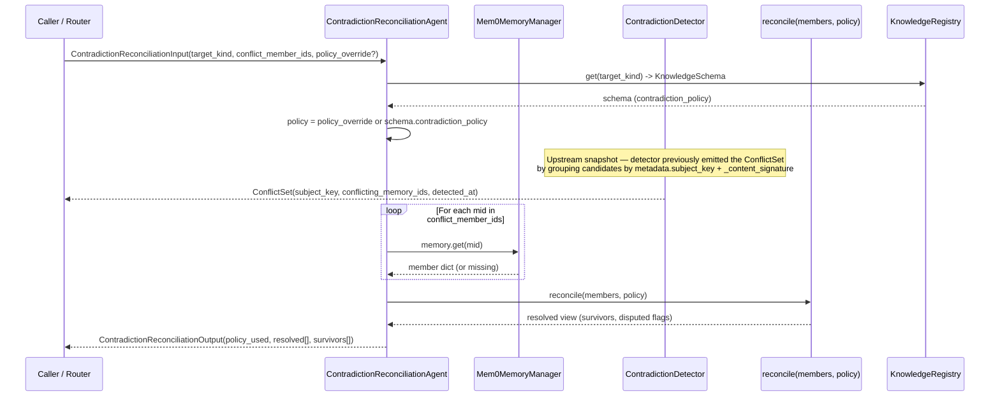
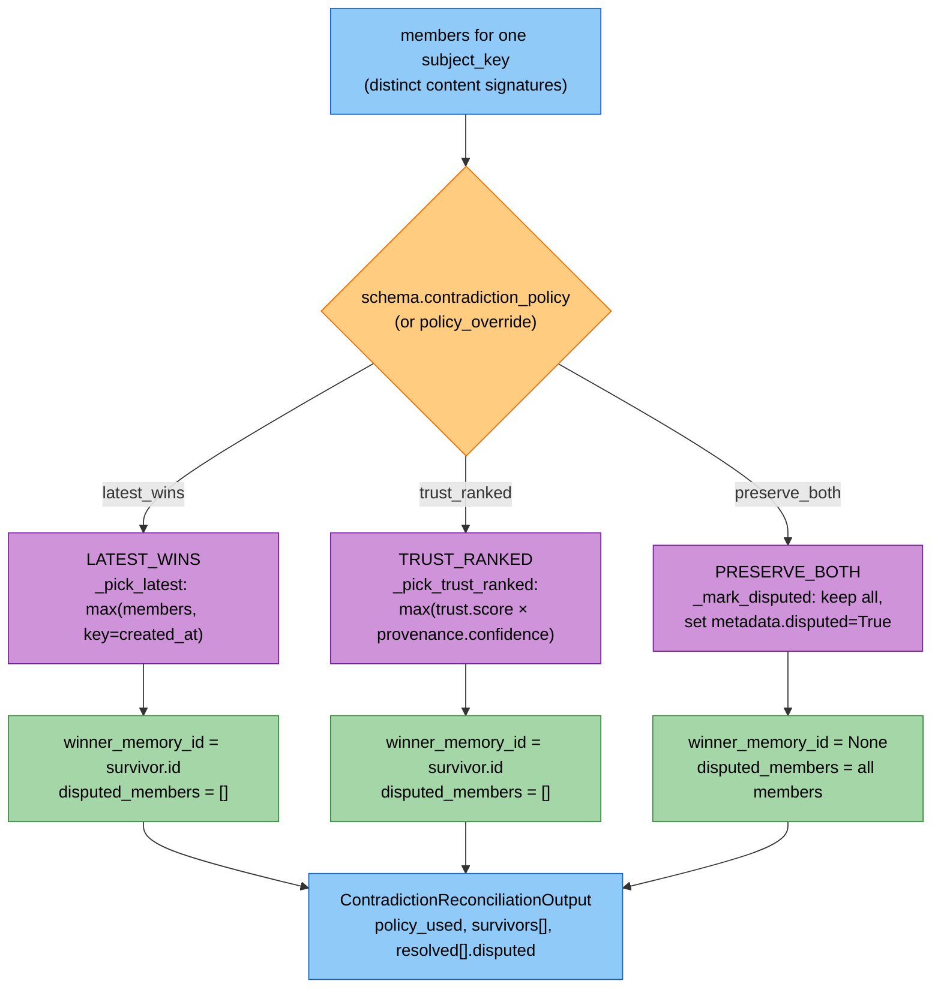
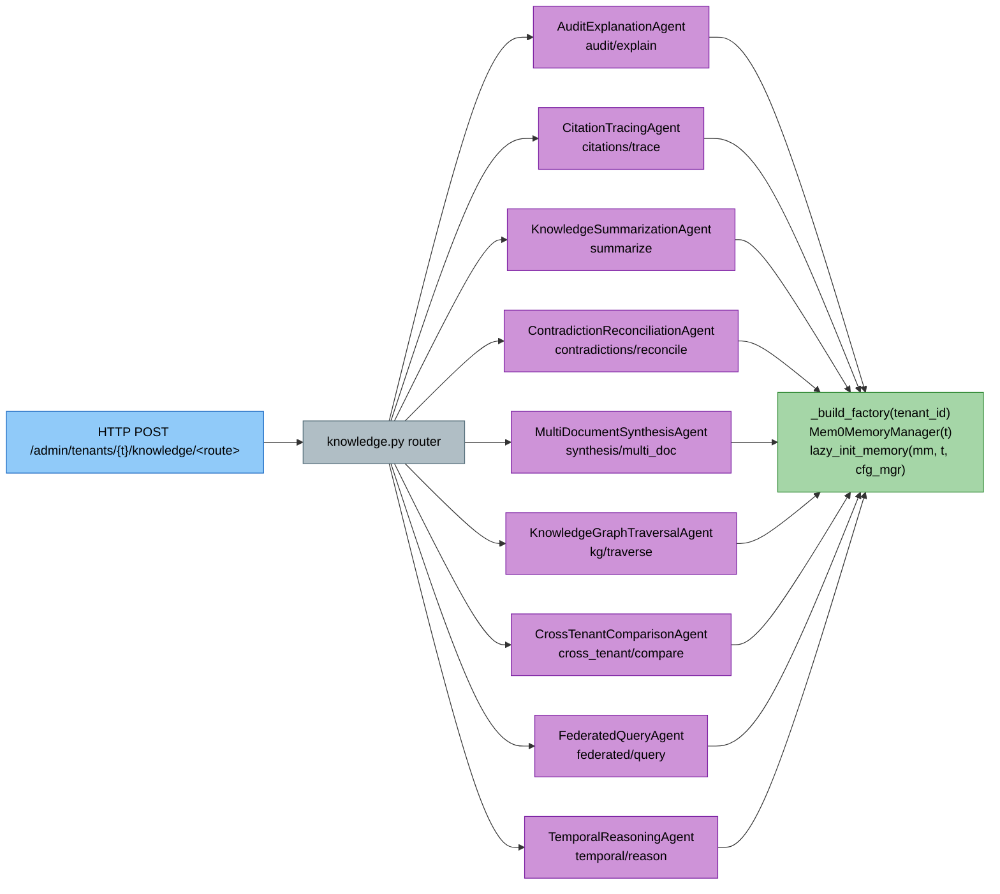
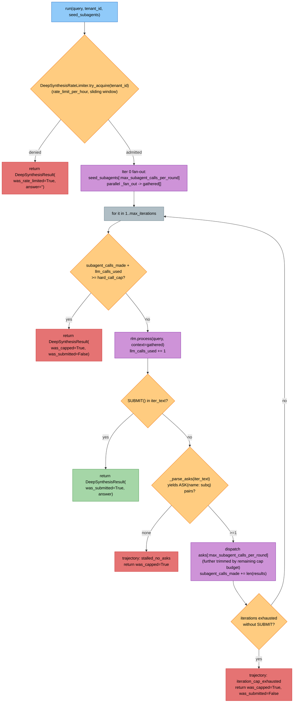
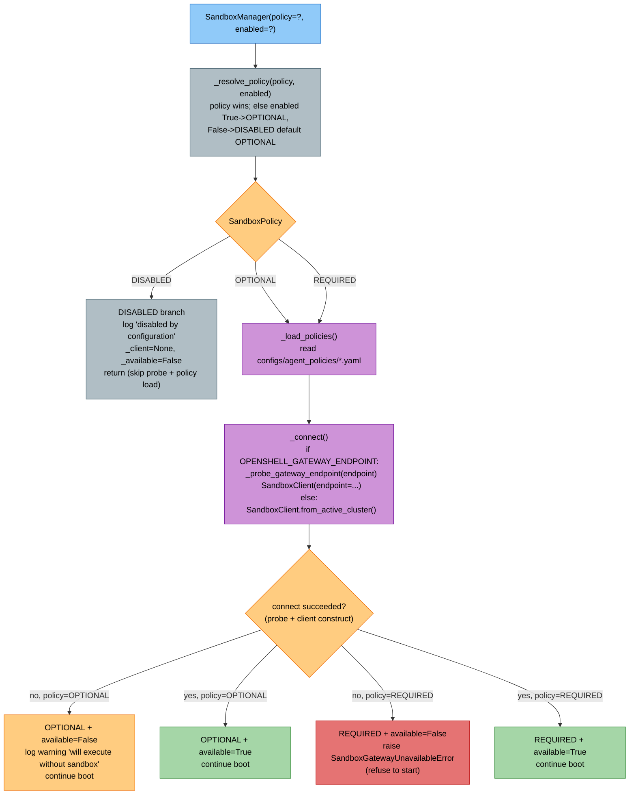
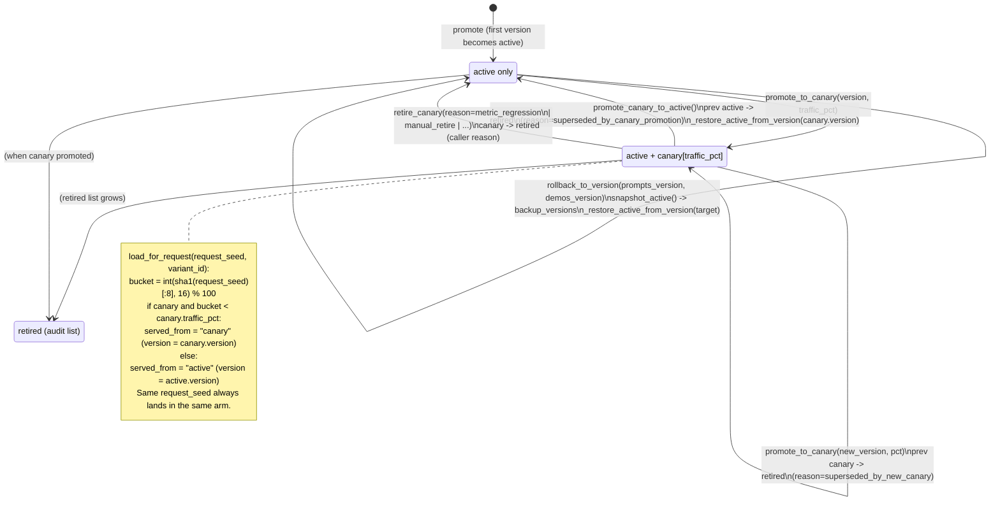
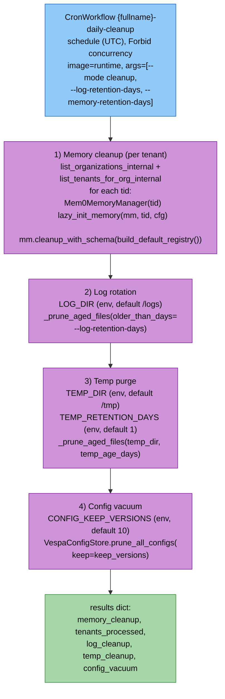
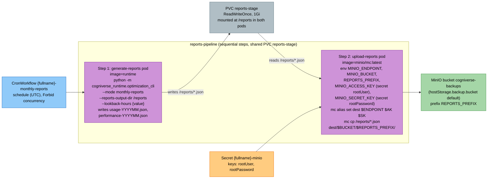

# Knowledge System Diagrams
---

## Table of Contents
1. [Contradiction Reconciliation Agent Flow](#contradiction-reconciliation-agent-flow)
2. [9-Agent Knowledge Dispatch](#9-agent-knowledge-dispatch)
3. [DeepSynthesisWorkflow Loop](#deepsynthesisworkflow-loop)
4. [Sandbox Boot Policy Decision](#sandbox-boot-policy-decision)
5. [Optimizer Canary FSM](#optimizer-canary-fsm)
6. [Daily-Cleanup Workflow + Monthly-Reports Upload](#daily-cleanup-workflow--monthly-reports-upload)

---

## Contradiction Reconciliation Agent Flow

`ContradictionReconciliationAgent._process_impl`
(`libs/agents/cogniverse_agents/contradiction_reconciliation_agent.py`)
takes a `subject_key`'s `conflict_member_ids`, fetches each via
`memory_manager.memory.get(mid)`, then calls `reconcile(members, policy)`
from `libs/core/cogniverse_core/memory/contradiction.py`. The
`ContradictionDetector` upstream groups by `metadata.subject_key` and
emits one `ConflictSet` per subject with more than one distinct
`_content_signature`. The resolved view depends on the schema's
`contradiction_policy` (or a request-time `policy_override`).

Within `reconcile`, the per-subject branch picks the survivor by policy:

---

## 9-Agent Knowledge Dispatch

`libs/runtime/cogniverse_runtime/routers/knowledge.py` exposes nine
`/admin/tenants/{tenant_id}/knowledge/...` POST routes, one per
knowledge agent. Every route resolves the per-tenant Mem0 instance
through `_build_factory(tenant_id)` which constructs
`Mem0MemoryManager(tenant_id)` and calls
`lazy_init_memory(mm, tenant_id, _require_config_manager())` when
`mm.memory` is not yet wired. The same factory is either passed as
`memory_manager_factory=` or attached via `_inject_memory(...)` (which
sets `agent.memory_manager`, `_memory_initialized`,
`_memory_tenant_id`, `_memory_agent_name`).

---

## DeepSynthesisWorkflow Loop

`DeepSynthesisWorkflow.run`
(`libs/agents/cogniverse_agents/deep_synthesis_workflow.py`) wraps the
orchestrator in an RLM trajectory bounded by three explicit caps: a
per-tenant sliding-window rate limit
(`DeepSynthesisRateLimiter.try_acquire`), a cumulative
`hard_call_cap` over `subagent_calls_made + llm_calls_used`, and a
`max_iterations` ceiling. Each RLM step either contains the `SUBMIT()`
token (answer ready) or emits `ASK(<subagent>: <subquery>)` markers
that get parsed and fanned out, capped per round by
`max_subagent_calls_per_round`.

---

## Sandbox Boot Policy Decision

`SandboxManager.__init__`
(`libs/runtime/cogniverse_runtime/sandbox_manager.py`) resolves a
`SandboxPolicy` (with the deprecated `enabled` kwarg mapped to
`OPTIONAL`/`DISABLED`) and either short-circuits on `DISABLED` or
calls `_connect()`, which TCP-probes
`OPENSHELL_GATEWAY_ENDPOINT` via `_probe_gateway_endpoint`. When the
resolved policy is `REQUIRED` and `_available` is still False after
the probe, the constructor raises `SandboxGatewayUnavailableError` so
boot fails loud.

---

## Optimizer Canary FSM

`ArtifactManager`
(`libs/agents/cogniverse_agents/optimizer/artifact_manager.py`)
stores a per-`(tenant, agent)` JSON state blob with `active`, `canary`,
and `retired[]` slots. `promote_to_canary`, `promote_canary_to_active`,
`retire_canary`, and `rollback_to_version` mutate the slots and snapshot
the relevant versions; `load_for_request` then routes each call to the
canary or active arm using a stable
`sha1(request_seed) % 100 < traffic_pct` decision.

---

## Daily-Cleanup Workflow + Monthly-Reports Upload

`optimization_cli.run_cleanup`
(`libs/runtime/cogniverse_runtime/optimization_cli.py`) runs as a
single Argo CronWorkflow pod (`{fullname}-daily-cleanup`,
`charts/cogniverse/templates/optimization-workflows.yaml`) that
executes four sequential sections per tick: schema-driven per-tenant
Mem0 cleanup, log rotation, temp purge, and config-store version
vacuum. `run_monthly_reports` runs as a two-step Argo pipeline sharing
a `reports-stage` PVC: the runtime image generates the JSON, then a
`minio/mc:latest` pod uploads it to the `cogniverse-backups` bucket
using credentials from the `{fullname}-minio` Secret.

---
