# Multi-Tenant Architecture Diagrams

**Last Updated:** 2025-10-15
**Purpose:** Comprehensive visual documentation of multi-tenant architecture patterns

---

## Table of Contents
1. [Tenant Isolation Overview](#tenant-isolation-overview)
2. [Schema-Per-Tenant Pattern](#schema-per-tenant-pattern)
3. [Tenant Data Flow](#tenant-data-flow)
4. [Phoenix Project Isolation](#phoenix-project-isolation)
5. [Memory Isolation](#memory-isolation)
6. [Deployment Patterns](#deployment-patterns)

---

## Tenant Isolation Overview

### Multi-Tenant System Architecture

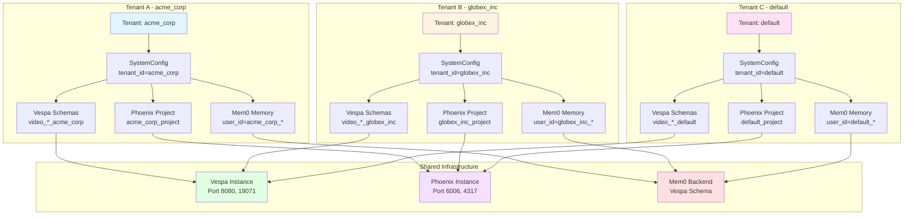

### Tenant Isolation Layers

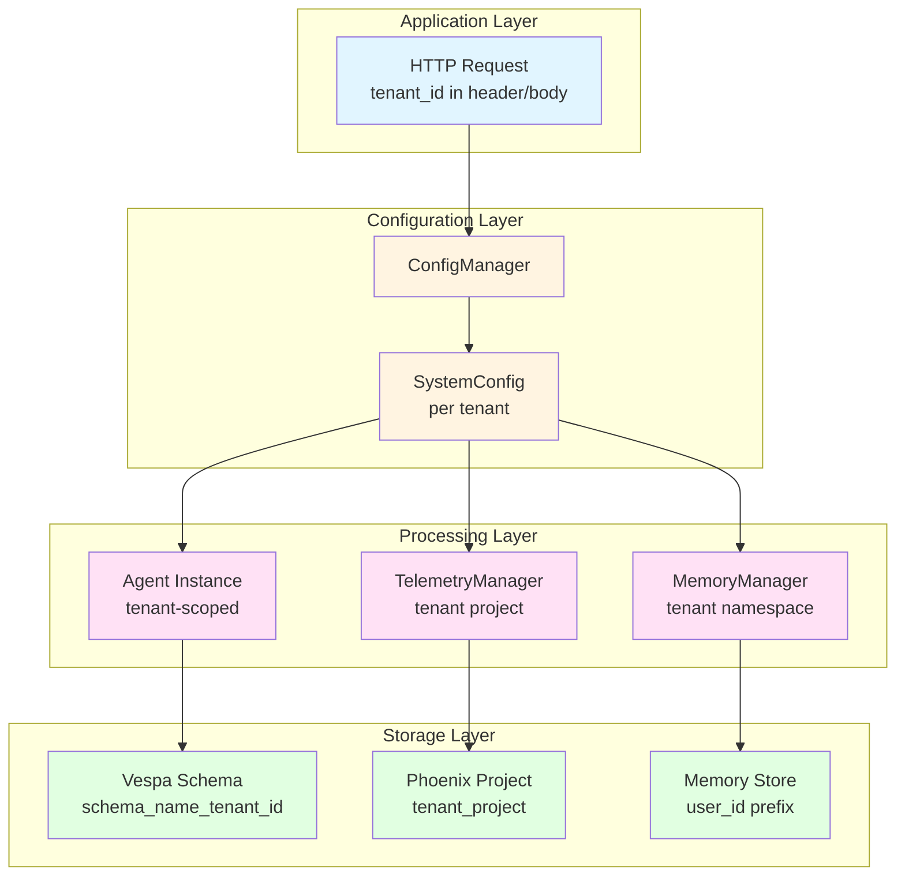

---

## Schema-Per-Tenant Pattern

### Vespa Schema Naming Convention

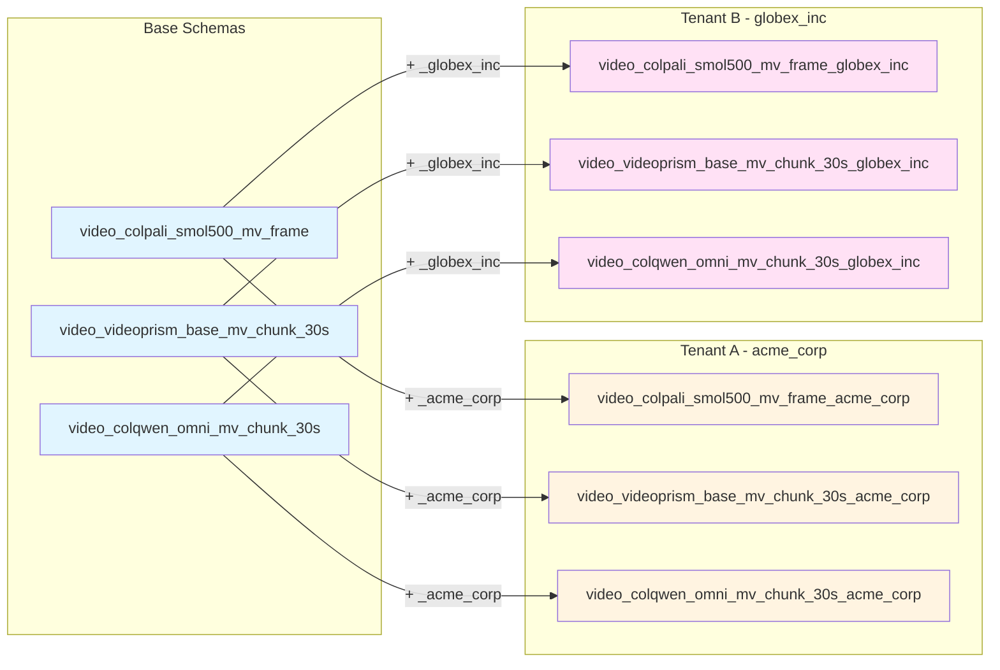

### Schema Deployment Flow (Multi-Tenant)

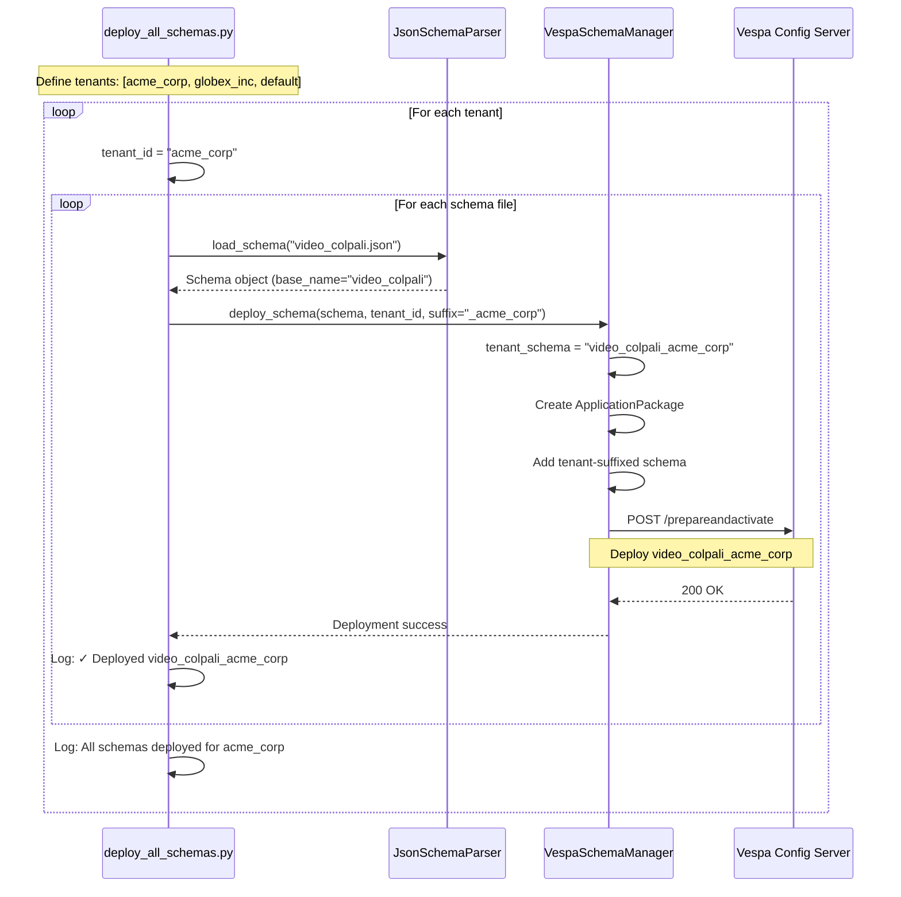

### Schema Isolation in Vespa

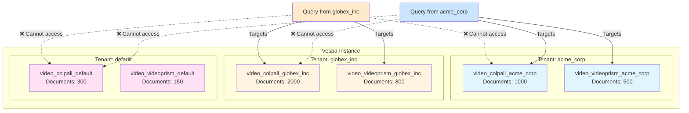

---

## Tenant Data Flow

### Video Ingestion Flow (Tenant-Specific)

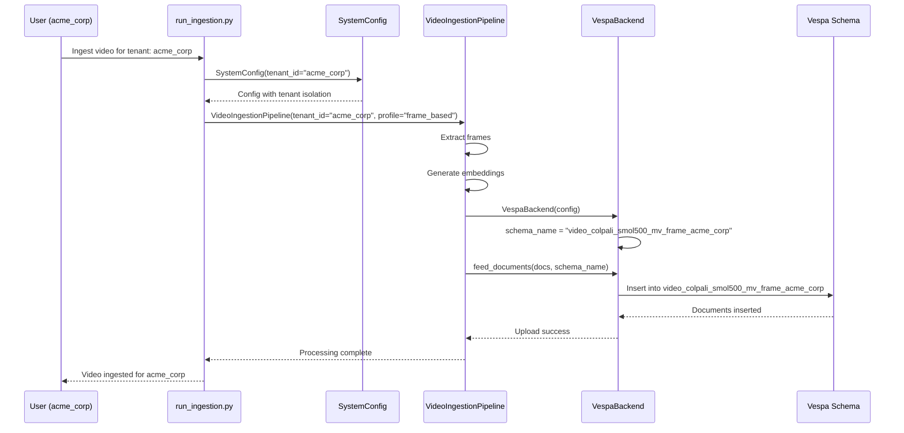

### Search Flow (Tenant-Isolated)

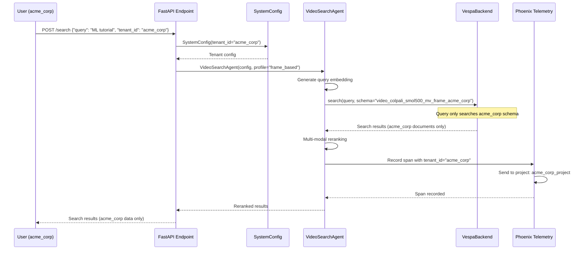

### Cross-Tenant Isolation Verification

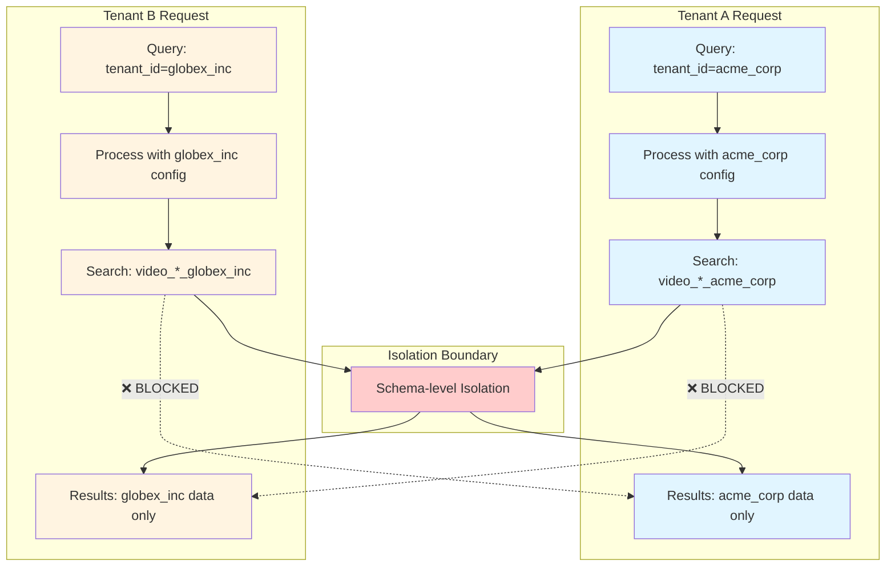

---

## Phoenix Project Isolation

### Per-Tenant Phoenix Projects

```mermaid
graph TB
    subgraph "Phoenix Instance (Port 6006)"
        subgraph "Project: acme_corp_project"
            SpansA[Spans<br/>All acme_corp traces]
            ExperimentsA[Experiments<br/>acme_corp evaluations]
            DatasetsA[Datasets<br/>acme_corp queries]
        end

        subgraph "Project: globex_inc_project"
            SpansB[Spans<br/>All globex_inc traces]
            ExperimentsB[Experiments<br/>globex_inc evaluations]
            DatasetsB[Datasets<br/>globex_inc queries]
        end

        subgraph "Project: default_project"
            SpansC[Spans<br/>All default traces]
            ExperimentsC[Experiments<br/>default evaluations]
            DatasetsC[Datasets<br/>default queries]
        end
    end

    TenantA[Tenant: acme_corp] --> SpansA
    TenantA --> ExperimentsA
    TenantA --> DatasetsA

    TenantB[Tenant: globex_inc] --> SpansB
    TenantB --> ExperimentsB
    TenantB --> DatasetsB

    TenantC[Tenant: default] --> SpansC
    TenantC --> ExperimentsC
    TenantC --> DatasetsC

    style SpansA fill:#e1f5ff
    style ExperimentsA fill:#e1f5ff
    style DatasetsA fill:#e1f5ff
    style SpansB fill:#fff4e1
    style ExperimentsB fill:#fff4e1
    style DatasetsB fill:#fff4e1
    style SpansC fill:#ffe1f5
    style ExperimentsC fill:#ffe1f5
    style DatasetsC fill:#ffe1f5
```

### Telemetry Flow (Per-Tenant Phoenix Projects)

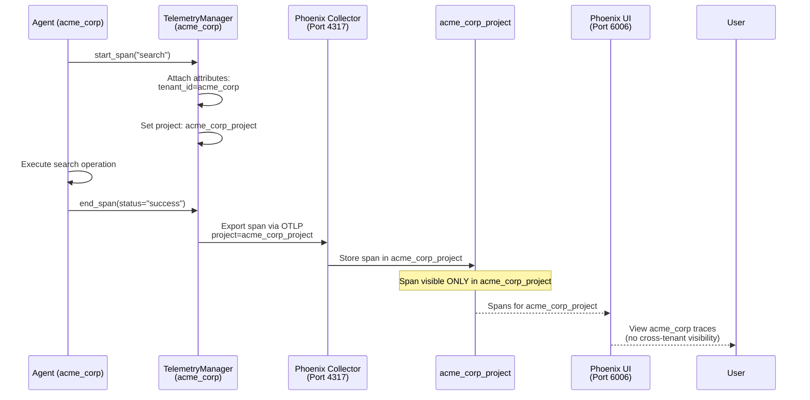

### Phoenix UI Access Pattern

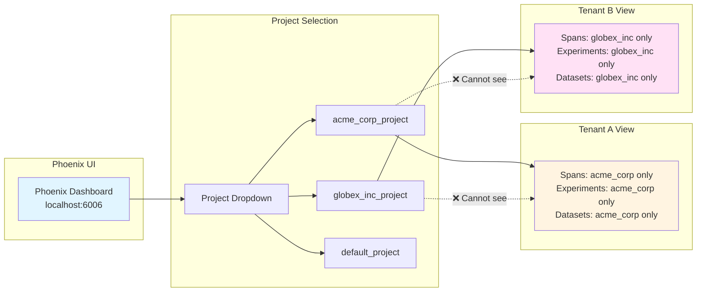

---

## Memory Isolation

### Mem0 Memory Isolation with User ID Prefix

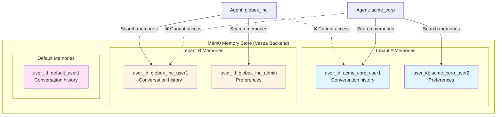

### Memory Manager Flow (Tenant-Aware)

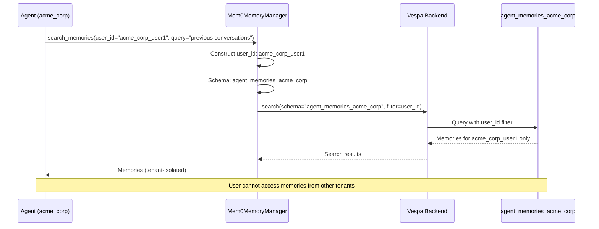

### Memory Schema Naming (Per-Tenant)

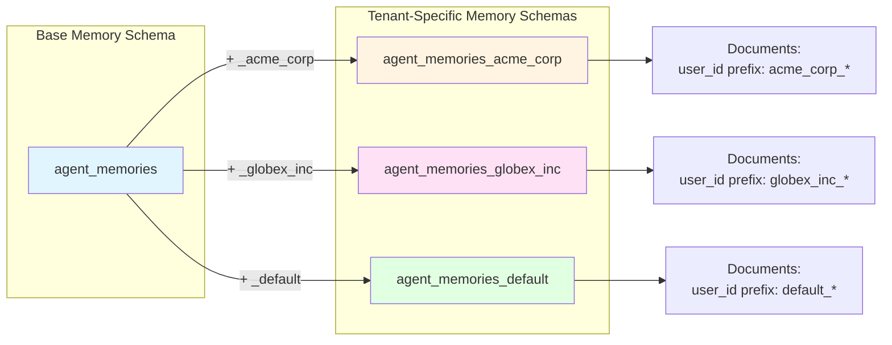

---

## Deployment Patterns

### Single Vespa Instance Multi-Tenant Deployment

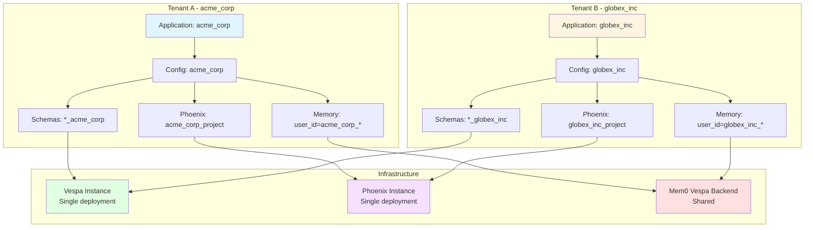

### Tenant Lifecycle Management

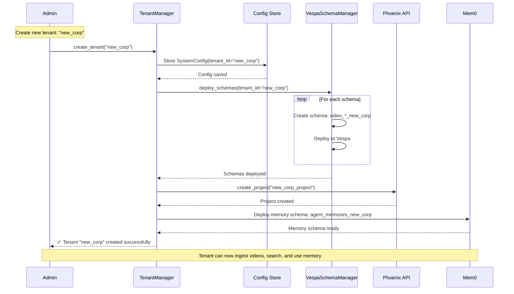

### Tenant Deletion/Cleanup Flow

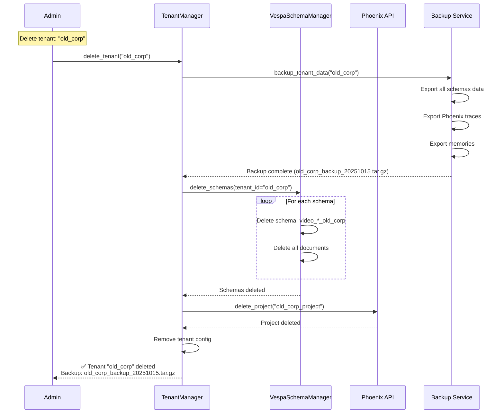

### Multi-Region Deployment (Future)

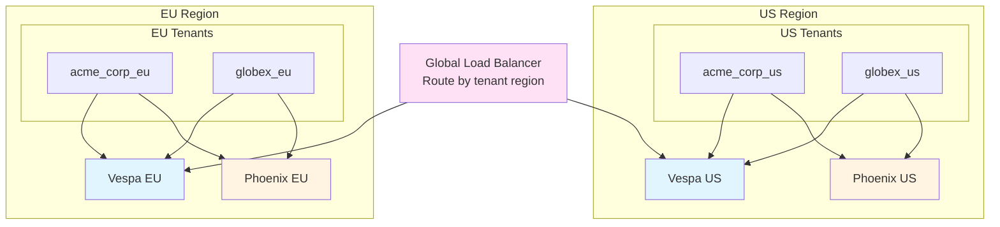

---

## Summary

This diagram collection provides comprehensive visual documentation of multi-tenant architecture:

1. **Tenant Isolation**: Complete separation at schema, project, and memory levels
2. **Schema-Per-Tenant**: Naming convention with `_tenant_id` suffix
3. **Data Flow**: Tenant-specific routing from ingestion to search
4. **Phoenix Projects**: Per-tenant observability with project isolation
5. **Memory Isolation**: User ID prefixes and tenant-specific schemas
6. **Lifecycle Management**: Tenant creation, deletion, and backup workflows

**Key Principles:**
- **Schema Isolation**: Each tenant has dedicated Vespa schemas
- **Project Isolation**: Each tenant has dedicated Phoenix project
- **Memory Isolation**: User IDs prefixed with tenant_id
- **No Cross-Tenant Access**: Firewall at every layer
- **Shared Infrastructure**: Single Vespa/Phoenix instances serve all tenants

**Tenant Naming Conventions:**
- Vespa schemas: `{base_schema}_{tenant_id}`
- Phoenix projects: `{tenant_id}_project`
- Memory user IDs: `{tenant_id}_{user_id}`

**Related Documentation:**
- [Multi-Tenant Architecture](../architecture/multi-tenant.md)
- [Multi-Tenant Operations](../operations/multi-tenant-ops.md)
- [Configuration Guide](../operations/configuration.md)
